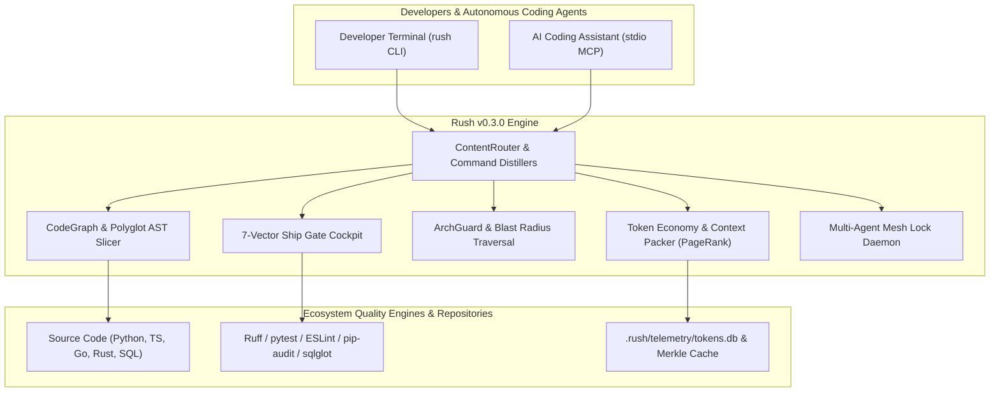

# Rush CLI

<div align="center">

```
  ____  _   _ ____  _   _ 
 |  _ \| | | / ___|| | | |
 | |_) | | | \___ \| |_| |
 |  _ <| |_| |___) |  _  |
 |_| \_\\___/|____/|_| |_|
```

### **The Unified Context Intelligence, Code Quality & Ship-Readiness Platform for AI Coding Agents and Developers.**

[](https://python.org)
[](https://modelcontextprotocol.io)
[](https://slsa.dev)
[](LICENSE)
[](https://github.com/astral-sh/ruff)
[](tests/)

---

[Key Features](#key-features) • [Tech Stack](#tech-stack) • [Quick Start](#quick-start) • [Architecture](#architecture) • [Token Economy](#token-economy--context-optimization-7590-token-reduction) • [CLI Reference](#cli-command-catalog) • [MCP Tools](#fastmcp-tool-reference-22-tools) • [Configuration](#configuration-rushtoml) • [Troubleshooting](#troubleshooting)

</div>

---

## Overview

**Rush** is an agentic code-quality CLI and stdio-only Model Context Protocol (FastMCP) platform. It provides a single, safe, deterministic command interface for all static analysis, AST code property graphs, token economy compression, architectural boundary governance, and pre-flight ship-readiness verification across your codebase.

Rush bridges the gap between raw developer tools (Ruff, ESLint, pytest, pip-audit, Tree-Sitter, sqlglot) and autonomous AI coding assistants (Claude Desktop, Cursor, Codex, Antigravity, OpenCode). It acts as a token-saving **Context Filter**, **AST Skeletons Engine**, **Graph-Theoretic Blast Radius Analyzer**, and **Multi-Agent Lock Coordinator**.



---

## Key Features

### 1. ⚡ Token Economy & Context Optimization (75–90% Token Reduction)
* **Graph-Pruned Context Packing (`rush context pack`)**: Combines PageRank symbol importance and verbatim focus definitions with surrounding AST skeletons under a strict token budget cap (e.g. `--budget 4000`).
* **Prompt Cache Prefix Aligner (`rush context align-prompt`)**: Automatically structures static system prompt prefixes $\ge 1,024$ tokens and injects ephemeral cache-control headers, achieving $\ge 85\%$ KV cache hit rates on Claude 3.7 / GPT-4.
* **Multi-Turn Stale Read Sweeper**: Automatically prunes bloated file reads from earlier turns, replacing them with single-line signatures (`<!-- stale_read: collapsed 80 lines -->`).
* **Terse Persona Output Shaper (`rush context persona --set terse`)**: Eliminates conversational preamble and repetitive summaries, slashing output tokens by 40–60%.
* **Context Gain Terminal HUD (`rush context gain`)**: Real-time Rich TUI dashboard tracking gross vs. compressed tokens and dollar savings in `.rush/telemetry/tokens.db`.

### 2. 🛡️ Architectural Boundary & Blast Radius Governance
* **Transitive Blast Radius Analyzer (`rush blast-radius --path <FILE>`)**: Traverses AST imports across the repository to determine downstream affected files, API endpoints, and recommended unit tests in $<25\text{ ms}$.
* **Declarative Architecture Guard (`rush arch-guard`)**: Enforces clean architecture directional layer matrices (e.g. `domain` $\rightarrow$ `application` $\rightarrow$ `infrastructure` $\rightarrow$ `presentation`), blocking reverse or circular imports.

### 3. 🧪 Autonomous Test Healing & API Contract Safety
* **Flaky Test Healer (`rush test-heal --target <TEST>`)**: Spawns isolated ephemeral Git worktrees (`.rush/worktrees/sandbox-*`), perturbs execution order/timing, diagnoses async race conditions, and synthesizes stabilization fixtures.
* **Public API Contract Differ (`rush api-diff --base main`)**: Compares AST public function/class signatures against base Git branches, catching removed exports or altered parameters before PR merge.

### 4. 🗄️ Database Schema Drift & Code Simplification
* **ORM-to-Migration Schema Drift Auditor (`rush db-drift`)**: Cross-references ORM models (SQLAlchemy, SQLModel) against SQL/Alembic migration scripts to catch unmigrated columns.
* **Cognitive Complexity Decomposer (`rush simplify --file <PATH>`)**: Scans AST branches for functions with cognitive complexity $>10$ and suggests modular sub-function abstractions.
* **Runtime Type Guard Synthesizer (`rush strictify --file <PATH>`)**: Generates runtime `isinstance` / assertion type guards for untyped function arguments.

### 5. 🐝 Multi-Agent Mesh & Swarm Reconciliation
* **Spec-to-Code Traceability (`rush trace`)**: Audits requirement tags (`[REQ-001]`, `FR-XX-YY`) across documentation, AST source implementations, and test assertions.
* **Agent Flight Recorder (`rush flight-recorder`)**: Records JSON-RPC tool events with millisecond timestamps into `.rush/sessions/flights/` for deterministic post-mortem replay.
* **Swarm 3-Way AST Merge (`rush swarm-merge`)**: Merges non-overlapping method and class additions from concurrent agent branches at the AST level without textual merge conflict markers.
* **Local FastMCP Mesh Lock Daemon**: Provides non-blocking mutex locks (`rush_mesh_acquire_lock`) over file paths to eliminate multi-agent write collisions.

### 6. 🔒 SLSA Level 3 Attestation & Supply Chain Security
* **SLSA Build Provenance (`rush attest --out <FILE>`)**: Generates verifiable in-toto JSON provenance statements linking artifact SHA-256 digests to source Git commit hashes.
* **Copyleft License Matrix (`rush license-matrix`)**: Classifies dependency licenses (Permissive, Weak Copyleft, Strong Copyleft) to prevent viral GPL/AGPL contamination.
* **Least-Privilege IAM Policy Synthesizer (`rush iam-audit`)**: Statically inspects AWS `boto3` / GCP SDK calls and generates minimal JSON IAM policies.
* **Dead Asset Pruner (`rush dead-asset`)**: Finds unreferenced images, fonts, and media files to minimize repo bloat.
* **Semantic PR Card Generator (`rush pr-synthesize`)**: Synthesizes structured PR descriptions integrating git diffs, blast radius, token savings, and test matrices.

---

## Tech Stack

| Layer | Component | Technology / Library |
|---|---|---|
| **Runtime & Toolchain** | Language Runtime | Python 3.12+ managed with `uv` |
| **Transport Protocols** | MCP Transport | FastMCP (`mcp==1.28.1`) via stdio JSON-RPC |
| **CLI & Terminal UI** | CLI Framework & TUI | Click 8.4+, Rich 13.9+ |
| **Code & AST Parsing** | Polyglot AST Engine | `tree-sitter==0.26.0`, Python `ast` |
| **Token Accounting** | BPE Tokenizer | `tiktoken==0.14.0` (o200k_base / cl100k_base) |
| **SQL & Migrations** | SQL DDL Parser | `sqlglot==30.17.0` |
| **Supply Chain Security** | Cryptographic Provenance | `cryptography==50.0.0` (in-toto / SLSA v0.2) |
| **Media & Images** | Layout & Image Optimization | `pillow==12.3.0` |
| **Workflow Emulation** | Workflow Parser | `ruamel.yaml==0.19.1` |
| **Persistence** | State & Telemetry Ledger | SQLite (WAL mode) in `.rush/` |

---

## Prerequisites

* **Python**: 3.12 or higher.
* **uv**: Recommended fast Python package manager (`curl -LsSf https://astral.sh/uv/install.sh` or `winget install astral-sh.uv`).
* **Git**: 2.30+ with worktree support.
* **Optional Quality Engines** (discovered from environment):
  * Python: `ruff`, `mypy`, `pytest`, `pip-audit`
  * TypeScript / JavaScript: `typescript` (`tsc`), `eslint`, `vitest`, `knip`
  * Rust: `cargo-clippy`, `cargo-audit`

---

## Quick Start

### 1. Clone & Setup Environment
```bash
git clone https://github.com/jamesdsizemore/rush-cli.git
cd rush-cli
uv sync --all-extras --frozen
```

### 2. Verify Installation
```bash
uv run rush --version
# Output: rush-cli 0.3.0
```

### 3. Run Everyday Quality Checks
```bash
# Full codebase review
uv run rush review .

# CodeGraph-pruned context packing for AI prompt
uv run rush context pack --path src/rush/cli.py --budget 3000

# View real-time token savings dashboard
uv run rush context gain

# Check architectural boundary rules
uv run rush arch-guard

# Run full pre-flight ship gate
uv run rush ship gate
```

---

## Model Context Protocol (MCP) Integration

Rush provides a **stdio-only FastMCP server** designed for direct integration with AI coding assistants. Diagnostics and telemetry are written strictly to `stderr`, keeping `stdout` dedicated to JSON-RPC.

### Claude Desktop Configuration
Add to your `claude_desktop_config.json`:

```json
{
  "mcpServers": {
    "rush": {
      "command": "uv",
      "args": [
        "--directory",
        "/absolute/path/to/rush-cli",
        "run",
        "rush",
        "mcp",
        "serve"
      ]
    }
  }
}
```

### Cursor & OpenCode Configuration
Add to `.cursor/mcp.json` or `.opencode/mcp.json`:

```json
{
  "mcpServers": {
    "rush": {
      "command": "rush",
      "args": ["mcp", "serve"],
      "transport": "stdio"
    }
  }
}
```

---

## CLI Command Catalog

### Quality, Formatting & Testing
| Command | Options | Description |
|---|---|---|
| `rush review <PATH>` | `--use-graft`, `--json` | Run heuristic AST and quality review. |
| `rush lint <PATH>` | `--engine <NAME>` | Run linter (Ruff, ESLint, Clippy) with unified output. |
| `rush format <PATH>` | `--check` | Verify code formatting without mutating files. |
| `rush test <PATH>` | `--filter <PATTERN>` | Execute test runners with canonical ToolResult reporting. |
| `rush security <PATH>` | `--strict` | Run dependency and vulnerability scanners (`pip-audit`, `cargo-audit`). |
| `rush slop <PATH>` | `--threshold <FLOAT>` | Detect repetitive AI code patterns, hallucinated imports, and bloated boilerplate. |
| `rush tdd <PATH>` | `--verify` | Enforce test-driven development invariants before code edits. |

### Context Intelligence & Token Economy
| Command | Options | Description |
|---|---|---|
| `rush context pack` | `--path <FILE>`, `--symbol <SYM>`, `--budget <INT>` | Pack verbatim symbol code + AST skeletons under token budget caps. |
| `rush context align-prompt`| `--system <PROMPT>` | Align system prompt prefixes (>= 1024 tokens) for provider KV cache hits. |
| `rush context gain` | (Interactive TUI) | Launch terminal HUD displaying real-time token compression and dollar savings. |
| `rush context persona` | `--set terse|default` | Configure concise agent response shaper stripping conversational fluff. |
| `rush toon-inspect <PATH>` | `--depth <INT>` | Inspect Token-Optimized Object Notation (TOON v4.1) wire serialization. |
| `rush skeletonize <PATH>` | `--output <FILE>` | Extract polyglot AST outlines stripping function bodies. |

### Architecture & Contracts
| Command | Options | Description |
|---|---|---|
| `rush blast-radius` | `--path <FILE>`, `--depth <INT>` | Compute transitive downstream file, API route, and test impact. |
| `rush arch-guard` | None | Validate module imports against clean architecture layer matrices. |
| `rush test-heal` | `--target <TEST>`, `--runs <INT>` | Diagnose non-deterministic test race conditions in isolated git sandboxes. |
| `rush api-diff` | `--base <BRANCH>` | Detect breaking public API signature modifications against base Git ref. |
| `rush db-drift` | None | Audit ORM data models against SQL migrations to flag unmigrated schema drift. |
| `rush simplify` | `--file <FILE>`, `--max-complexity <INT>`| Identify functions exceeding cognitive complexity thresholds and outline helper extractions. |
| `rush strictify` | `--file <FILE>` | Synthesize runtime type guards (`isinstance`, assertions) for unvalidated arguments. |

### Multi-Agent Swarms & Release
| Command | Options | Description |
|---|---|---|
| `rush trace` | None | Generate requirement-to-implementation-to-test compliance traceability matrix. |
| `rush flight-recorder` | `--replay <SESSION_ID>` | Record and replay agent tool call execution streams. |
| `rush swarm-merge` | `--base <F>`, `--ours <F>`, `--theirs <F>` | Resolve concurrent agent git merge conflicts at AST level without conflict markers. |
| `rush simulate-ci` | `--workflow <FILE>` | Emulate local execution of GitHub Actions CI workflows. |
| `rush attest` | `--out <FILE>` | Generate in-toto SLSA Level 3 cryptographic build provenance statements. |
| `rush license-matrix` | None | Audit dependencies for GPL/AGPL viral copyleft risk. |
| `rush iam-audit` | None | Synthesize least-privilege cloud IAM policies from SDK usage. |
| `rush dead-asset` | None | Find unreferenced fonts, images, and static assets. |
| `rush pr-synthesize` | `--base <BRANCH>` | Generate structured semantic GitHub PR cards. |
| `rush ship gate` | `--strict` | Run full 7-vector pre-flight ship-readiness verification. |

---

## FastMCP Tool Reference (22 Tools)

When running `rush mcp serve`, the following tools are available to AI agents:

1. `rush_context_pack(path, symbol, budget)`: Retrieve token-budgeted verbatim symbols and AST skeletons.
2. `rush_context_gain_stats()`: Retrieve session token savings, compression ratios, and dollar metrics.
3. `rush_context_skeletonize(path)`: Extract compressed AST outline skeletons for a target source file.
4. `rush_context_cache_manifest()`: Retrieve Merkle DAG content-addressable cache block manifests.
5. `rush_context_retrieve(query, top_k)`: Retrieve codebase chunks using multi-vector embeddings and CCR chunk store.
6. `rush_hallu_guard(proposed_code)`: Verify that imported symbols actually exist in the codebase.
7. `rush_context_mistakes_check(pattern)`: Check proposed changes against past codebase anti-patterns in Mistake Memory.
8. `rush_blast_radius(path, depth)`: Calculate downstream transitive blast radius and affected tests.
9. `rush_arch_guard()`: Validate codebase against declarative architectural layer boundaries.
10. `rush_test_heal(target, runs)`: Diagnose flaky test race conditions in isolated sandbox and propose fixes.
11. `rush_api_diff(base)`: Detect breaking public API contract changes against base Git ref.
12. `rush_db_drift()`: Audit ORM models against migrations to detect schema drift.
13. `rush_simplify(file, max_complexity)`: Decompose high-complexity functions into modular helpers.
14. `rush_strictify(file)`: Synthesize runtime type guards for unvalidated parameters.
15. `rush_trace()`: Scan codebase and specs to output requirement traceability matrix.
16. `rush_mesh_acquire_lock(path, agent_id)`: Acquire non-blocking multi-agent file lock.
17. `rush_mesh_release_lock(path, agent_id)`: Release multi-agent file lock.
18. `rush_swarm_merge(base_code, ours_code, theirs_code)`: Execute 3-way AST merge conflict resolution.
19. `rush_attest_generate(artifact_path)`: Generate in-toto SLSA Level 3 provenance statement.
20. `rush_license_matrix()`: Audit open-source dependencies for license risks.
21. `rush_iam_audit()`: Synthesize least-privilege cloud IAM policy.
22. `rush_pr_synthesize(base_branch)`: Synthesize structured semantic pull request card.

---

## Configuration (`rush.toml`)

Customize Rush behavior via `rush.toml` in your project root:

```toml
[rush]
version = "0.3.0"
default_format = "toon"

[token_economy]
budget_cap = 4000
cache_alignment_threshold = 1024
stale_sweep_enabled = true
persona_style = "terse"

[architecture.layers]
domain = []
application = ["domain"]
infrastructure = ["application", "domain"]
presentation = ["application", "domain"]

[ship.gate]
require_clean_git = true
require_tests = true
require_slsa_attestation = true
max_cognitive_complexity = 15
```

---

## Architecture & Directory Structure

```
rush-cli/
├── src/rush/
│   ├── cli.py                  # Click CLI routing groups
│   ├── mcp.py                  # FastMCP stdio server & tool registrations
│   ├── catalog.py              # Canonical tool catalog specifications
│   ├── codegraph/              # Polyglot AST CodeGraph & Context Packing
│   │   ├── context_packer.py   # PageRank-pruned context packing
│   │   ├── graph_store.py      # SQLite CodeGraph persistence
│   │   └── slicer.py           # Tree-Sitter verbatim slicer
│   ├── token_economy/          # Token economy & context distillation
│   │   ├── cache_aligner.py    # KV cache boundary padding
│   │   ├── stale_sweeper.py    # Multi-turn history compression
│   │   ├── telemetry.py        # SQLite tokens.db ledger
│   │   ├── output_shaper.py    # Terse persona filter
│   │   └── tui_gain.py         # Rich terminal gain HUD
│   ├── mcp_mesh/               # Multi-agent concurrency mesh
│   │   ├── daemon.py           # Lock daemon
│   │   └── lock_manager.py     # File mutex coordinator
│   ├── core/                   # Core runtime infrastructure
│   │   ├── git_sandbox.py      # Ephemeral git worktree manager
│   │   └── router.py           # ContentRouter
│   ├── tools/                  # 42 Canonical Quality & Ship Tools
│   │   ├── blast_radius.py     # Downstream reachability analyzer
│   │   ├── arch_guard.py       # Directional layer matrix validator
│   │   ├── test_heal.py        # Autonomous flaky test healer
│   │   ├── api_diff.py         # Public API signature contract differ
│   │   ├── db_drift.py         # ORM schema drift auditor
│   │   ├── simplify.py         # Cognitive complexity decomposer
│   │   ├── strictify.py        # Runtime type guard synthesizer
│   │   ├── trace.py            # Spec traceability scanner
│   │   ├── flight_recorder.py  # Session logger & replayer
│   │   ├── swarm_merge.py      # 3-way AST merge solver
│   │   ├── simulate_ci.py      # Local GHA emulator
│   │   ├── attest.py           # SLSA Level 3 build provenance
│   │   ├── license_matrix.py   # Copyleft risk scanner
│   │   ├── iam_audit.py        # Cloud IAM policy synthesizer
│   │   ├── dead_asset.py       # Dead media pruner
│   │   └── pr_synthesize.py    # Semantic PR description generator
│   └── hook/                   # Git hook security & branch guards
├── docs/                       # 294 Comprehensive documentation files
│   ├── specs/                  # Feature specifications
│   ├── workflows/              # Step-by-step developer workflows
│   ├── developer/              # Architecture, backlog, and issue logs
│   ├── user-guide/             # Everyday user guides
│   ├── maintainers/            # Release & governance playbooks
│   └── vibecoding/             # AI-native coding guides
└── tests/                      # Full pytest test suite (23 modules)
```

---

## Testing & Quality Assurance

Run the comprehensive test suite and linters:

```bash
# Run test suite
uv run pytest tests/ -v

# Run Ruff code format check
uv run ruff format --check src tests

# Run Ruff linter
uv run ruff check src tests
```

---

## Troubleshooting

### FastMCP Transport Conflicts
* **Symptom**: `JSONDecodeError` or corrupted RPC packets in Claude Desktop / Cursor.
* **Root Cause**: An external tool or subprocess printed raw text to `stdout`.
* **Fix**: Rush strictly routes all logging, diagnostics, and telemetry to `stderr` and executes all subprocesses with `stdin=DEVNULL`. Verify that no custom plugins print directly to `sys.stdout`.

### Missing Quality Engines
* **Symptom**: `rush lint` or `rush test` returns `status: skipped`.
* **Root Cause**: The underlying engine (e.g. `eslint`, `vitest`, `cargo-audit`) is not installed on the system PATH.
* **Fix**: Rush never silently installs dependencies. Install the required tool globally or in your project virtualenv (`npm install -g vitest`, `uv pip install ruff`).

### Ephemeral Worktree Lock Collisions
* **Symptom**: `fatal: '.rush/worktrees/sandbox-...' already exists`.
* **Fix**: Run `git worktree prune` to clean up orphaned worktrees from interrupted sessions.

---

## Contributing

We welcome contributions! Please follow our contributor guidelines:
1. Ensure all code conforms to Python 3.12+ and passes `ruff check` and `ruff format`.
2. Write unit tests for new tools in `tests/test_<name>.py`.
3. Update the 5-tier documentation matrix across `docs/` when adding new features or flags.
4. Verify canonical `ToolResult` shapes across both CLI and FastMCP transports.

See [`docs/developer/contributor-onboarding.md`](docs/developer/contributor-onboarding.md) for full details.

---

## License

Rush CLI is open-source software licensed under the [MIT License](LICENSE).\n