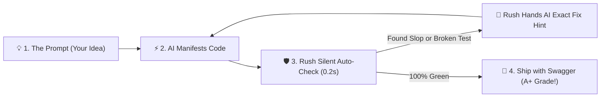
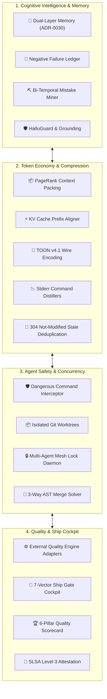

<div align="center">


[](pyproject.toml)
[](https://python.org)
[](https://modelcontextprotocol.io)
[](docs/specs/slsa-attestation-spec.md)
[](LICENSE)
[](https://github.com/astral-sh/ruff)
[Tests and current verification](docs/reports/phase-64-66-application-review.md) · [Engine catalog](docs/ENGINES.md) · [Documentation](docs/README.md)

<p align="center">
  
</p>

</div>


## 🌟 Executive Summary: What is Rush?

**Rush** is the unified context intelligence, persistent dual-layer memory, and pre-flight ship-readiness platform built from the ground up for **Vibecoders** and **Autonomous AI Coding Agents** (Cursor, Claude Code, Cline, Windsurf, Roo Code, GitHub Copilot).

Rush provides a Python 3.12 command-line application and a stdio Model Context Protocol (FastMCP) server for code checks, agent tools and scoped memory. Its catalog describes external engines; installed compatibility, target inputs and permissions determine which checks can execute. Token reduction depends on the actual input and measurement. Generating an attestation does not establish SLSA Level 3 compliance.

**Current implementation status:** the [whole-application review](docs/reports/phase-64-66-application-review.md) records unresolved runtime and integration defects at baseline `997b56e`. [Phase 64](docs/phase-plans/phase-64-runtime-correctness-and-safe-execution-plan.md) repairs those paths, [Phase 63](docs/phase-plans/phase-63-memory-capabilities-vibecoder-plan.md) extends memory, [Phase 65](docs/phase-plans/phase-65-project-provisioning-scan-and-agent-workflow-plan.md) connects installation/scanning/agents, and [Phase 66](docs/phase-plans/phase-66-interactive-tui-and-local-web-plan.md) delivers the persistent TUI and local web application -- implemented, with real source/test/runtime evidence in [Phase 66 implementation evidence](docs/phase-plans/phase-66-implementation-evidence.md). Other phases' requirements remain in scope where not yet independently evidenced; planned routes are not current installation or usage instructions.

```bash
# 30-second quickstart: initialize, sync multi-IDE rules, and review codebase
uv run rush init .
uv run rush governance sync
uv run rush review .
```

### One-command install (Phase 65 [P65-10](docs/phase-plans/phase-65-project-provisioning-scan-and-agent-workflow-plan.md#p65-10--one-command-installation-and-readiness-integration-f35-f42))

Once release assets are published, a single streamed command downloads a checksum-verified, self-contained `rush` executable, installs it under a user-owned binary directory, and connects every detected local coding agent -- no checkout, no Python, no `uv`:

```sh
curl -fsSL https://raw.githubusercontent.com/jamesdsizemore/rush-cli/main/scripts/install.sh | sh
```

```powershell
irm https://raw.githubusercontent.com/jamesdsizemore/rush-cli/main/scripts/install.ps1 | iex
```

Both scripts hand off to `rush install --agents all --memory on`, which is also the command an existing installation re-runs directly to upgrade, repair, or connect a project:

```bash
rush install --agents all --memory on --project /path/to/your/project
```

Omit `--project` to finish global setup with project selection pending -- that is a successful install, not a failed one; the current working directory is never auto-registered. `--agents none`/`--memory off` skip agent connection/consent; `--create NAME --parent DIR` creates and registers a new project folder instead of selecting an existing one. See the [MCP client setup guide](docs/integrations/mcp-client-setup.md) for per-agent connection detail. These scripts are not currently valid instructions against a published release; publishing is tracked separately from this implementation.


## ☕ The Vibecoder & AI Agent Hangover

Vibe-coding with AI models unlocks unprecedented developer velocity: you prompt a concept in natural language, and an entire full-stack feature manifests in seconds.

**However, unassisted AI generation introduces acute, compounding failure modes:**
1. **AI Slop & Phantom Imports**: Models hallucinate non-existent packages, leave empty placeholder stubs, and inject verbose, tautological comments.
2. **Context Window Token Bloat**: Passing whole files and 10,000-line test failure traces into LLMs burns thousands of dollars and causes prompt amnesia.
3. **Agent Amnesia Across Turns**: Multi-turn agents lose track of architectural decisions, repeatedly attempting the exact same failed patch fixes.
4. **Destructive Shell Invocations**: Unsupervised agents run dangerous shell commands (`git reset --hard`, `rm -rf`, uncontrolled Git mutations) or leak secrets.
5. **Multi-Agent Collision Chaos**: Concurrent subagents overwrite each other's files, producing corrupted AST states and merge conflicts.

Rush exposes local analysis, memory and token-processing functions through CLI and stdio MCP. Network scanners, provider evaluation and dependency retrieval require their own inputs and permissions. Latency, coverage and token savings must be measured for the selected workload.


## ⚡ 1. Vibecoding with Rush: Sub-Second Creative Flow

Vibecoding with Rush provides an automated safety net that catches errors before you even notice them:



### The 5 Vibecoder Subsystems
* 🧹 **Slop-Busting & Anti-Hallucination (`rush slop`, `rush tdd`)**: Parses AST nodes to purge AI filler comments, empty placeholder stubs, phantom imports, and missing test invariants.
* ⚡ **Instant Multi-Engine Auto-Fix (`rush fix`, `rush watch`)**: Background file watcher that automatically formats, fixes linter warnings, and maintains an atomic rollback journal (`SnapshotJournal.rollback_all()`).
* 📉 **Token Diet for Vibecoders (`rush context pack`, `rush token`)**: Reduces prompt token consumption by **75–90%** via PageRank symbol prioritization, AST skeletonization, and KV cache alignment.
* 🏆 **Shipping with Swagger (`rush score`, `rush ship gate`)**: Generates 6-pillar composite quality scorecards, interactive HTML reports, and live SVG badges.
* 📋 **Multi-IDE Rule Sync (`rush governance sync`)**: Compiles your master `AGENTS.md` rules into `.cursorrules`, `.windsurfrules`, `.clinerules`, and Claude Code configurations in 1 command.


## 🤖 2. Agentic Rush: Autonomous Agent Safety & Concurrency Mesh

Rush provides native runtime infrastructure for autonomous agents operating across complex repositories:

```mermaid
sequenceDiagram
    autonumber
    participant Dev as Developer
    participant Agent as AI Coding Agent (Cursor / Claude Code / Cline)
    participant Rush as Rush Agentic Platform
    participant Repo as Codebase Repository

    Dev->>Agent: Prompt: "Refactor auth and add rate limiting"
    Agent->>Rush: rush_context_pack(path="src/auth.py", budget=3000)
    Rush-->>Agent: Returns PageRank verbatim focus symbols + AST skeletons (78% token savings)
    Agent->>Rush: rush_mesh_acquire_lock(path="src/auth.py", agent_id="agent-1")
    Rush-->>Agent: [GRANTED] Non-blocking file mutex locked
    Agent->>Rush: Propose patch diff
    Rush->>Rush: Apply in isolated git worktree sandbox (.rush/worktrees/sandbox-*)
    Rush->>Rush: Run syntax checks, linters & unit tests
    alt Regression or Broken Test
        Rush-->>Agent: Verification failed; structured error trace returned
        Rush->>Rush: Record failed attempt in Negative Knowledge Failure Ledger
        Agent->>Agent: Self-corrects patch based on Rush feedback
    else Verification 100% Green
        Rush->>Repo: Atomically promote verified patch to main workspace
        Rush->>Rush: Record event in Flight Recorder (.rush/sessions/flights/)
        Rush-->>Dev: Return observed findings, test outcomes and unresolved gaps
    end
```


## 🏛️ 3. The 12 Foundational Pillars of Rush



---

### Pillar 1: Persistent Agent Memory (ADR-0049)
* **Current storage**: Phase 61's typed-artifact store uses `.rush/memory.db`, with compatibility readers and writers for earlier satellites. `rush session save` and `rush session restore` expose checkpoints. The older four-tier taxonomy is historical design, not the current artifact schema.
* **Layer 2 (Cognitive Innovation)**:
  * **Negative Knowledge Failure Ledger (`FailureLedger`)**: Records failed patch AST hashes and anti-patterns to intercept repeated mistakes across prompt turns.
  * **Bi-Temporal Git Revert Mistake Pre-Mortem (`rush context mistakes`, `MistakeMiner`)**: Extracts historical Git reverts into structured triplets:
    $$	ext{Believed (Intent)} \longrightarrow 	ext{Found False (Regression)} \longrightarrow 	ext{Truth Now (Guardrail)}$$
  * **AST-Merkle Invalidator (`MerkleInvalidator`)**: Tracks content dependencies when callers invoke it. Installation alone does not activate an edit watcher; connected invalidation and agent lifecycle delivery are Phase 63/65 requirements.
  * **Causal Architectural Invariant Graph (`InvariantGraph`)**: Tracks cross-module dependency invariants before code edits.

---

### Pillar 2: Token Economy, Context Packing & TOON v4.1 (ADRs 0022, 0032, 0038, 0039)
* **Context Packing (`rush context pack --path PATH`)**: Packs selected file evidence and AST outlines under a local token budget. Graph-ranked retrieval remains a Phase 63 requirement; current packing does not establish PageRank ranking.
* **Prompt Cache Prefix Aligner (`rush context align-prompt`)**: Locally aligns prompt prefixes. It does not observe provider cache hits or guarantee a cache-hit rate.
* **Compact Serialization**: Local serialization utilities retain the compact-result requirement. MCP remains JSON-RPC; percentage reductions require measured comparison, and no universal `--format toon` flag is registered.
* **Subprocess Command Distillers**: Distillers in `src/rush/token_economy/distillers/` summarize supported command output. Savings depend on input; Phase 63 benchmarks measure retained evidence and token effects.
* **Stale Tool Deduplication (ADR-0043)**: Content signatures support identifying repeated output. They do not establish automatic HTTP 304 delivery or a fixed token saving across every MCP call.
* **Terminal Gain (`rush context gain`)**: Prints a one-shot Rich token-savings HUD from recorded local estimates. Phase 66's persistent live equivalent is the Tokens section of `rush ui` and the web dashboard, both computed from the same `TelemetryStore` summary; estimated dollars are not provider billing measurements.

---

### Pillar 3: Agent Safety, Sandboxing & Circuit Breakers (ADRs 0004, 0020, 0021, 0024)
* **Dangerous Command Interceptor (`rush guard check-cmd`)**: Evaluates shell commands against a deterministic safety policy, blocking destructive operations (`rm -rf`, `git reset --hard`, unauthorized network calls).
* **Path Guard (`rush guard check-path`)**: Checks a requested path against policy. This command alone does not enforce every write; Phase 64 closes identified containment gaps.
* **Ephemeral Git Worktree Sandboxes (`.rush/worktrees/sandbox-*`)**: Existing primitives support isolation. Phase 64 completes ownership-bound cleanup, real isolated patch application and the test-healing execution contract.
* **Patch Circuit Breaker (`src/rush/patch/circuit_breaker.py`)**: Intercepts runaway agent loops, aborting automated patch cycles after exceeding configurable error thresholds.
* **Secret Redaction**: Sanitizers replace detected secrets with `[REDACTED]`. Phase 64 P64-05 repairs identified custom-result boundaries; a passing scanner result does not establish complete secret detection.

---

### Pillar 4: Multi-Agent FastMCP Concurrency Mesh (ADRs 0035, 0047)
* **FastMCP Multi-Agent Locks (`rush_mesh_acquire_lock`, `rush_mesh_release_lock`)**: Provide cooperative ownership controls through the live MCP schema. A lease does not prevent unrelated processes from writing the same files.
* **Swarm 3-Way AST Merge (`rush swarm-merge`)**: Merges non-overlapping methods, classes, and imports from concurrent agent branches at the AST node level without conflict markers.

---

### Pillar 5: Architecture Enforcement & Blast Radius (ADRs 0013, 0046)
* **Declarative Clean Architecture Guard (`rush arch-guard`)**: Enforces directional dependency rules between domain, application, infrastructure, and presentation layers.
* **Transitive Blast Radius Analyzer (`rush blast-radius`)**: Reports affected files, routes and suggested tests from static import evidence. Runtime depends on repository size; no universal latency bound is established.

---

### Pillar 6: Autonomous Reliability, Flaky Test Healing & API Safety (ADR-0034)
* **Flaky Test Healer (`rush test-heal`)**: Current repeated-run heuristics do not meet the accepted isolation, perturbation and verified-repair contract. Phase 64 P64-12 implements that complete behavior.
* **Public API Contract Differ (`rush api-diff`)**: Detects breaking function/class signature alterations and parameter removals against base Git branches.
* **ORM Schema Drift Auditor (`rush db-drift`)**: Cross-references ORM data models against SQL/Alembic migrations to catch unmigrated columns.
* **Cognitive Complexity Decomposer (`rush simplify`)**: Scans AST branches for functions with complexity $>10$ and outlines modular helper extractions.
* **Runtime Type Guard Synthesizer (`rush strictify`)**: Generates runtime `isinstance` and assertion guards for untyped function arguments.

---

### Pillar 7: Multi-IDE Governance & Rule Parity (ADR-0026)
* **Unified Governance Compiler (`rush governance sync`)**: Compiles your master `AGENTS.md` rules into `.cursorrules`, `.windsurfrules`, `.clinerules`, and Claude Code configurations in 1 command.
* **Subagent Hierarchy Guard (`src/rush/governance/subagent_guard.py`)**: Enforces depth and branch limits on subagent spawning trees to prevent runaway resource consumption.

---

### Pillar 8: Git Hook Intelligence & Conventional Commits (ADR-0027)
* **Pre-Commit Intelligence (`rush hook run`)**: Runs the registered inspection command. `rush hook install` and `rush hook verify` are not registered. Phase 64 P64-19 repairs staged-byte scanning; ordinary setup does not install hooks.

---

### Pillar 9: Supply Chain Security & Build Provenance (ADR-0036)
* **Build Provenance (`rush attest`)**: Generates unsigned in-toto provenance drafts with artifact digests. Verification requires the configured trust policy; generation alone is not SLSA Level 3 certification.
* **Copyleft License Matrix (`rush license-matrix`)**: Dependency scanner blocking viral GPL/AGPL compliance risks.
* **Least-Privilege IAM Policy Synthesizer (`rush iam-audit`)**: Generates minimal cloud IAM JSON policies from static SDK usage.
* **Spec-to-Code Traceability (`rush trace`)**: Audits requirement tags (`[REQ-001]`) across specs, source code, and unit tests.

---

### Pillar 10: Asset & Frontend Bundle Diet
* **Frontend Bundle Chunk Calculator (`rush bundle analyze`)**: Inspects chunk sizes, code-splitting points, and CSS duplication.
* **Dead Asset Analysis (`rush dead-asset`, `rush bundle dead-assets`)**: Reports candidate unreferenced assets. Analysis is not permission to delete files; no `rush dead-asset --prune` flag is registered.
* **Barrel File Import Auditor**: Detects bloated barrel file exports that break tree-shaking.

---

### Pillar 11: Git Hotspots, Churn & Velocity Analytics
* **Git Hotspots Analyzer (`rush hotspots analyze`)**: Identifies high-risk files combining high cyclomatic complexity with high commit churn.
* **Temporal Coupling Detector**: Finds files that frequently change together in the same commits despite having no direct static import dependencies.
* **Bus Factor Risk Matrix (`rush hotspots bus-factor`)**: Calculates author ownership concentration to identify single points of failure.

---

### Pillar 12: 7-Vector Pre-Flight Ship Cockpit & Dashboards (ADRs 0016, 0031)
* **7-Vector Ship Gate Cockpit (`rush ship gate`)**: Verifies 7 strict pre-flight invariants (clean Git tree, zero linter errors, 100% passing tests, zero DB drift, zero API breaks, clean docs, SLSA attestation).
* **Local dashboard and terminal application (`rush dashboard`, `rush ui`)**: Phase 66 shipped a persistent, authenticated project browser (loopback stdlib `ThreadingHTTPServer`, no frontend build/framework) and a persistent Rich TUI over the same shared project actions -- project map, scans/findings/handoff/rescan, scoped memory administration, per-run/session token use, real Git history and every generated artifact, all driven through one canonical action/snapshot API (`src/rush/dashboard/server.py`).
* **Composite Quality Scorecard (`rush score`)**: Computes 6-pillar quality scores, generates SVG badges, and builds interactive HTML reports.


## 🤖 4. Stdio MCP setup

Rush communicates with coding assistants over **stdio JSON-RPC**: the server reads protocol messages from stdin and writes protocol responses to stdout. Diagnostics belong on stderr. Child-process stdin handling is separate from the MCP transport.

### Claude Desktop Configuration
Add to `claude_desktop_config.json`:
```json
{
  "mcpServers": {
    "rush": {
      "command": "uv",
      "args": [
        "--directory",
        "/path/to/rush-cli",
        "run",
        "rush",
        "mcp",
        "serve"
      ]
    }
  }
}
```

### Cursor and Windsurf configuration
For Cursor, merge this entry into `~/.cursor/mcp.json`; for Windsurf, use `~/.codeium/windsurf/mcp_config.json`. Set `command` to the installed Rush executable's absolute path when the client cannot resolve `rush` from PATH. Client configuration formats are not interchangeable; use the [client setup guide](docs/integrations/mcp-client-setup.md) for other clients.
```json
{
  "mcpServers": {
    "rush": {
      "command": "rush",
      "args": ["mcp", "serve"]
    }
  }
}
```

### Selected MCP capabilities

Use the connected server's `tools/list` response and [MCP reference](docs/MCP_REFERENCE.md) for current input schemas. This table is a capability overview, not a complete registration inventory. The baseline server registers 74 tools; saved manifests may lag the live registration.

| Tool Name | Parameters | Purpose |
|---|---|---|
| `rush_context_pack` | `path, symbol, budget` | PageRank-pruned verbatim symbol and AST skeleton packing. |
| `rush_context_gain_stats` | None | Real-time session token compression ratio and dollar savings metrics. |
| AST skeleton extraction | Internal utility; no `rush_context_skeletonize` MCP registration | AST outline extraction is an internal capability, not an available MCP call under this name. |
| Cache manifests | No `rush_context_cache_manifest` MCP registration | Do not send this historical proposed tool name to the current server. |
| `rush_context_retrieve` | `query, top_k` | Semantic CCR chunk retrieval using multi-vector embeddings. |
| `rush_hallu_guard` | `proposed_code` | Validates that proposed imports exist in the codebase. |
| `rush_context_mistakes_check` | `pattern` | Queries historical anti-patterns in Mistake Memory. |
| `rush_blast_radius` | `path, depth` | Computes downstream reachability, API endpoints, and affected tests. |
| `rush_arch_guard` | None | Enforces clean architecture directional layer rules. |
| `rush_test_heal` | `target, runs` | Diagnoses and heals flaky test race conditions in isolated sandboxes. |
| `rush_api_diff` | `base` | Detects breaking public API signature modifications against base Git ref. |
| `rush_db_drift` | None | Audits ORM models against SQL migrations to flag schema drift. |
| `rush_simplify` | `file, max_complexity` | Decomposes high-complexity functions into modular sub-functions. |
| `rush_strictify` | `file` | Synthesizes runtime type guards for unvalidated parameters. |
| `rush_trace` | None | Scans requirement-to-code traceability compliance matrix. |
| `rush_mesh_acquire_lock` | `path, agent_id` | Acquires non-blocking multi-agent file mutex lock. |
| `rush_mesh_release_lock` | `path, agent_id` | Releases multi-agent file mutex lock. |
| `rush_swarm_merge` | `base_code, ours_code, theirs_code` | Resolves concurrent agent edits via 3-way AST merge. |
| `rush_attest_generate` | See live input schema | Generates an in-toto provenance artifact; the artifact alone does not prove SLSA Level 3 compliance. |
| `rush_error_catalog` | `path, export_path` | Extracts exceptions into RFC 7807 problem details catalog. |
| `rush_license_matrix` | None | Audits open-source dependencies for copyleft compliance risks. |
| `rush_iam_audit` | None | Synthesizes least-privilege cloud IAM JSON policies from SDK usage. |
| `rush_pr_synthesize` | `base_branch` | Synthesizes structured semantic GitHub pull request descriptions. |


## ⚡ 5. The Canonical `ToolResult` Contract

Catalog quality tools use the canonical `ToolResult` shape. Administrative commands and service operations have separate contracts; do not assume that every CLI/MCP response is a quality-tool result. This illustrative result explains the fields and is not a recorded scan:

```json
{
  "tool": "review",
  "engine": "ast-heuristics",
  "engine_version": "0.3.0",
  "status": "warn",
  "duration_ms": 14.2,
  "summary": "2 heuristic finding(s)",
  "findings": [
    {
      "path": "src/orders.py",
      "line": 41,
      "rule": "missing-docstring",
      "severity": "info",
      "message": "function 'total' has no docstring"
    },
    {
      "path": "src/checkout.py",
      "line": 88,
      "rule": "todo-density",
      "severity": "warn",
      "message": "3 TODO/FIXME markers in 95 lines"
    }
  ],
  "raw": ""
}
```


## 🛠️ 6. Complete Platform Capabilities Matrix (22 Core Subsystems)

<table>
<tr>
<td width="50%" valign="top">

### 1. Code Quality & Auto-Remediation
* **`rush review`**: Deterministic heuristic AST and quality review.
* **`rush lint`**: Dispatches across Ruff, ESLint, Biome, or Clippy.
* **`rush format`**: Pass `--check` explicitly for checking; it is not the CLI default. Result and engine-invocation defects remain open under P64-07.
* **`rush fix`**: Fix execution with `--dry-run` as an explicit option; the known F01 rollback defect makes current dry-run unsafe for valuable worktrees until P64-01 is verified.
* **`rush typecheck`**: Polyglot static type checking (MyPy, Pyright, TSC).
* **`rush dead`**: Unused code detection (Vulture, ts-prune, knip).
* **`rush complexity`**: Cyclomatic and cognitive complexity scoring.
* **`rush slop`**: Detects AI slop, hallucinated imports, and boilerplate bloat.
* **`rush error-catalog`**: RFC 7807 problem details exception extractor across Python, TypeScript, and Rust.
* **`rush tdd`**: Enforces test-driven development invariants before edits.

</td>
<td width="50%" valign="top">

### 2. Multi-Format File & Infra Linters
* **`rush markdown`**: Markdown validation (markdownlint).
* **`rush yaml`**: YAML and OpenAPI contract validation (yamllint).
* **`rush sql`**: SQL AST and migration linting (SQLFluff, sqlglot).
* **`rush containerfile`**: Dockerfile best-practices (hadolint).
* **`rush iac`**: Terraform and IaC security (tflint, terrascan, checkov).
* **`rush actions`**: GitHub Actions workflow linter (actionlint).
* **`rush templates`**: HTML/Jinja/ERB template validator.

</td>
</tr>
<tr>
<td width="50%" valign="top">

### 3. Full-Spectrum Test Suite (10 Engines)
* **`rush test`**: Smart runner for pytest, vitest, cargo test.
* **`rush e2e`**: End-to-end testing (Playwright, Cypress).
* **`rush mutation`**: Mutation testing (Stryker, Mutmut).
* **`rush pbt`**: Property-based testing (Hypothesis, fast-check).
* **`rush visual`**: Visual regression baseline checks.
* **`rush snapshot`**: Deterministic snapshot testing.
* **`rush flaky`**: Historical flaky test analyzer.
* **`rush contract`**: Consumer-driven contract testing (Pact).
* **`rush fuzz`**: Native fuzz target runner.
* **`rush load`**: Micro-benchmark and load scenario execution.
* **`rush coverage`**: Coverage collection with threshold enforcement.

</td>
<td width="50%" valign="top">

### 4. Supply Chain, Security & Provenance
* **`rush security`**: Vulnerability scanner (pip-audit, cargo-audit, osv-scanner).
* **`rush secrets`**: High-entropy secret scanner (Gitleaks, TruffleHog) with automatic `[REDACTED]` redaction.
* **`rush sbom`**: Software Bill of Materials generation (Syft, CycloneDX).
* **`rush codeql`**: Contained local CodeQL SARIF 2.1.0 report ingestion.
* **`rush attest`**: In-toto SLSA Level 3 cryptographic build provenance generation.
* **`rush license-matrix`**: Open-source copyleft (GPL/AGPL) license risk classifier.
* **`rush iam-audit`**: Static SDK call least-privilege cloud IAM policy synthesizer.
* **`rush dead-asset`**: Unreferenced image, font, and media asset pruner.

</td>
</tr>
<tr>
<td width="50%" valign="top">

### 5. Token Economy & Context Intelligence
* **`rush context pack`**: PageRank-pruned context packing combining verbatim symbols and AST skeletons under token budget caps.
* **`rush context align-prompt`**: KV cache prefix aligner structuring static prompts for provider cache hits.
* **`rush context gain`**: Interactive terminal TUI tracking gross vs. compressed tokens and dollar savings.
* **`rush context persona`**: Terse output shaper stripping conversational filler.
* **`rush token count` / `outline` / `cache-advisor`**: Exact BPE token counting (o200k/cl100k) and AST outline compression.
* **Subprocess Command Distillers**: Stream distillers compressing massive test failure traces by 95%.
* **TOON v4.1 Serializer**: Low-overhead Token-Optimized Object Notation wire encoding for AST nodes.
* **`rush context retrieve` / `mistakes` / `hallu-guard`**: CCR semantic chunk store, FailureLedger anti-patterns, and symbol hallucination guard.

</td>
<td width="50%" valign="top">

### 6. Dual-Layer Memory, Architecture & Swarms
* **`rush context mistakes`**: Mistake Miner querying mined Git revert anti-patterns.
* **`rush session save` / `restore`**: Named session checkpoint snapshots.
* **`rush blast-radius`**: Transitive AST reachability analyzer calculating downstream affected files and tests in $<25	ext{ ms}$.
* **`rush arch-guard`**: Declarative clean architecture directional layer enforcement.
* **`rush test-heal`**: Flaky test healer isolating races in ephemeral git sandboxes (`.rush/worktrees/sandbox-*`).
* **`rush api-diff`**: Public API AST signature contract breaking change detector.
* **`rush db-drift`**: ORM-to-migration schema drift auditor.
* **`rush simplify` / `strictify`**: Cognitive complexity decomposer and runtime type guard synthesizer.
* **`rush trace`**: Spec-to-code traceability matrix scanner.
* **`rush flight-recorder`**: Millisecond-accurate JSON-RPC session recorder and replayer.
* **`rush swarm-merge`**: 3-way AST merge solver resolving concurrent agent edits.
* **`rush ship gate`**: Full 7-vector pre-flight ship-readiness verification cockpit.

</td>
</tr>
<tr>
<td width="50%" valign="top">

### 7. Monorepos, Workspaces & File Watcher
* **`rush workspace list` / `affected` / `boundary`**: Multi-package monorepo dependency graph builder for pnpm, Cargo, and uv workspaces.
* **`rush watch`**: Async file system watcher with debounce coalescing and process supervisor.
* **`rush cache stats` / `clean`**: SQLite WAL Merkle DAG cache management with SHA-256 flag salting.
* **`rush patch` / `patch test` / `patch memory`**: Isolated AI patch remediation in Git worktrees with circuit breakers.
* **`rush guard check-cmd` / `check-path`**: Dangerous command interceptor and path confinement guard.

</td>
<td width="50%" valign="top">

### 8. Full-Stack Sync, Plugins, Dashboard & Scorecard
* **`rush sync openapi` / `sync env`**: Static FastAPI and Django Ninja AST route extractor generating TypeScript types.
* **`rush bundle analyze` / `dead-assets`**: Frontend bundle chunk calculator and barrel file auditor.
* **`rush hotspots analyze` / `bus-factor`**: Git code velocity, churn, and temporal coupling analyzer.
* **`rush trust` / `rush plugin`**: Trust-gated plugin store with SHA-256 hash validation and `SKILL.md` exporter.
* **`rush dashboard` / `rush ui`**: Persistent authenticated web dashboard (stdlib HTTP, no frontend framework/build) and persistent Rich TUI, sharing one project action/snapshot API for scans, memory, tokens, Git, and artifacts.
* **`rush score compute` / `consensus reconcile`**: Multi-model consensus reconciler, HTML quality report generator, SVG badge generator, and 6-pillar scorecard.
* **`rush doctor`**: Toolchain health diagnostics and virtualenv binary shadowing prevention.
* **`rush hook run` / `hook install` / `hook verify`**: Pre-commit intelligence and SHA-256 hook tamper detection.

</td>
</tr>
</table>


## 🚀 7. Quick Start & Installation

<details open>
<summary><strong>uv (Recommended)</strong></summary>

```bash
# 1. Clone the repository
git clone https://github.com/jamesdsizemore/rush-cli.git
cd rush-cli

# 2. Sync virtual environment (Python 3.12)
uv sync --all-extras --frozen

# 3. Verify CLI installation
uv run rush --version
```

</details>

<details>
<summary><strong>pip / Standard Virtualenv</strong></summary>

```bash
# 1. Clone and create virtual environment
git clone https://github.com/jamesdsizemore/rush-cli.git
cd rush-cli
python -m venv .venv
source .venv/bin/activate  # or .venv\Scripts\activate on Windows

# 2. Install package in editable mode with dev extras
pip install -e ".[dev]"
```

</details>

### Everyday Workflow Commands

```bash
# 1. Sync master governance rules to .cursorrules, .windsurfrules, and AGENTS.md
rush governance sync

# 2. Inspect environment health and toolchain integrity
rush doctor

# 3. Run full codebase review with unified ToolResult output
rush review .

# 4. Safely auto-fix formatting and linter issues with dry-run preview
rush fix . --dry-run

# 5. Pack target symbol and AST skeletons under a strict 3000 token budget
rush context pack --path src/rush/cli.py --budget 3000

# 6. Check historical Mistake Memory before writing complex code
rush context mistakes

# 7. Launch the real-time token gain HUD
rush context gain

# 8. Launch the persistent, authenticated local web dashboard
rush dashboard

# 9. Run full 7-vector pre-flight ship-readiness gate
rush ship gate
```


## 📁 8. Complete Repository Structure

```
📦 rush-cli
├── 📂 src/rush/
│   ├── 📄 cli.py               # Click CLI routing; use current --help
│   ├── 📄 mcp.py               # Stdio FastMCP server; tools/list is authoritative
│   ├── 📄 catalog.py           # Canonical tool catalog specifications (37 specs)
│   ├── 📂 memory/              # Dual-layer memory engine, mistake miner & failure ledger
│   ├── 📂 bundle/              # Frontend bundle chunk calculator & barrel file auditor
│   ├── 📂 codegraph/           # Polyglot AST CodeGraph & ContextPacker
│   ├── 📂 dashboard/           # Persistent authenticated web dashboard (stdlib HTTP); terminal entry is tui.py
│   ├── 📂 discovery/           # 10+ Tech stack auto-detection heuristics
│   ├── 📂 engines/             # External quality and security engine adapters
│   ├── 📂 governance/          # Multi-IDE rule compiler & subagent hierarchy guard
│   ├── 📂 hook/                # Git hook security, branch guards & tamper detection
│   ├── 📂 hotspots/            # Git code velocity, churn & bus factor analyzer
│   ├── 📂 hygiene/             # Polyglot dead code detector & fine-grained AST mergers
│   ├── 📂 patch/               # Isolated worktree AI patch sandbox & circuit breaker
│   ├── 📂 plugins/             # Trust-gated plugin marketplace & SKILL.md exporter
│   ├── 📂 release/             # SemVer validator, changelog generator & SLSA provenance
│   ├── 📂 safety/              # Dangerous command interceptor & secret redactor
│   ├── 📂 score/               # Multi-model consensus reconciler, HTML reports & SVG badges
│   ├── 📂 sync/                # FastAPI & Django Ninja TypeScript contract synchronizer
│   ├── 📂 token_economy/       # Token telemetry, cache aligner, distillers & gain TUI
│   ├── 📂 mcp_mesh/            # Multi-agent lock daemon and concurrency mesh
│   ├── 📂 core/                # Subprocess runner, git sandbox, and content router
│   └── 📂 tools/               # 62 Canonical quality, security, and ship tool engines
├── 📂 docs/                    # 295 Markdown documentation files
│   ├── 📂 adr/                 # 49 Architectural Decision Records
│   ├── 📂 specs/               # 19 Formal specifications (Phases 01–50)
│   ├── 📂 workflows/           # Developer, agent, and release workflows
│   ├── 📂 vibecoding/          # The Vibecoder workflow, golden prompts, and token diets
│   ├── 📂 agentic-rush/        # AI safety, worktree sandboxing, and agent memory guides
│   ├── 📂 developer/           # Architecture, master backlog, and issue logs
│   ├── 📂 user-guide/          # Everyday user and agent guides
│   └── 📂 maintainers/         # Release, versioning, and governance playbooks
├── 📂 tests/                   # Executable tests; current results require a run
├── 📄 pyproject.toml           # Python 3.12 package definition & dependencies
└── 📄 rush.toml                # Project architecture and governance configuration
```


## 📊 9. Verification status

The [baseline review receipt](docs/reports/phase-64-66-application-review.md) records **1,303 passed, 16 failed and 20 skipped tests**, plus lint/format failures, for its stated source and environment. This is a historical run, not a live badge or a release-readiness claim. Missing or skipped engines are not verified checks. ADRs and specifications describe requirements; their presence does not prove implementation.

Use the phase implementation evidence and current test commands to assess each completed change. Installed cross-platform execution, safe mutation behavior, redaction, engine workloads and the connected user journey each require their own passing evidence.


## ⚙️ 10. Configuration Reference (`rush.toml`)

```toml
log_level = "warn"

[project]
src = ["src"]
test = ["tests"]
exclude = ["**/.venv/**", "**/node_modules/**"]

[review]
max_file_lines = 400
use_graft = false
scaffold_markers = ["TODO", "FIXME", "HACK"]

[tools.lint]
check = true
```

This example uses current `RushConfig` fields. Tool-specific keys must match the catalog. See the [configuration reference](docs/CONFIGURATION.md) for supported values; an invented table does not enable an unimplemented subsystem.


## 🔒 11. Scope, Safety & Non-Goals

Rush is engineered with strict safety invariants:
* **Mutation safety requirement**: `rush fix` has a known destructive dry-run/rollback defect (F01). Do not run it against a checkout containing work to preserve until P64-01 passes. Formatter result correctness is tracked by P64-07.
* **No Silent Dependency Downloads**: Engines are discovered from PATH; Rush never installs packages in the background.
* **No Uncontrolled Git Mutations**: Workflow tools never rewrite history, tag, or publish releases without explicit user flags.
* **Offline-First & Air-Gapped Safe**: All AST parsing, CodeGraph analysis, memory storage, and provenance generation run 100% locally.
* **Zero stdout Pollution**: Stdio MCP server reserves `stdout` exclusively for JSON-RPC; all logs route to `stderr`.
* **Canonical Package Identity**: The public Python package exposes the root `rush` namespace exclusively; internal modules never use `src.rush` imports, and `__version__` is anchored to distribution metadata.
* **Installed artifact acceptance**: Wheels, sdists and native distributions must pass isolated installation checks. Current packaging and artifact-test gaps are tracked in P64-20 and P65-01; source-tree tests do not establish standalone installation readiness.

---

## 🤝 12. Contributing & Quality Standards

1. From the checkout, run `uv run --python 3.12 --extra dev ruff check src tests scripts` and `uv run --python 3.12 --extra dev ruff format --check src tests scripts` on macOS, Linux or Windows.
2. Unit tests must be written for every new engine under `tests/test_<name>.py`.
3. Every new capability must be reflected across the 5-tier documentation matrix in `docs/`.

See [`docs/developer/contributor-onboarding.md`](docs/developer/contributor-onboarding.md) for full details.

---

## 📄 13. License

Rush CLI is open-source software licensed under the [MIT License](LICENSE).

<div align="center">


</div>
