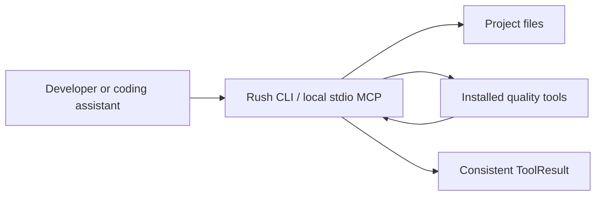

# Rush

**One safe command surface for the quality tools your project already uses.**

Rush helps developers and coding assistants review code, run linters and tests, inspect dependencies, scan for secrets, and check project files without learning a different workflow for every tool. It is a Python 3.12 command-line application with an optional local stdio integration for compatible coding assistants.

Rush exists because modern repositories are checked by many specialized programs. Rush does not replace Ruff, ESLint, pytest, pip-audit, or similar tools; it chooses the relevant installed helpers, runs them with contained defaults, and returns one consistent result.

> **Current capability boundary:** `rush review` uses deterministic local Python heuristics. `--use-graft` can add explicitly requested local Graft context. `--llm` is a development stub that detects an Anthropic/OpenAI key but makes no provider call. Rush does not currently run a local or hosted model.

## Why use Rush?

- **Check a change before a pull request.** Review source, lint it, verify formatting, run tests, and inspect dependencies.
- **Get consistent results.** Every command reports `ok`, `warn`, `fail`, `error`, or `skipped` in the same shape.
- **Keep control.** Rush never installs optional tools, silently rewrites source, publishes a release, or rewrites Git history.
- **Cover more than source code.** Check Markdown, YAML, SQL, Dockerfiles, Terraform, GitHub Actions, secrets, supply-chain evidence, and an explicit local CodeQL SARIF report.
- **Use the same checks from an assistant.** A compatible coding assistant can call the local Rush stdio server through MCP.

## Three-step quick start

```bash
# 1. Clone and install the project environment
git clone https://github.com/jamesdsizemore/rush-cli.git
cd rush-cli && uv sync --all-extras --frozen

# 2. Confirm the CLI is available
uv run rush --help

# 3. Review a project (use an absolute or relative path)
uv run rush review .
```

A typical result looks like this:

```text
⚡ review warn review: 2 heuristic finding(s)
path                 line  rule               severity  message
src/orders.py        41    missing-docstring  info      function 'total' has no docstring
src/checkout.py      88    todo-density       warn      3 TODO/FIXME markers in 95 lines
```

**What this means:** Rush completed the review. It found advisory issues, so the result is `warn`, not a crash. Open the named files, decide which findings matter, make a focused fix, and run the command again.

## Everyday checks

```bash
rush review .
rush lint .
rush format . --check
rush test .
rush security .
```

Rush also includes focused commands for type checking, dead code, complexity, content, infrastructure, supply chain, test confidence, and local workflow inspection. Run `rush --help` for the generated current list.

If CodeQL has already produced a local SARIF 2.1.0 report, import it without
running CodeQL again:

```bash
rush codeql ./results/codeql.sarif --json
```

The report must stay inside its selected target. Rush reads and normalizes that
evidence only; it does not create a CodeQL database, download query packs, or
run a build.

## What Rush does not do

- It does not silently rewrite files. `format` is check-only unless you explicitly omit `--check`; review the formatter behavior before using a mutating mode.
- It does not install missing engines.
- It does not create tags, rewrite Git history, upload packages, or publish releases.
- It does not open a network service; the MCP server uses local stdio only.
- It does not perform a real LLM review today.
- It does not make every catalog command executable: guarded placeholders report `skipped` until an implemented, explicit permission surface exists.



## Choose your next step

- New to Rush: [First ten minutes](docs/tutorials/first-10-minutes.md)
- Set up a project: [Python](docs/tutorials/python-project.md), [TypeScript](docs/tutorials/typescript-project.md), or [mixed-language](docs/tutorials/mixed-language-project.md)
- Build a daily habit: [Before a pull request](docs/tutorials/before-a-pull-request.md)
- Connect an assistant: [AI coding assistant tutorial](docs/tutorials/ai-coding-assistant.md)
- Add automation: [CI tutorial](docs/tutorials/ci-integration.md)

## Documentation map

| Goal | Start here |
|---|---|
| Install and make the first run | [Getting started](docs/getting-started/installation.md) |
| Learn the everyday workflow | [User guide](docs/user-guide/index.md) |
| Follow a guided lesson | [Tutorials](docs/TUTORIALS.md) |
| Look up a command or result | [Reference](docs/reference/cli-reference.md) |
| Understand safety and privacy | [Safety](docs/safety/safety-overview.md) |
| Use Rush from CI or an assistant | [Integrations](docs/integrations/mcp-overview.md) |
| Contribute or maintain Rush | [Developer guide](docs/DEVELOPER_GUIDE.md) |

Rush requires Python 3.12+. Optional engines are discovered from the current environment. See [Installation](docs/getting-started/installation.md), [Engine directory](docs/reference/engine-directory.md), and [Compatibility](docs/reference/compatibility.md).
