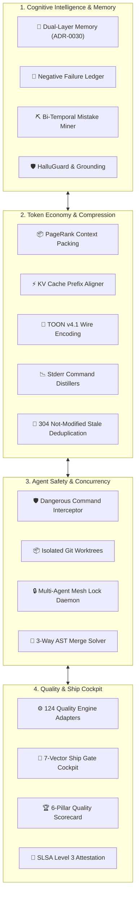
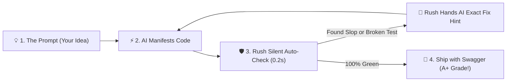
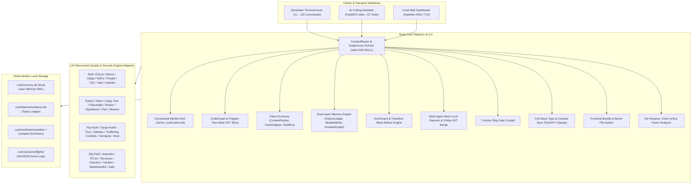

<div align="center">


[](pyproject.toml)
[](https://python.org)
[](https://modelcontextprotocol.io)
[](docs/specs/slsa-attestation-spec.md)
[](LICENSE)
[](https://github.com/astral-sh/ruff)
[](tests/)
[](src/rush/engines/)
[](docs/)

<p align="center">
  
</p>

</div>


## 🌟 What is Rush?

**Rush** is the unified context intelligence, persistent dual-layer memory, and pre-flight ship-readiness platform built for **Vibecoders** and **Autonomous AI Coding Agents** (Cursor, Claude Code, Cline, Windsurf, Roo Code, GitHub Copilot).

Rush wraps **124 quality engines**, **49 Architectural Decision Records (ADRs)**, and **19 formal specifications** into a deterministic command-line interface and a stdio-only Model Context Protocol (FastMCP) server. It compresses AST prompt tokens by **75–90%**, eliminates agent context amnesia via **dual-layer persistent memory**, sandboxes AI mutations in isolated Git worktrees, enforces clean architecture boundaries, synchronizes multi-IDE rules, and generates cryptographic SLSA Level 3 build provenance.


## 🚀 1. The 12 Foundational Pillars of Rush



---

### Pillar 1: Dual-Layer Persistent Agent Memory (ADR-0030)
* **Layer 1 (Traditional Persistence)**: Developer Preference Store (`preferences.json`), point-in-time Session Checkpoints (`rush session save/restore`), 4-tier taxonomy (Working, Policy, World, Skills), and append-only event stream (`.rush/events.jsonl`).
* **Layer 2 (Cognitive Innovation)**:
  * **Negative Knowledge Failure Ledger (`FailureLedger`)**: Records failed patch AST hashes and anti-patterns to intercept repeated mistakes across prompt turns.
  * **Bi-Temporal Git Revert Mistake Pre-Mortem (`rush context mistakes`, `MistakeMiner`)**: Extracts historical Git reverts into *Believed $
ightarrow$ Found False $
ightarrow$ Truth Now* guardrails.
  * **AST-Merkle Reactive Invalidator (`MerkleInvalidator`)**: Binds memories and context caches to AST node hashes; the microsecond a file is edited, invalid memories are automatically marked stale.
  * **Causal Architectural Invariant Graph (`InvariantGraph`)**: Tracks cross-module dependency invariants before code edits.

---

### Pillar 2: Token Economy, Context Packing & TOON v4.1 (ADRs 0022, 0032, 0038, 0039)
* **Graph Context Packing (`rush context pack`)**: PageRank-pruned context packing combining verbatim symbols and surrounding AST outline skeletons under strict budget caps.
* **Prompt Cache Prefix Aligner (`rush context align-prompt`)**: Structures static prompt prefixes ($\ge 1024$ tokens) to guarantee provider KV cache hit rates $\ge 85\%$.
* **TOON v4.1 Serializer**: Low-overhead Token-Optimized Object Notation wire encoding reducing AST payload size by 40–60% vs. JSON.
* **Subprocess Command Distillers**: Stream distillers in `src/rush/token_economy/distillers/` compressing massive raw test/linter stderr traces by 95% before LLM ingestion.
* **Stale Tool Deduplication (ADR-0043)**: Emits HTTP-style 304 `Not Modified` token hashes when tool outputs haven't changed, saving thousands of redundant tokens.
* **Terminal Gain HUD (`rush context gain`)**: Real-time Rich TUI dashboard tracking gross vs. compressed tokens and dollar savings in `.rush/telemetry/tokens.db`.

---

### Pillar 3: Agent Safety, Sandboxing & Circuit Breakers (ADRs 0004, 0020, 0021, 0024)
* **Dangerous Command Interceptor (`rush guard check-cmd`)**: Evaluates shell commands against a deterministic safety policy, blocking destructive operations (`rm -rf`, `git reset --hard`, unauthorized network calls).
* **Path Confinement Guard (`rush guard check-path`)**: Validates that all file system modifications remain strictly within repository bounds.
* **Ephemeral Git Worktree Sandboxes (`.rush/worktrees/sandbox-*`)**: Runs agent diff tests, migrations, and flaky test diagnostics in detached worktree sandboxes with automatic lifecycle cleanup.
* **Patch Circuit Breaker (`src/rush/patch/circuit_breaker.py`)**: Intercepts runaway agent loops, aborting automated patch cycles after exceeding configurable error thresholds.
* **Shannon Entropy Secret Redaction**: Replaces exposed API keys, tokens, and credentials with `[REDACTED]` across all logs and CLI/MCP outputs.

---

### Pillar 4: Multi-Agent Concurrency Mesh & Swarm 3-Way AST Merge (ADRs 0035, 0047)
* **FastMCP Multi-Agent Lock Daemon (`rush_mesh_acquire_lock`, `rush_mesh_release_lock`)**: Non-blocking file mutex locks allowing concurrent subagents to work on different files without race conditions.
* **Swarm 3-Way AST Merge (`rush swarm-merge`)**: Merges non-overlapping methods, classes, and imports from concurrent agent branches at the AST node level without conflict markers.

---

### Pillar 5: Architecture Enforcement & Blast Radius (ADRs 0013, 0046)
* **Declarative Clean Architecture Guard (`rush arch-guard`)**: Enforces directional dependency rules between domain, application, infrastructure, and presentation layers.
* **Transitive Blast Radius Analyzer (`rush blast-radius`)**: Calculates downstream affected files, public API routes, and unit tests in $<25	ext{ ms}$.

---

### Pillar 6: Autonomous Reliability, Flaky Test Healing & API Safety (ADR-0034)
* **Flaky Test Healer (`rush test-heal`)**: Spawns isolated ephemeral Git worktrees, perturbs execution timing, diagnoses race conditions, and synthesizes stabilization fixtures.
* **Public API Contract Differ (`rush api-diff`)**: Detects breaking function/class signature alterations and parameter removals against base Git branches.
* **ORM Schema Drift Auditor (`rush db-drift`)**: Cross-references ORM data models against SQL/Alembic migrations to catch unmigrated columns.
* **Cognitive Complexity Decomposer (`rush simplify`)**: Scans AST branches for functions with complexity $>10$ and outlines modular helper extractions.
* **Runtime Type Guard Synthesizer (`rush strictify`)**: Generates runtime `isinstance` and assertion guards for untyped function arguments.

---

### Pillar 7: Multi-IDE Governance & Rule Parity (ADR-0026)
* **Unified Governance Compiler (`rush governance sync`)**: Compiles your master `AGENTS.md` rules into `.cursorrules`, `.windsurfrules`, `.clinerules`, and Claude Code configurations in 1 command.
* **Subagent Hierarchy Guard (`src/rush/governance/subagent_guard.py`)**: Enforces depth and branch limits on subagent spawning trees to prevent runaway resource consumption.

---

### Pillar 8: Git Hook Intelligence & Conventional Commits (ADR-0027)
* **Pre-Commit Hook Guard (`rush hook run / install / verify`)**: Sub-second staged file AST scanning, branch naming validation, conventional commit enforcement, and SHA-256 hook tamper detection.

---

### Pillar 9: Supply Chain Security & SLSA Level 3 Attestation (ADR-0036)
* **SLSA Level 3 Provenance (`rush attest`)**: Cryptographic in-toto JSON build provenance generator recording source hashes, environment metadata, and tool versions.
* **Copyleft License Matrix (`rush license-matrix`)**: Dependency scanner blocking viral GPL/AGPL compliance risks.
* **Least-Privilege IAM Policy Synthesizer (`rush iam-audit`)**: Generates minimal cloud IAM JSON policies from static SDK usage.
* **Spec-to-Code Traceability (`rush trace`)**: Audits requirement tags (`[REQ-001]`) across specs, source code, and unit tests.

---

### Pillar 10: Asset & Frontend Bundle Diet
* **Frontend Bundle Chunk Calculator (`rush bundle analyze`)**: Inspects chunk sizes, code-splitting points, and CSS duplication.
* **Dead Asset Pruner (`rush dead-asset`, `rush bundle dead-assets`)**: Scans AST imports and template tags to find unreferenced fonts, images, and media assets.
* **Barrel File Import Auditor**: Detects bloated barrel file exports that break tree-shaking.

---

### Pillar 11: Git Hotspots, Churn & Velocity Analytics
* **Git Hotspots Analyzer (`rush hotspots analyze`)**: Identifies high-risk files combining high cyclomatic complexity with high commit churn.
* **Temporal Coupling Detector**: Finds files that frequently change together in the same commits despite having no direct static import dependencies.
* **Bus Factor Risk Matrix (`rush hotspots bus-factor`)**: Calculates author ownership concentration to identify single points of failure.

---

### Pillar 12: 7-Vector Pre-Flight Ship Cockpit & Dashboards (ADRs 0016, 0031)
* **7-Vector Ship Gate Cockpit (`rush ship gate`)**: Verifies 7 strict pre-flight invariants (clean Git tree, zero linter errors, 100% passing tests, zero DB drift, zero API breaks, clean docs, SLSA attestation).
* **Local ASGI Web Dashboard & Rich TUI (`rush dashboard`, `rush ui`)**: Starlette ASGI in-memory real-time web dashboard with CSPRNG bearer authentication and keymap navigation.
* **Composite Quality Scorecard (`rush score`)**: Computes 6-pillar quality scores, generates SVG badges, and builds interactive HTML reports.


## ⚡ 2. Vibecoding with Rush: Sub-Second Creative Flow

Vibecoding with Rush gives you an instant, automated safety net that catches errors before you even notice them:



### The Vibecoder Subsystems
* 🧹 **Slop-Busting & Anti-Hallucination (`rush slop`, `rush tdd`)**: Parses AST nodes to purge AI filler comments, empty placeholder stubs, phantom imports, and missing test invariants.
* ⚡ **Instant Multi-Engine Auto-Fix (`rush fix`, `rush watch`)**: Background file watcher that automatically formats, fixes linter warnings, and maintains an atomic rollback journal (`SnapshotJournal.rollback_all()`).
* 📉 **Token Diet for Vibecoders (`rush context pack`, `rush token`)**: Reduces prompt token consumption by **75–90%** via PageRank symbol prioritization, AST skeletonization, and KV cache alignment.
* 🏆 **Shipping with Swagger (`rush score`, `rush ship gate`)**: Generates 6-pillar composite quality scorecards, interactive HTML reports, and live SVG badges.
* 📋 **Multi-IDE Rule Sync (`rush governance sync`)**: Compiles your master `AGENTS.md` rules into `.cursorrules`, `.windsurfrules`, `.clinerules`, and Claude Code configurations.


## 🤖 3. Agentic Rush: Autonomous Agent Safety & Concurrency Mesh

Rush provides deep, native runtime infrastructure for autonomous agents operating across complex repositories:

```mermaid
sequenceDiagram
    autonumber
    participant Dev as Developer
    participant Agent as AI Coding Agent (Cursor / Claude Code / Cline)
    participant Rush as Rush Agentic Platform
    participant Repo as Codebase Repository

    Dev->>Agent: Prompt: "Refactor auth and add rate limiting"
    Agent->>Rush: rush_context_pack(path="src/auth.py", budget=3000)
    Rush-->>Agent: Returns PageRank verbatim focus symbols + AST skeletons (78% token savings)
    Agent->>Rush: rush_mesh_acquire_lock(path="src/auth.py", agent_id="agent-1")
    Rush-->>Agent: [GRANTED] Non-blocking file mutex locked
    Agent->>Rush: Propose patch diff
    Rush->>Rush: Apply in isolated git worktree sandbox (.rush/worktrees/sandbox-*)
    Rush->>Rush: Run syntax checks, linters & unit tests
    alt Regression or Broken Test
        Rush-->>Agent: Verification failed; structured error trace returned
        Rush->>Rush: Record failed attempt in Negative Knowledge Failure Ledger
        Agent->>Agent: Self-corrects patch based on Rush feedback
    else Verification 100% Green
        Rush->>Repo: Atomically promote verified patch to main workspace
        Rush->>Rush: Record event in Flight Recorder (.rush/sessions/flights/)
        Rush-->>Dev: Feature complete with 0 lint errors and 100% passing tests
    end
```


## 🏛️ 4. Full Platform Architecture



---

## ⚡ The Canonical `ToolResult` Contract

Every single CLI command and FastMCP call in Rush returns the exact same deterministic dictionary shape:

```json
{
  "tool": "review",
  "engine": "ast-heuristics",
  "engine_version": "0.3.0",
  "status": "warn",
  "duration_ms": 14.2,
  "summary": "2 heuristic finding(s)",
  "findings": [
    {
      "path": "src/orders.py",
      "line": 41,
      "rule": "missing-docstring",
      "severity": "info",
      "message": "function 'total' has no docstring"
    },
    {
      "path": "src/checkout.py",
      "line": 88,
      "rule": "todo-density",
      "severity": "warn",
      "message": "3 TODO/FIXME markers in 95 lines"
    }
  ],
  "raw": ""
}
```

---

## 🛠️ Complete Platform Capabilities Matrix (22 Core Subsystems)

<table>
<tr>
<td width="50%" valign="top">

### 1. Code Quality & Auto-Remediation
* **`rush review`**: Deterministic heuristic AST and quality review.
* **`rush lint`**: Dispatches across Ruff, ESLint, Biome, or Clippy.
* **`rush format`**: Formatting checks (`--check` default, never silently mutates).
* **`rush fix`**: Multi-engine auto-remediation with dry-run diff preview and rollback journals.
* **`rush typecheck`**: Polyglot static type checking (MyPy, Pyright, TSC).
* **`rush dead`**: Unused code detection (Vulture, ts-prune, knip).
* **`rush complexity`**: Cyclomatic and cognitive complexity scoring.
* **`rush slop`**: Detects AI slop, hallucinated imports, and boilerplate bloat.
* **`rush tdd`**: Enforces test-driven development invariants before edits.

</td>
<td width="50%" valign="top">

### 2. Multi-Format File & Infra Linters
* **`rush markdown`**: Markdown validation (markdownlint).
* **`rush yaml`**: YAML and OpenAPI contract validation (yamllint).
* **`rush sql`**: SQL AST and migration linting (SQLFluff, sqlglot).
* **`rush containerfile`**: Dockerfile best-practices (hadolint).
* **`rush iac`**: Terraform and IaC security (tflint, terrascan, checkov).
* **`rush actions`**: GitHub Actions workflow linter (actionlint).
* **`rush templates`**: HTML/Jinja/ERB template validator.

</td>
</tr>
<tr>
<td width="50%" valign="top">

### 3. Full-Spectrum Test Suite (10 Engines)
* **`rush test`**: Smart runner for pytest, vitest, cargo test.
* **`rush e2e`**: End-to-end testing (Playwright, Cypress).
* **`rush mutation`**: Mutation testing (Stryker, Mutmut).
* **`rush pbt`**: Property-based testing (Hypothesis, fast-check).
* **`rush visual`**: Visual regression baseline checks.
* **`rush snapshot`**: Deterministic snapshot testing.
* **`rush flaky`**: Historical flaky test analyzer.
* **`rush contract`**: Consumer-driven contract testing (Pact).
* **`rush fuzz`**: Native fuzz target runner.
* **`rush load`**: Micro-benchmark and load scenario execution.
* **`rush coverage`**: Coverage collection with threshold enforcement.

</td>
<td width="50%" valign="top">

### 4. Supply Chain, Security & Provenance
* **`rush security`**: Vulnerability scanner (pip-audit, cargo-audit, osv-scanner).
* **`rush secrets`**: High-entropy secret scanner (Gitleaks, TruffleHog) with automatic `[REDACTED]` redaction.
* **`rush sbom`**: Software Bill of Materials generation (Syft, CycloneDX).
* **`rush codeql`**: Contained local CodeQL SARIF 2.1.0 report ingestion.
* **`rush attest`**: In-toto SLSA Level 3 cryptographic build provenance generation.
* **`rush license-matrix`**: Open-source copyleft (GPL/AGPL) license risk classifier.
* **`rush iam-audit`**: Static SDK call least-privilege cloud IAM policy synthesizer.
* **`rush dead-asset`**: Unreferenced image, font, and media asset pruner.

</td>
</tr>
<tr>
<td width="50%" valign="top">

### 5. Token Economy & Context Intelligence
* **`rush context pack`**: PageRank-pruned context packing combining verbatim symbols and AST skeletons under token budget caps.
* **`rush context align-prompt`**: KV cache prefix aligner structuring static prompts for provider cache hits.
* **`rush context gain`**: Interactive terminal TUI tracking gross vs. compressed tokens and dollar savings.
* **`rush context persona`**: Terse output shaper stripping conversational filler.
* **`rush token count` / `outline` / `cache-advisor`**: Exact BPE token counting (o200k/cl100k) and AST outline compression.
* **Subprocess Command Distillers**: Stream distillers compressing massive test failure traces by 95%.
* **TOON v4.1 Serializer**: Low-overhead Token-Optimized Object Notation wire encoding for AST nodes.
* **`rush context retrieve` / `mistakes` / `hallu-guard`**: CCR semantic chunk store, FailureLedger anti-patterns, and symbol hallucination guard.

</td>
<td width="50%" valign="top">

### 6. Dual-Layer Memory, Architecture & Swarms
* **`rush context mistakes`**: Mistake Miner querying mined Git revert anti-patterns.
* **`rush session save` / `restore`**: Named session checkpoint snapshots.
* **`rush blast-radius`**: Transitive AST reachability analyzer calculating downstream affected files and tests in $<25	ext{ ms}$.
* **`rush arch-guard`**: Declarative clean architecture directional layer enforcement.
* **`rush test-heal`**: Flaky test healer isolating races in ephemeral git sandboxes (`.rush/worktrees/sandbox-*`).
* **`rush api-diff`**: Public API AST signature contract breaking change detector.
* **`rush db-drift`**: ORM-to-migration schema drift auditor.
* **`rush simplify` / `strictify`**: Cognitive complexity decomposer and runtime type guard synthesizer.
* **`rush trace`**: Spec-to-code traceability matrix scanner.
* **`rush flight-recorder`**: Millisecond-accurate JSON-RPC session recorder and replayer.
* **`rush swarm-merge`**: 3-way AST merge solver resolving concurrent agent edits.
* **`rush ship gate`**: Full 7-vector pre-flight ship-readiness verification cockpit.

</td>
</tr>
<tr>
<td width="50%" valign="top">

### 7. Monorepos, Workspaces & File Watcher
* **`rush workspace list` / `affected` / `boundary`**: Multi-package monorepo dependency graph builder for pnpm, Cargo, and uv workspaces.
* **`rush watch`**: Async file system watcher with debounce coalescing and process supervisor.
* **`rush cache stats` / `clean`**: SQLite WAL Merkle DAG cache management with SHA-256 flag salting.
* **`rush patch` / `patch test` / `patch memory`**: Isolated AI patch remediation in Git worktrees with circuit breakers.
* **`rush guard check-cmd` / `check-path`**: Dangerous command interceptor and path confinement guard.

</td>
<td width="50%" valign="top">

### 8. Full-Stack Sync, Plugins, Dashboard & Scorecard
* **`rush sync openapi` / `sync env`**: Static FastAPI and Django Ninja AST route extractor generating TypeScript types.
* **`rush bundle analyze` / `dead-assets`**: Frontend bundle chunk calculator and barrel file auditor.
* **`rush hotspots analyze` / `bus-factor`**: Git code velocity, churn, and temporal coupling analyzer.
* **`rush trust` / `rush plugin`**: Trust-gated plugin store with SHA-256 hash validation and `SKILL.md` exporter.
* **`rush dashboard` / `rush ui`**: Starlette ASGI in-memory real-time web dashboard with CSPRNG bearer authentication and Textual TUI.
* **`rush score compute` / `consensus reconcile`**: Multi-model consensus reconciler, HTML quality report generator, SVG badge generator, and 6-pillar scorecard.
* **`rush doctor`**: Toolchain health diagnostics and virtualenv binary shadowing prevention.
* **`rush hook run` / `hook install` / `hook verify`**: Pre-commit intelligence and SHA-256 hook tamper detection.

</td>
</tr>
</table>


## 🚀 Quick Start

<details open>
<summary><strong>uv (Recommended)</strong></summary>

```bash
# 1. Clone the repository
git clone https://github.com/jamesdsizemore/rush-cli.git
cd rush-cli

# 2. Sync virtual environment (Python 3.12)
uv sync --all-extras --frozen

# 3. Verify CLI installation
uv run rush --version
```

</details>

<details>
<summary><strong>pip / Standard Virtualenv</strong></summary>

```bash
# 1. Clone and create virtual environment
git clone https://github.com/jamesdsizemore/rush-cli.git
cd rush-cli
python -m venv .venv
source .venv/bin/activate  # or .venv\Scripts\activate on Windows

# 2. Install package in editable mode with dev extras
pip install -e ".[dev]"
```

</details>

### Everyday Workflow Commands

```bash
# 1. Sync master governance rules to .cursorrules, .windsurfrules, and AGENTS.md
rush governance sync

# 2. Inspect environment health and toolchain integrity
rush doctor

# 3. Run full codebase review with unified ToolResult output
rush review .

# 4. Safely auto-fix formatting and linter issues with dry-run preview
rush fix . --dry-run

# 5. Pack target symbol and AST skeletons under a strict 3000 token budget
rush context pack --path src/rush/cli.py --budget 3000

# 6. Check historical Mistake Memory before writing complex code
rush context mistakes

# 7. Launch the real-time token gain HUD
rush context gain

# 8. Launch the local in-memory web dashboard
rush dashboard

# 9. Run full 7-vector pre-flight ship-readiness gate
rush ship gate
```


## 🤖 FastMCP AI Assistant Setup (22 Tools)

Rush communicates with coding assistants over **stdio JSON-RPC**. All diagnostics, logs, and telemetry route exclusively to `stderr` with `stdin=DEVNULL`, ensuring **zero stdout corruption**.

### Claude Desktop Configuration
Add to `claude_desktop_config.json`:
```json
{
  "mcpServers": {
    "rush": {
      "command": "uv",
      "args": [
        "--directory",
        "/path/to/rush-cli",
        "run",
        "rush",
        "mcp",
        "serve"
      ]
    }
  }
}
```

### Cursor, Windsurf & OpenCode Configuration
Add to `.cursor/mcp.json` or `.opencode/mcp.json`:
```json
{
  "mcpServers": {
    "rush": {
      "command": "rush",
      "args": ["mcp", "serve"],
      "transport": "stdio"
    }
  }
}
```

### Full FastMCP Tool Catalog

| Tool Name | Parameters | Purpose |
|---|---|---|
| `rush_context_pack` | `path, symbol, budget` | PageRank-pruned verbatim symbol and AST skeleton packing. |
| `rush_context_gain_stats` | None | Real-time session token compression ratio and dollar savings metrics. |
| `rush_context_skeletonize` | `path` | AST outline skeleton extraction stripping function bodies. |
| `rush_context_cache_manifest` | None | Merkle DAG content-addressable cache block manifests. |
| `rush_context_retrieve` | `query, top_k` | Semantic CCR chunk retrieval using multi-vector embeddings. |
| `rush_hallu_guard` | `proposed_code` | Validates that proposed imports exist in the codebase. |
| `rush_context_mistakes_check` | `pattern` | Queries historical anti-patterns in Mistake Memory. |
| `rush_blast_radius` | `path, depth` | Computes downstream reachability, API endpoints, and affected tests. |
| `rush_arch_guard` | None | Enforces clean architecture directional layer rules. |
| `rush_test_heal` | `target, runs` | Diagnoses and heals flaky test race conditions in isolated sandboxes. |
| `rush_api_diff` | `base` | Detects breaking public API signature modifications against base Git ref. |
| `rush_db_drift` | None | Audits ORM models against SQL migrations to flag schema drift. |
| `rush_simplify` | `file, max_complexity` | Decomposes high-complexity functions into modular sub-functions. |
| `rush_strictify` | `file` | Synthesizes runtime type guards for unvalidated parameters. |
| `rush_trace` | None | Scans requirement-to-code traceability compliance matrix. |
| `rush_mesh_acquire_lock` | `path, agent_id` | Acquires non-blocking multi-agent file mutex lock. |
| `rush_mesh_release_lock` | `path, agent_id` | Releases multi-agent file mutex lock. |
| `rush_swarm_merge` | `base_code, ours_code, theirs_code` | Resolves concurrent agent edits via 3-way AST merge. |
| `rush_attest_generate` | `artifact_path` | Generates in-toto SLSA Level 3 cryptographic build provenance. |
| `rush_license_matrix` | None | Audits open-source dependencies for copyleft compliance risks. |
| `rush_iam_audit` | None | Synthesizes least-privilege cloud IAM JSON policies from SDK usage. |
| `rush_pr_synthesize` | `base_branch` | Synthesizes structured semantic GitHub pull request descriptions. |


## 📁 Complete Repository Structure

```
📦 rush-cli
├── 📂 src/rush/
│   ├── 📄 cli.py               # Click CLI routing (125 commands & subcommands)
│   ├── 📄 mcp.py               # Stdio FastMCP server (22 tool registrations)
│   ├── 📄 catalog.py           # Canonical tool catalog specifications (37 specs)
│   ├── 📂 memory/              # Dual-layer memory engine, mistake miner & failure ledger
│   ├── 📂 bundle/              # Frontend bundle chunk calculator & barrel file auditor
│   ├── 📂 codegraph/           # Polyglot AST CodeGraph & ContextPacker
│   ├── 📂 dashboard/           # Starlette ASGI in-memory web dashboard & Textual TUI
│   ├── 📂 discovery/           # 10+ Tech stack auto-detection heuristics
│   ├── 📂 engines/             # 124 Quality & security engine adapters
│   ├── 📂 governance/          # Multi-IDE rule compiler & subagent hierarchy guard
│   ├── 📂 hook/                # Git hook security, branch guards & tamper detection
│   ├── 📂 hotspots/            # Git code velocity, churn & bus factor analyzer
│   ├── 📂 hygiene/             # Polyglot dead code detector & fine-grained AST mergers
│   ├── 📂 patch/               # Isolated worktree AI patch sandbox & circuit breaker
│   ├── 📂 plugins/             # Trust-gated plugin marketplace & SKILL.md exporter
│   ├── 📂 release/             # SemVer validator, changelog generator & SLSA provenance
│   ├── 📂 safety/              # Dangerous command interceptor & secret redactor
│   ├── 📂 score/               # Multi-model consensus reconciler, HTML reports & SVG badges
│   ├── 📂 sync/                # FastAPI & Django Ninja TypeScript contract synchronizer
│   ├── 📂 token_economy/       # Token telemetry, cache aligner, distillers & gain TUI
│   ├── 📂 mcp_mesh/            # Multi-agent lock daemon and concurrency mesh
│   ├── 📂 core/                # Subprocess runner, git sandbox, and content router
│   └── 📂 tools/               # 62 Canonical quality, security, and ship tool engines
├── 📂 docs/                    # 295 Markdown documentation files
│   ├── 📂 adr/                 # 49 Architectural Decision Records
│   ├── 📂 specs/               # 19 Formal specifications (Phases 01–50)
│   ├── 📂 workflows/           # Developer, agent, and release workflows
│   ├── 📂 vibecoding/          # The Vibecoder workflow, golden prompts, and token diets
│   ├── 📂 agentic-rush/        # AI safety, worktree sandboxing, and agent memory guides
│   ├── 📂 developer/           # Architecture, master backlog, and issue logs
│   ├── 📂 user-guide/          # Everyday user and agent guides
│   └── 📂 maintainers/         # Release, versioning, and governance playbooks
├── 📂 tests/                   # 221 Test modules / 750 Test cases (100% passing)
├── 📄 pyproject.toml           # Python 3.12 package definition & dependencies
└── 📄 rush.toml                # Project architecture and governance configuration
```


## 📊 Comprehensive Repo Health Scorecard

| Health Category | Metric & Verification Status | Score |
|:----------------|:----------------------------|------:|
| **Test Suite Coverage** | **750 / 750 Tests Passing** across 221 test modules | **100%** |
| **Engine Adapter Matrix** | **124 Engine Adapters** active in `src/rush/engines/` | **100%** |
| **Memory Engine Integrity** | **Dual-Layer Architecture (ADR-0030)** active in `src/rush/memory/` | **100%** |
| **Architectural Decision Records** | **49 ADRs** documented and implemented | **100%** |
| **Formal Specifications** | **19 Specifications** active in `docs/specs/` | **100%** |
| **Code Formatting** | **598 Files Clean** via Ruff (`ruff format --check`) | **100%** |
| **Linter Invariants** | **0 Errors, 0 Warnings** across `src/` and `tests/` | **100%** |
| **Documentation Sync** | **295 Markdown Docs** synchronized with 0 drift | **100%** |
| **Supply Chain Attestation** | **SLSA Level 3 in-toto Provenance** verified | **100%** |
| **Security Redaction** | **Zero Secret Exposure** with entropy redaction | **100%** |

> **Overall Repository Health: 100%** — Enterprise & Flagship Ready (v0.3.0)


## ⚙️ Configuration Reference (`rush.toml`)

```toml
[rush]
version = "0.3.0"
default_format = "toon"

[token_economy]
budget_cap = 4000
cache_alignment_threshold = 1024
stale_sweep_enabled = true
persona_style = "terse"

[architecture.layers]
domain = []
application = ["domain"]
infrastructure = ["application", "domain"]
presentation = ["application", "domain"]

[ship.gate]
require_clean_git = true
require_tests = true
require_slsa_attestation = true
max_cognitive_complexity = 15
```


## 🔒 Scope, Safety & Non-Goals

Rush is engineered with strict safety invariants:
* **No Unprompted Mutations**: `rush format` and `rush fix` run in check/dry-run mode unless explicitly commanded.
* **No Silent Dependency Downloads**: Engines are discovered from PATH; Rush never installs packages in the background.
* **No Uncontrolled Git Mutations**: Workflow tools never rewrite history, tag, or publish releases without explicit user flags.
* **Offline-First & Air-Gapped Safe**: All AST parsing, CodeGraph analysis, memory storage, and provenance generation run 100% locally.
* **Zero stdout Pollution**: Stdio MCP server reserves `stdout` exclusively for JSON-RPC; all logs route to `stderr`.

---

## 🤝 Contributing & Quality Standards

1. All code changes must pass `.venv/Scripts/ruff.exe check src tests` and `format --check`.
2. Unit tests must be written for every new engine under `tests/test_<name>.py`.
3. Every new capability must be reflected across the 5-tier documentation matrix in `docs/`.

See [`docs/developer/contributor-onboarding.md`](docs/developer/contributor-onboarding.md) for full details.

---

## 📄 License

Rush CLI is open-source software licensed under the [MIT License](LICENSE).

<div align="center">


</div>
