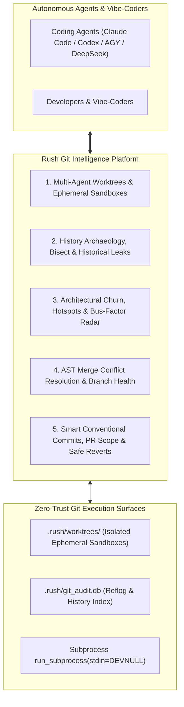

# Rush Innovation Plan: 16 Creative Git Intelligence & Multi-Agent Workflow Tools

> **Document Version:** 1.0.0  
> **Status:** Deep Research & Architectural Specification  
> **Target Audience:** Autonomous Coding Agents (Claude Code, OpenAI Codex, Antigravity, DeepSeek), Full-Stack Developers, Vibe-Coders, and Engineering Leads  
> **Core Contract:** Stdio FastMCP JSON-RPC, stderr NDJSON diagnostics, 100% offline, zero history rewrites without explicit user flags, zero-trust repository safety.

---

## 1. Executive Summary: Why Git-Native Intelligence is Critical for Agentic Coding

Git is the universal ledger of software engineering. However, the rise of autonomous coding agents and rapid vibe-coding has introduced unprecedented strain on traditional Git workflows:

1. **Working Tree Thrashing & Multi-Agent Collisions**: Multiple parallel agents working on the same repository clobber each other's uncommitted files, lock working directories, and produce corrupted states.
2. **Commit Message Degradation**: AI agents generate generic, unhelpful commit summaries (`"fix bugs"`, `"update files"`) that destroy Git history readability and bisectability.
3. **Ghost Regressions & Painful Bisects**: When an agent breaks a test or introduces a performance regression during a multi-turn session, humans struggle to trace which specific intermediate commit caused the failure.
4. **Historical Leak Exposure**: Accidental secret commitments or giant binary blob commits remain trapped in Git reflog and packfile history even after the file is "deleted" in working tree.
5. **Merge Conflict Paralysis**: Agents and developers get stuck on trivial structural line collisions (e.g., two branches appending independent imports or functions).
6. **Scope Creep & Unreviewable PRs**: Agents frequently create massive 2,000-line diffs spanning unrelated architectural layers, overwhelming human reviewers.

To solve these challenges, Rush introduces a creative suite of **16 Git-Native Intelligence & Workflow Tools** categorized across 5 architectural domains:



---

## 2. Comprehensive Catalog of 16 Creative Git Tools

---

### Domain 1: Multi-Agent Parallelism, Ephemeral Worktrees & Sandboxing

#### 1. `rush git-worktree` (Multi-Agent Git Worktree Farm & Lifecycle Manager)
- **Problem**: Multi-agent coding frameworks (e.g., Agent A implementing backend API routes while Agent B builds frontend React components) clash when executing in the same working tree, overwriting uncommitted files and locking the Git index.
- **Innovation**: Programmatically creates, assigns, monitors, and cleans up isolated Git worktrees under `.rush/worktrees/<task-id>`.
  - Automatically isolates dependencies (`node_modules`, `.venv`), symlinks build caches (`.rush/cache.db`), and checks out target branches or detached HEADs.
  - Upon task completion, produces a structured JSON-RPC summary with active diffs, passing test logs, and ready-to-merge branch references.
- **FastMCP Signature**: `rush_git_worktree_spawn(task_id: str, branch: str, base: str = "HEAD")` & `rush_git_worktree_cleanup(task_id: str)`
- **CLI Command**: `rush git-worktree list | spawn <task-id> | clean --all`

#### 2. `rush git-sandbox` / `rush git-try` (Zero-Risk Speculative Experiment Sandbox)
- **Problem**: Vibe-coders and agents want to test risky, wide-ranging refactors (e.g. migrating from REST to GraphQL, or upgrading a major framework version) without dirtying their current workspace or losing uncommitted changes.
- **Innovation**: Spawns an instant detached worktree sandbox in milliseconds, applies the speculative patch or agent instructions, executes `rush check` and test suites, calculates impact metrics (lines changed, performance delta, breaking changes), and offers an interactive human decision gate: `[Promote to Branch / Cherry-Pick / Discard]`.
- **CLI Command**: `rush git-sandbox "migrate auth to OAuth2" --test`

#### 3. `rush git-absorb` (Diff-to-Commit Fixup Router & Auto-Squasher)
- **Problem**: During development, agents fix small typos, syntax errors, or test assertions across multiple files, resulting in messy chains of `"fix typo"`, `"fix test"`, `"address review"` commits that pollute history.
- **Innovation**: Inspects uncommitted `git diff` against the current branch baseline, uses `git blame` to determine which historical commit in the branch originally introduced each modified line, and automatically generates `git commit --fixup <commit-sha>` operations.
- **Safety Invariant**: Only generates fixup commits for commits that exist exclusively on the local feature branch (never modifies commits already pushed to upstream `main`).
- **CLI Command**: `rush git-absorb [--dry-run | --auto-squash]`

---

### Domain 2: History Archaeology, Automated Bisect & Historical Leak Defense

#### 4. `rush git-bisect` (Autonomous Automated Test & Performance Bisector)
- **Problem**: A test suddenly fails or benchmark latency regresses, but tracking down the culprit across 40 recent commits requires tedious manual `git bisect start/good/bad` orchestration.
- **Innovation**: Fully autonomous bisect engine. Given a failing test target (e.g. `pytest tests/test_auth.py` or `rush check`), Rush automates the binary search across Git commit history:
  - Checks out candidate commits in an isolated worktree.
  - Executes the predicate test suite.
  - Automatically records good/bad steps.
  - Returns the exact offending commit SHA, author, commit message, timestamp, AST symbol diff, and PR link.
- **FastMCP Signature**: `rush_git_bisect(target_test: str, good_sha: str, bad_sha: str = "HEAD")`
- **CLI Command**: `rush git-bisect --test "pytest tests/test_auth.py -k test_jwt" --good v0.2.0`

#### 5. `rush git-symbol-history` / `rush git-trace` (AST-Aware Symbol Evolution Tracker)
- **Problem**: Standard `git log -L :func:file` is purely line-based and completely breaks when a function is renamed, moved across files, or refactored into a class method.
- **Innovation**: Uses `graft` and Tree-Sitter AST parsing to track the semantic identity of a symbol (function, class, interface, endpoint) across file renames, module reorganizations, and cross-file refactors throughout Git history.
- **FastMCP Signature**: `rush_git_trace_symbol(symbol: str, file: str, max_depth: int = 20)`
- **CLI Command**: `rush git-trace "UserAuthService.login" src/auth/service.py`

#### 6. `rush git-leak-history` (Deep Reflog & Historical Commit Tree Secret Scanner)
- **Problem**: Standard secret linters only inspect the current working directory. Secrets accidentally committed 3 weeks ago and "deleted" in a later commit remain permanently in Git reflogs, tree objects, and `.git/objects/pack/`.
- **Innovation**: Scans all historical commits, stashes, orphaned dangling trees, and reflogs for high-entropy secrets (AWS keys, OpenAI API keys, SSH private keys, GitHub PATs) and oversized binary packfile bloat (>10MB).
- **Output**: Generates a zero-leak remediation plan with pinpointed commit SHAs and `git filter-repo` / BFG safe command recipes.
- **CLI Command**: `rush git-leak-history [--all-branches | --include-stashes]`

---

### Domain 3: Architectural Churn, Hotspots & Bus-Factor Radar

#### 7. `rush git-hotspots` (High-Churn / High-Complexity Architectural Radar)
- **Problem**: 80% of software defects occur in just 20% of the codebase—specifically files that experience high commit churn combined with high cyclomatic complexity and low test coverage.
- **Innovation**: Computes a multi-dimensional risk matrix by cross-referencing:
  1. Git commit churn velocity (modifications over the last 90 days).
  2. AST cyclomatic complexity and structural nesting depth.
  3. Test file proximity and test coverage deficit.
- **Visual Output**: Generates an interactive terminal scatter plot and SVG quadrant chart highlighting architectural debt hotspots before they fail in production.
- **CLI Command**: `rush git-hotspots [--days 90 | --top 10]`

```text
[Hotspot Risk Matrix]
  High Complexity  │ [HIGH RISK] auth_service.py (42 commits, complexity 28)
                   │             checkout_flow.ts (38 commits, complexity 24)
                   │
                   │ [LOW RISK]  db_models.py (3 commits, complexity 18)
  Low Complexity   │             utils.py (5 commits, complexity 2)
                   └────────────────────────────────────────────────────────
                     Low Churn                        High Churn (Velocity)
```

#### 8. `rush git-bus-factor` / `rush git-ownership` (Knowledge Loss & Ownership Radar)
- **Problem**: In team environments, engineering leads lose track of which developer has deep context on legacy modules, creating critical single-points-of-failure (Bus Factor = 1).
- **Innovation**: Mines Git blame and commit author histories with recency decay weighting (e.g. commits from 2 weeks ago weigh more than commits from 2 years ago) to calculate module ownership percentages and flag at-risk orphan modules.
- **CLI Command**: `rush git-bus-factor [--threshold 0.8]`

#### 9. `rush git-coupling` (Temporal Coupling & Hidden Co-Change Detector)
- **Problem**: Certain files are logically coupled despite being in different architectural tiers (e.g., `backend/schemas/user.py` and `frontend/types/user.ts`, or `api/routes.py` and `docs/api.md`). When an agent modifies one but forgets the other, silent breakage occurs.
- **Innovation**: Mines historical Git commit logs to detect file pairs that are committed together $\ge 80\%$ of the time. When an agent stages or edits File A, Rush alerts:
  `"Warning: File A was modified. Historically, File B is changed alongside it in 88% of commits."`
- **CLI Command**: `rush git-coupling [--file src/models/order.py]`

---

### Domain 4: Merge Conflict Resolution & Branch Health

#### 10. `rush git-resolve` (AST-Aware 3-Way Merge Conflict Auto-Resolver)
- **Problem**: Line-based Git merge conflicts frequently occur when two branches make independent, non-conflicting structural changes (e.g., Branch A added an import and method 1; Branch B added another import and method 2 at the bottom of the same class).
- **Innovation**: Tree-Sitter AST 3-way merge resolver:
  - Parses common ancestor (`BASE`), current branch (`OURS`), and incoming branch (`THEIRS`).
  - Automatically merges non-overlapping AST declarations (imports, class methods, interface properties, dictionary keys).
  - Validates syntax and executes project formatters (`ruff`, `prettier`) before staging the resolved file.
- **CLI Command**: `rush git-resolve [--dry-run | --interactive]`

#### 11. `rush git-ghost` (Dangling Stash, Stale Branch & Reflog Vault)
- **Problem**: Developers and vibe-coders accumulate dozens of forgotten stashes (`stash@{19}`), dead local branches, and lost uncommitted work from interrupted sessions.
- **Innovation**: Inspects all local stashes, detached commits, and branches:
  - Identifies branches already fully merged into `main` and offers safe cleanup.
  - Analyzes stashes, displaying human-readable summaries of what each stash contains.
  - Recovers "lost" commits from Git reflog that were orphaned by accidental `git reset --hard` or branch deletions.
- **CLI Command**: `rush git-ghost audit | clean | recover <sha>`

#### 12. `rush git-branch-sync` (Simulation-First Rebase & Alignment Assistant)
- **Problem**: Rebasing a complex feature branch against `main` is high-friction and risky. If intermediate commits break tests, bisectability is ruined.
- **Innovation**: Simulates the rebase in an ephemeral sandbox worktree:
  - Replays each commit sequentially, running quick sanity checks (`rush check`).
  - Pre-identifies potential conflicts before touching the real local branch.
  - Ensures every single intermediate commit in the rebased history remains green.
- **CLI Command**: `rush git-branch-sync [--onto main | --simulate]`

---

### Domain 5: Agent-Native PR Scope, Conventional Commit & Revert Safety

#### 13. `rush git-smart-commit` (AST-Aware Conventional Commit Synthesizer)
- **Problem**: Vibe-coders and AI agents generate vague, inaccurate commit messages (e.g. `"fixed issue"`, `"updated backend"`), destroying changelog automation and code review context.
- **Innovation**: Inspects staged AST diffs (detecting exact function additions, signature changes, schema migrations, and dependency updates) to synthesize high-fidelity Conventional Commit messages:
  - Example: `feat(auth): add OAuth2 token revocation endpoint and update UserDTO schema`
  - Validates message against project commitlint rules and enforces ticket ID tagging (`PROJ-1234`).
- **CLI Command**: `rush git-smart-commit [--generate | --check]`

#### 14. `rush git-pr-scope` (PR Blast Radius & Reviewability Guard)
- **Problem**: Coding agents easily fall into scope creep, generating massive PRs touching 35 files across 4 subsystems that take human reviewers days to understand.
- **Innovation**: Calculates the architectural blast radius of the branch diff:
  - Counts modified architectural tiers (API, Database, UI, Auth, Config).
  - Calculates review difficulty score (0–100) based on line count, cognitive complexity, and test ratio.
  - Recommends atomic PR split boundaries if the diff exceeds review thresholds (>400 lines or >8 files).
- **FastMCP Signature**: `rush_git_pr_scope(base_branch: str = "main")`
- **CLI Command**: `rush git-pr-scope [--split-suggestions]`

#### 15. `rush git-revert-plan` (Dependency-Aware Multi-Commit Revert Planner)
- **Problem**: Reverting a complex multi-commit feature using `git revert <sha>` often triggers cascading merge conflicts due to intermediate dependencies.
- **Innovation**: Analyzes the AST symbol dependency chain across all commits in the target feature span, computing the exact reverse-topological order of reverts required to cleanly roll back the feature with zero conflicts.
- **CLI Command**: `rush git-revert-plan --feature-branch feature/billing-v2`

#### 16. `rush git-doctor` (Repository Integrity, Lockfiles & Hygiene Diagnostic)
- **Problem**: Git repositories suffer from stale `.git/index.lock` files, broken submodules, mixed CRLF/LF line-ending churn, bloated `.git/objects/`, and detached HEAD states.
- **Innovation**: Comprehensive repository doctor that audits internal `.git/` health:
  - Detects and clears stale lockfiles safely.
  - Enforces consistent `.gitattributes` line endings across Windows and Linux/macOS.
  - Diagnoses detached HEAD states with friendly recovery recommendations.
  - Measures packfile size and recommends garbage collection (`git gc --prune=now`).
- **CLI Command**: `rush git-doctor [--fix]`

---

## 3. Integration into the Rush Master Plan (Phases 31–40)

To keep our 10-phase roadmap coherent, these 16 Git tools map directly into the existing master build phases:

| Git Tool | Command / FastMCP Tool | Phase Assignment | Subsystem |
|---|---|---|---|
| Multi-Agent Worktrees | `rush git-worktree` / `rush_git_worktree_spawn` | **Phase 31** (Transport & Concurrency) | `src/rush/git/worktree.py` |
| Speculative Sandbox | `rush git-sandbox` / `rush_sandbox_eval` | **Phase 35** (AST & Pre-Flight Sandboxes) | `src/rush/sandbox.py` |
| Diff-to-Commit Absorb | `rush git-absorb` | **Phase 35** (AST & Sandboxes) | `src/rush/git/absorb.py` |
| Autonomous Bisect | `rush git-bisect` / `rush_git_bisect` | **Phase 35** (AST & Sandboxes) | `src/rush/git/bisect.py` |
| Symbol Evolution Trace | `rush git-trace` / `rush_git_trace_symbol` | **Phase 35** (AST & Sandboxes) | `src/rush/git/trace.py` |
| Historical Leak Scanner | `rush git-leak-history` | **Phase 32** (AI Safety & Security) | `src/rush/git/leak_history.py` |
| Architectural Hotspots | `rush git-hotspots` | **Phase 37** (Repo Hygiene & Governance) | `src/rush/git/hotspots.py` |
| Bus-Factor Ownership | `rush git-bus-factor` | **Phase 37** (Repo Hygiene & Governance) | `src/rush/git/bus_factor.py` |
| Temporal Co-Change Coupling | `rush git-coupling` | **Phase 37** (Repo Hygiene & Governance) | `src/rush/git/coupling.py` |
| AST Merge Resolver | `rush git-resolve` | **Phase 34** (Runtime & Reliability) | `src/rush/git/resolve.py` |
| Dangling Stash/Ghost Vault | `rush git-ghost` | **Phase 37** (Repo Hygiene & Governance) | `src/rush/git/ghost.py` |
| Rebase Alignment Assistant | `rush git-branch-sync` | **Phase 39** (Plan & Scope Intelligence) | `src/rush/git/branch_sync.py` |
| Smart Conventional Commits | `rush git-smart-commit` | **Phase 39** (Plan & Scope Intelligence) | `src/rush/git/smart_commit.py` |
| PR Scope & Blast Radius | `rush git-pr-scope` / `rush_git_pr_scope` | **Phase 39** (Plan & Scope Intelligence) | `src/rush/git/pr_scope.py` |
| Multi-Commit Revert Planner | `rush git-revert-plan` | **Phase 39** (Plan & Scope Intelligence) | `src/rush/git/revert_plan.py` |
| Repo Integrity Doctor | `rush git-doctor` | **Phase 37** (Repo Hygiene & Governance) | `src/rush/git/doctor.py` |

---

## 4. Safety Invariants & Contributor Contract

All Git tools strictly uphold Rush's safety controls:
1. **Zero-Trust History Invariant**: Never execute `git push --force`, `git rebase`, `git reset --hard`, or history-altering commands on remote tracking branches.
2. **Deterministic Sandbox Isolation**: All speculative analyses, bisects, and test executions must occur in isolated `.rush/worktrees/` without dirtying the active working tree.
3. **Subprocess Confinement**: All `git` command invocations use `run_subprocess()` with `stdin=DEVNULL`, `shell=False`, and strict path resolution within the repository boundary.
