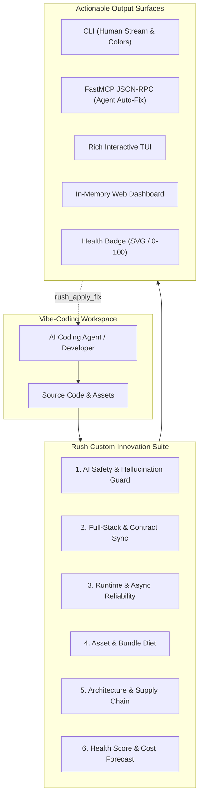
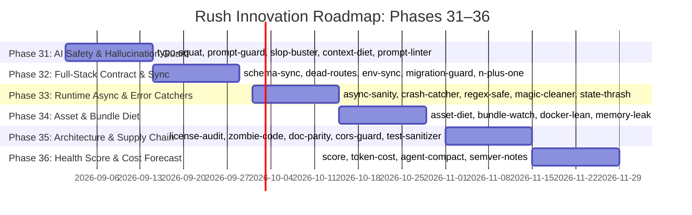

# Rush Innovation Plan: 28+ Custom Tools for Developers & Vibe-Coders

> **Document Version:** 1.0.0  
> **Status:** Proposal & Architectural Specification  
> **Target Audience:** All levels of developers, vibe-coders, AI coding agents, and maintainers  
> **Core Mission:** Elevate rapid AI-assisted vibe-coding into production-grade, resilient software engineering through native, deterministic, zero-dependency Rush tools.

---

## 1. Executive Summary & The "Vibe-Engineering Standard"

Vibe-coding—rapidly iterating on features using AI coding models (Claude Code, Cursor, Copilot, Aider, Devin, Hermes)—has unlocked unprecedented developer velocity. However, it introduces acute, unique failure modes:
1. **Hallucinated Dependencies**: AI agents importing nonexistent or typo-squatted libraries.
2. **Context Window Token Bloat**: Sprawling debug files, mammoth JSON dumps, and unpruned agent transcripts wasting expensive model context.
3. **Cross-Language Type Drift**: Backend Pydantic models diverging silently from frontend TypeScript/Zod interfaces.
4. **Zombie Code & Silent Regressions**: Abandoned helper functions and stale callers created during multi-turn refactoring loops.
5. **Runtime Async Starvation**: Blocking I/O inside async event loops and unhandled Promise rejections.

To solve this, Rush introduces **28 custom, purpose-built tools** engineered from the ground up. These tools require zero third-party cloud services, run entirely offline, integrate with FastMCP for closed-loop agent auto-remediation, and enforce deterministic quality gates.



---

## 2. Comprehensive Catalog of 28 Custom Tools

### Domain 1: AI Safety, Hallucination Prevention & Prompt Hygiene

---

#### 1. `rush typo-squat` (Hallucinated Package & Dependency Squatting Guard)
- **Problem**: AI models frequently hallucinate package names (e.g., `fastapi-jwt-bearer-auth`, `react-cool-modal`) or make subtle typo errors that malicious actors register as malware (typo-squatting / dependency confusion).
- **Implementation**:
  - Offline index of the top 50,000 verified PyPI, npm, and Cargo packages packaged directly into Rush.
  - Levenshtein distance and phonetic matching against popular packages to flag high-risk typos.
  - Cross-checks imports in AST against declared `pyproject.toml`, `package.json`, and `Cargo.toml`.
- **FastMCP Tool**: `rush_typo_squat(path)`
- **Sample Finding**:
  ```json
  {
    "tool": "typo-squat",
    "status": "fail",
    "summary": "typo-squat: 1 hallucinated or unverified package detected",
    "findings": [{
      "file": "src/api/auth.py",
      "line": 4,
      "rule": "HALLUCINATED_PACKAGE",
      "severity": "error",
      "message": "Package 'fastapi-jwt-auth-v2' is not found in verified registry index. Did you mean 'fastapi-jwt-auth'?",
      "suggested_fix": "pip install fastapi-jwt-auth"
    }]
  }
  ```

---

#### 2. `rush prompt-guard` (Prompt Injection & System Prompt Bleed Scanner)
- **Problem**: Applications embedding user input into LLM prompts often introduce prompt injection vulnerabilities or accidentally leak system prompts through unescaped template string interpolation.
- **Implementation**:
  - AST analysis on Python/TS code searching for prompt template definitions (`f"..."`, template literals).
  - Flags raw, unescaped user parameter interpolation into `<system_prompt>` or `messages` arrays.
  - Detects known jailbreak patterns (`"ignore previous instructions"`, `"system override"`) inside test fixtures or client-accessible strings.
- **FastMCP Tool**: `rush_prompt_guard(path)`
- **Sample Finding**:
  ```json
  {
    "tool": "prompt-guard",
    "status": "warn",
    "summary": "prompt-guard: 1 prompt injection exposure detected",
    "findings": [{
      "file": "src/agents/assistant.py",
      "line": 28,
      "rule": "UNESCAPED_PROMPT_INTERPOLATION",
      "severity": "warn",
      "message": "Raw user parameter 'user_query' directly interpolated into system instructions without boundary framing.",
      "suggested_fix": "Use XML boundary tags like <user_query>{user_query}</user_query>."
    }]
  }
  ```

---

#### 3. `rush slop-buster` (Deep AST AI Boilerplate & Empty Stub Reducer)
- **Problem**: Vibe-coding generates voluminous filler: redundant docstrings (`# This function adds two numbers`), empty `pass`/`// TODO` stubs, duplicate defensive checks, and verbose conversational comments.
- **Implementation**:
  - Tree-Sitter AST inspection across Python, JavaScript, TypeScript, Rust, Go.
  - Computes AST information density: ratio of actual logic tokens to comments and boilerplate.
  - Identifies tautological docstrings that simply restate function signatures.
- **FastMCP Tool**: `rush_slop_buster(path)`
- **Sample Finding**:
  ```json
  {
    "tool": "slop-buster",
    "status": "warn",
    "summary": "slop-buster: 3 tautological comments and empty stubs found",
    "findings": [{
      "file": "src/utils.py",
      "line": 15,
      "rule": "TAUTOLOGICAL_DOCSTRING",
      "severity": "info",
      "message": "Docstring 'def get_user_by_id(user_id): Get user by id' adds 0 semantic information."
    }]
  }
  ```

---

#### 4. `rush context-diet` (Agent Token Bloat & Massive Context Cleaner)
- **Problem**: AI coding sessions leave large temporary JSON logs, memory dumps, and 10,000-line scratch files that get sucked into LLM context windows, blowing token limits and slowing agent responses.
- **Implementation**:
  - Scans workspace for high-token files (>20,000 tokens) not listed in `.gitignore`.
  - Analyzes `.cursorrules`, `CLAUDE.md`, and agent memory directories for duplicate instructions.
  - Offers single-turn `--prune` command to compress or gitignore token-heavy assets.
- **FastMCP Tool**: `rush_context_diet(path)`
- **Sample Finding**:
  ```json
  {
    "tool": "context-diet",
    "status": "warn",
    "summary": "context-diet: 145,000 redundant tokens found in untracked scratch files",
    "findings": [{
      "file": "debug_dump.json",
      "rule": "CONTEXT_TOKEN_BLOAT",
      "severity": "warn",
      "message": "File is 4.2 MB (approx. 110k tokens) and will bloat AI coding agent context. Add to .gitignore."
    }]
  }
  ```

---

#### 5. `rush prompt-linter` (System Prompt & Agent Instructions Quality Linter)
- **Problem**: `CLAUDE.md`, `.cursorrules`, and `AGENTS.md` files often suffer from contradictory rules, ambiguous phrasing, excessive token length, and lack of testable exit criteria.
- **Implementation**:
  - Markdown AST parser that evaluates instruction files against the Anthropic/OpenAI prompt engineering rubric.
  - Flags conflicting directives (e.g., "always use type annotations" alongside "keep code ultra minimal").
  - Measures token footprint and recommends concise bullet-point refactorings.
- **FastMCP Tool**: `rush_prompt_linter(path)`

---

### Domain 2: Full-Stack & Polyglot Consistency

---

#### 6. `rush schema-sync` (Cross-Language Type Parity: Pydantic ↔ TypeScript / Zod)
- **Problem**: In full-stack applications (Python backend + TypeScript frontend), backend Pydantic models change without corresponding updates to frontend TypeScript interfaces, causing runtime `undefined` bugs.
- **Implementation**:
  - Python AST parser extracts Pydantic/SQLAlchemy fields and types.
  - TypeScript/TSX parser extracts frontend interfaces, types, and Zod schemas.
  - Performs structural diff matching and reports missing or mismatched fields across the API boundary.
- **FastMCP Tool**: `rush_schema_sync(path)`
- **Sample Finding**:
  ```json
  {
    "tool": "schema-sync",
    "status": "fail",
    "summary": "schema-sync: 1 type mismatch between backend and frontend",
    "findings": [{
      "file": "frontend/types/user.ts",
      "line": 12,
      "rule": "SCHEMA_FIELD_MISMATCH",
      "severity": "error",
      "message": "Pydantic model 'UserResponse' in src/schemas.py added 'is_verified: bool', which is missing in TypeScript interface 'UserDTO'."
    }]
  }
  ```

---

#### 7. `rush dead-routes` (API Endpoint & Frontend Route Zombie Scanner)
- **Problem**: During rapid prototyping, backend FastAPI/Express endpoints are created or renamed, leaving orphaned endpoints that are never called by the frontend, or frontend fetch calls targeting deleted routes (404s).
- **Implementation**:
  - Extracts all backend route paths (`@app.get("/api/v1/users")`, `router.post(...)`).
  - Scans frontend files (`fetch("/api/...")`, `axios.get(...)`, `useQuery(...)`).
  - Reports orphaned backend endpoints (0 callers) and broken frontend endpoints (404 routes).
- **FastMCP Tool**: `rush_dead_routes(path)`

---

#### 8. `rush env-sync` (Environment Variable Parity & Leakage Guard)
- **Problem**: Developers add `os.getenv("NEW_SECRET")` or `process.env.NEXT_PUBLIC_KEY` in code but forget to update `.env.example`, breaking onboarding and deployment for teammates and CI.
- **Implementation**:
  - Extracts all environment variable lookups across Python, JS/TS, Rust, Go.
  - Compares discovered keys against `.env.example`, `.env.template`, and `docker-compose.yml`.
  - Flags missing documentation and alerts if actual secrets are hardcoded in `.env.example`.
- **FastMCP Tool**: `rush_env_sync(path)`

---

#### 9. `rush migration-guard` (Database Migration Safety & Orphaned Column Checker)
- **Problem**: Vibe-coders generate database migrations (Alembic/Prisma) that contain unsafe operations: dropping columns with data, adding non-nullable columns without defaults, or leaving orphaned DB columns.
- **Implementation**:
  - Parses migration files (Alembic Python versions, Prisma schema migrations, raw SQL).
  - Checks for destructive DDL operations (table locks, data loss risks, missing backward compatibility).
  - Cross-references migration column definitions with current ORM models.
- **FastMCP Tool**: `rush_migration_guard(path)`

---

#### 10. `rush n-plus-one` (ORM & SQL N+1 Query Anti-Pattern Detector)
- **Problem**: Calling ORM relations or SQL queries inside `for` loops causes massive database roundtrips and latency explosions in production.
- **Implementation**:
  - AST detector tracing loop bodies (`for user in users: ...`) containing ORM calls (`user.posts`, `db.query()`, `await fetch()`).
  - Suggests eager loading (`joinedload`, `include`, `selectinload`) with drop-in patch generation.
- **FastMCP Tool**: `rush_n_plus_one(path)`

---

### Domain 3: Runtime Reliability, Async & Error Handling

---

#### 11. `rush async-sanity` (Python/JS Event Loop Starvation & Missing Await Linter)
- **Problem**: Calling synchronous blocking functions (`time.sleep()`, `requests.get()`, `open().read()`) inside `async def` FastAPI routes or Node.js handlers blocks the single-threaded event loop, degrading concurrency.
- **Implementation**:
  - AST scanner that identifies `async def` function scopes and inspects calls inside.
  - Flags blocking sync I/O calls inside coroutines.
  - Detects coroutines called without `await` or `asyncio.create_task`.
- **FastMCP Tool**: `rush_async_sanity(path)`
- **Sample Finding**:
  ```json
  {
    "tool": "async-sanity",
    "status": "fail",
    "summary": "async-sanity: 1 blocking call detected inside async route",
    "findings": [{
      "file": "src/api/routes.py",
      "line": 45,
      "rule": "SYNC_IO_IN_ASYNC_COROUTINE",
      "severity": "error",
      "message": "Blocking call 'requests.get()' inside 'async def get_weather()'. Use 'httpx.AsyncClient' to avoid starving event loop."
    }]
  }
  ```

---

#### 12. `rush crash-catcher` (Missing UI Error Boundaries & Async Fallbacks)
- **Problem**: React and frontend components created with AI lack `ErrorBoundary` wrappers or `try/catch` handlers on asynchronous data fetches, causing entire UI pages to crash to a white screen on single API failures.
- **Implementation**:
  - TSX/JSX AST parser that checks component trees for top-level `ErrorBoundary` protection.
  - Scans `useEffect` and event handlers for unhandled Promise rejections.
- **FastMCP Tool**: `rush_crash_catcher(path)`

---

#### 13. `rush regex-safe` (ReDoS & Catastrophic Backtracking Linter)
- **Problem**: AI models generate complex regular expressions for email/URL validation that contain nested quantifiers `(a+)+`, vulnerable to Regular Expression Denial of Service (ReDoS).
- **Implementation**:
  - Pure Python deterministic regex AST parser.
  - Analyzes NFA/DFA state machine complexity to detect exponential and polynomial backtracking.
- **FastMCP Tool**: `rush_regex_safe(path)`

---

#### 14. `rush magic-cleaner` (Magic Number, URL & Hardcoded Literal Extractor)
- **Problem**: Codebases become unmaintainable when raw numbers (`86400`, `42`, `3.14`), magic strings, and hardcoded localhost URLs (`http://localhost:3000`) are scattered through function bodies instead of constants.
- **Implementation**:
  - AST literal collector that identifies unnamed constants used multiple times or in business logic.
  - Provides automated refactoring to extract literals into top-level typed constants or configuration settings.
- **FastMCP Tool**: `rush_magic_cleaner(path)`

---

#### 15. `rush state-thrash` (React / Modern UI Unnecessary Re-render & Hook Linter)
- **Problem**: Instantiating objects/arrays inline inside JSX props (`style={{ margin: 10 }}` or `onClick={() => ...}`) or omitting dependencies in `useEffect`/`useMemo` causes continuous component re-rendering.
- **Implementation**:
  - TSX AST parser detecting inline object literals, functions, and missing hook dependency array items.
- **FastMCP Tool**: `rush_state_thrash(path)`

---

### Domain 4: Performance, Bundle & Asset Optimization

---

#### 16. `rush asset-diet` (Image, SVG & Unoptimized Asset Bloat Watchdog)
- **Problem**: Vibe-coders frequently drop uncompressed 15MB PNG screenshots, bloated SVGs containing unnecessary XML metadata, or unoptimized audio files directly into `public/` or `assets/`.
- **Implementation**:
  - Binary header parser that calculates dimensions, compression efficiency, and file size.
  - Flags uncompressed raster images (>500KB) and unoptimized SVGs.
  - Generates optimization suggestions (e.g., conversion to WebP/AVIF, SVG viewBox cleanup).
- **FastMCP Tool**: `rush_asset_diet(path)`

---

#### 17. `rush bundle-watch` (JS/Wasm Tree-Shaking & Heavy Import Linter)
- **Problem**: Importing an entire library (`import _ from 'lodash'` or `import * as icons from 'lucide-react'`) pulls 2MB+ of unused JavaScript into production frontend bundles.
- **Implementation**:
  - Scans JavaScript/TypeScript import statements for non-tree-shakeable barrel imports.
  - Recommends path-specific imports (`import debounce from 'lodash/debounce'`).
- **FastMCP Tool**: `rush_bundle_watch(path)`

---

#### 18. `rush docker-lean` (Dockerfile Layer & Multi-Stage Cache Optimizer)
- **Problem**: Inefficient Dockerfiles copy the entire repository before installing dependencies, invalidating build caches on every minor code edit and creating 2GB container images.
- **Implementation**:
  - Deterministic parser for `Dockerfile` and `Containerfile`.
  - Verifies layer ordering: dependency manifests (`package.json`, `pyproject.toml`) must be copied and installed BEFORE source code `COPY . .`.
  - Checks for non-root user execution (`USER nonroot`) and multi-stage build patterns.
- **FastMCP Tool**: `rush_docker_lean(path)`

---

#### 19. `rush memory-leak` (Event Listener, Stream & Open Handle Leak Detector)
- **Problem**: Forgetting to remove `addEventListener` in cleanup functions, unclosed database connection pools, or lingering timer intervals (`setInterval`) causes memory leaks in long-running services.
- **Implementation**:
  - Static AST lifecycle tracker: checks that `addEventListener` / `setInterval` in React `useEffect` hooks return explicit cleanup functions (`removeEventListener` / `clearInterval`).
  - In Python, verifies that file handles and network sessions use context managers (`with` statements).
- **FastMCP Tool**: `rush_memory_leak(path)`

---

### Domain 5: Architecture, Compliance & Supply Chain

---

#### 20. `rush license-audit` (GPL/Copyleft Contamination & AI Attribution Scanner)
- **Problem**: AI code generation can inadvertently reproduce verbatim code blocks from viral copyleft licenses (GPL-3.0, AGPL-3.0), creating compliance hazards for proprietary or MIT/Apache projects.
- **Implementation**:
  - Scans declared dependencies and inline header comments for copyleft license identifiers.
  - Compares project license policy with dependency licenses to prevent copyleft contamination.
- **FastMCP Tool**: `rush_license_audit(path)`

---

#### 21. `rush zombie-code` (Cross-File Stale Callers & Dead Export Graph Linter)
- **Problem**: When an AI agent replaces a function with a new implementation, the old function is left behind as dead code, or internal helpers remain exported across module boundaries with 0 consumers.
- **Implementation**:
  - Builds an in-memory cross-file symbol reference graph.
  - Identifies symbols marked `export` or `def` that have 0 internal or external references across the repository.
- **FastMCP Tool**: `rush_zombie_code(path)`

---

#### 22. `rush doc-parity` (Docstring vs Code Signature Drift Validator)
- **Problem**: When function signatures evolve (parameters added, renamed, or types changed), docstrings and JSDoc comments remain stale, deceiving both human developers and future AI coding agents.
- **Implementation**:
  - Compares AST function parameter names and types against `@param`, `:param`, and return type docstrings.
  - Flags missing, extra, or mismatched parameter documentation.
- **FastMCP Tool**: `rush_doc_parity(path)`

---

#### 23. `rush cors-guard` (CORS Misconfiguration & Security Headers Auditor)
- **Problem**: Developers often configure `allow_origins=["*"]` with `allow_credentials=True` in backend APIs to bypass local browser errors, creating catastrophic cross-origin security vulnerabilities.
- **Implementation**:
  - AST linter scanning middleware definitions in FastAPI, Express, Django, Next.js, and Flask.
  - Disallows insecure CORS wildcards when credentials are enabled.
  - Audits essential HTTP security headers (`Content-Security-Policy`, `X-Content-Type-Options`, `Strict-Transport-Security`).
- **FastMCP Tool**: `rush_cors_guard(path)`

---

#### 24. `rush test-sanitizer` (Test Mock PII & Sensitive Fixture Data Sanitizer)
- **Problem**: Test fixtures often contain real customer names, live API tokens, production database URLs, or real email addresses committed to version control.
- **Implementation**:
  - High-entropy and PII pattern scanner dedicated to `tests/` and fixture directories.
  - Validates that test email domains use reserved RFC 2606 domains (`@example.com`, `@example.org`) and dummy card numbers.
- **FastMCP Tool**: `rush_test_sanitizer(path)`

---

### Domain 6: Developer Experience, AI Cost & Gamified Health

---

#### 25. `rush score` (Vibe-Coder Codebase Health Scorecard & Badge Generator)
- **Problem**: Vibe-coders lack a single, intuitive metric to know if their codebase is clean, maintainable, and production-ready.
- **Implementation**:
  - Aggregates findings across all 37+ engines into a unified 0–100 weighted index:
    - Code Cleanliness & Style (20%)
    - Security & Secrets (30%)
    - Test Confidence & Coverage (25%)
    - Architecture & Modularity (15%)
    - Documentation & Doc Parity (10%)
  - Generates a standalone SVG badge (`rush-score.svg`) for READMEs: `[Quality: 96/100 (Grade A+)]`.
- **FastMCP Tool**: `rush_score(path)`
- **Sample Finding**:
  ```json
  {
    "tool": "score",
    "status": "ok",
    "summary": "score: Overall Codebase Health: 94/100 (Grade A)",
    "score": 94,
    "grade": "A",
    "breakdown": {
      "security": 100,
      "style": 95,
      "tests": 90,
      "architecture": 92,
      "docs": 90
    }
  }
  ```

---

#### 26. `rush token-cost` (Multi-Model LLM Token & Cost Impact Forecaster)
- **Problem**: Developers and engineering managers have no visibility into how much money feeding their repository or specific prompt context into Claude 3.7 Sonnet, GPT-4o, or Gemini 2.5 Pro costs per invocation.
- **Implementation**:
  - Accurate BPE/cl100k token counter.
  - Multiplies tokens by live model pricing tables (cached locally).
  - Displays token count, cost per single prompt turn, and cost per full repository ingestion.
- **FastMCP Tool**: `rush_token_cost(path)`

---

#### 27. `rush agent-compact` (Multi-Turn Agent Memory & Scratchpad Optimizer)
- **Problem**: Agent memory logs (`.rush/session_memory.json`, `.claude/`, `.cursor/`) grow unbounded, consuming memory and degrading response quality.
- **Implementation**:
  - Deduplicates identical past findings, summarizes repetitive tool runs into compact statistical summaries, and prunes resolved issues.
  - Enforces strict XML boundary tags and keeps total history under a 2,000-token budget.
- **FastMCP Tool**: `rush_agent_compact(path)`

---

#### 28. `rush semver-notes` (AST-Driven Semantic Changelog & Release Notes Generator)
- **Problem**: AI agents write messy git commit messages, making automated release notes and semantic version bumping inaccurate.
- **Implementation**:
  - Compares public AST symbol exports (classes, functions, endpoints) between current git `HEAD` and the previous release tag.
  - Automatically classifies changes into `MAJOR` (breaking changes/deleted symbols), `MINOR` (new functions/endpoints), and `PATCH` (internal bugfixes).
  - Generates clean, markdown-formatted `CHANGELOG.md` without requiring external network access.
- **FastMCP Tool**: `rush_semver_notes(path)`

---

## 3. Implementation Architecture & Phasing Roadmap (Phases 31–36)

To implement these 28 innovated tools methodically, we structure them across six upcoming delivery phases:



| Phase | Focus Area | Tools Included | Deliverables |
|---|---|---|---|
| **Phase 31** | AI Safety & Hallucination Guard | `typo-squat`, `prompt-guard`, `slop-buster`, `context-diet`, `prompt-linter` | Pinned package registry index, Prompt AST analyzers |
| **Phase 32** | Full-Stack & Contract Sync | `schema-sync`, `dead-routes`, `env-sync`, `migration-guard`, `n-plus-one` | Pydantic ↔ TypeScript AST bridge, Route mapper |
| **Phase 33** | Runtime Async & Error Catchers | `async-sanity`, `crash-catcher`, `regex-safe`, `magic-cleaner`, `state-thrash` | Event-loop AST linter, ReDoS DFA state checker |
| **Phase 34** | Asset & Bundle Diet | `asset-diet`, `bundle-watch`, `docker-lean`, `memory-leak` | Binary asset inspector, Tree-shaking import linter |
| **Phase 35** | Architecture & Supply Chain | `license-audit`, `zombie-code`, `doc-parity`, `cors-guard`, `test-sanitizer` | License compatibility matrix, Symbol reference graph |
| **Phase 36** | Health Score & Cost Forecast | `score`, `token-cost`, `agent-compact`, `semver-notes` | Weighted 0–100 scorecard, SVG badge, BPE token counter |

---

## 4. Integration with Defensive Controls & Existing Subsystems

All 28 tools natively inherit the core architecture and security invariants of Rush:
1. **Control 1 (Flag-Salted Caching)**: All new tool evaluations are cached in `.rush/cache.db` using SHA-256 digests salted with tool flags.
2. **Control 2 (Path Boundary Confinement)**: Target paths and cross-language sync checks are strictly verified against the repository root.
3. **Control 3 & 4 (Subprocess & Binary Integrity)**: Any auxiliary tools run with `stdin=DEVNULL`, `shell=False`, and anti-shadowing verification.
5. **Control 5 (Dashboard & TUI Integration)**: All findings flow directly into `rush ui` and `rush dashboard`.
6. **Control 6 (Trust Gating)**: Custom user extensions or plugins generated by agent skills require `rush trust` authorization.
7. **Control 7 (Patch Confinement & Session Memory)**: Suggested fixes are emitted as unified diffs and executed through `rush_apply_fix` with sensitive path shielding.

---

## 5. Summary of Value to Developers & Vibe-Coders

- **Zero-Friction Adoption**: Built directly into Rush—no extra Python/Node packages to configure.
- **AI Agent Native**: Accessible via FastMCP stdio transport (`rush_<tool_name>`), enabling Claude, Cursor, and Hermes to self-diagnose and self-repair codebases in single-turn loops.
- **Deterministic & Offline**: Runs instantaneously on local hardware without API keys, telemetry, or remote dependencies.
- **Actionable Remediation**: Every finding comes with a concrete, syntax-checked `suggested_fix` or unified diff patch.
