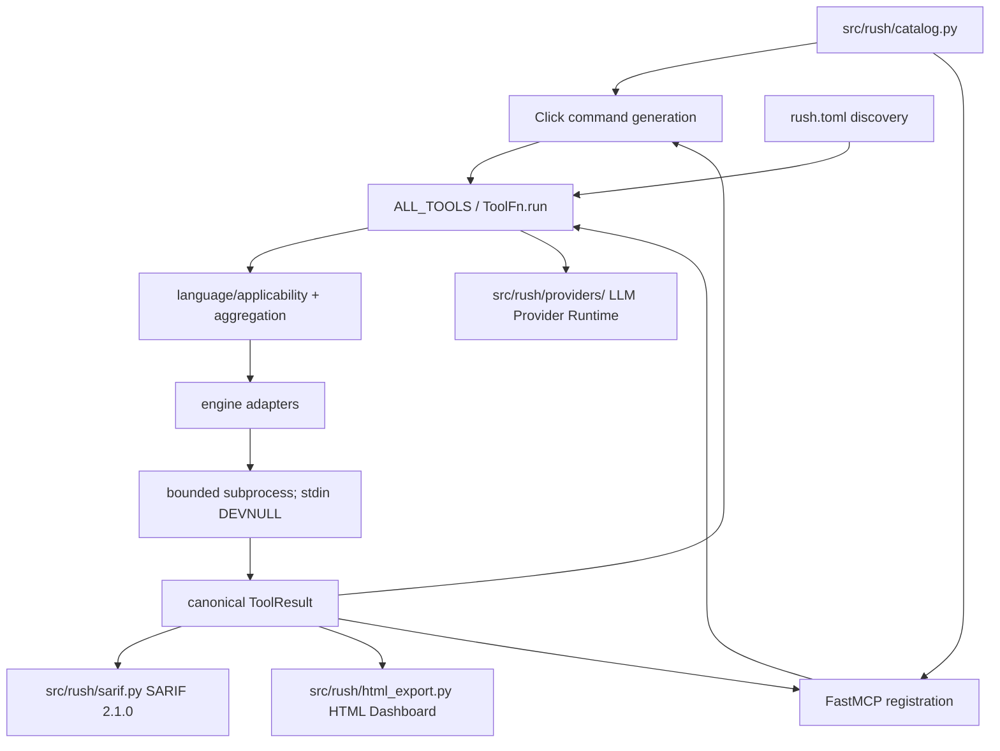
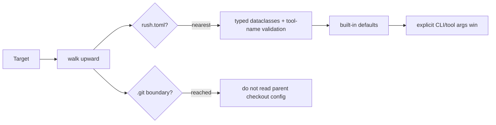
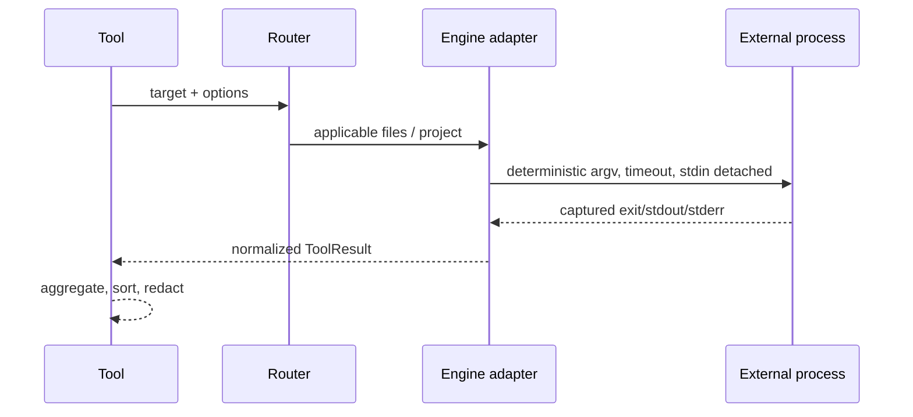

# Rush architecture

## P3 recoverable context envelope

`SessionContinuityTool.context_pack` fails closed when a budget cannot contain selected context. A recovery handle is created only with explicit `cache_write` permission; otherwise the result is `skipped` with `recovery: {state: "not_created", reason: "cache_write_required"}` and no CCR database is created. When permitted, Rush redacts the omitted packed evidence before repository-local CCR persistence and returns only its stable handle. `context_retrieve` resolves that handle explicitly, redacts even pre-existing CCR content before output, and does not touch its LRU state unless cache-write permission is granted; it does not implicitly replay omitted material.

## Phase 1 session continuity boundary

`SessionContinuityTool` in `src/rush/tools/continuity.py` is the sole implementation for local save/list/restore. CLI `rush session` adapters and the catalogued MCP `rush_continuity` tool call that boundary; neither transport writes checkpoints itself. A save requires `ExecutionPermissions(cache_write=True)`, while list/restore avoid creating `.rush/` when no session directory exists.

On save, the same boundary creates a redacted `metadata.handoff` receipt: current goal, open work, dependency content snapshots, a quarantined historic-instruction marker, a receipt-only failed-attempt pointer, and at most five redacted historical `SessionMemoryManager` records labelled `historical_evidence`. Restore recomputes dependency snapshots and reports `freshness: current` or `stale`; legacy checkpoints report `freshness: unknown` and are not migrated automatically.

The same `SessionContinuityTool` owns `context_pack` and `context_retrieve`; legacy CLI/MCP context transports delegate to it. Its `metadata.context_envelope` carries selected evidence, estimated local tokens, omissions, recovery state, redaction count, and explicit telemetry state. An omitted payload is not delivered, so it is `not_measured` rather than a ledger savings event and always sets `provider_cost: null`; Rush does not claim provider-token, price, or cache-hit measurements.

## Phase 4 coordination boundary

`SessionContinuityTool` also exposes read-only coordination operations. `coordination_check` inspects a repository-local lock without creating, releasing, or overwriting it; a foreign held lock reports `conflict`, the requesting owner receives explicit `held` evidence, an expired lock reports `stale`, and malformed evidence is `unavailable`. `coordination_merge_preview` detects overlapping edits and returns a manual-reconciliation receipt without emitting merged source. `coordination_recovery` validates replay-event shape and reads bounded flight and failure receipts only; malformed replay or corrupt ledger data is structured unavailable evidence. It never replays commands or retries a patch.

`provider_resume` remains inside the same continuity boundary. It projects only current goal/open work/freshness from a saved receipt into a fixed CLI profile for Claude Code, Codex CLI, Antigravity, or Codex-through-fixed-local-9Router, or a fixed loopback OmniRoute OpenAI-compatible request. `9router_cli` copies `RUSH_9ROUTER_API_KEY` only into that Codex child process and lets 9Router select the route/model. Native executables receive typed argv; Windows batch launchers receive the projection through a per-process delayed-expansion environment variable so checkpoint-controlled text never enters CMD syntax. Network permission is required; Z.AI is deferred. The route never reads a keychain, opens a browser, changes a provider profile, or returns the provider response.

Rush is a Python 3.12 package with two transports and one implementation layer. Click CLI commands and FastMCP tools invoke the same objects from `src/rush/tools/`; external programs are isolated behind adapters in `src/rush/engines/`.

## Core contracts

- `TOOL_SPECS` and `ENGINE_SPECS` are declarative metadata; `ALL_TOOLS` and `ENGINES` are executable registries. Tests enforce parity across all 38 tools and 121 engines.
- `ToolFn.run(path, *, config, ...)` is the internal execution surface. `ToolFn.__call__` is MCP-facing and must expose only JSON-schema-safe parameters.
- ToolResult required keys are `tool`, `engine`, `engine_version`, `status`, `duration_ms`, `summary`, `findings`, and `raw`; optional extensions include metrics, artifacts, metadata, and review fields.
- A missing optional executable returns `skipped`; it must not raise or install anything.
- Multi-engine aggregation is deterministic: worst status wins (`error > fail > warn > ok > skipped`), durations sum, findings sort by location/rule/message, and provenance is retained.
- **Reporting & Export Subsystems**:
  - **SARIF 2.1.0**: Standardized static analysis interchange format generated via `src/rush/sarif.py` (`--export-sarif`).
  - **Interactive HTML**: Self-contained zero-dependency single-file reports generated via `src/rush/html_export.py` (`--export-html`).
- **Pluggable LLM Provider Layer**:
  - Isolated provider abstractions in `src/rush/providers/` (`LLMProvider`, `AnthropicProvider`, `OpenAIProvider`) decoupling runtime AI model invocations from the core CLI and MCP transport layers.
- **Binary Resolution Caching**:
  - In-memory `@lru_cache` (`_resolve_binary_cached`) eliminating repetitive `shutil.which` PATH searches on Windows.
- **Flag-Salted Result Caching (Phase 21)**:
  - SQLite-backed result cache (`src/rush/cache.py`) with content-hashed, flag-salted cryptographic keys (`.rush/cache.db`).
- **Real-Time Debounced Watcher (Phase 25)**:
  - Multi-threaded file system watcher (`src/rush/watcher.py`) with configurable debounce windows (300ms default) and automatic directory pruning (`.git`, `node_modules`, `.venv`).
- **Polyglot Monorepo Scoping (Phase 26)**:
  - Deterministic workspace topology discovery (`src/rush/discovery/workspace.py`) for npm, pnpm, yarn, Cargo, and Turborepo with strict path containment.
- **Authenticated In-Memory Web Dashboard & Rich TUI (Phase 27)**:
  - Single-binary zero-dependency local HTTP server (`src/rush/dashboard.py`) binding exclusively to `127.0.0.1` with ephemeral `X-Rush-Auth` tokens, DNS rebinding prevention, and CSRF Origin validation.
  - Interactive terminal finding explorer (`src/rush/tui.py`) built with Rich layouts.
- **Trust-Gated Dynamic Plugin Runtime (Phase 28)**:
  - Declarative script plugin execution (`src/rush/plugins/`) with local repository trust verification (`~/.rush/trusted_repositories.json`) preventing arbitrary code execution in untrusted checkouts.
- **Closed-Loop AI Patch Remediation & Session Memory (Phase 29)**:
  - Bounded multi-turn session memory ledger (`src/rush/session_memory.py`) framed with strict XML boundary tags (`<rush_session_memory>`).
  - Atomic unified diff patch generator and applier (`src/rush/patch_generator.py`) with sensitive file shielding (`.git`, `.env`).
- **Autonomous Agent Safety & Worktree Sandboxing (Phase 31)**:
  - Destructive command interceptor (`src/rush/safety/`) blocking harmful shell patterns and enforcing repository path containment.
  - Ephemeral Git worktree sandboxing isolating untrusted agent modifications.
- **Token Economy & Context Optimization (Phase 32)**:
  - Fast BPE token counting (`src/rush/token_economy/`) and AST outline compression eliminating prompt token waste.
- **Full-Stack Static Sync & Type-Safety Gates (Phase 33)**:
  - Bidirectional OpenAPI JSON contract verifier and TypeScript interface generator (`src/rush/sync/`).
- **Codebase Hygiene & 3-Way AST Conflict Resolution (Phase 34)**:
  - Polyglot dead code and unreferenced export scanner (`src/rush/hygiene/`).
  - Semantic 3-way AST merge solver resolving conflicting branch edits.
- **Polyglot CodeGraph & Verbatim AST Slicing (Phase 35)**:
  - SQLite-backed Code Property Graph store (`src/rush/codegraph/`) providing sub-millisecond verbatim symbol slicing with line numbers.
- **Frontend Asset & Bundle Optimization (Phase 36)**:
  - Raw, Gzip, and Brotli chunk size calculator and performance budget gates (`src/rush/bundle/`).
- **Git Hotspots & Defect Risk Analytics (Phase 37)**:
  - Commit churn velocity and McCabe cyclomatic complexity correlation matrix (`src/rush/hotspots/`).
- **Multi-IDE Agent Governance & Repo Scaffolding (Phase 38)**:
  - Canonical `AGENTS.md` instruction compiler (`src/rush/governance/`) emitting synchronized `.cursorrules`, `.clinerules`, and Claude instructions.
- **Git Pre-Commit Intelligence & Hook Guard (Phase 39)**:
  - Sub-second staged AST parser, Trojan Source Unicode detector, and cryptographic hook tamper guard (`src/rush/hook/`).
- **Multi-Model Consensus & Composite Quality Scorecard (Phase 40)**:
  - 6-pillar repository health scoring engine (`src/rush/score/`), SARIF 2.1.0 exporter, SVG badge generator, and multi-model consensus reconciliation.
- **TDD & Architectural Sensors**:
  - `rush tdd` verifies Red-Green-Refactor compliance.
  - AST and modular boundary sensors (`tach`, `aislop`, `globstar`, `sentrux`, `medusa`, `clines`, `undercover`, `cejel`) enforce structural architectural hygiene without requiring runtime network calls.

## Configuration flow

## Engine flow

## Safety architecture

Stdio MCP stdout is reserved for JSON-RPC. Logs are stderr NDJSON. Engine processes cannot consume protocol input. Security-sensitive promoted adapters own config/environment constraints. Artifact writers validate target containment and overwrite intent. Browser/network/slow/fuzz/baseline/publication work is denied or skipped without explicit implemented permission.

See the focused developer chapters linked from [Developer guide](DEVELOPER_GUIDE.md) and the [ADRs](maintainers/adr/README.md).

## 14. Context Intelligence & Token Economy Architecture (Phases 41–43)

### 14.1 Content Routing & Subprocess Distillation
The `ContentRouter` (`src/rush/token_economy/router.py`) classifies incoming payloads into `AST_CODE`, `TEST_LOG`, `TABULAR_DATA`, or `PROSE_MARKDOWN`. When test runners fail, command distillers (`PytestDistiller`, `CargoDistiller`, `RuffDistiller`, `VitestDistiller`) parse failure blocks, extract line-level assertions, and compress stdout/stderr before returning structured tool results.

### 14.2 TOON v4.1 Wire Serialization
The `ToonEncoder` (`src/rush/token_economy/toon/`) serializes tabular results into pipe-delimited tables with explicit column headers and escaped delimiters, reducing BPE token consumption over redundant JSON keys.

### 14.3 Polyglot AST Skeletonizer & Merkle Invalidation
The `AstSkeletonizer` (`src/rush/token_economy/ast_skeletonizer.py`) parses Python, TypeScript, and Rust files to generate structural outlines with `...` placeholders. The `MerkleInvalidator` (`src/rush/memory/merkle_invalidator.py`) stores SHA-256 node hashes in `.rush/cache/merkle.json` to reactively invalidate dependent cache entries only when AST nodes change.

### 14.4 CCR (Context Compression & Restoration)
The `CCRStore` (`src/rush/token_economy/ccr_store.py`) persists large execution outputs in `.rush/cache/ccr.db` and injects `<!-- ccr:chunk:HASH -->` tags. Retrieval via `rush context retrieve <HASH>` or FastMCP restores full uncompressed content on demand.

### 14.5 Grounding Verification & HalluGuard
`GroundingVerifier` (`src/rush/codegraph/grounding_verifier.py`) inspects concrete syntax tree imports against `sys.stdlib_module_names` and `importlib.metadata.distributions()`, flagging non-existent or hallucinated dependencies before execution.

### 14.6 Pre-Flight 7-Vector Ship Cockpit
The `ShipCockpit` (`src/rush/tools/ship/cockpit.py`) runs 7 orthogonal release validation vectors in parallel:
1. `clean`: Uncommitted scratch file detection (`ScratchCleaner`).
2. `env`: AST environment variable parity check (`EnvParityLinter`).
3. `docs`: Relative documentation link auditing (`DocsLinter`).
4. `migration`: Zero-downtime SQL table-lock linter (`MigrationLinter`).
5. `semver`: Breaking public API signature differ (`SemverLinter`).
6. `pack`: Sensitive key / secret leak audit (`PackageLinter`).
7. `gate`: Unified weighted verdict.

## 15. Context Packing, Telemetry & Blast Radius Subsystems (Phases 44–46)

### 15.1 Graph-Pruned Context Packing & Stale Sweeping (Phase 44)
* `ContextPacker` (`src/rush/codegraph/context_packer.py`): Leverages AST outlines and PageRank importance to assemble token-budgeted prompt envelopes (`<rush_context>`).
* `StaleSweeper` (`src/rush/token_economy/stale_sweeper.py`): Deduplicates multi-turn conversational history by replacing earlier turns' bloated file reads with 1-line summary tags.
* `CacheAligner` (`src/rush/token_economy/cache_aligner.py`): Enforces prefix lengths above 1,024 tokens to optimize multi-provider KV prompt caching.

### 15.2 Gain TUI & Token Economy Telemetry Ledger (Phase 45)
* `TelemetryStore` (`src/rush/token_economy/telemetry.py`): Persists distillation and skeletonization metrics to `.rush/telemetry/tokens.db`.
* `OutputShaper` (`src/rush/token_economy/output_shaper.py`): Regex-based output filter eliminating conversational filler when `--style terse` is active.
* `render_gain_dashboard` (`src/rush/token_economy/tui_gain.py`): Interactive Rich layout rendering live token and dollar savings.

### 15.3 Transitive Blast Radius & Architecture Guard (Phase 46)
* `BlastRadiusAnalyzer` (`src/rush/tools/blast_radius.py`): Computes transitive downstream impact across files, API routes, and tests.
* `ArchGuard` (`src/rush/tools/arch_guard.py`): Validates imports against `[architecture.layers]` declarative boundaries to prevent illegal reverse dependencies.

## 16. Autonomous Test Healing & API Differ Subsystems (Phase 47)
* `GitSandbox` (`src/rush/core/git_sandbox.py`): Ephemeral worktree lifecycle manager.
* `TestHealer` (`src/rush/tools/test_heal.py`): Perturbation and race-condition diagnosis.
* `ApiDiffer` (`src/rush/tools/api_diff.py`): AST-based breaking change differ.

## 17. DB Drift, Complexity Decomposer & Type Guard Subsystems (Phase 48)
* `DbDriftAuditor` (`src/rush/tools/db_drift.py`): Model vs. migration discrepancy detector.
* `ComplexityDecomposer` (`src/rush/tools/simplify.py`): Cyclomatic/cognitive AST analyzer.
* `TypeSynthesizer` (`src/rush/tools/strictify.py`): Untyped parameter guard generator.

## 18. Traceability, Flight Recorder & Swarm Subsystems (Phase 49)
* `TraceScanner` (`src/rush/tools/trace.py`): Spec tag to AST implementation auditor.
* `FlightRecorder` (`src/rush/tools/flight_recorder.py`): Session log persistence in `.rush/sessions/flights/`.
* `SwarmMergeSolver` (`src/rush/tools/swarm_merge.py`): Semantic 3-way AST merge solver.
* `MeshLockManager` (`src/rush/mcp_mesh/lock_manager.py`): Domain-socket/file lock manager for swarm concurrency.

## 19. Attestation, Security, & Quality Subsystems (Phase 50)
* `AttestationTool` (`src/rush/tools/attest.py`): in-toto Statement v1 / SLSA Provenance v1 unsigned provenance draft generator.
* `LicenseMatrixTool` (`src/rush/tools/license_matrix.py`): Multi-manifest dependency license auditor and risk classifier.
* `IamAuditTool` (`src/rush/tools/iam_audit.py`): Static AST AWS SDK call auditor and least-privilege IAM JSON policy synthesizer.
* `DeadAssetTool` (`src/rush/tools/dead_asset.py`): Static media asset vs source reference scanner and guarded prune manager.
* `PrSynthesizeTool` (`src/rush/tools/pr_synthesize.py`): Git diff and ToolResult evidence semantic pull request markdown card generator.
* `PromptEvalTool` (`src/rush/tools/prompt_eval.py`): Golden coding task prompt evaluation runner and token/cost matrix calculator.
* `ErrorCatalogTool` (`src/rush/tools/error_catalog.py`): AST exception extractor, RFC 7807 problem details generator, and markdown catalog emitter.
* `ProvenanceAiTool` (`src/rush/tools/provenance_ai.py`): Git commit trailer attribution analyzer and shallow history detector.
* `MemProfileTool` (`src/rush/tools/mem_profile.py`): Static unclosed resource detector and dynamic memory profiling probe.
* `ColdStartTool` (`src/rush/tools/cold_start.py`): Static AST import analyzer and dynamic `-X importtime` module latency timer.
* `MediaOptTool` (`src/rush/tools/media_opt.py`): SVG active script sanitizer and Pillow PNG/WebP raster image optimizer.
* `OfflineReviewTool` (`src/rush/tools/offline_runner.py`): Air-gapped local ONNX model review runner with zero network access.
* `TuiDiffTool` (`src/rush/tools/tui_diff.py`): Git commit finding delta computer and Rich table terminal renderer.
* `BenchmarkTool` (`src/rush/tools/benchmark.py`): Performance sample comparator against `.rush/baselines.json` threshold gates.

## 20. Reproducible Benchmark Harness Subsystem (Phases B1–B6)
* `scripts/benchmarks/contracts.py`: Dataclass models (`Outcome`, `ProbeResult`, `Scenario`, `RouteDescriptor`, `HardwareProfile`, `CandidateBinary`, `DecisionRecord`) and schema validator.
* `scripts/benchmarks/fixtures.py`: Strict path-contained fixture loader for `tests/fixtures/benchmarks/`.
* `scripts/benchmarks/run.py`: CLI dispatcher (`--scenario`, `--all`, `--output`, `--model-cache`, `--allow-live-route`, `--allow-model-download`) with real-time terminal summary report.
* `scripts/benchmarks/reporting.py`: Atomic temporary-file-and-replace result emitter and Markdown handoff writer (`docs/reports/final-handoff.md`).
* `scripts/benchmarks/providers.py`: Descriptor-driven provider/CLI probe with credential scrubbing and live-route opt-in gating.
* `scripts/benchmarks/protocol.py`: Multi-dialect envelope parser (`mcp`, `jsonl`, `a2a`, `acp`, `markdown`, `xml`) with automatic quarantine of tampered/injected instructions.
* `scripts/benchmarks/privacy.py`: Deterministic secret detection (`[REDACTED:<TYPE>]`), hard input bounds (`max_bytes`, `max_pages`, `timeout_ms`), and binary candidate verification.
* `scripts/benchmarks/context.py`: `ContextPacker` token reduction and `CCRStore` exact byte restoration verification.
* `scripts/benchmarks/coordination.py`: `MeshLockManager` mutual exclusion, `CheckpointJournal` recovery, and `FlightRecorder` session replay validation.
* `scripts/benchmarks/local.py`: Host hardware capability profiling, external model cache validation, and strict rejection of `ollama`.

## Physical Containment, Atomic Replacement & Verifier Records (Phase 55)

- **PhysicalRoot (`src/rush/io/physical_paths.py`)**: Enforces strict physical path containment within designated workspaces, rejecting absolute paths, parent traversals (`..`), symlinks across all parent directories, and Windows reparse points (`stat.FILE_ATTRIBUTE_REPARSE_POINT`).
- **AtomicFile (`src/rush/io/atomic_file.py`)**: Fail-closed atomic file replacement accepting only sanitized contracts (`SanitizedBytes`, `SanitizedJsonValue`, `SanitizationResult`). Employs same-directory temporary files (`.rush_tmp_`), explicit `.flush()` and `os.fsync()`, anti-swap TOCTOU validation, atomic `os.replace()`, and manager-owned cleanup.
- **VerifierRecord (`src/rush/io/verifier_record.py`)**: Cryptographically salted, high-work-factor (`pbkdf2_sha256`, 100k rounds) one-way capability verification records with constant-time comparison (`hmac.compare_digest`), Shannon entropy validation, and zero raw capability exposure.

### Control 6: User-Owned Content-Addressed Plugin Trust (Phase 56)
External plugins execute under zero-trust immutable authorization:
- **Authority Ledger**: Stored outside repositories in `~/.rush/plugin_trust_ledger.json`, written atomically via `rush.io.AtomicFile` within `rush.io.PhysicalRoot`. Repository-local receipts (`.rush/trust.json`) are non-authorizing evidence.
- **Transitive Closure**: `PluginClosureManifest` hashes entrypoint, all referenced scripts/assets, configs, allowed env names, declared secrets, interpreter identity, and platform binding.
- **Immutable Byte Snapshots**: Pure physical byte copies materialized in `~/.rush/snapshots/<closure_digest>/` under `PhysicalRoot`; symlinks, junctions, and hardlinks are rejected.
- **Protected Secret Channels**: Delivered via anonymous descriptor pipe or stdin handshake; zero secret exposure in `argv` or `env`.
- **Pre-Spawn Reverification**: Validates snapshot bytes immediately before spawn; approved bytes or zero child process created.

## Phase 57 Invocation Architecture, Containment & Cache Security

Rush enforces an authoritative, unified invocation model (`rush.invocation`) across both CLI and FastMCP transports:
1. **Authoritative `InvocationContext`**: Resolves immutable, transport-equivalent execution parameters, effective configuration digests, and capability permissions before invoking any tool.
2. **Physical Scope Containment**: Target selections (`PhysicalTarget`) are strictly validated against `rush.io.PhysicalRoot`, rejecting symlinks, directory junctions, and parent traversals fail-closed with `ScopeWideningError`.
3. **Single Execution Boundary**: Operation signatures are adapted once at registration; operations execute strictly once, eliminating runtime `TypeError` retry vulnerabilities.
4. **Deterministic Cryptographic Cache**: Operation purity gates cache eligibility; cache keys bind all context, target, and build identities without fallback salts. The `--no-cache` flag executes zero cache I/O.
5. **Truthful Provider Egress**: LLM provider outcomes (`completed`, `skipped`, `error`) are validated against approved HTTPS origins with fail-closed redirect prevention.

## Phase 58 Architecture: Capability Locks, CAS Memory, and Fail-Closed Patch Verification

Rush implements closed-loop resilience, fail-closed security, and physical containment across multi-agent concurrency, persistent memory, and AI-driven patch remediation (Findings R-009, R-010, R-011, R-016):

1. **Capability Locks & Verifier Custody (`rush.mcp_mesh`)**:
   - Callers retain high-entropy capability tokens (`LockCapabilityInput`) delivered exclusively via protected channels (`stdin`, `descriptor`, or sensitive MCP parameters); argv and environment leakage are rejected fail-closed.
   - `MeshLockManager` stores verifier-only records (`LockLeaseRecord`) generated via `rush.io.VerifierRecord` (PBKDF2-HMAC-SHA256, 100k rounds) with monotonic generation counters and `rush.io.PhysicalRoot` containment under `.rush/locks`.
   - Renewal and release verify caller capability in constant time (`hmac.compare_digest`); wrong, low-entropy, or stale tokens fail closed.

2. **CAS Map Transactions & Persistent Memory (`rush.memory`)**:
   - `CASMapTransaction` enforces optimistic concurrency with monotonic version numbers and atomic file replacement (`rush.io.AtomicFile`) using sanitized JSON payloads (`SanitizedJsonValue`).
   - Store states are truthfully separated into distinct typed exceptions: `StoreNotFoundError`, `StoreCorruptionError` (retaining raw bytes and SHA-256 digest), `StoreValidationError`, `StoreIOError`, and `CASConflictError` (exhausted retries fail closed).
   - `PreferenceStore`, `InvariantGraph`, and `MerkleInvalidator` eliminate silent empty dict fallbacks.

3. **Atomic Checkpoint Journals & Corrupt Evidence (`rush.memory.checkpoint_journal`)**:
   - Session checkpoints are written via `rush.io.AtomicFile` using explicit schema version `1.0.0`.
   - Corrupted or unparseable checkpoint files are preserved on disk, cryptographically digested with SHA-256, and surfaced in `list_checkpoints()` with status `corrupt`.

4. **Contained Patch Verification & Atomic Rollback (`rush.patch`)**:
   - `PatchContract` cryptographically binds base commit, tree digest, patch content hash, sandbox directory under `rush.io.PhysicalRoot`, command plans, and policy review classes (`standard`, `policy-changing`, `privileged`).
   - Workspaces must be clean before sandboxing or patch application; dirty checkouts fail closed with `DirtyWorkspaceError`.
   - `PatchVerifier` requires at least one passing executed test command; zero executed commands return `outcome='unavailable'` and `False` (zero commands never verify).
   - Failed promotion or verification triggers automatic atomic rollback (`git reset --hard`, `git clean -fd`) restoring the working directory to its exact pre-patch commit and state.

5. **Runtime Output Boundary Adapter Enforcement (`rush.contracts.operations`)**:
   - 100% of public operations declared in `governance/public-operations.toml` enforce their target adapters (`ToolOperationAdapter`, `AdminOperationAdapter`, `ServiceOperationAdapter`) at runtime boundaries while preserving native JSON-RPC service protocol messages.
