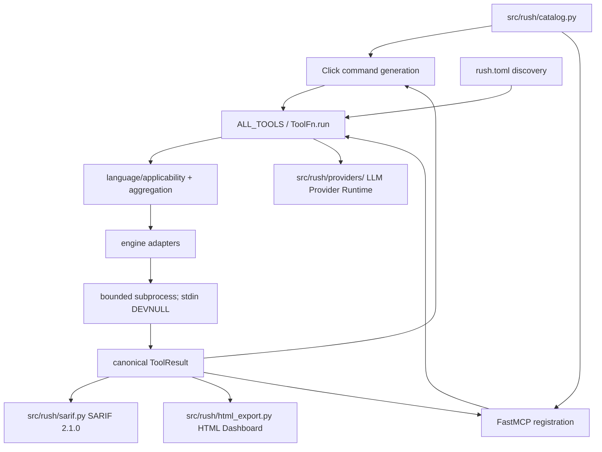
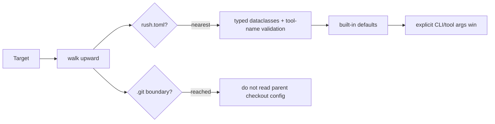
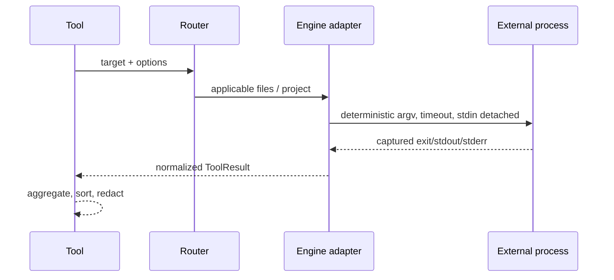

# Rush architecture

Rush is a Python 3.12 package with two transports and one implementation layer. Click CLI commands and FastMCP tools invoke the same objects from `src/rush/tools/`; external programs are isolated behind adapters in `src/rush/engines/`.

## Core contracts

- `TOOL_SPECS` and `ENGINE_SPECS` are declarative metadata; `ALL_TOOLS` and `ENGINES` are executable registries. Tests enforce parity across all 37 tools and 121 engines.
- `ToolFn.run(path, *, config, ...)` is the internal execution surface. `ToolFn.__call__` is MCP-facing and must expose only JSON-schema-safe parameters.
- ToolResult required keys are `tool`, `engine`, `engine_version`, `status`, `duration_ms`, `summary`, `findings`, and `raw`; optional extensions include metrics, artifacts, metadata, and review fields.
- A missing optional executable returns `skipped`; it must not raise or install anything.
- Multi-engine aggregation is deterministic: worst status wins (`error > fail > warn > ok > skipped`), durations sum, findings sort by location/rule/message, and provenance is retained.
- **Reporting & Export Subsystems**:
  - **SARIF 2.1.0**: Standardized static analysis interchange format generated via `src/rush/sarif.py` (`--export-sarif`).
  - **Interactive HTML**: Self-contained zero-dependency single-file reports generated via `src/rush/html_export.py` (`--export-html`).
- **Pluggable LLM Provider Layer**:
  - Isolated provider abstractions in `src/rush/providers/` (`LLMProvider`, `AnthropicProvider`, `OpenAIProvider`) decoupling runtime AI model invocations from the core CLI and MCP transport layers.
- **Binary Resolution Caching**:
  - In-memory `@lru_cache` (`_resolve_binary_cached`) eliminating repetitive `shutil.which` PATH searches on Windows.
- **Flag-Salted Result Caching (Phase 21)**:
  - SQLite-backed result cache (`src/rush/cache.py`) with content-hashed, flag-salted cryptographic keys (`.rush/cache.db`).
- **Real-Time Debounced Watcher (Phase 25)**:
  - Multi-threaded file system watcher (`src/rush/watcher.py`) with configurable debounce windows (300ms default) and automatic directory pruning (`.git`, `node_modules`, `.venv`).
- **Polyglot Monorepo Scoping (Phase 26)**:
  - Deterministic workspace topology discovery (`src/rush/discovery/workspace.py`) for npm, pnpm, yarn, Cargo, and Turborepo with strict path containment.
- **Authenticated In-Memory Web Dashboard & Rich TUI (Phase 27)**:
  - Single-binary zero-dependency local HTTP server (`src/rush/dashboard.py`) binding exclusively to `127.0.0.1` with ephemeral `X-Rush-Auth` tokens, DNS rebinding prevention, and CSRF Origin validation.
  - Interactive terminal finding explorer (`src/rush/tui.py`) built with Rich layouts.
- **Trust-Gated Dynamic Plugin Runtime (Phase 28)**:
  - Declarative script plugin execution (`src/rush/plugins/`) with local repository trust verification (`~/.rush/trusted_repositories.json`) preventing arbitrary code execution in untrusted checkouts.
- **Closed-Loop AI Patch Remediation & Session Memory (Phase 29)**:
  - Bounded multi-turn session memory ledger (`src/rush/session_memory.py`) framed with strict XML boundary tags (`<rush_session_memory>`).
  - Atomic unified diff patch generator and applier (`src/rush/patch_generator.py`) with sensitive file shielding (`.git`, `.env`).
- **Autonomous Agent Safety & Worktree Sandboxing (Phase 31)**:
  - Destructive command interceptor (`src/rush/safety/`) blocking harmful shell patterns and enforcing repository path containment.
  - Ephemeral Git worktree sandboxing isolating untrusted agent modifications.
- **Token Economy & Context Optimization (Phase 32)**:
  - Fast BPE token counting (`src/rush/token_economy/`) and AST outline compression eliminating prompt token waste.
- **Full-Stack Static Sync & Type-Safety Gates (Phase 33)**:
  - Bidirectional OpenAPI JSON contract verifier and TypeScript interface generator (`src/rush/sync/`).
- **Codebase Hygiene & 3-Way AST Conflict Resolution (Phase 34)**:
  - Polyglot dead code and unreferenced export scanner (`src/rush/hygiene/`).
  - Semantic 3-way AST merge solver resolving conflicting branch edits.
- **Polyglot CodeGraph & Verbatim AST Slicing (Phase 35)**:
  - SQLite-backed Code Property Graph store (`src/rush/codegraph/`) providing sub-millisecond verbatim symbol slicing with line numbers.
- **Frontend Asset & Bundle Optimization (Phase 36)**:
  - Raw, Gzip, and Brotli chunk size calculator and performance budget gates (`src/rush/bundle/`).
- **Git Hotspots & Defect Risk Analytics (Phase 37)**:
  - Commit churn velocity and McCabe cyclomatic complexity correlation matrix (`src/rush/hotspots/`).
- **Multi-IDE Agent Governance & Repo Scaffolding (Phase 38)**:
  - Canonical `AGENTS.md` instruction compiler (`src/rush/governance/`) emitting synchronized `.cursorrules`, `.clinerules`, and Claude instructions.
- **Git Pre-Commit Intelligence & Hook Guard (Phase 39)**:
  - Sub-second staged AST parser, Trojan Source Unicode detector, and cryptographic hook tamper guard (`src/rush/hook/`).
- **Multi-Model Consensus & Composite Quality Scorecard (Phase 40)**:
  - 6-pillar repository health scoring engine (`src/rush/score/`), SARIF 2.1.0 exporter, SVG badge generator, and multi-model consensus reconciliation.
- **TDD & Architectural Sensors**:
  - `rush tdd` verifies Red-Green-Refactor compliance.
  - AST and modular boundary sensors (`tach`, `aislop`, `globstar`, `sentrux`, `medusa`, `clines`, `undercover`, `cejel`) enforce structural architectural hygiene without requiring runtime network calls.

## Configuration flow

## Engine flow

## Safety architecture

Stdio MCP stdout is reserved for JSON-RPC. Logs are stderr NDJSON. Engine processes cannot consume protocol input. Security-sensitive promoted adapters own config/environment constraints. Artifact writers validate target containment and overwrite intent. Browser/network/slow/fuzz/baseline/publication work is denied or skipped without explicit implemented permission.

See the focused developer chapters linked from [Developer guide](DEVELOPER_GUIDE.md) and the [ADRs](maintainers/adr/README.md).

