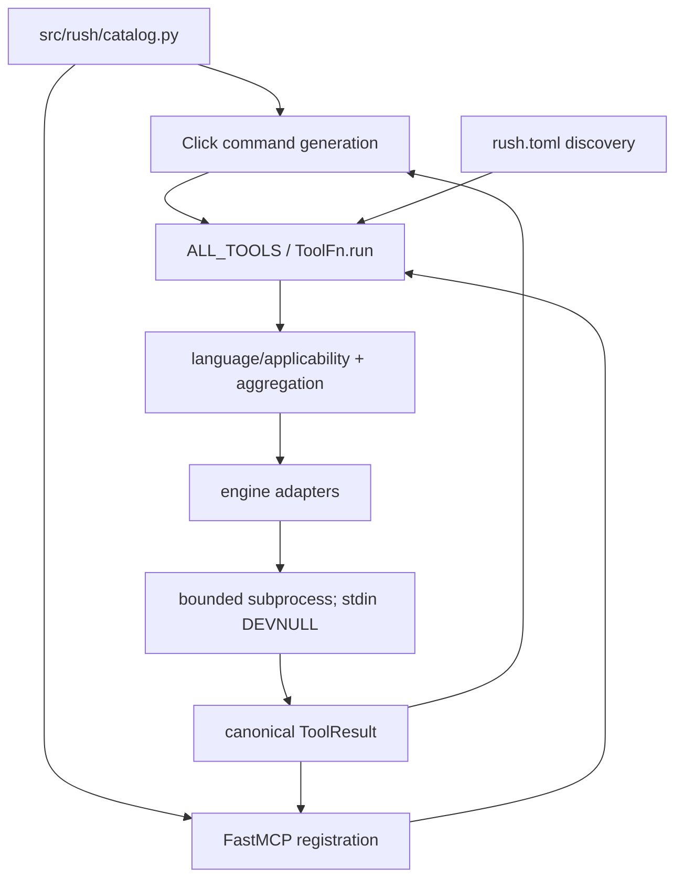
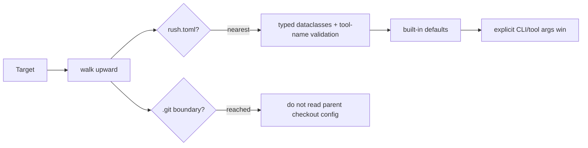
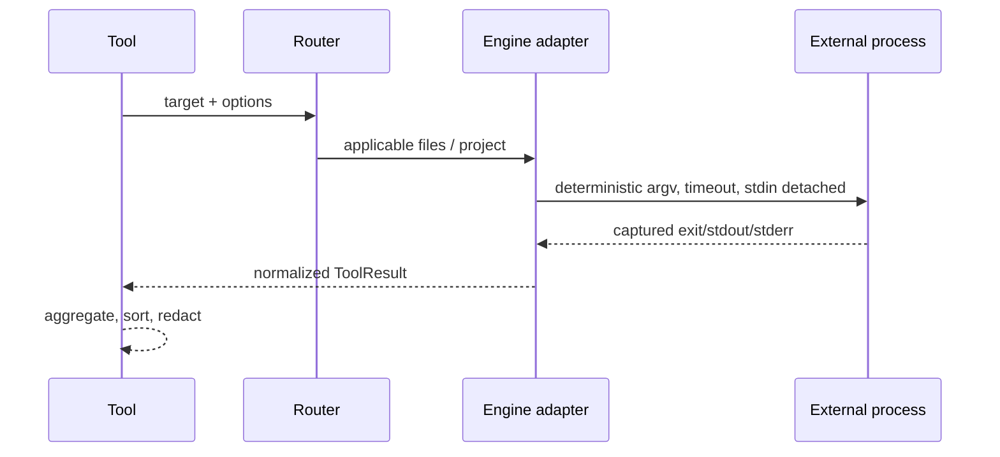

# Rush architecture

Rush is a Python 3.12 package with two transports and one implementation layer. Click CLI commands and FastMCP tools invoke the same objects from `src/rush/tools/`; external programs are isolated behind adapters in `src/rush/engines/`.

## Core contracts

- `TOOL_SPECS` and `ENGINE_SPECS` are declarative metadata; `ALL_TOOLS` and `ENGINES` are executable registries. Tests enforce parity.
- `ToolFn.run(path, *, config, ...)` is the internal execution surface. `ToolFn.__call__` is MCP-facing and must expose only JSON-schema-safe parameters.
- ToolResult required keys are `tool`, `engine`, `engine_version`, `status`, `duration_ms`, `summary`, `findings`, and `raw`; optional extensions include metrics, artifacts, metadata, and review fields.
- A missing optional executable returns `skipped`; it must not raise or install anything.
- Multi-engine aggregation is deterministic: worst status wins (`error > fail > warn > ok > skipped`), durations sum, findings sort by location/rule/message, and provenance is retained. The review aggregation path is explicitly serial, retains compact child tool/engine/status evidence, labels skipped/error children as partial metadata, deduplicates on normalized fingerprints, and never turns an error or skip into a clean result. Direct review only narrows scope when its caller explicitly supplies target-contained paths; it never shells out to infer a Git diff.

## Configuration flow

## Engine flow

## Safety architecture

Stdio MCP stdout is reserved for JSON-RPC. Logs are stderr NDJSON. Engine processes cannot consume protocol input. Security-sensitive promoted adapters own config/environment constraints. Artifact writers validate target containment and overwrite intent. Browser/network/slow/fuzz/baseline/publication work is denied or skipped without explicit implemented permission.

See the focused developer chapters linked from [Developer guide](DEVELOPER_GUIDE.md) and the [ADRs](maintainers/adr/README.md).
