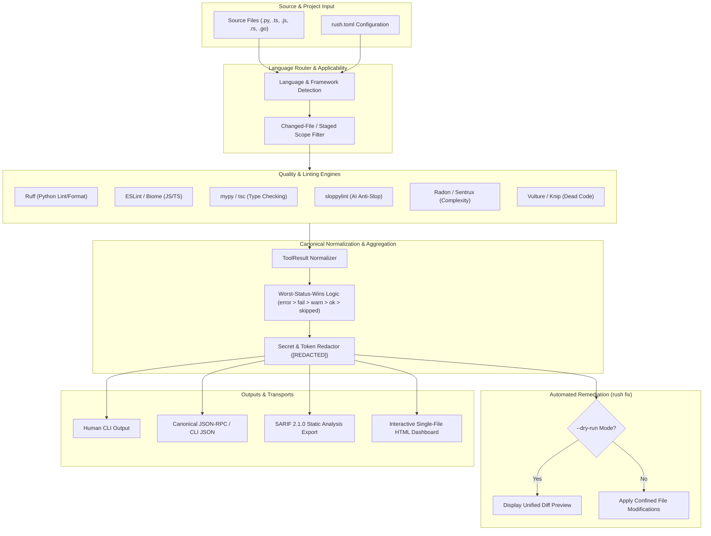
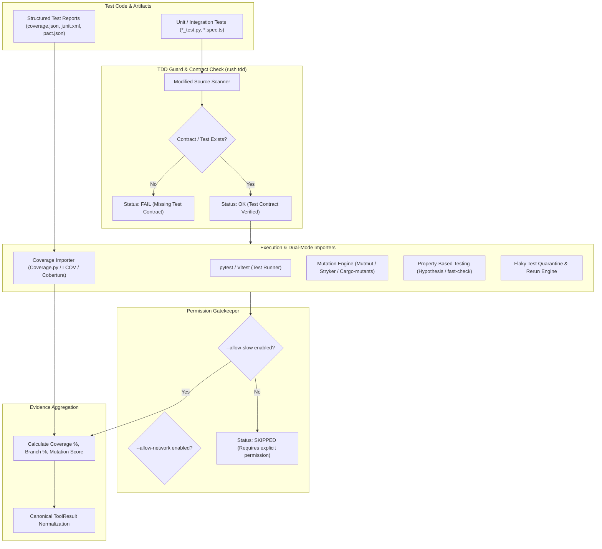
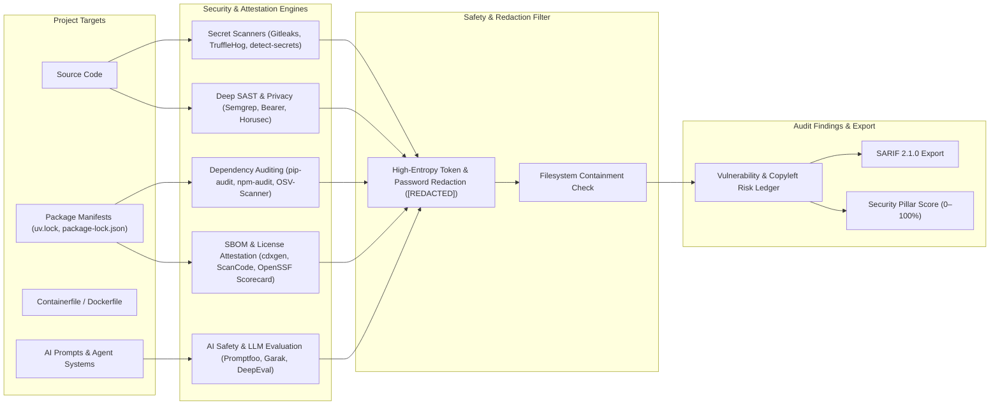
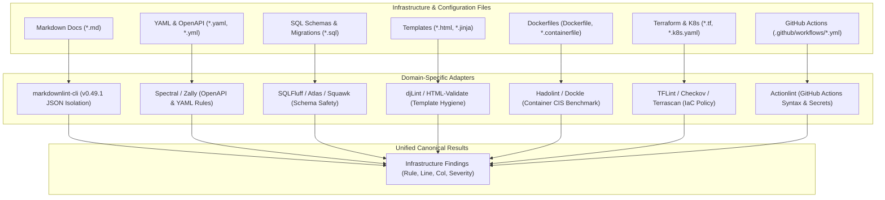
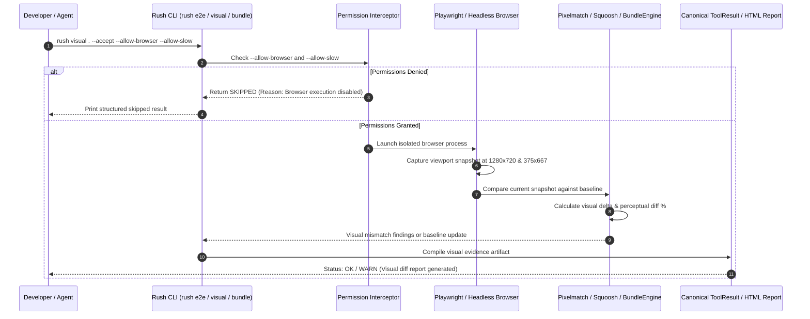
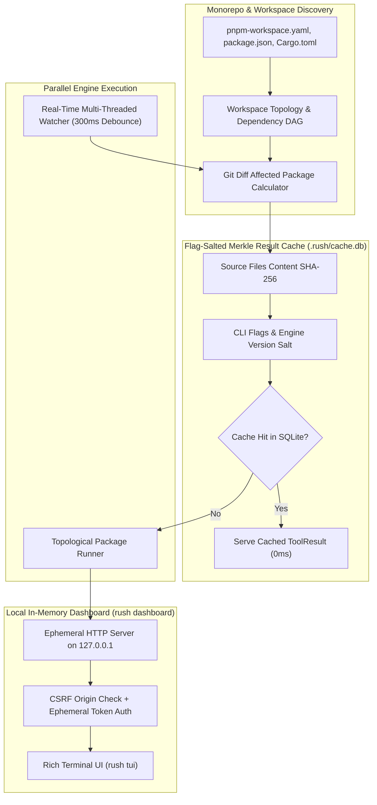
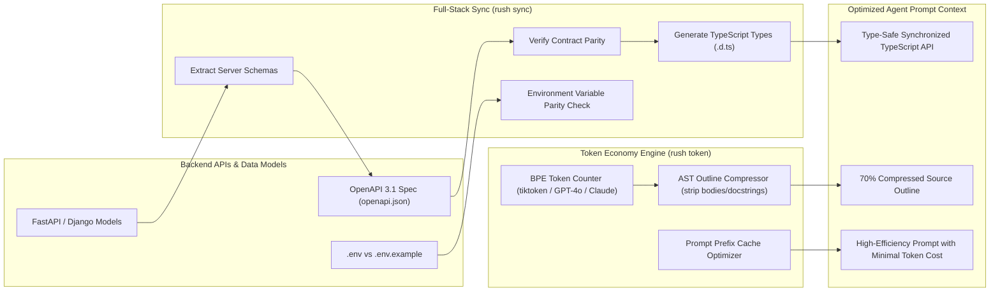
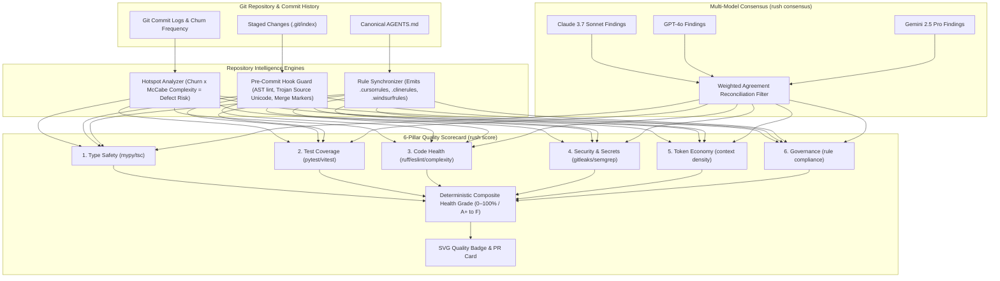

# Rush Subsystem & Bundle Architecture Diagrams

Rush is engineered as a unified, modular quality intelligence platform. To help developers, team leads, and AI agents visualize how each capability fits together, this document provides complete, high-fidelity visual architecture and sequence diagrams for each of Rush's 9 core subsystems ("bundles").

---

## 1. Core Code Quality & Automated Remediation Bundle

The Core Code Quality bundle orchestrates static analysis, deterministic heuristics, AST pattern matching, AI anti-slop filtering, and non-destructive automated remediation.



---

## 2. Test Intelligence & Reliability Bundle

The Test Intelligence bundle provides deep confidence scoring through test execution, Test-Driven Development (TDD) validation, and dual-mode evidence importers for coverage, mutation, property-based testing, and flaky test detection.



---

## 3. Security, Privacy & Supply Chain Bundle

The Security and Supply Chain bundle provides defense-in-depth across code privacy, SAST, high-entropy secrets, software bill of materials (SBOM), and AI safety evaluation.



---

## 4. Polyglot Infrastructure & Domain Languages Bundle

Rush provides dedicated, zero-configuration parsers and linters for non-code infrastructure, databases, configuration, and documentation.



---

## 5. Modern Web, UI & Visual Regression Bundle

The Modern Web and UI bundle delivers comprehensive web vitals, end-to-end browser automation, visual regression baseline comparison, and bundle chunk transfer auditing.



---

## 6. Workspace, Caching & Performance Bundle

The Workspace and Caching bundle accelerates multi-package monorepos with topological DAG execution, content-hashed result caching, and real-time debounced file watching.



---

## 7. Agentic Safety, Sandboxing & Skills Bundle

The Agentic Safety bundle surrounds autonomous coding agents (Cursor, Claude Code, Cline, Windsurf, Hermes) with strict safety boundaries, destructive command interception, ephemeral worktree sandboxes, atomic patch rollbacks, and multi-turn session memory.

```mermaid
sequenceDiagram
    autonumber
    participant Agent as Autonomous AI Agent
    participant Safety as Rush Safety Guard (rush safety)
    participant Sandbox as Git Worktree Sandbox (rush patch)
    participant Verifier as Test & Syntax Verifier
    participant Memory as Session Memory Ledger (rush memory)
    participant Repo as Working Tree Repository

    Agent->>Safety: Propose Command: `rm -rf /` or `git reset --hard`
    Safety->>Safety: Evaluate Destructive Pattern Rules
    Safety-->>Agent: [INTERCEPTED] Destructive command blocked by safety guard

    Agent->>Sandbox: Propose Remediation Patch (diff)
    Sandbox->>Sandbox: Create isolated temporary worktree branch
    Sandbox->>Sandbox: Apply patch inside sandbox
    Sandbox->>Verifier: Run syntax checks and test suite
    alt Verifier Fails / Introduces Regression
        Verifier-->>Sandbox: Tests Failed
        Sandbox->>Sandbox: Rollback patch, destroy temporary worktree
        Sandbox->>Memory: Log failure rationale and error trace
        Sandbox-->>Agent: Patch rejected; circuit breaker engaged
    else Verifier Passes 100% Green
        Verifier-->>Sandbox: All tests and linters passed
        Sandbox->>Repo: Promote clean patch to main working tree
        Sandbox->>Memory: Record successful remediation turn
        Sandbox-->>Agent: Patch applied and verified safely
    end
```

---

## 8. Full-Stack Sync & Token Economy Bundle

The Full-Stack Sync and Token Economy bundle optimizes LLM prompt efficiency, prevents context overflow, and guarantees type safety between frontend interfaces and backend APIs.



---

## 9. Repository Intelligence, Governance & Consensus Bundle

The Repository Intelligence bundle combines Git churn risk analysis, multi-IDE rule synchronization, sub-second pre-commit intelligence, multi-model AI consensus reconciliation, and unified 6-pillar repository health scoring.


