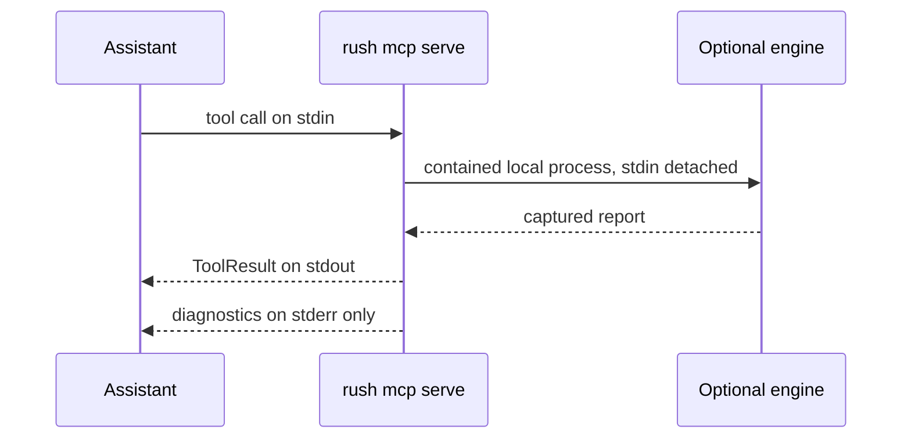

# Rush with coding assistants

A compatible coding assistant can launch Rush as a local child process and ask it to run the same checks available in the terminal. MCP is the protocol; stdio is the local pipe used to carry requests and results.

No port opens. Rush does not become a background network daemon. Configure a client using [MCP client setup](integrations/mcp-client-setup.md), then use prompts from [Working with AI agents](user-guide/working-with-ai-agents.md).

The assistant does not gain a working model review through Rush: default review remains deterministic and `--llm` remains a no-call stub.

## Next

Use [client setup](integrations/mcp-client-setup.md) and the [tool reference](reference/mcp-tool-reference.md).
