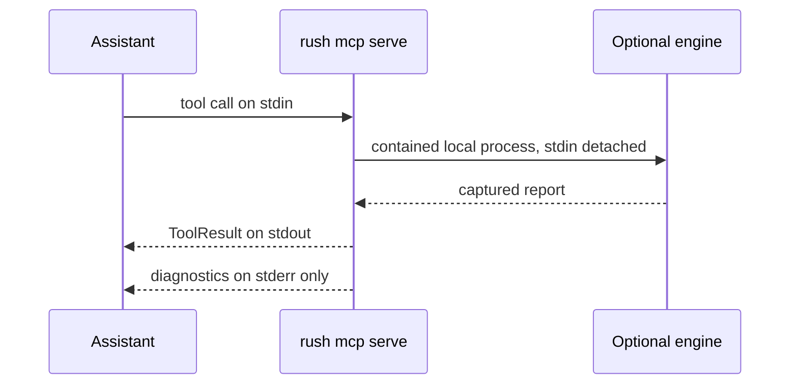

# Rush with coding assistants

## Provider-resume parity

MCP `rush_continuity` `provider_resume` uses the same shared operation as the CLI. `claude_code`, `codex_cli`, `antigravity_cli`, fixed-loopback `omniroute_api`, and `9router_cli` are implemented, and network permission is explicit. `9router_cli` runs Codex through fixed local 9Router with a child-process-only credential and no model argument. `9router_api` remains unavailable; Z.AI is deferred without process or credential access.

## Session continuity

MCP exposes the catalogued `rush_continuity` tool with `path`, `operation` (`save`, `list`, or `restore`), optional `name`/`files`, and `allow_cache_write`. It returns the same canonical object as `rush session`; saving without the explicit boolean permission returns `skipped` and does not create a checkpoint.

A compatible coding assistant can launch Rush as a local child process and ask it to run the same checks available in the terminal. MCP is the protocol; stdio is the local pipe used to carry requests and results.

No port opens. Rush does not become a background network daemon. Configure a client using [MCP client setup](integrations/mcp-client-setup.md), then use prompts from [Working with AI agents](user-guide/working-with-ai-agents.md).

The assistant does not gain a working model review through Rush: default review remains deterministic and `--llm` remains a no-call stub.

## Transport Purity & Response Sanitization (Phase 53)
- **Stdout Invariant**: `sys.stdout` carries only valid JSON-RPC frames during `rush mcp serve`. Logging, progress indicators, and diagnostics are strictly confined to `sys.stderr`.
- **Fail-Safe Diagnostics**: Diagnostic errors emitted to `sys.stderr` are serialized as structured NDJSON records with fully formatted, credential-redacted stack traces. If formatting encounters an error, a structured fallback line is written so diagnostics never silently vanish.
- **Recursive Response Sanitization**: All `ToolResult` dictionaries and MCP responses are sanitized via `sanitize_value`, ensuring that secrets and API keys are redacted from both values and nested keys.

## Operation Taxonomy & Schema Kernel Integration (Phase 54)
- **Tool Operation Separation**: Tool operations (`kind = "tool"`, e.g. `rush_lint`, `rush_security`) return validated `ToolResultV1` structures compliant with schema version `1.0.0`.
- **Protocol Frame Integrity**: Service and protocol-level operations (`kind = "service"`, e.g. `mcp.initialize`, `mcp.ping`, `mcp.list_tools`) return raw protocol frames without `ToolResultV1` wrapping. `ServiceOperationAdapter` enforces this separation fail-closed.
- **Admin Operation Routing**: Admin commands (`kind = "admin"`, e.g. cache purges, info queries) return typed operation envelopes or direct status payloads.

## Next

Use [client setup](integrations/mcp-client-setup.md) and the [tool reference](reference/mcp-tool-reference.md).

## Workspace Physical Containment for MCP Tools (Phase 55)
- **Path Containment Invariant**: All MCP tools operating on local file paths are validated against `PhysicalRoot` to defeat symlink path traversal and Windows reparse point escapes.
- **Atomic Persistence**: Server-side session and scratch writes utilize `AtomicFile` to eliminate race conditions and corrupted partial files during tool execution.

### Plugin Execution Security under MCP (Phase 56)
Plugin executions initiated via MCP administrative endpoints enforce user-owned ledger authorization and snapshot integrity. Cloned repository receipts are strictly rejected as non-authorizing evidence.
