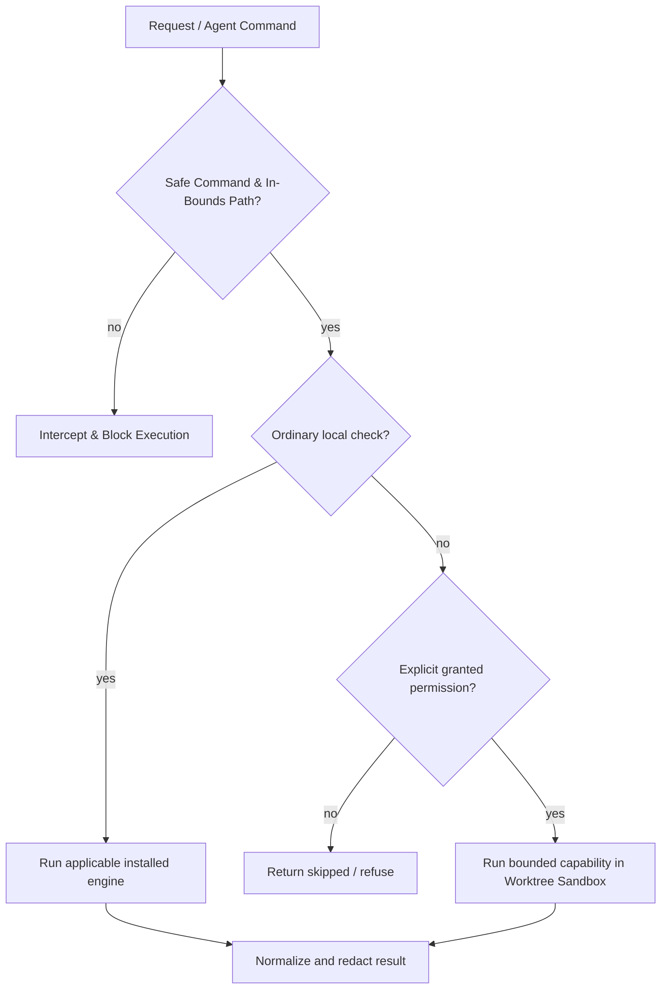

# Safety overview

## Bounded provider handoff

Provider resume is opt-in, projection-limited, and non-retrying. OmniRoute uses one fixed loopback API request and validates semantic completion without retaining its response. `9router_cli` runs Codex through fixed local 9Router with a child-process-only credential, no model argument, and no output retention. Z.AI is deferred without invocation. There is no automatic provider routing, OAuth flow, or profile mutation.

Rush aims for safe defaults, but current safety defects remain open. `fix --dry-run` can destroy user work, `ship clean` deletes by default, checkpoint/governance symlinks escape containment, and custom token-outline output can expose secrets. See [Known issues](KNOWN_ISSUES.md) and [P64-01–P64-06](phase-plans/phase-64-runtime-correctness-and-safe-execution-plan.md); those fixes are planned.

- **No implicit installs.** Missing optional engines return `skipped`.
- **No silent source rewrite.** Review/check commands are read-only; formatter mutation is an explicit path and `--check` is available.
- **No hidden publication.** Current CLI exposes `release check` for version parity; it does not publish packages.
- **No history rewrite.** Commit-message checking never changes Git.
- **MCP transport.** MCP is local stdio only. The separate `dashboard` command starts a loopback HTTP server with open Phase 66 defects.
- **Execution permissions.** Supported boundaries use invocation flags and `metadata.execution`; AI eval lacks required gating (F08), so this is not yet universal enforcement.
- **No model marketing beyond implementation.** Review is deterministic; Graft is explicit; `--llm` can send findings to a configured provider.
- **No secrets in normalized logs/results.** Obvious secret assignments are redacted, but raw external tool behavior still deserves care.
- **No automatic coordination recovery.** Continuity may surface local ownership, stale evidence, merge conflicts, and redacted recovery receipts, but it never unlocks, merges, replays, or retries on the caller’s behalf.
- **No historic instruction promotion.** Session handoff stores historic-instruction presence at `trust_tier="EXTERNAL_WRITE"`/`"DERIVED"` (Phase 61's unified typed-artifact schema — never `STATED` on entry, replacing the earlier binary quarantine flag); it never becomes a current directive.
- **No silent stale replay.** Restore recomputes declared dependency hashes and labels changed or missing dependencies `stale`; legacy checkpoints remain `unknown` rather than being migrated automatically.
- **Autonomous Agent Safety & Worktree Sandboxing.** `rush guard check-cmd` inspects supplied strings and `rush guard check-path` checks a supplied path. They do not intercept external agent actions. Isolated public patch apply and safe cleanup remain planned in P64-04.
- **Subagent Acyclic Invocations.** Hierarchical agent execution trees are validated to guarantee bounded call depth and acyclic DAG topology.

Read [Permissions](safety/permissions.md), [Privacy](safety/privacy-and-data-handling.md), and [Security model](safety/security-model.md).

## Context Safety, Grounding & Secret Redaction (Phases 41–43)
* **Secret Redaction**: Normalized output uses `[REDACTED]`; custom `rush_token_outline` bypass is still open (F07).
* **Phantom Package Defense**: `GroundingVerifier` parses AST imports against `sys.stdlib_module_names` and `importlib.metadata.distributions()` to block supply-chain typosquatting and hallucinated libraries.
* **Failure Ledger**: `FailureLedger` records failed patch AST fingerprints (`subject="failure"` rows in the unified `TypedArtifactStore`, `.rush/memory.db`, as of Phase 61 — formerly its own `.rush/memory/failures.db`) to prevent repetitive error loops.

## Sanitization & Write Boundary Invariants (Phase 53)
- **Deep Recursive Redaction**: `sanitize_value` applies recursive masking to all strings, sequences, and dictionary keys/values across CLI, MCP, and exported reports.
- **Fail-Closed Type Safety**: Unrecognized object instances cannot leak raw state; they fail closed with `[UNSUPPORTED_TYPE:<name>]`.
- **Pre-Truncation Guarantee**: Subprocess outputs are completely sanitized before length caps are enforced, eliminating secret fragments at truncation seams.
- **Write-Boundary Shielding**: Every persistent writer (governance rules, mesh locks, audit logs, patch memory, session flights, preferences, invariant graphs, and report artifacts) runs sanitization before disk writes. As of Phase 61, patch memory, session flights, preferences, and invariant graphs all write through the same `TypedArtifactStore.write()`, which runs `sanitize_value()` internally — a caller cannot bypass redaction by forgetting to call it.
- **Resilient Diagnostics**: `NdjsonHandler` safely formats exception tracebacks with credential masking and guarantees structured error fallback rather than swallowing diagnostic records.

## Fail-Closed Schema Validation & Boundary Isolation (Phase 54)
- **Downstream Schema Verification**: Tool results run Phase 54 schema validation downstream of Phase 53 sanitization, guaranteeing that structurally invalid findings or malformed statuses are caught before emission.
- **Fail-Closed Result Normalization**: Invalid results raise structured `ValidationErrorV1` records with standard error codes (`MISSING_REQUIRED_KEY`, `INVALID_TYPE`, `INVALID_STATUS`, `INVALID_TIMESTAMP`, `INVALID_SEVERITY`).
- **Operation Isolation**: Public operations are partitioned into `tool`, `admin`, and `service` domains. Service operations (e.g. MCP transport initialization) are prohibited from returning wrapped tool results, maintaining protocol security.

## Physical Containment & Durable Atomic Replacement (Phase 55)
- **Physical Boundary Enforcement**: Workspace paths are validated by `PhysicalRoot` to defeat symlink escapes, parent traversal, and Windows junction/reparse points.
- **Durable Atomic Replacement**: Files written via `AtomicFile` execute in destination directories using `.rush_tmp_` prefix with explicit `flush()` and `os.fsync()` before rename.
- **Old-or-New Destination Guarantee**: Destination files are guaranteed to remain in either their original valid state or new valid state; partial writes are wiped via manager-owned cleanup.

### Plugin Execution Safety & Fail-Closed Boundaries (Phase 56)
- External plugins run under fail-closed verification: any missing trust record, altered byte, symlink escape, or unsupported secret channel denies execution and spawns zero child processes.
- Process command lines and environment tables never contain sensitive credentials.
- All plugin outputs are parsed, sanitized via redactor, and adapted to canonical `ToolResultV1`.

## Single Execution Boundary and Fail-Closed Egress (Phase 57)

- **TypeError handling**: Invocation adapters bind calls once, but workflow suites still retry `TypeError` without permissions (F34). Single execution across callers remains planned in P65-04.
- **Provider Egress Truthfulness**: The `review_kind = "llm"` label is assigned strictly after receiving a non-empty, schema-valid response from an approved HTTPS origin. Network failures, timeouts, or permission denials fall back to heuristic reviews or structured error states.

## Phase 58 Architecture: Capability Locks, CAS Memory, and Fail-Closed Patch Verification

These Phase 58 component contracts are not whole-application safety guarantees. Checkpoint symlink reads, governance symlink writes, sandbox fallback and patch cleanup remain open ([application review](reports/phase-64-66-application-review.md) F03–F05/F43; [Phase 64 runtime plan](phase-plans/phase-64-runtime-correctness-and-safe-execution-plan.md) P64-03/P64-04).

1. **Capability Locks & Verifier Custody (`rush.mcp_mesh`)**:
   - Callers retain high-entropy capability tokens (`LockCapabilityInput`) delivered exclusively via protected channels (`stdin`, `descriptor`, or sensitive MCP parameters); argv and environment leakage are rejected fail-closed.
   - `MeshLockManager` stores verifier-only records (`LockLeaseRecord`) generated via `rush.io.VerifierRecord` (PBKDF2-HMAC-SHA256, 100k rounds) with monotonic generation counters and `rush.io.PhysicalRoot` containment under `.rush/locks`.
   - Renewal and release verify caller capability in constant time (`hmac.compare_digest`); wrong, low-entropy, or stale tokens fail closed.

2. **CAS Map Transactions & Persistent Memory (`rush.memory`)**:
   - `CASMapTransaction` enforces optimistic concurrency with monotonic version numbers and atomic file replacement (`rush.io.AtomicFile`) using sanitized JSON payloads (`SanitizedJsonValue`).
   - Store states are truthfully separated into distinct typed exceptions: `StoreNotFoundError`, `StoreCorruptionError` (retaining raw bytes and SHA-256 digest), `StoreValidationError`, `StoreIOError`, and `CASConflictError` (exhausted retries fail closed).
   - `PreferenceStore`, `InvariantGraph`, and `MerkleInvalidator` eliminate silent empty dict fallbacks.

3. **Atomic Checkpoint Journals & Unified Store Persistence (`rush.memory.checkpoint_journal`)**:
   - `checkpoint_journal.py` is a thin compatibility view over `TypedArtifactStore` (`rush.memory.store`, Phase 61): `save_checkpoint()`/`restore_checkpoint()` write/read each checkpoint as one `MemoryArtifact` row (`family="handoff"`, `subject="active_context"`); canonical data lives in `.rush/memory.db`, not a per-checkpoint JSON file.
   - `save_checkpoint()` still writes a physical `.json` artifact via `rush.io.AtomicFile` and returns its `Path` (`dest.exists()` holds), preserving the pre-Phase-61 contract for existing callers; explicit schema version `1.0.0` is unchanged.
   - Corrupted or unparseable checkpoint files are preserved on disk, cryptographically digested with SHA-256, and surfaced in `list_checkpoints()` with status `corrupt` — unchanged by the Phase 61 migration.

4. **Contained Patch Verification & Atomic Rollback (`rush.patch`)**:
   - `PatchContract` cryptographically binds base commit, tree digest, patch content hash, sandbox directory under `rush.io.PhysicalRoot`, command plans, and policy review classes (`standard`, `policy-changing`, `privileged`).
   - Workspaces must be clean before sandboxing or patch application; dirty checkouts fail closed with `DirtyWorkspaceError`.
   - `PatchVerifier` requires at least one passing executed test command; zero executed commands return `outcome='unavailable'` and `False` (zero commands never verify).
   - Current rollback uses broad `git reset --hard`/`git clean -fd` and can destroy unrelated changes. It does not restore an exact pre-invocation index/worktree. Status: planned — bounded restoration in P64-01/P64-04, [Phase 64 runtime plan](phase-plans/phase-64-runtime-correctness-and-safe-execution-plan.md); [application review](reports/phase-64-66-application-review.md) F01/F43.

5. **Runtime Output Boundary Adapter Enforcement (`rush.contracts.operations`)**:
   - 100% of public operations declared in `governance/public-operations.toml` enforce their target adapters (`ToolOperationAdapter`, `AdminOperationAdapter`, `ServiceOperationAdapter`) at runtime boundaries while preserving native JSON-RPC service protocol messages.
### Build Claim Truthfulness & Engine Safety (Phase 59)
Rush guarantees truthful build claims: unsigned provenance drafts are never reported as signed or accredited with SLSA levels. Missing distribution packages fail closed with skipped status. Lint/format and simulated-workload success defects remain open (F09–F11); a catalog status alone does not prove execution.
