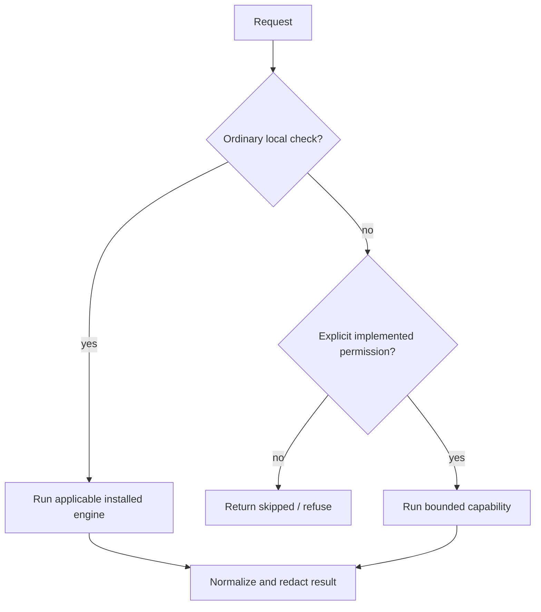

# Safety overview

Rush is designed to make the safe action the default.

- **No implicit installs.** Missing optional engines return `skipped`.
- **No silent source rewrite.** Review/check commands are read-only; formatter mutation is an explicit path and `--check` is available.
- **No hidden publication.** Release is dry-run; publication execution is intentionally unavailable.
- **No history rewrite.** Commit-message checking never changes Git.
- **No network service.** MCP is local stdio only.
- **No surprise expensive capability.** Browser, slow, network, fuzz, and baseline-changing operations require explicit permission by design; current generic CLI omits most permission flags and therefore skips.
- **No model marketing beyond implementation.** Review is deterministic; Graft is explicit; `--llm` makes no provider call.
- **No secrets in normalized logs/results.** Obvious secret assignments are redacted, but raw external tool behavior still deserves care.

Read [Permissions](safety/permissions.md), [Privacy](safety/privacy-and-data-handling.md), and [Security model](safety/security-model.md).
