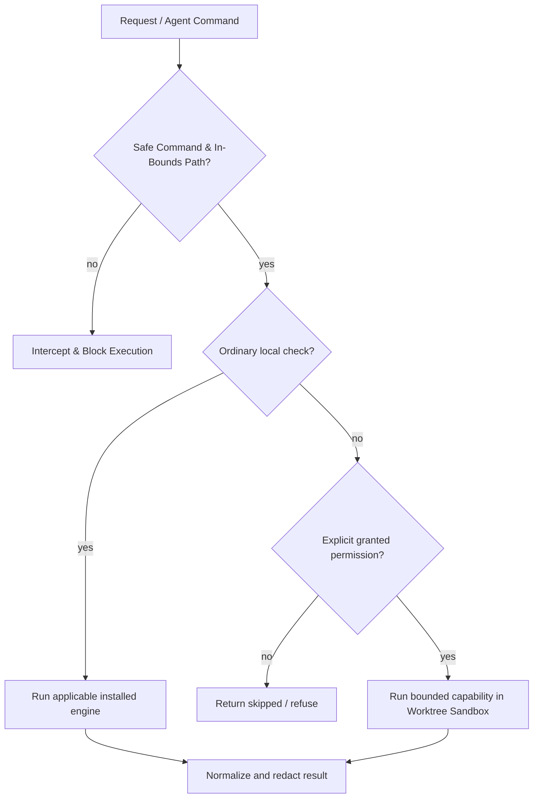

# Safety overview

## Bounded provider handoff

Provider resume is opt-in, projection-limited, and non-retrying. OmniRoute uses one fixed loopback API request and validates semantic completion without retaining its response. `9router_cli` runs Codex through fixed local 9Router with a child-process-only credential, no model argument, and no output retention. Z.AI is deferred without invocation. There is no automatic provider routing, OAuth flow, or profile mutation.

Rush is designed to make the safe action the default.

- **No implicit installs.** Missing optional engines return `skipped`.
- **No silent source rewrite.** Review/check commands are read-only; formatter mutation is an explicit path and `--check` is available.
- **No hidden publication.** Release is dry-run; publication execution is intentionally unavailable.
- **No history rewrite.** Commit-message checking never changes Git.
- **No network service.** MCP is local stdio only.
- **Explicit execution permissions.** Browser, slow, network, download, build, and artifact-write operations require explicit permission flags (`--allow-*`) and report structured `metadata.execution`.
- **No model marketing beyond implementation.** Review is deterministic; Graft is explicit; `--llm` makes no provider call.
- **No secrets in normalized logs/results.** Obvious secret assignments are redacted, but raw external tool behavior still deserves care.
- **No automatic coordination recovery.** Continuity may surface local ownership, stale evidence, merge conflicts, and redacted recovery receipts, but it never unlocks, merges, replays, or retries on the caller’s behalf.
- **No historic instruction promotion.** Session handoff stores historic-instruction presence only as quarantined evidence; it never becomes a current directive.
- **No silent stale replay.** Restore recomputes declared dependency hashes and labels changed or missing dependencies `stale`; legacy checkpoints remain `unknown` rather than being migrated automatically.
- **Autonomous Agent Safety & Worktree Sandboxing.** Dangerous shell commands (`rm -rf`, `drop table`, `reset --hard`) are intercepted via `rush guard check-cmd`; filesystem writes are strictly confined to workspace boundaries via `rush guard check-path`; AI remediation patches run in isolated Git worktree sandboxes with circuit breakers.
- **Subagent Acyclic Invocations.** Hierarchical agent execution trees are validated to guarantee bounded call depth and acyclic DAG topology.

Read [Permissions](safety/permissions.md), [Privacy](safety/privacy-and-data-handling.md), and [Security model](safety/security-model.md).

## Context Safety, Grounding & Secret Redaction (Phases 41–43)
* **Secret Redaction**: `PackageLinter` and all Rush transports redact keys as `[REDACTED]`.
* **Phantom Package Defense**: `GroundingVerifier` parses AST imports against `sys.stdlib_module_names` and `importlib.metadata.distributions()` to block supply-chain typosquatting and hallucinated libraries.
* **Failure Ledger**: `FailureLedger` records failed patch AST fingerprints in `.rush/memory/failures.db` to prevent repetitive error loops.

## Sanitization & Write Boundary Invariants (Phase 53)
- **Deep Recursive Redaction**: `sanitize_value` applies recursive masking to all strings, sequences, and dictionary keys/values across CLI, MCP, and exported reports.
- **Fail-Closed Type Safety**: Unrecognized object instances cannot leak raw state; they fail closed with `[UNSUPPORTED_TYPE:<name>]`.
- **Pre-Truncation Guarantee**: Subprocess outputs are completely sanitized before length caps are enforced, eliminating secret fragments at truncation seams.
- **Write-Boundary Shielding**: Every persistent writer (governance rules, mesh locks, audit logs, patch memory, session flights, preferences, invariant graphs, and report artifacts) runs sanitization before disk writes.
- **Resilient Diagnostics**: `NdjsonHandler` safely formats exception tracebacks with credential masking and guarantees structured error fallback rather than swallowing diagnostic records.

## Fail-Closed Schema Validation & Boundary Isolation (Phase 54)
- **Downstream Schema Verification**: Tool results run Phase 54 schema validation downstream of Phase 53 sanitization, guaranteeing that structurally invalid findings or malformed statuses are caught before emission.
- **Fail-Closed Result Normalization**: Invalid results raise structured `ValidationErrorV1` records with standard error codes (`MISSING_REQUIRED_KEY`, `INVALID_TYPE`, `INVALID_STATUS`, `INVALID_TIMESTAMP`, `INVALID_SEVERITY`).
- **Operation Isolation**: Public operations are partitioned into `tool`, `admin`, and `service` domains. Service operations (e.g. MCP transport initialization) are prohibited from returning wrapped tool results, maintaining protocol security.
