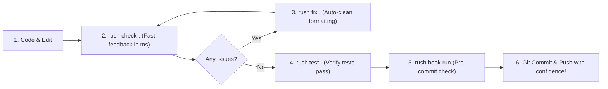

# The Friendly Rush User Guide

Welcome to Rush! If you are new to code quality tools, static analysis, or pair-programming with AI coding assistants, you are in the right place. This guide is written in plain, human language to help you get up and running in minutes without getting lost in technical jargon.

---

## What is Rush?

Imagine you are building a house. Before handing the keys over to the owner, you want an experienced building inspector to walk through the rooms:
- Is the foundation solid, or are there hidden structural cracks?
- Did someone leave exposed electrical wiring (like leaked API keys or secrets)?
- Are the doors built to standard dimensions so they open smoothly (linting and formatting)?
- Did the builder leave behind unfinished scaffolding or empty closets (dead code and empty stubs)?

**Rush is your automated code inspector and AI copilot safety harness.**

Instead of forcing you to manually configure 15 different complicated command-line tools—each with its own arcane flags, strange output formats, and steep learning curve—Rush gives you a single, unified, friendly front door. You run one simple command, and Rush orchestrates the best tools for your project, presenting clear, actionable feedback.

---

## 1. Getting Started in 30 Seconds

### Step 1: Run your first review
Open your terminal in any project folder and type:

```bash
rush review .
```

### What happens behind the scenes:
Rush instantly inspects your files using lightweight, deterministic rules. It checks for common code smells, unfinished `TODO` markers, bloated functions, and missing docstrings.

If everything looks great, Rush prints a cheerful confirmation. If it spots something worth your attention, it gives you the exact file name and line number, along with a helpful hint explaining why it flagged the line.

---

## 2. The Everyday Workflow (A Day in the Life with Rush)

Here is how thousands of developers and AI agents use Rush throughout their daily coding routine:



### The 4 Routine Commands:

1. **`rush check .`** (The Quick Health Check):
   - Run this while you are actively writing code. It runs your linters, format checkers, and type checkers together in milliseconds.
2. **`rush fix .`** (The Automatic Broom):
   - Spot some messy indentation, inconsistent quotes, or unused imports? Run `rush fix .` and let Rush safely clean it up for you. (Tip: Use `rush fix . --dry-run` to preview the changes first!)
3. **`rush test .`** (The Safety Net):
   - Runs your unit and integration tests to guarantee that your changes didn't accidentally break existing behavior.
4. **`rush gate .`** (The Pre-Merge Guard):
   - Before opening a Pull Request or merging your branch into `main`, run `rush gate .` to run a comprehensive quality check across all standards.

---

## 3. How to Read Rush Results Without Feeling Overwhelmed

Whenever Rush finishes checking your project, it assigns a clear **Status** to the result:

| Status | What it Means | What You Should Do |
|---|---|---|
| **`OK`** (Green) | Everything looks fantastic! | Celebrate and keep coding. |
| **`WARN`** (Yellow) | Advisory feedback or minor suggestions. | Take a quick look. It won’t break your build, but fixing it will keep your code clean. |
| **`FAIL`** (Red) | A definite issue was found (a broken test, type error, or syntax flaw). | Open the indicated file and line to resolve the error. |
| **`SKIPPED`** (Gray) | An optional tool is not installed on your machine. | Don't worry! Rush skips tools gracefully without crashing. If you want that check, install the tool; otherwise, feel free to ignore it. |
| **`ERROR`** (Red) | Something unexpected happened (like a malformed configuration file). | Check the error message for hints or run `rush doctor .` to diagnose your setup. |

---

## 4. Coding with AI Assistants (Cursor, Claude, Cline & Friends)

If you use AI coding assistants, Rush is your new best friend. AI models are lightning fast, but they can occasionally write repetitive code ("AI slop"), forget to write tests, or propose dangerous commands.

Rush includes dedicated guides for both [Agentic Rush](AGENTIC_RUSH.md) and [Vibecoding with Rush](VIBECODING.md) that protect your codebase:
- **`rush slop .`**: Catches AI hallucinations, repetitive boilerplate, and useless comments.
- **`rush tdd .`**: Verifies that your AI wrote tests for every new feature.
- **`rush safety check-cmd "<cmd>"`**: Intercepts destructive commands before they harm your filesystem.
- **`rush codegraph slice "<symbol>"`**: Slices exact function implementations to save 90% of prompt tokens.

👉 Check out the [Vibecoding Master Portal](VIBECODING.md), the [Working with AI Agents Guide](user-guide/working-with-ai-agents.md), and the [Agentic Rush Knowledge Base](AGENTIC_RUSH.md) to learn more.


---

## 5. Visual Dashboards & Terminal UI

Prefer visual interfaces over terminal text? Rush has you covered:

- **Interactive Terminal UI**:
  ```bash
  rush ui .
  ```
  Launches a keyboard-navigable terminal dashboard to browse findings file by file.

- **Local Web Dashboard**:
  ```bash
  rush dashboard .
  ```
  Opens an authenticated, private web dashboard in your browser (`http://127.0.0.1`) complete with metric charts, vulnerability summaries, and remediation tips.

---

## 6. Deep Dive Chapters

Explore our focused, beginner-friendly guides for specific topics:

- [Everyday Workflow](user-guide/everyday-workflow.md): Step-by-step walkthrough of writing and shipping code with Rush.
- [Checking Code](user-guide/checking-code.md): Everything you need to know about linting, formatting, and typechecking.
- [Checking Project Files](user-guide/checking-project-files.md): Keeping Markdown, YAML, SQL, and Dockerfiles spotless.
- [Testing Confidence](user-guide/testing-confidence.md): Understanding unit tests, code coverage, and test reliability.
- [Security & Supply Chain](user-guide/security-and-supply-chain.md): Keeping secrets safe and dependencies free of vulnerabilities.
- [Understanding Results](user-guide/understanding-results.md): A detailed breakdown of severities, rules, and exit codes.
- [Troubleshooting Guide](user-guide/troubleshooting.md): Quick solutions for common questions and errors.
- [Subsystem Architecture Diagrams](BUNDLE_DIAGRAMS.md): High-level visual maps of all 9 Rush bundles.

## Context Intelligence & Ship Gates (Phases 41–43)
Rush v0.2.0 introduces context optimization, AI token reduction, and release readiness cockpits:
* `rush session save <name>`: Persist current session workspace context to `.rush/sessions/`.
* `rush token outline <path>`: Generate AST skeletons eliding method bodies to conserve 85%+ prompt tokens.
* `rush context retrieve <hash>`: Restore full uncompressed payloads from the SQLite CCR store.
* `rush context mistakes`: Audit historical Git revert post-mortems to avoid known regressions.
* `rush hallu-guard`: Scan codebase AST imports to detect hallucinated or uninstalled packages.
* `rush ship gate`: Execute the 7-vector pre-flight release readiness cockpit.

## Context Packing, Telemetry & Blast Radius (Phases 44–46)
* **`rush context pack --path <file> --symbol <symbol> --budget <int>`**: Construct graph-pruned context prompts.
* **`rush context align-prompt --system "<prompt>"`**: Structure prompt prefix for KV cache hits.
* **`rush context gain`**: Launch interactive token and dollar savings terminal HUD.
* **`rush context persona --set terse`**: Enable terse agent output mode.
* **`rush blast-radius --path <file>`**: Compute downstream file and route impact.
* **`rush arch-guard`**: Audit codebase for architectural layer boundary violations.


## Test Healing & API Contracts (Phase 47)
* `rush test-heal --target <test>`: Stabilize flaky test suites.
* `rush api-diff --base main`: Check for breaking API changes before submitting a PR.


## DB Drift & Simplification (Phase 48)
* `rush db-drift`: Verify database migration synchronization.
* `rush simplify --file <path>`: Identify overly complex functions.
* `rush strictify --file <path>`: Add runtime type validations.


## Traceability & Swarm Merge (Phase 49)
* `rush trace`: Output requirement compliance matrix.
* `rush flight-recorder --replay <id>`: Inspect past agent session steps.
* `rush swarm-merge`: Automatically merge concurrent agent branches.
* `rush simulate-ci`: Test GitHub Actions workflows locally.


## SLSA Attestation & Security Suite (Phase 50)
* `rush attest --out statement.jsonl`: Generate build provenance.
* `rush license-matrix`: Scan for copyleft licenses.
* `rush iam-audit`: Synthesize minimal IAM policies.
* `rush dead-asset`: Clean up unused assets.
* `rush pr-synthesize`: Create structured PR descriptions.

