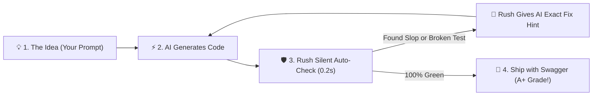

# Vibecoding with Rush: Code at the Speed of Thought Without the Hangover

Welcome to **Vibecoding with Rush**.

If you are a modern builder who codes by talking to AI models—prompting **Cursor, Claude Code, Cline, Windsurf, ChatGPT, or GitHub Copilot** to manifest full-stack apps, APIs, and tools at the speed of thought—you are a **Vibecoder**.

Vibecoding is the most exhilarating way to build software in human history. You can go from a napkin sketch to a deployed product in an afternoon. 

**But vibecoding without guardrails has a dark side:**
- The AI writes 500 lines of flashy code, but silently breaks your authentication flow.
- Your project fills up with redundant AI filler comments and hollow placeholder functions ("AI slop").
- You get stuck in endless prompt loops trying to fix a single formatting or import error.
- Your AI burns through thousands of tokens per prompt, racking up huge API bills and forgetting earlier instructions.

**Rush is the invisible safety net, automated cleanup crew, and performance turbocharger for Vibecoders.**

---

## The Vibecoding Loop with Rush



With Rush running in the background:
1. You prompt your AI naturally: *"Add stripe billing with a tier picker modal."*
2. The AI writes the code.
3. Rush instantly runs in the background (<200ms), catching syntax errors, verifying that tests exist, stripping AI slop, and auto-formatting files.
4. If an issue is found, Rush hands your AI the exact error trace and line number so the AI self-corrects immediately.
5. You stay in an uninterrupted, high-energy **flow state**—shipping production-grade software that is clean, tested, and secure.

---

## Explore the Vibecoding Knowledge Base

| Guide | What You'll Discover |
|---|---|
| 📖 **[What is Vibecoding with Rush?](vibecoding/what-is-vibecoding-with-rush.md)** | The philosophy of high-velocity creative flow paired with rock-solid automated quality. |
| 🔄 **[The Vibecoder Workflow](vibecoding/the-vibecoder-workflow.md)** | A practical, step-by-step walkthrough of a friction-free vibecoding session. |
| 🔌 **[Setting Up Your AI Agent](vibecoding/setting-up-your-agent.md)** | 2-minute setup guides for Cursor, Claude Code, Cline, Windsurf, and Roo Code via FastMCP. |
| 🧹 **[Slop-Busting & Hallucination Defense](vibecoding/slop-busting-and-hallucination-defense.md)** | How `rush slop` and `rush tdd` purge AI filler, empty stubs, and phantom dependencies. |
| ⚡ **[Instant Fix & Auto-Remediation](vibecoding/instant-fix-and-auto-remediation.md)** | How `rush fix` and `rush watch` eliminate manual formatting and import cleanup forever. |
| 📉 **[Token Diet for Vibecoders](vibecoding/token-diet-for-vibecoders.md)** | How `rush token` and `rush codegraph` slash prompt token usage by 70–90%. |
| 🏆 **[Shipping with Swagger](vibecoding/shipping-with-swagger.md)** | Generating 6-pillar quality scorecards (`rush score`), SVG repo badges, and changelogs. |
| 📋 **[Vibecoder Cheat Sheet & Golden Prompts](vibecoding/cheat-sheet.md)** | Ready-to-copy prompt templates that make any AI coding assistant 10x smarter. |

---

## 30-Second Quick Start for Vibecoders

### 1. Initialize Rush in your project
```bash
rush init .
rush governance sync
```

### 2. Start the live background watcher
```bash
rush watch .
```

### 3. Open your favorite AI IDE (Cursor / Cline / Claude) and start vibing!
Rush will quietly watch your files, auto-format on save, alert your AI to any broken tests, and keep your project spotless while you build.

## Vibecoding with Context Intelligence (Phases 41–43)
* **Instant Outlines**: Use `rush token outline` to understand complex files in seconds.
* **Zero Phantom Imports**: `rush hallu-guard` protects against hallucinated pip packages.
* **Never Repeat Bugs**: `rush context mistakes` reminds you and your agent of past reverted mistakes.
* **One-Command Ship Confidence**: `rush ship gate` runs all checks before shipping.

## Live Telemetry & Blast Radius for Vibecoding (Phases 44–46)
* **`rush context gain`**: Watch your token and dollar savings in real-time.
* **`rush blast-radius`**: Instantly see what parts of your app your refactor touches.
* **`rush context pack`**: Pack huge repos into tight AI context windows.


## Test Healing for Vibecoders (Phase 47)
When AI code generates flaky async tests, run `rush test-heal` to let Rush isolate the timing bug and suggest the fix automatically.


## DB Drift & Simplification for Vibecoders (Phase 48)
When AI generates massive functions or adds model fields without migrations, `rush simplify` and `rush db-drift` catch them before you hit deploy.

