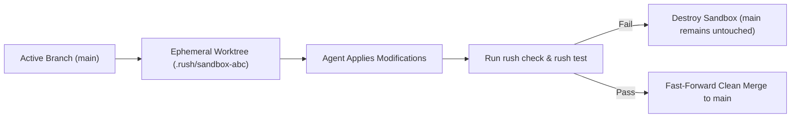

# AI Safety & Worktree Sandboxing

Autonomous AI coding agents possess tremendous speed, but granting an LLM unsupervised shell and filesystem access introduces severe operational risks. A single hallucinated command or uncontained file path can wipe local data, overwrite git history, or leak environment credentials.

Rush’s **AI Safety & Sandboxing Subsystem** (`rush safety`) establishes a deterministic, non-bypassable perimeter around all agent interactions.

Continuity coordination follows the same rule: inspecting locks, merge previews, flight events, and failure receipts is read-only. A caller must explicitly resolve ownership or a conflict; Rush never silently unlocks, merges, or replays work.

---

## 1. Destructive Command Interception

The `rush safety check-cmd` engine inspects shell commands proposed by AI agents against a comprehensive database of hazardous patterns before they are executed.

```bash
# Verify a proposed command before execution
rush safety check-cmd "rm -rf node_modules"
# Output: [ALLOWED] Safe directory cleanup within workspace.

rush safety check-cmd "rm -rf /"
# Output: [BLOCKED] Destructive root filesystem deletion pattern.
```

### What Patterns Does Rush Intercept?

- **Root & System Destruction**: Commands targeting `/`, `C:\`, `/etc`, `/usr`, or system binaries (`rm -rf /`, `del /f /s /q C:\Windows`).
- **History & Git Tampering**: Unsafe history modifications without explicit user flags (`git push --force`, `git reset --hard HEAD~10`, `git filter-branch`).
- **Fork Bombs & Resource Exhaustion**: Infinite recursion loops and memory denial patterns.
- **Unrestricted Network Uploads**: Exfiltration commands attempting to pipe repository data to unknown remote endpoints without permissions.

---

## 2. Filesystem Boundary Confinement

When agents read or write files, Rush verifies that all paths resolve strictly within the project boundary.

```bash
# Verify path confinement
rush safety check-path "../../etc/passwd"
# Output: [BLOCKED] Path traversal attempt outside workspace boundary.

rush safety check-path "src/auth/jwt.py"
# Output: [ALLOWED] Path is contained within project root.
```

- Prevents directory traversal exploits (`../`, symlink jumping).
- Protects parent directories and sensitive operating system files.
- Automatically shields sensitive local configuration files (`.env`, `.git/config`, `~/.ssh`).

---

## 3. Ephemeral Git Worktree Sandboxing

Rather than allowing an AI agent to mutate your active working directory directly, Rush can spin up an **ephemeral Git worktree** to sandbox the modifications.



### How to Run in a Sandbox

```bash
# Apply a candidate AI patch inside an isolated sandbox
rush patch apply candidate.diff --sandbox
```

If the patch introduces a syntax error or causes tests to fail, the sandbox is discarded immediately with zero impact on your uncommitted work or working tree.

---

## 4. Secret & Credential Redaction

Any output produced by child engines, logs, or agent transcripts is filtered through Rush’s deterministic secret scrubber. High-entropy API keys (OpenAI, Anthropic, AWS, GitHub tokens, database passwords) are replaced with `[REDACTED]` before they are returned to the user or serialized to disk.

---

## Next Steps

- Learn how Rush handles atomic patch remediation and rollbacks in [Patch Remediation & Memory](patch-remediation-and-memory.md).
- Discover how Rush optimizes token usage in [Token Economy & Context](token-economy-and-context.md).
