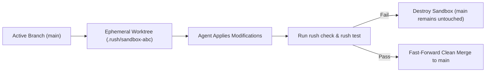

# AI Safety & Worktree Sandboxing

## Recovery does not execute history

Replay, failure, and mined mistake records returned during coordination recovery are evidence only. Rush never uses them to release a lock, apply a patch, or retry an action automatically.

Autonomous AI coding agents possess tremendous speed, but granting an LLM unsupervised shell and filesystem access introduces severe operational risks. A single hallucinated command or uncontained file path can wipe local data, overwrite git history, or leak environment credentials.

Rush exposes explicit `rush guard` inspection commands. They do not intercept external agent execution or provide an OS sandbox. Current patch and containment defects are documented in [F01/F03–F05/F43](../reports/phase-64-66-application-review.md); safe behavior remains planned in [Phase 64](../phase-plans/phase-64-runtime-correctness-and-safe-execution-plan.md).

Continuity coordination follows the same rule: inspecting locks, merge previews, flight events, and failure receipts is read-only. A caller must explicitly resolve ownership or a conflict; Rush never silently unlocks, merges, or replays work.

---

## 1. Destructive Command Interception

The `rush guard check-cmd` engine inspects shell commands proposed by AI agents against a comprehensive database of hazardous patterns before they are executed.

```bash
# Verify a proposed command before execution
rush guard check-cmd "rm -rf node_modules"
# Inspect the returned decision; this only checks the supplied string.

rush guard check-cmd "rm -rf /"
# Output: [BLOCKED] Destructive root filesystem deletion pattern.
```

### What Patterns Does Rush Intercept?

- **Root & System Destruction**: Commands targeting `/`, `C:\`, `/etc`, `/usr`, or system binaries (`rm -rf /`, `del /f /s /q C:\Windows`).
- **History & Git Tampering**: Unsafe history modifications without explicit user flags (`git push --force`, `git reset --hard HEAD~10`, `git filter-branch`).
- **Fork Bombs & Resource Exhaustion**: Infinite recursion loops and memory denial patterns.
- **Unrestricted Network Uploads**: Exfiltration commands attempting to pipe repository data to unknown remote endpoints without permissions.

---

## 2. Filesystem Boundary Confinement

`guard check-path` validates a supplied path against protected governance rules. It is not an interceptor for arbitrary reads/writes.

```bash
# Verify path confinement
rush guard check-path "../../etc/passwd"
# Output: [BLOCKED] Path traversal attempt outside workspace boundary.

rush guard check-path "src/auth/jwt.py"
# Output: [ALLOWED] Path is contained within project root.
```

- Prevents directory traversal exploits (`../`, symlink jumping).
- Protects parent directories and sensitive operating system files.
- Do not treat this check as a universal shield: checkpoint/governance symlink escapes remain open.

---

## 3. Ephemeral Git Worktree Sandboxing

Rather than allowing an AI agent to mutate your active working directory directly, Rush can spin up an **ephemeral Git worktree** to sandbox the modifications.



### Planned isolated apply route

Status: planned — P64-04. `patch apply` and its options below are not registered; the accepted route must still be implemented safely.

```text
# Apply a candidate AI patch inside an isolated sandbox
rush patch apply candidate.diff --sandbox
```

Current failed worktree creation can return an empty directory, and cleanup can discard user changes. Exact restoration is not implemented (F05/F43).

---

## 4. Secret & Credential Redaction

The shared sanitizer handles normalized output, but custom token-outline MCP output still bypasses it (F07). High-entropy API keys (OpenAI, Anthropic, AWS, GitHub tokens, database passwords) are replaced with `[REDACTED]` before they are returned to the user or serialized to disk.

---

## Next Steps

- Learn how Rush handles atomic patch remediation and rollbacks in [Patch Remediation & Memory](patch-remediation-and-memory.md).
- Discover how Rush optimizes token usage in [Token Economy & Context](token-economy-and-context.md).
