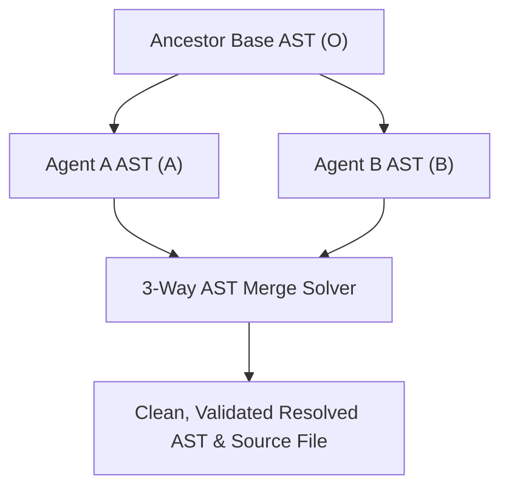

# Codebase Hygiene & 3-Way AST Merges

As autonomous agents generate, iterate on, and refactor features, repositories quickly accumulate dead functions, unused imports, duplicate dictionary keys, and unreferenced exports. Furthermore, when multiple AI subagents work on parallel branches or tasks simultaneously, standard text-based git merge tools often produce ugly merge conflict markers (`<<<<<<< HEAD`).

Rush’s **Codebase Hygiene Subsystem** (`rush hygiene`) and **3-Way AST Merge Solver** (`rush conflict`) eliminate technical debt and automatically resolve semantic code conflicts.

---

## 1. Automated Dead Code & Unused Import Cleaning

Rush scans your codebase across multiple languages to identify symbols that are defined but never referenced anywhere in the repository.

```bash
# Detect unused exports and dead code across Python and TypeScript
rush hygiene dead-code

# Automatically clean unused imports across Python files
rush hygiene clean-imports
```

### What It Cleans:
- **Unused Imports**: Cleans unreferenced `import` and `from ... import` statements without breaking `__all__` exports.
- **Dead Functions & Classes**: Detects private or unexported functions that have 0 incoming call paths.
- **Duplicate Object Keys**: Identifies duplicate dictionary keys or object property declarations introduced during rapid agent copy-pasting.

---

## 2. Semantic 3-Way AST Merge Resolution

Standard git line-based merge tools frequently fail when two agents insert imports or functions at the same file location, causing git merge conflicts.

The `rush conflict solve` command performs a **structural 3-way AST merge**:



```bash
# Resolve merge conflicts between two conflicting source branches
rush conflict solve src/services/user_service.py --ours branch_a.py --theirs branch_b.py
```

### Why AST Merges Succeed Where Text Merges Fail:
1. **Sorted Import Unioning**: Merges imported symbols intelligently rather than conflicting on line order.
2. **Class & Function Unioning**: Appends newly added methods into the appropriate class definitions without colliding with adjacent method additions.
3. **Syntax Validation**: Ensures the resulting resolved file is 100% syntactically valid code before saving.

---

## Next Steps

- Learn how to synchronize team standards across all AI coding tools in [Agent Governance & Multi-IDE Rules](governance-and-multi-ide-rules.md).
- Discover how to catch invisible Unicode exploits with [Pre-Commit Intelligence & Hook Guard](pre-commit-intelligence.md).
