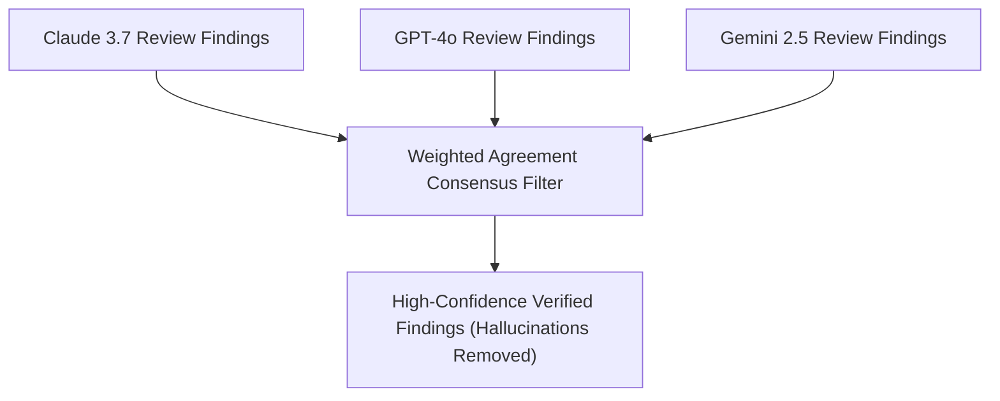

# Multi-Model Consensus & Quality Scorecards

Single AI model reviews suffer from blind spots and hallucinations: Claude might catch a tricky async race condition but miss an edge case in SQL syntax; GPT-4o might flag a potential security risk that turns out to be a false positive; local models might provide fast feedback but lower reasoning depth.

Rush’s **Consensus & Scorecard Subsystem** (`rush consensus`, `rush score`) reconciles findings across multiple AI models and computes a deterministic, 6-pillar repository quality scorecard.

---

## 1. Multi-Model Consensus Reconciliation

The `rush consensus reconcile` engine reads supplied JSON reports and groups findings by path, line and rule. It filters by distinct-model agreement ratio; it neither calls these models nor independently verifies findings:



```bash
# Reconcile multi-model AI findings from JSON reports
rush consensus reconcile claude_review.json gpt_review.json gemini_review.json
```

- **Agreement filter**: A finding below `--min-agreement` is omitted; agreement does not establish truth.
- **Severity selection**: Uses the most common supplied severity; no independent vulnerability escalation is computed.

---

## 2. The 6-Pillar Repository Health Scorecard

The `rush score compute` command combines six caller-supplied numeric pillar values to calculate a score (0–100%) and letter grade (A+ to F):

```bash
# Combine supplied pillar values; defaults are not measured repository health
rush score compute
```

### The 6 Pillars:
1. **Type Safety (20%)**: Type coverage ratio, strict mode conformance (`mypy`, `tsc`).
2. **Test Coverage (20%)**: Line & branch coverage percentage (`pytest`, `vitest`).
3. **Code Health (20%)**: Clean linting, low cyclomatic complexity (`ruff`, `eslint`, `radon`).
4. **Security & Secrets (20%)**: Zero vulnerabilities and clean secret scans (`gitleaks`, `semgrep`).
5. **Token Economy (10%)**: Clean AST density and optimized prompt context readiness.
6. **Governance & Docs (10%)**: Full `AGENTS.md` and documentation parity.

---

## 3. Visual Artifacts & SVG Badges

Rush can export your quality scorecard into visual formats for pull requests, dashboards, and README badges:

```bash
# Generate SVG badge for README
rush score compute --export-svg docs/badges/quality-score.svg

# score pr-card is not registered; inspect current output options
rush score compute --help
```

---

## Next Steps

- Learn how to extend Rush with custom tools in [Plugins & Agent Skills](plugins-and-agent-skills.md).
- Explore the core user guide in [Everyday Workflow](../user-guide/everyday-workflow.md).
