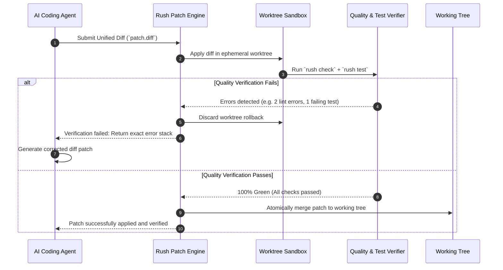

# Patch Remediation & Session Memory

When AI coding assistants refactor code or fix bugs, they often produce multi-file unified diffs. If a diff contains syntax errors, fails linters, or breaks unit tests, applying it directly pollutes your git working directory and forces painful manual rollbacks.

Rush’s **Patch Remediation Subsystem** (`rush patch`) and **Session Memory Engine** (`rush memory`) provide a closed-loop verification cycle and multi-turn conversational memory for agent interactions.

`rush session` handoff is deliberately narrower than conversational memory: it persists a redacted goal/frontier receipt, dependency snapshots, and a receipt-only failure pointer. It excludes raw transcripts, provider credentials, historic-instruction text, and failed patches; historic instruction presence is quarantined as non-actionable evidence.

Coordination recovery is equally narrow: a replay is an event-count receipt, and a known failure is a redacted receipt. Neither is a runnable command, a patch source, or approval to retry.

---

## 1. Closed-Loop Patch Remediation

Rush treats every AI-generated patch as an unverified proposal. The patch is tested, linted, and verified before touching your repository.



### Applying a Patch Safely

```bash
# Preview what a patch will modify without making changes
rush patch apply candidate.diff --dry-run

# Apply patch with circuit breaker (aborts if >5 test failures occur)
rush patch apply candidate.diff --circuit-breaker

# Rollback the last applied patch atomically
rush patch rollback
```

---

## 2. Multi-Turn Session Memory

AI coding agents often lose track of previous architectural decisions, file changes, and test results across multiple chat turns. Rush provides a structured, multi-turn **Session Memory Ledger** (`rush memory`) that records key events in compact, token-efficient formats.

### Storing and Inspecting Session Context

```bash
# Inspect the active session memory ledger
rush memory inspect

# Query session memories related to a specific topic
rush memory inspect --query "authentication refactor"

# Clear the current session memory ledger
rush memory clear
```

### Cryptographic Context Boundary Framing

To prevent prompt injection attacks where untrusted code comments attempt to hijack agent memory, Rush encapsulates all memory records within cryptographically signed XML boundaries:

```xml
<rush_session_memory turn="4" timestamp="2026-08-21T17:40:00Z">
  <action tool="rush_patch" target="src/auth/jwt.py" status="verified" />
  <decision>Replaced HMAC-SHA256 with RS256 asymmetric signatures</decision>
  <tests_passed count="14" duration_ms="320" />
</rush_session_memory>
```

---

## Benefits for Humans & Agents

1. **Zero-Pollution Guarantee**: If an agent generates broken code, your working tree remains pristine.
2. **Instant Feedback for Self-Correction**: When a patch fails verification, Rush returns exact line numbers, compiler messages, and linter rules so the agent can self-correct on the next turn.
3. **Continuous Context**: Memory ledgers prevent agents from repeating mistakes or asking the user the same questions across multi-turn sessions.

---

## Next Steps

- Explore how Rush compresses code prompts in [Token Economy & Context](token-economy-and-context.md).
- Learn how to explore code structures with [CodeGraph & Semantic Slicing](codegraph-and-semantic-slicing.md).
