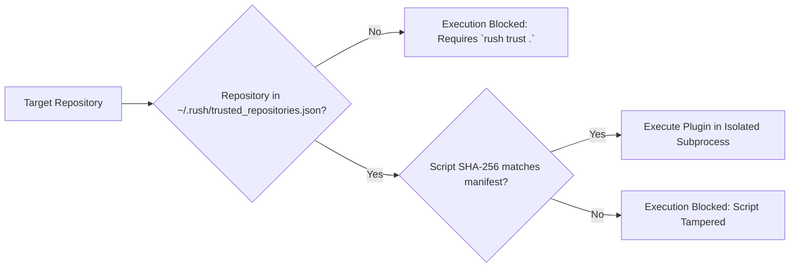

# Plugins & Agent Skills

Every engineering organization has unique domain requirements: proprietary database linters, internal API validation scripts, custom migration checkers, or team-specific architectural rules.

Rush’s **Trust-Gated Plugin System** (`rush plugins`) and **Agent Skills Generator** (`rush skills`) let you declare custom quality tools that both human developers and autonomous AI agents can invoke with complete security.

---

## 1. Trust-Gated Plugin Architecture

Custom plugins are declared in your repository’s `rush.toml` file under the `[plugins.<name>]` table. Because running arbitrary scripts from untrusted open-source checkouts is dangerous, Rush enforces a cryptographic **Trust Store**:



### Trusting a Repository:
```bash
# Authorize local repository to run configured plugins
rush trust .

# Revoke trust
rush trust . --revoke
```

---

## 2. Declaring a Custom Plugin

In `rush.toml`:
```toml
[plugins.check-api-contracts]
command = "python scripts/verify_contracts.py"
description = "Verify internal protobuf contracts against backend services"
file_extensions = ["proto", "py"]
timeout = 30
```

### Running the Plugin:
```bash
# List all configured plugins
rush plugins list

# Execute a specific plugin
rush plugins run check-api-contracts .
```

---

## 3. Exporting Agent Skills

Autonomous AI agents (such as Cursor, Claude Code, Cline, and Hermes) discover tools through standardized Agent Skill manifests (`SKILL.md`).

Rush can automatically export all canonical tools, custom plugins, and workflow suites as native AI Agent Skills:

```bash
# Export Rush tools as Agent Skills
rush skills export --format claude --output .gemini/skills/rush/

# Synchronize skills across all AI assistants
rush skills sync
```

---

## Next Steps

- Explore the complete [Agentic Rush Overview](../AGENTIC_RUSH.md).
- Dive into the [Everyday Developer Workflow](../user-guide/everyday-workflow.md).
