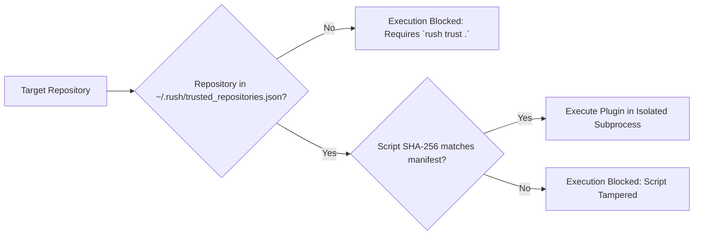

# Plugins & Agent Skills

Every engineering organization has unique domain requirements: proprietary database linters, internal API validation scripts, custom migration checkers, or team-specific architectural rules.

Rush’s **Trust-Gated Plugin System** (`rush plugins`) and **Agent Skills Generator** (`rush skills`) let you declare custom quality tools that both human developers and autonomous AI agents can invoke with complete security.

---

## 1. Trust-Gated Plugin Architecture

Custom plugins are declared in your repository’s `rush.toml` file under the `[plugins.<name>]` table. Because running arbitrary scripts from untrusted open-source checkouts is dangerous, Rush enforces a cryptographic **Trust Store**:



### Trusting a Repository:
```bash
# Authorize local repository to run configured plugins
rush trust .

# Revoke trust
rush trust . --revoke
```

---

## 2. Declaring a Custom Plugin

In `rush.toml`:
```toml
[plugins.check-api-contracts]
command = "python scripts/verify_contracts.py"
description = "Verify internal protobuf contracts against backend services"
file_extensions = ["proto", "py"]
timeout = 30
```

### Running the Plugin:
```bash
# List all configured plugins
rush plugins list

# Execute a specific plugin
rush plugins run check-api-contracts .
```

---

## 3. Exporting Agent Skills

Autonomous AI agents (such as Cursor, Claude Code, Cline, and Hermes) discover tools through standardized Agent Skill manifests (`SKILL.md`).

Rush can automatically export all canonical tools, custom plugins, and workflow suites as native AI Agent Skills:

```bash
# Export Rush tools as Agent Skills
rush skills export --format claude --output .gemini/skills/rush/

# Synchronize skills across all AI assistants
rush skills sync
```

---

## Next Steps

- Explore the complete [Agentic Rush Overview](../AGENTIC_RUSH.md).
- Dive into the [Everyday Developer Workflow](../user-guide/everyday-workflow.md).

### Autonomous Agent Plugin Execution (Phase 56)
AI coding agents executing plugins must ensure user trust has been granted. If trust is missing, agents cannot run plugins with bypass flags; user approval must be requested.

## Agent Invocation & Cache Integration (Phase 57)

Autonomous agents invoking Rush via MCP enjoy full parity with human CLI users:
- Unified context resolution guarantees identical tool behavior.
- Cache lookups accelerate repetitive quality checks without risk of stale dirty-state hits.

## Phase 58 Architecture: Capability Locks, CAS Memory, and Fail-Closed Patch Verification

Rush implements closed-loop resilience, fail-closed security, and physical containment across multi-agent concurrency, persistent memory, and AI-driven patch remediation (Findings R-009, R-010, R-011, R-016):

1. **Capability Locks & Verifier Custody (`rush.mcp_mesh`)**:
   - Callers retain high-entropy capability tokens (`LockCapabilityInput`) delivered exclusively via protected channels (`stdin`, `descriptor`, or sensitive MCP parameters); argv and environment leakage are rejected fail-closed.
   - `MeshLockManager` stores verifier-only records (`LockLeaseRecord`) generated via `rush.io.VerifierRecord` (PBKDF2-HMAC-SHA256, 100k rounds) with monotonic generation counters and `rush.io.PhysicalRoot` containment under `.rush/locks`.
   - Renewal and release verify caller capability in constant time (`hmac.compare_digest`); wrong, low-entropy, or stale tokens fail closed.

2. **CAS Map Transactions & Persistent Memory (`rush.memory`)**:
   - `CASMapTransaction` enforces optimistic concurrency with monotonic version numbers and atomic file replacement (`rush.io.AtomicFile`) using sanitized JSON payloads (`SanitizedJsonValue`).
   - Store states are truthfully separated into distinct typed exceptions: `StoreNotFoundError`, `StoreCorruptionError` (retaining raw bytes and SHA-256 digest), `StoreValidationError`, `StoreIOError`, and `CASConflictError` (exhausted retries fail closed).
   - `PreferenceStore`, `InvariantGraph`, and `MerkleInvalidator` eliminate silent empty dict fallbacks.

3. **Atomic Checkpoint Journals & Corrupt Evidence (`rush.memory.checkpoint_journal`)**:
   - Session checkpoints are written via `rush.io.AtomicFile` using explicit schema version `1.0.0`.
   - Corrupted or unparseable checkpoint files are preserved on disk, cryptographically digested with SHA-256, and surfaced in `list_checkpoints()` with status `corrupt`.

4. **Contained Patch Verification & Atomic Rollback (`rush.patch`)**:
   - `PatchContract` cryptographically binds base commit, tree digest, patch content hash, sandbox directory under `rush.io.PhysicalRoot`, command plans, and policy review classes (`standard`, `policy-changing`, `privileged`).
   - Workspaces must be clean before sandboxing or patch application; dirty checkouts fail closed with `DirtyWorkspaceError`.
   - `PatchVerifier` requires at least one passing executed test command; zero executed commands return `outcome='unavailable'` and `False` (zero commands never verify).
   - Failed promotion or verification triggers automatic atomic rollback (`git reset --hard`, `git clean -fd`) restoring the working directory to its exact pre-patch commit and state.

5. **Runtime Output Boundary Adapter Enforcement (`rush.contracts.operations`)**:
   - 100% of public operations declared in `governance/public-operations.toml` enforce their target adapters (`ToolOperationAdapter`, `AdminOperationAdapter`, `ServiceOperationAdapter`) at runtime boundaries while preserving native JSON-RPC service protocol messages.
