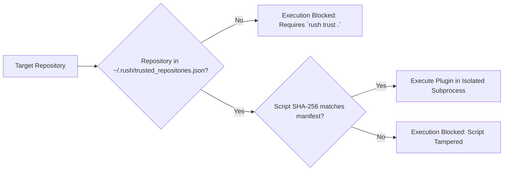

# Plugins & Agent Skills

Every engineering organization has unique domain requirements: proprietary database linters, internal API validation scripts, custom migration checkers, or team-specific architectural rules.

Rush’s **Trust-Gated Plugin System** (`rush plugin`) and **Agent Skills Generator** (internal generator) support custom tooling. Current CLI has no `skills` group; plugins run with ambient user permissions, not kernel isolation.

---

## 1. Trust-Gated Plugin Architecture

Custom plugins are declared in your repository’s `rush.toml` file under the `[plugins.<name>]` table. Because running arbitrary scripts from untrusted open-source checkouts is dangerous, Rush enforces a cryptographic **Trust Store**:



### Trusting a Repository:
```bash
# Authorize local repository to run configured plugins
rush trust .

# Revoke trust
rush trust . --revoke
```

---

## 2. Declaring a Custom Plugin

In `rush.toml`:
```toml
[plugins.check-api-contracts]
command = "python scripts/verify_contracts.py"
description = "Verify internal protobuf contracts against backend services"
patterns = ["*.proto", "*.py"]
timeout_seconds = 30
```

### Running the Plugin:
```bash
# List all configured plugins
rush plugin list

# Execute a specific plugin
rush plugin run check-api-contracts .
```

---

## 3. Exporting Agent Skills

Autonomous AI agents (such as Cursor, Claude Code, Cline, and Hermes) discover tools through standardized Agent Skill manifests (`SKILL.md`).

Historical skill-export proposal: these `skills` commands are not registered. Accepted agent integration remains planned in [Phase 65](../phase-plans/phase-65-project-provisioning-scan-and-agent-workflow-plan.md).

```text
# Export Rush tools as Agent Skills
rush skills export --format claude --output .gemini/skills/rush/

# Synchronize skills across all AI assistants
rush skills sync
```

### Skill/Pattern Memory (Phase 61)

A mined skill candidate is written to the unified `TypedArtifactStore` as `subject="skill_pattern"`, `trust_tier="DERIVED"`, `promoted_at=None` — a queryable row for later admission/promotion sweeps. Its generated `SKILL.md` has no working `rush plugin run <name>` line until `PluginTrustStore().is_trusted(plugin.name, plugin.closure.closure_digest)` returns true (human-gated via `grant_trust()`); a candidate with no computed closure identity can never appear trusted.

---

## Next Steps

- Explore the complete [Agentic Rush Overview](../AGENTIC_RUSH.md).
- Dive into the [Everyday Developer Workflow](../user-guide/everyday-workflow.md).

### Autonomous Agent Plugin Execution (Phase 56)
AI coding agents executing plugins must ensure user trust has been granted. If trust is missing, agents cannot run plugins with bypass flags; user approval must be requested.

## Agent Invocation & Cache Integration (Phase 57)

Autonomous agents invoking Rush via MCP enjoy full parity with human CLI users:
- CLI/MCP share invocation code, but value-coercion parity defects remain open (F06), pending P64-05.
- Cache correctness depends on declared identity and dependencies; a cache hit is not independent fresh verification.

## Phase 58 Architecture: Capability Locks, CAS Memory, and Fail-Closed Patch Verification

The following component contracts are not whole-application guarantees. Checkpoint/governance symlink escapes, sandbox fallback, destructive cleanup and custom-output redaction defects remain open; see [Known issues](../KNOWN_ISSUES.md).

1. **Capability Locks & Verifier Custody (`rush.mcp_mesh`)**:
   - Callers retain high-entropy capability tokens (`LockCapabilityInput`) delivered exclusively via protected channels (`stdin`, `descriptor`, or sensitive MCP parameters); argv and environment leakage are rejected fail-closed.
   - `MeshLockManager` stores verifier-only records (`LockLeaseRecord`) generated via `rush.io.VerifierRecord` (PBKDF2-HMAC-SHA256, 100k rounds) with monotonic generation counters and `rush.io.PhysicalRoot` containment under `.rush/locks`.
   - Renewal and release verify caller capability in constant time (`hmac.compare_digest`); wrong, low-entropy, or stale tokens fail closed.

2. **CAS Map Transactions & Persistent Memory (`rush.memory`)**:
   - `CASMapTransaction` enforces optimistic concurrency with monotonic version numbers and atomic file replacement (`rush.io.AtomicFile`) using sanitized JSON payloads (`SanitizedJsonValue`).
   - Store states are truthfully separated into distinct typed exceptions: `StoreNotFoundError`, `StoreCorruptionError` (retaining raw bytes and SHA-256 digest), `StoreValidationError`, `StoreIOError`, and `CASConflictError` (exhausted retries fail closed).
   - `PreferenceStore`, `InvariantGraph`, and `MerkleInvalidator` eliminate silent empty dict fallbacks.

3. **Atomic Checkpoint Journals & Unified Store Persistence (`rush.memory.checkpoint_journal`)**:
   - `checkpoint_journal.py` is a thin compatibility view over `TypedArtifactStore` (`rush.memory.store`, Phase 61): `save_checkpoint()`/`restore_checkpoint()` write/read each checkpoint as one `MemoryArtifact` row (`family="handoff"`, `subject="active_context"`); canonical data lives in `.rush/memory.db`, not a per-checkpoint JSON file.
   - `save_checkpoint()` still writes a physical `.json` artifact via `rush.io.AtomicFile` and returns its `Path` (`dest.exists()` holds), preserving the pre-Phase-61 contract for existing callers; explicit schema version `1.0.0` is unchanged.
   - Corrupted or unparseable checkpoint files are preserved on disk, cryptographically digested with SHA-256, and surfaced in `list_checkpoints()` with status `corrupt` — unchanged by the Phase 61 migration.

4. **Contained Patch Verification & Atomic Rollback (`rush.patch`)**:
   - `PatchContract` cryptographically binds base commit, tree digest, patch content hash, sandbox directory under `rush.io.PhysicalRoot`, command plans, and policy review classes (`standard`, `policy-changing`, `privileged`).
   - Workspaces must be clean before sandboxing or patch application; dirty checkouts fail closed with `DirtyWorkspaceError`.
   - `PatchVerifier` requires at least one passing executed test command; zero executed commands return `outcome='unavailable'` and `False` (zero commands never verify).
   - Patch-sandbox rollback still uses broad reset/clean and can discard unrelated work. Patch-sandbox restoration remains planned in [P64-04](../phase-plans/phase-64-runtime-correctness-and-safe-execution-plan.md); [F43](../reports/phase-64-66-application-review.md) remains open.

5. **Runtime Output Boundary Adapter Enforcement (`rush.contracts.operations`)**:
   - 100% of public operations declared in `governance/public-operations.toml` enforce their target adapters (`ToolOperationAdapter`, `AdminOperationAdapter`, `ServiceOperationAdapter`) at runtime boundaries while preserving native JSON-RPC service protocol messages.
