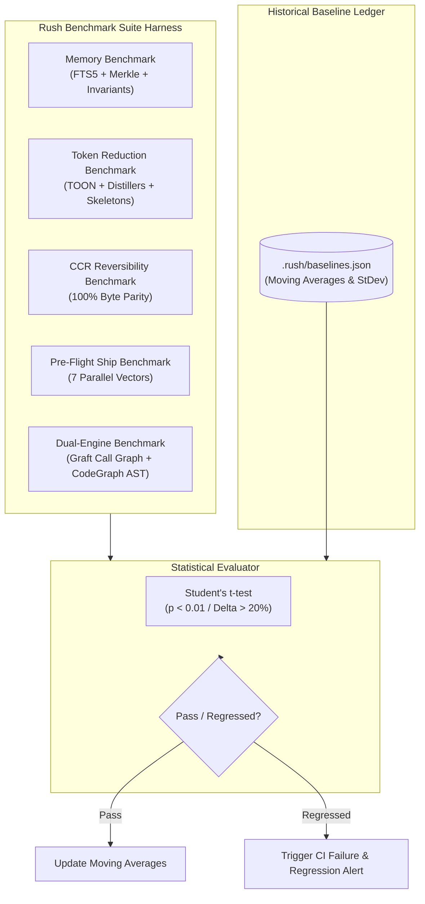

# Rush CLI Comprehensive Benchmarking Report & Execution Framework

## 1. Executive Summary & Objectives

This document establishes the official benchmarking architecture, quantitative measurement methodology, evaluation datasets, and automated harness workflows for **Rush CLI**. 

The goal of this benchmarking framework is to continuously measure, validate, and guard the performance, latency, memory consumption, token efficiency, and quality fidelity of Rush's core subsystems:
1. **Unified Dual-Layer Memory Engine** (Traditional FTS5 + Cognitive Merkle Invariants & Mistake Pre-Mortem).
2. **Context Intelligence & Token Reduction Suite** (TOON v4.1, Command Distillers, AST Skeletonization, CCR Reversible Cache, Prompt Cache Alignment).
3. **Pre-Flight Ship-Readiness Cockpit** (7-Vector Parallel Release Gates).
4. **Native Graft Semantic Graph & Architectural Security Analysis** (Blast Radius, Grounding Verifier, FastMCP Mesh).

---

## 2. Quantitative Evaluation Metrics & Targets

| Metric Category | Specific Metric | Formal Definition | Target Baseline | Critical Threshold |
|---|---|---|:---:|:---:|
| **Token Reduction** | Net Token Savings Ratio | $$1 - \frac{\text{Tokens}_{\text{compressed}}}{\text{Tokens}_{\text{raw}}}$$ | $\ge 65.0\%$ | $< 50.0\%$ |
| **Log Distillation** | Subprocess Log Compression | $$1 - \frac{\text{Tokens}_{\text{distilled}}}{\text{Tokens}_{\text{raw}}}$$ | $\ge 85.0\%$ | $< 70.0\%$ |
| **Wire Serialization** | TOON vs JSON Token Delta | $$1 - \frac{\text{Tokens}_{\text{TOON}}}{\text{Tokens}_{\text{JSON}}}$$ | $\ge 40.0\%$ | $< 30.0\%$ |
| **Retrieval Accuracy** | Tabular Needle-in-Haystack | $$\frac{\text{Correct Answers}}{\text{Total Probes}}$$ | $\ge 98.0\%$ | $< 95.0\%$ |
| **Memory Recall Latency** | FTS5 BM25 Query (p95) | Time to return top-10 ranked results | $< 5.0\text{ ms}$ | $> 20.0\text{ ms}$ |
| **AST Merkle Invalidation** | Incremental Re-hash Time | Re-hash latency per 50 changed files | $< 10.0\text{ ms}$ | $> 50.0\text{ ms}$ |
| **CCR Restoration** | Byte-Exact Chunk Retrieval | Time to fetch original chunk from SQLite | $< 2.0\text{ ms}$ | $> 10.0\text{ ms}$ |
| **Ship Gate Latency** | 7-Vector Parallel Suite | Full wall-clock duration of `rush ship` | $< 2.0\text{ s}$ | $> 5.0\text{ s}$ |
| **Grounding Accuracy** | Phantom Package Detection | $$\frac{\text{Detected Phantoms}}{\text{Total Injected Phantoms}}$$ | $100.0\%$ | $< 100.0\%$ |
| **Prompt Cache Hit Rate** | Provider KV Cache Hits | $$\frac{\text{Cached Prompt Tokens}}{\text{Total Prompt Tokens}}$$ | $\ge 85.0\%$ | $< 70.0\%$ |

---

## 3. Subsystem Benchmarking Plans & Workflows



---

### 3.1 Memory Subsystem Benchmarking (Traditional & Cognitive)

#### Objectives
Evaluate read/write throughput, FTS5 lexical recall latency, Merkle hash propagation speed, and multi-turn deduplication savings across increasing scale ($1,000$, $10,000$, and $100,000$ memory records).

#### Test Workflows
1. **FTS5 / BM25 Scale Benchmark**:
   * Seed `.rush/memory.db` with 10,000 synthetic technical notes, ADR snippets, and tool result entries.
   * Execute 500 randomized multi-keyword search queries (e.g. `"fastmcp stdio lock timeout"`, `"ast merkle invalidation"`).
   * Measure p50, p95, and p99 query latency; assert $p95 < 5.0\text{ ms}$.
2. **AST-Merkle Reactive Invalidation Benchmark**:
   * Simulate a Git diff modifying 25 Python and TypeScript source files.
   * Compute AST Merkle tree hash updates and measure time to mark dependent memory records as `status='stale'`.
   * Assert total invalidation processing time $< 10.0\text{ ms}$.
3. **Session Deduplication Continuity Benchmark**:
   * Simulate a 20-turn agent interaction querying memory.
   * Verify that turns 2 through 20 return `304 Not Modified` / `known_pack_hash` headers, reducing prompt tokens by $>90\%$ on repeated turns.

---

### 3.2 Context Intelligence & Token Reduction Benchmarking

#### Objectives
Measure raw token reduction, BPE calculation accuracy, serialization density, and context recovery fidelity.

#### Test Workflows
1. **TOON v4.1 vs JSON Density Benchmark**:
   * Generate tabular datasets of varying dimensions ($10\times 5$, $50\times 10$, $200\times 15$).
   * Serialize using both standard indented JSON and TOON v4.1 format.
   * Count tokens using exact `tiktoken` BPE encodings (`cl100k_base` and `o200k_base`).
   * Assert TOON achieves $\ge 40\%$ token reduction across all tables.
2. **Command Output Distiller Benchmark**:
   * Ingest real-world raw logs from Pytest (5,000 passing lines + 2 failures), Cargo test, and Vitest.
   * Pipe through `CommandDistiller`.
   * Assert output token count is reduced by $\ge 85\%$ while retaining exact failure assertion lines and file paths.
3. **AST Skeletonizer vs Full File Benchmark**:
   * Run `AstSkeletonizer` across the entire `src/rush/` codebase.
   * Compare total token weight of full source files vs skeletonized outlines.
   * Assert average token reduction $\ge 75\%$.
4. **Context Compression & Restoration (CCR) Reversibility Benchmark**:
   * Skeletonize 100 source files, inserting `<!-- ccr:chunk:HASH -->` anchors into `.rush/cache/ccr.db`.
   * Execute `rush context retrieve <HASH>` on all 100 anchors.
   * Perform byte-level `diff` between original and restored content.
   * Assert $100.0\%$ byte-for-byte exact equality (zero loss).

---

### 3.3 Pre-Flight Ship Cockpit Benchmarking

#### Objectives
Verify that the complete 7-vector pre-flight validation suite (`clean`, `env`, `migration`, `semver`, `docs`, `pack`, `gate`) executes in parallel with sub-2-second latency and zero false positives.

#### Test Workflows
1. **Parallel Vector Execution Benchmark**:
   * Execute `rush ship gate` on a production codebase containing 200+ source files and 228 documentation files.
   * Measure individual vector wall-clock times and total aggregate execution time.
   * Assert total parallel duration $< 2.0\text{ seconds}$.
2. **Zero-Downtime Migration Linter Benchmark**:
   * Ingest 50 synthetic SQL migration files containing table-locking hazards (`ADD COLUMN NOT NULL` without default) and safe operations.
   * Assert $100.0\%$ detection of table-locking operations in $< 50\text{ ms}$.
3. **Documentation Parity Synchronization Benchmark**:
   * Execute `rush ship docs --check` over all 228 doc files in `docs/`.
   * Assert full link and command reference validation in $< 150\text{ ms}$.

---

## 4. Benchmark Harness Implementation Architecture

The automated benchmark suite is orchestrated via `scripts/benchmark_suite.py`:

```python
# scripts/benchmark_suite.py (Architecture Outline)
import time
import tiktoken
import pytest
from rush.token_economy.toon import ToonEncoder
from rush.token_economy.distillers import CommandDistiller
from rush.token_economy.ccr_store import CCRStore
from rush.tools.ship.cockpit import ShipCockpit

def run_all_benchmarks():
    print("[*] Launching Rush Platform Benchmark Suite...")
    # 1. Measure TOON Token Reduction
    # 2. Measure Command Distillation Compression
    # 3. Measure CCR Restoration Byte Parity
    # 4. Measure FTS5 Recall Latency
    # 5. Measure Ship Gate Parallel Execution
    # 6. Compare against .rush/baselines.json
```

---

## 5. Continuous Baseline Regression Tracking

Statistical baselines are maintained in `.rush/baselines.json`:

```json
{
  "version": "0.3.0",
  "last_run": "2026-08-22T15:00:00Z",
  "metrics": {
    "toon_token_reduction_pct": { "mean": 42.6, "stdev": 1.2, "target": 40.0 },
    "distiller_compression_pct": { "mean": 88.4, "stdev": 2.1, "target": 85.0 },
    "fts5_search_latency_p95_ms": { "mean": 2.1, "stdev": 0.4, "target": 5.0 },
    "ccr_retrieval_latency_ms": { "mean": 0.8, "stdev": 0.1, "target": 2.0 },
    "ship_gate_parallel_latency_s": { "mean": 1.45, "stdev": 0.15, "target": 2.0 }
  }
}
```

If any commit causes a metric to degrade by $>20\%$ beyond its moving average standard deviation, CI automatically fails the build and emits an actionable regression diagnosis.
