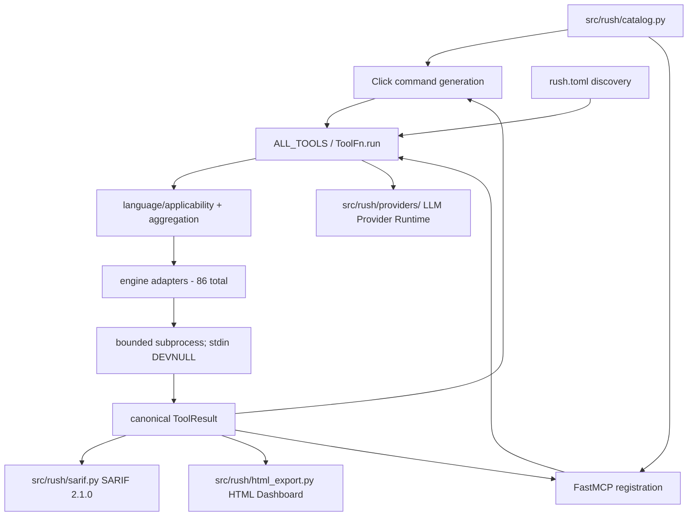
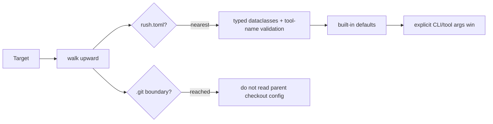
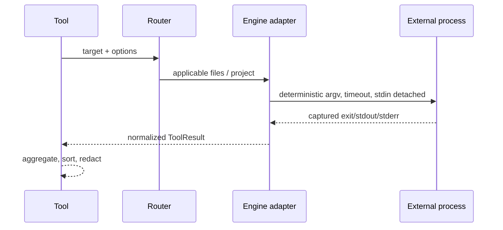

# Rush architecture

## Continuity transport invariant

The catalogued `SessionContinuityTool` owns local checkpoint behavior. `cli.py` session commands and MCP registration are thin transports; additions must preserve that single implementation and the canonical `ToolResult` shape.

Rush is a Python 3.12 package with two transports and one implementation layer. Click CLI commands and FastMCP tools invoke the same objects from `src/rush/tools/`; external programs are isolated behind adapters in `src/rush/engines/`.

## Core contracts

- `TOOL_SPECS` and `ENGINE_SPECS` are declarative metadata; `ALL_TOOLS` and `ENGINES` are executable registries. Tests enforce parity across all 52 tools and 124 engines.
- `ToolFn.run(path, *, config, ...)` is the internal execution surface. `ToolFn.__call__` is MCP-facing and must expose only JSON-schema-safe parameters.
- ToolResult required keys are `tool`, `engine`, `engine_version`, `status`, `duration_ms`, `summary`, `findings`, and `raw`; optional extensions include metrics, artifacts, metadata, and review fields.
- A missing optional executable returns `skipped`; it must not raise or install anything.
- Multi-engine aggregation is deterministic: worst status wins (`error > fail > warn > ok > skipped`), durations sum, findings sort by location/rule/message, and provenance is retained.
- **Flag-Salted Result Caching (Phase 21)**:
  - SQLite-backed result cache (`src/rush/cache.py`) with content-hashed, flag-salted cryptographic keys (`.rush/cache.db`).
- **Unified Automated Remediation (Phase 22)**:
  - Safe automated code fix engine (`src/rush/tools/fix.py`) with workspace path containment (`assert_safe_workspace_path`) and `--dry-run` diff preview.
- **Sanitized Stack Onboarding (Phase 23)**:
  - Polyglot technology stack detector (`src/rush/discovery/stack.py`) and shell-injection proof package installer (`src/rush/tools/setup_wizard.py`).
- **Hardened Workflow Suites & Doctor (Phase 24)**:
  - Fast inner-loop `CHECK_SUITE`, deep security `AUDIT_SUITE`, and pre-merge `GATE_SUITE` (`src/rush/workflows/suites.py`).
  - Environment health & anti-shadowing audit (`src/rush/tools/doctor.py`).
- **Real-Time Debounced Watcher (Phase 25)**:
  - Multi-threaded file system watcher (`src/rush/watcher.py`) with configurable debounce windows (300ms default) and automatic directory pruning (`.git`, `node_modules`, `.venv`).
- **Polyglot Monorepo Scoping (Phase 26)**:
  - Deterministic workspace topology discovery (`src/rush/discovery/workspace.py`) for npm, pnpm, yarn, Cargo, and Turborepo with strict path containment.
- **Authenticated In-Memory Web Dashboard & Rich TUI (Phase 27)**:
  - Single-binary zero-dependency local HTTP server (`src/rush/dashboard.py`) binding exclusively to `127.0.0.1` with ephemeral `X-Rush-Auth` tokens, DNS rebinding prevention, and CSRF Origin validation.
  - Interactive terminal finding explorer (`src/rush/tui.py`) built with Rich layouts.
- **Trust-Gated Dynamic Plugin Runtime (Phase 28)**:
  - Declarative script plugin execution (`src/rush/plugins/`) with local repository trust verification (`~/.rush/trusted_repositories.json`) preventing arbitrary code execution in untrusted checkouts.
- **Closed-Loop AI Patch Remediation & Session Memory (Phase 29)**:
  - Bounded multi-turn session memory ledger (`src/rush/session_memory.py`) framed with strict XML boundary tags (`<rush_session_memory>`).
  - Atomic unified diff patch generator and applier (`src/rush/patch_generator.py`) with sensitive file shielding (`.git`, `.env`).
- **Standalone Binary Packaging & CI Hardening (Phase 30)**:
  - Standalone multi-platform compilation manifests for Homebrew, Scoop, and Winget (`packaging/`).
  - GitHub Actions release pipeline with SHA-pinned actions (`.github/workflows/release.yml`).
- **Autonomous Agent Safety & Worktree Sandboxing (Phase 31)**:
  - Destructive command interceptor (`src/rush/safety/`) and ephemeral Git worktree sandboxing.
- **Token Economy & Context Optimization (Phase 32)**:
  - Fast BPE token counter and AST outline compressor (`src/rush/token_economy/`).
- **Full-Stack Static Sync & Type-Safety Gates (Phase 33)**:
  - Bidirectional OpenAPI JSON verifier and TypeScript interface generator (`src/rush/sync/`).
- **Codebase Hygiene & 3-Way AST Conflict Resolution (Phase 34)**:
  - Polyglot dead code scanner and 3-way AST merge solver (`src/rush/hygiene/`).
- **Polyglot CodeGraph & Verbatim AST Slicing (Phase 35)**:
  - SQLite-backed Code Property Graph index store and verbatim symbol slicer (`src/rush/codegraph/`).
- **Frontend Asset & Bundle Optimization (Phase 36)**:
  - Raw, Gzip, and Brotli chunk size calculator and budget gates (`src/rush/bundle/`).
- **Git Hotspots & Defect Risk Analytics (Phase 37)**:
  - Commit churn velocity and McCabe cyclomatic complexity correlation matrix (`src/rush/hotspots/`).
- **Multi-IDE Agent Governance & Repo Scaffolding (Phase 38)**:
  - Canonical `AGENTS.md` instruction compiler emitting IDE rule files (`src/rush/governance/`).
- **Git Pre-Commit Intelligence & Hook Guard (Phase 39)**:
  - Sub-second staged AST parser, Trojan Source Unicode detector, and cryptographic hook tamper guard (`src/rush/hook/`).
- **Multi-Model Consensus & Composite Quality Scorecard (Phase 40)**:
  - 6-pillar repository health scoring engine (`src/rush/score/`), SARIF 2.1.0 exporter, SVG badge generator, and multi-model consensus reconciliation.

## Configuration flow

## Engine flow

## Safety architecture

Stdio MCP stdout is reserved for JSON-RPC. Logs are stderr NDJSON. Engine processes cannot consume protocol input. Security-sensitive promoted adapters own config/environment constraints. Artifact writers validate target containment and overwrite intent. Browser/network/slow/fuzz/baseline/publication work is denied or skipped without explicit implemented permission.

See the focused developer chapters linked from [Developer guide](../DEVELOPER_GUIDE.md) and the [ADRs](../maintainers/adr/README.md).

## Context Intelligence Subsystem Integration (Phases 41–43)

The context intelligence subsystem resides in `src/rush/token_economy/` and `src/rush/memory/`:
* `src/rush/token_economy/router.py`: `ContentRouter` and `ContentType`.
* `src/rush/token_economy/distillers/`: `PytestDistiller`, `CargoDistiller`, `RuffDistiller`, `VitestDistiller`.
* `src/rush/token_economy/toon/`: `ToonEncoder`, `ToonDecoder`.
* `src/rush/token_economy/ast_skeletonizer.py`: `AstSkeletonizer`.
* `src/rush/token_economy/ccr_store.py`: `CCRStore` (`.rush/cache/ccr.db`).
* `src/rush/codegraph/grounding_verifier.py`: `GroundingVerifier`.
* `src/rush/tools/hallu_guard.py`: `HalluGuard`.
* `src/rush/memory/preference_store.py`: `PreferenceStore` — thin compatibility view over `TypedArtifactStore` as of Phase 61 (formerly its own `.rush/preferences.json`).
* `src/rush/memory/checkpoint_journal.py`: `CheckpointJournal` — thin compatibility view over `TypedArtifactStore` (`family="handoff"`, `subject="active_context"`) as of Phase 61; still returns a real `Path` from `save_checkpoint()` (`.rush/sessions/` file kept as a durable secondary artifact, not renamed).
* `src/rush/memory/merkle_invalidator.py`: `MerkleInvalidator` — thin compatibility view over `TypedArtifactStore` as of Phase 61 (formerly its own `.rush/cache/merkle.json`); its pure `hash_content()` computation is reused by `TypedArtifactStore.recall()`'s staleness check.
* `src/rush/memory/invariant_graph.py`: `InvariantGraph` — thin compatibility view over `TypedArtifactStore` as of Phase 61 (formerly its own `.rush/memory/invariants.json`).
* `src/rush/memory/failure_ledger.py`: `FailureLedger` — thin compatibility view over `TypedArtifactStore` as of Phase 61 (formerly its own `.rush/memory/failures.db`).
* `src/rush/memory/mistake_miner.py`: `MistakeMiner` — pure git-log miner; shapes (does not persist) `subject="failure"`, `trust_tier="DERIVED"` candidate dicts as of Phase 61, persisted only via `MemoryTool.write()`.
* `src/rush/memory/store.py`: `TypedArtifactStore`, `MemoryArtifact` (Phase 61) — the unified SQLite WAL store (`.rush/memory.db`) all of the above now read/write through; see `docs/ARCHITECTURE.md`'s "Phase 61 Architecture" section for the full 7-subject/4-tier-trust design.
* `src/rush/memory/trust.py`: `TrustTier`, `PromotionResult`, `default_entry_tier`, `evaluate_promotion`, `evaluate_conflict`, `count_corroboration` (Phase 61) — the write-promotion rule.
* `src/rush/memory/migration.py`: one-shot idempotent migration functions, one per absorbed source (Phase 61).
* `src/rush/memory/transport.py`: per-tool cross-tool memory transport dispatcher (native SDK → ACP → dedicated-file), Phase 61.
* `src/rush/tools/memory.py`: `MemoryTool(ToolFn)` — `ask`/`write`/`promote`/`list`/`recall`/`maintain`, registered as both `rush_memory` (MCP) and `@cli.group(name="memory")` (CLI), Phase 61.
* `src/rush/token_economy/memory_cache_gate.py`: `check_memory_before_pack()` — defended cache lookup wired into `pack_context()`, `DERIVED` write-back gated on `granted.cache_write` (Phase 62).
* `src/rush/memory/maintenance.py`: `run_maintenance_cycle()` — `promotion_sweep`/`staleness_sweep`/`skill_admission_check`/`expiry_sweep` maintenance tasks, `MeshLockManager`-leased, reachable via `MemoryTool`'s `maintain` operation (Phase 62).
* `src/rush/memory/expiry.py`: `ExpiryPolicy`, `DEFAULT_POLICIES`, `sweep_expired()` — per-`trust_tier` TTL expiry (`STATED` never, `DERIVED` 14d, `EXTERNAL_WRITE` 30d, `IMPORTED` 90d), independent of merkle/API-diff staleness (Phase 62).
* `src/rush/memory/decision_schema.py`: `DecisionRecordFields` — remediation-shaped fields reused by `mistake_miner.py`'s candidate-shaping function (Phase 62).
* `src/rush/tools/ship/`: `ScratchCleaner`, `EnvParityLinter`, `DocsLinter`, `MigrationLinter`, `SemverLinter`, `PackageLinter`, `ShipCockpit`.

## Context Packing, Telemetry & Blast Radius Architecture (Phases 44–46)
* `src/rush/codegraph/context_packer.py`: `ContextPacker` for budget-constrained context assembly.
* `src/rush/token_economy/stale_sweeper.py`: `StaleSweeper` for conversation history compression.
* `src/rush/token_economy/cache_aligner.py`: `CacheAligner` for prompt cache boundary alignment.
* `src/rush/token_economy/telemetry.py`: `TelemetryStore` logging to `.rush/telemetry/tokens.db`.
* `src/rush/token_economy/output_shaper.py`: `OutputShaper` for terse persona formatting.
* `src/rush/token_economy/tui_gain.py`: Rich TUI gain dashboard.
* `src/rush/tools/blast_radius.py`: `BlastRadiusAnalyzer` and `BlastRadiusReport`.
* `src/rush/tools/arch_guard.py`: `ArchGuard` layer validator.

## Test Healing & API Differ Architecture (Phase 47)
* `src/rush/core/git_sandbox.py`: Sandbox worktree isolation.
* `src/rush/tools/test_heal.py`: Flaky test healer.
* `src/rush/tools/api_diff.py`: Public API contract differ.

## DB Drift & Simplification Architecture (Phase 48)
* `src/rush/tools/db_drift.py`: Schema migration drift auditor.
* `src/rush/tools/simplify.py`: Function complexity decomposer.
* `src/rush/tools/strictify.py`: Runtime type guard synthesizer.

## Traceability & Swarm Architecture (Phase 49)
* `src/rush/tools/trace.py`: Requirement scanner.
* `src/rush/tools/flight_recorder.py`: Flight recorder.
* `src/rush/tools/swarm_merge.py`: 3-way AST reconciler.
* `src/rush/mcp_mesh/`: Mesh lock daemon & client.
* `src/rush/tools/simulate_ci.py`: Workflow emulator.

## Polyglot Quality, Security & Flagship Architecture (Phases 50a–50c)
### Phase 50a: Polyglot Quality & Security Catalog
* `src/rush/tools/error_catalog.py`: `ErrorCatalogTool` for polyglot AST and regex exception extraction (Python, TS/JS, Rust) and RFC 7807 problem details generation.
* `src/rush/tools/license_matrix.py`: `LicenseMatrixTool` for multi-manifest dependency license compliance, SPDX normalization, and copyleft risk tiering.
* `src/rush/tools/iam_audit.py`: `IamAuditTool` for multi-cloud SDK calls (AWS/GCP/Azure) and Terraform wildcard policy auditing and synthesis.

### Phase 50b/50c: Flagship Suite Modules
* `src/rush/tools/attest.py`: SLSA v1.0 provenance attestation generator.
* `src/rush/tools/dead_asset.py`: Unreferenced asset pruner.
* `src/rush/tools/pr_synthesize.py`: PR card generator.
* `src/rush/tools/provenance_ai.py`: Git commit trailer AI attribution analyzer.
* `src/rush/tools/media_opt.py`: SVG active script sanitizer & image optimizer.
* `src/rush/tools/mem_profile.py`: Memory profiler.
* `src/rush/tools/cold_start.py`: Cold-start import latency analyzer.
* `src/rush/tools/benchmark.py`: Baseline sample comparator.
* `src/rush/tools/offline_runner.py`: Offline ONNX model runner.
* `src/rush/tools/tui_diff.py`: Rich table finding differ.

## Benchmark Harness Architecture (Phases B1–B6)
* `scripts/benchmarks/contracts.py`: Dataclass models (`Outcome`, `ProbeResult`, `Scenario`, `RouteDescriptor`, `HardwareProfile`, `CandidateBinary`, `DecisionRecord`) and schema validator.
* `scripts/benchmarks/fixtures.py`: Strict path-contained fixture loader for `tests/fixtures/benchmarks/`.
* `scripts/benchmarks/run.py`: CLI dispatcher (`--scenario`, `--all`, `--output`, `--model-cache`, `--allow-live-route`, `--allow-model-download`) with real-time terminal summary report.
* `scripts/benchmarks/reporting.py`: Atomic temporary-file-and-replace result emitter and Markdown handoff writer (`docs/reports/final-handoff.md`).
* `scripts/benchmarks/providers.py`: Descriptor-driven provider/CLI probe with credential scrubbing and live-route opt-in gating.
* `scripts/benchmarks/protocol.py`: Multi-dialect envelope parser (`mcp`, `jsonl`, `a2a`, `acp`, `markdown`, `xml`) with automatic quarantine of tampered/injected instructions.
* `scripts/benchmarks/privacy.py`: Deterministic secret detection (`[REDACTED:<TYPE>]`), hard input bounds (`max_bytes`, `max_pages`, `timeout_ms`), and binary candidate verification.
* `scripts/benchmarks/context.py`: `ContextPacker` token reduction and `CCRStore` exact byte restoration verification.
* `scripts/benchmarks/coordination.py`: `MeshLockManager` mutual exclusion, `CheckpointJournal` recovery, and `FlightRecorder` session replay validation.
* `scripts/benchmarks/local.py`: Host hardware capability profiling, external model cache validation, and strict rejection of `ollama`.

### Phase 50b Architecture: Attribution, Asset Hygiene & PR Evidence
- `ProvenanceAiTool`: Git log trailer analyzer and code survival rate baseline evaluator.
- `DeadAssetTool`: Polyglot static asset reference scanner with space savings calculation and guarded deletion.
- `PrSynthesizeTool`: Semantic PR description card synthesizer with risk tiering and CODEOWNERS routing.

### Phase 50c Architecture: Performance Profiling & Honest Provenance
- `AttestationTool`: Generates honest unsigned SLSA provenance drafts binding built artifacts in `dist/`.
- `MemProfileTool`: Static resource leak analyzer and dynamic memory slope profiler.
- `ColdStartTool`: Top-level heavy import detector and cold-start waterfall analyzer.
- `OfflineReviewTool`: Air-gapped local ONNX model reviewer with zero network dependency.
- `BenchmarkTool`: Performance regression guard using stdlib statistics against `.rush/baselines.json`.

### Phase 51 Architecture: Remediation Governance & Release Probes
- `CoverageManifest` (`src/rush/governance/coverage_manifest.py`): Deterministic first-party file boundary generator emitting byte-stable `governance/first-party-coverage.toml` across 1,085 repository paths.
- `PublicOperationsInventory` (`src/rush/governance/public_operations.py`): Reconciled public operations registry emitting `governance/public-operations.toml` mapping all 129 Click leaves and 73 FastMCP tools to 146 operations with safe probes.
- `probe_installed_artifacts.py` (`scripts/probe_installed_artifacts.py`): Clean wheel/sdist virtualenv harness executing outside checkout with scrubbed `PYTHONPATH` and reproducing R-001 packaging failures.
- `EngineSupportPolicy` (`governance/engine-support.toml`): 19 engine families classified into `mandatory`, `supported-optional`, and `best-effort` with strict skip prohibitions.
- `RemediationContracts` (`governance/remediation-contracts.toml`): Single-owner ledger assigning findings R-001 through R-016 to distinct RED/GREEN pairs across successor Phases 52–60.

### Phase 52 Architecture: Package Identity, Artifacts & Version Authority
- Clean wheel/sdist packaging isolation outside repository root.
- Strict canonical `rush` namespace enforcement preventing `src.rush` imports.
- Dynamic version resolution authority (`rush.__version__`) resolving via `importlib.metadata.version("rush-cli")`.

### Phase 53 Architecture: AST Redaction & Write Boundaries
- Bounded recursive syntax-aware secret sanitization kernel (`src/rush/contracts/sanitization.py`).
- Pre-truncation output redaction and fail-closed unsupported object protection.
- Diagnostic NDJSON exception logging to stderr with credential masking (resolving R-002, R-008).

### Phase 54 Architecture: Tool Result Schema Kernel & Operation Adapters
- Canonical typed result schema (`src/rush/contracts/results.py`: `ToolResultV1`, `FindingV1`, `ValidationErrorV1`, validators, adapters).
- Two-phase execution pipeline: Engine raw output -> Phase 53 secret sanitization -> Phase 54 schema validation & serialization.
- Operation boundary taxonomy (`src/rush/contracts/operations.py`: `ToolOperationAdapter`, `AdminOperationAdapter`, `ServiceOperationAdapter`, `OperationRegistry`).
- Full reconciliation of 146 public operations with fail-closed rejection of `ToolResultV1` wrapping on service protocol frames.

### Phase 55 Architecture: AtomicFile, Physical Containment & Verifier Records
- `src/rush/io/physical_paths.py`: `PhysicalRoot` enforcing strict workspace path containment defeating absolute paths, parent traversals (`..`), symlinks across parent components, and Windows reparse points (`stat.FILE_ATTRIBUTE_REPARSE_POINT`).
- `src/rush/io/atomic_file.py`: `AtomicFile` providing durable same-directory atomic replacement (`.rush_tmp_`), explicit `flush()` and `os.fsync()`, anti-swap TOCTOU validation, atomic `os.replace()`, and manager-owned cleanup accepting exclusively sanitized contracts (`SanitizedBytes`, `SanitizedJsonValue`, `SanitizationResult`).
- `src/rush/io/verifier_record.py`: `VerifierRecord` providing one-way non-recoverable capability verification using PBKDF2-HMAC-SHA256 (100k rounds, 32-byte salt), constant-time `hmac.compare_digest`, and Shannon entropy validation (>= 2.5 bits/symbol).

### Phase 56 Architecture: User-Owned Content-Addressed Plugin Trust
- **Subsystem Layout**: `src/rush/plugins/` contains `closure.py`, `snapshot_store.py`, `secret_channels.py`, `trust_store.py`, `executor.py`, and `validator.py`.
- **Security Boundary**: Pre-spawn verification re-verifies closure digest and interpreter identity immediately before process launch.
- **Failure Behavior**: Any verification failure raises `UntrustedPluginError` or `ClosureTamperedError` and guarantees zero child process execution.

## Invocation Subsystem & Transport Unification (Phase 57)

The `src/rush/invocation/` subsystem provides transport-neutral execution:
- `models.py`: Immutable data models.
- `resolver.py`: Authority context resolver.
- `targets.py`: Physical target allowlist builder and containment checker.
- `executor.py`: Single execution boundary with registration-time signature adaptation.
- `cache_policy.py`: Cryptographic cache key derivation and bypass gating.

## Phase 58 Architecture: Capability Locks, CAS Memory, and Fail-Closed Patch Verification

Rush implements closed-loop resilience, fail-closed security, and physical containment across multi-agent concurrency, persistent memory, and AI-driven patch remediation (Findings R-009, R-010, R-011, R-016):

1. **Capability Locks & Verifier Custody (`rush.mcp_mesh`)**:
   - Callers retain high-entropy capability tokens (`LockCapabilityInput`) delivered exclusively via protected channels (`stdin`, `descriptor`, or sensitive MCP parameters); argv and environment leakage are rejected fail-closed.
   - `MeshLockManager` stores verifier-only records (`LockLeaseRecord`) generated via `rush.io.VerifierRecord` (PBKDF2-HMAC-SHA256, 100k rounds) with monotonic generation counters and `rush.io.PhysicalRoot` containment under `.rush/locks`.
   - Renewal and release verify caller capability in constant time (`hmac.compare_digest`); wrong, low-entropy, or stale tokens fail closed.

2. **CAS Map Transactions & Persistent Memory (`rush.memory`)**:
   - `CASMapTransaction` enforces optimistic concurrency with monotonic version numbers and atomic file replacement (`rush.io.AtomicFile`) using sanitized JSON payloads (`SanitizedJsonValue`).
   - Store states are truthfully separated into distinct typed exceptions: `StoreNotFoundError`, `StoreCorruptionError` (retaining raw bytes and SHA-256 digest), `StoreValidationError`, `StoreIOError`, and `CASConflictError` (exhausted retries fail closed).
   - `PreferenceStore`, `InvariantGraph`, and `MerkleInvalidator` eliminate silent empty dict fallbacks. As of Phase 61, all three are thin compatibility views over `TypedArtifactStore` (`.rush/memory.db`) — see the module inventory above.

3. **Atomic Checkpoint Journals & Unified Store Persistence (`rush.memory.checkpoint_journal`)**:
   - `checkpoint_journal.py` is a thin compatibility view over `TypedArtifactStore` (`rush.memory.store`, Phase 61): `save_checkpoint()`/`restore_checkpoint()` write/read each checkpoint as one `MemoryArtifact` row (`family="handoff"`, `subject="active_context"`); canonical data lives in `.rush/memory.db`, not a per-checkpoint JSON file.
   - `save_checkpoint()` still writes a physical `.json` artifact via `rush.io.AtomicFile` and returns its `Path` (`dest.exists()` holds), preserving the pre-Phase-61 contract for existing callers; explicit schema version `1.0.0` is unchanged.
   - Corrupted or unparseable checkpoint files are preserved on disk, cryptographically digested with SHA-256, and surfaced in `list_checkpoints()` with status `corrupt` — unchanged by the Phase 61 migration.

4. **Contained Patch Verification & Atomic Rollback (`rush.patch`)**:
   - `PatchContract` cryptographically binds base commit, tree digest, patch content hash, sandbox directory under `rush.io.PhysicalRoot`, command plans, and policy review classes (`standard`, `policy-changing`, `privileged`).
   - Workspaces must be clean before sandboxing or patch application; dirty checkouts fail closed with `DirtyWorkspaceError`.
   - `PatchVerifier` requires at least one passing executed test command; zero executed commands return `outcome='unavailable'` and `False` (zero commands never verify).
   - Failed promotion or verification triggers automatic atomic rollback (`git reset --hard`, `git clean -fd`) restoring the working directory to its exact pre-patch commit and state.

5. **Runtime Output Boundary Adapter Enforcement (`rush.contracts.operations`)**:
   - 100% of public operations declared in `governance/public-operations.toml` enforce their target adapters (`ToolOperationAdapter`, `AdminOperationAdapter`, `ServiceOperationAdapter`) at runtime boundaries while preserving native JSON-RPC service protocol messages.
### Provenance & Engine Architecture (Phase 59)
- `src/rush/release/provenance_policy.py`: In-toto Statement v1 models, StrictProvenanceParser, SignedProvenancePolicy, ProvenancePolicyVerifier.
- `src/rush/engines/support_policy.py`: EngineSupportPolicy, EngineTaxonomyRecord, FixedPathEnvironment.

### Maintainability Hotspot Reduction & Complexity Governance (Phase 60)

Phase 60 completes the repository remediation program by resolving Finding R-015 ("Maintainability hotspots in central transport and orchestration modules") through architectural modularization and strict complexity governance:

1. **McCabe C901 Complexity Invariant (<= 10)**:
   - All production modules, facades, and extracted packages are governed by a strict McCabe cyclomatic complexity limit of C901 <= 10 enforced via Ruff 0.16.3 (`ruff check --select C901 --config "lint.mccabe.max-complexity = 10"`).
   - Zero exemptions are allowed in production paths (`governance/maintainability-exemptions.toml` has strictly 0 entries). Any temporary exemption requires a 6-field schema (`symbol`, `value`, `owner`, `rationale`, `compensating_test`, `expires_at`).

2. **Transport Layer Decomposition**:
   - `src/rush/cli.py` (previously 3,300+ lines) delegates option extraction and decorators to `src/rush/cli_support/options.py`, catalog command generation to `src/rush/cli_support/catalog_commands.py`, and execution/rendering to `src/rush/cli_support/rendering.py`.
   - `src/rush/mcp.py` delegates FastMCP tool registration and wrapper generation to `src/rush/mcp_support/tool_registry.py`. `_register_tools` complexity reduced from 16 to 1.
   - All compatibility symbols are re-exported via identity matches (`is`), ensuring zero breakage for external callers.

3. **Orchestration Tool Decomposition**:
   - `src/rush/tools/continuity.py`: Core logic is decomposed into `src/rush/continuity/` (`context.py`, `coordination.py`, `providers.py`, `receipts.py`). `SessionContinuityTool.run` reduced from 18 to 2; `_provider_resume` reduced from 13 to 1.
   - `src/rush/tools/review.py`: Decomposed into `src/rush/review/` (`collection.py`, `llm.py`, `results.py`). `ReviewTool.run` reduced from 16 to 4.
   - `src/rush/tools/lint.py`: Decomposed into clean private orchestrators, reducing `LintTool.run` from 12 to 4.

4. **Runtime Subsystem & Zero-Logic Facade**:
   - `src/rush/tools/common.py` is transformed into a pure compatibility re-export facade with zero class or function definitions.
   - All execution runtime logic lives in `src/rush/runtime/` (`binaries.py`, `subprocesses.py`, `result_helpers.py`).

5. **Algorithmic Graph & Rule Separation**:
   - Graph algorithms and AST rule evaluations are separated from tool orchestrators into standalone modules:
     - `src/rush/tools/blast_radius_graph.py`: Graph creation and impact traversal (`analyze` reduced from 15 to 4).
     - `src/rush/discovery/workspace_graph.py`: Manifest discovery and topological sorting (`discover_workspaces` reduced from 23 to 5).
     - `src/rush/tools/db_drift_rules.py`: AST model/migration extractors and schema drift evaluation (`audit_drift` reduced from 21 to 5).
