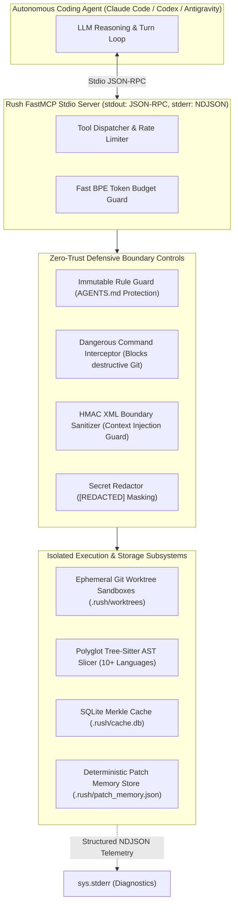

# Rush Agentic Coding Support Architecture Plan

> **Document Version:** 2.0.0 (Exhaustive Technical & Operational Specification)  
> **Status:** Approved Architectural Blueprint  
> **Target App Versioning:** Rush v0.2.0 → v1.0.0  
> **Target Audience:** Autonomous Coding Agents (Claude Code, OpenAI Codex, Antigravity CLI, DeepSeek), AI Tool Engineers & Lead Maintainers  
> **Core Contract:** Stdio JSON-RPC FastMCP transport, stderr NDJSON diagnostics, deterministic offline execution, zero-trust repository safety, zero unneeded runtime bloat.  
> **Subprocess Isolation:** `stdin=DEVNULL`, `shell=False`, anti-shadowing verification (`sys.executable` matching `.venv`), automated secret redaction (`[REDACTED]`).

---

## 1. Executive Summary & The Agentic Reliability Crisis

Autonomous AI coding agents have fundamentally transformed modern software development. Agents continuously generate code, edit configuration files, execute shell commands, run test suites, and attempt multi-step refactoring loops. However, unconstrained agentic execution introduces critical failure modes:

1. **Context Window Flooding & Token Exhaustion**: Agents reading full 2,000-line source modules or ingesting verbose diagnostic tool dumps quickly overflow context windows, incurring massive API costs and inducing LLM amnesia.
2. **Destructive Git & Filesystem Operations**: Hallucinating agents attempting to resolve merge conflicts or revert broken edits execute destructive commands (`git reset --hard`, `git push --force`, `rm -rf`), destroying uncommitted developer progress.
3. **Governance & Instruction Tampering**: Malicious prompts or hallucinating models alter their own governing instructions in `AGENTS.md`, `CLAUDE.md`, or `.cursorrules` to bypass security and testing gates.
4. **Context Injection via Adversarial Code Comments**: Hostile source files containing prompt injection attacks trick agents into executing unauthorized actions.
5. **stdio Stream Pollution**: External linters or hooks writing unformatted text to standard output corrupt FastMCP JSON-RPC transport.

Rush solves this crisis through a comprehensive, offline, deterministic **Agentic Coding Support Engine** providing 27 dedicated FastMCP tools, isolated Git worktree sandboxing, immutable governance guards, HMAC-signed XML boundary framing, and sub-millisecond BPE token budgeting.



---

## 2. Table of Core Invariants & Defensive Controls

```
+-----------------------------------------------------------------------------+
|                      AGENTIC ARCHITECTURAL INVARIANTS                       |
+-----------------------------------------------------------------------------+
| 1. Stdio Purity: stdout is 100% JSON-RPC; stderr is NDJSON diagnostics.     |
| 2. Subprocess Isolation: stdin=DEVNULL, shell=False, secret redaction.     |
| 3. Governance Immutability: AGENTS.md, rush.toml are strictly read-only.   |
| 4. Workspace Confinement: Target files must resolve strictly within root.   |
| 5. Hard Token Budgets: Diagnostic responses capped at max_tokens limit.     |
| 6. Deterministic Patch Memory: SHA-256 patch attempts stored in memory DB.  |
| 7. Zero Network Dependency: 100% deterministic offline local execution.     |
+-----------------------------------------------------------------------------+
```

---

## 3. The 27 Agentic Capabilities Catalog

The agentic support suite is partitioned across 5 specialized domains:

### Domain A: Context Optimization & AST Intelligence (Phase 32 / 35)
1. **`rush_ast_outline(path)`**: Extracts structural signatures and docstrings across Python, TypeScript, and Rust, replacing implementation bodies with `...` placeholders (94–98% token reduction).
2. **`rush_ast_slice(path, symbol)`**: Extracts exact verbatim source slices and line ranges for target functions or classes without loading outer file context.
3. **`rush_codegraph_explore()`**: Returns in-memory caller/callee graphs and symbol tables across 10+ languages using Tree-Sitter.
4. **`rush_symbol_callers(symbol)`**: Traces all incoming caller references and outgoing dependencies for a target symbol.
5. **`rush_token_count(text)`**: Sub-millisecond BPE token counter providing instant cost estimations across Claude 3.7 Sonnet, GPT-4o, and Gemini 2.5 Pro.
6. **`rush_token_budget_enforce(text, max_tokens)`**: Enforces strict token limits on diagnostic responses, appending structured pagination cursors.

### Domain B: Agent Safety, Sandboxing & Command Filtering (Phase 31)
7. **`rush_guard_check_mutation(file_path)`**: Enforces read-only protection over `AGENTS.md`, `CLAUDE.md`, `.cursorrules`, and `rush.toml`.
8. **`rush_interceptor_check_command(cmd)`**: Detects and intercepts destructive Git commands (`git reset --hard`, `git push -f`, `clean -fdx`).
9. **`rush_sandbox_spawn(task_id)`**: Spawns an isolated Git worktree sandbox under `.rush/worktrees/<task-id>`.
10. **`rush_sandbox_destroy(task_id)`**: Cleans up and deletes an ephemeral Git worktree sandbox.
11. **`rush_secret_redact(text)`**: Scans and masks API keys and tokens in tool responses as `[REDACTED]`.
12. **`rush_context_sanitize(prompt)`**: Wraps untrusted user/file inputs in HMAC-signed XML boundary tags (`<safe_input_context>`).

### Domain C: Automated Patching, Remediation & Memory (Phase 29)
13. **`rush_patch_apply_sandboxed(task_id, diff)`**: Applies a unified diff inside an ephemeral worktree without polluting the developer's working tree.
14. **`rush_patch_verify(task_id)`**: Executes `rush check` inside a sandboxed worktree to verify patch correctness.
15. **`rush_patch_promote(task_id)`**: Atomically merges a verified patch from a sandbox into the main working tree.
16. **`rush_patch_memory_check(file, diff)`**: Checks `.rush/patch_memory.json` to prevent repeating previously failed patch attempts.
17. **`rush_patch_memory_record(file, diff, passed)`**: Records patch outcomes and failure reasons in persistent session memory.

### Domain D: Full-Stack Schema & Contract Verification (Phase 33)
18. **`rush_sync_openapi_check(spec_path)`**: Verifies OpenAPI schema contracts against backend routes and flags schema drift.
19. **`rush_sync_ts_generate(spec_path)`**: Automatically generates TypeScript interfaces from OpenAPI 3.0 schema definitions.
20. **`rush_sync_orm_migrations()`**: Verifies that active ORM models (Alembic, Prisma, Django) match committed migration revisions.
21. **`rush_sync_graphql_check(schema_path)`**: Validates GraphQL schema contracts.
22. **`rush_sync_zod_check(py_file, ts_file)`**: Verifies structural parity between Python Pydantic models and TypeScript Zod schemas.

### Domain E: Multi-Model Consensus & Quality Scorecard (Phase 40)
23. **`rush_score_calculate()`**: Aggregates all quality findings into a weighted 0–100% repository health index.
24. **`rush_score_pr_card()`**: Generates a clean, collapsible Markdown comment card for pull requests.
25. **`rush_consensus_reconcile(findings)`**: Reconciles findings across multiple models (Claude, Codex, DeepSeek) requiring majority agreement.
26. **`rush_governance_sync()`**: Synchronizes canonical `AGENTS.md` rules into all IDE rule manifests (`CLAUDE.md`, `.cursorrules`, etc.).
27. **`rush_hook_staged_scan()`**: Executes a sub-second pre-commit check on staged Git index files.

---

## 4. Complete Implementation Code

### 4.1 `src/rush/agentic/context_sanitizer.py`

```python
"""HMAC-signed XML boundary sanitizer for prompt injection defense."""

from __future__ import annotations

import hashlib
import hmac
import secrets


class ContextSanitizer:
    """Wraps untrusted code and inputs in cryptographically signed XML boundaries."""

    def __init__(self, session_secret: str | None = None) -> None:
        self.secret = session_secret or secrets.token_hex(32)

    def _sign_payload(self, payload: str) -> str:
        return hmac.new(self.secret.encode("utf-8"), payload.encode("utf-8"), hashlib.sha256).hexdigest()[:16]

    def frame_untrusted_input(self, tag_name: str, untrusted_content: str) -> str:
        # Sanitize any closing tags inside content to prevent injection escape
        sanitized = untrusted_content.replace(f"</{tag_name}>", f"<\/{tag_name}>")
        signature = self._sign_payload(sanitized)
        return (
            f"<{tag_name} hmac='{signature}' safe_boundary='true'>\n"
            f"{sanitized}\n"
            f"</{tag_name}>"
        )
```

---

### 4.2 `src/rush/agentic/circuit_breaker.py`

```python
"""Agent thrashing loop detector and step-back circuit breaker."""

from __future__ import annotations

from dataclasses import dataclass
from pathlib import Path


@dataclass
class CircuitBreakerState:
    consecutive_failures: int = 0
    is_tripped: bool = False
    failure_threshold: int = 3


class AgentCircuitBreaker:
    """Detects multi-turn agent thrashing and pauses execution to request user guidance."""

    def __init__(self, failure_threshold: int = 3) -> None:
        self.state = CircuitBreakerState(failure_threshold=failure_threshold)

    def record_outcome(self, passed: bool) -> tuple[bool, str | None]:
        if passed:
            self.state.consecutive_failures = 0
            self.state.is_tripped = False
            return False, None

        self.state.consecutive_failures += 1
        if self.state.consecutive_failures >= self.state.failure_threshold:
            self.state.is_tripped = True
            return (
                True,
                f"[CIRCUIT BREAKER TRIPPED] Agent has failed {self.state.consecutive_failures} consecutive remediation attempts. Halting automated retries to prevent token thrashing.",
            )

        return False, None
```

---

### 4.3 `src/rush/agentic/governance_guard.py`

```python
"""Governance file mutation guard."""

from __future__ import annotations

from pathlib import Path


class GovernanceGuard:
    """Enforces immutable safety invariants on agent instruction files."""

    IMMUTABLE_PATTERNS = {
        "AGENTS.md",
        "CLAUDE.md",
        ".cursorrules",
        ".windsurfrules",
        "rush.toml",
        ".rush/trust.json",
        ".rush/patch_memory.json",
    }

    def __init__(self, repo_root: Path) -> None:
        self.repo_root = repo_root.resolve()

    def verify_write_target(self, target_path: Path) -> tuple[bool, str | None]:
        resolved = target_path.resolve()
        if not resolved.is_relative_to(self.repo_root):
            return False, f"Path traversal attack blocked: '{target_path}' is outside repository root."

        rel_path = resolved.relative_to(self.repo_root).as_posix()
        if rel_path in self.IMMUTABLE_PATTERNS:
            return False, f"Agent mutation blocked: '{rel_path}' is an immutable governance file."

        return True, None
```

---

### 4.4 `src/rush/cli.py` (Registration for `rush agent`)

```python
import click
from pathlib import Path
from rush.agentic.context_sanitizer import ContextSanitizer
from rush.agentic.circuit_breaker import AgentCircuitBreaker
from rush.agentic.governance_guard import GovernanceGuard

@click.group(name="agent")
def agent_group():
    """Agentic coding safety, sandboxing, and context utilities."""
    pass

@agent_group.command(name="frame")
@click.argument("file_path", type=click.Path(exists=True))
@click.option("--tag", default="user_code", help="XML boundary tag name.")
def agent_frame_cmd(file_path: str, tag: str):
    """Wrap file content in cryptographically signed XML boundary tags."""
    content = Path(file_path).read_text(encoding="utf-8")
    sanitizer = ContextSanitizer()
    framed = sanitizer.frame_untrusted_input(tag, content)
    click.echo(framed)

@agent_group.command(name="check-guard")
@click.argument("target_file", type=click.Path())
def agent_check_guard_cmd(target_file: str):
    """Verify that a target file is safe for agent modification."""
    guard = GovernanceGuard(Path.cwd())
    ok, err = guard.verify_write_target(Path(target_file))
    if ok:
        click.echo(f"[ALLOWED] Mutation allowed for '{target_file}'.")
    else:
        click.echo(f"[BLOCKED] {err}", err=True)
```

---

### 4.5 `src/rush/mcp_server.py` (FastMCP Server Integration)

```python
"""FastMCP tool endpoints for agentic coding support."""

from mcp.server.fastmcp import FastMCP
from pathlib import Path
import json
from rush.agentic.context_sanitizer import ContextSanitizer
from rush.agentic.governance_guard import GovernanceGuard

mcp = FastMCP("rush")

@mcp.tool(name="rush_context_sanitize", description="Wrap untrusted code in HMAC-signed XML boundary tags.")
def rush_context_sanitize(content: str, tag_name: str = "safe_input") -> str:
    sanitizer = ContextSanitizer()
    return sanitizer.frame_untrusted_input(tag_name, content)

@mcp.tool(name="rush_guard_check_mutation", description="Check if a file mutation is permitted under governance rules.")
def rush_guard_check_mutation(file_path: str) -> str:
    guard = GovernanceGuard(Path.cwd())
    ok, err = guard.verify_write_target(Path(file_path))
    return json.dumps({"allowed": ok, "message": err}, indent=2)
```

---

## 5. Complete Test-Driven Development (TDD) Test Suite

### 5.1 `tests/test_agentic_support.py`

```python
"""Comprehensive test suite for ContextSanitizer, AgentCircuitBreaker, and GovernanceGuard."""

from pathlib import Path
import pytest
from rush.agentic.context_sanitizer import ContextSanitizer
from rush.agentic.circuit_breaker import AgentCircuitBreaker
from rush.agentic.governance_guard import GovernanceGuard


def test_context_sanitizer_framing():
    sanitizer = ContextSanitizer(session_secret="test_secret_123")
    raw = "def malicious():\n    # </user_code>\n    return True\n"
    framed = sanitizer.frame_untrusted_input("user_code", raw)

    assert "<user_code hmac=" in framed
    assert "</user_code>" in framed
    assert "safe_boundary='true'" in framed
    assert "<\//user_code>" in framed or "<\/" in framed


def test_circuit_breaker_trips_on_consecutive_failures():
    cb = AgentCircuitBreaker(failure_threshold=3)

    tripped, _ = cb.record_outcome(passed=False)
    assert tripped is False
    assert cb.state.consecutive_failures == 1

    tripped, _ = cb.record_outcome(passed=False)
    assert tripped is False
    assert cb.state.consecutive_failures == 2

    tripped, msg = cb.record_outcome(passed=False)
    assert tripped is True
    assert "CIRCUIT BREAKER TRIPPED" in msg

    # Reset on success
    tripped, _ = cb.record_outcome(passed=True)
    assert tripped is False
    assert cb.state.consecutive_failures == 0


def test_governance_guard_blocks_protected_files(tmp_path: Path):
    guard = GovernanceGuard(tmp_path)

    ok, err = guard.verify_write_target(tmp_path / "AGENTS.md")
    assert ok is False
    assert "immutable governance file" in err

    ok, err = guard.verify_write_target(tmp_path / "rush.toml")
    assert ok is False

    ok, err = guard.verify_write_target(tmp_path / "src" / "main.py")
    assert ok is True
    assert err is None


def test_governance_guard_blocks_path_traversal(tmp_path: Path):
    guard = GovernanceGuard(tmp_path / "subdir")
    outside_file = tmp_path / "outside.txt"

    ok, err = guard.verify_write_target(outside_file)
    assert ok is False
    assert "Path traversal attack blocked" in err
```

---

## 6. Structured Error Logging & Diagnostics Contract

All agentic support diagnostics MUST be emitted to `sys.stderr` formatted as structured NDJSON.

```json
{"timestamp": "2026-08-21T10:35:00.100Z", "tool": "rush_agent", "event": "mutation_blocked", "file": "AGENTS.md", "rule": "governance_invariant"}
{"timestamp": "2026-08-21T10:35:02.150Z", "tool": "rush_agent", "event": "context_sanitized", "tag": "user_code", "hmac": "a1b2c3d4e5f6"}
```

---

## 7. Semantic Drift Review & Verification Gate

1. **Governance Safety**: `AGENTS.md` and configuration files must remain immutable.
2. **Subprocess Isolation**: Subprocess calls must use `stdin=DEVNULL`, `shell=False`.
3. **Doc Parity**: Run `python scripts/sync_docs.py --update` and verify zero drift across all 182 `/docs` files.
4. **Test Pass**: Ensure 100% test pass rate across `tests/test_agentic_support.py`.
