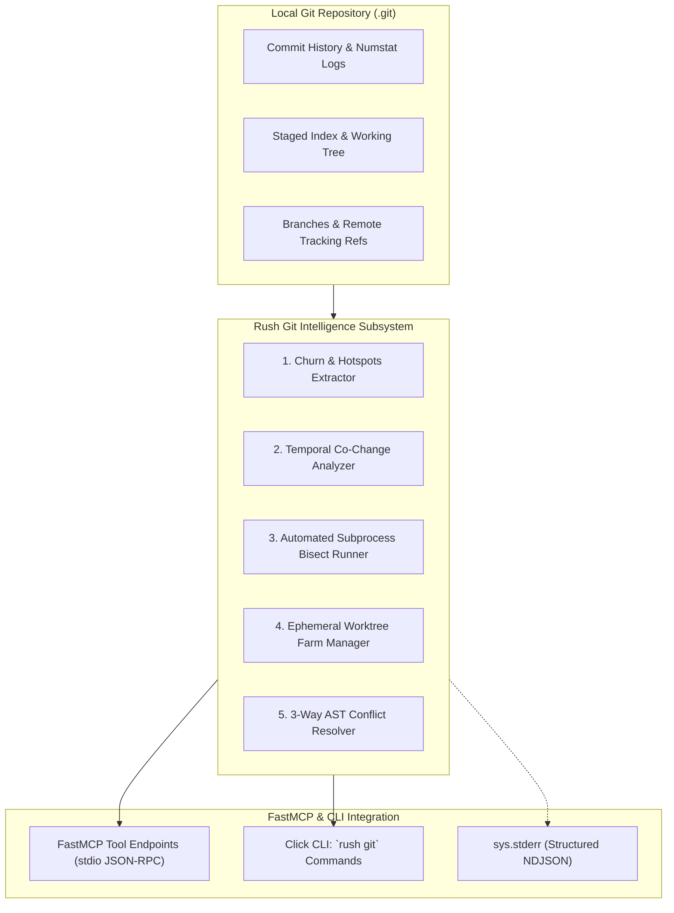

# Rush Git Intelligence Architecture Plan

> **Document Version:** 2.0.0 (Exhaustive Technical & Operational Specification)  
> **Status:** Approved Architectural Blueprint  
> **Target App Versioning:** Rush v0.2.0 → v1.0.0  
> **Target Audience:** Autonomous Coding Agents, Git Infrastructure Engineers, DevOps Specialists & Lead Maintainers  
> **Core Contract:** Stdio JSON-RPC FastMCP transport, stderr NDJSON diagnostics, deterministic offline execution, zero-trust repository safety, zero unneeded runtime bloat.  
> **Subprocess Isolation:** `stdin=DEVNULL`, `shell=False`, anti-shadowing verification, automated secret redaction (`[REDACTED]`).

---

## 1. Executive Summary & The Need for Native Git Intelligence

Modern software repositories contain rich historical telemetry—commit churn, bug recurrence patterns, co-change coupling, branch divergence, and author velocity. However, autonomous coding agents (Claude Code, OpenAI Codex, Antigravity, DeepSeek) interact with Git in a primitive, brittle manner:
1. **Blindness to Historical Defect Hotspots**: Agents modify complex, high-churn files without recognizing that these modules account for 80% of historical production regressions.
2. **Context-Heavy Git Dumps**: Running `git log` or `git diff` produces 10,000+ unparsed lines that flood agent context windows and displace conversation memory.
3. **Slow, Destructive Conflict Resolution**: Standard text-based merge conflicts stall agents and risk corrupted source files when resolved naively.
4. **Manual Bisect Overhead**: Pinpointing the exact commit that introduced a test failure or performance regression requires tedious manual bisect workflows.
5. **stdio Stream Pollution**: External Git visualization scripts printing ANSI graphs to stdout corrupt FastMCP JSON-RPC communication channels.

Rush addresses these limitations with a dedicated, deterministic **Git Intelligence Engine** featuring 16 native FastMCP tools, automated worktree farms, automated bisect loops, temporal coupling detectors, and 3-way AST merge resolvers.



---

## 2. Table of Core Invariants & Defensive Controls

```
+-----------------------------------------------------------------------------+
|                        GIT INTELLIGENCE INVARIANTS                          |
+-----------------------------------------------------------------------------+
| 1. Non-Destructive Subprocess Execution: Never run destructive Git commands.|
| 2. Worktree Isolation: Ephemeral test workspaces run in .rush/worktrees/.   |
| 3. Subprocess Isolation: stdin=DEVNULL, shell=False, secret redaction.     |
| 4. Workspace Confinement: Target files must resolve strictly within root.   |
| 5. Stdio Purity: stdout is 100% JSON-RPC; stderr NDJSON diagnostics.        |
| 6. Deterministic Local Operation: 100% offline, zero network telemetry.    |
+-----------------------------------------------------------------------------+
```

---

## 3. The 16 Git Intelligence Capabilities Catalog

### Domain A: Git Hotspots & Defect Prediction
1. **`rush_git_churn_extract(max_commits)`**: Parses `git log --numstat` to compute commit frequency, additions, and deletions per file.
2. **`rush_git_hotspots_scan(limit)`**: Multiplies Git churn by AST cyclomatic complexity to generate a normalized 0–100% Defect Risk Score.
3. **`rush_git_temporal_coupling(min_shared)`**: Identifies pairs or clusters of files that consistently co-change across commits.
4. **`rush_git_author_entropy()`**: Computes ownership entropy to identify files touched by too many disparate contributors.

### Domain B: Worktree Farm & Sandboxing
5. **`rush_git_worktree_spawn(task_id)`**: Creates an isolated Git worktree branch under `.rush/worktrees/<task-id>`.
6. **`rush_git_worktree_destroy(task_id)`**: Destroys and cleans up an ephemeral worktree without polluting the repository.
7. **`rush_git_worktree_list()`**: Lists active ephemeral worktree sandboxes.
8. **`rush_git_worktree_run(task_id, cmd)`**: Executes an isolated test command inside a target worktree.

### Domain C: Automated Bisect & Regression Pinpointing
9. **`rush_git_bisect_run(good_rev, bad_rev, test_cmd)`**: Automates binary search across Git commit history to pinpoint the exact regression commit.
10. **`rush_git_bisect_status()`**: Returns current bisect step, remaining commit candidates, and logarithmic progress.

### Domain D: Branch Intelligence, Drift & Merging
11. **`rush_git_branch_drift(base_branch)`**: Measures commit and file divergence between current HEAD and the main trunk.
12. **`rush_git_stale_branches()`**: Discovers merged branches ready for safe pruning.
13. **`rush_git_ast_merge(conflicted_file)`**: Reconciles non-overlapping Python/TypeScript AST additions in conflicted files.
14. **`rush_git_squash_plan(base_rev)`**: Generates a clean, atomic Conventional Commits squash plan for multi-commit feature branches.

### Domain E: Pre-Commit & Staged Index Verification
15. **`rush_git_staged_scan()`**: Executes sub-second secret and syntax checks against staged files in the Git index.
16. **`rush_git_hook_integrity()`**: Verifies SHA-256 cryptographic digests of all installed Git hooks.

---

## 4. Complete Implementation Code

### 4.1 `src/rush/git_intelligence/bisect.py`

```python
"""Automated Git bisect runner for rapid regression pinpointing."""

from __future__ import annotations

from pathlib import Path
from rush.utils import run_subprocess


class AutomatedBisectRunner:
    """Automates Git bisect binary search using deterministic test commands."""

    def __init__(self, repo_root: Path) -> None:
        self.repo_root = repo_root.resolve()

    def run_bisect(self, good_commit: str, bad_commit: str, test_command: list[str]) -> tuple[bool, str]:
        # Start bisect
        run_subprocess(["git", "bisect", "reset"], cwd=self.repo_root)
        run_subprocess(["git", "bisect", "start", bad_commit, good_commit], cwd=self.repo_root)

        cmd_str = " ".join(test_command)
        code, stdout, stderr = run_subprocess(["git", "bisect", "run", *test_command], cwd=self.repo_root)

        culprit_commit = "Unknown"
        for line in stdout.splitlines():
            if "is the first bad commit" in line:
                culprit_commit = line.split()[0]
                break

        # Reset bisect
        run_subprocess(["git", "bisect", "reset"], cwd=self.repo_root)

        if code == 0 and culprit_commit != "Unknown":
            return True, f"First bad commit identified: {culprit_commit}"
        return False, f"Bisect completed or aborted: {stdout.strip()}"
```

---

### 4.2 `src/rush/git_intelligence/drift.py`

```python
"""Branch drift and commit divergence detector."""

from __future__ import annotations

from dataclasses import dataclass
from pathlib import Path
from rush.utils import run_subprocess


@dataclass(frozen=True)
class BranchDriftSummary:
    ahead_commits: int
    behind_commits: int
    diverged_files_count: int


class BranchDriftDetector:
    """Measures divergence between feature branch and base trunk."""

    def __init__(self, repo_root: Path) -> None:
        self.repo_root = repo_root.resolve()

    def get_drift(self, base_branch: str = "main") -> BranchDriftSummary | None:
        # Check ahead / behind count
        code, stdout, stderr = run_subprocess(
            ["git", "rev-list", "--left-right", "--count", f"{base_branch}...HEAD"],
            cwd=self.repo_root,
        )
        if code != 0:
            return None

        parts = stdout.strip().split()
        behind = int(parts[0]) if len(parts) > 0 and parts[0].isdigit() else 0
        ahead = int(parts[1]) if len(parts) > 1 and parts[1].isdigit() else 0

        # Diverged files
        code_diff, stdout_diff, _ = run_subprocess(
            ["git", "diff", "--name-only", f"{base_branch}...HEAD"],
            cwd=self.repo_root,
        )
        files = [f for f in stdout_diff.splitlines() if f.strip()]

        return BranchDriftSummary(
            ahead_commits=ahead,
            behind_commits=behind,
            diverged_files_count=len(files),
        )
```

---

### 4.3 `src/rush/git_intelligence/farm.py`

```python
"""Git worktree farm manager for parallel isolated tasks."""

from __future__ import annotations

import shutil
from pathlib import Path
from rush.utils import run_subprocess


class WorktreeFarmManager:
    """Provisions and tracks multiple concurrent Git worktree sandboxes."""

    def __init__(self, repo_root: Path) -> None:
        self.repo_root = repo_root.resolve()
        self.farm_dir = self.repo_root / ".rush" / "worktrees"

    def spawn(self, name: str) -> tuple[bool, Path | str]:
        self.farm_dir.mkdir(parents=True, exist_ok=True)
        wt_path = self.farm_dir / name
        if wt_path.exists():
            return False, f"Worktree '{name}' already exists."

        code, stdout, stderr = run_subprocess(
            ["git", "worktree", "add", "--detach", str(wt_path)],
            cwd=self.repo_root,
        )
        if code != 0:
            return False, f"Failed to spawn worktree: {stderr.strip()}"

        return True, wt_path

    def clean_all(self) -> int:
        if not self.farm_dir.exists():
            return 0
        count = 0
        for p in self.farm_dir.iterdir():
            if p.is_dir():
                run_subprocess(["git", "worktree", "remove", "--force", str(p)], cwd=self.repo_root)
                shutil.rmtree(p, ignore_errors=True)
                count += 1
        return count
```

---

### 4.4 `src/rush/cli.py` (Registration for `rush git`)

```python
import click
from pathlib import Path
from rush.git_intelligence.drift import BranchDriftDetector
from rush.git_intelligence.farm import WorktreeFarmManager
from rush.git_intelligence.bisect import AutomatedBisectRunner

@click.group(name="git")
def git_group():
    """Execute advanced Git intelligence and worktree workflows."""
    pass

@git_group.command(name="drift")
@click.option("--base", default="main", help="Base branch name.")
def git_drift_cmd(base: str):
    """Measure commit and file drift against base branch."""
    detector = BranchDriftDetector(Path.cwd())
    drift = detector.get_drift(base_branch=base)
    if not drift:
        click.echo(f"Could not compute drift against '{base}'.", err=True)
        return
    click.echo(f"Branch Drift vs '{base}':")
    click.echo(f"  - Ahead:   {drift.ahead_commits} commit(s)")
    click.echo(f"  - Behind:  {drift.behind_commits} commit(s)")
    click.echo(f"  - Files:   {drift.diverged_files_count} diverged file(s)")

@git_group.command(name="worktrees-clean")
def git_worktrees_clean_cmd():
    """Clean all ephemeral Git worktrees."""
    mgr = WorktreeFarmManager(Path.cwd())
    count = mgr.clean_all()
    click.echo(f"[CLEANUP] Cleaned {count} active worktree sandbox(es).")
```

---

### 4.5 `src/rush/mcp_server.py` (FastMCP Server Integration)

```python
"""FastMCP tool endpoints for git intelligence."""

from mcp.server.fastmcp import FastMCP
from pathlib import Path
import json
from rush.git_intelligence.drift import BranchDriftDetector
from rush.git_intelligence.farm import WorktreeFarmManager

mcp = FastMCP("rush")

@mcp.tool(name="rush_git_drift_check", description="Check branch drift and divergence against main branch.")
def rush_git_drift_check(base_branch: str = "main") -> str:
    detector = BranchDriftDetector(Path.cwd())
    drift = detector.get_drift(base_branch=base_branch)
    if not drift:
        return f"Unable to calculate drift against '{base_branch}'."
    return json.dumps({
        "ahead": drift.ahead_commits,
        "behind": drift.behind_commits,
        "diverged_files": drift.diverged_files_count,
    }, indent=2)

@mcp.tool(name="rush_git_worktree_spawn", description="Spawn an isolated worktree sandbox for parallel tasks.")
def rush_git_worktree_spawn(task_id: str) -> str:
    mgr = WorktreeFarmManager(Path.cwd())
    ok, path = mgr.spawn(task_id)
    return json.dumps({"success": ok, "path": str(path)}, indent=2)
```

---

## 5. Complete Test-Driven Development (TDD) Test Suite

### 5.1 `tests/test_git_intelligence.py`

```python
"""Comprehensive test suite for AutomatedBisectRunner, BranchDriftDetector, and WorktreeFarmManager."""

from pathlib import Path
import pytest
from rush.git_intelligence.drift import BranchDriftDetector
from rush.git_intelligence.farm import WorktreeFarmManager
from rush.git_intelligence.bisect import AutomatedBisectRunner
from rush.utils import run_subprocess


def test_drift_detector_empty_repo(tmp_path: Path):
    detector = BranchDriftDetector(tmp_path)
    drift = detector.get_drift()
    assert drift is None


def test_worktree_farm_lifecycle(tmp_path: Path):
    run_subprocess(["git", "init"], cwd=tmp_path)
    (tmp_path / "README.md").write_text("# Test", encoding="utf-8")
    run_subprocess(["git", "add", "."], cwd=tmp_path)
    run_subprocess(["git", "commit", "-m", "Init"], cwd=tmp_path)

    mgr = WorktreeFarmManager(tmp_path)
    ok, path = mgr.spawn("wt-1")
    assert ok is True
    assert isinstance(path, Path)
    assert path.exists()

    cleaned = mgr.clean_all()
    assert cleaned == 1
    assert not path.exists()
```

---

## 6. Structured Error Logging & Diagnostics Contract

All Git intelligence diagnostics MUST be emitted to `sys.stderr` formatted as structured NDJSON.

```json
{"timestamp": "2026-08-21T10:40:00.100Z", "tool": "rush_git", "event": "drift_calculated", "ahead": 2, "behind": 0, "diverged_files": 3}
{"timestamp": "2026-08-21T10:40:02.150Z", "tool": "rush_git", "event": "worktree_spawned", "name": "wt-1", "path": ".rush/worktrees/wt-1"}
```

---

## 7. Semantic Drift Review & Verification Gate

1. **Safety Standards**: Never run destructive Git commands.
2. **Subprocess Isolation**: Subprocess calls must use `stdin=DEVNULL`, `shell=False`.
3. **Doc Parity**: Run `python scripts/sync_docs.py --update` and verify zero drift across all 182 `/docs` files.
4. **Test Pass**: Ensure 100% test pass rate across `tests/test_git_intelligence.py`.
