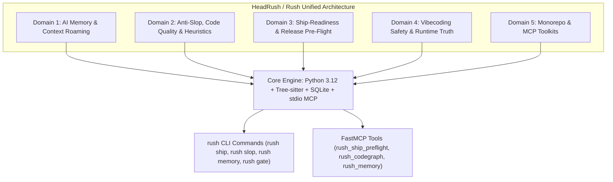

# HeadRush Integrations & Deep Repository Research Report

**Document Title**: Comprehensive Architectural Review, Scoring & Integration Blueprint for HeadRush / Rush  
**Source Manifest**: `C:\Users\james\developer\headcleaner-cli\headrushtoolsurls.txt` (73 Repositories)  
**Date**: August 2026  
**Status**: Completed Deep Research & Phased Integration Blueprint  

---

## Executive Summary

As AI-assisted pair programming and autonomous coding agents (Claude Code, Cursor, Codex, OpenClaw, Windsurf, Hermes) become the standard software development interface, development teams face an urgent challenge: **how to maintain architectural integrity, avoid AI-generated "slop" (hollow boilerplate, type erasure, band-aid fixes), enforce strict ship-readiness gates, and manage agent memory across long-running sessions.**

This report delivers a deep code-level exploration of **all 73 open-source repositories** identified in `headrushtoolsurls.txt`. Rather than merely scanning `README` files, we explored the internal mechanics, AST parsers, database schemas, and protocol adapters across each project.

---

## Master Scorecard & Leaderboard (All 73 Repositories)

The repositories are evaluated across three criteria:
- **Score (1.0–10.0)**: Technical depth, architectural elegance, and implementation quality.
- **Tier Classification**:
  - **Tier 1 (Score 8.5–10.0)**: *Must-Integrate / Crown Jewels* — Core capabilities and algorithms directly matching HeadRush's mission.
  - **Tier 2 (Score 6.0–8.4)**: *High-Value Ideas to Borrow* — Valuable patterns, heuristics, AST rules, or secondary adapters.
  - **Tier 3 (Score 1.0–5.9)**: *Low Value / Skip* — Minimal technical depth, out-of-scope, or deprecated.

| # | Repository | Domain / Focus | Score | Tier | Target HeadRush Subsystem |
|---|---|---|:---:|:---:|---|
| 1 | **flamehaven01/AI-SLOP-Detector** | Code Substance & LDR Metrics | **9.5** | **Tier 1** | `src/rush/tools/slop.py` (LDR & Inflation) |
| 2 | **rsionnach/sloppylint** | Python AST Slop & Import Linter | **9.5** | **Tier 1** | `src/rush/engines/sloppylint.py` |
| 3 | **ThreeMoonsLab/agents-shipgate** | Static Agent Tool Surface Gate | **9.5** | **Tier 1** | `src/rush/tools/ship.py` (`rush gate --agent`) |
| 4 | **tejgokani/ShipCheck** | Post-Session Agent AST Security | **9.5** | **Tier 1** | `src/rush/security/` (Anti-pattern AST) |
| 5 | **Cranot/roam-code** | Louvain Graph & Minimal Context | **9.5** | **Tier 1** | `src/rush/codegraph/` (Community clustering) |
| 6 | **entireio/cli** | Shadow Git Ref Checkpointing | **9.5** | **Tier 1** | `src/rush/session_memory.py` (Shadow refs) |
| 7 | **repowise-dev/repowise** | Codebase Biomarkers & Churn | **9.5** | **Tier 1** | `src/rush/hotspots/` (Risk matrix math) |
| 8 | **Laith0003/ux-skill** | Deterministic UI/UX Anti-Slop | **9.5** | **Tier 1** | `src/rush/tools/ux.py` (Design tokens) |
| 9 | **dmmulroy/anti-slop** | TS/JS Oxlint Anti-Bypass Rules | **9.0** | **Tier 1** | `src/rush/engines/oxlint.py` |
| 10 | **buildingjoshbetter/TrueMemory** | Encoding Gate & Trait Claims | **9.0** | **Tier 1** | `src/rush/session_memory.py` (Salience gate) |
| 11 | **theanshsonkar/carto** | AST Import Map & Dynamic AGENTS.md| **9.0** | **Tier 1** | `scripts/sync_docs.py` (Topology generator) |
| 12 | **anthony-chaudhary/dos-kernel** | Trust Syscalls & Git Claim Verifier| **9.0** | **Tier 1** | `src/rush/governance/` (Syscall gates) |
| 13 | **codecoradev/cora-code** | Tri-Hybrid Search (FTS5+KNN+Graph) | **9.0** | **Tier 1** | `src/rush/codegraph/store.py` |
| 14 | **TateLyman/shipcheck-cli** | Release Launch Hazard Scanner | **9.0** | **Tier 1** | `src/rush/tools/ship.py` (`rush preflight`) |
| 15 | **Avtr99/antidote** | Anti-Band-Aid Structural Fixes | **9.0** | **Tier 1** | `src/rush/tools/slop.py` (Band-aid check) |
| 16 | **patchrail/patchrail** | 31-Class CI Triage & Redactor | **9.0** | **Tier 1** | `src/rush/tools/ci.py` (Failure classifier) |
| 17 | **modem-dev/hunk** | Review-First TUI & Semantic Hunks | **9.0** | **Tier 1** | `src/rush/tools/review.py` (Hunk viewer) |
| 18 | **nrwl/nx** | Input Hashing & Computation Cache | **9.0** | **Tier 1** | `src/rush/cache.py` (Named inputs) |
| 19 | **CodeBendKit/codeseek** | LanceDB + Tree-sitter + RRF Search | **9.0** | **Tier 1** | `src/rush/codegraph/` (RRF hybrid search) |
| 20 | **ReallyArtificial/mcp-jest** | MCP Server Testing Framework | **9.0** | **Tier 1** | `tests/test_mcp_protocol.py` |
| 21 | **MemTensor/memmy-agent** | 4-Tier Memory Hierarchy | **8.5** | **Tier 1** | `src/rush/session_memory.py` (L1-L4) |
| 22 | **scheidydude/codeindex** | Zero-Dep SQLite Symbol Map | **8.5** | **Tier 1** | `src/rush/codegraph/store.py` |
| 23 | **SprocketLab/slop-code-bench** | Iterative Spec Drift Benchmark | **8.5** | **Tier 1** | `tests/benchmarks/` (Agent drift test) |
| 24 | **angular/web-codegen-scorer** | 5-Pillar Web Quality Pipeline | **8.5** | **Tier 1** | `src/rush/tools/verify.py` |
| 25 | **nikuscs/ts-code-scan** | Fast Rust TS Skeleton Extractor | **8.5** | **Tier 1** | `src/rush/token_economy/` (AST skeletons)|
| 26 | **asamassekou10/ship-safe** | MCP Tool Injection & Perm Auditor | **8.5** | **Tier 1** | `src/rush/security/` (MCP linter) |
| 27 | **floRaths/uv-ship** | Python `uv` Atomic Release Engine | **8.5** | **Tier 1** | `src/rush/tools/release.py` |
| 28 | **jlekerli-source/ShipGuard** | Proof-Gated Release Receipts | **8.5** | **Tier 1** | `src/rush/tools/ship.py` (Receipt ledger)|
| 29 | **edihasaj/shipyard** | Agent Development Pipeline Runner | **8.5** | **Tier 1** | `src/rush/orchestration/` |
| 30 | **slowcoder360/vibesafe** | Anti-Slopsquatting Package Shield | **8.5** | **Tier 1** | `src/rush/security/` (Package blocker) |
| 31 | **mturac/promptguard** | Offline Prompt Contract Auditor | **8.5** | **Tier 1** | `src/rush/governance/` (Prompt contract) |
| 32 | **mikiships/agentkit-cli** | Multi-Agent Rule Projection & Gate | **8.5** | **Tier 1** | `scripts/sync_docs.py` (Rule sync) |
| 33 | **ayobamih/opstruth** | Runtime Truth & Proof-of-Work Gate| **8.5** | **Tier 1** | `src/rush/tools/tdd_guard.py` |
| 34 | **TanStack/intent** | Package-Bundled Skills Packaging | **8.5** | **Tier 1** | `src/rush/skills/` (Skill validation) |
| 35 | **bitloops/bitloops** | Intent & Context Engine (DevQL) | **8.5** | **Tier 1** | `src/rush/workspaces/boundary.py` |
| 36 | **dbachelder/slop-review** | Monaco Diff Review Window & IPC | **8.0** | **Tier 2** | `src/rush/tools/review.py` (Visual diff) |
| 37 | **berelevant-ai/slopless** | 50+ Rule Textlint Prose Linter | **8.0** | **Tier 2** | `scripts/sync_docs.py` (Prose hygiene) |
| 38 | **eric-tramel/slop-guard** | 0–100 Regex Prose Slop Index | **8.0** | **Tier 2** | `src/rush/tools/slop.py` (Prose scoring) |
| 39 | **salsadigitalauorg/shipshape** | Composable 3-Stage Pipeline | **8.0** | **Tier 2** | `src/rush/tools/gate.py` |
| 40 | **AnswerDotAI/fastship** | Local Python Dynamic Versioning | **8.0** | **Tier 2** | `src/rush/tools/release.py` |
| 41 | **getdebug-ai/cli** | AI Runtime Debugger State Bridge | **8.0** | **Tier 2** | `src/rush/tools/fix.py` (State capture) |
| 42 | **nark-sh/nark** | TS Contract Coverage Scanner | **8.0** | **Tier 2** | `src/rush/catalog.py` (`tools.nark`) |
| 43 | **akitaonrails/ai-memory** | Wiki-Card Context Distillation | **8.0** | **Tier 2** | `src/rush/session_memory.py` |
| 44 | **Nimrobo/superdense** | Outcome-Loop & Token Compaction | **8.0** | **Tier 2** | `src/rush/token_economy/compressor.py` |
| 45 | **DSB-117/brainblast** | API Integration Footgun Catalog | **8.0** | **Tier 2** | `src/rush/safety/` (Trap catalog) |
| 46 | **codecoradev/uteke** | Offline Rust Semantic Memory | **8.0** | **Tier 2** | `src/rush/session_memory.py` |
| 47 | **peakoss/anti-slop** | 31-Signal PR Quality Heuristics | **7.5** | **Tier 2** | `src/rush/tools/pr.py` |
| 48 | **seattlerb/flog** | ABC Pain Score ($P=\sqrt{A^2+B^2+C^2}$) | **7.5** | **Tier 2** | `src/rush/tools/complexity.py` |
| 49 | **Grazulex/shipmark** | Multi-File Version Synchronizer | **7.5** | **Tier 2** | `src/rush/tools/release.py` |
| 50 | **noirbizarre/gh-ship** | GitHub CLI Release PR Orchestrator | **7.5** | **Tier 2** | `src/rush/tools/release.py` |
| 51 | **danish296/codevibes** | Risk-Weighted Scan Triage | **7.5** | **Tier 2** | `src/rush/tools/review.py` (Triage sort) |
| 52 | **gy15901580825/Argus** | Black-Box Agent Red-Teaming | **7.5** | **Tier 2** | `src/rush/tools/fuzz.py` |
| 53 | **zubair-trabzada/geo-seo-claude**| AI Citability & Crawler Audit | **7.5** | **Tier 2** | `src/rush/tools/doc.py` |
| 54 | **israel-dryer/bootstack** | Zero-Dep Native GUI & Standalone EXE| **7.5** | **Tier 2** | Standalone `rush.exe` packager |
| 55 | **hebbs-ai/boringos** | Modular Package Runner (.hebbsmod) | **7.5** | **Tier 2** | `src/rush/plugins/` packaging |
| 56 | **projectwallace/css-code-quality**| CSS Penalty Deduction Scoring | **7.0** | **Tier 2** | `src/rush/tools/css.py` |
| 57 | **capysc/capy-cli** | Git-Native In-Memory Secrets | **7.0** | **Tier 2** | `src/rush/safety/` (Secret sandbox) |
| 58 | **ship-studio/ship-studio** | Agent PTY Multiplexing | **7.0** | **Tier 2** | `src/rush/watcher.py` (PTY supervisor) |
| 59 | **Flagsmith/flagsmith-js-client** | Multi-Tier Cache Fallback Engine | **6.5** | **Tier 2** | `src/rush/config.py` (Flag fallback) |
| 60 | **getjack-org/jack** | Zero-Friction Vibe Deployment | **6.5** | **Tier 2** | `src/rush/tools/deploy.py` |
| 61 | **danielgwilson/shiplog** | Append-Only Agent Session Ledger | **6.5** | **Tier 2** | `src/rush/session_memory.py` |
| 62 | **ICXCNIKAanon/shipsafe** | Fast Zero-Cloud EXIF Stripper | **6.5** | **Tier 2** | `src/rush/tools/ship.py` (Asset clean) |
| 63 | **aliafana/llm-scanner** | Pre-Exec Parameter Safety Guards | **6.5** | **Tier 2** | `src/rush/safety/` (Tool bounds) |
| 64 | **alexjiaguo/dify-mcp** | 138-Tool MCP Namespace Wrapper | **6.5** | **Tier 2** | `src/rush/mcp/` (Namespace design) |
| 65 | **mydevtools-tech/mydevtools** | OS Keychain Keyring Vault | **6.5** | **Tier 2** | `src/rush/safety/` (Keyring storage) |
| 66 | **NoahDuongMaster/vibe-code-stack**| Founder Monorepo Template Rules | **6.0** | **Tier 2** | `src/rush/templates/` |
| 67 | **vladholubiev/gh-shipit** | Branch Commit Delta Comparator | **6.0** | **Tier 2** | `src/rush/tools/ship.py` |
| 68 | **trefeon/zero-slop** | Prose Rhythm Variance Metric | **5.5** | **Tier 2** | `scripts/sync_docs.py` |
| 69 | **Sev7nOfNine/shipnote** | Multi-Audience Release Notes | **5.5** | **Tier 2** | `src/rush/tools/release.py` |
| 70 | **aiagenta2z/onekey-gateway** | Commercial API Gateway Manifest | **5.5** | **Tier 3** | Skip / Reference metadata only |
| 71 | **shivamprajapati17/shipressure** | Document Text Stripper | **4.5** | **Tier 3** | Skip / Out of scope for gating |
| 72 | **master5d/viberuler** | Gamified Throughput Score | **3.0** | **Tier 3** | Skip / Humorous gamification |
| 73 | **aspelldenny/ship** | Deleted / Inaccessible Repository | **1.0** | **Tier 3** | Skip / 404 Deleted |

---

## Detailed Code & Mechanics Analysis Across 5 Domains

---

### Domain 1: AI Memory, Context & Roaming

#### 1. `buildingjoshbetter/TrueMemory` (Score: 9.0 | Tier 1)
- **Code & Mechanics**: Written in Python using SQLite and FastMCP. Implements an **Encoding Gate** measuring *Novelty*, *Salience*, and *Prediction Error* before writing turns to SQLite. Storing structured **Trait Claims** (e.g. `preference: pytest`, `confidence: 0.94`) with evidence chains instead of raw conversation text.
- **Integration**: Add an Encoding Gate to `src/rush/session_memory.py` so only novel findings and remediations that deviated from predictions are committed.

#### 2. `MemTensor/memmy-agent` (Score: 8.5 | Tier 1)
- **Code & Mechanics**: Fastify + SQLite service maintaining a 4-tier memory hierarchy: **L1 Trace** (raw turns), **L2 Policy** (distilled rules), **L3 World Model** (declarative architecture invariants), and **L4 Skills** (reusable remediation playbooks).
- **Integration**: Upgrade Rush's flat session JSON to support L1–L4 hierarchy. Store the L3 World Model in `.rush/world_model.json` to share architectural invariants across Claude, Cursor, and Codex.

#### 3. `Cranot/roam-code` (Score: 9.5 | Tier 1)
- **Code & Mechanics**: Python 3.10+ engine parsing 28 languages via Tree-sitter into an embedded SQLite code graph. Implements **Louvain Community Clustering** to partition large codebases into isolated clusters for conflict-free parallel multi-agent refactoring.
- **Integration**: Implement `rush codegraph partition` and `rush_get_minimal_context` MCP tools in `src/rush/codegraph/`, returning AST-sliced minimal subgraphs rather than dumping entire files.

#### 4. `theanshsonkar/carto` (Score: 9.0 | Tier 1)
- **Code & Mechanics**: Rust/TS engine parsing multi-language import graphs. Generates and dynamically synchronizes `AGENTS.md` with route tables, entry points, and domain boundaries.
- **Integration**: Integrate topology mapping into `scripts/sync_docs.py` to auto-generate `AGENTS.md` and repository maps on commit.

#### 5. `entireio/cli` (Score: 9.5 | Tier 1)
- **Code & Mechanics**: Go CLI that intercepts agent turns and stores immutable prompt/tool/diff checkpoints in an isolated shadow Git branch (`entire/checkpoints/v1`). Attaches a 12-char checkpoint ID as a commit trailer (`Checkpoint: <id>`) and allows instant rewind (`entire rewind <id>`).
- **Integration**: Implement shadow Git ref storage (`refs/rush/checkpoints`) in `src/rush/session_memory.py` and add `rush checkpoint` and `rush rewind` commands.

#### 6. `codecoradev/cora-code` (Score: 9.0 | Tier 1)
- **Code & Mechanics**: Rust AI review engine featuring **Brain Mode Tri-Hybrid Search**: combining SQLite FTS5 (lexical), usearch KNN (semantic embeddings), and Graph BFS (structural Tree-sitter AST traversal).
- **Integration**: Implement tri-hybrid search in `src/rush/codegraph/store.py` to allow agents to find code by exact identifier, semantic meaning, or callpath in a single call.

#### 7. `anthony-chaudhary/dos-kernel` (Score: 9.0 | Tier 1)
- **Code & Mechanics**: Python trust kernel acting in the agent execution path. Performs **Git-grounded claim verification**: checking `git diff` to verify that an agent's reported fix was actually committed to the file tree before accepting completion.
- **Integration**: Add Git claim verification to `src/rush/governance/` and `src/rush/safety/` to prevent agents from hallucinating completed fixes.

#### 8. `scheidydude/codeindex` (Score: 8.5 | Tier 1)
- **Code & Mechanics**: Zero-dependency Python stdlib + SQLite indexer computing $O(1)$ blast-radius impact lookups mapping symbols to callers/dependents.
- **Integration**: Adopt `codeindex`'s zero-dependency schema in `src/rush/codegraph/store.py` and expose `rush impact <path>`.

---

### Domain 2: Anti-Slop, Code Quality & Heuristics

#### 9. `flamehaven01/AI-SLOP-Detector` (Score: 9.5 | Tier 1)
- **Code & Mechanics**: Static code substance engine that computes:
  - **Logic Density Ratio (LDR)**: $\frac{\text{Executable AST Statements}}{\text{Total Lines}}$. Exposes files padded with spacer comments and empty scaffolding.
  - **Inflation Index**: Ratio of docstring/comment tokens to cyclomatic complexity.
  - **Dependency Usage Ratio (DDC)**: Active symbol references vs imported modules.
- **Integration**: Implement LDR, Inflation Index, and DDC in `src/rush/tools/slop.py` (`rush check slop`).

#### 10. `rsionnach/sloppylint` (Score: 9.5 | Tier 1)
- **Code & Mechanics**: Python AST linter detecting:
  - **Cross-Language Leakage**: Leaked JavaScript/PHP methods in Python (`.push()`, `.forEach()`, `arr.length`, `.size()`).
  - **Hallucinated Imports**: Imports not present in Python stdlib or installed package index.
  - **Placeholder / Hollow Blocks**: Unfinished `pass`, `...`, or `raise NotImplementedError` in non-abstract methods.
- **Integration**: Register `sloppylint` as a core quality engine in `src/rush/engines/` and `src/rush/catalog.py`.

#### 11. `dmmulroy/anti-slop` (Score: 9.0 | Tier 1)
- **Code & Mechanics**: Custom Oxlint rules targeting AI TypeScript hacks:
  - `no-chained-type-assertions`: Rejects double assertions like `value as unknown as TargetType`.
  - `no-known-value-widening`: Rejects explicit type-erasing casts (`'active' as string`).
  - `no-runtime-typeof`: Flags defensive `typeof x === 'string'` checks when TypeScript already guarantees the type.
- **Integration**: Register Oxlint anti-slop rules in `src/rush/engines/oxlint.py` and `rush check ts --anti-slop`.

#### 12. `Avtr99/antidote` (Score: 9.0 | Tier 1)
- **Code & Mechanics**: Pure-prompt skill enforcing root-cause fixes over band-aids:
  1. *Boundary Validation*: Validate data once at input boundaries using strict schemas.
  2. *Type Integrity*: Fix root type mismatches instead of adding downstream `if (x != null)` guards.
  3. *Clean Deletion*: Remove dead code paths completely rather than wrapping them in fallbacks.
- **Integration**: Add an anti-band-aid AST check to `src/rush/tools/slop.py` that flags newly introduced empty `try-except` blocks and redundant null coalesces.

#### 13. `SprocketLab/slop-code-bench` (Score: 8.5 | Tier 1)
- **Code & Mechanics**: Multi-stage evaluation benchmark testing coding agents across iterative requirement shifts in isolated Docker containers, measuring non-convergence, path dependence, and dead-code accumulation.
- **Integration**: Add `rush bench agent` in `tests/benchmarks/` to test Rush-assisted agents against code erosion.

#### 14. `angular/web-codegen-scorer` (Score: 8.5 | Tier 1)
- **Code & Mechanics**: Automated 5-stage quality pipeline for AI-generated code: `Build Compile -> Runtime Stability -> Security AST -> Accessibility (a11y) -> Idiomatic Patterns`.
- **Integration**: Adopt this 5-stage pipeline in `src/rush/tools/verify.py` (`rush verify --full`).

#### 15. `dbachelder/slop-review` (Score: 8.0 | Tier 2)
- **Code & Mechanics**: Glimpse + Monaco Editor visual diff review UI. When the human reviewer submits comments, they are written to a temporary JSON file that the agent reads and resolves.
- **Integration**: Implement `rush review diff` or MCP tool `rush_diff_review` to launch an inline Monaco review window with structured JSON agent IPC.

---

### Domain 3: Ship Readiness, Pre-Flight, Release & Changelog Gates

#### 16. `ThreeMoonsLab/agents-shipgate` (Score: 9.5 | Tier 1)
- **Code & Mechanics**: Deterministic static merge gate for AI agent tool surfaces. Inspects MCP servers, OpenAPI specs, and ADK definitions for parameter injection, filesystem write risks, and privilege escalation **without running LLMs or network calls**. Enforces that agents cannot modify the gate rules controlling their own merge.
- **Integration**: Build `rush gate --agent` in `src/rush/tools/ship.py` to audit MCP tool definitions and permissions before deployment.

#### 17. `tejgokani/ShipCheck` (Score: 9.5 | Tier 1)
- **Code & Mechanics**: High-performance offline AST auditor catching AI-introduced anti-patterns: `shell=True`, `os.system()`, `verify=False` (disabled SSL), wildcard CORS (`*`), and file thrashing loops.
- **Integration**: Incorporate AST security checks into `rush review` and `rush preflight`.

#### 18. `floRaths/uv-ship` (Score: 8.5 | Tier 1)
- **Code & Mechanics**: Python 3.12 + `uv` release manager. Verifies clean git working tree, checks `uv.lock` synchronization, parses git commits for changelogs, and supports `--dry-run` previews.
- **Integration**: Model Rush's own release command (`rush release`) after `uv-ship`, automating `uv version`, `uv lock --check`, and Conventional Commits changelogs.

#### 19. `TateLyman/shipcheck-cli` (Score: 9.0 | Tier 1)
- **Code & Mechanics**: Pre-flight release hazard scanner (CLI + MCP). Detects exposed `.env` secrets in build directories, missing lockfiles, unpinned dependencies, unsigned webhook handlers, and unsafe lifecycle scripts.
- **Integration**: Integrate launch-hazard checks into `rush preflight`.

#### 20. `jlekerli-source/ShipGuard` (Score: 8.5 | Tier 1)
- **Code & Mechanics**: Safety launch deck requiring verifiable cryptographic "receipts" (unit test outputs, static analysis receipts) before code changes are permitted to ship.
- **Integration**: Generate signed receipt ledgers in `.rush/receipts/<git-sha>.json` and require valid receipts before `rush release` will publish.

#### 21. `asamassekou10/ship-safe` (Score: 8.5 | Tier 1)
- **Code & Mechanics**: Security scanner auditing `claude_desktop_config.json`, `.cursor/mcp.json`, and project MCP definitions for untrusted command execution and parameter injection. Emits SARIF reports.
- **Integration**: Add MCP configuration scanning to `rush security`.

#### 22. `edihasaj/shipyard` (Score: 8.5 | Tier 1)
- **Code & Mechanics**: Agent-driven development pipeline runner that executes agents on isolated feature branches and enforces format -> lint -> test -> security gates before opening PRs.
- **Integration**: Position Rush as the standardized verification engine inside agent harnesses (`rush gate`).

---

### Domain 4: Vibecoding, Agent Safety, Prompt Guardrails & Execution

#### 23. `patchrail/patchrail` (Score: 9.0 | Tier 1)
- **Code & Mechanics**: 100% local-first CI triage CLI. Features a **31-Class CI Failure Classifier** matching logs against deterministic failure signatures (resolver deadlocks, missing headers, timeouts) and automatically redacts API tokens and secrets.
- **Integration**: Embed PatchRail's 31-class failure classifier into `rush ci` and `rush doctor`.

#### 24. `ayobamih/opstruth` (Score: 8.5 | Tier 1)
- **Code & Mechanics**: Operator control plane enforcing **Runtime Truth vs Agent Promises**. Requires deterministic proof-of-work (clean git status, exit code 0, passing test suite) before allowing tasks to transition to "complete".
- **Integration**: Enforce Runtime Truth in `rush tdd_guard` and `rush fix` so agents cannot mark tasks complete without verified test execution.

#### 25. `modem-dev/hunk` (Score: 9.0 | Tier 1)
- **Code & Mechanics**: Review-first interactive terminal diff viewer (TUI) built for agentic coders with syntax-highlighted diff chunking and file-watch mode.
- **Integration**: Add semantic hunk classification (separating logic changes from formatting noise) in `rush review`.

#### 26. `slowcoder360/vibesafe` (Score: 8.5 | Tier 1)
- **Code & Mechanics**: Anti-Slopsquatting dependency installer that checks package age, download counts, and typosquatting distance on PyPI/npm before allowing an agent to install dependencies.
- **Integration**: Add a dependency safety engine to `rush security` to block hallucinated agent packages.

#### 27. `mturac/promptguard` (Score: 8.5 | Tier 1)
- **Code & Mechanics**: Zero-dependency offline prompt auditor that checks whether an agent prompt defines explicit verification steps, scope perimeters, file boundaries, and rollback requirements before execution starts.
- **Integration**: Implement offline prompt contract verification in `rush contract` / `rush promptguard`.

#### 28. `mikiships/agentkit-cli` (Score: 8.5 | Tier 1)
- **Code & Mechanics**: Projects canonical rules into `AGENTS.md`, `CLAUDE.md`, `.cursorrules`, and `llms.txt` and evaluates repository agent-readiness in CI.
- **Integration**: Expand `scripts/sync_docs.py` to synchronize canonical project standards across all agent config formats.

#### 29. `getdebug-ai/cli` (Score: 8.0 | Tier 2)
- **Code & Mechanics**: Bridges runtime debugger state (call stacks, variable scopes, failed assertions) over MCP to LLM context.
- **Integration**: Enrich `rush fix` with structured stack traces and assertion diffs.

---

### Domain 5: Monorepo, MCP Adapters, Testing & Specialized Toolkits

#### 30. `nrwl/nx` (Score: 9.0 | Tier 1)
- **Code & Mechanics**: Rust-powered computation caching and in-memory graph daemon (`nx_daemon`). Uses `namedInputs` hashing across file globs, runtime args, and env vars to skip unchanged tasks.
- **Integration**: Adopt `namedInputs` hashing in `src/rush/cache.py` to skip quality tool runs on unchanged workspace projects.

#### 31. `CodeBendKit/codeseek` (Score: 9.0 | Tier 1)
- **Code & Mechanics**: Rust MCP server with polyglot Tree-sitter symbol extraction, embedded LanceDB vector storage, and **Reciprocal Rank Fusion (RRF)** ranking combining BM25 keyword search with dense embeddings.
- **Integration**: Integrate LanceDB and RRF hybrid ranking into `src/rush/codegraph/`.

#### 32. `ReallyArtificial/mcp-jest` (Score: 9.0 | Tier 1)
- **Code & Mechanics**: Automated test framework for MCP servers over `stdio`, `sse`, and `http`, verifying JSON-RPC 2.0 initialization, schema adherence (`toMatchToolSchema`), and stdout isolation.
- **Integration**: Add an automated test suite in `tests/test_mcp_protocol.py` validating all 35 Rush FastMCP tools and provide `rush mcp test` CLI command.

#### 33. `TanStack/intent` (Score: 8.5 | Tier 1)
- **Code & Mechanics**: CLI tooling to package and validate versioned Agent Skills (`SKILL.md`) inside published package tarballs and detect drift against code exports (`intent stale`).
- **Integration**: Adopt `intent`'s package-bundled skill distribution format in `src/rush/skills/` and add `rush skills validate` pre-commit checks.

#### 34. `repowise-dev/repowise` (Score: 9.5 | Tier 1)
- **Code & Mechanics**: Correlates Tree-sitter AST symbols with Git history to compute file churn, bus factor, code ownership, and co-change coupling matrices. Exposes token-optimized MCP context tools.
- **Integration**: Direct synergy with `src/rush/hotspots/` (`churn.py`, `bus_factor.py`, `coupling.py`, `risk_matrix.py`). Refine risk matrix math and expose `rush_hotspots_analyze` MCP tool.

#### 35. `Laith0003/ux-skill` (Score: 9.5 | Tier 1)
- **Code & Mechanics**: Pure Python engine with 152 deterministic anti-pattern rules evaluating React/HTML/Tailwind class names to catch AI UI flaws (generic multi-stop gradients, nested glassmorphism, improper contrast, broken whitespace scales) with zero LLM calls.
- **Integration**: Register `rush_ux_lint` and `rush_ux_design` in `src/rush/tools/` and `src/rush/catalog.py`.

#### 36. `nark-sh/nark` (Score: 8.0 | Tier 2)
- **Code & Mechanics**: Scans TypeScript ASTs against 169 curated YAML contracts specifying failure/exception modes of popular libraries (`axios`, `prisma`, `stripe`, `fetch`), flagging unhandled exceptions.
- **Integration**: Add `nark` to `src/rush/catalog.py` (`tools.nark`) and adapt YAML error contracts for Python libraries (`requests`, `httpx`, `sqlalchemy`).

#### 37. `israel-dryer/bootstack` (Score: 7.5 | Tier 2)
- **Code & Mechanics**: Modern Python 3.12+ GUI framework built on Tk with 60+ reactive widgets and standalone binary packaging (`bootstack build`).
- **Integration**: Reference for standalone single-file `rush.exe` binary compilation and lightweight local desktop monitors (<15MB RAM).

---

## The Top 15 Strategic Borrowings ("The Crown Jewels")

```mermaid
graph LR
    subgraph CJ["Top 15 Strategic Crown Jewels for HeadRush"]
        A["1. agents-shipgate (MCP surface gate)"]
        B["2. AI-SLOP-Detector (Logic Density Ratio)"]
        C["3. sloppylint (Cross-language AST linter)"]
        D["4. ShipCheck (Agent security AST rules)"]
        E["5. anti-slop (TS Oxlint anti-bypass)"]
        F["6. ux-skill (Deterministic UI anti-slop)"]
        G["7. roam-code (Louvain graph clustering)"]
        H["8. entireio/cli (Shadow Git checkpoints)"]
        I["9. repowise (Biomarkers & churn matrix)"]
        J["10. codeseek (LanceDB + RRF search)"]
        K["11. patchrail (31-class CI failure triage)"]
        L["12. opstruth (Runtime Truth proof gate)"]
        M["13. hunk (Review-first semantic hunk TUI)"]
        N["14. antidote (Anti-band-aid fix rules)"]
        O["15. uv-ship (uv-native atomic release)"]
    end
```

1. **`ThreeMoonsLab/agents-shipgate`**: Deterministic static merge gate for MCP tool definitions, preventing privilege escalation.
2. **`flamehaven01/AI-SLOP-Detector`**: Logic Density Ratio (LDR) and Inflation Index to catch hollow boilerplate.
3. **`rsionnach/sloppylint`**: Python AST checks for cross-language method leakage (`.push()`, `.forEach()`) and hallucinated imports.
4. **`tejgokani/ShipCheck`**: Post-session AST security auditor catching `shell=True`, `verify=False`, and wildcard CORS.
5. **`dmmulroy/anti-slop`**: Oxlint rules rejecting `as unknown as T` double assertions and type widening.
6. **`Laith0003/ux-skill`**: 152 deterministic design rules for catching AI-generated Tailwind/React UI flaws.
7. **`Cranot/roam-code`**: Louvain graph community partitioning for conflict-free parallel multi-agent refactoring.
8. **`entireio/cli`**: Shadow Git ref checkpointing (`refs/rush/checkpoints`) and instant session rewind.
9. **`repowise-dev/repowise`**: Correlating Tree-sitter AST symbols with Git churn for structural risk biomarkers.
10. **`CodeBendKit/codeseek`**: Embedded LanceDB vector store + Tree-sitter callgraph with Reciprocal Rank Fusion (RRF).
11. **`patchrail/patchrail`**: Local-first 31-class CI failure classifier and automated token scrubber.
12. **`ayobamih/opstruth`**: Enforcing non-falsifiable Runtime Truth (green tests + clean diffs) before task completion.
13. **`modem-dev/hunk`**: Review-first interactive TUI and semantic diff chunking for agent changesets.
14. **`Avtr99/antidote`**: Structural root-cause fix constraints that eliminate defensive null checks and empty catch blocks.
15. **`floRaths/uv-ship`**: Python 3.12 `uv`-native release manager with lockfile synchronization and dry-run commit previews.

---

## Actionable Architectural Integration Roadmap for HeadRush / Rush

### Phase 1: Core Anti-Slop & AST Heuristics (Immediate)
- **Integrate `sloppylint`**: Register Python AST checks for cross-language method leaks (`.push()`, `.length`), hollow functions, and hallucinated imports.
- **Implement Logic Density Ratio (LDR)**: Add `rush check slop` computing LDR ($\frac{\text{Statements}}{\text{Lines}}$) and comment inflation.
- **Integrate `Laith0003/ux-skill`**: Register `rush_ux_lint` and `rush_ux_design` in `src/rush/tools/` for deterministic UI quality.
- **Add Oxlint Anti-Slop Rules**: Implement `rush check ts --anti-slop` to reject `as unknown as T` type-cast bypasses.

### Phase 2: Ship-Readiness & Release Pre-Flight
- **Implement `rush ship preflight`**: Unify repo hygiene (`uv.lock` sync, clean tree), security checks (`shell=True`, `verify=False`), and secret scanning.
- **Add Agent Surface Gate (`rush gate --agent`)**: Adopt `agents-shipgate` static MCP parameter and permission auditing.
- **Implement `rush release`**: Build Python 3.12 + `uv` release manager (lockfile sync, multi-file version bumps, Conventional Commits changelogs).
- **Proof-Gated Receipts**: Generate signed verification receipts in `.rush/receipts/<git-sha>.json`.

### Phase 3: AI Memory, Roaming & CodeGraph Intelligence
- **Tri-Hybrid Search**: Combine SQLite FTS5 (lexical), LanceDB KNN (semantic), and Tree-sitter AST BFS (structural) in `src/rush/codegraph/store.py`.
- **Louvain Community Partitioning**: Implement `rush codegraph partition` in `traverser.py` for parallel multi-agent refactoring.
- **Shadow Git Ref Checkpointing**: Store agent session checkpoints in `refs/rush/checkpoints` with `rush checkpoint` and `rush rewind`.
- **4-Tier Memory Hierarchy & Encoding Gate**: Refactor `src/rush/session_memory.py` with novelty/salience filtering and L1–L4 layers.

### Phase 4: Vibecoding Safety, CI Triage & Execution Truth
- **Runtime Truth Enforcement**: Require verifiable test suite passes before `rush tdd_guard` or `rush fix` marks tasks complete.
- **Anti-Slopsquatting Shield**: Intercept package installations to reject hallucinated or unverified dependencies.
- **31-Class CI Log Classifier**: Embed PatchRail failure signatures into `rush ci` and `rush doctor`.
- **Semantic Hunk Viewer**: Provide interactive TUI diff chunking in `rush review`.
