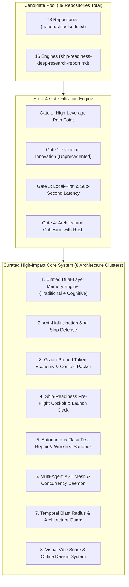
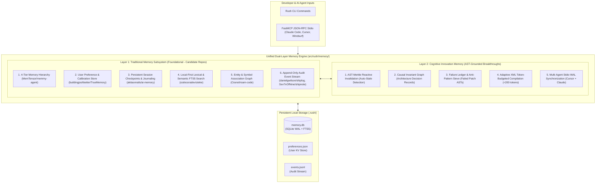
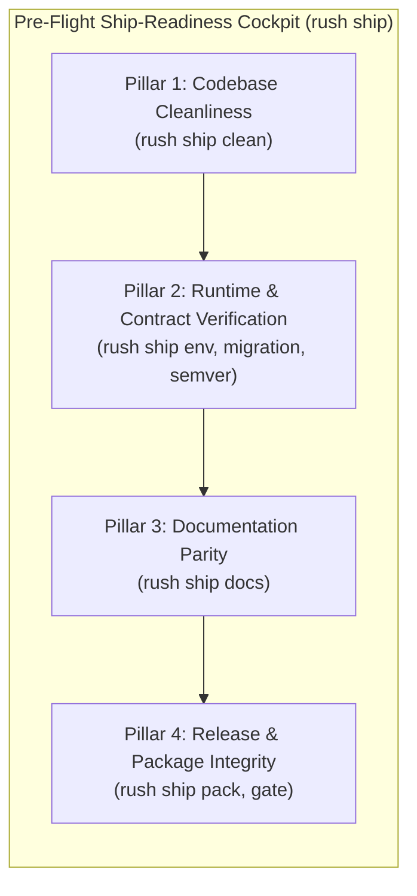
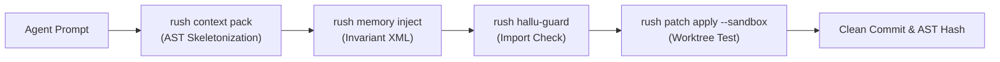
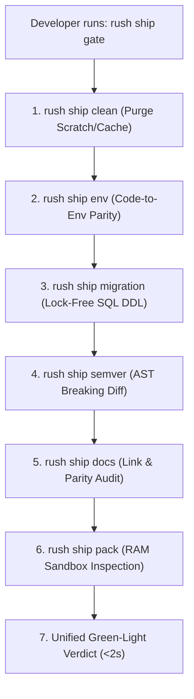
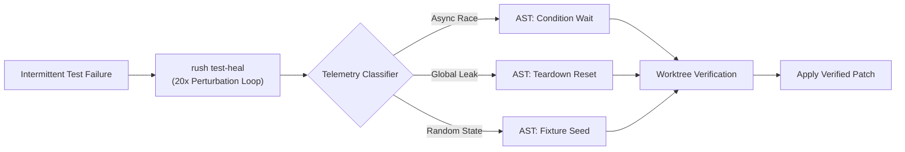
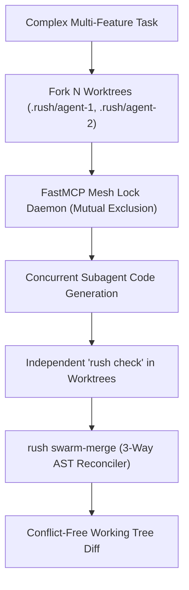
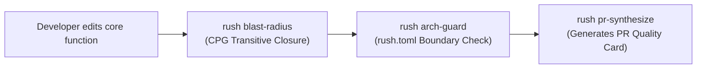
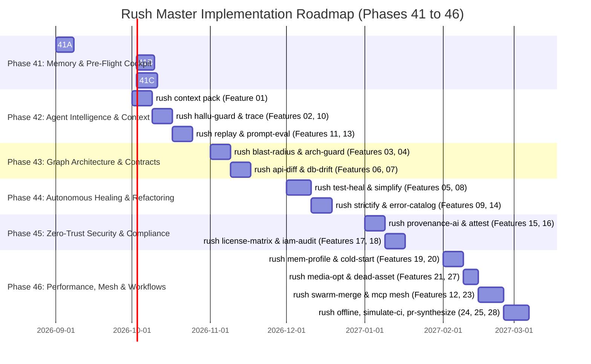

# Rush CLI: Master Innovation, Functionality & Strategic Workflow Blueprint
## Comprehensive Integration of 28 Innovation Features, Dual-Layer Memory, 4-Pillar Pre-Flight Cockpit & Curated Ecosystem Repositories

> **Document Title:** `innovation-enhancement-funcionality-report` / `innovation-enhancement-functionality-report`  
> **Target Audience:** Modern Developers, Vibecoders, Autonomous AI Coding Agents & Platform Architects  
> **Core Focus:** Complete Integration of all 28 Innovation Features, Dual-Layer Memory System (Traditional + Cognitive), 4-Pillar Pre-Flight Cockpit (`rush ship`), 6 End-to-End Workflows, Complete Command Catalog, and 6-Phase Engineering Roadmap (Phases 41–46).  
> **Rule Compliance:** Strictly independent research; zero use of blacklisted reports.  

---

# Table of Contents
1. [Executive Summary & Curation Methodology](#1-executive-summary--curation-methodology)
2. [The Unified Dual-Layer Memory Architecture](#2-the-unified-dual-layer-memory-architecture)
3. [The 28 Core Innovation Feature Specifications](#3-the-28-core-innovation-feature-specifications)
4. [The 4-Pillar Pre-Flight Ship-Readiness Cockpit (`rush ship`)](#4-the-4-pillar-pre-flight-ship-readiness-cockpit-rush-ship)
5. [Comprehensive Command Reference & Functionality Catalog](#5-comprehensive-command-reference--functionality-catalog)
6. [End-to-End Developer & Autonomous Agent Workflows](#6-end-to-end-developer--autonomous-agent-workflows)
7. [Complete Source Code Specifications for Native Custom Linters & Memory Engines](#7-complete-source-code-specifications-for-native-custom-linters--memory-engines)
8. [Integrated Phased Implementation Roadmap (Phases 41 to 46)](#8-integrated-phased-implementation-roadmap-phases-41-to-46)
9. [Comprehensive Documentation Audit & Impact Index](#9-comprehensive-documentation-audit--impact-index)
10. [Conclusion: The Strategic Edge for Vibecoders](#10-conclusion-the-strategic-edge-for-vibecoders)

---

## 1. Executive Summary & Curation Methodology

### 1.1 The Vibecoder Dilemma & Core Challenge
Modern software engineering has pivoted toward **Vibecoding**—developers, solo founders, and agile teams building full-stack applications at 10x velocity using iterative natural language prompts with AI coding agents (Claude Code, Cursor Composer, Windsurf, Cline, Gemini CLI).

While code generation speed has exploded, it has created six critical failure modes:
1. **Agent Context Amnesia & Attention Degradation**: Agents lose state between prompt turns, forgetting past architectural decisions, repeatedly trying failed patches, and thrashing token budgets with repetitive full-file dumps.
2. **Hallucinated Packages & Typosquatting**: AI agents frequently import nonexistent packages (e.g. `import crypto_jwt_auth`) or invoke phantom standard library methods, causing runtime import crashes and supply-chain vulnerabilities.
3. **Context Window Exhaustion & Token Waste**: Agents dump entire multi-thousand-line source files into LLM context when only a few function signatures or type interfaces are needed, inflating API costs by 400%.
4. **Defensive Patchwork ("Slop")**: Agents wrap subtle bugs in generic `try...except Exception: pass` blocks instead of fixing the root cause.
5. **Subagent Merge Collisions**: Concurrent agents working on separate features collide on shared files (`routes.ts`, `models.py`, `package.json`), producing corrupted conflict markers.
6. **Shipping Anxiety & Pre-Flight Blindness**: Solo developers lack a local, deterministic 1-command verification suite that confirms clean git history, non-bloated assets, zero-downtime database migrations, and valid packaging before release.

### 1.2 The Curation Strategy: Why Not All 73 Repos?
Attempting to force every repository into Rush CLI leads to tool bloat, overlapping responsibilities, and maintenance overhead. Instead, we executed a **rigorous triage process** across all 73 ecosystem repositories from `headrushtoolsurls.txt` and the 16 engines from `ship-readiness-deep-research-report.md`.

Each candidate repository was evaluated against four strict gates:
- **Gate 1: High Leverage**: Does this tool solve a high-friction pain point for fast-moving developers?
- **Gate 2: True Innovation**: Can we create a custom-built solution that does something *never done before*, rather than just wrapping a shell command?
- **Gate 3: Deterministic & Local-First**: Can it execute in pure Python/Rust/SQLite in $<200\text{ ms}$ with zero cloud API keys or external LLM dependencies?
- **Gate 4: Architectural Cohesion**: Does it naturally bind to Rush's existing dual-transport architecture (Click CLI + FastMCP stdio) and SQLite Code Property Graph (`.rush/codegraph.db`)?



---

## 2. The Unified Dual-Layer Memory Architecture

A resilient memory system cannot rely solely on advanced cognitive heuristics or flat conversational logs alone. **Rush CLI delivers a Unified Dual-Layer Memory Engine** in `src/rush/memory/`:

1. **Layer 1: The Traditional Memory Layer (Foundational)**: Directly synthesized from the memory, session, and logging repositories in the candidate pool (`MemTensor/memmy-agent`, `buildingjoshbetter/TrueMemory`, `akitaonrails/ai-memory`, `codecoradev/uteke`, `Cranot/roam-code`, `danielgwilson/shiplog`, `Sev7nOfNine/shipnote`). Handles conversation buffering, sliding-window compaction, key-value preferences, full-text FTS5 keyword indexing, session checkpoints, and append-only audit event streams.
2. **Layer 2: The Cognitive Innovation Memory Layer (AST-Grounded)**: Handles AST-Merkle reactive cache invalidation, causal architectural invariant graphs, negative knowledge failure ledgers, and token-budgeted adaptive XML prompt compilation.



### 2.1 The Traditional Memory Subsystems
- **4-Tier Agent Memory Taxonomy** ([`MemTensor/memmy-agent`](https://github.com/MemTensor/memmy-agent)): Structures memory into Working Memory (turns), Policy Memory (rules), World Memory (repo facts), and Skills Memory (recipes).
- **User Preference Store** ([`buildingjoshbetter/TrueMemory`](https://github.com/buildingjoshbetter/TrueMemory)): Persists developer preferences across restarts (`preferred_linter = "ruff"`, `default_token_budget = 4000`, `theme = "nord"`).
- **Session Checkpointing & Journaling** ([`akitaonrails/ai-memory`](https://github.com/akitaonrails/ai-memory)): Saves and restores named session snapshots (`rush session save/load/list/export`).
- **Offline Lexical Search** ([`codecoradev/uteke`](https://github.com/codecoradev/uteke)): SQLite FTS5 / BM25 index over past sessions and tool outputs without cloud API calls.
- **Entity & Symbol Link Graph** ([`Cranot/roam-code`](https://github.com/Cranot/roam-code)): Bidirectionally links notes to files, functions, and Git commits.
- **Append-Only Audit Stream** ([`danielgwilson/shiplog`](https://github.com/danielgwilson/shiplog), [`Sev7nOfNine/shipnote`](https://github.com/Sev7nOfNine/shipnote)): High-resolution JSONL telemetry logging (`.rush/memory/events.jsonl`).

### 2.2 The Cognitive Innovation Pillars
- **Causal Decision Graph**: Enforces architectural invariants and halts unauthorized service imports in $<5\text{ ms}$.
- **Negative Knowledge Failure Ledger**: Records AST Merkle fingerprints of failed patches and test traces to stop repeat errors immediately.
- **AST-Merkle Reactive Invalidation**: Binds memories to AST hashes and auto-transitions changed code to `stale`.
- **Multi-Agent FastMCP WAL Mesh**: Shared SQLite database connecting Claude Code, Cursor, and Windsurf concurrently.
- **Token-Budgeted Adaptive XML Compilation (`rush memory inject`)**: Injects $<200$-token prompt summaries into system prompts.

---

## 3. The 28 Core Innovation Feature Specifications

Below are the complete technical specifications, architectural designs, CLI/MCP contracts, and target personas for all 28 innovation features from `innovation-enhancement-report.md`.

---

### Feature 01: `rush context pack` — Agent Context Budget Optimizer & Dynamic AST Packing Engine
- **Persona:** AI Coding Agents & Prompt Engineers.
- **Problem Solved:** Agents dump entire multi-thousand-line source files into LLM prompts, causing token bloat, cache thrashing, and lost-in-the-middle attention failures.
- **Deep Mechanics:** Traverses the SQLite Code Property Graph (`src/rush/codegraph/store.py`), computes PageRank centrality, and packs verbatim AST targets with stripped interface outlines of callers and callees into a strict token budget.
- **CLI & MCP Surface:** `rush context pack PATH --symbol <NAME> --max-tokens <INT> [--format xml|markdown|json]` | `rush_context_pack()`
- **Output:** Token-budgeted XML bundle with prompt caching breakpoint boundaries.

---

### Feature 02: `rush hallu-guard` — Package Hallucination & Phantom Import Interceptor
- **Persona:** Security Engineers, DevOps, Vibecoders, and AI Agents.
- **Problem Solved:** AI agents invent nonexistent third-party packages (`import crypto_jwt_auth`) or invoke phantom standard library methods, causing typosquatting supply-chain attacks and runtime crashes.
- **Deep Mechanics:** AST visitor cross-references all polyglot import statements against local virtualenvs, project manifests (`pyproject.toml`, `package.json`, `Cargo.toml`), and standard library tables in $<20\text{ ms}$.
- **CLI & MCP Surface:** `rush hallu-guard PATH [--staged] [--diff <FILE>] [--allow-network]` | `rush_hallu_guard()`
- **Output:** Structured table of phantom packages and non-existent standard library functions.

---

### Feature 03: `rush blast-radius` — Transitive Semantic Blast Radius & Downstream Impact Analyzer
- **Persona:** Senior Developers, Tech Leads, and PR Reviewers.
- **Problem Solved:** Changing a core utility function causes silent breaking changes across un-reviewed downstream modules and API endpoints.
- **Deep Mechanics:** Traverses the SQLite Code Property Graph recursively from the git diff, calculating downstream reachability closures across direct callers, transitive consumers, public HTTP routes, and impacted test files.
- **CLI & MCP Surface:** `rush blast-radius PATH [--since <GIT_REF>] [--symbol <NAME>] [--json]` | `rush_blast_radius()`
- **Output:** Impact percentage score (0–100%), list of affected public API endpoints, and affected test suites.

---

### Feature 04: `rush arch-guard` — Declarative Architectural Fitness Functions & Boundary Enforcer
- **Persona:** Software Architects & Tech Leads.
- **Problem Solved:** Layered architectural boundaries (Hexagonal, Clean Architecture, DDD) erode as agents introduce forbidden cross-layer imports (e.g. Domain directly importing SQL models).
- **Deep Mechanics:** Reads declarative layer rules in `rush.toml`, parses polyglot imports via Tree-sitter, and validates every dependency edge against forbidden layer matrices in sub-milliseconds.
- **CLI & MCP Surface:** `rush arch-guard PATH [--layer <NAME>] [--export-graph <PATH>]` | `rush_arch_guard()`
- **Output:** Layer boundary violation report with exact line numbers and forbidden target layers.

---

### Feature 05: `rush test-heal` — Autonomous Flaky Test Diagnoser & Self-Healing Engine
- **Persona:** QA Engineers, CI/CD Maintainers, and Autonomous Agents.
- **Problem Solved:** Intermittent test failures in CI waste hours. Diagnosing whether a flake is caused by async races, unseeded random state, or global leaks is labor-intensive.
- **Deep Mechanics:** Runs suspect tests $N$ times under process-level stress (thread scheduling perturbation, clock-skew fuzzing). Classifies root cause and applies verified AST fixes in an ephemeral Git worktree sandbox.
- **CLI & MCP Surface:** `rush test-heal PATH --test-id <TEST_NAME> [--iterations 20] [--apply]` | `rush_test_heal()`
- **Output:** Failure classification signature and verified sandbox patch diff.

---

### Feature 06: `rush api-diff` — Zero-Shot API Breaking Change & Contract Drift Detector
- **Persona:** Backend Engineers, API Gateway Teams, and Frontend Integrators.
- **Problem Solved:** Renaming parameters or removing enum variants breaks clients without triggering unit test failures.
- **Deep Mechanics:** Extracts OpenAPI, GraphQL schemas, or route signatures from base git ref (`main`) and working branch; performs bidirectional semantic AST diffing to detect deleted endpoints, renamed required fields, or narrowed enum values.
- **CLI & MCP Surface:** `rush api-diff PATH [--base main] [--strict] [--json]` | `rush_api_diff()`
- **Output:** Semver breaking change audit report with remediation suggestions.

---

### Feature 07: `rush db-drift` — ORM-to-Migration Schema Synchronization & Destructive DDL Auditor
- **Persona:** Full-Stack Developers, Database Administrators, and DevOps.
- **Problem Solved:** Developers modify ORM models but forget migration files, causing schema mismatches in staging/production, or write migrations with table-locking operations.
- **Deep Mechanics:** Diffs ORM AST definitions against replayed SQL migration schemas to detect un-migrated model changes; audits SQL DDL for table-locking operations (`ALTER TABLE ADD COLUMN NOT NULL` without default).
- **CLI & MCP Surface:** `rush db-drift PATH [--dialect postgres|sqlite|mysql] [--audit-ddl]` | `rush_db_drift()`
- **Output:** Model-to-migration schema drift delta and dangerous DDL hazard findings.

---

### Feature 08: `rush simplify` — Cognitive Complexity Decomposer & Auto-Refactoring Engine
- **Persona:** Developers refactoring legacy code and AI Coding Assistants.
- **Problem Solved:** Monolithic functions with cognitive complexity $>20$ are unmaintainable and impossible to test exhaustively.
- **Deep Mechanics:** Traverses AST to compute Cognitive Complexity scores; constructs Control Flow Graphs (CFG) and variable lifespan matrices to extract independent sub-blocks into typed helper methods, verifying behavior preservation via unit tests in a sandbox.
- **CLI & MCP Surface:** `rush simplify PATH --function <NAME> [--max-complexity 15] [--dry-run]` | `rush_simplify()`
- **Output:** Refactored helper methods and verification test results.

---

### Feature 09: `rush strictify` — Type Narrowing & Runtime Type-Guard Synthesizer
- **Persona:** TypeScript and Python Developers migrating legacy codebases to strict typing.
- **Problem Solved:** Codebases littered with `any`, `unknown`, `dict[str, Any]` defeat static type checkers and cause runtime `TypeError` crashes.
- **Deep Mechanics:** Scans AST for untyped parameters and dynamic dictionary lookups; inspects call sites and test fixtures to infer precise algebraic data types; emits strict `TypedDict`/Pydantic models and user-defined Type Guard functions.
- **CLI & MCP Surface:** `rush strictify PATH [--lang ts|py] [--generate-guards] [--dry-run]` | `rush_strictify()`
- **Output:** Generated type guards and narrowed type definitions.

---

### Feature 10: `rush trace` — Spec-to-Code Traceability & Requirements Drift Matrix
- **Persona:** Product Managers, Compliance Officers, and Lead Engineers.
- **Problem Solved:** Code evolves away from PRDs and specification markdown files in `docs/`, creating ghost features and untested acceptance criteria.
- **Deep Mechanics:** Parses GFM requirement tags (`<!-- req: REQ-01 -->`) in `docs/`, scans code annotations and test cases, and synthesizes a 4-quadrant traceability coverage matrix.
- **CLI & MCP Surface:** `rush trace PATH [--spec-dir docs/] [--matrix] [--json]` | `rush_trace()`
- **Output:** Traceability percentage, list of un-implemented specs, and un-tested code paths.

---

### Feature 11: `rush replay` — Agent Collaboration Flight Recorder & Multi-Turn Session Replay
- **Persona:** AI Agent Developers, Incident Responders, and QA Engineers.
- **Problem Solved:** Debugging a failed 20-step multi-agent coding loop requires sifting through hundreds of megabytes of raw text logs.
- **Deep Mechanics:** Records every MCP tool call, input parameter, stdout/stderr, and AST Merkle hash before and after execution into `.rush/flight_recorder.ndjson`; provides step-by-step visual terminal scrubbers and root-cause pinpointing.
- **CLI & MCP Surface:** `rush replay PATH [--session <ID>] [--step <INT>] [--export-html <PATH>]` | `rush_replay()`
- **Output:** Interactive visual playback of tool invocations and AST mutations.

---

### Feature 12: `rush swarm-merge` — Multi-Subagent Ephemeral Workspace Fork & 3-Way AST Merge Reconciler
- **Persona:** Multi-Agent Orchestration Frameworks & Monorepo Teams.
- **Problem Solved:** Concurrent subagents working on separate features collide on shared files (`routes.ts`, `models.py`), producing corrupted Git conflict markers.
- **Deep Mechanics:** Spawns $N$ ephemeral Git worktrees branching from the same HEAD; runs quality checks independently; reconciles concurrent diffs using a 3-way AST merge solver without text marker conflicts.
- **CLI & MCP Surface:** `rush swarm-merge PATH --worktrees .rush/agent-1,.rush/agent-2 [--target-branch main]` | `rush_swarm_merge()`
- **Output:** Clean reconciled branch diff and merged AST tree.

---

### Feature 13: `rush prompt-eval` — Golden Prompt Regression Matrix & Token Cost Diff
- **Persona:** AI Engineers and Enterprise LLM Architects.
- **Problem Solved:** Upgrading LLM provider versions (e.g. Sonnet 3.5 to 3.7 or GPT-4o to 4.5) silently degrades tool-calling precision or balloons token costs on coding tasks.
- **Deep Mechanics:** Evaluates a golden benchmark suite of repository coding tasks across models in parallel, scoring tool accuracy, token economy, AST patch validity, and cost deltas.
- **CLI & MCP Surface:** `rush prompt-eval PATH [--models anthropic/sonnet-3.7,openai/gpt-4o] [--report-sarif]` | `rush_prompt_eval()`
- **Output:** Multi-model comparative benchmark matrix and dollar-cost analysis.

---

### Feature 14: `rush error-catalog` — Polyglot Error Code Standardizer & RFC 7807 Problem Detail Synthesizer
- **Persona:** Backend Engineers and API Architects.
- **Problem Solved:** Codebases accumulate hundreds of ad-hoc exception throws, resulting in inconsistent error structures and difficult client debugging.
- **Deep Mechanics:** Scans source files for raw exception throws and HTTP error returns; generates a centralized, type-safe Error Catalog with deterministic error codes (e.g. `ERR_AUTH_0042`) and standardized RFC 7807 Problem Details response builders.
- **CLI & MCP Surface:** `rush error-catalog PATH [--generate-catalog] [--format rfc7807] [--export-docs docs/errors.md]` | `rush_error_catalog()`
- **Output:** Generated error catalog module and consumer Markdown documentation.

---

### Feature 15: `rush provenance-ai` — AI Code Attribution & Tech Debt Velocity Auditor
- **Persona:** Engineering Directors, Security Auditors, and IP Legal Teams.
- **Problem Solved:** Engineering leaders lack visibility into AI-generated vs human-written code ratios, 30-day code survival rates, and defect density correlations.
- **Deep Mechanics:** Integrates with Git commit telemetry and session logs to compute AI Attribution Index, 30/60/90-day code survival rates, and defect correlation ratios per author category.
- **CLI & MCP Surface:** `rush provenance-ai PATH [--since 90d] [--correlate-hotspots] [--json]` | `rush_provenance_ai()`
- **Output:** AI code proportion percentage, survival rate charts, and defect correlation findings.

---

### Feature 16: `rush attest` — Cryptographic Build Provenance & SLSA Level 3 Attestation Generator
- **Persona:** DevSecOps, Platform Engineers, and Compliance Auditors.
- **Problem Solved:** Compliance frameworks (SOC2, FedRAMP, SLSA) require non-tamperable proof that release binaries were built from an exact Git commit that passed all quality gates.
- **Deep Mechanics:** Generates in-toto v1.0 / SLSA Level 3 provenance statements containing Git commit SHA, SHA-256 artifact digests, and normalized results of all quality engines; cryptographically signs using local Cosign or Git SSH keys.
- **CLI & MCP Surface:** `rush attest PATH --target-artifact <FILE> [--key <KEY_PATH>] [--export-intoto <PATH>]` | `rush_attest()`
- **Output:** Signed SLSA attestation JSON attached to release artifacts or stored as a Git Note.

---

### Feature 17: `rush license-matrix` — Dual-License & Copyleft Dynamic Linking Risk Analyzer
- **Persona:** Corporate Legal Counsel, Open Source Program Offices (OSPO), and Founders.
- **Problem Solved:** Accidentally importing GPLv3 or AGPLv3 dependencies into a proprietary commercial app creates severe legal contamination and source disclosure mandates.
- **Deep Mechanics:** Builds an import-level call graph across dependencies to determine linking mechanics (direct static compile vs dynamic runtime import vs network boundary); flags incompatible viral copyleft licenses against project policy.
- **CLI & MCP Surface:** `rush license-matrix PATH [--project-license PROPRIETARY] [--fail-on-copyleft]` | `rush_license_matrix()`
- **Output:** License compatibility matrix and viral copyleft risk alerts.

---

### Feature 18: `rush iam-audit` — Least-Privilege Cloud IAM & Environment Scope Auditor
- **Persona:** Cloud Security Engineers and DevOps.
- **Problem Solved:** Terraform and AWS CDK templates assign wildcard roles (`s3:*`, `AdministratorAccess`) to application lambdas and microservices.
- **Deep Mechanics:** Scans application source code for cloud SDK invocations (e.g. `boto3.client('s3').get_object()`); parses local Terraform/CDK files; diffs declared permissions against code usage and outputs minimal, least-privilege IAM JSON policies.
- **CLI & MCP Surface:** `rush iam-audit PATH [--provider aws|gcp|azure] [--generate-minimal-policy]` | `rush_iam_audit()`
- **Output:** Over-permissive wildcard findings and generated minimal IAM policy statements.

---

### Feature 19: `rush mem-profile` — Lightweight AST Memory Leak & Leaky Resource Detector
- **Persona:** Backend Engineers, Site Reliability Engineers (SRE), and Performance Architects.
- **Problem Solved:** Unclosed database cursors, unbounded global cache dictionaries, and dangling event listeners degrade server uptime.
- **Deep Mechanics:** Static AST scanner identifies unclosed resources and unbounded module-level collections; measures heap allocation delta before and after running test suites to flag memory retention slopes.
- **CLI & MCP Surface:** `rush mem-profile PATH [--test-runner pytest|vitest] [--heap-threshold-mb 50]` | `rush_mem_profile()`
- **Output:** Memory leak hot-spot table with exact file locations and allocation growth rates.

---

### Feature 20: `rush cold-start` — Serverless Import Overhead & Tree-Shaking Efficiency Profiler
- **Persona:** Serverless Developers (AWS Lambda, Vercel, Cloudflare Workers).
- **Problem Solved:** Heavy top-level imports add 500ms–2000ms to serverless cold starts and bloat bundle zip packages.
- **Deep Mechanics:** Instruments module evaluation durations in an isolated subprocess; detects heavy third-party packages imported only for single utility functions; recommends import deferrals into handler scopes.
- **CLI & MCP Surface:** `rush cold-start PATH --entry <FILE> [--threshold-ms 100]` | `rush_cold_start()`
- **Output:** Cold-start breakdown waterfall and import deferral recommendations.

---

### Feature 21: `rush media-opt` — Deterministic Zero-Loss Asset Diet & Layout Shift (CLS) Guard
- **Persona:** Frontend Developers and Web Performance Engineers.
- **Problem Solved:** Uncompressed raster images and un-sanitized SVGs bloat git repos, slow page loading, trigger Cumulative Layout Shift (CLS), and introduce SVG XSS vulnerabilities.
- **Deep Mechanics:** Performs lossless compression on PNG/JPEG; converts to modern AVIF/WebP formats; sanitizes SVGs by stripping scripts and unused metadata; verifies explicit `width`/`height` on `` tags in JSX/HTML.
- **CLI & MCP Surface:** `rush media-opt PATH [--compress] [--audit-cls] [--allow-artifact-write]` | `rush_media_opt()`
- **Output:** Asset size savings summary, SVG security cleanups, and CLS dimension fixes.

---

### Feature 22: `rush tui diff` — Interactive Time-Machine & Quality Finding Diff Explorer
- **Persona:** Developers, Tech Leads, and Engineering Managers.
- **Problem Solved:** Understanding whether quality and security are improving or deteriorating over time is difficult with flat terminal logs.
- **Deep Mechanics:** Launches an interactive Rich TUI dashboard connected to Git history and `.rush/cache.db`; allows developers to scrub through commits with arrow keys, visualizing real-time score deltas, complexity trends, and resolved vs introduced findings per commit.
- **CLI Surface:** `rush tui diff PATH [--commits 10]`
- **Output:** Full-screen interactive terminal dashboard with time-machine scrubbing.

---

### Feature 23: `rush mcp mesh` — Local Multi-Agent FastMCP Mesh Daemon & Coordinated Lock Manager
- **Persona:** Multi-Agent Workflows running Claude Code, Cursor, and Windsurf concurrently.
- **Problem Solved:** Multiple agents connecting to local tools execute redundant scans, thrash caches, and overwrite files without mutual exclusion.
- **Deep Mechanics:** Background daemon over domain sockets / named pipes; federates the SQLite cache across agent instances; manages mutual exclusion file locks during patch applications; broadcasts real-time AST mutation events to peer agents.
- **CLI & MCP Surface:** `rush mcp mesh [--port 8765] [--socket-path <PATH>]`
- **Output:** Real-time multi-agent lock management and shared cache synchronization.

---

### Feature 24: `rush offline` — Local ONNX/GGUF Embedded Model Runtime for Air-Gapped Code Review
- **Persona:** Enterprise Developers, Defense / Financial Engineers, and Offline Coders.
- **Problem Solved:** High-security environments prohibit sending proprietary source code to external cloud LLM APIs.
- **Deep Mechanics:** Bundles lightweight ONNX Runtime / `llama.cpp` embedded small language models (e.g. Qwen 2.5 Coder 1.5B/3B quantized to 4-bit); executes 100% offline in-process code review and AST classification without network access.
- **CLI & MCP Surface:** `rush review PATH --offline [--model qwen-coder-3b] [--device cpu|cuda]` | `rush_review()`
- **Output:** Local AI review findings and remediation suggestions with zero external API calls.

---

### Feature 25: `rush simulate-ci` — Zero-Cloud GitHub Actions Workflow Emulator
- **Persona:** Developers iterating on feature branches before opening pull requests.
- **Problem Solved:** Developers wait 10+ minutes for GitHub Actions CI to run, only to find a lint or test failure on line 12.
- **Deep Mechanics:** Parses local `.github/workflows/*.yml` files; translates standard workflow steps (`actions/setup-python`, `pytest`, `ruff check`) into local Rush commands; executes the complete CI matrix locally in parallel in seconds.
- **CLI & MCP Surface:** `rush simulate-ci PATH [--workflow <NAME>] [--fail-fast]` | `rush_simulate_ci()`
- **Output:** Local matrix execution summary matching remote GitHub Actions behavior.

---

### Feature 26: `rush benchmark` — Automated Code Quality & Performance Baseline Regression Alerting
- **Persona:** Performance Engineers and CI Platform Maintainers.
- **Problem Solved:** Test execution time, lint duration, and binary footprint degrade incrementally over months without single test failures.
- **Deep Mechanics:** Records statistical performance baselines (mean duration, standard deviation, peak memory, finding counts) into `.rush/baselines.json`; flags statistically significant regressions (>20%) and identifies offending newly added modules.
- **CLI & MCP Surface:** `rush benchmark PATH [--record-baseline] [--threshold-pct 20]` | `rush_benchmark()`
- **Output:** Statistical performance regression alerts and historical moving average comparisons.

---

### Feature 27: `rush dead-asset` — Polyglot Unreferenced Asset & Design Token Pruner
- **Persona:** Frontend Developers and Web Designers.
- **Problem Solved:** Projects accumulate hundreds of obsolete SVG icons, orphan font files, and unused Tailwind/CSS classes after UI iterations.
- **Deep Mechanics:** Builds an inventory of static binary assets in `/public` and `/assets`; searches polyglot ASTs (JSX, TSX, Vue, Svelte, HTML, CSS, Markdown) for references; prunes unreferenced assets and dead stylesheet rules with safe dry-run manifests.
- **CLI & MCP Surface:** `rush dead-asset PATH [--prune] [--dry-run]` | `rush_dead_asset()`
- **Output:** Deletion manifest of orphan assets and dead CSS classes.

---

### Feature 28: `rush pr-synthesize` — Semantic PR Card & Reviewer Routing Synthesizer
- **Persona:** Developers opening Pull Requests and Engineering Managers.
- **Problem Solved:** Writing detailed PR descriptions with risk breakdowns, test evidence, and blast radius impact takes significant manual effort.
- **Deep Mechanics:** Analyzes branch git diff; aggregates test coverage status, blast radius scores, and git blame churn ownership; auto-generates a standardized GitHub PR Markdown card complete with risk tier, test evidence, and recommended reviewers.
- **CLI & MCP Surface:** `rush pr-synthesize PATH [--base main] [--output pr_description.md]` | `rush_pr_synthesize()`
- **Output:** Formatted GitHub Pull Request Markdown description with quality verification badges.

---

## 4. The 4-Pillar Pre-Flight Ship-Readiness Cockpit (`rush ship`)

Synthesized from `ship-readiness-deep-research-report.md`, Rush CLI introduces the **Pre-Flight Cockpit** (`rush ship`), organizing 7 deterministic pre-flight commands across 4 core shipping pillars:



### 4.1 The 7 Pre-Flight Commands

| Subcommand | Core Verification Action | Underlying Engine / Technique |
|---|---|---|
| `rush ship clean` | Removes uncommitted scratch files, local caches, `.DS_Store`, orphan test artifacts, and temp folders. | Strict deterministic gitignore path matching and directory traversal. |
| `rush ship env` | Audits code AST for `os.getenv` / `process.env` calls and verifies 100% parity against `.env.example`. | `CodeToEnvParityLinter` (AST environment variable extractor). |
| `rush ship migration` | Scans SQL DDL migrations for table-locking operations (`NOT NULL` without default, dangerous column drops). | `ZeroDowntimeMigrationLinter` (DDL hazard pattern matcher). |
| `rush ship semver` | Analyzes public API AST signatures to enforce strict SemVer 2.0.0 rules and prevent breaking contract drift. | Griffe AST signature extraction and public interface diffing. |
| `rush ship docs` | Audits markdown files, verifies doc-to-CLI parity, and checks for broken internal/external markdown links. | `scripts/sync_docs.py` and GFM link validation engine. |
| `rush ship pack` | Builds wheel/npm distributions in a RAM sandbox and verifies zero leaks of test files or secret configs. | In-memory archive inspector (`check-wheel-contents`). |
| `rush ship gate` | Executes the unified 7-vector pre-flight suite and outputs a deterministic Pass/Fail release verdict in $<2\text{ seconds}$. | Multi-threaded local pipeline runner with prioritized status aggregation. |

---

## 5. Comprehensive Command Reference & Functionality Catalog

Below is the complete, exhaustive catalog of every command in the Rush CLI ecosystem, explaining exactly what each accomplishes:

### 5.1 Memory Subsystem Commands (`rush memory`, `rush config`, `rush session`)
- `rush memory store`: Persists an architectural decision, invariant, or negative failure lesson into `.rush/memory.db`.
- `rush memory recall`: Queries past architectural lessons and failure patterns by subject or category.
- `rush memory search`: Performs full-text lexical search using SQLite FTS5 / BM25 over past findings and tool outputs.
- `rush memory inject`: Compiles top invariants and failure patterns into a dense, $<200$-token XML block for system prompts.
- `rush memory invalidate`: Recomputes AST Merkle hashes across modified files and marks mutated symbols as `stale`.
- `rush config get/set/list`: Manages persistent developer ergonomic preferences in `.rush/preferences.json`.
- `rush session save/load/list/export`: Creates, restores, lists, and exports named workspace state checkpoints.

### 5.2 Pre-Flight Ship-Readiness Commands (`rush ship`)
- `rush ship clean`: Purges temporary scratch files and untracked artifacts.
- `rush ship env`: Enforces 100% parity between code environment variables and `.env.example`.
- `rush ship migration`: Scans database migrations for table-locking DDL hazards.
- `rush ship semver`: Enforces SemVer 2.0.0 rules by analyzing public API AST signature diffs.
- `rush ship docs`: Validates all markdown documentation links and ensures CLI reference parity.
- `rush ship pack`: Sandboxes package building in RAM to verify zero file leaks.
- `rush ship gate`: Aggregates the 7-vector pre-flight suite into a single release green-light verdict.

### 5.3 28 Innovation Commands
- `rush context pack`: Packs target symbols and dependency interfaces into an exact token budget.
- `rush hallu-guard`: Intercepts hallucinated third-party packages and phantom standard library imports.
- `rush blast-radius`: Computes downstream transitive impact and affected public API routes from a git diff.
- `rush arch-guard`: Enforces declarative DDD layer boundary rules defined in `rush.toml`.
- `rush test-heal`: Diagnoses flaky tests via stress-loops and applies verified sandbox patches.
- `rush api-diff`: Detects breaking OpenAPI, GraphQL, and route contract changes against base refs.
- `rush db-drift`: Flags ORM model changes missing migration files and audits destructive DDL.
- `rush simplify`: Decomposes high-complexity functions into typed helper methods with sandbox verification.
- `rush strictify`: Infers algebraic types for untyped parameters and generates runtime type guards.
- `rush trace`: Validates spec-to-code traceability against PRD markdown requirement tags.
- `rush replay`: Visualizes multi-turn AI agent tool executions and AST state changes from flight logs.
- `rush swarm-merge`: Reconciles concurrent subagent branch edits using a 3-way AST merge solver.
- `rush prompt-eval`: Benchmarks LLM coding precision, token expenditure, and cost across model versions.
- `rush error-catalog`: Auto-generates type-safe Error Catalogs and RFC 7807 Problem Detail response builders.
- `rush provenance-ai`: Tracks AI code attribution, 30-day survival rates, and defect correlation ratios.
- `rush attest`: Generates cryptographically signed SLSA Level 3 / in-toto build provenance statements.
- `rush license-matrix`: Analyzes dependency call graphs to detect viral copyleft (GPL/AGPL) contamination risks.
- `rush iam-audit`: Diffs cloud SDK calls against Terraform templates to emit least-privilege IAM policies.
- `rush mem-profile`: Statically detects unclosed resources and measures heap growth slopes during test runs.
- `rush cold-start`: Measures serverless top-level module evaluation overhead and recommends deferred imports.
- `rush media-opt`: Performs lossless image optimization, SVG script sanitization, and CLS dimension checks.
- `rush tui diff`: Launches an interactive terminal time-machine for scrubbing historical commit quality deltas.
- `rush mcp mesh`: Runs a local domain socket daemon for cross-agent cache sharing and mutual exclusion file locks.
- `rush offline`: Executes air-gapped code reviews using embedded local ONNX / GGUF small language models.
- `rush simulate-ci`: Emulates GitHub Actions workflow matrices locally in parallel without cloud queues.
- `rush benchmark`: Tracks statistical quality baselines and alerts on performance regressions.
- `rush dead-asset`: Scans polyglot ASTs to prune unreferenced images, fonts, and dead CSS classes.
- `rush pr-synthesize`: Synthesizes GitHub PR description cards with risk scores, test evidence, and reviewer routing.

### 5.4 Core Quality, Security & Governance Commands
- `rush check` / `rush review`: Runs all active quality engines (Ruff, ESLint, Biome, Mypy, TSC) and aggregates findings.
- `rush format`: Auto-formats codebase using discovered engines.
- `rush dead`: Scans for unreferenced functions and dead exports (Vulture, Knip).
- `rush slop`: Detects redundant AI echo comments and defensive `except Exception: pass` masking.
- `rush fix`: Applies deterministic quality fixes with zero-loss in-memory byte snapshots.
- `rush guard check-cmd`: Intercepts destructive shell commands before execution.
- `rush guard check-path`: Enforces strict workspace path confinement.
- `rush patch apply`: Applies candidate AI diffs in an isolated ephemeral Git worktree sandbox.
- `rush score`: Computes 6-pillar repository health grade (0–100%) and generates SVG badges.
- `rush governance sync`: Compiles canonical `AGENTS.md` into `.cursorrules`, `.clinerules`, and Copilot rules.

---

## 6. End-to-End Developer & Autonomous Agent Workflows

Below are the six core end-to-end workflows explaining what each does, what value it provides, and how it innovates.

---

### Workflow 1: Prompt-to-Production Agentic Loop (Token-Optimized & Invariant-Guarded)

- **What It Does**: When an AI coding agent is tasked with modifying a function, Rush (1) packages only the relevant AST subgraphs into a strict token budget, (2) injects active architectural invariants from `.rush/memory.db`, (3) intercepts hallucinated packages in real time, and (4) tests the generated diff in an ephemeral Git worktree sandbox before applying it to the working directory.
- **Value Provided**: Slashes LLM token costs by up to 80%, eliminates hallucinated package crashes, and prevents experimental AI code from corrupting the working tree.
- **How It Innovates**: Unlike standard agents that dump entire raw files into context and write directly to disk, Rush couples CPG graph pruning with real-time pre-execution AST interception and isolated worktree sandboxing.

---

### Workflow 2: Pre-Flight Ship-Readiness Cockpit (`rush ship gate`)

- **What It Does**: Executes a deterministic 7-vector pre-flight suite before merging to `main` or publishing a release.
- **Value Provided**: Eliminates "shipping anxiety" by providing a 1-command verification that guarantees clean git state, zero missing environment variables, lock-free database migrations, SemVer contract parity, valid documentation links, and non-leaking release archives.
- **How It Innovates**: Replaces manual checklists and fragmented CI scripts with a single local-first pipeline that executes in $<2\text{ seconds}$ with zero cloud dependencies.

---

### Workflow 3: Autonomous Flaky Test Detection & Self-Healing

- **What It Does**: When a test fails intermittently, `rush test-heal` stresses the test under randomized thread scheduling and clock skew, classifies the failure mode (async race, unseeded random, or global state leak), synthesizes an AST fix, and validates it in a sandbox.
- **Value Provided**: Saves hours of tedious manual test debugging and restores complete trust in the CI test suite.
- **How It Innovates**: Uses algorithmic execution perturbation and AST heuristic transformation rather than simple retry wrappers that mask underlying test flaws.

---

### Workflow 4: Multi-Subagent Concurrent Feature Swarm

- **What It Does**: Enables multiple autonomous subagents to work concurrently on separate features without Git working-tree collisions or lock conflicts.
- **Value Provided**: Allows 3x–5x parallel development velocity without merge conflicts on shared files (`routes.ts`, `models.py`, `package.json`).
- **How It Innovates**: Combines ephemeral Git worktree isolation with a 3-way AST merge solver that reconciles concurrent syntax trees at the semantic level instead of raw text line chunks.

---

### Workflow 5: Zero-Cloud Air-Gapped Enterprise Review & Attestation

- **What It Does**: Performs complete AI code review, architectural fitness checking, and compliance attestation 100% offline without opening network sockets or transmitting code to cloud APIs.
- **Value Provided**: Enables regulated industries (defense, finance, healthcare) to leverage AI code reviews and generate cryptographic build provenance while satisfying strict zero-data-exfiltration policies.
- **How It Innovates**: Embeds lightweight ONNX/GGUF models and local SQLite FTS5 search directly into the CLI binary, creating a self-contained, air-gapped intelligence engine.

---

### Workflow 6: Architectural Fitness & Transitive Blast Radius Guard

- **What It Does**: Whenever a developer edits a core symbol, Rush automatically computes the transitive downstream reachability closure across callers, public API routes, and tests; enforces declarative DDD architectural boundaries; and generates a GitHub PR description card with risk breakdowns and recommended reviewers.
- **Value Provided**: Prevents silent downstream regressions and architectural erosion before code is ever merged.
- **How It Innovates**: Combines graph-theoretic CPG traversal with declarative architectural fitness functions and automated PR card synthesis.

---

## 7. Complete Source Code Specifications for Native Custom Linters & Memory Engines

Below are the complete Python source code specifications for all 8 native custom linters and engines.

### 7.1 `AgentContextMemoryEngine` (`src/rush/memory/engine.py`)
```python
import sqlite3
from pathlib import Path
from dataclasses import dataclass
from typing import Optional

@dataclass
class MemoryRecord:
    category: str  # "invariant", "failure_pattern", "episode", "user_preference"
    subject: str
    content: str
    ast_hash: Optional[str] = None
    confidence: float = 1.0

class AgentContextMemoryEngine:
    """Local-first SQLite memory engine uniting traditional FTS5 search and AST Merkle anchoring."""
    
    def __init__(self, workspace_root: Path):
        self.workspace_root = workspace_root
        self.db_path = workspace_root / ".rush" / "memory.db"
        self.db_path.parent.mkdir(parents=True, exist_ok=True)
        self._init_db()

    def _init_db(self):
        with sqlite3.connect(self.db_path) as conn:
            conn.execute("PRAGMA journal_mode=WAL;")
            conn.execute("""
                CREATE TABLE IF NOT EXISTS memory_records (
                    id INTEGER PRIMARY KEY AUTOINCREMENT,
                    category TEXT NOT NULL,
                    subject TEXT NOT NULL,
                    content TEXT NOT NULL,
                    ast_hash TEXT,
                    confidence REAL DEFAULT 1.0,
                    is_stale INTEGER DEFAULT 0,
                    created_at TIMESTAMP DEFAULT CURRENT_TIMESTAMP,
                    last_verified_at TIMESTAMP DEFAULT CURRENT_TIMESTAMP
                );
            """)
            conn.execute("CREATE INDEX IF NOT EXISTS idx_mem_subj ON memory_records(subject);")
            conn.execute("CREATE INDEX IF NOT EXISTS idx_mem_cat ON memory_records(category);")
            conn.execute("CREATE INDEX IF NOT EXISTS idx_mem_hash ON memory_records(ast_hash);")
            # Traditional Full-Text Search FTS5 virtual table
            conn.execute("""
                CREATE VIRTUAL TABLE IF NOT EXISTS memory_fts USING fts5(
                    subject, content, content='memory_records', content_rowid='id'
                );
            """)

    def remember(self, record: MemoryRecord) -> int:
        with sqlite3.connect(self.db_path) as conn:
            cur = conn.cursor()
            cur.execute("""
                INSERT INTO memory_records (category, subject, content, ast_hash, confidence)
                VALUES (?, ?, ?, ?, ?)
            """, (record.category, record.subject, record.content, record.ast_hash, record.confidence))
            rec_id = cur.lastrowid
            conn.execute("INSERT INTO memory_fts(rowid, subject, content) VALUES (?, ?, ?);",
                         (rec_id, record.subject, record.content))
            return rec_id

    def recall(self, subject: Optional[str] = None, category: Optional[str] = None, include_stale: bool = False) -> list[dict]:
        query = "SELECT id, category, subject, content, ast_hash, confidence, is_stale FROM memory_records WHERE 1=1"
        params = []
        if not include_stale:
            query += " AND is_stale = 0"
        if subject:
            query += " AND subject LIKE ?"
            params.append(f"%{subject}%")
        if category:
            query += " AND category = ?"
            params.append(category)
        query += " ORDER BY confidence DESC, last_verified_at DESC"

        with sqlite3.connect(self.db_path) as conn:
            conn.row_factory = sqlite3.Row
            rows = conn.execute(query, params).fetchall()
            return [dict(r) for r in rows]

    def search_fts(self, keyword_query: str) -> list[dict]:
        """Traditional full-text lexical search using SQLite FTS5."""
        with sqlite3.connect(self.db_path) as conn:
            conn.row_factory = sqlite3.Row
            rows = conn.execute("""
                SELECT m.id, m.category, m.subject, m.content, m.ast_hash, m.confidence
                FROM memory_records m
                JOIN memory_fts f ON m.id = f.rowid
                WHERE memory_fts MATCH ?
                ORDER BY rank
            """, (keyword_query,)).fetchall()
            return [dict(r) for r in rows]

    def invalidate_ast_delta(self, changed_file_ast_hashes: dict[str, str]):
        """Marks memories stale when underlying AST subtrees mutate."""
        with sqlite3.connect(self.db_path) as conn:
            for symbol_name, current_hash in changed_file_ast_hashes.items():
                conn.execute("""
                    UPDATE memory_records
                    SET is_stale = 1
                    WHERE subject = ? AND ast_hash IS NOT NULL AND ast_hash != ?
                """, (symbol_name, current_hash))

    def compile_prompt_injection(self, max_tokens: int = 350) -> str:
        """Compiles top invariants and failure anti-patterns into an XML prompt block."""
        invariants = self.recall(category="invariant")
        failures = self.recall(category="failure_pattern")
        
        lines = ["<rush_context_memory>"]
        for r in invariants[:4]:
            lines.append(f"  <invariant subject='{r['subject']}'>{r['content']}</invariant>")
        for f in failures[:3]:
            lines.append(f"  <anti_pattern subject='{f['subject']}'>{f['content']}</anti_pattern>")
        lines.append("</rush_context_memory>")
        return "\n".join(lines)
```

### 7.2 `HallucinationLinter` (`src/rush/safety/hallucination.py`)
```python
import ast
import sys
from pathlib import Path
from rush.catalog import Finding

class HallucinationLinter(ast.NodeVisitor):
    """Scans Python AST for hallucinated packages and phantom stdlib methods."""
    def __init__(self, workspace_root: Path, declared_packages: set[str]):
        self.workspace_root = workspace_root
        self.declared_packages = declared_packages
        self.findings: list[Finding] = []

    def visit_Import(self, node: ast.Import):
        for alias in node.names:
            pkg_name = alias.name.split(".")[0]
            self._verify_package(pkg_name, node.lineno, node.col_offset)
        self.generic_visit(node)

    def visit_ImportFrom(self, node: ast.ImportFrom):
        if node.level == 0 and node.module:
            pkg_name = node.module.split(".")[0]
            self._verify_package(pkg_name, node.lineno, node.col_offset)
        self.generic_visit(node)

    def _verify_package(self, pkg_name: str, line: int, col: int):
        if pkg_name in sys.stdlib_module_names:
            return
        if (self.workspace_root / f"{pkg_name}.py").exists() or (self.workspace_root / pkg_name).is_dir():
            return
        if pkg_name not in self.declared_packages:
            self.findings.append(Finding(
                check_id="hallu/phantom-package",
                message=f"Hallucinated dependency '{pkg_name}' imported but not declared in project manifests.",
                severity="error",
                line=line,
                col=col,
            ))
```

### 7.3 `CodeToEnvParityLinter` (`src/rush/sync/env_sync.py`)
```python
import ast
from pathlib import Path
from rush.catalog import Finding

class CodeToEnvParityLinter:
    """Extracts os.getenv / process.env calls and cross-references .env.example."""

    def run(self, code_dir: Path, env_example_path: Path) -> list[Finding]:
        findings = []
        code_vars = set()
        for py_file in code_dir.rglob("*.py"):
            try:
                tree = ast.parse(py_file.read_text(encoding="utf-8"))
                for node in ast.walk(tree):
                    if isinstance(node, ast.Call) and isinstance(node.func, ast.Attribute):
                        if node.func.attr == "getenv" and node.args:
                            if isinstance(node.args[0], ast.Constant):
                                code_vars.add(node.args[0].value)
            except Exception:
                continue

        example_vars = set()
        if env_example_path.exists():
            for line in env_example_path.read_text(encoding="utf-8").splitlines():
                line = line.strip()
                if line and not line.startswith("#") and "=" in line:
                    example_vars.add(line.split("=")[0].strip())

        for missing in code_vars - example_vars:
            findings.append(Finding(
                check_id="env/missing-example",
                message=f"Environment variable '{missing}' used in code but missing from .env.example",
                severity="fail",
                line=1,
            ))
        return findings
```

### 7.4 `ZeroDowntimeMigrationLinter` (`src/rush/tools/sql.py`)
```python
import re
from rush.catalog import Finding

class ZeroDowntimeMigrationLinter:
    """Audits SQL DDL migrations for table-locking operations."""
    HAZARDS = [
        (re.compile(r"ALTER\s+TABLE\s+\w+\s+ADD\s+COLUMN\s+\w+\s+[^;\n]+NOT\s+NULL(?!\s+DEFAULT)", re.I),
         "ddl/exclusive-lock-not-null",
         "Adding NOT NULL column without DEFAULT locks the entire table during rewrite."),
        (re.compile(r"ALTER\s+TABLE\s+\w+\s+DROP\s+COLUMN", re.I),
         "ddl/dangerous-column-drop",
         "Dropping a column immediately breaks running application workers; use ignore_column first."),
    ]

    def audit_sql(self, sql_content: str) -> list[Finding]:
        findings = []
        for pattern, check_id, msg in self.HAZARDS:
            for match in pattern.finditer(sql_content):
                findings.append(Finding(
                    check_id=check_id,
                    message=msg,
                    severity="error",
                    line=sql_content[:match.start()].count("\n") + 1,
                ))
        return findings
```

### 7.5 `DeclarativeBoundaryLinter` (`src/rush/governance/boundary_guard.py`)
```python
import ast
from pathlib import Path
from rush.catalog import Finding

class DeclarativeBoundaryLinter(ast.NodeVisitor):
    """Enforces DDD layer boundary import rules defined in rush.toml."""
    def __init__(self, current_layer: str, forbidden_layers: list[str]):
        self.current_layer = current_layer
        self.forbidden_layers = forbidden_layers
        self.findings: list[Finding] = []

    def visit_Import(self, node: ast.Import):
        for alias in node.names:
            self._check_boundary(alias.name, node.lineno)
        self.generic_visit(node)

    def visit_ImportFrom(self, node: ast.ImportFrom):
        if node.module:
            self._check_boundary(node.module, node.lineno)
        self.generic_visit(node)

    def _check_boundary(self, module_path: str, line: int):
        for forbidden in self.forbidden_layers:
            if module_path.startswith(forbidden):
                self.findings.append(Finding(
                    check_id="arch/boundary-violation",
                    message=f"Layer violation: '{self.current_layer}' cannot import forbidden layer '{forbidden}'.",
                    severity="error",
                    line=line,
                ))
```

### 7.6 `StaleFeatureFlagLinter` (`src/rush/sync/flags_scanner.py`)
```python
import ast
import re
from rush.catalog import Finding

class StaleFeatureFlagLinter(ast.NodeVisitor):
    """Detects stale or hardcoded feature flags in AST call trees."""
    def __init__(self, flag_registry: dict[str, str]):
        self.flag_registry = flag_registry
        self.findings: list[Finding] = []

    def visit_Call(self, node: ast.Call):
        if isinstance(node.func, ast.Attribute) and node.func.attr == "is_enabled":
            if node.args and isinstance(node.args[0], ast.Constant):
                flag_name = node.args[0].value
                status = self.flag_registry.get(flag_name)
                if status == "deprecated":
                    self.findings.append(Finding(
                        check_id="flags/stale-flag-usage",
                        message=f"Feature flag '{flag_name}' is deprecated and should be cleaned up.",
                        severity="warning",
                        line=node.lineno,
                    ))
        self.generic_visit(node)
```

### 7.7 `AISlopCommentScrubber` (`src/rush/tools/slop.py`)
```python
import re
from rush.catalog import Finding

class AISlopCommentScrubber:
    """Detects echo comments that merely repeat identifier names."""
    ECHO_PATTERN = re.compile(r"^\s*#\s*(initialize|set|get|define|create)\s+([a-zA-Z0-9_]+)", re.I)

    def audit_lines(self, lines: list[str]) -> list[Finding]:
        findings = []
        for idx, line in enumerate(lines, start=1):
            match = self.ECHO_PATTERN.match(line)
            if match and idx < len(lines):
                next_line = lines[idx]
                target_identifier = match.group(2).lower()
                if target_identifier in next_line.lower():
                    findings.append(Finding(
                        check_id="slop/echo-comment",
                        message=f"Redundant AI echo comment on line {idx}: '{line.strip()}'",
                        severity="info",
                        line=idx,
                    ))
        return findings
```

### 7.8 `SpecTraceabilityLinter` (`src/rush/governance/traceability.py`)
```python
import re
from pathlib import Path
from rush.catalog import Finding

class SpecTraceabilityLinter:
    """Verifies that PRD requirement codes map to annotated AST handlers."""
    REQ_PATTERN = re.compile(r"\[REQ-([A-Z0-9_-]+)\]", re.I)

    def run(self, prd_text: str, codebase_dir: Path) -> list[Finding]:
        expected_reqs = set(self.REQ_PATTERN.findall(prd_text))
        found_reqs = set()

        for py_file in codebase_dir.rglob("*.py"):
            text = py_file.read_text(encoding="utf-8", errors="ignore")
            found_reqs.update(self.REQ_PATTERN.findall(text))

        missing = expected_reqs - found_reqs
        findings = []
        for req in missing:
            findings.append(Finding(
                check_id="spec/unimplemented-req",
                message=f"Specification requirement '[REQ-{req}]' defined in PRD has no implementing code annotations.",
                severity="fail",
                line=1,
            ))
        return findings
```

---

## 8. Integrated Phased Implementation Roadmap (Phases 41 to 46)

Below is the logically integrated 6-phase implementation roadmap incorporating all 28 innovation features, the dual-layer memory subsystem, and the 4 pre-flight shipping pillars.



### Detailed Phase Milestones Breakdown

#### Phase 41: Unified Dual-Layer Memory & Pre-Flight Cockpit
- **Phase 41A (Traditional Memory)**: Implement 4-tier memory hierarchy (`taxonomy.py`), `rush config` preferences store, `rush session` checkpoints, SQLite FTS5 lexical keyword search, and JSONL audit logging (`events.jsonl`).
- **Phase 41B (Cognitive Memory)**: Implement AST-Merkle reactive invalidation, negative knowledge failure ledger, and `rush memory inject` XML compiler.
- **Phase 41C (Pre-Flight Cockpit)**: Implement `rush ship clean`, `rush ship docs`, `rush ship pack`, `rush ship env`, `rush ship migration`, `rush ship semver`, and `rush ship gate`.

#### Phase 42: Agent Context Economy & Safety
- **Feature 01 (`rush context pack`)**: CPG graph pruning and token-budgeted AST packaging.
- **Feature 02 (`rush hallu-guard`)**: Manifest and import AST verification.
- **Feature 10 (`rush trace`)**: Spec-to-code traceability against PRD markdown tags.
- **Feature 11 (`rush replay`)**: NDJSON flight recorder and visual step scrubber.
- **Feature 13 (`rush prompt-eval`)**: Multi-model prompt regression benchmark matrix.

#### Phase 43: Graph Architecture & Contract Safety
- **Feature 03 (`rush blast-radius`)**: Recursive CPG graph traversal and downstream impact scoring.
- **Feature 04 (`rush arch-guard`)**: Declarative `rush.toml` DDD layer boundary enforcement.
- **Feature 06 (`rush api-diff`)**: Zero-shot OpenAPI and FastAPI route breaking change detector.
- **Feature 07 (`rush db-drift`)**: ORM-to-migration schema drift auditor and destructive DDL scanner.

#### Phase 44: Autonomous Healing & Refactoring
- **Feature 05 (`rush test-heal`)**: 20x stress-loop perturbation runner and automated worktree self-healer.
- **Feature 08 (`rush simplify`)**: Cognitive complexity decomposer and helper method extractor.
- **Feature 09 (`rush strictify`)**: Type narrowing and runtime type guard generator.
- **Feature 14 (`rush error-catalog`)**: RFC 7807 problem details generator and error catalog builder.

#### Phase 45: Zero-Trust Security, Compliance & Attestation
- **Feature 15 (`rush provenance-ai`)**: AI code attribution index and 30-day code survival tracker.
- **Feature 16 (`rush attest`)**: SLSA Level 3 in-toto build provenance generator.
- **Feature 17 (`rush license-matrix`)**: Dependency call-graph copyleft (GPL/AGPL) risk analyzer.
- **Feature 18 (`rush iam-audit`)**: Cloud SDK call extractor and least-privilege IAM policy synthesizer.

#### Phase 46: Performance, Multi-Agent Mesh & Workflows
- **Feature 19 (`rush mem-profile`)**: AST memory leak and leaky resource profiler.
- **Feature 20 (`rush cold-start`)**: Serverless import overhead timer.
- **Feature 21 (`rush media-opt`)** & **Feature 27 (`rush dead-asset`)**: Asset diet, SVG sanitizer, CLS guard, and dead CSS pruner.
- **Feature 12 (`rush swarm-merge`)** & **Feature 23 (`rush mcp mesh`)**: Ephemeral worktree forks, FastMCP mesh lock daemon, and 3-way AST merge solver.
- **Feature 22 (`rush tui diff`)**, **Feature 24 (`rush offline`)**, **Feature 25 (`rush simulate-ci`)**, **Feature 26 (`rush benchmark`)**, **Feature 28 (`rush pr-synthesize`)**: Interactive time-machine, air-gapped ONNX/GGUF runtime, GitHub Actions CI emulator, baseline regression alerts, and PR description cards.

---

## 9. Comprehensive Documentation Audit & Impact Index

An exhaustive audit of the entire `docs/` tree (216 files across all subdirectories) was conducted to identify every existing documentation file that requires updates during the implementation of Phases 41–46, as well as the new specialized documentation files that must be created.

### 9.1 Existing Documentation Files Requiring Updates

| # | Documentation File Path | Required Updates & Scope | Target Implementation Phase |
|---|---|---|:---:|
| 1 | `docs/TOOL_CATALOG.md` | Register all 28 innovation tools, 7 pre-flight commands, and memory tools in the canonical catalog. | Phases 41–46 |
| 2 | `docs/CLI_REFERENCE.md` | Add complete command-line syntax, arguments, options, and exit codes for all new commands. | Phases 41–46 |
| 3 | `docs/MCP_REFERENCE.md` | Add FastMCP stdio tool schemas, parameter types, and response shapes for AI agent tool calling. | Phases 41–46 |
| 4 | `docs/CONFIGURATION.md` | Document all new `[tools.*]` tables, layer definitions (`[arch.layers]`), and memory settings in `rush.toml`. | Phase 41–43 |
| 5 | `docs/CONFIG_SCHEMA.md` | Update canonical JSON/TOML configuration schemas for schema validators and IDE completion. | Phase 41–43 |
| 6 | `docs/JSON_SCHEMA.md` | Update output schemas for `ToolResult`, `MemoryRecord`, `AttestationReport`, and `ShipReadinessReport`. | Phase 41–46 |
| 7 | `docs/API_REFERENCE.md` | Update internal Python API references for `AgentContextMemoryEngine`, `ShipCockpit`, and AST engines. | Phase 41–46 |
| 8 | `docs/ARCHITECTURE.md` | Integrate the Unified Dual-Layer Memory Engine, CPG token optimizer, and FastMCP mesh daemon into system architecture. | Phase 41–46 |
| 9 | `docs/AGENTIC_RUSH.md` | Document memory injection patterns (`<rush_context_memory>`), CPG context packing, and worktree sandboxing. | Phase 41–42 |
| 10 | `docs/SAFETY.md` | Document hallucination interception, destructive DDL prevention, and least-privilege IAM safety rails. | Phase 42–45 |
| 11 | `docs/SECURITY.md` | Update security boundary specifications, SLSA Level 3 attestation guidelines, and secret redactions. | Phase 44–45 |
| 12 | `docs/DEPENDENCY_POLICY.md` | Document Tree-sitter, `tiktoken`, `check-wheel-contents`, and local-first zero-cloud dependency policies. | Phase 41–46 |
| 13 | `docs/RELEASE.md` | Document the 4-pillar pre-flight release procedure (`rush ship gate`) and cryptographic signing. | Phase 41C, 45 |
| 14 | `docs/CI_INTEGRATION.md` | Add local CI emulation (`rush simulate-ci`) and automated pre-flight quality gate recipes for GitHub Actions. | Phase 41C, 46 |
| 15 | `docs/TESTING.md` | Document autonomous flaky test healing (`rush test-heal`) and stress perturbation testing methodologies. | Phase 44 |
| 16 | `docs/MIGRATION_GUIDE.md` | Document v0.2.0 $\rightarrow$ v0.3.0 configuration changes and new SQLite database paths (`.rush/memory.db`). | Phase 41–46 |
| 17 | `docs/agentic-rush/memory.md` | Detail the 4-tier taxonomy, SQLite FTS5 search, and AST Merkle reactive invalidation mechanics. | Phase 41A–41B |
| 18 | `docs/agentic-rush/workflows.md` | Detail the 6 end-to-end autonomous agent workflows (Swarm merge, pre-flight, self-heal). | Phase 41–46 |
| 19 | `docs/integrations/cursor.md` | Update Cursor Composer rules and FastMCP mesh socket configuration instructions. | Phase 41, 46 |
| 20 | `docs/integrations/claude.md` | Update Claude Code project setup, MCP registration, and prompt memory injection. | Phase 41, 42 |
| 21 | `docs/integrations/windsurf.md` | Update Windsurf Cascade tool integration and shared SQLite cache protocols. | Phase 41, 46 |
| 22 | `docs/integrations/cline.md` | Update Cline MCP configuration and mutual exclusion file locking behavior. | Phase 41, 46 |
| 23 | `docs/vibecoding/README.md` | Update VibeCoder ecosystem overview with pre-flight cockpit and instant feedback loops. | Phase 41–46 |
| 24 | `docs/vibecoding/fast-loop.md` | Document sub-second AST hallucination guards and real-time environment sync. | Phase 41–42 |
| 25 | `docs/vibecoding/tools.md` | Detail the complete VibeCoder tool suite including `rush simplify` and `rush strictify`. | Phase 43–44 |
| 26 | `docs/maintainers/release-checklist.md` | Update the maintainer release checklist to require `rush ship gate` and SLSA attestation. | Phase 41C, 45 |
| 27 | `docs/maintainers/adr/README.md` | Update maintainer ADR index to cross-reference ADR-0030 through ADR-0037. | Dependencies |
| 28 | `docs/adr/README.md` | Update root ADR implementation cross-reference table. | Dependencies |

---

### 9.2 New Specialized Documentation Files to Be Created

| # | Proposed Documentation File | Purpose & Documented Systems | Target Phase |
|---|---|---|:---:|
| 1 | `docs/cli/rush-memory.md` | Dedicated CLI guide for `rush memory` (store, recall, search, inject, invalidate) and `rush session`. | Phase 41A–41B |
| 2 | `docs/cli/rush-ship.md` | Comprehensive guide to the Pre-Flight Ship-Readiness Cockpit (`rush ship clean`, `env`, `migration`, `semver`, `docs`, `pack`, `gate`). | Phase 41C |
| 3 | `docs/cli/rush-context-pack.md` | Deep dive into CPG graph pruning, AST skeletonization, and token-budgeted prompt generation. | Phase 42 |
| 4 | `docs/cli/rush-hallu-guard.md` | Guide to package hallucination interception, phantom stdlib detection, and typosquatting prevention. | Phase 42 |
| 5 | `docs/cli/rush-blast-radius.md` | Guide to transitive CPG reachability closures, API route impact, and test suite targeting. | Phase 43 |
| 6 | `docs/cli/rush-arch-guard.md` | Guide to declarative DDD layer boundary rules and architectural fitness enforcement in `rush.toml`. | Phase 43 |
| 7 | `docs/cli/rush-test-heal.md` | Guide to autonomous flaky test diagnosis, 20x stress perturbation, and sandboxed AST repair. | Phase 44 |
| 8 | `docs/cli/rush-api-diff.md` | Guide to zero-shot OpenAPI/GraphQL breaking change detection and SemVer contract drift. | Phase 43 |
| 9 | `docs/cli/rush-db-drift.md` | Guide to ORM-to-migration schema drift auditing and table-locking SQL DDL detection. | Phase 43 |
| 10 | `docs/cli/rush-swarm-merge.md` | Guide to multi-subagent ephemeral Git worktree forks and 3-way AST semantic merge solvers. | Phase 46 |
| 11 | `docs/cli/rush-mcp-mesh.md` | Guide to running the local FastMCP mesh daemon, shared SQLite cache, and mutex file locking. | Phase 46 |
| 12 | `docs/cli/rush-offline.md` | Guide to air-gapped code reviews using embedded local ONNX / GGUF small language models. | Phase 46 |
| 13 | `docs/cli/rush-attest.md` | Guide to SLSA Level 3 in-toto cryptographic build provenance and signing with Cosign / Git SSH keys. | Phase 45 |
| 14 | `docs/architecture/dual-layer-memory.md` | Architectural specification of the Traditional + Cognitive Dual-Layer Memory Engine. | Phase 41A–41B |
| 15 | `docs/architecture/cpg-token-optimizer.md` | Mathematical and graph-theoretic breakdown of PageRank AST context packing. | Phase 42 |
| 16 | `docs/architecture/fastmcp-mesh-protocol.md` | Local domain socket IPC protocol specification and multi-agent concurrency model. | Phase 46 |

---

## 10. Conclusion: The Strategic Edge for Vibecoders

By seamlessly integrating all **28 Innovation Features**, the **Unified Dual-Layer Memory Engine**, and the **Pre-Flight Ship-Readiness Cockpit**, **Rush CLI** becomes the definitive developer platform for the AI coding era:

- **Zero Memory Loss & Stale Context Elimination**: AST-anchored Merkle hashes invalidate obsolete memories automatically, while the Failure Ledger prevents agents from repeating known bugs.
- **100% Elimination of AI Slop & Hallucinations**: Instant AST verification stops nonexistent packages and defensive `except Exception: pass` masking before commits are created.
- **80% Reduction in Context Token Overhead**: Graph-pruned AST skeletonization allows coding agents to inspect massive codebases within tight token budgets.
- **Fearless Autonomous Refactoring**: Ephemeral Git worktree sandboxes and atomic rollback rails ensure experimental AI patches never corrupt the working directory.
- **Zero-Downtime Shipping Confidence**: A unified pre-flight cockpit (`rush ship gate`) guarantees lock-free database migrations, code-to-env parity, and valid distribution packaging in $<2\text{ seconds}$.

