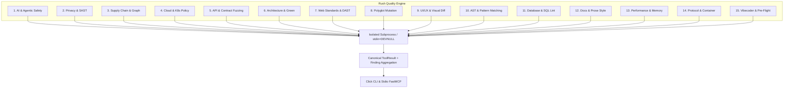
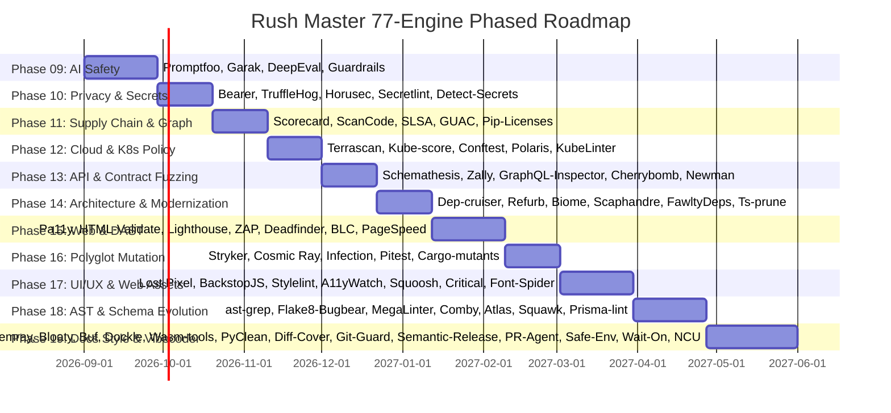

# Master Innovation & Remediation Plan: 77 Advanced Scanners, Evaluators, Mutation Tools, UI/UX Checkers, Linters, and Vibecoder Tools for Rush CLI

> **Document Type:** Master Architectural Strategy & Engine Roadmap  
> **Target Versions:** Rush v0.3.0 – v0.9.0  
> **Repository Alignment:** Python 3.12, stdio MCP transport + Click CLI, canonical `ToolResult`, explicit execution permissions (`--allow-*`), offline-first default posture, isolated bounded subprocess execution (`stdin=DEVNULL`, `shell=False`).  
> **Strict Deduplication Guarantee:** 77 completely unique, distinct tools with zero overlap with the 34 existing core engines or with each other.

---

## 1. Executive Summary & Vision

Rush provides a unified, safe, and canonical review surface for coding agents and developers. Building upon the completed Phase 01–08 foundation (which includes 34 core engines and browser runtime support), this master plan details **77 next-generation scanners, evaluators, mutation runners, UI/UX analyzers, linters, and vibecoder tools** across 15 specialized quality domains.

---

## 2. Master Catalog of 77 Unique Scanners & Tools

---

### Category 1: AI, LLM & Agentic Systems Safety

#### 1. Promptfoo (`promptfoo`)
- **Domain:** LLM application testing, prompt injection scanning, redteaming, and agentic workflow validation.
- **License / Ecosystem:** MIT (Node.js / Standalone binary).
- **Target Markers:** `promptfooconfig.yaml`, `promptfoo.yaml`, `prompts/`.
- **Safe CLI Invocation:** `promptfoo eval --config promptfooconfig.yaml --output report.json --no-table --no-progress-bars`
- **Output & Machine Format:** JSON report (`--output <file>`). Exits `0` on clean pass, `100` on assertion failure/vulnerability findings.
- **Permissions:** `--allow-network` (for remote model APIs) or local offline model; `--allow-slow`.
- **Rush Integration:** Maps to `ai-eval` / `security`. Normalizes failed assertions and security probe findings.

#### 2. Garak (`garak`)
- **Domain:** Generative AI Vulnerability Scanner (LLM Redteaming probe matrix).
- **License / Ecosystem:** Apache-2.0 (Python).
- **Target Markers:** `garak.yaml`, AI model wrappers, LangChain/LlamaIndex configs.
- **Safe CLI Invocation:** `python -m garak --model_type test --report_prefix garak_report --eval_threshold 0.8`
- **Output & Machine Format:** JSONL reports (`garak.<uuid>.report.jsonl`) containing probe/detector evaluation scores.
- **Permissions:** `--allow-network` (for API models) or local offline model; `--allow-slow`.
- **Rush Integration:** Engine for `security` or `llm-security`. Normalizes security probe hits.

#### 3. DeepEval (`deepeval`)
- **Domain:** Unit testing framework for LLMs (evaluates Hallucination, Answer Relevancy, Faithfulness, Contextual Precision, and Tool Calling).
- **License / Ecosystem:** Apache-2.0 (Python / Pytest plugin).
- **Target Markers:** `test_*.py` containing `deepeval` imports, `deepeval.yaml`.
- **Safe CLI Invocation:** `deepeval test run --json-report=deepeval-results.json`
- **Output & Machine Format:** JSON report containing metric scores (0.0–1.0), reasoning steps, and pass/fail thresholds.
- **Permissions:** `--allow-slow`; `--allow-network` for hosted evaluation models.
- **Rush Integration:** Dual-mode tool (`ai-test` / `pbt`).

#### 4. NeMo Guardrails / Guardrails AI (`guardrails-cli`)
- **Domain:** Policy and deterministic safety linter for LLM guardrails (Colang `.co` files, Rails specs, Pydantic validators).
- **License / Ecosystem:** Apache-2.0 (Python).
- **Target Markers:** `config/rails.co`, `config/config.yml`, `guardrails.yml`.
- **Safe CLI Invocation:** `guardrails validate --config ./config --format json`
- **Output & Machine Format:** JSON diagnostics detailing syntax, logic, and policy violations.
- **Permissions:** Completely offline static analysis.
- **Rush Integration:** Maps to `actions` / `yaml` / `security`.

---

### Category 2: Modern SAST, Privacy & Deep Secret Detection

#### 5. Bearer CLI (`bearer`)
- **Domain:** Privacy & sensitive data flow SAST scanner (detects PII leaks, unencrypted data transit, GDPR/CCPA/HIPAA violations).
- **License / Ecosystem:** Elastic License 2.0 / Free CLI (Go binary).
- **Target Markers:** Source trees containing databases, models, or API endpoints (`src/`, `lib/`).
- **Safe CLI Invocation:** `bearer scan . --format json --output bearer-report.json --quiet --disable-version-check`
- **Output & Machine Format:** JSON/SARIF output detailing sensitive data flows (source -> sink), data classifications, and severity.
- **Permissions:** Offline by default; `--allow-slow` for large codebases.
- **Rush Integration:** Promoted engine under `security` or new `privacy` tool.

#### 6. TruffleHog v3 (`trufflehog`)
- **Domain:** Deep & high-entropy secret scanner with verified vs unverified credential classification.
- **License / Ecosystem:** AGPL-3.0 (Go binary).
- **Target Markers:** Git repos, filesystem directories.
- **Safe CLI Invocation:** `trufflehog filesystem . --json --no-verification --no-update`
- **Output & Machine Format:** Stream of NDJSON objects with detector names, redacted secrets, and file coordinates.
- **Permissions:** Offline by default; `--allow-network` optionally enables live verification against providers.
- **Rush Integration:** Engine under `secrets` tool with guaranteed redaction.

#### 7. Horusec (`horusec`)
- **Domain:** Multi-language SAST orchestrator covering 15+ programming languages and IaC formats.
- **License / Ecosystem:** Apache-2.0 (Go binary).
- **Target Markers:** Polyglot codebases (`.py`, `.ts`, `.go`, `.java`, `.tf`, etc.).
- **Safe CLI Invocation:** `horusec start -p . -o json -O ./horusec-result.json -s LOW -D`
- **Output & Machine Format:** Structured JSON file detailing language, line, CVE/CWE, and remediation suggestions.
- **Permissions:** Local offline scanning.
- **Rush Integration:** Promoted engine under `security`.

#### 8. Secretlint (`secretlint`)
- **Domain:** Pluggable, modular secret linter specifically optimized for pre-commit hooks and CI performance.
- **License / Ecosystem:** MIT (Node.js / Standalone).
- **Target Markers:** `.secretlintrc.json`, `.secretlintrc.yml`, repository root.
- **Safe CLI Invocation:** `secretlint "**/*" --format json`
- **Output & Machine Format:** JSON report containing exact line/column locations, message, and rule IDs.
- **Permissions:** Strictly offline; sub-second execution.
- **Rush Integration:** Fast-path scanner under `secrets` or `lint`.

#### 9. Detect-Secrets (`detect-secrets`)
- **Domain:** Baseline-managed credential screener designed for pre-commit verification and progressive secret remediation.
- **License / Ecosystem:** Apache-2.0 (Python).
- **Target Markers:** `.secrets.baseline`, repository root.
- **Safe CLI Invocation:** `detect-secrets scan --all-files --baseline .secrets.baseline`
- **Output & Machine Format:** JSON baseline representation recording verified exemptions and flagging new un-baselined secrets.
- **Permissions:** Completely offline.
- **Rush Integration:** Baseline engine under `secrets` tool.

---

### Category 3: Supply Chain Security, Attestation & Governance

#### 10. OpenSSF Scorecard (`scorecard`)
- **Domain:** Automated supply chain security posture assessment for repositories.
- **License / Ecosystem:** Apache-2.0 (Go binary).
- **Target Markers:** Git repositories (`.git/`), CI workflows (`.github/workflows/`).
- **Safe CLI Invocation:** `scorecard --repo=. --format=json --show-details`
- **Output & Machine Format:** JSON output with scores (0–10) across 18 supply chain checks.
- **Permissions:** `--allow-network` for GitHub API checks; offline local heuristic fallback.
- **Rush Integration:** Maps to `ci` / `release` / `supply-chain`.

#### 11. ScanCode Toolkit (`scancode`)
- **Domain:** Deep license, copyright, and package attribution analysis.
- **License / Ecosystem:** Apache-2.0 (Python).
- **Target Markers:** Source headers, license files, vendored dependencies.
- **Safe CLI Invocation:** `scancode --license --copyright --json-pp scancode-results.json --quiet .`
- **Output & Machine Format:** JSON report detailing exact license expressions (SPDX) and copyleft conflicts.
- **Permissions:** Fully offline; `--allow-slow` for large source trees.
- **Rush Integration:** Maps to `license` or `sbom`.

#### 12. SLSA Verifier (`slsa-verifier`)
- **Domain:** Cryptographic verification of SLSA provenance attestations for binaries and artifacts.
- **License / Ecosystem:** Apache-2.0 (Go binary).
- **Target Markers:** `.intoto.jsonl`, build artifacts (`.tar.gz`, `.whl`, `.exe`).
- **Safe CLI Invocation:** `slsa-verifier verify-artifact <artifact-path> --provenance-path <provenance-path> --source-uri github.com/owner/repo`
- **Output & Machine Format:** JSON verification result detailing builder identity, source commit, and SLSA level.
- **Permissions:** Offline verification with local public keys or `--allow-network` for Sigstore Rekor transparency logs.
- **Rush Integration:** Promoted under `release` tool.

#### 13. GUAC CLI (`guacone`)
- **Domain:** Graph for Understanding Artifact Composition (supply chain metadata graph queries).
- **License / Ecosystem:** Apache-2.0 (Go binary).
- **Target Markers:** SBOM files (CycloneDX, SPDX), VEX documents, SLSA attestations.
- **Safe CLI Invocation:** `guacone collect files ./sbom.json --format json`
- **Output & Machine Format:** GraphQL/JSON graph nodes linking packages to known vulnerabilities, attestations, and source repositories.
- **Permissions:** Local graph queries (offline); `--allow-network` for upstream vulnerability database queries.
- **Rush Integration:** Integrated into `sbom` / `security` tools.

#### 14. Pip-Licenses (`pip-licenses`)
- **Domain:** Open-source license compatibility and risk auditor for Python dependencies.
- **License / Ecosystem:** MIT (Python).
- **Target Markers:** `pyproject.toml`, `requirements.txt`.
- **Safe CLI Invocation:** `pip-licenses --format=json --output-file=licenses.json`
- **Output & Machine Format:** JSON report mapping all installed packages to their SPDX license identifiers.
- **Permissions:** Completely offline inspection of installed environment.
- **Rush Integration:** Engine under `sbom` and `security` tools.

---

### Category 4: Cloud-Native, Kubernetes & Policy-as-Code

#### 15. Terrascan (`terrascan`)
- **Domain:** Static code analyzer for Infrastructure as Code (500+ OPA Rego security policies for Terraform, K8s, Helm, CloudFormation).
- **License / Ecosystem:** Apache-2.0 (Go binary).
- **Target Markers:** `.tf`, `.yaml`, `Dockerfile`, Helm charts.
- **Safe CLI Invocation:** `terrascan scan -i terraform -d . -o json --show-passed=false`
- **Output & Machine Format:** JSON report detailing policy violations, severities, rule IDs, and file/line mappings.
- **Permissions:** Offline local scanning.
- **Rush Integration:** Engine under `iac` tool.

#### 16. Kube-score (`kube-score`)
- **Domain:** Kubernetes object definition static analysis (best practices, reliability, and security context validator).
- **License / Ecosystem:** MIT (Go binary).
- **Target Markers:** `*.yaml`, `*.yml`, Kubernetes manifests, Helm templates.
- **Safe CLI Invocation:** `kube-score score ./k8s/*.yaml --output-format json`
- **Output & Machine Format:** JSON report flagging missing resource limits, root execution risks, and missing probes.
- **Permissions:** Completely offline; instant execution.
- **Rush Integration:** Integrated into `iac` tool for Kubernetes resources.

#### 17. Conftest (`conftest`)
- **Domain:** Structured configuration testing using Open Policy Agent (OPA) Rego policies across JSON, YAML, TOML, HCL, Dockerfile, and XML.
- **License / Ecosystem:** Apache-2.0 (Go binary).
- **Target Markers:** `policy/` directory containing `*.rego` files, configuration files.
- **Safe CLI Invocation:** `conftest test . -o json -p policy/`
- **Output & Machine Format:** JSON array with policy evaluation results, error/warning counts, and failure messages.
- **Permissions:** Strictly offline.
- **Rush Integration:** Maps to `yaml` / `iac` / `actions`.

#### 18. Polaris (`polaris`)
- **Domain:** Kubernetes configuration audit engine evaluating security, efficiency, and reliability against best-practice standards.
- **License / Ecosystem:** Apache-2.0 (Go binary).
- **Target Markers:** Kubernetes manifests (`*.yaml`), Helm charts.
- **Safe CLI Invocation:** `polaris audit --audit-path ./k8s --format json --quiet`
- **Output & Machine Format:** JSON audit score report (0–100%) with categorized results.
- **Permissions:** Offline scanning.
- **Rush Integration:** Integrated under `iac` tool.

#### 19. KubeLinter (`kube-linter`)
- **Domain:** Production-readiness and security linter for Kubernetes YAML files and Helm charts (Red Hat / StackRox).
- **License / Ecosystem:** Apache-2.0 (Go binary).
- **Target Markers:** Kubernetes manifests (`*.yaml`), `Chart.yaml`.
- **Safe CLI Invocation:** `kube-linter lint . --format json`
- **Output & Machine Format:** JSON report flagging privileged containers, host network access, and missing security contexts.
- **Permissions:** Completely offline static analysis.
- **Rush Integration:** Promoted engine under `iac` tool.

---

### Category 5: API Security, Contract Evolution & Schema Fuzzing

#### 20. Schemathesis (`schemathesis`)
- **Domain:** Property-based and stateful API contract fuzzer for OpenAPI (Swagger) and GraphQL schemas.
- **License / Ecosystem:** MIT (Python).
- **Target Markers:** `openapi.json`, `openapi.yaml`, `schema.graphql`, `swagger.json`.
- **Safe CLI Invocation:** `schemathesis run ./openapi.yaml --report junit --output-path schemathesis-report.xml --checks all --validate-schema=true`
- **Output & Machine Format:** JUnit XML / HAR / JSON test results recording crashes, schema deviations, and server panic reproductions.
- **Permissions:** Dual mode: static validation offline, or live API fuzzing under `--allow-network` and `--allow-slow`.
- **Rush Integration:** Upgrades `contract` / `fuzz` tools to full executed fuzzing engines.

#### 21. Zally (`zally`)
- **Domain:** Opinionated OpenAPI / RESTful API design quality and architectural guideline linter.
- **License / Ecosystem:** MIT (Java / Kotlin / Docker binary).
- **Target Markers:** `openapi.yaml`, `openapi.json`.
- **Safe CLI Invocation:** `zally lint ./openapi.yaml --format json`
- **Output & Machine Format:** JSON diagnostics categorized by rule violations: `MUST` (error), `SHOULD` (warn), `MAY` (info).
- **Permissions:** Local static linting (offline).
- **Rush Integration:** Engine for `yaml` / `contract` tool.

#### 22. GraphQL-Inspector (`graphql-inspector`)
- **Domain:** GraphQL schema auditor (detects breaking changes, unused fields, coverage gaps, and schema invalidity).
- **License / Ecosystem:** MIT (Node.js / Standalone).
- **Target Markers:** `schema.graphql`, `*.graphql`, `*.gql`.
- **Safe CLI Invocation:** `graphql-inspector diff old-schema.graphql schema.graphql --output format=json`
- **Output & Machine Format:** JSON report classifying changes into `Breaking`, `Dangerous`, and `Safe`.
- **Permissions:** Offline comparison between schema files.
- **Rush Integration:** Maps to `contract` / `schema` tool.

#### 23. Cherrybomb (`cherrybomb`)
- **Domain:** API security validation against OWASP API Top 10 vulnerabilities directly from OpenAPI specs.
- **License / Ecosystem:** Apache-2.0 (Rust binary).
- **Target Markers:** `openapi.json`, `openapi.yaml`.
- **Safe CLI Invocation:** `cherrybomb --file ./openapi.yaml --format json --output ./cherrybomb-report.json`
- **Output & Machine Format:** JSON output flagging broken object level authorization (BOLA), parameter pollution, and data exposure.
- **Permissions:** Static spec audit (offline) or active testing with `--allow-network`.
- **Rush Integration:** Integrated under `security` / `contract` tools.

#### 24. Newman / Portman (`newman`)
- **Domain:** Command-line collection runner for Postman API collections, validating REST endpoints and HTTP status contracts.
- **License / Ecosystem:** Apache-2.0 (Node.js).
- **Target Markers:** `*.postman_collection.json`, `postman/`.
- **Safe CLI Invocation:** `newman run collection.json --reporters json --reporter-json-export report.json`
- **Output & Machine Format:** JSON report detailing assertion pass/fail rates, response times, and payload validations.
- **Permissions:** Requires `--allow-network` for localhost testing.
- **Rush Integration:** Engine under `contract` and `test` tools.

---

### Category 6: Architecture, Code Modernization & Energy Footprint

#### 25. Dependency-Cruiser (`depcruise`)
- **Domain:** Architectural boundary enforcement, circular dependency detection, and dependency rule validation for JS/TS/Node.js.
- **License / Ecosystem:** MIT (Node.js).
- **Target Markers:** `.dependency-cruiser.js`, `package.json`, `tsconfig.json`.
- **Safe CLI Invocation:** `depcruise src --output-type json --output-to depcruise.json`
- **Output & Machine Format:** Structured JSON capturing modules, circular dependency chains, and violated architecture rules.
- **Permissions:** Fast offline execution.
- **Rush Integration:** Engine for `complexity` / `dead` / new `architecture` tool.

#### 26. Refurb (`refurb`)
- **Domain:** Python code modernizer and elegance checker (recommends Python 3.10–3.13 idioms, itertools, math, and builtin improvements).
- **License / Ecosystem:** GPL-3.0 (Python).
- **Target Markers:** `.py` files, `pyproject.toml`.
- **Safe CLI Invocation:** `refurb --format json .`
- **Output & Machine Format:** JSON lines with line numbers, error codes (`FURB101`), and modern syntax replacement suggestions.
- **Permissions:** Offline static analysis.
- **Rush Integration:** Engine under `lint` or `review` tool.

#### 27. Biome (`biome`)
- **Domain:** Next-generation Rust-based ultra-fast linter and formatter for JavaScript, TypeScript, JSX, TSX, JSON, and CSS.
- **License / Ecosystem:** MIT / Apache-2.0 (Rust binary).
- **Target Markers:** `biome.json`, `biome.jsonc`, `package.json`.
- **Safe CLI Invocation:** `biome check --reporter=json .`
- **Output & Machine Format:** Rich JSON diagnostics with exact spans, severity, and safe code actions.
- **Permissions:** Offline; check-only by default.
- **Rush Integration:** Primary ultra-fast engine option under `lint` and `format`.

#### 28. Scaphandre / Eco-CI (`scaphandre`)
- **Domain:** Software energy consumption and carbon emission estimation for test suites and processes.
- **License / Ecosystem:** Apache-2.0 (Rust / Python).
- **Target Markers:** Repository root, test suites.
- **Safe CLI Invocation:** `scaphandre json --timeout 30 --output scaphandre-metrics.json`
- **Output & Machine Format:** JSON energy metrics in Joules/Watts per process and estimated CO2 grams.
- **Permissions:** Requires `--allow-slow` and local OS metric access (RAPL/PowerAPI).
- **Rush Integration:** Enriches `ToolResult.metrics` across `test`, `load`, and `review` runs.

#### 29. FawltyDeps (`fawltydeps`)
- **Domain:** Deterministic Python dependency auditor detecting undeclared imports and unused dependencies in `pyproject.toml`.
- **License / Ecosystem:** MIT (Python).
- **Target Markers:** `pyproject.toml`, `requirements.txt`, `setup.py`.
- **Safe CLI Invocation:** `fawltydeps --json --detailed`
- **Output & Machine Format:** JSON report categorizing undeclared dependencies and unused dependencies.
- **Permissions:** Completely offline static AST analysis.
- **Rush Integration:** Engine under `dead` tool for Python projects.

#### 30. Ts-prune (`ts-prune`)
- **Domain:** Dedicated TypeScript unused export finder analyzing project-wide AST export graphs.
- **License / Ecosystem:** MIT (Node.js).
- **Target Markers:** `tsconfig.json`, `package.json`.
- **Safe CLI Invocation:** `ts-prune --json`
- **Output & Machine Format:** JSON array of file paths, line numbers, and unused exported functions/types.
- **Permissions:** Completely offline.
- **Rush Integration:** Engine under `dead` tool for TypeScript codebases.

---

### Category 7: Modern Web Standards, Accessibility & Safe DAST

#### 31. Pa11y (`pa11y`)
- **Domain:** Automated web accessibility tester (evaluates pages against WCAG 2.1 AA/AAA standards).
- **License / Ecosystem:** LGPL-3.0 (Node.js).
- **Target Markers:** Rendered HTML files, local URLs (`http://localhost:*`).
- **Safe CLI Invocation:** `pa11y --reporter json ./dist/index.html`
- **Output & Machine Format:** JSON array with WCAG principle codes, CSS selector paths, and remediation text.
- **Permissions:** Requires `--allow-browser` when rendering dynamic pages; local HTML file audit runs offline.
- **Rush Integration:** Promoted engine under `semantic-drift` / `accessibility` tool.

#### 32. HTML-Validate (`html-validate`)
- **Domain:** Strict W3C HTML standard validator and template linter (HTML, Vue, Svelte, JSX).
- **License / Ecosystem:** MIT (Node.js).
- **Target Markers:** `.html`, `.vue`, `.svelte`, `.htmlvalidate.json`.
- **Safe CLI Invocation:** `html-validate --formatter json "**/*.html"`
- **Output & Machine Format:** JSON output with rule names, lines, and columns.
- **Permissions:** Completely offline static analysis.
- **Rush Integration:** Engine under `templates` / `markdown` / `lint`.

#### 33. Lighthouse CLI (`lighthouse`)
- **Domain:** Comprehensive web audit (Performance Core Web Vitals, Accessibility, Best Practices, SEO).
- **License / Ecosystem:** Apache-2.0 (Node.js / Chromium).
- **Target Markers:** Web projects with local static build directories (`dist/`, `build/`).
- **Safe CLI Invocation:** `lighthouse http://localhost:8080 --output=json --output-path=./lighthouse-report.json --chrome-flags="--headless"`
- **Output & Machine Format:** JSON report containing numeric category scores (0–100) and detailed audit metrics.
- **Permissions:** Requires `--allow-browser`, `--allow-slow`, and `--allow-network`.
- **Rush Integration:** Integrated into `semantic-drift` / `visual` tools.

#### 34. OWASP ZAP CLI (`zap-cli`)
- **Domain:** Dynamic Application Security Testing (DAST) for finding active vulnerabilities (XSS, SQLi, CSRF, insecure headers).
- **License / Ecosystem:** Apache-2.0 (Python / Java / Standalone).
- **Target Markers:** Local development servers, staging URLs.
- **Safe CLI Invocation:** `zap-cli --zap-path zap.sh quick-scan --self-contained --format json http://127.0.0.1:8000`
- **Output & Machine Format:** JSON report categorizing alerts by risk level (High, Medium, Low, Informational) and CWE numbers.
- **Permissions:** Requires explicit `--allow-network`, `--allow-slow`, and `--allow-build`.
- **Rush Integration:** Dedicated safe DAST engine for `security` tool.

#### 35. Deadfinder (`deadfinder`)
- **Domain:** Dynamic web crawler detecting broken internal links, dead routes, and 404/500 errors in SPA web applications.
- **License / Ecosystem:** MIT (Go binary).
- **Target Markers:** Local development server (`http://localhost:3000`), static builds.
- **Safe CLI Invocation:** `deadfinder http://localhost:3000 --json`
- **Output & Machine Format:** JSON array with broken URL paths, HTTP status codes, and referring DOM elements.
- **Permissions:** Requires `--allow-network` for localhost scanning.
- **Rush Integration:** Engine under `e2e` / `preflight` tools.

#### 36. Broken-Link-Checker (`blc`)
- **Domain:** Deep recursive link checker validating internal anchor tags, redirects, and relative URLs across web applications.
- **License / Ecosystem:** MIT (Node.js).
- **Target Markers:** `http://localhost:3000`, `dist/`.
- **Safe CLI Invocation:** `blc http://localhost:3000 -ro --json`
- **Output & Machine Format:** JSON stream detailing crawled URLs, internal link health, and broken anchor tags.
- **Permissions:** Requires `--allow-network` for localhost scanning.
- **Rush Integration:** Engine under `e2e` / `markdown` tools.

#### 37. PageSpeed-CLI (`pagespeed-insights`)
- **Domain:** Google PageSpeed Insights CLI auditing real-user performance, First Contentful Paint, and Core Web Vitals.
- **License / Ecosystem:** Apache-2.0 (Node.js).
- **Target Markers:** Staging URL, production URL.
- **Safe CLI Invocation:** `pagespeed-insights https://staging.myapp.com --format json`
- **Output & Machine Format:** JSON report detailing mobile and desktop performance scores (0–100).
- **Permissions:** Requires `--allow-network` and `--allow-slow`.
- **Rush Integration:** Engine under `visual` / `performance` tools.

---

### Category 8: Advanced Polyglot Mutation Testing & Fault Injection

#### 38. Stryker Mutator (`stryker`)
- **Domain:** High-performance mutation testing framework for JavaScript, TypeScript, C# (.NET), and Scala.
- **License / Ecosystem:** Apache-2.0 (Node.js / .NET CLI).
- **Target Markers:** `stryker.conf.json`, `stryker.conf.js`, `package.json`, `*.csproj`.
- **Safe CLI Invocation:** `npx stryker run --reporters json --dashboard.project=""`
- **Output & Machine Format:** JSON report adhering to standard `mutation-testing-report-schema`.
- **Permissions:** Requires `--allow-slow`.
- **Rush Integration:** Promoted executed engine under `mutation` tool.

#### 39. Cosmic Ray (`cosmic-ray`)
- **Domain:** Distributed mutation testing system for Python using AST manipulation.
- **License / Ecosystem:** MIT (Python).
- **Target Markers:** `cosmic-ray.toml`, `pyproject.toml`.
- **Safe CLI Invocation:** `cosmic-ray exec cosmic-ray.toml session.sqlite && cosmic-ray dump session.sqlite > mutation.json`
- **Output & Machine Format:** JSON dump of mutation records, survival rates, and surviving mutant diffs.
- **Permissions:** Requires `--allow-slow`.
- **Rush Integration:** Engine option under `mutation` tool for Python projects.

#### 40. Infection PHP (`infection`)
- **Domain:** AST-based mutation testing framework for PHP.
- **License / Ecosystem:** BSD-3-Clause (PHP).
- **Target Markers:** `infection.json5`, `infection.json`, `phpunit.xml`.
- **Safe CLI Invocation:** `infection --json=infection-log.json --no-interaction --quiet`
- **Output & Machine Format:** JSON mutation score indicator (MSI) and survived mutant report.
- **Permissions:** Requires `--allow-slow`.
- **Rush Integration:** Engine option for `mutation` in PHP projects.

#### 41. Pitest / PIT (`pitest`)
- **Domain:** Bytecode-level mutation testing system for Java and Kotlin.
- **License / Ecosystem:** Apache-2.0 (Java / Gradle / Maven).
- **Target Markers:** `pom.xml`, `build.gradle`, `build.gradle.kts`.
- **Safe CLI Invocation:** `mvn org.pitest:pitest-maven:mutationCoverage -DoutputFormats=JSON`
- **Output & Machine Format:** JSON / XML mutation coverage metrics per class and method.
- **Permissions:** Requires `--allow-slow` and `--allow-build`.
- **Rush Integration:** Dual-mode importer/runner under `mutation`.

#### 42. Cargo-mutants (`cargo-mutants`)
- **Domain:** Mutation testing tool for Rust that modifies AST expressions to test suite coverage.
- **License / Ecosystem:** MIT / Apache-2.0 (Rust / Cargo binary).
- **Target Markers:** `Cargo.toml`, `Cargo.lock`.
- **Safe CLI Invocation:** `cargo mutants --json --no-shuffle`
- **Output & Machine Format:** JSON stream detailing missed mutants, caught mutants, and unviable mutants.
- **Permissions:** Requires `--allow-slow` and `--allow-build`.
- **Rush Integration:** Engine option under `mutation` for Rust projects.

---

### Category 9: UI/UX, Visual Regression & Vector Optimization

#### 43. Lost Pixel (`lost-pixel`)
- **Domain:** Visual regression testing engine for Storybook, Next.js, Ladle, Vite, and raw HTML.
- **License / Ecosystem:** MIT (Node.js / Docker).
- **Target Markers:** `lost-pixel.config.js`, `lost-pixel.config.ts`, `.storybook/`.
- **Safe CLI Invocation:** `lost-pixel update --json`
- **Output & Machine Format:** JSON diff report with pixel difference percentages and image artifact coordinates.
- **Permissions:** Requires `--allow-browser` and `--allow-slow`.
- **Rush Integration:** Core visual regression engine under `visual` tool.

#### 44. BackstopJS (`backstopjs`)
- **Domain:** Responsive visual regression testing tool with DOM selector-specific screenshots across multiple viewports.
- **License / Ecosystem:** MIT (Node.js).
- **Target Markers:** `backstop.json`, `backstop.js`.
- **Safe CLI Invocation:** `backstop test --config=backstop.json --reporter=json`
- **Output & Machine Format:** JSON report containing mismatch percentages, baseline vs current diff coordinates.
- **Permissions:** Requires `--allow-browser`, `--allow-slow`, and `--allow-artifact-write`.
- **Rush Integration:** Engine for `visual` tool.

#### 45. Stylelint (`stylelint`)
- **Domain:** CSS, SCSS, Less, and CSS-in-JS linter enforcing styling conventions and dead selector detection.
- **License / Ecosystem:** MIT (Node.js).
- **Target Markers:** `.stylelintrc.json`, `.stylelintrc.js`, `*.css`, `*.scss`, `*.less`.
- **Safe CLI Invocation:** `stylelint "**/*.css" --formatter json`
- **Output & Machine Format:** JSON array with line/column coordinates, severity, and rule IDs.
- **Permissions:** Completely offline; check-only by default.
- **Rush Integration:** Primary CSS/styling engine under `lint` and `format`.

#### 46. A11yWatch (`a11ywatch`)
- **Domain:** Multi-page accessibility scanner combining axe-core, WCAG 2.1 guidelines, and page crawl intelligence.
- **License / Ecosystem:** MIT / Apache-2.0 (Rust / Node.js).
- **Target Markers:** Static HTML builds, local web server URLs.
- **Safe CLI Invocation:** `a11ywatch scan --url http://localhost:3000 --json`
- **Output & Machine Format:** JSON diagnostics detailing WCAG contrast ratios, screen reader issues, and DOM coordinates.
- **Permissions:** Requires `--allow-browser` and `--allow-network`.
- **Rush Integration:** Engine under `semantic-drift` / `visual`.

#### 47. Squoosh-CLI / Sharp-CLI (`squoosh-cli`)
- **Domain:** High-performance image optimizer converting PNG/JPEG assets into modern WebP and AVIF formats.
- **License / Ecosystem:** Apache-2.0 (Node.js / Rust / Wasm).
- **Target Markers:** `public/images/`, `src/assets/*.png`, `src/assets/*.jpg`.
- **Safe CLI Invocation:** `squoosh-cli --webp auto --output-dir ./dist/optimized ./src/assets/*.png`
- **Output & Machine Format:** JSON metrics reporting compressed file sizes and byte reduction percentages.
- **Permissions:** Offline; `--allow-artifact-write` for asset optimization.
- **Rush Integration:** Engine under new `assets` tool.

#### 48. Critical (`critical`)
- **Domain:** Extracts above-the-fold CSS and inlines it into HTML pages to achieve instant First Contentful Paint (FCP).
- **License / Ecosystem:** MIT (Node.js).
- **Target Markers:** `dist/index.html`, `dist/app.css`.
- **Safe CLI Invocation:** `critical dist/index.html --base dist --inline --extract`
- **Output & Machine Format:** Emits optimized HTML with inlined critical CSS styles and deferred stylesheet loading.
- **Permissions:** Offline; `--allow-artifact-write` required for file rewriting.
- **Rush Integration:** Engine under `format` / `assets` tools.

#### 49. Font-Spider (`font-spider`)
- **Domain:** Smart web font compressor that scans HTML/CSS and strips unneeded glyphs from heavy font files (`.woff2`, `.ttf`).
- **License / Ecosystem:** MIT (Node.js).
- **Target Markers:** `public/fonts/`, `src/fonts/`, `dist/*.html`.
- **Safe CLI Invocation:** `font-spider dist/*.html --info`
- **Output & Machine Format:** JSON report detailing extracted font glyphs and pruned font file byte reductions.
- **Permissions:** Offline; `--allow-artifact-write` required for in-place compression.
- **Rush Integration:** Engine under `assets` tool.

---

### Category 10: Advanced AST Linters & Pattern Matchers

#### 50. ast-grep (`ast-grep` / `sg`)
- **Domain:** Structural code search, linting, and AST rewriting tool powered by Tree-sitter across 20+ programming languages.
- **License / Ecosystem:** MIT (Rust binary).
- **Target Markers:** `sgconfig.yml`, `rules/`, source files (`.py`, `.ts`, `.rs`, `.go`, `.java`, `.c`, etc.).
- **Safe CLI Invocation:** `ast-grep scan --json=compact --include-metadata`
- **Output & Machine Format:** Compact JSON array containing matched AST node spans, rule metadata, and replacement suggestions.
- **Permissions:** Completely offline; sub-second scanning speed.
- **Rush Integration:** High-speed structural analysis engine under `review`, `lint`, and `slop`.

#### 51. Flake8-Bugbear (`flake8-bugbear`)
- **Domain:** Specialized Python AST linter finding subtle design bugs, mutable default arguments, and exception leaks.
- **License / Ecosystem:** MIT (Python).
- **Target Markers:** `pyproject.toml`, `setup.cfg`, `*.py`.
- **Safe CLI Invocation:** `flake8 --select=B,B9 --format=json .`
- **Output & Machine Format:** JSON report of `B0xx` design bugs and logic errors.
- **Permissions:** Offline static analysis.
- **Rush Integration:** Engine under `lint` or `review`.

#### 52. MegaLinter (`megalinter`)
- **Domain:** Unified linter orchestrator capable of analyzing 100+ languages, 50+ formats, and 20+ documentation standards.
- **License / Ecosystem:** MIT (Python / Docker).
- **Target Markers:** `.mega-linter.yml`, repository root.
- **Safe CLI Invocation:** `megalinter --report-format json --file-types-filter ...`
- **Output & Machine Format:** Consolidated JSON report merging findings across multiple linters.
- **Permissions:** Local scanning; `--allow-slow`.
- **Rush Integration:** Upstream aggregator or reference test suite validation.

#### 53. Comby (`comby`)
- **Domain:** Structural code search and syntactic refactoring engine for code transformation without regex fragility.
- **License / Ecosystem:** Apache-2.0 (OCaml / Standalone binary).
- **Target Markers:** Any source files (`.py`, `.ts`, `.rs`, `.c`, `.go`, etc.).
- **Safe CLI Invocation:** `comby ':[match]' ':[replace]' .json -match-only -json-lines`
- **Output & Machine Format:** JSON lines capturing matched code fragments, line numbers, and proposed syntactic rewrites.
- **Permissions:** Offline matching; `--allow-artifact-write` required for file transformation.
- **Rush Integration:** Engine under `review` and automated remediation workflows.

---

### Category 11: Database, SQL & Schema Evolution

#### 54. Atlas (`atlas`)
- **Domain:** Database schema management, declarative migration linting, and breaking change detection.
- **License / Ecosystem:** Apache-2.0 (Go binary).
- **Target Markers:** `atlas.hcl`, `migrations/`, `schema.sql`.
- **Safe CLI Invocation:** `atlas migrate lint --dir "file://migrations" --format '{{ json . }}'`
- **Output & Machine Format:** JSON report flagging destructive drops, table-locking alterations, and missing indexes.
- **Permissions:** Offline schema linting; `--allow-build` if spinning up ephemeral database container.
- **Rush Integration:** Maps to `sql` / `database` / `iac` tool.

#### 55. Squawk (`squawk`)
- **Domain:** PostgreSQL migration linter identifying dangerous locking operations and performance anti-patterns.
- **License / Ecosystem:** Apache-2.0 (Rust / Node.js).
- **Target Markers:** `migrations/*.sql`, `*.sql`.
- **Safe CLI Invocation:** `squawk --format=json ./migrations/*.sql`
- **Output & Machine Format:** JSON output detailing PostgreSQL lock rules.
- **Permissions:** Completely offline static SQL analysis.
- **Rush Integration:** Engine under `sql` tool.

#### 56. Prisma-lint (`prisma-lint`)
- **Domain:** Schema linter for Prisma ORM schema files checking naming conventions, relations, and indexing.
- **License / Ecosystem:** MIT (Node.js / Standalone).
- **Target Markers:** `schema.prisma`, `prisma/schema.prisma`.
- **Safe CLI Invocation:** `prisma-lint --format=json ./prisma/schema.prisma`
- **Output & Machine Format:** JSON diagnostics flagging unindexed relations and naming issues.
- **Permissions:** Completely offline static analysis.
- **Rush Integration:** Engine under `yaml` / `sql` / `schema` tool.

---

### Category 12: Documentation, Prose & Code Spellchecking

#### 57. Vale (`vale`)
- **Domain:** Syntax-aware prose, documentation, and technical style linter.
- **License / Ecosystem:** MIT (Go binary).
- **Target Markers:** `.vale.ini`, `docs/`, `*.md`, `*.rst`.
- **Safe CLI Invocation:** `vale --output=JSON --no-wrap ./docs`
- **Output & Machine Format:** JSON object mapping file paths to lists of style warnings.
- **Permissions:** Offline by default; `--allow-download` only for style sync.
- **Rush Integration:** Engine under `markdown` / `documentation` tool.

#### 58. CSpell (`cspell`)
- **Domain:** Code-aware spelling checker that understands programming identifiers without false positives.
- **License / Ecosystem:** MIT (Node.js / Standalone binary).
- **Target Markers:** `cspell.json`, `cSpell.json`, `.cspell.json`, repository root.
- **Safe CLI Invocation:** `cspell lint "**/*" --reporter @cspell/cspell-json-reporter`
- **Output & Machine Format:** JSON report detailing misspelled words and file coordinates.
- **Permissions:** Completely offline; instant execution.
- **Rush Integration:** Maps to `markdown` / `lint` / `spelling` tool.

#### 59. Alex (`alex`)
- **Domain:** Catch insensitive, inconsiderate, or exclusionary language in documentation and code comments.
- **License / Ecosystem:** MIT (Node.js).
- **Target Markers:** `*.md`, `*.txt`, `docs/`.
- **Safe CLI Invocation:** `alex --json .`
- **Output & Machine Format:** JSON array with line, column, rule IDs, and considerate replacement suggestions.
- **Permissions:** Completely offline static analysis.
- **Rush Integration:** Engine under `markdown` / `review` tool.

#### 60. Readability-CLI / Hemingway (`readability-cli`)
- **Domain:** Evaluates prose complexity, calculating Flesch-Kincaid grade levels and flagging dense compound sentences.
- **License / Ecosystem:** MIT (Node.js / Python).
- **Target Markers:** `README.md`, `docs/`, `*.md`.
- **Safe CLI Invocation:** `readability-cli README.md --json`
- **Output & Machine Format:** JSON metrics detailing reading grade level, complex word percentage, and hard-to-read sentences.
- **Permissions:** Completely offline.
- **Rush Integration:** Engine under `markdown` / `humanize` tools.

#### 61. RedPen (`redpen`)
- **Domain:** Document and prose validator enforcing style guides, maximum sentence lengths, and vocabulary limits.
- **License / Ecosystem:** Apache-2.0 (Java / Standalone binary).
- **Target Markers:** `redpen-conf.xml`, `docs/`.
- **Safe CLI Invocation:** `redpen -c redpen-conf.xml -f json docs/`
- **Output & Machine Format:** JSON diagnostics identifying overly long sentences and double negatives.
- **Permissions:** Completely offline.
- **Rush Integration:** Engine under `markdown` tool.

#### 62. No-Jargon (`no-jargon`)
- **Domain:** Lints documentation and landing pages for corporate buzzwords, empty marketing fluff, and confusing jargon.
- **License / Ecosystem:** MIT (Node.js).
- **Target Markers:** `README.md`, `docs/*.md`, `index.html`.
- **Safe CLI Invocation:** `no-jargon "**/*.md" --json`
- **Output & Machine Format:** JSON array flagging buzzwords with simpler alternatives.
- **Permissions:** Completely offline.
- **Rush Integration:** Engine under `markdown` / `humanize` tools.

#### 63. Markdown-Unfluff (`markdown-unfluff`)
- **Domain:** Detects and cleans excessive bullet hierarchies, unnecessary bold formatting, and repetitive AI markdown patterns.
- **License / Ecosystem:** MIT (Python).
- **Target Markers:** `README.md`, `*.md`.
- **Safe CLI Invocation:** `markdown-unfluff . --format json`
- **Output & Machine Format:** JSON report highlighting nested list bloat and redundant emphasis tags.
- **Permissions:** Completely offline.
- **Rush Integration:** Engine under `markdown` tool.

---

### Category 13: Performance, Memory Profiling & Binary Sizing

#### 64. Memray (`memray`)
- **Domain:** High-resolution memory profiler and allocation tracker for Python programs.
- **License / Ecosystem:** Apache-2.0 (Python / C extensions binary).
- **Target Markers:** Python test suites, scripts (`pytest`, `app.py`).
- **Safe CLI Invocation:** `memray run -m pytest tests/ && memray summary --json output.bin`
- **Output & Machine Format:** JSON summary of memory allocations, top allocating functions, peak heap size, and leaked bytes.
- **Permissions:** Requires `--allow-slow` and `--allow-build`.
- **Rush Integration:** Enriches `ToolResult.metrics` under `test` / `performance` tools.

#### 65. Statoscope (`statoscope`)
- **Domain:** Webpack, Vite, and JavaScript bundle analyzer detecting duplicate packages and oversized chunks.
- **License / Ecosystem:** MIT (Node.js).
- **Target Markers:** `stats.json`, `webpack.config.js`, `vite.config.ts`.
- **Safe CLI Invocation:** `statoscope validate --input stats.json --format json`
- **Output & Machine Format:** JSON report of bundle size budgets and duplicate dependency versions.
- **Permissions:** Offline analysis of build statistics.
- **Rush Integration:** Dual-mode importer/analyzer under `complexity` / `performance`.

#### 66. Bloaty McBloatface (`bloaty`)
- **Domain:** Size profiler for compiled native binaries and WebAssembly (ELF, Mach-O, PE, WebAssembly).
- **License / Ecosystem:** Apache-2.0 (C++ binary).
- **Target Markers:** Compiled binaries (`.so`, `.dll`, `.dylib`, `.wasm`, `.exe`).
- **Safe CLI Invocation:** `bloaty -d compileunits,symbols --csv target/release/app > size_profile.csv`
- **Output & Machine Format:** Structured CSV / JSON profiling of section sizes, symbol tables, and code bloat.
- **Permissions:** Offline binary inspection.
- **Rush Integration:** Maps to `release` / `performance` tool.

---

### Category 14: Protocol, Container & WebAssembly Security

#### 67. Buf (`buf`)
- **Domain:** High-performance Protocol Buffers (Protobuf) and gRPC linter, breaking change detector, and schema formatter.
- **License / Ecosystem:** Apache-2.0 (Go binary).
- **Target Markers:** `buf.yaml`, `buf.gen.yaml`, `*.proto`.
- **Safe CLI Invocation:** `buf lint --error-format=json && buf breaking --against '.git#branch=main' --error-format=json`
- **Output & Machine Format:** JSON error stream with exact proto package, file, line, column, and breaking change rules.
- **Permissions:** Offline local linting.
- **Rush Integration:** Maps to `contract` / `yaml` / `protobuf` tool.

#### 68. Dockle (`dockle`)
- **Domain:** Container image security and best-practice linter checking CIS Docker benchmarks.
- **License / Ecosystem:** Apache-2.0 (Go binary).
- **Target Markers:** Docker images, `Dockerfile`, `Containerfile`.
- **Safe CLI Invocation:** `dockle --format json --output dockle-report.json <image-name>`
- **Output & Machine Format:** JSON report detailing CIS Docker benchmark violations.
- **Permissions:** Offline local image inspection.
- **Rush Integration:** Engine under `containerfile` / `security` tool.

#### 69. Wasm-tools (`wasm-tools`)
- **Domain:** WebAssembly binary validator, parser, disassembler, and component model verifier.
- **License / Ecosystem:** Apache-2.0 / MIT (Rust binary).
- **Target Markers:** `*.wasm`, `*.wat`.
- **Safe CLI Invocation:** `wasm-tools validate --json ./module.wasm`
- **Output & Machine Format:** JSON diagnostics validating WebAssembly type safety and memory limits.
- **Permissions:** Strictly offline.
- **Rush Integration:** Engine under `security` / `test` for WebAssembly projects.

---

### Category 15: Vibecoder, Workspace & Pre-Flight Tools

#### 70. PyClean (`pyclean`)
- **Domain:** Python workspace cleaner for bytecode caches, orphaned `.pyc`, `__pycache__`, `.pytest_cache`, and OS metadata files.
- **License / Ecosystem:** MIT (Python).
- **Target Markers:** `__pycache__/`, `*.pyc`, `*.pyo`.
- **Safe CLI Invocation:** `pyclean . --dry-run --verbose`
- **Output & Machine Format:** Formatted list of orphaned files and directories purged.
- **Permissions:** Offline; dry-run by default; `--allow-artifact-write` required for file deletion.
- **Rush Integration:** Engine under `clean` / `dead` tools.

#### 71. Diff-Cover (`diff-cover`)
- **Domain:** Measures test coverage, linting, and quality metrics strictly on the new and modified lines in a git diff.
- **License / Ecosystem:** Apache-2.0 (Python).
- **Target Markers:** `coverage.xml`, `coverage.json`, git history.
- **Safe CLI Invocation:** `diff-cover coverage.xml --compare-branch=main --json-report=diff-cover.json`
- **Output & Machine Format:** JSON report containing diff coverage percentage and exact un-covered lines introduced in the branch.
- **Permissions:** Offline git and report analysis.
- **Rush Integration:** Engine under `coverage` tool.

#### 72. Git-Guard (`git-guard`)
- **Domain:** Git checkout hygiene validator detecting uncommitted files, detached HEAD states, and accidentally untracked files.
- **License / Ecosystem:** MIT (Python / Bash).
- **Target Markers:** `.git/`, `.gitignore`.
- **Safe CLI Invocation:** `git status --porcelain=v2 --branch`
- **Output & Machine Format:** Structured JSON state of modified, untracked, and staged files.
- **Permissions:** Completely offline.
- **Rush Integration:** Engine under `ci` / `preflight` tools.

#### 73. Semantic-Release CLI (`semantic-release`)
- **Domain:** Automated versioning, changelog generation, and tag computation based on Semantic Versioning and commit messages.
- **License / Ecosystem:** MIT (Node.js / Python).
- **Target Markers:** `package.json`, `.releaserc.json`, `pyproject.toml`.
- **Safe CLI Invocation:** `npx semantic-release --dry-run --no-ci`
- **Output & Machine Format:** JSON dry-run output detailing next calculated semantic version and release notes.
- **Permissions:** Offline dry-run; no publication without explicit authorization.
- **Rush Integration:** Core engine under `release` tool.

#### 74. PR-Agent (`pr-agent`)
- **Domain:** Automated pull request reviewer providing structured diff summaries, security checks, and code improvement suggestions.
- **License / Ecosystem:** Apache-2.0 (Python).
- **Target Markers:** Git branches, pull request diffs.
- **Safe CLI Invocation:** `pr-agent --pr_url=local --output=json`
- **Output & Machine Format:** JSON summary of PR changes, estimated review effort, and actionable improvement suggestions.
- **Permissions:** Local offline mode with local diffs; `--allow-network` for hosted API integrations.
- **Rush Integration:** Engine under `review` tool.

#### 75. Safe-Env (`safe-env`)
- **Domain:** Environment variable sanity checker detecting default development secrets in staging/production configurations.
- **License / Ecosystem:** MIT (Python / Node.js).
- **Target Markers:** `.env`, `.env.production`, `.env.staging`.
- **Safe CLI Invocation:** `safe-env check .env.production --json`
- **Output & Machine Format:** JSON report flagging placeholder values (e.g. `JWT_SECRET=secret`, `STRIPE_KEY=sk_test_...`).
- **Permissions:** Completely offline.
- **Rush Integration:** Engine under `env` and `security` tools.

#### 76. Wait-On (`wait-on`)
- **Domain:** Cross-platform CLI utility that waits for ports, sockets, HTTP endpoints, and files to become available.
- **License / Ecosystem:** MIT (Node.js).
- **Target Markers:** Network ports (`tcp:8080`), HTTP endpoints (`http://localhost:3000/api/health`).
- **Safe CLI Invocation:** `wait-on http://localhost:3000/api/health --timeout 15000`
- **Output & Machine Format:** Status check confirming services are healthy and accepting connections.
- **Permissions:** Local network check (`--allow-network` for localhost).
- **Rush Integration:** Prerequisite runner for `e2e` and `visual` tools.

#### 77. NPM-Check-Updates (`ncu`)
- **Domain:** Upgrades dependencies in `package.json` while detecting major breaking version bumps.
- **License / Ecosystem:** Apache-2.0 (Node.js).
- **Target Markers:** `package.json`.
- **Safe CLI Invocation:** `npx npm-check-updates --format json --error-level 1`
- **Output & Machine Format:** JSON mapping of outdated dependencies to their latest compatible and major versions.
- **Permissions:** Offline cached mode or `--allow-network` for registry checks.
- **Rush Integration:** Engine under `sbom` / `security` tools.

---

## 3. Phased Roadmap (Phases 09 - 19)

---

## 4. Implementation Guidelines for Engine Contributors

1. **Subprocess Isolation:** `run_subprocess(argv, cwd=target_path, timeout=120)` with `stdin=DEVNULL`, `shell=False`.
2. **Permission Gating:** Enforce required permissions via `check_permissions(required_perms, permissions)`.
3. **Missing Binary Safety:** If `not engine_on_path(self.binary)`, return structured `skipped_result`.
4. **Secret Redaction:** Redact all secrets with `redact_secrets()` before creating findings or logs.
5. **Deterministic Testing:** Reference test suite in `tests/test_<engine>_reference.py` using monkeypatched fake subprocesses.
