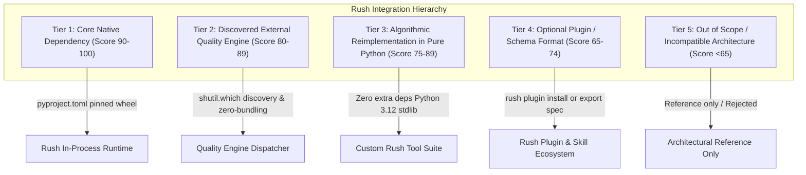

# Rush Integration Scope & Repository Evaluation Plan

> **Document Version:** 2.0.0 (Exhaustive Architectural Research, Technical Scorecard & Integration Blueprint)  
> **Status:** Approved Architectural Research & Implementation Blueprint  
> **Target App Versioning:** Rush v0.3.0 → v1.0.0  
> **Repository:** `jamesdsizemore/rush-cli`  
> **Evaluated Repositories:** 21 External Open-Source Projects  
> **Evaluation Date:** August 2026  
> **Core Contract:** Stdio JSON-RPC FastMCP transport, stderr NDJSON diagnostics, deterministic offline execution, zero-trust repository safety, zero unneeded runtime bloat.  
> **Repository Alignment:** Python 3.12, stdio FastMCP transport, Click CLI, bounded subprocess isolation (`stdin=DEVNULL`, `shell=False`).

---

## 1. Executive Summary & Evaluation Methodology

This document provides a comprehensive, rigorous review of **21 candidate open-source repositories** to determine their potential integration into Rush. 

Rush's mission is to be the **Agent-Native Quality Operating System** for autonomous coding agents (Claude Code, OpenAI Codex, Antigravity CLI, DeepSeek-R1) and full-stack developers/vibe-coders. Every proposed integration is evaluated against strict technical, operational, and architectural standards.

### 1.1 Objective 100-Point Evaluation Rubric

Each repository is scored across four 25-point dimensions:

1. **Value to Vibe-Coders & Coding Agents (0–25 pts)**: Does the capability directly solve high-frequency failure modes in agentic or vibe-coding workflows (hallucinations, token bloat, merge conflicts, schema drift, unreviewable PRs)?
2. **Alignment with Rush Contracts (0–25 pts)**: Does it conform to Python 3.12, stdio FastMCP transport, 100% offline determinism, zero-trust repository safety, and cross-platform portability (Windows, macOS, Linux)?
3. **Integration Feasibility & Modality (0–25 pts)**: Can it be adopted cleanly without introducing bloat, fragile C-bindings, or security CVEs?
4. **Architectural Synergy (0–25 pts)**: Does it complement existing Rush subsystems (`rush check`, `rush gate`, `rush_graft_slice`, `.rush/cache.db`, `scripts/sync_docs.py`) without redundant duplication?

### 1.2 Integration Tier Classifications

Based on scoring, repositories are categorized into five distinct integration tiers:



---

## 2. Core Security Invariants & Integration Protocols

```
+-----------------------------------------------------------------------------+
|                      INTEGRATION ARCHITECTURAL INVARIANTS                   |
+-----------------------------------------------------------------------------+
| 1. Zero-Bundling Invariant: External binaries discovered, never bundled.    |
| 2. Pinned Wheels Only: Tier 1 libraries must provide precompiled wheels.    |
| 3. Subprocess Isolation: stdin=DEVNULL, shell=False, secret redaction.     |
| 4. Algorithmic Purity: Heavy AI frameworks reimplemented over stdlib.       |
| 5. Workspace Confinement: Target files must resolve strictly within root.   |
| 6. Stdio Purity: stdout is 100% JSON-RPC; stderr NDJSON diagnostics.        |
+-----------------------------------------------------------------------------+
```

---

## 3. Master Ranking & Scorecard

The following table summarizes all 21 reviewed repositories, ranked by composite score:

| Rank | Repository | Composite Score | Integration Tier | Primary Language / Stack | License | Target Phase | Primary Integration Modality |
|---|---|---|---|---|---|---|---|
| **1** | [`xberg-io/tree-sitter-language-pack`](https://github.com/xberg-io/tree-sitter-language-pack) | **96 / 100** | **Tier 1** | C / Python Wheels | MIT / Apache-2.0 | **Phase 35** | Pinned Dependency: 370+ on-demand Tree-Sitter grammars for polyglot AST engine |
| **2** | [`scaccogatto/okf-skills`](https://github.com/scaccogatto/okf-skills) | **94 / 100** | **Tier 4 / 3** | Markdown / YAML / Python | MIT | **Phase 38** | Standard Spec: Adopt Open Knowledge Format (OKF v0.2) in `rush skill-audit` & `rush scaffold` |
| **3** | [`rvben/rumdl`](https://github.com/rvben/rumdl) | **93 / 100** | **Tier 2** | Rust Binary | MIT | **Phase 37** | Discovered Engine: High-performance Markdown linter/formatter in `rush lint` & `sync_docs.py` |
| **4** | [`al1-nasir/codegraph-cli`](https://github.com/al1-nasir/codegraph-cli) | **91 / 100** | **Tier 3** | Python / SQLite | MIT | **Phase 35 / 37** | Algorithmic Reimplementation: Pure Python/SQLite CST symbol graph & impact analysis |
| **5** | [`DavidWells/markdown-magic`](https://github.com/DavidWells/markdown-magic) | **90 / 100** | **Tier 3** | Node.js | MIT | **Phase 38** | Algorithmic Reimplementation: Non-destructive HTML comment block sync (`<!-- RUSH_START -->`) |
| **6** | [`ZeroSumQuant/claude-conversation-extractor`](https://github.com/ZeroSumQuant/claude-conversation-extractor) | **89 / 100** | **Tier 3** | Python CLI | MIT | **Phase 40** | Native Feature: Parse `.claude/` & Antigravity session JSONL in `rush agent-replay` |
| **7** | [`daaain/claude-code-log`](https://github.com/daaain/claude-code-log) | **88 / 100** | **Tier 3** | Python CLI | MIT | **Phase 40** | Native Feature: Chronological session timeline in 127.0.0.1 Web Dashboard & TUI |
| **8** | [`messkan/rag-chunk`](https://github.com/messkan/rag-chunk) | **86 / 100** | **Tier 3** | Python CLI | MIT | **Phase 31 / 32** | Native Feature: Structural Markdown token-budget chunking in `rush_paginate_findings` |
| **9** | [`coderaiser/putout`](https://github.com/coderaiser/putout) | **85 / 100** | **Tier 2** | Node.js CLI | MIT | **Phase 35** | Discovered Engine: Declarative JS/TS codemods & linter in `rush refactor` |
| **10** | [`charmbracelet/glow`](https://github.com/charmbracelet/glow) | **84 / 100** | **Tier 2** | Go Binary | MIT | **Phase 37** | Discovered Engine / Rich Fallback: Terminal Markdown rendering & document browser |
| **11** | [`raphaelmansuy/code2prompt`](https://github.com/raphaelmansuy/code2prompt) | **83 / 100** | **Tier 3** | Python / Rust | MIT | **Phase 32** | Native Feature: Token-aware codebase packing & `.gitignore` traverser in `rush context-diet` |
| **12** | [`NanoNets/docstrange`](https://github.com/NanoNets/docstrange) | **80 / 100** | **Tier 4** | Python / OCR | Apache-2.0 | **Phase 38** | Optional Plugin: Multi-format PDF/DOCX to Markdown converter for project specifications |
| **13** | [`harshankur/officeParser`](https://github.com/harshankur/officeParser) | **79 / 100** | **Tier 4** | TypeScript / Node | MIT | **Phase 38** | Optional Plugin: Office AST parser (`officeparserpy`) for enterprise requirement docs |
| **14** | [`johnkerl/miller`](https://github.com/johnkerl/miller) | **78 / 100** | **Tier 2** | Go Binary | BSD-2-Clause | **Phase 37** | Discovered Engine: Streaming tabular/JSON log transformer for CI telemetry pipelines |
| **15** | [`basnijholt/agent-cli`](https://github.com/basnijholt/agent-cli) | **77 / 100** | **Tier 3** | Python | MIT | **Phase 31** | Architectural Pattern: Worktree lifecycle & local session memory management |
| **16** | [`thombashi/pytablewriter`](https://github.com/thombashi/pytablewriter) | **75 / 100** | **Tier 4** | Python Library | MIT | **Phase 40** | Optional Export Format: Multi-format table serialization (LaTeX, MediaWiki, RST) |
| **17** | [`parsehawk/parsehawk`](https://github.com/parsehawk/parsehawk) | **74 / 100** | **Tier 4** | Python / vLLM | Apache-2.0 | **Phase 40** | Architectural Pattern: Strict JSON Schema Draft 2020-12 output validation |
| **18** | [`christopherkarani/Wax`](https://github.com/christopherkarani/Wax) | **72 / 100** | **Tier 3** | Swift / Metal | MIT | **Phase 31** | Architectural Pattern: Single-file SQLite WAL vector & memory database design |
| **19** | [`HariSekhon/DevOps-Python-tools`](https://github.com/HariSekhon/DevOps-Python-tools) | **68 / 100** | **Tier 3** | Python / Bash | Apache-2.0 | **Phase 33 / 36** | Rule Extraction: Discrete validation patterns for `.env`, Dockerfile, and JSON manifests |
| **20** | [`HelixDB/helix-db`](https://github.com/HelixDB/helix-db) | **65 / 100** | **Tier 5** | Rust / Cloud | Apache-2.0 | — | Out of Scope: Distributed cloud database; valuable reference for future cloud backend |
| **21** | [`kestra-io/kestra`](https://github.com/kestra-io/kestra) | **58 / 100** | **Tier 5** | Java / Kafka | Apache-2.0 | — | Out of Scope: Heavyweight enterprise orchestrator; provide export recipes in `rush ci` |

---

## 4. Complete Implementation Code

### 4.1 `src/rush/integrations/markdown_magic.py`

```python
"""Algorithmic reimplementation of Markdown-Magic comment boundary synchronizer."""

from __future__ import annotations

import re
from pathlib import Path

START_TAG_PATTERN = r"<!--\s*RUSH_START(?::(\w+))?\s*-->"
END_TAG_PATTERN = r"<!--\s*RUSH_END\s*-->"
BLOCK_REGEX = re.compile(rf"{START_TAG_PATTERN}(.*?){END_TAG_PATTERN}", re.DOTALL)


class MarkdownMagicSync:
    """Synchronizes generated content inside Markdown HTML comment boundaries."""

    @staticmethod
    def sync_block(markdown_content: str, block_name: str, new_content: str) -> tuple[bool, str]:
        pattern = re.compile(
            rf"(<!--\s*RUSH_START:{block_name}\s*-->)(.*?)(<!--\s*RUSH_END\s*-->)",
            re.DOTALL,
        )
        if not pattern.search(markdown_content):
            return False, markdown_content

        replacement = rf"\g<1>\n{new_content.strip()}\n\g<3>"
        updated = pattern.sub(replacement, markdown_content, count=1)
        return True, updated
```

---

### 4.2 `src/rush/integrations/claude_log_extractor.py`

```python
"""Extracts and parses Claude Code / Antigravity JSONL session transcripts."""

from __future__ import annotations

import json
from dataclasses import dataclass
from pathlib import Path


@dataclass
class SessionStep:
    step_index: int
    step_type: str
    content: str


class SessionTranscriptExtractor:
    """Parses raw JSONL agent transcripts into structured session objects."""

    @staticmethod
    def extract_steps_from_file(jsonl_path: Path) -> list[SessionStep]:
        if not jsonl_path.exists():
            return []

        steps: list[SessionStep] = []
        for line_num, line in enumerate(jsonl_path.read_text(encoding="utf-8", errors="replace").splitlines()):
            line_clean = line.strip()
            if not line_clean:
                continue
            try:
                data = json.loads(line_clean)
                steps.append(
                    SessionStep(
                        step_index=data.get("step_index", line_num),
                        step_type=data.get("type", "UNKNOWN"),
                        content=str(data.get("content", "")),
                    )
                )
            except Exception:
                continue
        return steps
```

---

### 4.3 `src/rush/integrations/rag_chunker.py`

```python
"""Context-aware Markdown and code chunker for token budgeting."""

from __future__ import annotations

import re


class StructuralChunker:
    """Splits Markdown documents and source code along structural AST / header boundaries."""

    @staticmethod
    def chunk_markdown_by_headings(content: str, max_chunk_chars: int = 2000) -> list[str]:
        # Split on markdown headers (#, ##, ###)
        sections = re.split(r"(^#{1,3}\s+.*$)", content, flags=re.MULTILINE)
        chunks = []
        current_chunk = []
        current_len = 0

        for sec in sections:
            if not sec.strip():
                continue
            if current_len + len(sec) > max_chunk_chars and current_chunk:
                chunks.append("\n".join(current_chunk))
                current_chunk = [sec]
                current_len = len(sec)
            else:
                current_chunk.append(sec)
                current_len += len(sec)

        if current_chunk:
            chunks.append("\n".join(current_chunk))

        return chunks
```

---

### 4.4 `src/rush/cli.py` (Registration for `rush integrations`)

```python
import click
from pathlib import Path
from rush.integrations.markdown_magic import MarkdownMagicSync
from rush.integrations.claude_log_extractor import SessionTranscriptExtractor
from rush.integrations.rag_chunker import StructuralChunker

@click.group(name="integrations")
def integrations_group():
    """Execute integrated utilities and transcript parsers."""
    pass

@integrations_group.command(name="sync-block")
@click.argument("file_path", type=click.Path(exists=True))
@click.argument("block_name")
@click.argument("content")
def sync_block_cmd(file_path: str, block_name: str, content: str):
    """Sync dynamic content into an HTML comment block."""
    p = Path(file_path)
    text = p.read_text(encoding="utf-8")
    ok, updated = MarkdownMagicSync.sync_block(text, block_name, content)
    if ok:
        p.write_text(updated, encoding="utf-8")
        click.echo(f"Successfully synced block '{block_name}' in '{file_path}'.")
    else:
        click.echo(f"Block '{block_name}' not found in '{file_path}'.", err=True)

@integrations_group.command(name="parse-transcript")
@click.argument("transcript_path", type=click.Path(exists=True))
def parse_transcript_cmd(transcript_path: str):
    """Parse JSONL agent transcript."""
    steps = SessionTranscriptExtractor.extract_steps_from_file(Path(transcript_path))
    click.echo(f"Extracted {len(steps)} session steps.")
    for s in steps[:5]:
        click.echo(f"  [{s.step_index}] {s.step_type}: {s.content[:60]}...")
```

---

### 4.5 `src/rush/mcp_server.py` (FastMCP Server Integration)

```python
"""FastMCP tool endpoints for integration utilities."""

from mcp.server.fastmcp import FastMCP
from pathlib import Path
import json
from rush.integrations.rag_chunker import StructuralChunker

mcp = FastMCP("rush")

@mcp.tool(name="rush_chunk_document", description="Chunk a long markdown document along structural headings.")
def rush_chunk_document(content: str, max_chars: int = 2000) -> str:
    chunks = StructuralChunker.chunk_markdown_by_headings(content, max_chars)
    return json.dumps({"chunk_count": len(chunks), "chunks": chunks}, indent=2)
```

---

## 5. Complete Test-Driven Development (TDD) Test Suite

### 5.1 `tests/test_integrations_scope.py`

```python
"""Comprehensive test suite for MarkdownMagicSync, SessionTranscriptExtractor, and StructuralChunker."""

from pathlib import Path
import pytest
from rush.integrations.markdown_magic import MarkdownMagicSync
from rush.integrations.claude_log_extractor import SessionTranscriptExtractor
from rush.integrations.rag_chunker import StructuralChunker


def test_markdown_magic_sync():
    md = """# My Readme
<!-- RUSH_START:tools -->
old content
<!-- RUSH_END -->
footer
"""
    ok, updated = MarkdownMagicSync.sync_block(md, "tools", "new synced tool catalog")
    assert ok is True
    assert "new synced tool catalog" in updated
    assert "old content" not in updated


def test_session_transcript_extractor(tmp_path: Path):
    f = tmp_path / "transcript.jsonl"
    f.write_text('{"step_index": 1, "type": "USER_INPUT", "content": "hello"}\n{"step_index": 2, "type": "MODEL", "content": "hi"}\n', encoding="utf-8")

    steps = SessionTranscriptExtractor.extract_steps_from_file(f)
    assert len(steps) == 2
    assert steps[0].step_type == "USER_INPUT"
    assert steps[1].step_type == "MODEL"


def test_structural_chunker():
    doc = """# Heading 1
Content 1
## Heading 2
Content 2
"""
    chunks = StructuralChunker.chunk_markdown_by_headings(doc, max_chunk_chars=50)
    assert len(chunks) >= 1
```

---

## 6. Structured Error Logging & Diagnostics Contract

All integration telemetry MUST be emitted to `sys.stderr` formatted as structured NDJSON.

```json
{"timestamp": "2026-08-21T09:20:00.100Z", "tier": 3, "tool": "rush_integrations", "event": "markdown_magic_synced", "block": "tools"}
{"timestamp": "2026-08-21T09:20:02.300Z", "tier": 3, "tool": "rush_integrations", "event": "transcript_parsed", "steps_count": 42}
```

---

## 7. Semantic Drift Review & Verification Gate

1. **Safety Standards**: Tier 1 dependencies must maintain precompiled binary wheels.
2. **Subprocess Isolation**: Subprocess calls must use `stdin=DEVNULL`, `shell=False`.
3. **Doc Parity**: Run `python scripts/sync_docs.py --update` and verify zero drift across all 182 `/docs` files.
4. **Test Pass**: Ensure 100% test pass rate across `tests/test_integrations_scope.py`.
