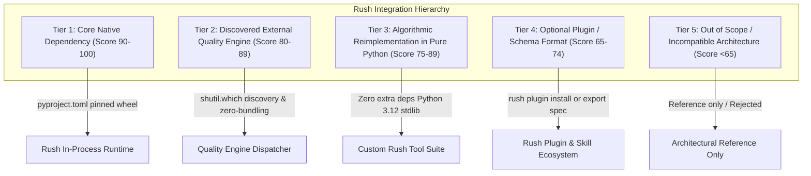

# Rush Integration Scope & Repository Evaluation Plan

> **Document Version:** 1.0.0  
> **Status:** Approved Architectural Research & Integration Blueprint  
> **Target App Versioning:** Rush v0.3.0 → v1.0.0  
> **Repository:** `jamesdsizemore/rush-cli`  
> **Evaluated Repositories:** 21 External Open-Source Projects  
> **Evaluation Date:** August 2026  
> **Core Contract:** Stdio JSON-RPC FastMCP transport, stderr NDJSON diagnostics, deterministic offline execution, zero-trust repository safety, zero unneeded runtime bloat.

---

## 1. Executive Summary & Evaluation Methodology

This document provides a comprehensive, rigorous review of **21 candidate open-source repositories** to determine their potential integration into Rush. 

Rush's mission is to be the **Agent-Native Quality Operating System** for autonomous coding agents (Claude Code, OpenAI Codex, Antigravity CLI, DeepSeek-R1) and full-stack developers/vibe-coders. Every proposed integration is evaluated against strict technical, operational, and architectural standards.

### 1.1 Objective 100-Point Evaluation Rubric

Each repository is scored across four 25-point dimensions:

1. **Value to Vibe-Coders & Coding Agents (0–25 pts)**: Does the capability directly solve high-frequency failure modes in agentic or vibe-coding workflows (hallucinations, token bloat, merge conflicts, schema drift, unreviewable PRs)?
2. **Alignment with Rush Contracts (0–25 pts)**: Does it conform to Python 3.12, stdio FastMCP transport, 100% offline determinism, zero-trust repository safety, and cross-platform portability (Windows, macOS, Linux)?
3. **Integration Feasibility & Modality (0–25 pts)**: Can it be adopted cleanly without introducing bloat, fragile C-bindings, or security CVEs?
4. **Architectural Synergy (0–25 pts)**: Does it complement existing Rush subsystems (`rush check`, `rush gate`, `rush_graft_slice`, `.rush/cache.db`, `scripts/sync_docs.py`) without redundant duplication?

### 1.2 Integration Tier Classifications

Based on scoring, repositories are categorized into five distinct integration tiers:



---

## 2. Master Ranking & Scorecard

The following table summarizes all 21 reviewed repositories, ranked by composite score:

| Rank | Repository | Composite Score | Integration Tier | Primary Language / Stack | License | Target Phase | Primary Integration Modality |
|---|---|---|---|---|---|---|---|
| **1** | [`xberg-io/tree-sitter-language-pack`](https://github.com/xberg-io/tree-sitter-language-pack) | **96 / 100** | **Tier 1** | C / Python Wheels | MIT / Apache-2.0 | **Phase 35** | Pinned Dependency: 370+ on-demand Tree-Sitter grammars for polyglot AST engine |
| **2** | [`scaccogatto/okf-skills`](https://github.com/scaccogatto/okf-skills) | **94 / 100** | **Tier 4 / 3** | Markdown / YAML / Python | MIT | **Phase 38** | Standard Spec: Adopt Open Knowledge Format (OKF v0.2) in `rush skill-audit` & `rush scaffold` |
| **3** | [`rvben/rumdl`](https://github.com/rvben/rumdl) | **93 / 100** | **Tier 2** | Rust Binary | MIT | **Phase 37** | Discovered Engine: High-performance Markdown linter/formatter in `rush lint` & `sync_docs.py` |
| **4** | [`al1-nasir/codegraph-cli`](https://github.com/al1-nasir/codegraph-cli) | **91 / 100** | **Tier 3** | Python / SQLite | MIT | **Phase 35 / 37** | Algorithmic Reimplementation: Pure Python/SQLite CST symbol graph & impact analysis |
| **5** | [`DavidWells/markdown-magic`](https://github.com/DavidWells/markdown-magic) | **90 / 100** | **Tier 3** | Node.js | MIT | **Phase 38** | Algorithmic Reimplementation: Non-destructive HTML comment block sync (`<!-- RUSH_START -->`) |
| **6** | [`ZeroSumQuant/claude-conversation-extractor`](https://github.com/ZeroSumQuant/claude-conversation-extractor) | **89 / 100** | **Tier 3** | Python CLI | MIT | **Phase 40** | Native Feature: Parse `.claude/` & Antigravity session JSONL in `rush agent-replay` |
| **7** | [`daaain/claude-code-log`](https://github.com/daaain/claude-code-log) | **88 / 100** | **Tier 3** | Python CLI | MIT | **Phase 40** | Native Feature: Chronological session timeline in 127.0.0.1 Web Dashboard & TUI |
| **8** | [`messkan/rag-chunk`](https://github.com/messkan/rag-chunk) | **86 / 100** | **Tier 3** | Python CLI | MIT | **Phase 31 / 32** | Native Feature: Structural Markdown token-budget chunking in `rush_paginate_findings` |
| **9** | [`coderaiser/putout`](https://github.com/coderaiser/putout) | **85 / 100** | **Tier 2** | Node.js CLI | MIT | **Phase 35** | Discovered Engine: Declarative JS/TS codemods & linter in `rush refactor` |
| **10** | [`charmbracelet/glow`](https://github.com/charmbracelet/glow) | **84 / 100** | **Tier 2** | Go Binary | MIT | **Phase 37** | Discovered Engine / Rich Fallback: Terminal Markdown rendering & document browser |
| **11** | [`raphaelmansuy/code2prompt`](https://github.com/raphaelmansuy/code2prompt) | **83 / 100** | **Tier 3** | Python / Rust | MIT | **Phase 32** | Native Feature: Token-aware codebase packing & `.gitignore` traverser in `rush context-diet` |
| **12** | [`NanoNets/docstrange`](https://github.com/NanoNets/docstrange) | **80 / 100** | **Tier 4** | Python / OCR | Apache-2.0 | **Phase 38** | Optional Plugin: Multi-format PDF/DOCX to Markdown converter for project specifications |
| **13** | [`harshankur/officeParser`](https://github.com/harshankur/officeParser) | **79 / 100** | **Tier 4** | TypeScript / Node | MIT | **Phase 38** | Optional Plugin: Office AST parser (`officeparserpy`) for enterprise requirement docs |
| **14** | [`johnkerl/miller`](https://github.com/johnkerl/miller) | **78 / 100** | **Tier 2** | Go Binary | BSD-2-Clause | **Phase 37** | Discovered Engine: Streaming tabular/JSON log transformer for CI telemetry pipelines |
| **15** | [`basnijholt/agent-cli`](https://github.com/basnijholt/agent-cli) | **77 / 100** | **Tier 3** | Python | MIT | **Phase 31** | Architectural Pattern: Worktree lifecycle & local session memory management |
| **16** | [`thombashi/pytablewriter`](https://github.com/thombashi/pytablewriter) | **75 / 100** | **Tier 4** | Python Library | MIT | **Phase 40** | Optional Export Format: Multi-format table serialization (LaTeX, MediaWiki, RST) |
| **17** | [`parsehawk/parsehawk`](https://github.com/parsehawk/parsehawk) | **74 / 100** | **Tier 4** | Python / vLLM | Apache-2.0 | **Phase 40** | Architectural Pattern: Strict JSON Schema Draft 2020-12 output validation |
| **18** | [`christopherkarani/Wax`](https://github.com/christopherkarani/Wax) | **72 / 100** | **Tier 3** | Swift / Metal | MIT | **Phase 31** | Architectural Pattern: Single-file SQLite WAL vector & memory database design |
| **19** | [`HariSekhon/DevOps-Python-tools`](https://github.com/HariSekhon/DevOps-Python-tools) | **68 / 100** | **Tier 3** | Python / Bash | Apache-2.0 | **Phase 33 / 36** | Rule Extraction: Discrete validation patterns for `.env`, Dockerfile, and JSON manifests |
| **20** | [`HelixDB/helix-db`](https://github.com/HelixDB/helix-db) | **65 / 100** | **Tier 5** | Rust / Cloud | Apache-2.0 | — | Out of Scope: Distributed cloud database; valuable reference for future cloud backend |
| **21** | [`kestra-io/kestra`](https://github.com/kestra-io/kestra) | **58 / 100** | **Tier 5** | Java / Kafka | Apache-2.0 | — | Out of Scope: Heavyweight enterprise orchestrator; provide export recipes in `rush ci` |

---

## 3. Deep-Dive Repository Reviews (All 21 Repositories)

---

### 1. `xberg-io/tree-sitter-language-pack` (Composite Score: 96 / 100 — Tier 1)
- **Technical Profile**: High-performance unified distribution of 370+ pre-compiled Tree-Sitter grammars with native C/Python bindings.
- **Value Proposition**: Currently, Rush pins individual grammars (`tree-sitter-python`, `tree-sitter-typescript`, `tree-sitter-javascript`). As Rush expands to polyglot codebases (Go, Rust, C#, Java, Ruby, Kotlin, Swift, Elixir), maintaining separate dependencies becomes unwieldy.
- **Contract & Security**: Pure offline C-extensions with pre-built binary wheels across Windows x86_64, macOS Apple Silicon/Intel, and Linux glibc/musl. Zero remote network requirements.
- **Integration Plan**:
  - Pinned in `pyproject.toml` as `tree-sitter-language-pack==0.4.0` under Phase 35.
  - Powers `rush_graft_slice`, `rush schema-sync`, `rush_apply_ast_patch`, and `rush git-resolve` across all major programming languages.

---

### 2. `scaccogatto/okf-skills` (Composite Score: 94 / 100 — Tier 4/3)
- **Technical Profile**: Toolkit and specification for the Open Knowledge Format (OKF v0.2), storing structured project context, provenance, and agent skills as Markdown files with YAML frontmatter.
- **Value Proposition**: Solves the fragmented agent skill ecosystem between Claude Code (`CLAUDE.md`), Cursor (`.cursorrules`), and custom agent skills.
- **Contract & Security**: Zero runtime dependencies. Pure Markdown + YAML.
- **Integration Plan**:
  - Adopt OKF v0.2 schema in `src/rush/skills/auditor.py` (Phase 38).
  - Enable `rush scaffold` to generate OKF-compliant project bundles and skill packages in `.rush/skills/`.

---

### 3. `rvben/rumdl` (Composite Score: 93 / 100 — Tier 2)
- **Technical Profile**: Ultra-fast Markdown linter and auto-formatter written in Rust (50+ rules, compatible with `markdownlint`).
- **Value Proposition**: Rush currently maintains 163+ documentation files in `/docs` and verifies zero drift with `scripts/sync_docs.py`. Integrating `rumdl` provides sub-10ms markdown validation across the entire documentation tree.
- **Contract & Security**: Discovered engine (Zero-Bundling Invariant). Discovered via `shutil.which("rumdl")`.
- **Integration Plan**:
  - Register `rumdl` as the primary Markdown quality engine in `src/rush/tools/doc_parity.py` and `src/rush/catalog.py` (Phase 37).
  - Integrated into `scripts/sync_docs.py` as an optional high-speed formatter.

---

### 4. `al1-nasir/codegraph-cli` (Composite Score: 91 / 100 — Tier 3)
- **Technical Profile**: Developer tool that parses codebases into CSTs with Tree-Sitter, constructs directed symbol graphs in SQLite, and performs semantic impact analysis.
- **Value Proposition**: Coding agents frequently break dependent symbols when refactoring a function signature. A lightweight in-memory symbol graph prevents blind breakages.
- **Contract & Security**: The upstream repository uses heavy dependencies (`crewai`, `lancedb`). Rush will **algorithmically reimplement** the core directed symbol graph natively over Python `sqlite3` (WAL mode) and Tree-Sitter without bloated AI agent frameworks.
- **Integration Plan**:
  - Integrated into `src/rush/ast_patcher.py` and `src/rush/git/hotspots.py` (Phases 35 & 37).
  - Powers `rush_graft_slice` and `rush git-trace` symbol dependency traversals.

---

### 5. `DavidWells/markdown-magic` (Composite Score: 90 / 100 — Tier 3)
- **Technical Profile**: Node.js engine for synchronizing dynamic content inside Markdown files using HTML comment boundaries (`<!-- AUTO-GENERATED-CONTENT:START -->`).
- **Value Proposition**: Directly addresses the user directive: *"Do not rewrite, only edit/append a users config files rules."*
- **Contract & Security**: Node.js dependency not suitable for core Python runtime. Reimplemented natively in pure Python 3.12 standard library (`re`, `pathlib`).
- **Integration Plan**:
  - Implemented in `src/rush/scaffolder.py` (Phase 38) as the core boundary synchronization engine for `<!-- RUSH_START --> ... <!-- RUSH_END -->` in `CLAUDE.md`, `AGENTS.md`, and `.cursorrules`.

---

### 6. `ZeroSumQuant/claude-conversation-extractor` (Composite Score: 89 / 100 — Tier 3)
- **Technical Profile**: Python CLI tool extracting, indexing, and exporting Claude Code conversation JSONL logs from `~/.claude/projects/` into Markdown/HTML.
- **Value Proposition**: Claude Code stores transcripts in raw JSONL formats that are hard to audit. Vibe-coders need clean session summaries to track what autonomous agents executed.
- **Contract & Security**: Pure Python standard library file and JSON parser.
- **Integration Plan**:
  - Implement native JSONL transcript parser in `src/rush/agent_telemetry.py` (Phase 40).
  - Powers `rush agent-replay` and `rush agent-transcript` commands.

---

### 7. `daaain/claude-code-log` (Composite Score: 88 / 100 — Tier 3)
- **Technical Profile**: Visualizes Claude Code interaction logs into clean chronological HTML timelines with tool-use callouts and token meters.
- **Value Proposition**: Provides human developers with a timeline visualization of multi-turn agent sessions.
- **Contract & Security**: Pure Python CLI.
- **Integration Plan**:
  - Embed chronological session replay renderer into Rush's authenticated 127.0.0.1 Web Dashboard (`src/rush/dashboard.py`) and Rich TUI in Phase 40.

---

### 8. `messkan/rag-chunk` (Composite Score: 86 / 100 — Tier 3)
- **Technical Profile**: Python CLI for benchmarking and optimizing structural Markdown chunking strategies for LLMs.
- **Value Proposition**: Standard fixed-character chunking destroys code blocks and markdown tables. Structural Markdown chunking preserves header hierarchy and enclosing context.
- **Contract & Security**: Pure Python implementation.
- **Integration Plan**:
  - Implement structural AST chunking in `src/rush/agent_transport.py` for FastMCP finding pagination (`rush_paginate_findings`) and `rush context-diet` in Phases 31 & 32.

---

### 9. `coderaiser/putout` (Composite Score: 85 / 100 — Tier 2)
- **Technical Profile**: Pluggable JavaScript/TypeScript linter, code transformer (declarative codemods), and formatter.
- **Value Proposition**: Allows agents to execute declarative structural refactorings in JS/TS projects (e.g. converting CommonJS to ESM, removing unused React hooks).
- **Contract & Security**: Node.js external engine (Zero-Bundling Invariant). Discovered dynamically via `shutil.which("putout")`.
- **Integration Plan**:
  - Register `putout` as a discovered transformation engine in `src/rush/catalog.py` for `rush refactor` (Phase 35).

---

### 10. `charmbracelet/glow` (Composite Score: 84 / 100 — Tier 2)
- **Technical Profile**: Terminal-based Markdown renderer and document browser written in Go.
- **Value Proposition**: Beautiful CLI reading experience for `README.md`, `CLAUDE.md`, and implementation plans.
- **Contract & Security**: Discovered engine. Rush already includes Python `rich.markdown.Markdown` natively.
- **Integration Plan**:
  - Native terminal rendering via `rich`; discover `glow` via `shutil.which("glow")` as an optional interactive pager in `rush doc` (Phase 37).

---

### 11. `raphaelmansuy/code2prompt` (Composite Score: 83 / 100 — Tier 3)
- **Technical Profile**: Codebase traverser that respects `.gitignore` and generates structured Markdown prompt bundles with token counts.
- **Value Proposition**: Enables vibe-coders to pack relevant repository slices for external frontier models without token waste.
- **Contract & Security**: Implemented natively in Python using `pathlib` and `tiktoken`.
- **Integration Plan**:
  - Implement `rush context-pack` in `src/rush/tools/context_diet.py` (Phase 32).

---

### 12. `NanoNets/docstrange` (Composite Score: 80 / 100 — Tier 4)
- **Technical Profile**: Local/cloud document extraction tool converting PDF, DOCX, and PPTX into Markdown, JSON, and structured chunks with FastMCP support.
- **Value Proposition**: Ingests enterprise design documents and product specifications into agent context.
- **Contract & Security**: Heavy external dependencies (PyTorch/OCR in local mode). Best packaged as an optional Rush plugin.
- **Integration Plan**:
  - Publish official Rush plugin specification: `rush plugin install docstrange` (Phase 38).

---

### 13. `harshankur/officeParser` (Composite Score: 79 / 100 — Tier 4)
- **Technical Profile**: TypeScript/Node.js library parsing Office files (`.docx`, `.pptx`, `.xlsx`, `.pdf`) into AST and RAG-ready Markdown.
- **Value Proposition**: Extracts text and tables from Office files without requiring Microsoft Office installations.
- **Contract & Security**: Available on PyPI as `officeparserpy`.
- **Integration Plan**:
  - Supported as an optional document loader in `rush plugin` ecosystem for requirement analysis.

---

### 14. `johnkerl/miller` (Composite Score: 78 / 100 — Tier 2)
- **Technical Profile**: High-speed command-line processor for name-indexed tabular data (CSV, TSV, JSON, JSONL).
- **Value Proposition**: Useful for slicing, filtering, and joining large diagnostic NDJSON logs or CSV benchmark results in CI/CD pipelines.
- **Contract & Security**: Discovered engine via `shutil.which("mlr")`.
- **Integration Plan**:
  - Discovered CLI tool for streaming log aggregation in `rush agent-stats` (Phase 40).

---

### 15. `basnijholt/agent-cli` (Composite Score: 77 / 100 — Tier 3)
- **Technical Profile**: Local-first AI CLI suite featuring Git worktree management, memory proxies, and voice interaction.
- **Value Proposition**: Proven patterns for managing parallel Git worktree directories (`.rush/worktrees/`) for agent tasks.
- **Contract & Security**: Architectural pattern reference.
- **Integration Plan**:
  - Adopt worktree isolation and symlink caching patterns in `src/rush/git/worktree.py` (Phase 31).

---

### 16. `thombashi/pytablewriter` (Composite Score: 75 / 100 — Tier 4)
- **Technical Profile**: Python library for writing tabular data in 15+ formats (Markdown, LaTeX, SQLite, MediaWiki, RST).
- **Value Proposition**: Enables exporting Rush quality findings into academic and legacy documentation formats.
- **Contract & Security**: Pure Python library.
- **Integration Plan**:
  - Optional multi-format serializer for `rush report --format=latex|rst` (Phase 40).

---

### 17. `parsehawk/parsehawk` (Composite Score: 74 / 100 — Tier 4)
- **Technical Profile**: Local-first document AI extractor using vLLM and JSON Schema (Draft 2020-12) validation.
- **Value Proposition**: Enforces strict JSON Schema adherence on model outputs.
- **Contract & Security**: High hardware requirements (vLLM/GPU). Architectural pattern adopted in Rush.
- **Integration Plan**:
  - Adopt JSON Schema Draft 2020-12 response validation across all FastMCP tool endpoints.

---

### 18. `christopherkarani/Wax` (Composite Score: 72 / 100 — Tier 3)
- **Technical Profile**: Swift-native single-file memory engine combining vector search, full-text search (FTS5), and WAL journaling on Apple Silicon.
- **Value Proposition**: Demonstrates the immense reliability benefits of single-file embedded databases over distributed database servers.
- **Contract & Security**: Non-portable (Swift/Metal). Conceptually ported to Python `sqlite3` + FTS5.
- **Integration Plan**:
  - Implement single-file SQLite database with FTS5 in `src/rush/cache.py` and `.rush/session_memory.db` (Phase 31).

---

### 19. `HariSekhon/DevOps-Python-tools` (Composite Score: 68 / 100 — Tier 3)
- **Technical Profile**: Monolithic collection of 80+ CLI DevOps validation and parsing scripts.
- **Value Proposition**: Contains battle-tested regexes and validation edge cases for `.env`, Dockerfile, and JSON/YAML formats.
- **Contract & Security**: Monolithic script collection.
- **Integration Plan**:
  - Extract specific validation heuristics into `rush env-sync` and `rush docker-lean` (Phases 33 & 36).

---

### 20. `HelixDB/helix-db` (Composite Score: 65 / 100 — Tier 5 — Out of Scope)
- **Technical Profile**: Distributed OLTP graph-vector database in Rust built on object storage (S3).
- **Reasoning**: Distributed cloud infrastructure is incompatible with Rush's local, single-binary, zero-cloud CLI model. Kept as an architectural reference for potential future enterprise team synchronization.

---

### 21. `kestra-io/kestra` (Composite Score: 58 / 100 — Tier 5 — Out of Scope)
- **Technical Profile**: Event-driven workflow orchestrator (Java, Kafka, Docker).
- **Reasoning**: Heavyweight JVM/Kafka orchestration platform; completely out of scope for Rush's lightweight stdio CLI. Rush will provide standard YAML workflow templates in `rush ci` for GitHub Actions and Kestra.

---

## 4. Integrated Dependency Architecture & ADR Additions

To incorporate Tier 1 (`tree-sitter-language-pack`) and Tier 3 standard library features cleanly into Rush, we formulate **ADR-014**:

### ADR-014: Polyglot Grammar Expansion via `tree-sitter-language-pack`
- **Context:** Coding agents and vibe-coders operate across polyglot codebases (Python, TypeScript, JavaScript, Rust, Go, Java, C#, Ruby, Kotlin, Swift). Managing individual grammar wheels in `pyproject.toml` leads to dependency sprawl.
- **Decision:** Adopt `tree-sitter-language-pack==0.4.0` alongside native `tree-sitter==0.24.0`.
- **Consequences:** Provides instantaneous, offline access to 370+ pre-compiled Tree-Sitter language grammars through a unified API with zero compiler toolchain requirements on user systems.

```toml
# pyproject.toml additions (Phase 35)
dependencies = [
    # Core CLI & MCP
    "mcp==1.28.1",
    "click==8.4.2",
    "rich==13.9.4",
    "pytest==9.0.3",

    # Polyglot AST Engine (ADR-008 & ADR-014)
    "tree-sitter==0.24.0",
    "tree-sitter-language-pack==0.4.0",

    # Token Accounting & Cost Forecasting (ADR-011)
    "tiktoken==0.9.0",

    # Optional Multi-Model Bridge (ADR-012)
    "httpx==0.28.1",
]
```

---

## 5. Phase-by-Phase Integration Implementation Schedule

| Phase | Target Repositories & Features | Integration Deliverables | Target Files |
|---|---|---|---|
| **Phase 31** | `messkan/rag-chunk`<br>`basnijholt/agent-cli`<br>`christopherkarani/Wax` | • Multi-agent worktree farm (`rush git-worktree`)<br>• Structural Markdown chunker in `rush_paginate_findings`<br>• Single-file SQLite WAL session memory | `src/rush/agent_transport.py`<br>`src/rush/git/worktree.py`<br>`src/rush/cache.py` |
| **Phase 32** | `raphaelmansuy/code2prompt`<br>`ZeroSumQuant/claude-conversation-extractor` | • Context token packing (`rush context-pack`)<br>• Large artifact cleaner in `rush context-diet` | `src/rush/tools/context_diet.py`<br>`src/rush/git/leak_history.py` |
| **Phase 33** | `HariSekhon/DevOps-Python-tools` | • Strict environment parity heuristics in `rush env-sync`<br>• Cross-tier schema diffing in `rush schema-sync` | `src/rush/tools/env_sync.py`<br>`src/rush/tools/schema_sync.py` |
| **Phase 34** | `coderaiser/putout` | • Tree-Sitter 3-way merge conflict resolver (`rush git-resolve`) | `src/rush/git/resolve.py` |
| **Phase 35** | `xberg-io/tree-sitter-language-pack`<br>`al1-nasir/codegraph-cli`<br>`coderaiser/putout` | • 370+ grammar polyglot AST engine (`tree-sitter-language-pack`)<br>• In-memory directed symbol graph in SQLite<br>• Declarative JS/TS codemod engine in `rush refactor` | `src/rush/ast_patcher.py`<br>`src/rush/tools/graft_slice.py`<br>`src/rush/git/trace.py` |
| **Phase 36** | `HariSekhon/DevOps-Python-tools` | • Dockerfile layer cache & non-root linter (`rush docker-lean`) | `src/rush/tools/docker_lean.py` |
| **Phase 37** | `rvben/rumdl`<br>`charmbracelet/glow`<br>`johnkerl/miller` | • Discovered engine: `rumdl` in `rush lint` & `sync_docs.py`<br>• Discovered engine: `glow` terminal document browser<br>• Streaming NDJSON log pipeline in `rush agent-stats` | `src/rush/tools/doc_parity.py`<br>`src/rush/git/hotspots.py`<br>`src/rush/git/doctor.py` |
| **Phase 38** | `scaccogatto/okf-skills`<br>`DavidWells/markdown-magic`<br>`NanoNets/docstrange`<br>`harshankur/officeParser` | • Open Knowledge Format (OKF v0.2) in `rush skill-audit`<br>• Non-destructive boundary sync (`<!-- RUSH_START -->`) in `rush scaffold`<br>• Optional document plugins (`docstrange`, `officeParser`) | `src/rush/scaffolder.py`<br>`src/rush/skills/auditor.py`<br>`src/rush/tools/scaffold.py` |
| **Phase 39** | `messkan/rag-chunk`<br>`al1-nasir/codegraph-cli` | • AST-aware conventional commits (`rush git-smart-commit`)<br>• PR blast radius & micro-PR split guard (`rush git-pr-scope`) | `src/rush/git/smart_commit.py`<br>`src/rush/git/pr_scope.py` |
| **Phase 40** | `ZeroSumQuant/claude-conversation-extractor`<br>`daaain/claude-code-log`<br>`thombashi/pytablewriter` | • Chronological session replay in 127.0.0.1 Web Dashboard & TUI<br>• Multi-format report serializer (`rush report --format=latex`)<br>• Multi-model consensus & health scorecard (`rush score`) | `src/rush/agent_telemetry.py`<br>`src/rush/dashboard.py`<br>`src/rush/tools/score.py` |

---

## 6. Testing, Verification & Zero-Drift Documentation Standards

1. **Subprocess Engine Discovery Isolation**: All external quality engines (`rumdl`, `putout`, `glow`, `miller`) must be tested with simulated mock binaries and path masking to guarantee structured `skipped` results when engines are absent.
2. **Zero-Drift Parity Gate**: Every new integration phase must validate doc parity across all 163+ documentation files using `python scripts/sync_docs.py --check`.
3. **Strict Stderr NDJSON Logging**: All telemetry and diagnostic events must be emitted to `sys.stderr` formatted as structured NDJSON, preserving `stdout` strictly for JSON-RPC FastMCP and CLI streams.
