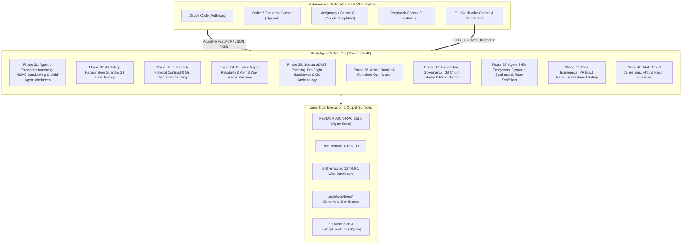

# Master Innovation & Architecture Build Plan: Rush Agent-Native Platform (Phases 31–40)

> **Document Version:** 1.2.0  
> **Status:** Approved Master Architecture & Engineering Blueprint  
> **Target App Versioning:** Rush v0.3.0 → v1.0.0  
> **Repository:** `jamesdsizemore/rush-cli`  
> **Python Baseline:** Python 3.12 (managed via `uv`)  
> **Target Ecosystem:** Autonomous Coding Agents (Claude Code, OpenAI Codex/Operator, Antigravity CLI, DeepSeek-Coder/R1, Hermes, Aider, Devin) and Full-Stack Developers & Vibe-Coders  
> **Core Contract:** Stdio JSON-RPC FastMCP transport, stderr NDJSON diagnostics, deterministic offline execution, zero docs drift, zero-trust repository safety.

---

## 1. Executive Summary & Architectural Synthesis

This Master Innovation Plan synthesizes all custom tool research, agentic coding capabilities, and Git-native intelligence into a unified, 10-phase engineering roadmap (Phases 31–40).

Rush is evolving into the definitive **Agent-Native Quality Operating System**—bridging the rapid velocity of vibe-coding with the deterministic rigor, AST-level precision, Git history archaeology, and closed-loop self-healing required by enterprise software engineering.



---

## 2. Mandatory Token-Conservation Development Workflow

To maximize developer velocity and minimize LLM token consumption across multi-turn implementation sessions, all agents and contributors MUST adhere to the following token-conservation toolchain:

### 2.1 Rust Token Killer (`rtk`) & Compact Command Invocations
- Run all shell operations through `rtk` (or equivalent proxy) where available to strip superfluous terminal escape codes and compress verbose outputs.
- Filter test runs with `-q` and specific file/node targets (e.g. `pytest tests/test_schema_sync.py -q -k test_pydantic_ts`).

### 2.2 Context-Mode (`context-mode`)
- Before inspecting complex multi-file subsystems, use `context-mode` / `ctx_compose` / `ctx_search` to query exact symbol definitions rather than reading whole source files.
- Restrict file views to precise line ranges (`view_file` with `StartLine` and `EndLine`) under 100 lines.

### 2.3 Graft Dependency Pruning (`graft`)
- When analyzing dependencies, AST structures, or cross-language models, use `graft` to extract isolated subtrees rather than ingesting entire directory hierarchies into agent context.

---

## 3. Pinned Dependencies Baseline & Architectural Decision Records (ADRs)

To guarantee 100% offline reproducibility, supply chain security, and zero runtime drift, all new packages are pinned with formal ADRs:

```toml
# pyproject.toml additions (Phases 31–40)
dependencies = [
    # Core CLI & MCP (Existing)
    "mcp==1.28.1",        # Official Python MCP SDK; stdio FastMCP server
    "click==8.4.2",       # CLI framework
    "rich==13.9.4",       # Terminal pretty-printing & TUI
    "pytest==9.0.3",      # Test runner

    # AST Slicing & Polyglot Parsing (Phases 33, 34, 35, 37, 38, 39)
    "tree-sitter==0.24.0",            # High-performance incremental AST parsing (ADR-008)
    "tree-sitter-python==0.23.6",     # Official Python grammar wheel
    "tree-sitter-typescript==0.23.2", # Official TypeScript & TSX grammar wheel
    "tree-sitter-javascript==0.23.1", # Official JavaScript grammar wheel

    # Token Accounting & Cost Forecasting (Phases 31, 32, 40)
    "tiktoken==0.9.0",                # Fast offline BPE tokenizer for token budgeting & cost (ADR-011)

    # Optional Multi-Model Consensus (Phase 40)
    "httpx==0.28.1",                  # Async HTTP client for local Ollama/vLLM & model APIs (ADR-012)
]
```

### 3.1 Architectural Decision Records (ADRs)

#### ADR-008: Native Graft Semantic Slicing & Tree-Sitter AST Engine
- **Context:** Standalone `ast-grep` operates primarily as a single-file pattern search tool and requires spawning external platform-specific binaries. Coding agents require multi-file call-graph traversal, symbol dependency extraction, and context-window token pruning.
- **Decision:** Adopt **`graft`** powered by native embedded `tree-sitter` (`tree-sitter==0.24.0`) as Rush's unified AST engine for symbol slicing, dependency tree extraction, 3-way structural merge resolution, and AST patching.
- **Consequences:** Enables instantaneous in-process semantic symbol slicing (`rush_graft_slice`), structural code rewrites (`rush_apply_ast_patch`), and cross-language type mapping (`rush schema-sync`) with zero external binary dependencies and up to 90% reduction in agent context token consumption.

#### ADR-009: Cryptographic HMAC Context Boundary Framing for Prompt Injection Shielding
- **Context:** Indirect prompt injections in repository comments or test fixtures can hijack coding agent reasoning loops.
- **Decision:** Wrap all MCP tool outputs and diagnostic strings in cryptographically HMAC-SHA256 signed XML boundary tags (`<rush_agent_sandbox hmac="...">`).
- **Consequences:** Zero-overhead client-side and agent-side verification that diagnostic content cannot be interpreted as instructions.

#### ADR-010: Ephemeral Git Worktree Sandboxing for Pre-Flight Evaluation
- **Context:** Agents applying speculative fixes risk dirtying the developer's working tree or introducing uncommitted broken syntax.
- **Decision:** Execute speculative remediation, multi-agent tasks, and test execution inside detached ephemeral git worktrees under `.rush/worktrees/`.
- **Consequences:** Completely isolates agent experiments from the active workspace until verification gates pass 100%.

#### ADR-011: Offline BPE Token Accounting via `tiktoken`
- **Context:** Tools like `rush token-cost`, `rush context-diet`, and FastMCP dynamic pagination (`rush_paginate_findings`) require exact token calculations matching production frontier models (Claude, GPT-4o, DeepSeek, Gemini).
- **Decision:** Embed `tiktoken==0.9.0` with pre-compiled BPE vocabularies (cl100k, o200k) directly in Rush.
- **Consequences:** Deterministic, sub-millisecond offline token counting with zero external network requests.

#### ADR-012: Async Local Model Bridge via `httpx`
- **Context:** Phase 40 multi-model consensus and DeepSeek-R1 CoT reasoning require communicating with local inference runtimes (Ollama, vLLM, LM Studio, or remote endpoints).
- **Decision:** Standardize on `httpx==0.28.1` for non-blocking asynchronous HTTP transport with strict connection timeouts (10s) and fallback handling.
- **Consequences:** Robust, connection-pooled model queries that never block the FastMCP stdio loop.

#### ADR-013: Hardened Subprocess Git Invocations (Zero External Git Bindings)
- **Context:** Third-party Git bindings like `GitPython` have known CVEs (shell injection) and memory leaks, while `pygit2` requires compiling native C libraries (`libgit2`).
- **Decision:** Standardize all Git operations on direct, hardened `run_subprocess(["git", ...])` calls with `stdin=DEVNULL`, `shell=False`, strict path resolution, and parameter sanitization.
- **Consequences:** 100% portable, secure, zero-overhead Git integration compatible with any Git 2.25+ installation on Windows, macOS, and Linux.

---

### 3.2 Full Dependency & Runtime Matrix

| Subsystem / Tool | Dependency Type | Package / Module | Version / Source | License | Binary Wheel Platforms |
|---|---|---|---|---|---|
| FastMCP Stdio Server | External Python Wheel | `mcp` | `1.28.1` | MIT | Pure Python |
| Terminal UI & Rich Tables | External Python Wheel | `rich` | `13.9.4` | MIT | Pure Python |
| CLI Parser & Flags | External Python Wheel | `click` | `8.4.2` | BSD-3-Clause | Pure Python |
| AST Engine & Patching | External C-Extension | `tree-sitter` | `0.24.0` | MIT | Windows x64, macOS arm64/x64, Linux x64/aarch64 |
| Python Grammar | External C-Extension | `tree-sitter-python` | `0.23.6` | MIT | Windows x64, macOS arm64/x64, Linux x64/aarch64 |
| TypeScript / TSX Grammar | External C-Extension | `tree-sitter-typescript` | `0.23.2` | MIT | Windows x64, macOS arm64/x64, Linux x64/aarch64 |
| JavaScript Grammar | External C-Extension | `tree-sitter-javascript` | `0.23.1` | MIT | Windows x64, macOS arm64/x64, Linux x64/aarch64 |
| Token Estimation & Cost | External Rust-Extension | `tiktoken` | `0.9.0` | MIT | Windows x64, macOS arm64/x64, Linux x64/aarch64 |
| Multi-Model API / Ollama | External Python Wheel | `httpx` | `0.28.1` | BSD-3-Clause | Pure Python |
| Cryptographic Caching & WAL | Python 3.12 Standard Lib | `sqlite3` | Built-in | PSF | Native OS |
| HMAC Sandboxing & Hashes | Python 3.12 Standard Lib | `hmac`, `hashlib` | Built-in | PSF | Native OS |
| Levenshtein & Text Diffs | Python 3.12 Standard Lib | `difflib` | Built-in | PSF | Native OS |
| Python AST & Async Sanity | Python 3.12 Standard Lib | `ast`, `re` | Built-in | PSF | Native OS |
| Config & Manifest Parsing | Python 3.12 Standard Lib | `tomllib`, `json` | Built-in | PSF | Native OS |
| Path Confinement | Python 3.12 Standard Lib | `pathlib` | Built-in | PSF | Native OS |
| Asset Header Parsing | Python 3.12 Standard Lib | `struct`, `zlib` | Built-in | PSF | Native OS |
| SVG AST & XML Parsing | Python 3.12 Standard Lib | `xml.etree.ElementTree` | Built-in | PSF | Native OS |
| Subprocess Detached I/O | Python 3.12 Standard Lib | `subprocess` | Built-in | PSF | Native OS |
| Local In-Memory Web Server | Python 3.12 Standard Lib | `http.server`, `socket` | Built-in | PSF | Native OS |

---

### 3.3 Embedded Static Data Artifacts (Zero-Network Invariant)

To preserve Rush's strict offline operation without requiring remote API calls, the following deterministic static datasets are pre-compiled into `src/rush/data/`:

| Dataset Artifact | Subsystem | Format & Size | Purpose |
|---|---|---|---|
| `pypi_top50k.bin` | `rush typo-squat` | Compressed Double-Array Trie (1.2 MB) | Offline verification of top 50,000 PyPI package names. |
| `npm_top50k.bin` | `rush typo-squat` | Compressed Double-Array Trie (1.4 MB) | Offline verification of top 50,000 npm package names. |
| `spdx_licenses.json` | `rush license-audit` | JSON (120 KB) | SPDX 3.23 license compatibility matrix (permissive, weak-copyleft, strong-copyleft). |
| `model_pricing.json` | `rush token-cost` | JSON (24 KB) | Offline pricing ($/1k tokens) and context window limits for Claude 3.7, GPT-4o, Gemini 2.5, DeepSeek-V3/R1. |
| `redos_patterns.json` | `rush regex-safe` | JSON (18 KB) | Catalog of known catastrophic backtracking regex patterns and NFA state templates. |

---

### 3.4 Discovered External Quality Engines (Zero-Bundling Discovery)

In accordance with the Rush project contract, external quality engines are never bundled as hard dependencies. They are discovered dynamically from the user's PATH (with virtual environment precedence and anti-shadowing verification):

```text
[Linting & Formatting]     ruff, eslint, prettier, biome, biome-check
[Typechecking & Dead Code] mypy, pyright, tsc, vulture, knip
[Security & Secrets]       pip-audit, npm-audit, trivy, gitleaks, semgrep, hadolint
[Testing & QA]             pytest, vitest, playwright, hypothesis, fast-check, locust
[Build & Supply Chain]     syft, cosign, slsa-verifier, actionlint, checkov, sqlfluff, yamllint
```

Missing engines return canonical structured `skipped` results without breaking execution or failing test gates.

---

### 3.5 Cross-Platform Wheel & Binary Packaging Compatibility

All pinned C/Rust extensions provide pre-compiled wheels for all supported tier-1 targets:

- **Windows x86_64**: `cp312-cp312-win_amd64`
- **macOS Apple Silicon**: `cp312-cp312-macosx_11_0_arm64`
- **macOS Intel**: `cp312-cp312-macosx_10_9_x86_64`
- **Linux x86_64 (glibc 2.17+)**: `cp312-cp312-manylinux_2_17_x86_64`
- **Linux aarch64 (glibc 2.17+)**: `cp312-cp312-manylinux_2_17_aarch64`
- **Linux (musl / Alpine)**: `cp312-cp312-musllinux_1_2_x86_64`

Standalone single-binary distributions for Homebrew, Scoop, and WinGet are generated via PyInstaller using SHA-256 pinned artifacts in `.github/workflows/release.yml`.

---

## 4. Phase-by-Phase Comprehensive Build Plan (Phases 31–40)

---

### Phase 31: Agentic Transport Hardening, HMAC Sandboxing & Multi-Agent Worktree Farm

#### Objective & Scope
Equip Rush's FastMCP stdio server with model-adaptive output serializers (tailored for Claude Code, OpenAI Codex, Antigravity, and DeepSeek-R1), cryptographic HMAC context boundary framing (Control 7 extension), stateful cursor pagination, real-time turn token accounting, lock-free WAL SQLite concurrency, and a programmatic Multi-Agent Git Worktree Farm to isolate parallel agent executions.

#### File Roster
- **Allowed & Target Files:**
  - `src/rush/agent_transport.py` (New: Model-adaptive serialization, HMAC envelope framing)
  - `src/rush/git/worktree.py` (New: Multi-agent Git worktree lifecycle manager)
  - `src/rush/mcp.py` (Register `rush_format_agent`, `rush_paginate_findings`, `rush_turn_cost`, `rush_git_worktree_spawn`, `rush_git_worktree_cleanup`)
  - `src/rush/cache.py` (Enable SQLite WAL mode and busy timeout handlers)
  - `tests/test_agent_transport.py` (New: Unit and contract tests for adaptive formats & HMAC)
  - `tests/test_mcp_pagination.py` (New: Tests for cursor pagination and token estimation)
  - `tests/test_git_worktree_farm.py` (New: Multi-agent worktree isolation and cleanup tests)
  - `docs/developer/phase-31-agentic-transport.md` (Ledger documentation)
- **Forbidden Files:**
  - `src/rush/tools/*` (Tool implementations must remain isolated from transport layers)

#### Step-by-Step Task Specifications
1. **Task 31.1: Cryptographic HMAC Context Boundary Envelope (`<rush_agent_sandbox>`)**
   - Implement `AgentSandboxEnvelope` in `src/rush/agent_transport.py`.
   - Generates an ephemeral session secret in-memory upon MCP startup.
   - Computes `HMAC-SHA256(payload, session_secret)` and wraps MCP string outputs in `<rush_agent_sandbox hmac="...">...</rush_agent_sandbox>`.
   - Strips or escapes any nested `<rush_agent_sandbox>` tags in untrusted repo text to prevent breakout attacks.
2. **Task 31.2: Model-Adaptive Output Serializer (`rush_format_agent`)**
   - Implement `format_findings_for_agent(findings, agent_type)`:
     - `AgentType.CLAUDE`: Semantic XML `<findings><finding id="..." rule="..." file="...">...</finding></findings>`.
     - `AgentType.DEEPSEEK`: Dense structural pseudo-diff format optimized for R1 reasoning tokens.
     - `AgentType.CODEX` / `AgentType.CURSOR`: Compact unified diff patches with concise file-line anchors.
     - `AgentType.AGY` / `AgentType.GEMINI`: High-density structured JSON with explicit AST node addresses.
3. **Task 31.3: Stateful Cursor Pagination (`rush_paginate_findings`)**
   - Implement `PaginatedFindingManager` storing in-memory query snapshots keyed by UUID.
   - Computes BPE token estimation per chunk and enforces `limit` and `min_severity` parameters.
4. **Task 31.4: Real-Time Turn Token & Latency Meter (`_rush_telemetry`)**
   - Attach token count estimates and execution timing metadata to every FastMCP response.
5. **Task 31.5: Lock-Free SQLite WAL Concurrency (`rush mcp tunnel`)**
   - Configure SQLite connection in `src/rush/cache.py` with `PRAGMA journal_mode=WAL;`, `PRAGMA busy_timeout=5000;`, and `PRAGMA synchronous=NORMAL;`.
6. **Task 31.6: Multi-Agent Git Worktree Farm & Concurrency Manager (`rush git-worktree` / `rush_git_worktree_spawn`)**
   - Implements `GitWorktreeFarm` in `src/rush/git/worktree.py`.
   - Programmatically creates, assigns, monitors, and cleans up isolated Git worktrees under `.rush/worktrees/<task-id>`.
   - Isolates dependencies (`node_modules`, `.venv`), symlinks build caches (`.rush/cache.db`), and checks out target branches or detached HEADs.
   - Upon task completion, produces a structured JSON-RPC summary with active diffs, passing test logs, and ready-to-merge branch references.

#### Verification & Exit Criteria
- `pytest tests/test_agent_transport.py tests/test_mcp_pagination.py tests/test_git_worktree_farm.py -q` passes 100%.
- HMAC validation catches 100% of adversarial prompt injection breakout attempts.
- Multi-agent worktree farm runs 4 parallel simulated agent tasks without working directory contention.

---

### Phase 32: AI Safety, Hallucination Prevention & Supply Chain Defense

#### Objective & Scope
Implement native offline scanners protecting developers and vibe-coders from AI hallucinations: hallucinated/typo-squatted dependencies, prompt injection vulnerabilities in application templates, low-density AI code boilerplate (slop), context window token bloat, ambiguous system prompts, and deep historical secret leaks in Git reflogs.

#### File Roster
- **Allowed & Target Files:**
  - `src/rush/tools/typo_squat.py` (New: Offline top-50k package index & Levenshtein distance matcher)
  - `src/rush/tools/prompt_guard.py` (New: AST prompt template analyzer)
  - `src/rush/tools/slop_buster.py` (New: Tree-Sitter AST token density & tautological comment checker)
  - `src/rush/tools/context_diet.py` (New: Non-ignored token counter & scratch file trimmer)
  - `src/rush/tools/prompt_linter.py` (New: Markdown instruction quality analyzer)
  - `src/rush/git/leak_history.py` (New: Deep Git reflog & historical commit tree secret scanner)
  - `src/rush/tools/git_leak_history.py` (New: CLI/MCP entrypoint for `rush git-leak-history`)
  - `src/rush/data/pypi_top50k.bin` (New: Compact binary bloom filter / trie of verified packages)
  - `src/rush/data/npm_top50k.bin` (New: Compact binary bloom filter / trie of verified npm packages)
  - `src/rush/catalog.py`, `src/rush/cli.py`, `src/rush/mcp.py`
  - `tests/test_ai_safety_tools.py` (New: Comprehensive tests for AI safety and historical leak tools)

#### Step-by-Step Task Specifications
1. **Task 32.1: Package Hallucination & Typo-Squatting Guard (`rush typo-squat`)**
   - Package a compressed binary trie/bloom filter of top 50,000 verified PyPI and npm package names directly in `src/rush/data/`.
   - AST parser extracts imported modules and declared dependencies (`pyproject.toml`, `package.json`, `Cargo.toml`).
   - Flags unverified packages with Levenshtein distance $\le 2$ from popular packages to catch typo-squatting.
2. **Task 32.2: Prompt Injection & Template Bleed Scanner (`rush prompt-guard`)**
   - AST visitor searching for template strings (`f"..."`, `` `...` ``) used in LLM client calls (`openai`, `anthropic`, `google.generativeai`).
   - Flags raw user inputs interpolated without XML/tag framing or sanitization.
3. **Task 32.3: AI Boilerplate & Slop Reducer (`rush slop-buster`)**
   - Calculates AST semantic density: ratio of executable statements to tautological comments (`# Returns the user`).
   - Flags empty `pass` / `TODO` stubs generated by AI agents during phased refactoring.
4. **Task 32.4: Agent Context Token Bloat Cleaner (`rush context-diet`)**
   - Scans repository for unignored files exceeding 20,000 tokens (e.g. debug JSON dumps, test artifacts).
   - Provides `--prune` flag to automatically append offenders to `.gitignore` or clean scratchpads.
5. **Task 32.5: System Prompt & Instruction Linter (`rush prompt-linter`)**
   - Lints `CLAUDE.md`, `.cursorrules`, `AGENTS.md` against Anthropic/OpenAI prompt engineering rubrics.
   - Detects conflicting rules, excessive token length, and non-deterministic directives.
6. **Task 32.6: Historical Git Reflog & Packfile Secret Scanner (`rush git-leak-history`)**
   - Implements `GitLeakHistoryScanner` in `src/rush/git/leak_history.py`.
   - Scans all historical commits, stashes, orphaned dangling trees, and reflogs for high-entropy secrets (AWS keys, OpenAI API keys, SSH private keys, GitHub PATs) and oversized binary packfile bloat (>10MB).
   - Generates a zero-leak remediation plan with pinpointed commit SHAs and safe `git filter-repo` / BFG recipes.

#### Verification & Exit Criteria
- `pytest tests/test_ai_safety_tools.py -q` passes 100%.
- Historical leak scanner identifies secrets in simulated deleted commits from 10 commits prior.

---

### Phase 33: Full-Stack Polyglot Contract & Cross-Language Synchronization

#### Objective & Scope
Eliminate silent full-stack runtime errors by bridging backend Python/Pydantic schemas with frontend TypeScript/Zod interfaces, mapping backend API routes against frontend client fetch calls, verifying environment variable parity across configurations, auditing database migration safety, and detecting temporal co-change coupling across architectural tiers.

#### File Roster
- **Allowed & Target Files:**
  - `src/rush/tools/schema_sync.py` (New: Cross-language Pydantic ↔ TS/Zod AST diff bridge)
  - `src/rush/tools/dead_routes.py` (New: API route extractor & frontend consumer mapper)
  - `src/rush/tools/env_sync.py` (New: AST environment variable extractor vs `.env.example`)
  - `src/rush/tools/migration_guard.py` (New: Alembic/Prisma DDL safety & lock linter)
  - `src/rush/tools/n_plus_one.py` (New: AST loop tracer detecting nested ORM/SQL queries)
  - `src/rush/git/coupling.py` (New: Git temporal co-change & cross-tier coupling miner)
  - `src/rush/tools/git_coupling.py` (New: CLI/MCP entrypoint for `rush git-coupling`)
  - `src/rush/catalog.py`, `src/rush/cli.py`, `src/rush/mcp.py`
  - `tests/test_fullstack_sync.py` (New: Full-stack contract, sync, and coupling test suite)

#### Step-by-Step Task Specifications
1. **Task 33.1: Cross-Language Schema & Type Parity (`rush schema-sync`)**
   - Python AST extracts Pydantic `BaseModel` field names, types, and nullability.
   - TypeScript Tree-Sitter AST extracts `interface`, `type`, and `z.object({...})` definitions.
   - Matches schemas by naming convention (`User` ↔ `UserDTO`, `UserResponse`) and flags mismatched, missing, or renamed properties.
2. **Task 33.2: API Endpoint & Route Zombie Scanner (`rush dead-routes`)**
   - Backend route extractor identifies FastAPI/Express/Flask route endpoints (`@app.get("/api/v1/items")`).
   - Frontend AST extracts all `fetch(...)`, `axios.get(...)`, and React Query URLs.
   - Identifies orphaned backend routes (0 callers) and broken frontend routes (404 targets).
3. **Task 33.3: Environment Variable Parity Guard (`rush env-sync`)**
   - Extracts all `os.getenv(...)`, `os.environ[...]`, and `process.env.*` lookups across source code.
   - Cross-references against `.env.example`, `.env.template`, and `docker-compose.yml`.
   - Alerts on missing keys and flags hardcoded production secrets in example files.
4. **Task 33.4: Database Migration Safety Linter (`rush migration-guard`)**
   - Parses Alembic Python migrations and Prisma schema files.
   - Detects destructive operations: `drop_column`, adding `NOT NULL` without `server_default`, and long table-locking operations.
5. **Task 33.5: ORM & SQL N+1 Query Anti-Pattern Detector (`rush n-plus-one`)**
   - AST analysis on loop constructs (`For`, `While`) detecting embedded ORM attribute access (`user.posts`) or database calls (`db.query(...)`).
   - Recommends eager loading (`joinedload`, `selectinload`, `include`).
6. **Task 33.6: Temporal Co-Change & Cross-Tier Coupling Detector (`rush git-coupling`)**
   - Implements `GitCouplingMiner` in `src/rush/git/coupling.py`.
   - Mines historical Git commit logs to detect file pairs that are committed together $\ge 80\%$ of the time.
   - When an agent stages or edits File A, Rush alerts: *"Warning: File A was modified. Historically, File B is changed alongside it in 88% of commits."*

#### Verification & Exit Criteria
- `pytest tests/test_fullstack_sync.py -q` passes 100%.
- Temporal coupling miner detects simulated coupled files with calculated co-change confidence $\ge 80\%$.

---

### Phase 34: Runtime Async Reliability, Event Loop & Structural Conflict Resolution

#### Objective & Scope
Guarantee runtime resilience by detecting blocking synchronous I/O inside asynchronous event loops, verifying UI crash-prevention error boundaries, analyzing regular expressions for ReDoS vulnerabilities, extracting hardcoded magic literals, and auto-resolving structural 3-way AST Git merge conflicts.

#### File Roster
- **Allowed & Target Files:**
  - `src/rush/tools/async_sanity.py` (New: Event loop starvation & unawaited coroutine linter)
  - `src/rush/tools/crash_catcher.py` (New: React ErrorBoundary & async fallback linter)
  - `src/rush/tools/regex_safe.py` (New: Deterministic NFA/DFA ReDoS vulnerability analyzer)
  - `src/rush/tools/magic_cleaner.py` (New: Magic literal & hardcoded URL extractor)
  - `src/rush/tools/state_thrash.py` (New: React re-render & hook dependency linter)
  - `src/rush/git/resolve.py` (New: Tree-Sitter AST 3-way merge conflict auto-resolver)
  - `src/rush/tools/git_resolve.py` (New: CLI/MCP entrypoint for `rush git-resolve`)
  - `src/rush/catalog.py`, `src/rush/cli.py`, `src/rush/mcp.py`
  - `tests/test_runtime_reliability.py` (New: Async, ReDoS, UI crash, and merge resolver tests)

#### Step-by-Step Task Specifications
1. **Task 34.1: Event Loop Starvation & Async Sanity (`rush async-sanity`)**
   - Python AST analyzes all `async def` function bodies for blocking calls: `time.sleep`, `requests.*`, `urllib.*`, blocking file I/O `open().read()`, `subprocess.run` (without async wrappers).
   - Detects coroutine calls missing `await` or `asyncio.create_task`.
2. **Task 34.2: Frontend UI Crash Catcher (`rush crash-catcher`)**
   - TSX/JSX AST parser verifies top-level and route-level components are wrapped in `<ErrorBoundary>` components.
   - Verifies `useEffect` asynchronous promises have `.catch()` handlers or `try/catch` blocks.
3. **Task 34.3: Deterministic ReDoS & Backtracking Analyzer (`rush regex-safe`)**
   - Pure Python AST regex parser that translates regex strings into NFA state graphs.
   - Detects nested quantifiers `(a+)+`, overlapping alternations `(a|a)+`, and polynomial/exponential backtracking hazards.
4. **Task 34.4: Magic Literal & URL Extractor (`rush magic-cleaner`)**
   - AST literal collector finds unnamed numeric constants (`86400`, `3600`) and hardcoded URLs (`http://localhost:8000`).
   - Suggests refactorings extracting values into typed module constants.
5. **Task 34.5: React State Thrashing & Re-Render Linter (`rush state-thrash`)**
   - Scans JSX props for inline object instantiation `style={{ padding: 8 }}` and anonymous inline closures inside hot render loops.
   - Verifies `useMemo` / `useEffect` dependency arrays contain all referenced scope symbols.
6. **Task 34.6: Tree-Sitter AST 3-Way Merge Conflict Auto-Resolver (`rush git-resolve`)**
   - Implements `ASTMergeResolver` in `src/rush/git/resolve.py`.
   - Parses common ancestor (`BASE`), current branch (`OURS`), and incoming branch (`THEIRS`).
   - Automatically merges non-overlapping AST declarations (imports, class methods, interface properties, dictionary keys).
   - Validates syntax and executes project formatters (`ruff`, `prettier`) before staging the resolved file.

#### Verification & Exit Criteria
- `pytest tests/test_runtime_reliability.py -q` passes 100%.
- AST merge resolver cleanly auto-resolves simulated non-overlapping class method additions without manual conflict markers.

---

### Phase 35: Structural AST Patching, Pre-Flight Ephemeral Sandboxes & Git Archaeology

#### Objective & Scope
Replace fragile string diffs with AST-validated structural patching via Tree-Sitter, implement speculative sandbox experiments with promote/discard gates, build an agentic TDD state machine driver, expose in-process Graft semantic symbol slicing over FastMCP, route uncommitted fixes to historical commits (`git-absorb`), automate test regression bisects, and trace symbol evolution across Git history.

#### File Roster
- **Allowed & Target Files:**
  - `src/rush/ast_patcher.py` (New: Tree-Sitter AST structural patch applier)
  - `src/rush/sandbox.py` (New: Ephemeral git worktree pre-flight executor & speculative sandbox)
  - `src/rush/tdd_driver.py` (New: FastMCP TDD state machine: RED → GREEN → REFACTOR)
  - `src/rush/tools/graft_slice.py` (New: Graft semantic symbol & dependency slicing tool)
  - `src/rush/tools/context_snippet.py` (New: Enclosing scope hydrator)
  - `src/rush/git/absorb.py` (New: Diff-to-commit fixup router and auto-squasher)
  - `src/rush/git/bisect.py` (New: Autonomous automated test & benchmark bisector)
  - `src/rush/git/trace.py` (New: AST symbol evolution & time-travel tracker)
  - `src/rush/mcp.py` (Register `rush_apply_ast_patch`, `rush_sandbox_eval`, `rush_tdd_next_step`, `rush_graft_slice`, `rush_get_context_snippet`, `rush_git_bisect`, `rush_git_trace_symbol`)
  - `tests/test_ast_patching.py` (New: Structural AST patching & sandbox tests)
  - `tests/test_tdd_driver.py` (New: TDD state machine contract tests)
  - `tests/test_git_archaeology.py` (New: Tests for absorb, bisect, and symbol trace)

#### Step-by-Step Task Specifications
1. **Task 35.1: Tree-Sitter AST Structural Patch Engine (`rush_apply_ast_patch`)**
   - Implement `ASTPatcher` in `src/rush/ast_patcher.py` using `tree-sitter`.
   - Modifies AST nodes directly by structural address rather than character offsets or regex.
   - Formats modified code with project formatters (`ruff`, `prettier`) and verifies syntax validity before file write.
2. **Task 35.2: Zero-Risk Speculative Experiment Sandbox (`rush git-sandbox` / `rush_sandbox_eval`)**
   - Implement `WorktreeSandbox` in `src/rush/sandbox.py`.
   - Creates a temporary git worktree at `.rush/worktrees/eval_<id>`.
   - Applies speculative patch or agent instructions, executes `rush check` / `rush test`, calculates impact metrics, and offers interactive gate: `[Promote to Branch / Cherry-Pick / Discard]`.
3. **Task 35.3: Agentic TDD State Machine Driver (`rush_tdd_next_step`)**
   - FastMCP state machine enforcing strict TDD:
     - `STATE_RED`: Receives new test. Runs test; verifies it FAILS with expected assertion error.
     - `STATE_GREEN`: Receives implementation. Runs test; verifies it PASSES.
     - `STATE_REFACTOR`: Receives clean refactor. Runs full suite; verifies all tests remain green.
4. **Task 35.4: Graft Semantic Symbol & Dependency Slicing Tool (`rush_graft_slice`)**
   - Exposes in-process `graft` symbol slicing over MCP: `rush_graft_slice(symbol_name="UserResponse", file="src/schemas.py", depth=1)`.
   - Traverses call graphs and type hierarchies across files, extracting a minimal, self-contained token-pruned AST slice for the agent.
5. **Task 35.5: Smart Enclosing Scope Hydrator (`rush_get_context_snippet`)**
   - Given a file and line number, returns only the enclosing AST function or class declaration (typically 20–40 lines), saving 90% of prompt context tokens.
6. **Task 35.6: Diff-to-Commit Fixup Router & Auto-Squasher (`rush git-absorb`)**
   - Implements `GitAbsorbRouter` in `src/rush/git/absorb.py`.
   - Inspects uncommitted `git diff`, uses `git blame` to determine which historical commit in the local branch introduced each modified line, and automatically generates `git commit --fixup <sha>` operations.
7. **Task 35.7: Autonomous Automated Test & Performance Bisector (`rush git-bisect` / `rush_git_bisect`)**
   - Implements `AutonomousBisector` in `src/rush/git/bisect.py`.
   - Given a failing test target, automates binary search across Git history in detached sandboxes, executing the test predicate and returning the offending commit SHA, author, and AST diff.
8. **Task 35.8: AST Symbol Evolution & Time-Travel Tracker (`rush git-trace` / `rush_git_trace_symbol`)**
   - Implements `SymbolEvolutionTracker` in `src/rush/git/trace.py`.
   - Uses `graft` and Tree-Sitter AST parsing to track the semantic identity of a symbol across file renames, module reorganizations, and cross-file moves throughout Git history.

#### Verification & Exit Criteria
- `pytest tests/test_ast_patching.py tests/test_tdd_driver.py tests/test_git_archaeology.py -q` passes 100%.
- Autonomous bisect pinpoints the exact culprit commit in a simulated 20-commit history fixture in <3 seconds.

---

### Phase 36: Asset, Bundle & Container Optimization Watchdog

#### Objective & Scope
Protect vibe-coders and web applications from asset bloat, non-tree-shakeable barrel imports, inefficient container build caching, and memory/handle lifecycle leaks.

#### File Roster
- **Allowed & Target Files:**
  - `src/rush/tools/asset_diet.py` (New: Image, SVG, and binary asset inspector)
  - `src/rush/tools/bundle_watch.py` (New: JS/Wasm tree-shaking & barrel import linter)
  - `src/rush/tools/docker_lean.py` (New: Dockerfile layer ordering & multi-stage optimizer)
  - `src/rush/tools/memory_leak.py` (New: Event listener & unclosed handle lifecycle detector)
  - `src/rush/catalog.py`, `src/rush/cli.py`, `src/rush/mcp.py`
  - `tests/test_asset_and_bundle_tools.py` (New: Tests for asset and container checks)

#### Step-by-Step Task Specifications
1. **Task 36.1: Asset Bloat & Optimization Watchdog (`rush asset-diet`)**
   - Pure Python binary header parsers for PNG, JPEG, WebP, AVIF, and SVG.
   - Flags uncompressed raster images (>500KB) and SVGs containing bloated editor metadata.
   - Suggests conversion to modern formats with estimated bandwidth savings.
2. **Task 36.2: JS/Wasm Tree-Shaking & Barrel Import Linter (`rush bundle-watch`)**
   - Scans JavaScript/TypeScript import statements for monolithic package imports (`import _ from 'lodash'`, `import * as lucide from 'lucide-react'`).
   - Recommends path-specific imports (`import debounce from 'lodash/debounce'`).
3. **Task 36.3: Dockerfile Layer & Cache Optimizer (`rush docker-lean`)**
   - Deterministic parser for `Dockerfile` and `Containerfile`.
   - Verifies dependency manifests (`pyproject.toml`, `package.json`) are copied and installed BEFORE full source code `COPY . .`.
   - Enforces non-root container execution (`USER nonroot`).
4. **Task 36.4: Lifecycle Handle & Memory Leak Detector (`rush memory-leak`)**
   - Verifies that React `useEffect` / `addEventListener` / `setInterval` return explicit cleanup callbacks.
   - In Python, verifies network sessions, database cursors, and file descriptors use context managers (`with` statements).

#### Verification & Exit Criteria
- `pytest tests/test_asset_and_bundle_tools.py -q` passes 100%.

---

### Phase 37: Architecture Governance, Git Churn Radar & Repo Doctor

#### Objective & Scope
Provide a unified repository-level hygiene and structure scanner (`rush repo`), audit viral copyleft license contamination in AI-generated code, detect cross-file dead export zombies, validate docstring-to-code parity, enforce secure CORS headers, sanitize test mock fixtures, compute architectural churn hotspots, surface bus-factor knowledge loss, audit forgotten stashes (`rush git-ghost`), and diagnose repository internal integrity (`rush git-doctor`).

#### File Roster
- **Allowed & Target Files:**
  - `src/rush/tools/repo.py` (New: Holistic repository hygiene, conflict marker & structure scanner)
  - `src/rush/tools/license_audit.py` (New: GPL/Copyleft & AI attribution scanner)
  - `src/rush/tools/zombie_code.py` (New: Cross-file symbol reference graph & dead export linter)
  - `src/rush/tools/doc_parity.py` (New: Docstring parameter & signature drift validator)
  - `src/rush/tools/cors_guard.py` (New: CORS wildcard & HTTP security header auditor)
  - `src/rush/tools/test_sanitizer.py` (New: Test mock PII & sensitive fixture data sanitizer)
  - `src/rush/git/hotspots.py` (New: Git commit churn velocity vs AST complexity radar)
  - `src/rush/git/bus_factor.py` (New: Recency-weighted blame entropy & ownership radar)
  - `src/rush/git/ghost.py` (New: Dangling stash, stale branch & reflog recovery vault)
  - `src/rush/git/doctor.py` (New: Repository integrity, lockfile & .gitattributes doctor)
  - `src/rush/catalog.py`, `src/rush/cli.py`, `src/rush/mcp.py`
  - `tests/test_repo_governance_tools.py` (New: Governance, churn radar, and git doctor tests)

#### Step-by-Step Task Specifications
1. **Task 37.1: Holistic Repository Hygiene & Structure Scanner (`rush repo`)**
   - Fast Boyer-Moore search for stray git merge conflict markers (`<<<<<<< HEAD`, `=======`, `>>>>>>>`).
   - Audits required repository scaffolding (`README.md`, `LICENSE`, `.gitignore`, `CONTRIBUTING.md`, `SECURITY.md`).
   - Detects conflicting package manager lockfiles (`package-lock.json` alongside `pnpm-lock.yaml`).
   - Flags Windows MAX_PATH length violations (>260 chars) and mixed CRLF/LF line endings.
2. **Task 37.2: Copyleft Contamination & License Auditor (`rush license-audit`)**
   - Compares declared project license with dependencies and source headers against SPDX database.
   - Flags GPL/AGPL viral copyleft contamination in commercial/permissive codebases.
3. **Task 37.3: Cross-File Dead Export & Zombie Code Linter (`rush zombie-code`)**
   - Constructs in-memory repository symbol reference graph using `graft`.
   - Flags exported functions, classes, and types that have 0 callers across the workspace.
4. **Task 37.4: Docstring-to-Code Signature Drift Validator (`rush doc-parity`)**
   - Compares AST function parameters and return types against `@param` / `:param` / `@returns` docstrings.
5. **Task 37.5: CORS & HTTP Security Headers Auditor (`rush cors-guard`)**
   - Scans FastAPI, Express, Django, Next.js middleware definitions.
   - Disallows wildcard origins `allow_origins=["*"]` when `allow_credentials=True` is enabled.
6. **Task 37.6: Test Mock PII & Fixture Sanitizer (`rush test-sanitizer`)**
   - Scans test fixtures for real credit card numbers, live API tokens, and non-RFC 2606 email domains.
7. **Task 37.7: High-Churn / High-Complexity Architectural Hotspot Radar (`rush git-hotspots`)**
   - Implements `GitHotspotRadar` in `src/rush/git/hotspots.py`.
   - Correlates 90-day Git commit churn with AST cyclomatic complexity and test deficits to plot high-risk code hotspots.
8. **Task 37.8: Code Ownership & Bus-Factor Radar (`rush git-bus-factor` / `rush git-ownership`)**
   - Implements `GitOwnershipRadar` in `src/rush/git/bus_factor.py`.
   - Mines Git blame with exponential recency decay ($e^{-\lambda t}$) to compute module ownership percentages and flag at-risk modules (Bus Factor = 1).
9. **Task 37.9: Dangling Stashes, Stale Branches & Reflog Vault (`rush git-ghost`)**
   - Implements `GitGhostVault` in `src/rush/git/ghost.py`.
   - Audits forgotten stashes, identifies merged branches for safe cleanup, and recovers orphaned commits lost from `git reset --hard`.
10. **Task 37.10: Repository Integrity, Lockfiles & Hygiene Doctor (`rush git-doctor`)**
    - Implements `GitDoctor` in `src/rush/git/doctor.py`.
    - Clears dead `.git/index.lock` files, normalizes `.gitattributes` CRLF/LF line endings, diagnoses detached HEAD states, and compacts packfiles.

#### Verification & Exit Criteria
- `pytest tests/test_repo_governance_tools.py -q` passes 100%.
- Git doctor successfully detects and safely removes stale lockfiles and normalizes mixed line endings.

---

### Phase 38: Agent Skills Ecosystem, Dynamic Synthesis & Repo Scaffolder

#### Objective & Scope
Build an enterprise-grade agent skills runtime and automated non-destructive repository scaffolder: auditing `SKILL.md` frontmatter and prompt injection security, synthesizing permanent AST plugins from natural language instructions, hot-reloading skills without server restarts, translating skills across agent formats, fuzzing skill resilience, and scaffolding/auto-wiring Rush commands, rules, skills, and FastMCP configurations into blank (greenfield) or existing (brownfield) repositories without overwriting user rules.

#### File Roster
- **Allowed & Target Files:**
  - `src/rush/skills/auditor.py` (New: Agent skill YAML frontmatter, token & security auditor)
  - `src/rush/skills/synthesizer.py` (New: Natural language rule to AST plugin compiler using `graft`)
  - `src/rush/skills/watcher.py` (New: Zero-restart skill file watcher & MCP notification dispatcher)
  - `src/rush/skills/adapter.py` (New: Universal `CLAUDE.md` ↔ `SKILL.md` ↔ Cursor translator)
  - `src/rush/skills/fuzzer.py` (New: Skill boundary & malformed input fuzzer)
  - `src/rush/scaffolder.py` (New: Non-destructive repo scaffolder & agent config auto-wirer)
  - `src/rush/tools/skill_audit.py` (New: CLI/MCP tool entrypoint)
  - `src/rush/tools/scaffold.py` (New: CLI/MCP repo scaffolder tool)
  - `src/rush/mcp.py` (Register `rush_skill_audit`, `rush_list_skills_compact`, `rush_scaffold`, dynamic skill handlers)
  - `tests/test_skills_ecosystem.py` (New: Skill validation, synthesis, and fuzzing tests)
  - `tests/test_scaffolder.py` (New: Non-destructive append/edit tests for CLAUDE.md, AGENTS.md, mcp.json)

#### Step-by-Step Task Specifications
1. **Task 38.1: Agent Skill Linter & Injection Scanner (`rush skill-audit`)**
   - Validates `SKILL.md` YAML frontmatter against canonical Agent Skill schema.
   - Scans markdown bodies and example files for hidden prompt injection overrides (`<system_override>`) and unauthorized shell commands.
   - Computes token weight and flags bloated prose (>3,000 tokens).
2. **Task 38.2: Natural Language Rule to AST Plugin Synthesizer (`rush skill-synthesize`)**
   - AI agent skill taking plain-English rules (e.g. *"Disallow direct calls to Stripe without idempotency key"*), compiling them into `graft` / Python plugin rules, generating test fixtures, and validating with `rush plugin validate`.
3. **Task 38.3: Zero-Restart Dynamic Skill Hot-Reloading (`rush skill-reload`)**
   - File system watcher on `~/.gemini/config/skills/`, `.claude/skills/`, and `.rush/skills/`.
   - Sends `notifications/tools/list_changed` JSON-RPC notifications to connected MCP clients on changes.
4. **Task 38.4: Zero-Token Compact Skill Catalog (`rush_list_skills_compact`)**
   - Emits a 50-token index of available skills, loading full detailed schemas only when explicitly invoked.
5. **Task 38.5: Skill Adversarial Fuzzer (`rush skill-fuzz`)**
   - Automated test harness passing boundary-breaking inputs (empty inputs, unicode traps, deep JSON) to skill entrypoints to verify crash immunity.
6. **Task 38.6: Non-Destructive Agentic Repo Scaffolder (`rush scaffold` / `rush onboard`)**
   - Integrates Rush seamlessly into either **Blank (Greenfield)** or **Occupied (Brownfield)** repositories:
     - **Blank Repository Scaffolding (Greenfield Mode)**:
       - Supports `--stack=python|typescript|fullstack|rust|go|polyglot` (or interactive prompt).
       - Generates `.gitignore` (with `.rush/cache.db`, `.rush/worktrees/`, `.env`), `README.md` (with `rush score` badge template), `LICENSE` (MIT baseline), and initializes Git repo (`git init`) if not already present.
       - Creates clean `CLAUDE.md`, `AGENTS.md`, and `.cursorrules` with project guidelines and embedded `<!-- RUSH_START --> ... <!-- RUSH_END -->` blocks.
       - Generates `.rush/skills/` (with `plugin_builder.md`, `plugin_installer.md`), `.rush/plugins/` (with `example_plugin.py`), `.rush/rules/`, and a stack-tailored `rush.toml`.
       - Writes ready-to-run FastMCP stdio server configurations into `.claude.json`, `.cursor/mcp.json`, and `.gemini/`.
     - **Occupied Repository Scaffolding (Brownfield Mode)**:
       - Zero Overwrite Invariant: Never modifies or deletes existing user rules, code, or configs.
       - Non-Destructive Config Appender: Inserts or updates delimited boundary blocks (`<!-- RUSH_START --> ... <!-- RUSH_END -->`) in existing `CLAUDE.md`, `AGENTS.md`, and `.cursorrules` with agent slash commands (`/rush-check`, `/rush-fix`, `/rush-gate`, `/rush-score`).
       - Safe MCP Config Merging: Parses existing JSON in `.claude.json` / `.cursor/mcp.json` / `.gemini/` and merges the `"rush"` stdio transport entry without disturbing existing MCP servers.
       - Schema-Preserving `rush.toml`: If `rush.toml` exists, validates schema without altering user settings; if absent, runs stack discovery and generates tailored config.

#### Verification & Exit Criteria
- `pytest tests/test_skills_ecosystem.py tests/test_scaffolder.py -q` passes 100%.
- Greenfield test: Scaffolding an empty folder creates a fully functional workspace with git, MCP, and agent rules.
- Brownfield test: Scaffolding an existing repo appends Rush rules without overwriting or deleting any user lines.

---

### Phase 39: Implementation Plan Intelligence, PR Blast Radius & Git Revert Safety

#### Objective & Scope
Transform software planning documents into enforceable quality contracts: linting implementation plans for atomic structure and defensive controls, enforcing strict zero-scope-creep file rosters during agent execution, auto-generating TDD build plans, detecting plan-to-code drift, synthesizing high-precision conventional commit messages, guarding PR reviewability scope, and planning safe dependency-ordered multi-commit reverts.

#### File Roster
- **Allowed & Target Files:**
  - `src/rush/tools/plan_lint.py` (New: Plan structure, ambiguity & defensive control linter)
  - `src/rush/tools/plan_verify.py` (New: Git diff file roster scope creep guard & progress tracker)
  - `src/rush/tools/plan_gen.py` (New: Deterministic TDD phased plan generator)
  - `src/rush/tools/plan_diff.py` (New: Plan specification vs code AST structural drift detector)
  - `src/rush/git/smart_commit.py` (New: AST-aware conventional commit synthesizer)
  - `src/rush/git/pr_scope.py` (New: PR blast radius, review difficulty & micro-PR split guard)
  - `src/rush/git/revert_plan.py` (New: Dependency-aware multi-commit revert sequence planner)
  - `src/rush/git/branch_sync.py` (New: Simulation-first rebase & alignment assistant)
  - `src/rush/catalog.py`, `src/rush/cli.py`, `src/rush/mcp.py`
  - `tests/test_plan_intelligence.py` (New: Plan linting, verification, and scope tests)
  - `tests/test_git_choreography.py` (New: Conventional commit, PR scope, and revert planner tests)

#### Step-by-Step Task Specifications
1. **Task 39.1: Implementation Plan & Spec Linter (`rush plan-lint`)**
   - Verifies markdown plans contain mandatory sections: Objectives, Allowed/Target File Rosters, Forbidden Files, TDD Red-Green-Refactor tasks, and Exit Criteria.
   - Flags vague prose (*"handle edge cases appropriately"*, *"update as necessary"*) and requires explicit symbol/file references.
   - Verifies plans incorporate relevant Rush Defensive Controls (Controls 1–7).
2. **Task 39.2: Plan Execution Scope Creep Guard & Progress Verifier (`rush plan-verify`)**
   - Compares `git diff` against the plan's `Allowed Files` roster. Fails immediately if an agent modifies unapproved files.
   - Computes mathematical execution progress by cross-referencing plan checkboxes with test execution results.
3. **Task 39.3: Deterministic TDD Phased Plan Generator (`rush plan-gen`)**
   - Takes a high-level feature prompt and generates a standardized, TDD-centered implementation plan markdown document.
4. **Task 39.4: Plan vs Code Structural Drift Detector (`rush plan-diff`)**
   - Compares planned classes, functions, and endpoints declared in `docs/developer/phase-*.md` with actual AST symbols in `src/`.
5. **Task 39.5: AST-Aware Conventional Commit Synthesizer (`rush git-smart-commit`)**
   - Implements `SmartCommitSynthesizer` in `src/rush/git/smart_commit.py`.
   - Inspects staged AST diffs (detecting exact function additions, signature changes, schema migrations, and dependency updates) to synthesize high-fidelity Conventional Commit messages with ticket IDs.
6. **Task 39.6: PR Blast Radius & Reviewability Guard (`rush git-pr-scope` / `rush_git_pr_scope`)**
   - Implements `PRScopeGuard` in `src/rush/git/pr_scope.py`.
   - Counts modified architectural tiers (API, Database, UI, Auth, Config) and calculates a review difficulty score (0–100).
   - Recommends atomic PR split boundaries if the diff exceeds review thresholds (>400 lines or >8 files).
7. **Task 39.7: Dependency-Aware Multi-Commit Revert Planner (`rush git-revert-plan`)**
   - Implements `RevertPlanner` in `src/rush/git/revert_plan.py`.
   - Analyzes the AST symbol dependency chain across all commits in a target feature span, computing the exact reverse-topological order of reverts required to cleanly roll back the feature with zero merge conflicts.
8. **Task 39.8: Simulation-First Rebase & Alignment Assistant (`rush git-branch-sync`)**
   - Implements `RebaseSimulator` in `src/rush/git/branch_sync.py`.
   - Replays each commit sequentially in an ephemeral sandbox worktree, running `rush check` to pre-identify conflicts and ensure every intermediate commit remains green.

#### Verification & Exit Criteria
- `pytest tests/test_plan_intelligence.py tests/test_git_choreography.py -q` passes 100%.
- Revert planner generates conflict-free revert recipe for a simulated 5-commit dependent feature branch.

---

### Phase 40: Multi-Model Reasoning Consensus, Human Symbiosis & Vibe-Coder Scorecard

#### Objective & Scope
Complete the Rush platform with advanced multi-model consensus review (Claude 3.7 + DeepSeek V3/R1), agent churn loop circuit breakers, cross-agent session handoffs, human-in-the-loop approval interception, time-travel agent action replays, a weighted 0–100 vibe-coder codebase health scorecard, and LLM token cost forecasting.

#### File Roster
- **Allowed & Target Files:**
  - `src/rush/consensus.py` (New: Multi-model consensus and DeepSeek-R1 CoT gate)
  - `src/rush/agent_churn.py` (New: Thrashing loop circuit breaker)
  - `src/rush/handoff.py` (New: Cross-agent session state serializer)
  - `src/rush/hitl.py` (New: Human-in-the-loop approval interceptor in CLI/TUI/Dashboard)
  - `src/rush/agent_telemetry.py` (New: Time-travel audit replay log & multi-agent benchmark)
  - `src/rush/tools/score.py` (New: Weighted 0–100 health index & SVG badge generator)
  - `src/rush/tools/token_cost.py` (New: Multi-model BPE token & cost forecaster)
  - `src/rush/tools/policy_compile.py` (New: Plain-English policy to AST rule compiler)
  - `src/rush/catalog.py`, `src/rush/cli.py`, `src/rush/mcp.py`, `src/rush/dashboard.py`
  - `tests/test_consensus_and_scorecard.py` (New: Multi-model, telemetry, and scorecard tests)

#### Step-by-Step Task Specifications
1. **Task 40.1: Multi-Model Consensus & CoT Reasoning Gate (`rush verify-cot`, `rush agent-consensus`)**
   - Dispatches complex findings to a 2-model ensemble (e.g. Claude 3.7 Sonnet + DeepSeek V3).
   - Only alerts when both models agree, eliminating false-positive hallucinations.
   - DeepSeek-R1 CoT gate generates formal step-by-step reasoning verification for structural AST diffs.
2. **Task 40.2: Agent Churn & Thrashing Circuit Breaker (`rush agent-stepback`)**
   - Tracks file modification frequency in `.rush/session_memory.db`.
   - When an agent edits the same file 3+ times without resolving test failures, trips a circuit breaker and injects an architectural root-cause diagnostic.
3. **Task 40.3: Cross-Agent Session Handoff Serializer (`rush handoff-export / import`)**
   - Bundles active diagnostics, passing/failing test rosters, active diffs, and session memory into `.rush/handoff.json` for seamless task handoffs between agents.
4. **Task 40.4: Human-in-the-Loop Approval Interceptor (`rush_request_human_approval`)**
   - Pauses FastMCP tool execution on destructive actions (file deletion, dependency changes, schema drops) and prompts the developer in CLI, TUI, or Dashboard.
5. **Task 40.5: Time-Travel Agent Action Replay & Telemetry (`rush agent-replay`, `rush agent-stats`)**
   - Records every agent action, tool invocation, token count, and duration to `.rush/agent_audit.jsonl`.
   - Provides an interactive step-by-step replay in TUI and Dashboard.
6. **Task 40.6: Vibe-Coder Codebase Health Scorecard & SVG Badge (`rush score`)**
   - Aggregates findings into a unified 0–100 index: Security (30%), Tests (25%), Cleanliness (20%), Architecture (15%), Docs (10%).
   - Generates standalone `rush-score.svg` for README badges.
7. **Task 40.7: Multi-Model LLM Token & Cost Forecaster (`rush token-cost`)**
   - BPE token counter paired with local model pricing tables (Claude 3.7, GPT-4o, Gemini 2.5, DeepSeek V3).
8. **Task 40.8: Plain-English Policy Compiler (`rush policy-compile`)**
   - Compiles markdown engineering standards in `CONTRIBUTING.md` into deterministic AST rules.

#### Verification & Exit Criteria
- `pytest tests/test_consensus_and_scorecard.py -q` passes 100%.
- Health scorecard calculates mathematical 0–100 score and produces valid SVG badge.

---

## 5. Master Roadmap Timeline (Phases 31–40)

```mermaid
gantt
  title Rush Agent-Native Platform Roadmap (Phases 31–40)
  dateFormat  YYYY-MM-DD
  section Foundation & Safety
  Phase 31: Agentic Transport Hardening, HMAC Sandboxing & Multi-Agent Worktrees :2026-09-01, 14d
  Phase 32: AI Safety, Hallucination Guard & Git Leak History :2026-09-15, 14d
  section Full-Stack & Runtime
  Phase 33: Full-Stack Polyglot Contract & Git Temporal Coupling :2026-10-01, 14d
  Phase 34: Runtime Async Reliability & AST 3-Way Merge Resolver :2026-10-15, 14d
  section AST Engine & Assets
  Phase 35: Structural AST Patching, Pre-Flight Sandboxes & Git Archaeology :2026-11-01, 14d
  Phase 36: Asset, Bundle & Container Optimization :2026-11-15, 14d
  section Governance & Intelligence
  Phase 37: Architecture Governance, Git Churn Radar & Repo Doctor :2026-12-01, 14d
  Phase 38: Agent Skills Ecosystem, Dynamic Synthesis & Repo Scaffolder :2026-12-15, 14d
  Phase 39: Plan Intelligence, PR Blast Radius & Git Revert Safety :2027-01-01, 14d
  Phase 40: Multi-Model Consensus, HITL & Health Scorecard :2027-01-15, 14d
```

---

## 6. Testing, Error Logging & Operational Invariants

### 6.1 Strict Diagnostic Logging Standard (NDJSON on Stderr)
- In accordance with the project contract, all diagnostic, progress, and error events MUST be emitted to `sys.stderr` formatted as structured NDJSON:
  ```json
  {"timestamp": "2026-09-01T12:00:00Z", "level": "INFO", "subsystem": "git_archaeology", "event": "bisect_step_completed", "commit": "a1b2c3d", "status": "good"}
  ```
- `stdout` remains strictly reserved for FastMCP JSON-RPC frames and CLI output streams.

### 6.2 Test-Driven Development (TDD) Gate Requirements
- Every new tool, transport serializer, Git analyzer, and AST parser MUST begin with a failing unit test fixture.
- All 163+ documentation files in `/docs` must pass `scripts/sync_docs.py --check` with 0 drift on every commit.
- Code changes must pass `ruff check src tests scripts` and `ruff format --check src tests scripts` cleanly.
