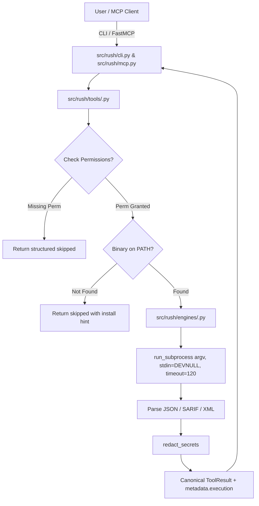

# Master Innovation & Remediation Build Plan: 77-Engine Phased Implementation Guide (Phases 09 – 19)

> **Document Type:** Master Implementation Blueprint & Architecture Guide  
> **Status:** Implemented & Verified across Phases 09–19 (All 77 Engines Integrated with Reference Test Suites and Implementation Ledgers)  
> **Target Scope:** Phased integration of all 77 innovative and vibecoder tools into Rush CLI  
> **Target Versions:** Rush v0.3.0 through v0.9.0  
> **Repository Alignment:** Python 3.12, stdio MCP transport + Click CLI, canonical `ToolResult`, explicit execution permissions (`--allow-*`), offline-first default posture, isolated bounded subprocess execution (`stdin=DEVNULL`, `shell=False`).

---

## 1. Architectural Foundation & Master Execution Standards

Every engine integrated into Rush must strictly adhere to the project's canonical architecture, safety invariants, and execution protocols.



### Core Implementation Invariants

1. **Dual Transport, Single Implementation:**
   - Both Click CLI (`src/rush/cli.py`) and FastMCP (`src/rush/mcp.py`) must call the exact same `ToolFn` instances in `src/rush/tools/`.
   - Never duplicate engine invocation logic in CLI or MCP transport layers.

2. **Isolated Subprocess Boundary:**
   - All external engine commands must be invoked via `run_subprocess(argv, cwd=target_path, timeout=...)`.
   - Arguments must be passed as `list[str]` (never strings).
   - `shell=False` is strictly enforced.
   - `stdin=subprocess.DEVNULL` is mandatory to prevent child processes from consuming MCP stdio transport frames.
   - Bounded stdout/stderr capture with redaction applied before emission.

3. **Explicit Execution Permissions:**
   - Execution permissions are denied by default.
   - Engines requiring external capabilities must be gated by `check_permissions()` against `ExecutionPermissions`:
     - `--allow-network`: Live network requests (APIs, crawlers, remote registries).
     - `--allow-download`: Fetching vulnerability feeds, rule sets, or schemas.
     - `--allow-cache-write`: Writing local engine caches.
     - `--allow-build`: Compiling code, building containers, or running database engines.
     - `--allow-slow`: Long-running test matrices, mutation runs, or fuzzers.
     - `--allow-artifact-write`: Mutating files or generating baseline/report artifacts.
     - `--allow-browser`: Launching headless browser instances (Playwright, Chromium).

4. **Canonical ToolResult & Finding Normalization:**
   - Every execution returns the canonical `ToolResult` dictionary:
     ```python
     {
         "tool": str,
         "engine": str,
         "engine_version": str | None,
         "status": "ok" | "warn" | "fail" | "skipped" | "error",
         "duration_ms": int,
         "summary": str,
         "findings": list[Finding],
         "raw": str,
         "metrics": dict[str, Any],
         "artifacts": list[dict[str, Any]],
         "metadata": {
             "execution": {
                 "mode": "executed" | "imported" | "artifact",
                 "requested_permissions": dict[str, bool],
                 "granted_permissions": dict[str, bool],
                 "producer": str,
                 "report_path": str | None,
             }
         }
     }
     ```

5. **Missing Binary & Offline Safety:**
   - If an optional binary is not found on `PATH`, the adapter must return a structured `skipped` result with an installation hint.
   - It must **never raise `FileNotFoundError` or unhandled exceptions**.
   - Default commands must never attempt network downloads or silent installations.

6. **Deterministic Fake-Process Testing:**
   - Every engine adapter must have a corresponding reference test suite in `tests/test_<engine>_reference.py`.
   - Tests must monkeypatch `rush.engines.<engine>.run_subprocess` with deterministic fixtures (clean output, findings output, syntax error output, timeout error).
   - Every promoted engine must be registered in `PARSER_FIXTURE_SUITES` in `src/rush/catalog.py` and pass `tests/test_phase01_truth_audit.py`.

---

## 2. Phase-by-Phase Implementation Blueprints

---

### Phase 09: AI, LLM & Agentic Systems Safety

#### Objective & Scope
Integrate LLM testing, red-teaming, RAG evaluation, and deterministic guardrail policy validation directly into Rush CLI and MCP.

#### Engines & Tools in Phase 09 (4 Tools)
1. **Promptfoo (`promptfoo`)**: Prompt injection, agent workflow testing, tool-calling validation (`promptfoo eval --config <file> --output <file> --no-table`).
2. **Garak (`garak`)**: Generative AI vulnerability scanner & redteaming probe matrix (`python -m garak --model_type test --report_prefix <prefix>`).
3. **DeepEval (`deepeval`)**: RAG/LLM metric evaluation framework for hallucination, faithfulness, and answer relevancy (`deepeval test run --json-report=<file>`).
4. **NeMo Guardrails (`guardrails-cli`)**: Deterministic safety linter for Colang `.co` flows and guardrail policies (`guardrails validate --config <dir> --format json`).

#### Codebase File Targets
- `src/rush/engines/promptfoo.py`
- `src/rush/engines/garak.py`
- `src/rush/engines/deepeval.py`
- `src/rush/engines/guardrails.py`
- `src/rush/tools/ai_eval.py` (New dedicated `ai-eval` tool)
- `src/rush/catalog.py` (Register engines, maturities, and test suites)
- `src/rush/cli.py` (Wire `rush ai-eval <path>` with `--config` and permission options)
- `src/rush/mcp.py` (Expose `rush_ai-eval` FastMCP endpoint)

#### Permission Requirements
- `promptfoo`, `garak`, `deepeval`: Require `--allow-slow` (inference passes) and `--allow-network` (when querying remote LLM APIs).
- `guardrails-cli`: Offline static analysis (no permissions required).

#### Reference Test Suites
- `tests/test_promptfoo_reference.py`
- `tests/test_garak_reference.py`
- `tests/test_deepeval_reference.py`
- `tests/test_guardrails_reference.py`

---

### Phase 10: Modern SAST, Privacy & Deep Secret Detection

#### Objective & Scope
Expand static analysis with sensitive PII data flow tracking, multi-language SAST orchestration, and verified vs unverified secret detection.

#### Engines & Tools in Phase 10 (5 Tools)
5. **Bearer CLI (`bearer`)**: Privacy & PII data flow SAST scanner (`bearer scan . --format json --output <file> --quiet`).
6. **TruffleHog v3 (`trufflehog`)**: High-entropy secret scanner with verified detection (`trufflehog filesystem . --json --no-verification`).
7. **Horusec (`horusec`)**: 15+ language SAST orchestrator (`horusec start -p . -o json -O <file> -s LOW -D`).
8. **Secretlint (`secretlint`)**: Sub-second pre-commit secret linter (`secretlint "**/*" --format json`).
9. **Detect-Secrets (`detect-secrets`)**: Yelp's baseline-managed secret detector (`detect-secrets scan --all-files --baseline <file>`).

#### Codebase File Targets
- `src/rush/engines/bearer.py`
- `src/rush/engines/trufflehog.py`
- `src/rush/engines/horusec.py`
- `src/rush/engines/secretlint.py`
- `src/rush/engines/detect_secrets.py`
- `src/rush/tools/secrets.py` & `src/rush/tools/security.py` (Update routing and aggregation)
- `src/rush/catalog.py`, `src/rush/cli.py`, `src/rush/mcp.py`

#### Permission Requirements
- `trufflehog`: Offline by default (`--no-verification`); `--allow-network` enables verified provider checks.
- `bearer`, `horusec`, `secretlint`, `detect-secrets`: Offline static inspection.

#### Reference Test Suites
- `tests/test_bearer_reference.py`
- `tests/test_trufflehog_reference.py`
- `tests/test_horusec_reference.py`
- `tests/test_secretlint_reference.py`
- `tests/test_detect_secrets_reference.py`

---

### Phase 11: Supply Chain Security, Attestation & Governance

#### Objective & Scope
Automate repository security posture scoring, deep license compatibility auditing, SLSA provenance verification, and artifact graph composition.

#### Engines & Tools in Phase 11 (5 Tools)
10. **OpenSSF Scorecard (`scorecard`)**: Automated supply chain posture evaluator (`scorecard --repo=. --format=json`).
11. **ScanCode Toolkit (`scancode`)**: Deep license expression and copyright analyzer (`scancode --license --copyright --json-pp <file> .`).
12. **SLSA Verifier (`slsa-verifier`)**: Cryptographic SLSA provenance validator (`slsa-verifier verify-artifact <path> --provenance-path <path>`).
13. **GUAC CLI (`guacone`)**: Graph for Understanding Artifact Composition (`guacone collect files <file> --format json`).
14. **Pip-Licenses (`pip-licenses`)**: Python license auditor and copyleft risk checker (`pip-licenses --format=json --output-file=<file>`).

#### Codebase File Targets
- `src/rush/engines/scorecard.py`
- `src/rush/engines/scancode.py`
- `src/rush/engines/slsa_verifier.py`
- `src/rush/engines/guac.py`
- `src/rush/engines/pip_licenses.py`
- `src/rush/tools/sbom.py` & `src/rush/tools/release.py` & `src/rush/tools/ci.py`
- `src/rush/catalog.py`, `src/rush/cli.py`, `src/rush/mcp.py`

#### Permission Requirements
- `scorecard`: `--allow-network` for GitHub API checks; offline fallback mode.
- `slsa-verifier`: `--allow-network` for Rekor transparency log lookups.
- `scancode`: `--allow-slow` for deep file scans.
- `guacone`, `pip-licenses`: Offline inspection.

#### Reference Test Suites
- `tests/test_scorecard_reference.py`
- `tests/test_scancode_reference.py`
- `tests/test_slsa_verifier_reference.py`
- `tests/test_guac_reference.py`
- `tests/test_pip_licenses_reference.py`

---

### Phase 12: Cloud-Native, Kubernetes & Policy-as-Code

#### Objective & Scope
Implement comprehensive OPA Rego policy validation across Terraform, CloudFormation, Kubernetes YAML, and Helm charts.

#### Engines & Tools in Phase 12 (5 Tools)
15. **Terrascan (`terrascan`)**: 500+ OPA Rego security policies for IaC (`terrascan scan -i terraform -d . -o json`).
16. **Kube-score (`kube-score`)**: Kubernetes manifest reliability & security analyzer (`kube-score score <files> --output-format json`).
17. **Conftest (`conftest`)**: Generic structured configuration policy testing with OPA Rego (`conftest test . -o json -p policy/`).
18. **Polaris (`polaris`)**: Kubernetes configuration audit engine (`polaris audit --audit-path <dir> --format json`).
19. **KubeLinter (`kube-linter`)**: Red Hat/StackRox Kubernetes production-readiness linter (`kube-linter lint . --format json`).

#### Codebase File Targets
- `src/rush/engines/terrascan.py`
- `src/rush/engines/kube_score.py`
- `src/rush/engines/conftest.py`
- `src/rush/engines/polaris.py`
- `src/rush/engines/kube_linter.py`
- `src/rush/tools/iac.py` (Aggregate IaC engines: TFLint, Checkov, Kubeconform, Terrascan, Kube-score, Polaris, KubeLinter)
- `src/rush/catalog.py`, `src/rush/cli.py`, `src/rush/mcp.py`

#### Permission Requirements
- All Phase 12 engines operate strictly offline against local configuration files.

#### Reference Test Suites
- `tests/test_terrascan_reference.py`
- `tests/test_kube_score_reference.py`
- `tests/test_conftest_reference.py`
- `tests/test_polaris_reference.py`
- `tests/test_kube_linter_reference.py`

---

### Phase 13: API Security, Contract Evolution & Schema Fuzzing

#### Objective & Scope
Upgrade API contract testing from static validation to stateful schema fuzzing, GraphQL breaking change detection, and API collection testing.

#### Engines & Tools in Phase 13 (5 Tools)
20. **Schemathesis (`schemathesis`)**: Property-based API contract fuzzer (`schemathesis run <spec> --report junit --output-path <file>`).
21. **Zally (`zally`)**: RESTful API design quality and architectural guideline linter (`zally lint <spec> --format json`).
22. **GraphQL-Inspector (`graphql-inspector`)**: GraphQL schema diff and breaking change detector (`graphql-inspector diff <old> <new> --output format=json`).
23. **Cherrybomb (`cherrybomb`)**: OpenAPI OWASP Top 10 security validator (`cherrybomb --file <spec> --format json --output <file>`).
24. **Newman (`newman`)**: CLI Postman collection runner (`newman run <collection> --reporters json --reporter-json-export <file>`).

#### Codebase File Targets
- `src/rush/engines/schemathesis.py`
- `src/rush/engines/zally.py`
- `src/rush/engines/graphql_inspector.py`
- `src/rush/engines/cherrybomb.py`
- `src/rush/engines/newman.py`
- `src/rush/tools/contract.py` & `src/rush/tools/fuzz.py` (Upgrade dual-mode execution)
- `src/rush/catalog.py`, `src/rush/cli.py`, `src/rush/mcp.py`

#### Permission Requirements
- `schemathesis`, `newman`: Dual mode: static validation offline; live endpoint fuzzing/testing requires `--allow-network` and `--allow-slow`.
- `zally`, `graphql-inspector`, `cherrybomb`: Offline static analysis.

#### Reference Test Suites
- `tests/test_schemathesis_reference.py`
- `tests/test_zally_reference.py`
- `tests/test_graphql_inspector_reference.py`
- `tests/test_cherrybomb_reference.py`
- `tests/test_newman_reference.py`

---

### Phase 14: Architecture, Code Modernization & Software Sustainability

#### Objective & Scope
Enforce architectural boundaries, detect circular dependencies, modernize legacy Python syntax, and calculate computational energy footprints.

#### Engines & Tools in Phase 14 (6 Tools)
25. **Dependency-Cruiser (`depcruise`)**: JS/TS architectural boundary & circular dependency linter (`depcruise src --output-type json`).
26. **Refurb (`refurb`)**: Python code modernizer and elegance checker (`refurb --format json .`).
27. **Biome (`biome`)**: Ultra-fast Rust-based JS/TS linter and formatter (`biome check --reporter=json .`).
28. **Scaphandre / Eco-CI (`scaphandre`)**: Software energy consumption and carbon emission estimator (`scaphandre json --timeout 30 --output <file>`).
29. **FawltyDeps (`fawltydeps`)**: Undeclared import and unused dependency auditor for Python (`fawltydeps --json --detailed`).
30. **Ts-prune (`ts-prune`)**: Unused TypeScript export and dead interface finder (`ts-prune --json`).

#### Codebase File Targets
- `src/rush/engines/depcruise.py`
- `src/rush/engines/refurb.py`
- `src/rush/engines/biome.py`
- `src/rush/engines/scaphandre.py`
- `src/rush/engines/fawltydeps.py`
- `src/rush/engines/ts_prune.py`
- `src/rush/tools/lint.py`, `src/rush/tools/format.py`, `src/rush/tools/dead.py`, `src/rush/tools/complexity.py`
- `src/rush/catalog.py`, `src/rush/cli.py`, `src/rush/mcp.py`

#### Permission Requirements
- `scaphandre`: Requires `--allow-slow` and local OS metric access (RAPL).
- `depcruise`, `refurb`, `biome`, `fawltydeps`, `ts-prune`: Offline static analysis.

#### Reference Test Suites
- `tests/test_depcruise_reference.py`
- `tests/test_refurb_reference.py`
- `tests/test_biome_reference.py`
- `tests/test_scaphandre_reference.py`
- `tests/test_fawltydeps_reference.py`
- `tests/test_ts_prune_reference.py`

---

### Phase 15: Modern Web Standards, Accessibility & Safe DAST

#### Objective & Scope
Provide automated WCAG accessibility audits, W3C HTML validation, Core Web Vitals profiling, dead route crawling, and safe DAST vulnerability scanning.

#### Engines & Tools in Phase 15 (7 Tools)
31. **Pa11y (`pa11y`)**: Automated WCAG 2.1 AA/AAA accessibility tester (`pa11y --reporter json <file/url>`).
32. **HTML-Validate (`html-validate`)**: Strict W3C HTML validator (`html-validate --formatter json "**/*.html"`).
33. **Lighthouse CLI (`lighthouse`)**: Headless Core Web Vitals & SEO auditor (`lighthouse <url> --output=json --output-path=<file>`).
34. **OWASP ZAP CLI (`zap-cli`)**: Dynamic Application Security Testing for local web services (`zap-cli quick-scan --self-contained --format json <url>`).
35. **Deadfinder (`deadfinder`)**: SPA web route crawler detecting 404s and broken links (`deadfinder <url> --json`).
36. **Broken-Link-Checker (`blc`)**: Recursive internal anchor tag and redirect validator (`blc <url> -ro --json`).
37. **PageSpeed-CLI (`pagespeed-insights`)**: Real-world web performance auditor (`pagespeed-insights <url> --format json`).

#### Codebase File Targets
- `src/rush/engines/pa11y.py`
- `src/rush/engines/html_validate.py`
- `src/rush/engines/lighthouse.py`
- `src/rush/engines/zap.py`
- `src/rush/engines/deadfinder.py`
- `src/rush/engines/blc.py`
- `src/rush/engines/pagespeed.py`
- `src/rush/tools/semantic_drift.py`, `src/rush/tools/visual.py`, `src/rush/tools/security.py`, `src/rush/tools/templates.py`
- `src/rush/catalog.py`, `src/rush/cli.py`, `src/rush/mcp.py`

#### Permission Requirements
- `pa11y`, `lighthouse`, `zap-cli`, `deadfinder`, `blc`, `pagespeed`: Require `--allow-browser`, `--allow-network`, and `--allow-slow`.
- `html-validate`: Offline static analysis.

#### Reference Test Suites
- `tests/test_pa11y_reference.py`
- `tests/test_html_validate_reference.py`
- `tests/test_lighthouse_reference.py`
- `tests/test_zap_reference.py`
- `tests/test_deadfinder_reference.py`
- `tests/test_blc_reference.py`
- `tests/test_pagespeed_reference.py`

---

### Phase 16: Advanced Polyglot Mutation Testing & Fault Injection

#### Objective & Scope
Expand mutation testing across JavaScript/TypeScript, Python, PHP, JVM (Java/Kotlin), and Rust with standardized mutation score metrics.

#### Engines & Tools in Phase 16 (5 Tools)
38. **Stryker Mutator (`stryker`)**: High-performance mutation testing for JS/TS/C# (`stryker run --reporters json`).
39. **Cosmic Ray (`cosmic-ray`)**: Distributed Python mutation testing engine (`cosmic-ray exec <config> <db> && cosmic-ray dump <db>`).
40. **Infection PHP (`infection`)**: AST-based mutation testing framework for PHP (`infection --json=<file> --no-interaction`).
41. **Pitest / PIT (`pitest`)**: Bytecode mutation testing system for Java/Kotlin (`mvn org.pitest:pitest-maven:mutationCoverage -DoutputFormats=JSON`).
42. **Cargo-mutants (`cargo-mutants`)**: Rust AST expression mutation testing engine (`cargo mutants --json --no-shuffle`).

#### Codebase File Targets
- `src/rush/engines/stryker.py`
- `src/rush/engines/cosmic_ray.py`
- `src/rush/engines/infection.py`
- `src/rush/engines/pitest.py`
- `src/rush/engines/cargo_mutants.py`
- `src/rush/tools/mutation.py` (Upgrade polyglot language routing and executed runner)
- `src/rush/catalog.py`, `src/rush/cli.py`, `src/rush/mcp.py`

#### Permission Requirements
- All Phase 16 mutation runners require `--allow-slow` (and `--allow-build` for compiled languages).

#### Reference Test Suites
- `tests/test_stryker_reference.py`
- `tests/test_cosmic_ray_reference.py`
- `tests/test_infection_reference.py`
- `tests/test_pitest_reference.py`
- `tests/test_cargo_mutants_reference.py`

---

### Phase 17: UI/UX, Visual Regression & Web Asset Optimization

#### Objective & Scope
Integrate multi-viewport responsive visual testing, Storybook component diffing, CSS architecture linting, and lossless image/font compression.

#### Engines & Tools in Phase 17 (7 Tools)
43. **Lost Pixel (`lost-pixel`)**: Visual regression testing for Storybook, Next.js, and Ladle (`lost-pixel update --json`).
44. **BackstopJS (`backstopjs`)**: Multi-viewport responsive visual regression tester (`backstop test --config=<file> --reporter=json`).
45. **Stylelint (`stylelint`)**: Modern CSS/SCSS/Less and CSS-in-JS linter (`stylelint "**/*.css" --formatter json`).
46. **A11yWatch (`a11ywatch`)**: Multi-page web accessibility crawler (`a11ywatch scan --url <url> --json`).
47. **Squoosh-CLI / Sharp-CLI (`squoosh-cli`)**: Next-generation WebP/AVIF image compressor (`squoosh-cli --webp auto --output-dir <dir> <files>`).
48. **Critical (`critical`)**: Above-the-fold CSS extraction and inlining engine (`critical <file> --base <dir> --inline`).
49. **Font-Spider (`font-spider`)**: Web font compressor stripping unneeded font glyphs (`font-spider <files> --info`).

#### Codebase File Targets
- `src/rush/engines/lost_pixel.py`
- `src/rush/engines/backstop.py`
- `src/rush/engines/stylelint.py`
- `src/rush/engines/a11ywatch.py`
- `src/rush/engines/squoosh.py`
- `src/rush/engines/critical.py`
- `src/rush/engines/font_spider.py`
- `src/rush/tools/visual.py`, `src/rush/tools/lint.py`, `src/rush/tools/format.py`, `src/rush/tools/assets.py` (New `assets` tool)
- `src/rush/catalog.py`, `src/rush/cli.py`, `src/rush/mcp.py`

#### Permission Requirements
- `lost-pixel`, `backstop`, `a11ywatch`: Require `--allow-browser` and `--allow-slow`.
- `squoosh`, `critical`, `font_spider`: Offline; require `--allow-artifact-write` for in-place file transformation.
- `stylelint`: Offline static analysis.

#### Reference Test Suites
- `tests/test_lost_pixel_reference.py`
- `tests/test_backstop_reference.py`
- `tests/test_stylelint_reference.py`
- `tests/test_a11ywatch_reference.py`
- `tests/test_squoosh_reference.py`
- `tests/test_critical_reference.py`
- `tests/test_font_spider_reference.py`

---

### Phase 18: Advanced AST Linters, Pattern Matchers & Database Schemas

#### Objective & Scope
Incorporate Tree-sitter AST queries across 20+ languages, deep logic bug finders, structural code matchers, and zero-downtime database migration linters.

#### Engines & Tools in Phase 18 (7 Tools)
50. **ast-grep (`ast-grep` / `sg`)**: Tree-sitter AST structural search and linting engine (`ast-grep scan --json=compact --include-metadata`).
51. **Flake8-Bugbear (`flake8-bugbear`)**: Python AST linter for subtle design bugs and logic errors (`flake8 --select=B,B9 --format=json .`).
52. **MegaLinter (`megalinter`)**: Universal polyglot linter orchestrator covering 100+ languages (`megalinter --report-format json`).
53. **Comby (`comby`)**: Syntactic pattern matcher and safe multi-file refactoring engine (`comby ':[match]' ':[replace]' .json -match-only -json-lines`).
54. **Atlas (`atlas`)**: Declarative database schema and migration safety linter (`atlas migrate lint --dir <dir> --format '{{ json . }}'`).
55. **Squawk (`squawk`)**: Dedicated PostgreSQL migration lock linter (`squawk --format=json <files>`).
56. **Prisma-lint (`prisma-lint`)**: Schema linter for Prisma ORM relations and model conventions (`prisma-lint --format=json <file>`).

#### Codebase File Targets
- `src/rush/engines/ast_grep.py`
- `src/rush/engines/flake8_bugbear.py`
- `src/rush/engines/megalinter.py`
- `src/rush/engines/comby.py`
- `src/rush/engines/atlas.py`
- `src/rush/engines/squawk.py`
- `src/rush/engines/prisma_lint.py`
- `src/rush/tools/review.py`, `src/rush/tools/lint.py`, `src/rush/tools/sql.py`
- `src/rush/catalog.py`, `src/rush/cli.py`, `src/rush/mcp.py`

#### Permission Requirements
- `atlas`: Requires `--allow-build` if spinning up ephemeral container database engines.
- `ast-grep`, `flake8-bugbear`, `comby`, `squawk`, `prisma-lint`: Offline static analysis.

#### Reference Test Suites
- `tests/test_ast_grep_reference.py`
- `tests/test_flake8_bugbear_reference.py`
- `tests/test_megalinter_reference.py`
- `tests/test_comby_reference.py`
- `tests/test_atlas_reference.py`
- `tests/test_squawk_reference.py`
- `tests/test_prisma_lint_reference.py`

---

### Phase 19: Documentation Style, Performance, Protocols & Vibecoder Quality Guardrails

#### Objective & Scope
Finalize documentation prose quality, memory profiling, Protocol Buffers/gRPC, container layer security, WebAssembly validation, and complete the Vibecoder Quality Guardrails suite.

#### Engines & Tools in Phase 19 (21 Tools)
57. **Vale (`vale`)**: Syntax-aware documentation and prose style linter (`vale --output=JSON --no-wrap <dir>`).
58. **CSpell (`cspell`)**: Code-aware spelling checker for camelCase and identifiers (`cspell lint "**/*" --reporter @cspell/cspell-json-reporter`).
59. **Alex (`alex`)**: Inclusive language and considerate terminology linter (`alex --json .`).
60. **Readability-CLI / Hemingway (`readability-cli`)**: Flesch-Kincaid grade level and prose complexity analyzer (`readability-cli <file> --json`).
61. **RedPen (`redpen`)**: Technical documentation vocabulary and style guide validator (`redpen -c <config> -f json <dir>`).
62. **No-Jargon (`no-jargon`)**: Corporate buzzword and marketing fluff detector (`no-jargon "**/*.md" --json`).
63. **Markdown-Unfluff (`markdown-unfluff`)**: Repetitive AI bullet-point and formatting cleaner (`markdown-unfluff . --format json`).
64. **Memray (`memray`)**: High-resolution Python memory allocation and leak profiler (`memray run -m pytest && memray summary --json <file>`).
65. **Statoscope (`statoscope`)**: JavaScript bundle size and duplicate package analyzer (`statoscope validate --input stats.json --format json`).
66. **Bloaty McBloatface (`bloaty`)**: Native ELF/Mach-O/Wasm binary size dissector (`bloaty -d compileunits,symbols --csv <binary>`).
67. **Buf (`buf`)**: Protocol Buffers/gRPC linter and breaking change detector (`buf lint --error-format=json`).
68. **Dockle (`dockle`)**: Container image security and CIS Docker benchmark linter (`dockle --format json --output <file> <image>`).
69. **Wasm-tools (`wasm-tools`)**: WebAssembly binary validator and parser (`wasm-tools validate --json <file>`).
70. **PyClean (`pyclean`)**: Bytecode cache and temporary artifact cleaner (`pyclean . --dry-run`).
71. **Diff-Cover (`diff-cover`)**: Diff-only test coverage analyzer (`diff-cover <file> --compare-branch=main --json-report=<file>`).
72. **Git-Guard (`git-guard`)**: Git checkout hygiene and untracked file validator (`git status --porcelain=v2 --branch`).
73. **Semantic-Release CLI (`semantic-release`)**: Automated semantic version bump calculator (`semantic-release --dry-run --no-ci`).
74. **PR-Agent (`pr-agent`)**: Structured pull request diff summary generator (`pr-agent --pr_url=local --output=json`).
75. **Safe-Env (`safe-env`)**: Environment variable sanity checker detecting default dev secrets (`safe-env check <file> --json`).
76. **Wait-On (`wait-on`)**: Local port and HTTP health endpoint poller (`wait-on <url> --timeout <ms>`).
77. **NPM-Check-Updates (`ncu`)**: Dependency upgrade and deprecation detector (`npx npm-check-updates --format json`).

#### Codebase File Targets
- `src/rush/engines/` (21 new engine modules)
- `src/rush/tools/markdown.py`, `src/rush/tools/humanize.py`, `src/rush/tools/clean.py`, `src/rush/tools/env.py`, `src/rush/tools/preflight.py`
- `src/rush/catalog.py`, `src/rush/cli.py`, `src/rush/mcp.py`

#### Permission Requirements
- `memray`, `diff-cover`: Require `--allow-slow` (and `--allow-build` for native profiling).
- `pyclean`: `--allow-artifact-write` for file deletion.
- `wait-on`: `--allow-network` for localhost port polling.
- All prose, spellcheck, environment, and container engines operate offline by default.

#### Reference Test Suites
- 21 reference test suites in `tests/test_*_reference.py`.

---

## 3. Universal Documentation Audit & Synchronization Protocol

Upon completion of each individual phase, the executing agent must update **all** documentation files listed below to maintain 100% coherence across the repository:

| Documentation File | Required Phase Update Content |
|---|---|
| `docs/TOOL_CATALOG.md` | Add/update maturity status (`real_adapter`, `importer`, `browser_runtime`), supported languages, and primary engines. |
| `docs/ENGINE_COMPATIBILITY.md` | Add engine name, binary name, execution mode, required permissions, and timeout rules. |
| `docs/CLI_REFERENCE.md` | Add CLI command syntax, flags, options, and exit codes. |
| `docs/reference/cli-reference.md` | Mirror CLI reference with technical specifications. |
| `docs/ENGINES.md` | Add engine directory entry, description, install hints, and offline defaults. |
| `docs/reference/engine-directory.md` | Mirror engine directory entry. |
| `docs/MCP_REFERENCE.md` | Document FastMCP tool names (`rush_<name>`), argument schemas, and permissions. |
| `docs/reference/mcp-tool-reference.md` | Mirror MCP tool reference. |
| `docs/user-guide/advanced-checks.md` | Document advanced check options, reports, and permission flags. |
| `docs/safety/permissions.md` | Document any new permission flags or execution boundaries. |
| `docs/DEVELOPER_GUIDE.md` | Update roadmap references, phase handoffs, and tool counts. |
| `CHANGELOG.md` | Add release notes under the corresponding phase milestone. |
| `.hermes/implementation/phase-XX-ledger.md` | Create dedicated execution ledger capturing git commits, test results, and error logs. |

---

## 4. Master Dependency & Tool Discovery Matrix

| # | Engine / Tool | Binary Name | Ecosystem | Default Posture | Required Permissions |
|---|---|---|---|---|---|
| 1 | Promptfoo | `promptfoo` | Node.js | Offline config | `--allow-network`, `--allow-slow` |
| 2 | Garak | `garak` | Python | Offline probe | `--allow-network`, `--allow-slow` |
| 3 | DeepEval | `deepeval` | Python | Offline pytest | `--allow-slow`, `--allow-network` |
| 4 | NeMo Guardrails | `guardrails-cli` | Python | Offline | None |
| 5 | Bearer CLI | `bearer` | Go | Offline | `--allow-slow` |
| 6 | TruffleHog v3 | `trufflehog` | Go | Offline unverified | `--allow-network` (for live verify) |
| 7 | Horusec | `horusec` | Go | Offline | None |
| 8 | Secretlint | `secretlint` | Node.js | Offline | None |
| 9 | Detect-Secrets | `detect-secrets` | Python | Offline | None |
| 10 | OpenSSF Scorecard | `scorecard` | Go | Offline | `--allow-network` (for GitHub API) |
| 11 | ScanCode Toolkit | `scancode` | Python | Offline | `--allow-slow` |
| 12 | SLSA Verifier | `slsa-verifier` | Go | Offline | `--allow-network` (for Rekor log) |
| 13 | GUAC CLI | `guacone` | Go | Offline | None |
| 14 | Pip-Licenses | `pip-licenses` | Python | Offline | None |
| 15 | Terrascan | `terrascan` | Go | Offline | None |
| 16 | Kube-score | `kube-score` | Go | Offline | None |
| 17 | Conftest | `conftest` | Go | Offline | None |
| 18 | Polaris | `polaris` | Go | Offline | None |
| 19 | KubeLinter | `kube-linter` | Go | Offline | None |
| 20 | Schemathesis | `schemathesis` | Python | Offline spec | `--allow-network`, `--allow-slow` |
| 21 | Zally | `zally` | Java / Docker | Offline | None |
| 22 | GraphQL-Inspector | `graphql-inspector` | Node.js | Offline | None |
| 23 | Cherrybomb | `cherrybomb` | Rust | Offline | None |
| 24 | Newman | `newman` | Node.js | Live local | `--allow-network` |
| 25 | Dependency-Cruiser| `depcruise` | Node.js | Offline | None |
| 26 | Refurb | `refurb` | Python | Offline | None |
| 27 | Biome | `biome` | Rust | Offline | None |
| 28 | Scaphandre | `scaphandre` | Rust | Local RAPL | `--allow-slow` |
| 29 | FawltyDeps | `fawltydeps` | Python | Offline | None |
| 30 | Ts-prune | `ts-prune` | Node.js | Offline | None |
| 31 | Pa11y | `pa11y` | Node.js | Live local | `--allow-browser` |
| 32 | HTML-Validate | `html-validate` | Node.js | Offline | None |
| 33 | Lighthouse CLI | `lighthouse` | Node.js | Headless Chrome| `--allow-browser`, `--allow-slow` |
| 34 | OWASP ZAP CLI | `zap-cli` | Python / Java | Localhost DAST | `--allow-network`, `--allow-slow` |
| 35 | Deadfinder | `deadfinder` | Go | Live local | `--allow-network` |
| 36 | Broken-Link-Check | `blc` | Node.js | Live local | `--allow-network` |
| 37 | PageSpeed-CLI | `pagespeed-insights`| Node.js | Remote audit | `--allow-network`, `--allow-slow` |
| 38 | Stryker Mutator | `stryker` | Node.js / .NET| Offline | `--allow-slow` |
| 39 | Cosmic Ray | `cosmic-ray` | Python | Offline | `--allow-slow` |
| 40 | Infection PHP | `infection` | PHP | Offline | `--allow-slow` |
| 41 | Pitest (PIT) | `pitest` | Java | Offline bytecode| `--allow-slow`, `--allow-build` |
| 42 | Cargo-mutants | `cargo-mutants` | Rust | Offline AST | `--allow-slow`, `--allow-build` |
| 43 | Lost Pixel | `lost-pixel` | Node.js | Headless screenshot| `--allow-browser`, `--allow-slow` |
| 44 | BackstopJS | `backstop` | Node.js | Multi-viewport | `--allow-browser`, `--allow-slow` |
| 45 | Stylelint | `stylelint` | Node.js | Offline | None |
| 46 | A11yWatch | `a11ywatch` | Rust / Node.js | DOM crawl | `--allow-browser`, `--allow-network`|
| 47 | Squoosh-CLI | `squoosh-cli` | Node.js / Rust | Offline | `--allow-artifact-write` |
| 48 | Critical | `critical` | Node.js | Offline | `--allow-artifact-write` |
| 49 | Font-Spider | `font-spider` | Node.js | Offline | `--allow-artifact-write` |
| 50 | ast-grep | `ast-grep` | Rust | Offline AST | None |
| 51 | Flake8-Bugbear | `flake8` | Python | Offline AST | None |
| 52 | MegaLinter | `megalinter` | Python / Docker| Offline | `--allow-slow` |
| 53 | Comby | `comby` | OCaml | Offline AST | None |
| 54 | Atlas | `atlas` | Go | Offline SQL AST| `--allow-build` (for dev container)|
| 55 | Squawk | `squawk` | Rust / Node.js | Offline SQL | None |
| 56 | Prisma-lint | `prisma-lint` | Node.js | Offline | None |
| 57 | Vale | `vale` | Go | Offline | None |
| 58 | CSpell | `cspell` | Node.js | Offline | None |
| 59 | Alex | `alex` | Node.js | Offline | None |
| 60 | Readability-CLI | `readability-cli` | Node.js / Python| Offline | None |
| 61 | RedPen | `redpen` | Java | Offline | None |
| 62 | No-Jargon | `no-jargon` | Node.js | Offline | None |
| 63 | Markdown-Unfluff | `markdown-unfluff` | Python | Offline | None |
| 64 | Memray | `memray` | Python / C | Local allocation| `--allow-slow`, `--allow-build` |
| 65 | Statoscope | `statoscope` | Node.js | Offline | None |
| 66 | Bloaty McBloatface| `bloaty` | C++ | Offline symbol | None |
| 67 | Buf | `buf` | Go | Offline | None |
| 68 | Dockle | `dockle` | Go | Local image | None |
| 69 | Wasm-tools | `wasm-tools` | Rust | Offline binary | None |
| 70 | PyClean | `pyclean` | Python | Offline dry-run | `--allow-artifact-write` |
| 71 | Diff-Cover | `diff-cover` | Python | Offline git diff| None |
| 72 | Git-Guard | `git-guard` | Python / Bash | Offline git | None |
| 73 | Semantic-Release | `semantic-release` | Node.js / Python| Offline dry-run | None |
| 74 | PR-Agent | `pr-agent` | Python | Offline local | None |
| 75 | Safe-Env | `safe-env` | Python / Node.js| Offline | None |
| 76 | Wait-On | `wait-on` | Node.js | Local port poll | `--allow-network` |
| 77 | NPM-Check-Updates | `ncu` | Node.js | Offline cache | None |

---

## 5. Quality Assurance & Phase Verification Workflow

Before marking any individual phase complete, the executing coding agent must execute and pass the following quality gates in order:

```bash
# 1. Clear foreign virtualenv references
unset VIRTUAL_ENV PYTHONPATH

# 2. Run full pytest suite (must pass 100% of non-skipped unit & reference tests)
.venv/Scripts/python.exe -m pytest tests/ -q

# 3. Verify truth audit parity (enforces ToolResult, maturities, and fixture tests)
.venv/Scripts/python.exe -m pytest tests/test_phase01_truth_audit.py -q

# 4. Ruff linting check (zero errors allowed)
.venv/Scripts/ruff.exe check src tests

# 5. Ruff formatting check (zero unformatted files allowed)
.venv/Scripts/ruff.exe format --check src tests

# 6. Rebuild and verify graft code graph
graft --dir .hermes/graft build .
graft --dir .hermes/graft check .
```
