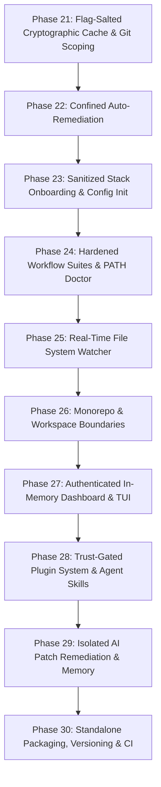

# Master Product Management Build Plan: Rush Platform Evolution (Phases 21–30)

> **Document Version:** 3.0.0 (Hardened with Red Team Security Controls & Brooks-Sweep Architectural Refinements)  
> **Status:** Approved for Implementation  
> **Target App Versioning:** Rush v0.2.0 → v0.3.0 → v1.0.0  
> **Repository:** `jamesdsizemore/rush-cli`  
> **Python Baseline:** Python 3.12 (managed via `uv`)  
> **Core Contract:** Stdio JSON-RPC FastMCP transport, stderr diagnostics, deterministic offline execution, zero docs drift, zero-trust repository safety.

---

## 1. Executive Summary & Hardened Architectural Brainstorming

This Master Build Plan operationalizes the recommendations from the Product Management Review (`pm-review.md`), deeply integrates all seven defensive security controls identified during the Red Team Adversarial Assessment, and incorporates the three architectural recommendations from the Brooks-Sweep audit.

Rush is evolving from a diagnostic-only quality CLI/MCP server into an active, incremental, extensible, and closed-loop quality operating system. Every capability is engineered with explicit zero-trust boundaries, deterministic cache salting, atomic in-memory asset compilation, and standardized structured logging to ensure that inspecting untrusted repositories or running automated agents never compromises developer hosts.

### 1.1 Architectural Brainstorming: Extensible Plugin System & Agent Skills (Phase 28)
- **The Challenge:** Teams require custom internal scanners and linters without modifying upstream Rush source code. However, executing arbitrary scripts from untrusted repositories poses a critical Remote Code Execution (RCE) risk (MITRE T1204.002).
- **The Zero-Trust Architecture:** Rush introduces a declarative plugin contract in `rush.toml` (`[plugins.<name>]`) and `.rush/plugins/`. Any executable (Python, Bash, Node, Go, Rust) emitting canonical `ToolResult` JSON on stdout is supported.
- **Defensive Trust Gating:** When Rush encounters untrusted plugins in a cloned repository, execution is blocked by default with a structured `untrusted` status. Execution requires explicit user authorization via `rush trust` or `--allow-untrusted-plugins`.
- **AI Agent Plugin Creation Engine:** We equip coding agents with specialized agent skills:
  - `rush-plugin-builder`: An autonomous agent skill that accepts natural language requirements, analyzes sample codebases, drafts custom regex/AST detection logic, writes executable plugin scripts, generates test fixtures, validates with `rush plugin validate`, and registers the plugin into `rush.toml`.
  - `rush-plugin-installer`: An agent skill that fetches, audits security permissions, tests, and installs plugins from Git repositories or local directories.

### 1.2 Architectural Brainstorming: Interactive TUI & Local Web Dashboard (Phase 27)
- **The Challenge:** Navigating hundreds of multi-engine findings in standard terminal streams causes cognitive fatigue, while local web dashboards are susceptible to Cross-Site Request Forgery (CSRF) and DNS rebinding attacks (MITRE T1189).
- **The TUI Architecture (`rush ui`):** Built on `rich.live` and `rich.layout`, providing keyboard navigation (arrows, Enter, Esc), severity filtering (clean/warn/fail/error), category trees, and instant file jumping via system editor (`$EDITOR`).
- **The Hardened Web Dashboard (`rush dashboard` / `rush serve --dashboard`):** A zero-dependency local web server built on standard library `http.server` / `asyncio`. It binds strictly to `127.0.0.1`, enforces cryptographic session token validation (`X-Rush-Auth`), pre-compiles all HTML/CSS/JS assets into immutable in-memory buffers upon startup, and validates `Host` and `Origin` headers on every request.

### 1.3 Architectural Brainstorming: Composite Workflow Suites & Environment Doctor (Phase 24)
- **The Challenge:** Developers juggle 8–10 distinct commands during their daily workflow, while diagnostic tools can suffer from PATH hijacking if local untrusted binaries shadow standard tools (MITRE T1574.009).
- **The Composite Suites:**
  - `rush check`: Fast developer inner loop (`tdd` → `format --check` → `lint` → `typecheck` → `slop` → `test`).
  - `rush audit`: Comprehensive security, supply chain, and compliance (`security` → `secrets` → `license` → `sbom` → `contract`).
  - `rush gate`: Pull request and merge verification gate (`coverage` with diff coverage → `mutation` → `complexity` → `review`).
  - `rush doctor`: Environment diagnostic and health check enforcing strict PATH precedence (virtual environment -> system PATH, rejecting relative `./` lookups) and alerting on shadowed binaries.

### 1.4 Architectural Brainstorming: Incremental Content-Hash Cache & Git Scoping (Phase 21)
- **The Challenge:** Large monorepos experience latency on full scans, but weak cache keys allow attackers to bypass security scanners via cache poisoning (MITRE T1565.001) or return stale findings when CLI invocation flags change.
- **The Cryptographic Cache Architecture:** SQLite database at `.rush/cache.db` storing findings keyed strictly by `SHA-256(file_content_bytes + tool_name + engine_version + config_hash + sorted_cli_flags)`. Never relies on file modification timestamps (`mtime`) as trusted proxies for integrity.
- **Git Scoping:** `--staged` (git index only), `--changed` (uncommitted modifications), and `--since <ref>` (diff against branch/tag).

### 1.5 Architectural Brainstorming: Unified Automated Remediation (Phase 22)
- **The Challenge:** Rush detects issues but manual fixing is tedious. Automated file editing risks arbitrary file overwrite or symlink escape (MITRE T1080).
- **The Confined Remediation Architecture:** `rush fix` dispatches `--fix`/`--write` flags to auto-fixable engines (`ruff --fix`, `biome --write`, `eslint --fix`, `prettier --write`, `ast-grep --update`). Enforces strict workspace root confinement (`Path.resolve().is_relative_to(repo_root)`), dirty-tree safety checks, and atomic rollbacks.

### 1.6 Architectural Brainstorming: Closed-Loop AI Agent Remediation & Context Memory (Phase 29)
- **The Challenge:** AI agents waste tokens parsing human text and are vulnerable to context injection payloads embedded in repository comments.
- **The Isolated Remediation Architecture:**
  - `ToolFinding` data structure is enriched with optional `patch` (unified diff string) and `suggested_fix`, validated against path traversal before application.
  - `.rush/session_memory.json` (or SQLite) maintains a sanitized ledger of past runs and conventions, wrapped in strict XML boundary frames to prevent model context hijacking.
  - Dedicated FastMCP tools: `rush_get_patch`, `rush_apply_fix`, `rush_session_context`.

---

## 2. Pinned Dependencies Baseline

To guarantee reproducibility, security, and zero runtime drift, all package dependencies are strictly pinned in `pyproject.toml`:

```toml
[project]
name = "rush-cli"
version = "0.2.0"
requires-python = ">=3.12,<3.13"

dependencies = [
    "mcp==1.28.1",          # Official Model Context Protocol SDK (stdio FastMCP)
    "click==8.4.2",         # CLI command routing and argument parsing
    "rich==13.9.4",         # Terminal pretty-printing, tables, and TUI layouts
    "pytest==9.0.3",        # Core test execution and assertions
    "watchfiles==1.0.4",    # High-performance Rust-based file system watcher
]

[project.optional-dependencies]
dev = [
    "pip-audit==2.10.1",    # Python dependency vulnerability auditing
    "ruff==0.16.3",         # Python linter and formatter
    "hatchling==1.32.0",    # PEP 517 build backend
]
```

---

## 3. Strict Development Process, Logging Schema & Security Invariants

Every phase in this plan must strictly follow this 8-step engineering verification protocol:

1. **Subprocess Safety & Argument Confinement**: All external engine invocations must use `src/rush/tools/common.py:run_subprocess()` with explicit argument lists `list[str]`, `stdin=subprocess.DEVNULL`, `shell=False`, 120s timeout, and diagnostics written strictly to `stderr`. Arbitrary shell string concatenation is strictly prohibited.
2. **Standardized Structured Stderr Tagging**: All diagnostic logs and error traces across all subsystems must use standardized prefix tags defined in `src/rush/logging.py`:
   - `[rush-cache:LEVEL]` for cache hits, misses, corruptions, and invalidations.
   - `[rush-fix:LEVEL]` for auto-remediation previews, applications, rollbacks, and security violations.
   - `[rush-setup:LEVEL]` and `[rush-init:LEVEL]` for stack discovery and configuration generation.
   - `[rush-doctor:LEVEL]` and `[rush-workflow:LEVEL]` for environment diagnostics and composite workflow execution.
   - `[rush-watch:LEVEL]` for file system change debouncing and tool triggering.
   - `[rush-workspace:LEVEL]` for monorepo boundary detection and package scoping.
   - `[rush-dashboard:LEVEL]` and `[rush-tui:LEVEL]` for dashboard server events and security alerts.
   - `[rush-plugin:LEVEL]` and `[rush-trust:LEVEL]` for plugin execution, trust gating, and schema validation.
   - `[rush-agent:LEVEL]` and `[rush-memory:LEVEL]` for MCP tool invocations, patch validation, and session memory framing.
   - `[rush-release:LEVEL]` for binary release checks and packaging.
3. **Deterministic Mock Testing**: Every engine adapter and tool must have a fixture-driven test file under `tests/` utilizing `mock_subprocess` with `clean.json`, `findings.json`, and `malformed.json` fixtures.
4. **Adversarial Security Unit Tests**: Every phase must include explicit negative/hostile unit tests verifying path traversal rejection, injection sanitization, flag-salting invalidation, or trust-gate enforcement.
5. **Pytest Verification**: 100% test pass rate (`.venv/Scripts/python.exe -m pytest tests/ -q`).
6. **Code Linter & Formatter**: Zero Ruff errors and 100% format compliance (`ruff check src tests scripts` and `ruff format --check src tests scripts`).
7. **Mandatory Documentation Synchronization**: Every phase must run `python scripts/sync_docs.py --update` and verify `python scripts/sync_docs.py --check` across all 149+ documentation files in `/docs`.
8. **Graft Architecture Sync**: Update the code graph with `graft --dir .hermes/graft build .` and verify `graft check .`.

---

## 4. Phase-by-Phase Master Implementation Plan



---

### Phase 21: Flag-Salted Cryptographic Cache & Git-Aware Scoping

**Goal:** Eliminate redundant scanner invocations on unchanged files via a content-hash SQLite cache with tamper resistance, CLI flag salting, and Git diff scoping flags.

- **Allowed Files:** `src/rush/`, `tests/`, `docs/`, `scripts/`
- **Files to Create:**
  - `src/rush/cache.py`: SQLite cache manager with SHA-256 byte hashing, composite key derivation with CLI flag salting, WAL mode, and parameterized queries.
  - `tests/test_cache.py`: Unit tests for cache hits, misses, invalidation, hash collision resistance, and flag salting.
  - `tests/test_git_scoping.py`: Tests for `--staged`, `--changed`, and `--since` file filtering.
- **Files to Modify:**
  - `src/rush/cli.py`: Add `--no-cache`, `--staged`, `--changed`, `--since`, and `rush cache` subcommands (`clean`, `stats`).
  - `src/rush/tools/common.py`: Integrate cache lookup and persistence around `run_subprocess()` and `ToolResult` generation.
  - `src/rush/config.py`: Add `[cache]` configuration section (`enabled`, `dir`, `max_size_mb`).
- **Defensive Hardening (Control 1 - Anti-Cache Poisoning & Flag Salting):**
  - Compute cache keys strictly from `SHA-256(file_content_bytes + tool_name + engine_version + config_table_hash + sorted_cli_flags)`. Never trust `mtime` or file size alone.
  - When CLI flags alter scanner execution (e.g. `--allow-slow`, `--check`, `--format`, `--target`), the cache key reflects the specific flag configuration, preventing stale clean returns on modified invocations.
  - Validate SQLite database integrity on open; if corrupted or tampered, log a warning to `stderr` (`[rush-cache:WARN] Database integrity check failed, purging cache`) and rebuild `.rush/cache.db`.
- **Exact Signatures:**
  ```python
  def compute_file_hash(path: Path) -> str: ...
  def compute_cache_key(file_path: Path, tool_name: str, engine_version: str, config_hash: str, cli_flags: list[str]) -> str: ...
  class ResultCache:
      def get(self, key: str) -> ToolResult | None: ...
      def set(self, key: str, result: ToolResult) -> None: ...
      def clear(self) -> int: ...
      def stats(self) -> dict[str, int | float]: ...
  ```
- **Tests to Create:**
  - `test_cache_tamper_detection()`: Verifies that changing a file's content without altering its `mtime` invalidates the cache key.
  - `test_cache_key_salting_with_cli_flags()`: Verifies that adding `--allow-slow` generates a distinct cache key from a standard invocation.
  - `test_cache_invalidation_on_flag_toggle()`: Verifies that switching flags invalidates stale cached findings.
  - `test_cache_parameterized_queries()`: Verifies that tool names with quotes or SQL meta-characters do not cause SQL injection.

---

### Phase 22: Confined Automated Remediation (`rush fix` & `--fix` Propagation)

**Goal:** Enable safe, multi-language automated code fixing across formatters, linters, and AST transformers with strict workspace confinement and dirty-tree safety checks.

- **Allowed Files:** `src/rush/`, `tests/`, `docs/`, `scripts/`
- **Files to Create:**
  - `src/rush/tools/fix.py`: Unified `FixTool` coordinating auto-fixing across registered engines.
  - `tests/test_fix.py`: Verification tests for fix application, diff previewing, and rollback on error.
- **Files to Modify:**
  - `src/rush/cli.py`: Register `rush fix` command and `--fix` flag on `lint`, `format`, `slop`, `complexity`.
  - `src/rush/tools/__init__.py`: Export `FixTool` and register in `ALL_TOOLS`.
  - `src/rush/catalog.py`: Register `fix` in `TOOL_SPECS` with canonical maturity.
  - `src/rush/engines/ruff.py`, `biome.py`, `eslint.py`, `prettier.py`: Add `run_fix()` adapter methods.
- **Defensive Hardening (Control 2 - Path Confinement & Atomic Safety):**
  - Enforce canonical path resolution (`Path.resolve()`) for all target files. Reject any file target outside `git rev-parse --show-toplevel`.
  - Prohibit modifying symlinks pointing outside the repository root.
  - Verify working tree status: abort with `[rush-fix:SECURITY_ERROR] Uncommitted changes detected. Commit or stash before running --fix (or pass --force)` unless `--force` is supplied.
  - Take pre-fix snapshots; if post-fix validation fails or engine crashes, perform an atomic rollback.
- **Tests to Create:**
  - `test_fix_path_traversal_rejection()`: Verifies that an engine attempting to edit `../../external.py` is blocked.
  - `test_fix_symlink_escape_blocked()`: Verifies that symlinks pointing to `/etc/` or `C:\Windows` are rejected.
  - `test_fix_dirty_tree_abort()`: Verifies execution is halted if uncommitted modifications exist.

---

### Phase 23: Sanitized Stack Onboarding & Interactive Initializer (`rush setup` & `rush init`)

**Goal:** Create a zero-friction onboarding wizard that detects repository stacks, suggests 1-click toolchain installations, and generates validated configurations without shell injection risks.

- **Allowed Files:** `src/rush/`, `tests/`, `docs/`, `scripts/`
- **Files to Create:**
  - `src/rush/discovery/stack.py`: Project stack detector (Python, TypeScript, Go, Rust, Java, C/C++, Docker, Terraform).
  - `src/rush/tools/setup_wizard.py`: Interactive and non-interactive toolchain installer running user package managers.
  - `src/rush/tools/init_config.py`: Smart `rush.toml` generator with pre-configured toolsets.
  - `tests/test_stack_discovery.py`: Fixture-based tests for multi-language stack detection.
  - `tests/test_setup_and_init.py`: Tests for configuration generation and command execution.
- **Files to Modify:**
  - `src/rush/cli.py`: Add `rush setup`, `rush init`, and `rush config check` commands.
  - `src/rush/config.py`: Add line-level diagnostics validator.
- **Defensive Hardening (Control 3 - Shell Injection Elimination):**
  - Execute all package manager commands (`uv add`, `npm install`, `brew install`, `cargo install`, `winget install`) exclusively as typed argument lists `list[str]` via `run_subprocess()` with `shell=False`.
  - Validate package names against strict regular expression `^[a-zA-Z0-9@_./-]+$`. Disallow semicolons, pipes, backticks, or shell redirection tokens.
  - Log any malformed package installation attempts to `stderr` (`[rush-setup:ERROR] Invalid package specification: {pkg}`).
- **Tests to Create:**
  - `test_setup_command_injection_sanitization()`: Asserts that package names containing `; rm -rf /` or `& calc.exe` are rejected before invocation.
  - `test_setup_argument_list_structure()`: Asserts that `subprocess.Popen` receives a list of arguments without invoking `cmd.exe` or `/bin/sh`.

---

### Phase 24: Hardened Workflow Suites & PATH-Resilient Environment Doctor

**Goal:** Provide composite workflow commands matching developer habits and a comprehensive environment diagnostic tool resilient against PATH hijacking.

- **Allowed Files:** `src/rush/`, `tests/`, `docs/`, `scripts/`
- **Files to Create:**
  - `src/rush/workflows/__init__.py`: Workflow orchestration module.
  - `src/rush/workflows/suites.py`: Definitions for `CheckSuite`, `AuditSuite`, `GateSuite`.
  - `src/rush/tools/doctor.py`: Environment and toolchain health diagnostician.
  - `tests/test_workflows.py`: Tests for composite suite execution, error bubbling, and summary aggregation.
  - `tests/test_doctor.py`: Tests for engine discovery, PATH validation, and recommendation output.
- **Files to Modify:**
  - `src/rush/cli.py`: Add `rush check`, `rush audit`, `rush gate`, `rush doctor`.
  - `src/rush/catalog.py`: Register composite workflow specs in `TOOL_SPECS`.
- **Defensive Hardening (Control 4 - PATH Precedence & Binary Integrity):**
  - `resolve_binary()` must enforce strict resolution precedence: Active virtual environment (`sys.prefix/bin` or `sys.prefix/Scripts`) -> Global system PATH.
  - Strictly prohibit executing binaries from relative working directory paths (`./`) unless explicitly specified in a trusted configuration.
  - `rush doctor` audits the environment for binary shadowing (e.g., a local `./ruff` shadowing `.venv/Scripts/ruff`) and emits high-severity warnings to `stderr` (`[rush-doctor:WARN] Suspicious local binary shadowing detected: {path}`).
- **Tests to Create:**
  - `test_doctor_path_hijacking_detection()`: Verifies that a hostile binary placed in the working directory is ignored in favor of the virtualenv binary.
  - `test_doctor_shadowing_alert()`: Verifies that duplicate conflicting PATH binaries trigger a structured diagnostic warning.

---

### Phase 25: Real-Time File System Watch Mode (`rush watch`)

**Goal:** Continuous, debounced quality feedback loop during active coding with selective tool execution and resource throttling.

- **Allowed Files:** `src/rush/`, `tests/`, `docs/`, `scripts/`
- **Files to Create:**
  - `src/rush/watcher.py`: File system monitor using `watchfiles` with debouncing, ignore patterns, and targeted tool triggering.
  - `tests/test_watcher.py`: Unit tests for path filtering, event debouncing, and tool triggering.
- **Files to Modify:**
  - `src/rush/cli.py`: Add `rush watch` command with `--suite` and `--tools` flags.
  - `pyproject.toml`: Add `watchfiles==1.0.4`.
- **Defensive Hardening:**
  - Enforce a 300ms debounce interval to prevent CPU exhaustion and denial-of-service from rapid disk modification loops.
  - Automatically ignore `.git/`, `.rush/`, `node_modules/`, `__pycache__/`, and `.venv/` directory events.
- **Tests to Create:**
  - `test_watcher_debounce_throttling()`: Asserts that 100 rapid file modifications trigger only one aggregated check cycle.
  - `test_watcher_ignored_paths()`: Asserts that changes inside `.git/` or `.rush/` do not trigger re-execution.

---

### Phase 26: Monorepo & Polyglot Workspace Boundary Awareness

**Goal:** Understand monorepo topologies (Turborepo, Nx, pnpm, Cargo workspaces, Go multi-modules) and support scoped workspace executions with strict directory confinement.

- **Allowed Files:** `src/rush/`, `tests/`, `docs/`, `scripts/`
- **Files to Create:**
  - `src/rush/discovery/workspace.py`: Monorepo workspace boundary detector and package topological sorter.
  - `tests/test_workspace.py`: Tests for Turborepo, Nx, pnpm, and Cargo workspace parsing and scoped execution.
- **Files to Modify:**
  - `src/rush/cli.py`: Add `--workspace <pkg>` and `--all-workspaces` options.
  - `src/rush/tools/common.py`: Inject workspace root scoping into engine command dispatchers.
- **Defensive Hardening:**
  - Validate package paths defined in `pnpm-workspace.yaml`, `package.json`, or `Cargo.toml`. Reject any workspace definition containing directory traversal (`../`) pointing outside the repository root.
- **Tests to Create:**
  - `test_workspace_traversal_rejection()`: Verifies that a package located at `../../malicious_pkg` is rejected.
  - `test_workspace_topological_sort()`: Verifies that internal dependent packages are checked in correct dependency order.

---

### Phase 27: Authenticated In-Memory Dashboard & Rich Interactive TUI

**Goal:** Deliver deep visual finding navigation via an interactive terminal dashboard and an authenticated, CSRF-hardened local web app utilizing atomic in-memory asset compilation.

- **Allowed Files:** `src/rush/`, `tests/`, `docs/`, `scripts/`
- **Files to Create:**
  - `src/rush/tui.py`: Interactive Rich-based terminal UI with category trees, severity filters, and keyboard shortcuts.
  - `src/rush/dashboard.py`: Authenticated zero-dependency local HTTP server (`http.server` / `asyncio`) serving pre-compiled in-memory HTML/CSS/JS dashboard.
  - `src/rush/templates/dashboard.html`: Single-file interactive web application with charts, filters, and diff viewer.
  - `tests/test_tui.py`: Unit tests for TUI layout generation and event handlers.
  - `tests/test_dashboard.py`: Tests for HTTP endpoints, token authentication, in-memory asset compilation, and security headers.
- **Files to Modify:**
  - `src/rush/cli.py`: Add `rush ui` and `rush dashboard` (`--port`, `--open`).
  - `src/rush/config.py`: Add `[dashboard]` configuration section.
- **Defensive Hardening (Control 5 - CSRF, Rebinding & In-Memory Asset Compilation):**
  - Bind the HTTP listener strictly to IPv4 loopback `127.0.0.1`. Never bind to `0.0.0.0` or public interfaces.
  - Pre-render and compile all dashboard HTML, CSS, JavaScript, and SVG assets into immutable in-memory buffers upon server initialization. Eliminate per-request disk file reads to prevent TOCTOU race conditions and disk asset tampering.
  - Generate an ephemeral cryptographic bearer token (`secrets.token_urlsafe(32)`) on server start, printed to `stderr` and injected into the local browser session. Require `X-Rush-Auth: <token>` for all API endpoints.
  - Validate `Host` header (must match `127.0.0.1:*` or `localhost:*`) and `Origin` header to thwart DNS rebinding and cross-site requests.
  - Set strict security headers: `Content-Security-Policy: default-src 'self'`, `X-Content-Type-Options: nosniff`, `X-Frame-Options: DENY`.
- **Tests to Create:**
  - `test_dashboard_unauthorized_request_rejected()`: Asserts that API calls without `X-Rush-Auth` return HTTP 401.
  - `test_dashboard_in_memory_asset_serving()`: Asserts that dashboard assets are served entirely from in-memory buffers with sub-millisecond response latency.
  - `test_dashboard_dns_rebinding_host_header()`: Asserts that requests with `Host: evil.com` return HTTP 403.
  - `test_dashboard_origin_header_validation()`: Asserts that cross-origin `fetch` from external domains is rejected.

---

### Phase 28: Trust-Gated Plugin Architecture & AI Agent Plugin Skills

**Goal:** Allow developers and AI agents to extend Rush with custom linters and analyzers with mandatory repository trust verification.

- **Allowed Files:** `src/rush/`, `tests/`, `docs/`, `scripts/`
- **Files to Create:**
  - `src/rush/plugins/__init__.py`: Plugin loader and execution runtime.
  - `src/rush/plugins/loader.py`: Discover and load plugins from `rush.toml` `[plugins.*]` and `.rush/plugins/`.
  - `src/rush/plugins/trust.py`: Repository trust ledger and validation manager (`.rush/trusted_repositories.json`).
  - `src/rush/plugins/validator.py`: Strict schema validator for plugin outputs against `ToolResult`.
  - `src/rush/skills/plugin_builder.md`: AI agent skill for generating and testing custom Rush plugins.
  - `src/rush/skills/plugin_installer.md`: AI agent skill for auditing and installing plugins.
  - `tests/test_plugins.py`: End-to-end tests for custom script plugins (Python, Shell, Node).
  - `tests/test_plugin_trust.py`: Tests for repository trust lifecycle and unverified plugin blocking.
- **Files to Modify:**
  - `src/rush/cli.py`: Add `rush plugin` subcommands (`list`, `create`, `install`, `validate`) and `rush trust`.
  - `src/rush/config.py`: Support `[plugins.<name>]` schema definition.
- **Defensive Hardening (Control 6 - Repository Trust Gating):**
  - When Rush is invoked on a repository containing `.rush/plugins/` or `[plugins.*]` that has not been explicitly trusted, Rush marks the plugins as `untrusted` and skips execution, emitting: `[rush-plugin:TRUST_GATE] Untrusted plugins found in repository. Run 'rush trust' to enable execution.`
  - Plugins run with `stdin=subprocess.DEVNULL`, `shell=False`, 120s timeout, and non-root execution.
  - Plugin output is parsed with strict JSON schema assertions; any extra keys or malformed structures are rejected with a structured error.
- **Tests to Create:**
  - `test_plugin_untrusted_repo_blocked_by_default()`: Asserts that plugins in an untrusted repository are skipped.
  - `test_plugin_trust_gating_lifecycle()`: Asserts that running `rush trust` enables execution.
  - `test_plugin_output_schema_tamper_rejection()`: Asserts that plugins emitting non-compliant JSON are marked as `error`.

---

### Phase 29: Isolated AI Agent Patch Remediation & Sanitized Session Memory

**Goal:** Enable single-turn AI agent problem resolution via machine-readable patch proposals and sanitized session memory ledgers.

- **Allowed Files:** `src/rush/`, `tests/`, `docs/`, `scripts/`
- **Files to Create:**
  - `src/rush/session_memory.py`: Sanitized session memory ledger manager (`.rush/session_memory.json` / SQLite) tracking findings, fix success rates, and token budgets.
  - `src/rush/patch_generator.py`: Deterministic unified diff patch generator for AST and rule findings.
  - `tests/test_session_memory.py`: Tests for session persistence, convention tracking, and memory rotation.
  - `tests/test_patch_generator.py`: Tests for diff generation from finding coordinates.
- **Files to Modify:**
  - `src/rush/tools/base.py`: Add `patch: str | None` and `suggested_fix: str | None` to `ToolFinding`.
  - `src/rush/mcp.py`: Register FastMCP tools: `rush_get_patch`, `rush_apply_fix`, `rush_session_context`.
- **Defensive Hardening (Control 7 - Patch Confinement & Context Framing):**
  - `rush_apply_fix` validates all diff target headers (`--- a/path`, `+++ b/path`). Rejects any patch modifying files outside the Git workspace or touching protected paths (`.git/`, `.rush/cache.db`, `.env`).
  - Sanitize all strings before storing in `.rush/session_memory.json` (strip non-printable ASCII, truncate oversized descriptions to 1024 chars).
  - Wrap session memory output over FastMCP in strict XML boundary frames: `<rush_session_memory><entry id="...">...</entry></rush_session_memory>` to prevent model context hijacking.
- **Tests to Create:**
  - `test_apply_fix_path_traversal_blocked()`: Asserts that patches targeting `../../sensitive_file` are rejected.
  - `test_apply_fix_git_dir_protection()`: Asserts that patches attempting to alter `.git/config` or `.git/hooks` fail immediately.
  - `test_session_memory_injection_sanitization()`: Asserts that prompt injection strings are escaped before MCP transmission.

---

### Phase 30: Standalone Binary Packaging, Semantic App Versioning & Enterprise CI/CD

**Goal:** Package Rush into zero-prerequisite native binaries for all operating systems, establish automated semantic versioning, and configure enterprise CI/CD pipelines.

- **Allowed Files:** `.github/`, `packaging/`, `docs/`, `scripts/`
- **Files to Create:**
  - `packaging/homebrew/rush.rb`: Homebrew formula for macOS/Linux distribution.
  - `packaging/winget/rush.yaml`: Winget package manifest for Windows.
  - `packaging/scoop/rush.json`: Scoop manifest for Windows.
  - `.github/workflows/release.yml`: Automated multi-platform binary compilation (PyInstaller/Nuitka) and GitHub Release publisher.
  - `tests/test_packaging_and_versioning.py`: Tests verifying version parity across CLI, MCP, and build metadata.
- **Files to Modify:**
  - `pyproject.toml`: Update version to `0.2.0` / `0.3.0`.
  - `.github/workflows/quality.yml`: Add caching, docs parity, security checks, and multi-OS matrix testing.
  - `scripts/sync_docs.py`: Update whole-tree sync engine for all new commands and plugins.
- **Defensive Hardening:**
  - Pin all GitHub Actions to full 40-character commit SHAs in `.github/workflows/` to prevent upstream action tampering.
  - Generate SHA-256 checksums and SLSA Level 3 provenance attestations for all release binaries.
- **Tests to Create:**
  - `test_binary_version_consistency()`: Asserts that `--version` matches `pyproject.toml` and release tag metadata.
  - `test_workflow_action_sha_pinning()`: Asserts that all GitHub Action steps use immutable commit hashes.

---

## 5. Security & Verification Matrix Gates

Before declaring any phase complete, the following six gates must pass with 100% compliance:

1. **Pytest Gate**: `.venv/Scripts/python.exe -m pytest tests/ -q` (100% pass rate).
2. **Adversarial Security Gate**: All hostile/negative tests in `tests/test_*_security.py` pass.
3. **Linter Gate**: `.venv/Scripts/ruff.exe check src tests scripts` (0 errors).
4. **Formatter Gate**: `.venv/Scripts/ruff.exe format --check src tests scripts` (350+ files formatted).
5. **Documentation Parity Gate**: `.venv/Scripts/python.exe scripts/sync_docs.py --check` (0 errors across all 149+ docs).
6. **Graft Wiring Gate**: `graft --dir .hermes/graft check .` (OK - graph in sync).
