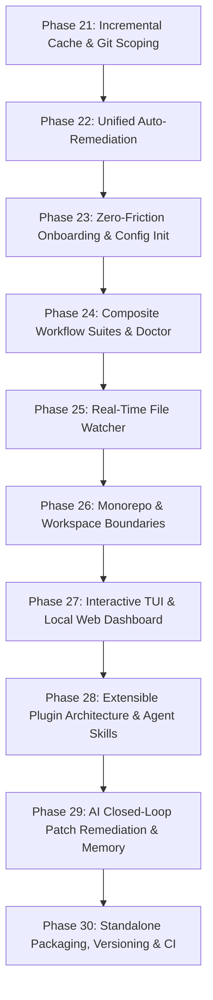

# Master Product Management Build Plan: Rush Platform Evolution (Phases 21–30)

> **Document Version:** 1.0.0  
> **Status:** Approved for Implementation  
> **Target App Versioning:** Rush v0.2.0 → v0.3.0 → v1.0.0  
> **Repository:** `jamesdsizemore/rush-cli`  
> **Python Baseline:** Python 3.12 (managed via `uv`)  
> **Core Contract:** Stdio JSON-RPC FastMCP transport, stderr diagnostics, deterministic offline execution, zero docs drift.

---

## 1. Executive Summary & Architectural Brainstorming

This Master Build Plan operationalizes the recommendations and user directives articulated in the Product Management Review (`pm-review.md`). It transitions Rush from a diagnostic-only quality CLI/MCP server into an active, incremental, extensible, and closed-loop quality operating system for human developers and autonomous AI agents.

### 1.1 Architectural Brainstorming: Extensible Plugin System & Agent Skills
- **The Challenge:** Teams possess proprietary internal scanners, compliance checkers, and domain-specific linters. Hardcoding engines in Python creates friction and restricts adoption.
- **The Architecture:** Rush introduces a declarative plugin contract in `rush.toml` (`[plugins.<name>]`) and `.rush/plugins/`. Any executable (Python, Bash, Node, Go, Rust) emitting canonical `ToolResult` JSON on stdout is a first-class Rush engine.
- **AI Agent Plugin Creation Engine:** We equip coding agents with specialized agent skills:
  - `rush-plugin-builder`: An autonomous agent skill that accepts natural language requirements, analyzes sample codebases, drafts custom regex/AST detection logic, writes executable plugin scripts, generates test fixtures, validates with `rush plugin validate`, and registers the plugin into `rush.toml`.
  - `rush-plugin-installer`: An agent skill that fetches, audits security permissions, tests, and installs plugins from Git repositories or local directories.

### 1.2 Architectural Brainstorming: Interactive TUI & Local Web Dashboard
- **The Challenge:** Exploring hundreds of multi-engine findings in standard terminal output leads to cognitive overload.
- **The TUI Architecture (`rush ui`):** Built on top of `rich.live` and `rich.layout`, providing keyboard navigation (arrows, Enter, Esc), severity filtering (clean/warn/fail/error), category trees, and instant file jumping via system editor (`$EDITOR`).
- **The Local Web Dashboard (`rush dashboard` / `rush serve --dashboard`):** A zero-dependency local web server built on standard library `http.server` / `asyncio`. It serves an offline, single-page reactive dashboard displaying live scan summaries, historical trend lines, architectural dependency graphs, and an interactive diff viewer. Accessible at `http://127.0.0.1:8484` with configurable port and authentication token.

### 1.3 Architectural Brainstorming: Composite Workflow Suites
- **The Challenge:** Developers must remember and run 8–10 distinct commands during their daily workflow.
- **The Composite Suites:**
  - `rush check`: The fast developer inner loop. Runs `tdd` → `format --check` → `lint` → `typecheck` → `slop` → `test`.
  - `rush audit`: Comprehensive security, supply chain, and compliance. Runs `security` → `secrets` → `license` → `sbom` → `contract`.
  - `rush gate`: Pull request and merge verification gate. Runs `coverage` (with diff coverage) → `mutation` → `complexity` → `review`.
  - `rush doctor`: Environment diagnostic and health check. Verifies installed binaries, discovers toolchains, audits PATH health, validates cache integrity, and recommends optimizations.

### 1.4 Architectural Brainstorming: Incremental Content-Hash Cache & Git Scoping
- **The Challenge:** Monorepos with 100k+ lines experience latency when re-running static analyzers on unchanged files.
- **The Cache Architecture:** SQLite database at `.rush/cache.db` storing findings keyed by `hash(file_bytes + tool_name + engine_version + config_hash)`.
- **Git Scoping:** `--staged` (inspect git staged files only), `--changed` (inspect uncommitted modified files), and `--since <ref>` (inspect diff against branch/tag).

### 1.5 Architectural Brainstorming: Unified Automated Remediation (`rush fix`)
- **The Challenge:** Rush detects issues but leaves fixing entirely to manual developer edits.
- **The Remediation Architecture:** `rush fix` dispatches `--fix`/`--write` flags to underlying auto-fixable engines (`ruff --fix`, `biome --write`, `eslint --fix`, `prettier --write`, `ast-grep --update`). Includes safety checkpoints: clean git tree verification, diff previews, and a post-fix regression verification run.

### 1.6 Architectural Brainstorming: Closed-Loop AI Agent Remediation & Context Memory
- **The Challenge:** AI agents waste tokens and hallucinate when trying to parse human error messages into code edits.
- **The Closed-Loop Architecture:**
  - `ToolFinding` data structure is enriched with optional `patch` (unified diff string) and `suggested_fix`.
  - `.rush/session_memory.json` (or SQLite) maintains a local ledger of past agent runs, recurrent bug patterns, and architectural conventions.
  - Dedicated FastMCP tools: `rush_get_patch`, `rush_apply_fix`, `rush_session_context`.

---

## 2. Pinned Dependencies Baseline

To guarantee reproducibility and zero runtime drift, all package dependencies are strictly pinned in `pyproject.toml`:

```toml
[project]
name = "rush-cli"
version = "0.2.0"
requires-python = ">=3.12,<3.13"

dependencies = [
    "mcp==1.28.1",          # Official Model Context Protocol SDK (stdio FastMCP)
    "click==8.4.2",         # CLI command routing and argument parsing
    "rich==13.9.4",         # Terminal pretty-printing, tables, and TUI layouts
    "pytest==9.0.3",        # Core test execution and assertions
    "watchfiles==1.0.4",    # High-performance Rust-based file system watcher
]

[project.optional-dependencies]
dev = [
    "pip-audit==2.10.1",    # Python dependency vulnerability auditing
    "ruff==0.16.3",         # Python linter and formatter
    "hatchling==1.32.0",    # PEP 517 build backend
]
```

---

## 3. Strict Development Process & Invariants

Every phase in this plan must strictly follow this 6-step engineering verification protocol:

1. **Subprocess Safety Contract**: All external engine invocations must use `src/rush/tools/common.py:run_subprocess()` with `stdin=subprocess.DEVNULL`, `shell=False`, 120s timeout, and diagnostics written strictly to `stderr`.
2. **Deterministic Mock Testing**: Every engine adapter and tool must have a fixture-driven test file under `tests/` utilizing `mock_subprocess` with `clean.json`, `findings.json`, and `malformed.json` fixtures.
3. **Pytest Verification**: 100% test pass rate (`.venv/Scripts/python.exe -m pytest tests/ -q`).
4. **Code Linter & Formatter**: Zero Ruff errors and 100% format compliance (`ruff check src tests scripts` and `ruff format --check src tests scripts`).
5. **Mandatory Documentation Synchronization**: Every phase must run `python scripts/sync_docs.py --update` and verify `python scripts/sync_docs.py --check` across all 148+ documentation files in `/docs`.
6. **Graft Architecture Sync**: Update the code graph with `graft --dir .hermes/graft build .` and verify `graft check .`.

---

## 4. Phase-by-Phase Master Implementation Plan



---

### Phase 21: Incremental Content-Hash Cache & Git-Aware Scoping

**Goal:** Eliminate redundant scanner invocations on unchanged files by introducing an incremental SQLite cache and Git diff scoping flags.

- **Allowed Files:** `src/rush/`, `tests/`, `docs/`, `scripts/`
- **Files to Create:**
  - `src/rush/cache.py`: SQLite-backed cache manager with SHA-256 file hashing and composite key invalidation.
  - `tests/test_cache.py`: Unit and concurrency tests for cache hits, misses, and invalidation.
  - `tests/test_git_scoping.py`: Tests for `--staged`, `--changed`, and `--since` file filtering.
- **Files to Modify:**
  - `src/rush/cli.py`: Add `--no-cache`, `--staged`, `--changed`, `--since`, and `rush cache` subcommands (`clean`, `stats`).
  - `src/rush/tools/common.py`: Integrate cache lookup and persistence around `run_subprocess()` and `ToolResult` generation.
  - `src/rush/config.py`: Add `[cache]` configuration section (`enabled`, `dir`, `max_size_mb`).
- **Exact Signatures:**
  ```python
  def compute_file_hash(path: Path) -> str: ...
  def compute_cache_key(file_path: Path, tool_name: str, engine_version: str, config_hash: str) -> str: ...
  class ResultCache:
      def get(self, key: str) -> ToolResult | None: ...
      def set(self, key: str, result: ToolResult) -> None: ...
      def clear(self) -> int: ...
      def stats(self) -> dict[str, int | float]: ...
  ```

---

### Phase 22: Unified Automated Remediation (`rush fix` & `--fix` Propagation)

**Goal:** Enable safe, multi-language automated code fixing across formatters, linters, and AST transformers with git-safety gates and verification checks.

- **Allowed Files:** `src/rush/`, `tests/`, `docs/`, `scripts/`
- **Files to Create:**
  - `src/rush/tools/fix.py`: Unified `FixTool` coordinating auto-fixing across registered engines.
  - `tests/test_fix.py`: Verification tests for fix application, diff previewing, and rollback on error.
- **Files to Modify:**
  - `src/rush/cli.py`: Register `rush fix` command and `--fix` flag on `lint`, `format`, `slop`, `complexity`.
  - `src/rush/tools/__init__.py`: Export `FixTool` and register in `ALL_TOOLS`.
  - `src/rush/catalog.py`: Register `fix` in `TOOL_SPECS` with canonical maturity.
  - `src/rush/engines/ruff.py`, `biome.py`, `eslint.py`, `prettier.py`: Add `run_fix()` adapter methods.
- **Safety Protocol:**
  1. Check for uncommitted changes or require `--force`.
  2. Snapshot affected files.
  3. Execute engine fix commands (`ruff format`, `ruff check --fix`, `biome check --write`).
  4. Run post-fix verification pass (`rush lint`, `rush format --check`).

---

### Phase 23: Zero-Friction Stack-Aware Onboarding & Interactive Initializer (`rush setup` & `rush init`)

**Goal:** Create an effortless onboarding experience that auto-detects tech stacks, suggests 1-click toolchain installations, and generates validated configurations.

- **Allowed Files:** `src/rush/`, `tests/`, `docs/`, `scripts/`
- **Files to Create:**
  - `src/rush/discovery/stack.py`: Project stack detector (Python, TypeScript, Go, Rust, Java, C/C++, Docker, Terraform).
  - `src/rush/tools/setup_wizard.py`: Interactive and non-interactive toolchain installer running user package managers (`uv`, `npm`, `brew`, `cargo`, `winget`).
  - `src/rush/tools/init_config.py`: Smart `rush.toml` generator with pre-configured toolsets based on detected stacks.
  - `tests/test_stack_discovery.py`: Fixture-based tests for multi-language stack detection.
  - `tests/test_setup_and_init.py`: Tests for configuration generation and setup wizard command generation.
- **Files to Modify:**
  - `src/rush/cli.py`: Add `rush setup`, `rush init`, and `rush config check` commands.
  - `src/rush/config.py`: Add line-level diagnostics validator.

---

### Phase 24: Composite Development Workflow Suites & Environment Doctor

**Goal:** Provide single-command composite workflows matching the natural cadence of developer tasks and a comprehensive environment diagnostic tool.

- **Allowed Files:** `src/rush/`, `tests/`, `docs/`, `scripts/`
- **Files to Create:**
  - `src/rush/workflows/__init__.py`: Workflow orchestration module.
  - `src/rush/workflows/suites.py`: Definitions for `CheckSuite`, `AuditSuite`, `GateSuite`.
  - `src/rush/tools/doctor.py`: Environment and toolchain health diagnostician.
  - `tests/test_workflows.py`: Tests for composite suite execution, error bubbling, and summary aggregation.
  - `tests/test_doctor.py`: Tests for engine discovery, PATH validation, and recommendation output.
- **Files to Modify:**
  - `src/rush/cli.py`: Add `rush check`, `rush audit`, `rush gate`, `rush doctor`.
  - `src/rush/catalog.py`: Register composite workflow specs in `TOOL_SPECS`.

---

### Phase 25: Real-Time File System Watch Mode (`rush watch`)

**Goal:** Continuous, intelligent quality feedback loop during active coding with debouncing and selective tool execution.

- **Allowed Files:** `src/rush/`, `tests/`, `docs/`, `scripts/`
- **Files to Create:**
  - `src/rush/watcher.py`: File system monitor using `watchfiles` with debouncing, ignore patterns, and targeted tool triggering.
  - `tests/test_watcher.py`: Unit tests for path filtering, event debouncing, and tool triggering.
- **Files to Modify:**
  - `src/rush/cli.py`: Add `rush watch` command with `--suite` and `--tools` flags.
  - `pyproject.toml`: Add `watchfiles==1.0.4`.

---

### Phase 26: Monorepo & Polyglot Workspace Boundary Awareness

**Goal:** Natively understand monorepo topologies (Turborepo, Nx, pnpm, Cargo workspaces, Go multi-modules) and support scoped workspace executions.

- **Allowed Files:** `src/rush/`, `tests/`, `docs/`, `scripts/`
- **Files to Create:**
  - `src/rush/discovery/workspace.py`: Monorepo workspace boundary detector and package topological sorter.
  - `tests/test_workspace.py`: Tests for Turborepo, Nx, pnpm, and Cargo workspace parsing and scoped execution.
- **Files to Modify:**
  - `src/rush/cli.py`: Add `--workspace <pkg>` and `--all-workspaces` options.
  - `src/rush/tools/common.py`: Inject workspace root scoping into engine command dispatchers.

---

### Phase 27: Interactive Terminal UI (TUI) & Local Zero-Dependency Web Dashboard

**Goal:** Deliver deep visual finding navigation for human developers via an interactive terminal dashboard and a lightweight, offline local web app.

- **Allowed Files:** `src/rush/`, `tests/`, `docs/`, `scripts/`
- **Files to Create:**
  - `src/rush/tui.py`: Interactive Rich-based terminal UI with category trees, severity filters, and keyboard shortcuts.
  - `src/rush/dashboard.py`: Zero-dependency local HTTP server (`http.server` / `asyncio`) serving self-contained HTML/CSS/JS dashboard.
  - `src/rush/templates/dashboard.html`: Single-file interactive web application with charts, filters, and diff viewer.
  - `tests/test_tui.py`: Unit tests for TUI layout generation and event handlers.
  - `tests/test_dashboard.py`: Tests for HTTP endpoints, JSON API, and dashboard HTML rendering.
- **Files to Modify:**
  - `src/rush/cli.py`: Add `rush ui` and `rush dashboard` (`--port`, `--open`).
  - `src/rush/config.py`: Add `[dashboard]` configuration section.

---

### Phase 28: Extensible Engine Plugin Architecture & AI Agent Plugin Skills

**Goal:** Allow developers and AI agents to extend Rush with custom linters, analyzers, and security checks via declarative configuration and autonomous agent skills.

- **Allowed Files:** `src/rush/`, `tests/`, `docs/`, `scripts/`
- **Files to Create:**
  - `src/rush/plugins/__init__.py`: Plugin loader and execution runtime.
  - `src/rush/plugins/loader.py`: Discover and load plugins from `rush.toml` `[plugins.*]` and `.rush/plugins/`.
  - `src/rush/plugins/validator.py`: Strict schema validator for plugin outputs against `ToolResult`.
  - `src/rush/skills/plugin_builder.md`: Complete AI agent skill for generating and testing custom Rush plugins.
  - `src/rush/skills/plugin_installer.md`: Complete AI agent skill for auditing and installing plugins.
  - `tests/test_plugins.py`: End-to-end tests for custom script plugins (Python, Shell, Node).
  - `tests/test_plugin_validator.py`: Schema validation tests for custom plugin outputs.
- **Files to Modify:**
  - `src/rush/cli.py`: Add `rush plugin` subcommands (`list`, `create`, `install`, `validate`).
  - `src/rush/config.py`: Support `[plugins.<name>]` schema definition.

---

### Phase 29: Closed-Loop AI Agent Remediation, AST Patches & Session Context Memory

**Goal:** Enable single-turn AI agent problem resolution via machine-readable patch proposals and persistent session memory ledgers.

- **Allowed Files:** `src/rush/`, `tests/`, `docs/`, `scripts/`
- **Files to Create:**
  - `src/rush/session_memory.py`: Session memory ledger manager (`.rush/session_memory.json` / SQLite) tracking findings, fix success rates, and token budgets.
  - `src/rush/patch_generator.py`: Deterministic unified diff patch generator for AST and rule findings.
  - `tests/test_session_memory.py`: Tests for session persistence, convention tracking, and memory rotation.
  - `tests/test_patch_generator.py`: Tests for diff generation from finding coordinates.
- **Files to Modify:**
  - `src/rush/tools/base.py`: Add `patch: str | None` and `suggested_fix: str | None` to `ToolFinding`.
  - `src/rush/mcp.py`: Register FastMCP tools: `rush_get_patch`, `rush_apply_fix`, `rush_session_context`.

---

### Phase 30: Standalone Binary Packaging, Semantic App Versioning & Enterprise CI/CD

**Goal:** Package Rush into zero-prerequisite native binaries for all operating systems, establish automated semantic versioning, and configure enterprise CI/CD pipelines.

- **Allowed Files:** `.github/`, `packaging/`, `docs/`, `scripts/`
- **Files to Create:**
  - `packaging/homebrew/rush.rb`: Homebrew formula for macOS/Linux distribution.
  - `packaging/winget/rush.yaml`: Winget package manifest for Windows.
  - `packaging/scoop/rush.json`: Scoop manifest for Windows.
  - `.github/workflows/release.yml`: Automated multi-platform binary compilation (PyInstaller/Nuitka) and GitHub Release publisher.
  - `tests/test_packaging_and_versioning.py`: Tests verifying version parity across CLI, MCP, and build metadata.
- **Files to Modify:**
  - `pyproject.toml`: Update version to `0.2.0` / `0.3.0`.
  - `.github/workflows/quality.yml`: Add caching, docs parity, and multi-OS matrix testing.
  - `scripts/sync_docs.py`: Update whole-tree sync engine for all new commands and plugins.

---

## 5. Verification Matrix and Quality Gates

Before declaring any phase complete, the following four gates must be verified:

1. **Pytest Gate**: `.venv/Scripts/python.exe -m pytest tests/ -q` (100% pass rate).
2. **Linter Gate**: `.venv/Scripts/ruff.exe check src tests scripts` (0 errors).
3. **Formatter Gate**: `.venv/Scripts/ruff.exe format --check src tests scripts` (350+ files formatted).
4. **Documentation Parity Gate**: `.venv/Scripts/python.exe scripts/sync_docs.py --check` (0 errors across all 148+ docs).
5. **Graft Wiring Gate**: `graft --dir .hermes/graft check .` (OK - graph in sync).
