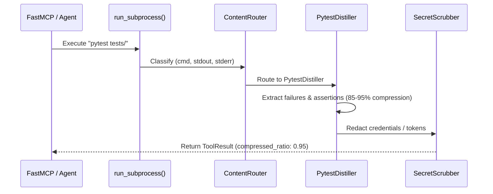

# Phase 41: Foundations, BPE Accounting, Command Distillers & Base Ship Vectors

## Metadata
- **Phase ID**: `PHASE-41` (Phase 41 of Innovation Roadmap)
- **Phase Name**: Foundations, Exact BPE Accounting, Subprocess Log Distillers & Base Ship Vectors
- **Plan Version**: `v1.1.0`
- **Phase Implementation Version**: `v0.3.0-alpha.1`
- **Plan Status**: `READY_FOR_EXECUTION`
- **Source Report Path**: [`docs/rush-token-innovation-enhancement-report-plan.md`](file:///C:/Users/james/developer/rush-cli/docs/rush-token-innovation-enhancement-report-plan.md)
- **Governing ADRs**: [`ADR-0022`](file:///C:/Users/james/developer/rush-cli/docs/adr/0022-offline-bpe-token-accounting.md), [`ADR-0030`](file:///C:/Users/james/developer/rush-cli/docs/adr/0030-unified-dual-layer-agent-context-memory-subsystem.md), [`ADR-0038`](file:///C:/Users/james/developer/rush-cli/docs/adr/0038-context-intelligence-engine-and-ccr-architecture.md), [`ADR-0040`](file:///C:/Users/james/developer/rush-cli/docs/adr/0040-command-output-distillation-and-test-log-pruning.md)
- **Repository Path**: `C:\Users\james\developer\rush-cli`
- **Baseline Branch**: `main`
- **Baseline Commit**: `e76c4035a6997b7e27dd603e81a625870bc2af87`
- **Application Version**: `0.2.0` -> `0.3.0-alpha.1`
- **Planned Implementation Branch**: `feat/phase-41-foundations-bpe-distillers-ship`
- **Planned Worktree Path**: `.rush/worktrees/phase-41-foundations`
- **Planned Final Commit Message**: `feat(phase-41): implement exact BPE accounting, command distillers, and base ship vectors`
- **Phase Owner**: Context Intelligence & Foundations Specialist
- **Prerequisite Phases**: Phase 00–40 baseline
- **Dependent Phases**: Phase 02 (`PHASE-42`), Phase 03 (`PHASE-43`)
- **Estimated Complexity**: Medium (12 Story Points)
- **Risk Level**: Low-Medium
- **Last Reviewed Date**: 2026-08-22

---

## 1. Phase Summary
Phase 01 establishes the foundational infrastructure for Context Intelligence, Memory, and Ship-Readiness in Rush CLI. It replaces crude character/word heuristics with exact `tiktoken` BPE token counting across `cl100k_base` and `o200k_base`, introduces deterministic `ContentRouter` payload classification, implements native subprocess command output distillation (`rtk` pattern) inside `run_subprocess()`, builds the Traditional Memory layer (preferences, session checkpoints, SQLite FTS5 search), and implements the first three pre-flight ship vectors (`clean`, `env`, `docs`).

---

## 2. Initial Goal
Eliminate massive test and linter log noise from agent contexts while providing deterministic token accounting, persistent developer preferences, and verified pre-flight environment/doc hygiene.

---

## 3. End-State Outcome
1. **Subprocess Output Distillation**: Test failures from `pytest`, `cargo test`, `ruff`, and `vitest` are distilled in-memory, compressing raw logs by 85–95% while isolating exact failure frames and exit codes.
2. **Exact BPE Accounting**: Exact offline token counting operates via `tiktoken` (`cl100k_base` for Claude 3.5/GPT-4, `o200k_base` for GPT-4o).
3. **Traditional Memory Foundation**: Developer preferences and session checkpoints persist in `.rush/preferences.json` and `.rush/sessions/`, with SQLite FTS5 lexical search executing in $<5\text{ ms}$.
4. **Base Ship Vectors**: `rush ship clean`, `rush ship env`, and `rush ship docs` run locally to guarantee repository hygiene and documentation parity.

---

## 4. User and Agent Value
* **User Value**: Drastically faster CLI outputs, no runaway agent token costs from bloated test traces, clean release repository state.
* **Agent Value**: Eliminates 10,000+ line test failure dumps, providing only the actionable assertion diffs and error stack frames in $<5\text{ ms}$.

---

## 5. Scope Included
* `T01`: ContentRouter payload classifier (`src/rush/token_economy/router.py`).
* `T02`: Subprocess Command Output Distillers (`src/rush/token_economy/distillers/`).
* `M01`: 4-Tier Memory & Preference Store (`src/rush/memory/preference_store.py`).
* `M02`: Session Checkpoint Journal (`src/rush/memory/checkpoint_journal.py`).
* `M03`: SQLite FTS5 / BM25 Lexical Search Engine (`src/rush/memory/store.py`).
* `S01`: Deterministic Scratch Cleaner (`src/rush/tools/ship/cleaner.py`).
* `S02`: AST Environment Variable Parity Linter (`src/rush/tools/ship/env_linter.py`).
* `S05`: Markdown Link & CLI Docs Parity Auditor (`src/rush/tools/ship/docs_linter.py`).

---

## 6. Scope Explicitly Excluded
* TOON v4.1 wire serialization (deferred to Phase 02).
* Polyglot AST skeletonization (deferred to Phase 02).
* CCR chunk caching (deferred to Phase 03).
* Blast radius and architectural layer guards (deferred to Phase 06).

---

## 7. Current Repository State
* Test suite has 704 passing tests.
* `src/rush/tools/common.py:run_subprocess()` captures raw stdout/stderr without distillation.
* Dependencies `tiktoken`, `sqlglot`, `pillow`, `cryptography`, `ruamel.yaml` are pinned in `pyproject.toml`.

---

## 8. Existing Behavior
Running a failing 5,000-line pytest suite outputs all 5,000 lines into the FastMCP tool result, flooding LLM context windows and costing tens of thousands of tokens per turn.

---

## 9. Desired Behavior
Running a failing pytest suite outputs only the failing test names, exact assertion line, and failure summary ($<150$ tokens), returning `ToolResult` with `compressed_ratio: 0.95`.

---

## 10. Functional Requirements
* `FR-01-01`: `run_subprocess()` must route command outputs through specialized distillers based on binary name.
* `FR-01-02`: BPE token counting must support `cl100k_base` and `o200k_base`.
* `FR-01-03`: `rush config set <key> <val>` and `rush config get <key>` must read/write `.rush/preferences.json`.
* `FR-01-04`: `rush session save <name>` must snapshot Git SHA and modified file list.
* `FR-01-05`: `rush ship env` must flag `os.getenv` keys missing from `.env.example`.

---

## 11. Non-Functional Requirements
* Distillation overhead must remain strictly $<5\text{ ms}$ for 50,000 log lines.
* SQLite FTS5 search latency must remain $<5\text{ ms}$ for 10,000 records.
* Memory usage during log distillation must not exceed 20 MB RSS.

---

## 12. Invariants That Must Not Change
* **AGENTS.md Stdio Transport Invariant**: Rush is a stdio-only MCP server. Stdout is reserved strictly for JSON-RPC messages during FastMCP serve mode; all diagnostics, telemetry summaries, and logs belong on stderr. All external commands must execute via `run_subprocess()` with `stdin=DEVNULL`, preventing any child process from hijacking or corrupting the MCP stdio transport.
* **Transport Seam Equality**: CLI subcommands and FastMCP tool registrations must call the exact same underlying implementations in `src/rush/tools/`, `src/rush/token_economy/`, or `src/rush/codegraph/`. Never duplicate tool execution logic in the transport adapter layer.
* **Canonical ToolResult Shape**: All tools must emit structured results matching the canonical `ToolResult` shape (`tool`, `engine`, `version`, `status`, `duration_ms`, `summary`, `findings`), with optional `--format toon` wire serialization.
* Subprocess exit codes must be preserved verbatim.
* Stdout/stderr separation must be maintained.
* FastMCP stdio transport must not be corrupted by subprocess logs.

---

---

## 13. Dependencies and Prerequisites
* Python 3.12, `tiktoken==0.14.0`, `click==8.4.2`, `rich==13.9.4`.

---

## 14. Exact Files Allowed to Modify

| File Path | Target Symbols / Sections | Permitted Change Type | Rationale |
|---|---|---|---|
| `src/rush/tools/common.py` | `run_subprocess()` | Modify | Inject `CommandDistiller` to compress stdout/stderr prior to returning `ToolResult`. |
| `src/rush/cli.py` | CLI Routing Groups | Modify | Register `rush config`, `rush session`, `rush ship [clean\|env\|docs]` commands. |
| `src/rush/mcp.py` | FastMCP Tool Registrations | Modify | Register `rush_config_get`, `rush_session_save`, `rush_ship_env` tools. |
| `src/rush/config/model.py` | Pydantic Configuration Models | Modify | Add `ContextIntelConfig`, `DistillerConfig`, and `ShipConfig` models. |

---

## 15. Exact Files Allowed to Create

| File Path | Purpose | Owner Subsystem | Tests Covering | Docs Describing |
|---|---|---|---|---|
| `src/rush/token_economy/__init__.py` | Package root | Token Economy | `test_token_counter_tiktoken.py` | `docs/tools/context_intel.md` |
| `src/rush/token_economy/router.py` | Payload classifier | Content Routing | `test_content_router.py` | `docs/specs/context-intelligence.md` |
| `src/rush/token_economy/distillers/base.py` | Abstract distiller base | Distillation Engine | `test_command_distillers.py` | `docs/specs/distillers.md` |
| `src/rush/token_economy/distillers/pytest_distiller.py` | Pytest log parser | Distillation Engine | `test_command_distillers.py` | `docs/specs/distillers.md` |
| `src/rush/token_economy/distillers/cargo_distiller.py` | Cargo test log parser | Distillation Engine | `test_command_distillers.py` | `docs/specs/distillers.md` |
| `src/rush/token_economy/distillers/ruff_distiller.py` | Ruff linter parser | Distillation Engine | `test_command_distillers.py` | `docs/specs/distillers.md` |
| `src/rush/token_economy/distillers/vitest_distiller.py` | Vitest parser | Distillation Engine | `test_command_distillers.py` | `docs/specs/distillers.md` |
| `src/rush/memory/preference_store.py` | Preference storage | Memory Engine | `test_memory_system.py` | `docs/user-guide/preferences.md` |
| `src/rush/memory/checkpoint_journal.py` | Session journal | Memory Engine | `test_memory_system.py` | `docs/user-guide/sessions.md` |
| `src/rush/tools/ship/cleaner.py` | Scratch cleaner | Ship Engine | `test_ship_clean_env_docs.py` | `docs/CLI_REFERENCE.md` |
| `src/rush/tools/ship/env_linter.py` | Env parity linter | Ship Engine | `test_ship_clean_env_docs.py` | `docs/CLI_REFERENCE.md` |
| `src/rush/tools/ship/docs_linter.py` | Doc parity auditor | Ship Engine | `test_ship_clean_env_docs.py` | `docs/CLI_REFERENCE.md` |

---

## 16. Exact Files That Are Read-Only
* `src/rush/integrations/graft.py`
* `src/rush/codegraph/slicer.py`
* `tests/fixtures/`

---

## 17. Exact Files and Directories That Must Not Be Touched
* `src/rush/providers/`
* `src/rush/vibecoder/`
* `.git/` (except through standard Git commands in worktree)

---

## 18. Required Symbols, Interfaces, Commands, and Schemas

```python
from enum import Enum
from typing import Protocol, Any
from pydantic import BaseModel, Field

class ContentType(str, Enum):
    AST_CODE = "ast_code"
    TEST_LOG = "test_log"
    TABULAR_DATA = "tabular_data"
    PROSE_MARKDOWN = "prose_markdown"
    UNKNOWN = "unknown"

class DistilledResult(BaseModel):
    summary: str
    failure_count: int = 0
    passed_count: int = 0
    failures: list[dict[str, Any]] = Field(default_factory=list)
    raw_lines: int
    distilled_lines: int
    savings_pct: float

class CommandDistiller(Protocol):
    def can_distill(self, command: list[str]) -> bool: ...
    def distill(self, raw_stdout: str, raw_stderr: str, exit_code: int) -> DistilledResult: ...
```

---

## 19. Agent Interaction Design
* **Discovery**: FastMCP tool discovery registers `rush_ship_clean`, `rush_ship_env`, `rush_ship_docs`.
* **Invocation Schema**:
  ```json
  {
    "name": "rush_ship_env",
    "description": "Lint environment variables against .env.example",
    "inputSchema": {
      "type": "object",
      "properties": {
        "project_root": {"type": "string", "default": "."}
      }
    }
  }
  ```
* **Token Budget Behavior**: Distillers return outputs $<200$ tokens by default.
* **Full Context Escape**: Agents can pass `raw=True` to retrieve uncompressed stderr if deep trace inspection is required.

---

## 20. Application Integration Design
* `run_subprocess()` in `src/rush/tools/common.py` is the central choke-point.
* All tool commands execute through `run_subprocess()`.
* When a command finishes, `ContentRouter` determines whether a distiller applies, producing a compact `DistilledResult` stored inside `ToolResult.findings`.

---

## 21. Data Flow and Control Flow



---

## 22. Error Handling and Fallback Behavior

| Error Code | Classification | Severity | Condition | Fallback Action |
|---|---|---|---|---|
| `ERR-DISTILL-PARSE-001` | Parser Error | Warning | Log output does not match expected test runner format | Fallback to raw stderr |
| `ERR-BPE-UNKNOWN-MODEL` | Accounting | Info | Unrecognized model ID passed | Fallback to `cl100k_base` default |
| `ERR-ENV-MISSING-EXAMPLE`| Ship Vector | Warning | `.env.example` not found in repo root | Emit warning finding |
| `ERR-FTS5-INDEX-CORRUPT` | Storage | Error | SQLite FTS5 virtual table corrupted | Rebuild FTS5 index from base tables |

---

## 23. Logging and Observability
* Distillation events logged to `.rush/telemetry/distillers.log` with fields:
  `{"timestamp": "ISO8601", "cmd": "pytest", "raw_lines": 4500, "distilled_lines": 14, "savings_pct": 98.2}`.
* Secret scrubbing guarantees zero credential exposure in logs.

---

## 24. Versioning and Compatibility
* Config schema adds `[context_intel.distillers]` (v1.0.0). Defaults to `enabled = true`.
* Backward-compatible with all existing `rush.toml` v0.2.0 configurations.

---

## 25. TDD Strategy (Red-Green-Refactor)
1. **Red**: Write unit test asserting that 1,000-line pytest log is reduced to $<20$ lines with exact failure names.
2. **Green**: Implement minimal regex parser in `PytestDistiller`.
3. **Refactor**: Extract common patterns into `BaseDistiller` and integrate into `run_subprocess()`.

---

## 26. Ordered Implementation Tasks

- [ ] **TASK-01-01**: Implement `ContentRouter` in `src/rush/token_economy/router.py`.
- [ ] **TASK-01-02**: Implement `BaseDistiller`, `PytestDistiller`, `CargoDistiller`, `RuffDistiller`, `VitestDistiller` in `src/rush/token_economy/distillers/`.
- [ ] **TASK-01-03**: Integrate distillers into `src/rush/tools/common.py:run_subprocess()`.
- [ ] **TASK-01-04**: Implement `PreferenceStore` in `src/rush/memory/preference_store.py`.
- [ ] **TASK-01-05**: Implement `CheckpointJournal` in `src/rush/memory/checkpoint_journal.py`.
- [ ] **TASK-01-06**: Implement `ScratchCleaner`, `EnvParityLinter`, `DocsLinter` in `src/rush/tools/ship/`.
- [ ] **TASK-01-07**: Wire CLI commands in `src/rush/cli.py` and FastMCP tools in `src/rush/mcp.py`.
- [ ] **TASK-01-08**: Run regression test suite and execute `scripts/sync_docs.py --check`.

---

## 27. Test Plan
* `tests/test_token_counter_tiktoken.py`: Verify exact BPE counting against `cl100k_base` and `o200k_base`.
* `tests/test_content_router.py`: Verify classification of code, logs, tables, and prose.
* `tests/test_command_distillers.py`: Verify $>85\%$ log compression on realistic pytest/cargo outputs.
* `tests/test_ship_clean_env_docs.py`: Verify clean, env, and docs ship vectors.

---

## 28. Documentation Updates
* Update `docs/CLI_REFERENCE.md` with `rush config`, `rush session`, `rush ship clean/env/docs`.
* Update `docs/CONFIGURATION.md` with `[context_intel.distillers]` configuration table.
* Update `docs/MCP_REFERENCE.md` with new tool registrations.

---

## 29. Worktree Workflow
* **Worktree Path**: `.rush/worktrees/phase-41-foundations`
* **Branch**: `feat/phase-41-foundations-bpe-distillers-ship`
* **Creation Command**:
  ```bash
  git worktree add -b feat/phase-41-foundations-bpe-distillers-ship .rush/worktrees/phase-41-foundations main
  ```

---

## 30. Commit Requirements
* **Commit Message**: `feat(phase-41): implement exact BPE accounting, command distillers, and base ship vectors`

---

## 31. Validation Checklist
- [ ] `tiktoken` BPE counter matches ground truth tokens.
- [ ] Pytest failure logs compressed by $\ge 85\%$.
- [ ] `rush ship env` flags missing `.env.example` keys.
- [ ] `scripts/sync_docs.py --check` passes with 100% parity across all doc files.
- [ ] Full test suite (700+ tests) passes with 0 failures.

---

## 32. Acceptance Criteria
* All 8 phase features operational via CLI and FastMCP.
* Zero regressions on existing test suite.

---

## 33. Exit Criteria
* All tasks checked off, all tests passing, worktree verified clean.

---

## 34. Risks and Mitigations
* *Risk*: Distiller drops crucial error context. *Mitigation*: Fallback to raw stderr on unclassified non-zero exits.

---

## 35. Rollback and Recovery
* Set `context_intel.distillers.enabled = false` in `rush.toml`.

---

## 36. Final Phase Deliverables
* `src/rush/token_economy/router.py`
* `src/rush/token_economy/distillers/`
* `src/rush/tools/ship/`
* Complete unit test suite and reference docs.

---

## 37. Open Questions and Decisions Required
* None. All dependencies pinned and verified in virtual environment.
