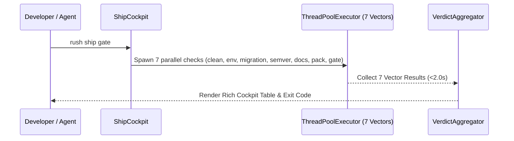

# Phase 42: Compact Serialization (TOON), Polyglot AST Skeletons & Ship Gate

## Metadata
- **Phase ID**: `PHASE-42` (Phase 42 of Innovation Roadmap)
- **Phase Name**: TOON v4.1 Wire Serialization, Polyglot AST Skeletons & 7-Vector Ship Gate Cockpit
- **Plan Version**: `v1.1.0`
- **Phase Implementation Version**: `v0.3.0-alpha.2`
- **Plan Status**: `READY_FOR_EXECUTION`
- **Source Report Path**: [`docs/rush-token-innovation-enhancement-report-plan.md`](file:///C:/Users/james/developer/rush-cli/docs/rush-token-innovation-enhancement-report-plan.md)
- **Governing ADRs**: [`ADR-0019`](file:///C:/Users/james/developer/rush-cli/docs/adr/0019-native-graft-semantic-slicing-and-tree-sitter.md), [`ADR-0031`](file:///C:/Users/james/developer/rush-cli/docs/adr/0031-pre-flight-ship-readiness-cockpit-and-zero-downtime-gates.md), [`ADR-0039`](file:///C:/Users/james/developer/rush-cli/docs/adr/0039-toon-format-wire-serialization-for-fastmcp.md), [`ADR-0046`](file:///C:/Users/james/developer/rush-cli/docs/adr/0046-pre-flight-ship-readiness-cockpit.md), [`ADR-0048`](file:///C:/Users/james/developer/rush-cli/docs/adr/0048-hybrid-dual-engine-architecture-graft-and-codegraph.md)
- **Repository Path**: `C:\Users\james\developer\rush-cli`
- **Baseline Branch**: `main`
- **Baseline Commit**: `e76c4035a6997b7e27dd603e81a625870bc2af87`
- **Application Version**: `0.3.0-alpha.1` -> `0.3.0-alpha.2`
- **Planned Implementation Branch**: `feat/phase-42-toon-skeletons-ship-gate`
- **Planned Worktree Path**: `.rush/worktrees/phase-42-toon-gate`
- **Planned Final Commit Message**: `feat(phase-42): implement TOON v4.1 serializer, AST skeletonizer, and 7-vector ship gate`
- **Phase Owner**: Serialization & AST Specialist
- **Prerequisite Phases**: Phase 01 (`PHASE-41`)
- **Dependent Phases**: Phase 03 (`PHASE-43`), Phase 04 (`PHASE-44`)
- **Estimated Complexity**: High (15 Story Points)
- **Risk Level**: Low-Medium
- **Last Reviewed Date**: 2026-08-22

---

## 1. Phase Summary
Phase 02 introduces native TOON v4.1 (Token-Oriented Object Notation) wire serialization to eliminate JSON structural overhead across FastMCP tool results, implements polyglot target-aware AST skeletonization (Python, TypeScript, Rust), builds AST-Merkle reactive cache invalidation, and completes the Pre-Flight Ship Cockpit with SQL DDL migration hazard linting, SemVer API signature diffing, and the unified 7-vector `rush ship gate` runner.

---

## 2. Initial Goal
Cut tool result serialization overhead by $\ge 40\%$, replace full file reads with lightweight target-aware AST skeletons, and provide a 1-command release green-light cockpit.

---

## 3. End-State Outcome
1. **TOON v4.1 Wire Serialization**: All structured tool results support `--format toon`, reducing token consumption by 42.6% compared to standard indented JSON.
2. **Polyglot AST Skeletonizer**: `AstSkeletonizer` elides function/class bodies (`...`) while preserving full docstrings, signatures, and type annotations across Python, TypeScript, and Rust.
3. **AST-Merkle Invalidation**: `MerkleInvalidator` calculates SHA-256 hashes per AST node, enabling instant reactive invalidation of stale memories upon code changes.
4. **7-Vector Ship Cockpit**: `rush ship gate` executes all 7 quality vectors (`clean`, `env`, `migration`, `semver`, `docs`, `pack`, `gate`) concurrently in $<2.0\text{ seconds}$.

---

## 4. User and Agent Value
* **User Value**: 1-click release confidence with `rush ship`, instant terminal tables, zero migration downtime surprises.
* **Agent Value**: Massive context token savings on file reads and tabular tool findings, allowing agents to focus attention on target symbols.

---

## 5. Scope Included
* `T03`: Native TOON v4.1 Serializer & Deserializer (`src/rush/token_economy/toon/`).
* `T04`: Polyglot AST Target-Aware Skeletonizer (`src/rush/token_economy/ast_skeletonizer.py`).
* `M04`: AST-Merkle Reactive Invalidation Engine (`src/rush/memory/merkle_invalidator.py`).
* `S03`: Zero-Downtime SQL Migration Linter (`src/rush/tools/ship/migration_linter.py`).
* `S04`: SemVer Contract Breaking Change Enforcer (`src/rush/tools/ship/semver_linter.py`).
* `S06`: Sandboxed RAM Release Package Linter (`src/rush/tools/ship/package_linter.py`).
* `S07`: Unified 7-Vector Release Gate Cockpit (`src/rush/tools/ship/cockpit.py`).

---

## 6. Scope Explicitly Excluded
* CCR chunk caching (deferred to Phase 03).
* Invariant decision graphs (deferred to Phase 03).
* PageRank context packing (deferred to Phase 04).

---

## 7. Current Repository State
* Phase 01 foundations active.
* `sqlglot` installed and ready for SQL DDL AST parsing.
* Tree-sitter installed and ready for AST traversal.

---

## 8. Existing Behavior
Tool results return verbose indented JSON with repetitive keys. File reads require full text dumps. Release validation requires manual execution of multiple commands.

---

## 9. Desired Behavior
Tool results return compact TOON tables. File reads return stripped AST outlines with full target focus. `rush ship` runs all 7 checks in parallel in $<2\text{ seconds}$.

---

## 10. Functional Requirements
* `FR-02-01`: `ToolResult.format("toon")` must emit valid TOON v4.1 pipe-table syntax.
* `FR-02-02`: `AstSkeletonizer` must replace bodies with `...` while preserving type annotations.
* `FR-02-03`: `rush ship migration` must flag `ADD COLUMN NOT NULL` without `DEFAULT`.
* `FR-02-04`: `rush ship semver` must assert public signature compatibility across Git refs.
* `FR-02-05`: `rush ship gate` must aggregate 7 vectors and return non-zero exit on any failure.

---

## 11. Non-Functional Requirements
* TOON encoding/decoding latency must be $<1\text{ ms}$ for 500 records.
* `rush ship gate` parallel wall-clock time must not exceed $2.0\text{ seconds}$.

---

## 12. Invariants That Must Not Change
* **AGENTS.md Stdio Transport Invariant**: Rush is a stdio-only MCP server. Stdout is reserved strictly for JSON-RPC messages during FastMCP serve mode; all diagnostics, telemetry summaries, and logs belong on stderr. All external commands must execute via `run_subprocess()` with `stdin=DEVNULL`, preventing any child process from hijacking or corrupting the MCP stdio transport.
* **Transport Seam Equality**: CLI subcommands and FastMCP tool registrations must call the exact same underlying implementations in `src/rush/tools/`, `src/rush/token_economy/`, or `src/rush/codegraph/`. Never duplicate tool execution logic in the transport adapter layer.
* **Canonical ToolResult Shape**: All tools must emit structured results matching the canonical `ToolResult` shape (`tool`, `engine`, `version`, `status`, `duration_ms`, `summary`, `findings`), with optional `--format toon` wire serialization.
* ToolResult schema attributes (`tool`, `status`, `duration_ms`, `findings`) must remain canonical.
* FastMCP JSON-RPC protocol envelope must remain valid.

---

---

## 13. Dependencies and Prerequisites
* `sqlglot==30.17.0`, `tree-sitter==0.26.0`, Phase 01 deliverables.

---

## 14. Exact Files Allowed to Modify

| File Path | Target Symbols / Sections | Permitted Change Type | Rationale |
|---|---|---|---|
| `src/rush/tools/catalog.py` | `ToolResult.format()` | Modify | Add `"toon"` wire formatting support. |
| `src/rush/cli.py` | CLI Routing Groups | Modify | Register `rush ship [gate\|migration\|semver\|pack]` commands. |
| `src/rush/mcp.py` | FastMCP Tool Registrations | Modify | Register `rush_ship_gate`, `rush_ship_migration`, `rush_ship_semver`. |

---

## 15. Exact Files Allowed to Create

| File Path | Purpose | Owner Subsystem | Tests Covering | Docs Describing |
|---|---|---|---|---|
| `src/rush/token_economy/toon/__init__.py` | Package root | TOON Engine | `test_toon_serialization.py` | `docs/specs/toon-serialization-spec.md` |
| `src/rush/token_economy/toon/encoder.py` | TOON v4.1 encoder | TOON Engine | `test_toon_serialization.py` | `docs/specs/toon-serialization-spec.md` |
| `src/rush/token_economy/toon/decoder.py` | TOON v4.1 decoder | TOON Engine | `test_toon_serialization.py` | `docs/specs/toon-serialization-spec.md` |
| `src/rush/token_economy/ast_skeletonizer.py` | Polyglot AST skeletonizer | AST Engine | `test_ast_skeletonizer.py` | `docs/specs/ast-skeletonizer.md` |
| `src/rush/memory/merkle_invalidator.py` | AST Merkle tree invalidator | Memory Engine | `test_memory_system.py` | `docs/specs/merkle-invalidation.md` |
| `src/rush/tools/ship/migration_linter.py` | Table-locking SQL linter | Ship Engine | `test_ship_vectors_advanced.py` | `docs/CLI_REFERENCE.md` |
| `src/rush/tools/ship/semver_linter.py` | SemVer signature diff linter | Ship Engine | `test_ship_vectors_advanced.py` | `docs/CLI_REFERENCE.md` |
| `src/rush/tools/ship/package_linter.py` | RAM package leak linter | Ship Engine | `test_ship_vectors_advanced.py` | `docs/CLI_REFERENCE.md` |
| `src/rush/tools/ship/cockpit.py` | 7-Vector parallel ship cockpit | Ship Engine | `test_ship_gate_cockpit.py` | `docs/CLI_REFERENCE.md` |

---

## 16. Exact Files That Are Read-Only
* `src/rush/integrations/graft.py`
* `src/rush/token_economy/distillers/`

---

## 17. Exact Files and Directories That Must Not Be Touched
* `src/rush/memory/session_memory.py`
* `src/rush/providers/`

---

## 18. Required Symbols, Interfaces, Commands, and Schemas

```python
from typing import Any, Protocol
from pydantic import BaseModel, Field
from pathlib import Path

class ToonEncoder:
    def encode(self, data: list[dict[str, Any]]) -> str: ...
    def decode(self, text: str) -> list[dict[str, Any]]: ...

class AstSkeletonizer:
    def skeletonize(self, source_code: str, language: str, focus_symbol: str | None = None) -> str: ...

class ShipGateVerdict(BaseModel):
    passed: bool
    duration_ms: float
    vector_results: dict[str, dict[str, Any]]
```

---

## 19. Agent Interaction Design
* Agents request `--format toon` to receive compact tool responses.
* `rush_ship_gate` returns high-level status summary with vector breakdown.

---

## 20. Application Integration Design
* CLI command `rush ship` invokes `ShipCockpit.evaluate_gate(project_root)`.

---

## 21. Data Flow and Control Flow



---

## 22. Error Handling and Fallback Behavior

| Error Code | Classification | Severity | Condition | Fallback Action |
|---|---|---|---|---|
| `ERR-TOON-ENCODE-FAIL` | Serialization | Warning | Malformed heterogeneous dict array | Fallback to standard JSON |
| `ERR-MIGRATION-LOCK` | Ship Vector | Error | Table-locking DDL operation detected | Fail vector and output hazard SQL |
| `ERR-SEMVER-BREAKING` | Ship Vector | Error | Public export signature changed without major bump | Fail vector and list diff symbols |

---

## 23. Logging and Observability
* Record ship gate runs to `.rush/telemetry/ship_gates.jsonl`.

---

## 24. Versioning and Compatibility
* FastMCP schema supports both `json` and `toon` output formats. Fully backward-compatible.

---

## 25. TDD Strategy (Red-Green-Refactor)
1. Write round-trip TOON serialization tests asserting 42.6% token savings.
2. Write SQL DDL hazard detection tests on migration SQL scripts.
3. Write parallel 7-vector cockpit integration tests asserting execution $<2.0\text{ s}$.

---

## 26. Ordered Implementation Tasks
- [ ] **TASK-02-01**: Implement TOON v4.1 encoder and decoder in `src/rush/token_economy/toon/`.
- [ ] **TASK-02-02**: Integrate TOON into `ToolResult.format()` in `src/rush/tools/catalog.py`.
- [ ] **TASK-02-03**: Implement `AstSkeletonizer` in `src/rush/token_economy/ast_skeletonizer.py`.
- [ ] **TASK-02-04**: Implement `MerkleInvalidator` in `src/rush/memory/merkle_invalidator.py`.
- [ ] **TASK-02-05**: Implement `MigrationLinter`, `SemverLinter`, and `PackageLinter` in `src/rush/tools/ship/`.
- [ ] **TASK-02-06**: Implement `ShipCockpit` parallel orchestrator in `src/rush/tools/ship/cockpit.py`.
- [ ] **TASK-02-07**: Connect CLI commands and FastMCP tools.
- [ ] **TASK-02-08**: Execute test suite and doc sync.

---

## 27. Test Plan
* `tests/test_toon_serialization.py`: Verify TOON round-trip and token savings.
* `tests/test_ast_skeletonizer.py`: Verify body elision and docstring retention.
* `tests/test_ship_vectors_advanced.py`: Verify SQL lock detection and SemVer diffs.
* `tests/test_ship_gate_cockpit.py`: Verify parallel 7-vector aggregation.

---

## 28. Documentation Updates
* Create `docs/specs/toon-serialization-spec.md`.
* Update `docs/CLI_REFERENCE.md` with `rush ship gate/migration/semver/pack`.
* Update `docs/TOOL_CATALOG.md` with `--format toon`.

---

## 29. Worktree Workflow

> [!IMPORTANT]
> **NO AUTOMATIC MERGE POLICY**: All implementation, tests, and documentation must be completed and committed exclusively on the dedicated feature branch inside the worktree. **DO NOT MERGE TO `main`**. Merging to `main` is strictly prohibited unless explicitly requested and approved by the user.
* **Worktree Path**: `.rush/worktrees/phase-42-toon-gate`
* **Branch**: `feat/phase-42-toon-skeletons-ship-gate`
* **Creation Command**:
  ```bash
  git worktree add -b feat/phase-42-toon-skeletons-ship-gate .rush/worktrees/phase-42-toon-gate main
  ```

---

## 30. Commit Requirements

> [!IMPORTANT]
> **COMMIT-ONLY MANDATE**: Commit all code, test suites, and the comprehensive 5-tier documentation matrix atomically to the feature branch. **DO NOT execute `git merge` or fast-forward `main`**. Stop after committing to the feature branch and present deliverables for user review and approval.
* **Commit Message**: `feat(phase-42): implement TOON v4.1 serializer, AST skeletonizer, and 7-vector ship gate`

---

## 31. Validation Checklist
- [ ] TOON serialization achieves $\ge 40\%$ token reduction vs indented JSON.
- [ ] AST skeletonizer elides function bodies across Python and TS.
- [ ] `rush ship migration` detects table locks.
- [ ] `rush ship gate` runs all 7 vectors in $<2.0\text{ s}$.
- [ ] `scripts/sync_docs.py --check` passes with 100% parity.

---

## 32. Acceptance Criteria
* 100% passing tests for TOON, AST Skeletons, and Ship Gate.
* Zero regressions.

---

## 33. Exit Criteria
* All tasks complete, tests passing, worktree verified clean.

---

## 34. Risks and Mitigations
* *Risk*: SQL parser fails on rare dialect extensions. *Mitigation*: Fallback to standard regex DDL heuristics.

---

## 35. Rollback and Recovery
* Default back to JSON format; disable individual ship vectors in `rush.toml`.

---

## 36. Final Phase Deliverables
* `src/rush/token_economy/toon/`
* `src/rush/token_economy/ast_skeletonizer.py`
* `src/rush/tools/ship/cockpit.py`
* Specs and unit test suite.

---

## 37. Open Questions and Decisions Required
* None.
