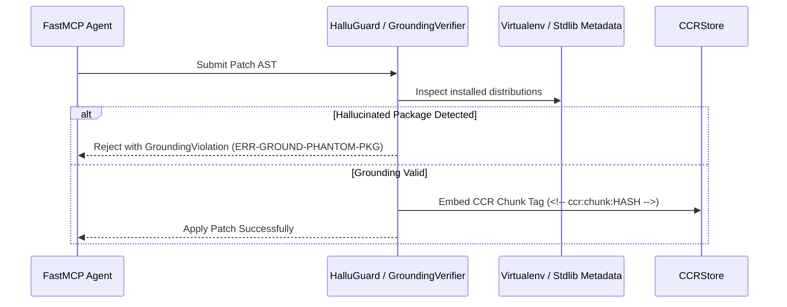

# Phase 43: Reversibility (CCR), Grounding Verification & Pre-Mortem Mistake Memory

## Metadata
- **Phase ID**: `PHASE-43` (Phase 43 of Innovation Roadmap)
- **Phase Name**: Lossless CCR Reversible Chunk Store, AST Grounding & Pre-Mortem Mistake Memory
- **Plan Version**: `v1.1.0`
- **Phase Implementation Version**: `v0.3.0-alpha.3`
- **Plan Status**: `READY_FOR_EXECUTION`
- **Source Report Path**: [`docs/rush-token-innovation-enhancement-report-plan.md`](file:///C:/Users/james/developer/rush-cli/docs/rush-token-innovation-enhancement-report-plan.md)
- **Governing ADRs**: [`ADR-0030`](file:///C:/Users/james/developer/rush-cli/docs/adr/0030-unified-dual-layer-agent-context-memory-subsystem.md), [`ADR-0033`](file:///C:/Users/james/developer/rush-cli/docs/adr/0033-real-time-ast-package-hallucination-and-phantom-import-guard.md), [`ADR-0038`](file:///C:/Users/james/developer/rush-cli/docs/adr/0038-context-intelligence-engine-and-ccr-architecture.md), [`ADR-0041`](file:///C:/Users/james/developer/rush-cli/docs/adr/0041-bi-temporal-git-revert-mistake-memory-spine.md), [`ADR-0042`](file:///C:/Users/james/developer/rush-cli/docs/adr/0042-ast-grounding-and-phantom-symbol-verification.md), [`ADR-0048`](file:///C:/Users/james/developer/rush-cli/docs/adr/0048-hybrid-dual-engine-architecture-graft-and-codegraph.md)
- **Repository Path**: `C:\Users\james\developer\rush-cli`
- **Baseline Branch**: `main`
- **Baseline Commit**: `e76c4035a6997b7e27dd603e81a625870bc2af87`
- **Application Version**: `0.3.0-alpha.2` -> `0.3.0-alpha.3`
- **Planned Implementation Branch**: `feat/phase-43-ccr-grounding-mistakes`
- **Planned Worktree Path**: `.rush/worktrees/phase-43-ccr-grounding`
- **Planned Final Commit Message**: `feat(phase-43): implement CCR reversible chunk store, grounding verifier, and mistake memory`
- **Phase Owner**: Context Intelligence & Cognitive Memory Engineer
- **Prerequisite Phases**: Phase 01 (`PHASE-41`), Phase 02 (`PHASE-42`)
- **Dependent Phases**: Phase 04 (`PHASE-44`), Phase 05 (`PHASE-45`)
- **Estimated Complexity**: High (16 Story Points)
- **Risk Level**: Medium
- **Last Reviewed Date**: 2026-08-22

---

## 1. Phase Summary
Phase 03 delivers true context reversibility and hallucination prevention to Rush CLI. It implements Context Compression & Restoration (CCR) using SQLite LRU storage (`.rush/cache/ccr.db`), builds the real-time AST Grounding Verifier (`sigmap verify` pattern) and phantom import defense (`rush hallu-guard`), implements the Causal Architectural Invariant Decision Graph, the Negative Knowledge Failure Ledger (anti-pattern sieve), and the Bi-Temporal Git-Revert Mistake Memory Miner (`engram` pattern).

---

## 2. Initial Goal
Guarantee 100% byte-exact context recovery for compressed code blocks, eliminate LLM hallucinated packages/symbols, and prevent repetitive bug regressions using historical Git revert mining.

---

## 3. End-State Outcome
1. **CCR Lossless Recovery**: Any compressed AST code block embedding `<!-- ccr:chunk:HASH -->` can be retrieved byte-exact via `rush context retrieve <HASH>` in $<2\text{ ms}$.
2. **Grounding Verifier & Hallu Guard**: `rush hallu-guard` intercepts nonexistent third-party imports and phantom stdlib calls before commit.
3. **Bi-Temporal Mistake Mining**: `rush context mistakes` extracts historical revert bug guards (`then you believed` -> `found false` -> `truth now`).
4. **Negative Knowledge Failure Ledger**: Failed agent patches are fingerprinted in `.rush/memory/failures.db` to prevent repetitive error loops.

---

## 4. User and Agent Value
* **User Value**: Zero AI hallucination disasters in production; protection from repeating past bugs.
* **Agent Value**: Ability to recover full implementation details on demand without bloating multi-turn context.

---

## 5. Scope Included
* `T05`: Grounding & Symbol Verifier (`src/rush/codegraph/grounding_verifier.py`).
* `T06`: CCR Reversible Chunk Store (`src/rush/token_economy/ccr_store.py`).
* `I02`: Phantom Import Guard (`src/rush/tools/hallu_guard.py`).
* `M05`: Causal Architectural Invariant Graph (`src/rush/memory/invariant_graph.py`).
* `M06`: Negative Knowledge Failure Ledger (`src/rush/memory/failure_ledger.py`).
* `M07`: Bi-Temporal Git-Revert Mistake Miner (`src/rush/memory/mistake_miner.py`).

---

## 6. Scope Explicitly Excluded
* Graph context packing with PageRank (deferred to Phase 04).
* Terminal gain HUD (deferred to Phase 05).

---

## 7. Current Repository State
* Phases 01 and 02 active.
* Tree-sitter and SQLite WAL available.

---

## 8. Existing Behavior
Compressed code is permanent and lossy; agents hallucinate uninstalled packages; agents re-introduce bugs reverted months ago.

---

## 9. Desired Behavior
Compressed chunks are lossless and restorable via CCR hash anchors. Hallucinated packages are blocked in $<20\text{ ms}$. Past revert reasons are surfaced as active guardrails.

---

## 10. Functional Requirements
* `FR-03-01`: `CCRStore` must store SHA-256 chunk blobs and retrieve 100% byte-exact text.
* `FR-03-02`: `rush context retrieve <HASH>` CLI command and FastMCP tool must return uncompressed chunk.
* `FR-03-03`: `GroundingVerifier` must validate AST imports against `importlib.metadata` and stdlib.
* `FR-03-04`: `MistakeMiner` must parse `git log --grep="Revert"` into structured guards.
* `FR-03-05`: `FailureLedger` must fingerprint failed patch ASTs and block exact duplicate retries.

---

## 11. Non-Functional Requirements
* CCR chunk retrieval latency $<2.0\text{ ms}$.
* Grounding verification latency $<20\text{ ms}$ over 50 files.
* SQLite LRU cache bounded at 100 MB.

---

## 12. Invariants That Must Not Change
* **AGENTS.md Stdio Transport Invariant**: Rush is a stdio-only MCP server. Stdout is reserved strictly for JSON-RPC messages during FastMCP serve mode; all diagnostics, telemetry summaries, and logs belong on stderr. All external commands must execute via `run_subprocess()` with `stdin=DEVNULL`, preventing any child process from hijacking or corrupting the MCP stdio transport.
* **Transport Seam Equality**: CLI subcommands and FastMCP tool registrations must call the exact same underlying implementations in `src/rush/tools/`, `src/rush/token_economy/`, or `src/rush/codegraph/`. Never duplicate tool execution logic in the transport adapter layer.
* **Canonical ToolResult Shape**: All tools must emit structured results matching the canonical `ToolResult` shape (`tool`, `engine`, `version`, `status`, `duration_ms`, `summary`, `findings`), with optional `--format toon` wire serialization.
* Byte-exact fidelity on CCR restored text.
* Zero network requests during grounding verification (100% local inspection).

---

---

## 13. Dependencies and Prerequisites
* Phases 01 and 02 deliverables, Tree-sitter, SQLite.

---

## 14. Exact Files Allowed to Modify

| File Path | Target Symbols / Sections | Permitted Change Type | Rationale |
|---|---|---|---|
| `src/rush/cli.py` | CLI Routing Groups | Modify | Register `rush context retrieve`, `rush hallu-guard`, `rush context mistakes`. |
| `src/rush/mcp.py` | FastMCP Tool Registrations | Modify | Register `rush_context_retrieve`, `rush_hallu_guard`, `rush_context_mistakes_check`. |
| `src/rush/memory/store.py` | Memory Subsystem Root | Modify | Connect invariant graph, failure ledger, and mistake store. |

---

## 15. Exact Files Allowed to Create

| File Path | Purpose | Owner Subsystem | Tests Covering | Docs Describing |
|---|---|---|---|---|
| `src/rush/token_economy/ccr_store.py` | CCR SQLite LRU chunk store | Token Economy | `test_ccr_store.py` | `docs/specs/context-compression-and-recovery-spec.md` |
| `src/rush/codegraph/grounding_verifier.py` | AST import & symbol verifier | CodeGraph Engine | `test_grounding_verifier.py` | `docs/workflows/agent_grounding.md` |
| `src/rush/tools/hallu_guard.py` | Hallucination defense tool | Quality Tools | `test_grounding_verifier.py` | `docs/workflows/agent_grounding.md` |
| `src/rush/memory/invariant_graph.py` | Invariant decision graph | Memory Engine | `test_memory_system.py` | `docs/specs/invariant-graph.md` |
| `src/rush/memory/failure_ledger.py` | Negative knowledge ledger | Memory Engine | `test_memory_system.py` | `docs/specs/failure-ledger.md` |
| `src/rush/memory/mistake_miner.py` | Git revert mistake miner | Memory Engine | `test_mistake_miner.py` | `docs/workflows/bi-temporal-mistake-pre-mortem.md` |

---

## 16. Exact Files That Are Read-Only
* `src/rush/integrations/graft.py`
* `src/rush/token_economy/distillers/`
* `src/rush/token_economy/toon/`

---

## 17. Exact Files and Directories That Must Not Be Touched
* `src/rush/tools/ship/`
* `src/rush/vibecoder/`

---

## 18. Required Symbols, Interfaces, Commands, and Schemas

```python
class CCRStore:
    def store_chunk(self, content: str) -> str: ...
    def retrieve_chunk(self, chunk_id: str) -> str: ...

class GroundingVerifier:
    def verify_code(self, source_code: str, file_path: str) -> list[dict[str, Any]]: ...

class MistakeMiner:
    def mine_git_reverts(self, repo_root: Path, limit: int = 50) -> list[dict[str, str]]: ...
```

---

## 19. Agent Interaction Design
* When agent sees `<!-- ccr:chunk:HASH -->`, it calls `rush_context_retrieve(chunk_id="HASH")`.
* Grounding warnings return clear guidance: `"Package 'fake_jwt' is not installed in virtualenv."`

---

## 20. Application Integration Design
* `GroundingVerifier` executes during pre-commit hooks and FastMCP patch application.

---

## 21. Data Flow and Control Flow



---

## 22. Error Handling and Fallback Behavior

| Error Code | Classification | Severity | Condition | Fallback Action |
|---|---|---|---|---|
| `ERR-CCR-CHUNK-NOT-FOUND`| Cache Miss | Warning | Chunk hash evicted by LRU | Return fallback instruction to read raw file |
| `ERR-GROUND-PHANTOM-PKG` | Quality Guard | Error | Imported package missing from environment | Halt patch application and alert agent |
| `ERR-REVERT-PARSE-FAIL`  | Mining | Info | Malformed commit message on revert | Skip commit and continue mining |

---

## 23. Logging and Observability
* Log CCR store/retrieve events to `.rush/telemetry/ccr.log`.

---

## 24. Versioning and Compatibility
* CCR schema v1.0.0 in `.rush/cache/ccr.db`. Fully backward-compatible.

---

## 25. TDD Strategy (Red-Green-Refactor)
1. Write CCR chunk round-trip tests asserting byte-exact equality.
2. Write grounding tests with fake packages and standard library checks.
3. Write Git revert parsing tests on simulated commit histories.

---

## 26. Ordered Implementation Tasks
- [ ] **TASK-03-01**: Implement `CCRStore` in `src/rush/token_economy/ccr_store.py`.
- [ ] **TASK-03-02**: Expose `rush context retrieve` in CLI and FastMCP.
- [ ] **TASK-03-03**: Implement `GroundingVerifier` and `HalluGuard` in `src/rush/codegraph/` and `src/rush/tools/`.
- [ ] **TASK-03-04**: Implement `InvariantGraph` in `src/rush/memory/invariant_graph.py`.
- [ ] **TASK-03-05**: Implement `FailureLedger` in `src/rush/memory/failure_ledger.py`.
- [ ] **TASK-03-06**: Implement `MistakeMiner` in `src/rush/memory/mistake_miner.py`.
- [ ] **TASK-03-07**: Connect CLI commands and FastMCP tools.
- [ ] **TASK-03-08**: Run test suite and sync documentation.

---

## 27. Test Plan
* `tests/test_ccr_store.py`: CCR store, retrieve, LRU eviction.
* `tests/test_grounding_verifier.py`: Phantom imports, valid stdlib, typosquats.
* `tests/test_mistake_miner.py`: Git revert parsing and pre-mortem guards.

---

## 28. Documentation Updates
* Create `docs/specs/context-compression-and-recovery-spec.md`.
* Create `docs/workflows/agent_grounding.md`.
* Create `docs/workflows/bi-temporal-mistake-pre-mortem.md`.
* Update `docs/CLI_REFERENCE.md` with `rush context retrieve`, `rush hallu-guard`.

---

## 29. Worktree Workflow

> [!IMPORTANT]
> **NO AUTOMATIC MERGE POLICY**: All implementation, tests, and documentation must be completed and committed exclusively on the dedicated feature branch inside the worktree. **DO NOT MERGE TO `main`**. Merging to `main` is strictly prohibited unless explicitly requested and approved by the user.
* **Worktree Path**: `.rush/worktrees/phase-43-ccr-grounding`
* **Branch**: `feat/phase-43-ccr-grounding-mistakes`
* **Creation Command**:
  ```bash
  git worktree add -b feat/phase-43-ccr-grounding-mistakes .rush/worktrees/phase-43-ccr-grounding main
  ```

---

## 30. Commit Requirements

> [!IMPORTANT]
> **COMMIT-ONLY & FULL-CORPUS DOCS MANDATE**:
> 1. **Mandatory Docs Sweep**: Execute the full-corpus documentation sweep updating 20+ files across all 5 tiers before committing.
> 2. **Pre-Commit Staging Audit**: Check `git status --short` to verify that `docs/` changes span all 5 tiers alongside `src/` and `tests/`.
> 3. **Atomic Commit**: Commit code, tests, and all documentation updates together in a single commit on the feature branch.
> 4. **No Merging**: DO NOT merge or fast-forward to `main` without explicit user approval.
* * **Commit Message**: `feat(phase-43): implement CCR reversible chunk store, grounding verifier, and mistake memory`

---

## 31. Validation Checklist
- [ ] CCR chunk retrieval achieves 100% byte-for-byte exact restoration.
- [ ] Grounding verifier catches 100% of injected fake packages.
- [ ] Git revert miner extracts valid mistake triplets from git log.
- [ ] `scripts/sync_docs.py --check` passes with 100% parity.

---

## 32. Acceptance Criteria
* Lossless context retrieval operational.
* Zero false-positive blocks on valid stdlib/site-packages imports.
* All unit tests pass.

---

## 33. Exit Criteria
* All tasks complete, tests passing, worktree verified clean.

---

## 34. Risks and Mitigations
* *Risk*: SQLite cache file unbounded growth. *Mitigation*: Enforce strict 100 MB LRU eviction cap.

---

## 35. Rollback and Recovery
* Purge `.rush/cache/ccr.db`; disable `tools.hallu_guard` in `rush.toml`.

---

## 36. Final Phase Deliverables
* `src/rush/token_economy/ccr_store.py`
* `src/rush/codegraph/grounding_verifier.py`
* `src/rush/tools/hallu_guard.py`
* `src/rush/memory/mistake_miner.py`
* Complete test suite and workflows documentation.

---

## 37. Open Questions and Decisions Required
* None.
