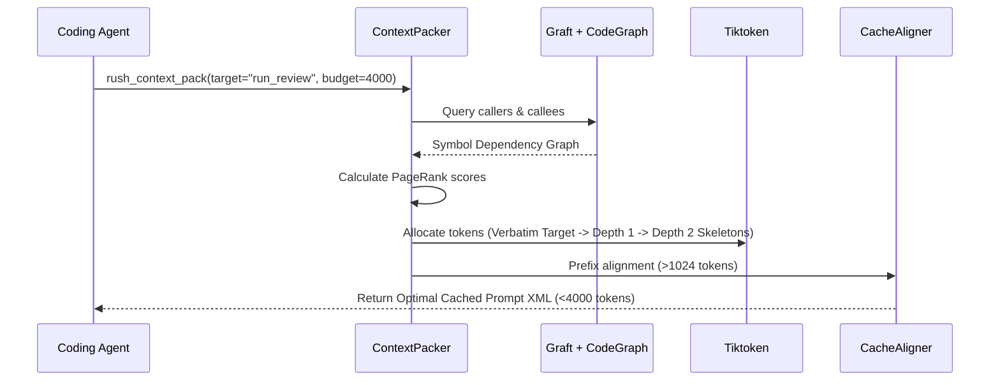

# Phase 44: Graph-Pruned Context Packing & Prompt Cache Prefix Alignment

## Metadata
- **Phase ID**: `PHASE-44` (Phase 44 of Innovation Roadmap)
- **Phase Name**: Graph-Pruned Context Packing, Prompt Cache Alignment & Stale Read Sweeping
- **Plan Version**: `v1.1.0`
- **Phase Implementation Version**: `v0.3.0-alpha.4`
- **Plan Status**: `READY_FOR_EXECUTION`
- **Source Report Path**: [`docs/rush-token-innovation-enhancement-report-plan.md`](file:///C:/Users/james/developer/rush-cli/docs/rush-token-innovation-enhancement-report-plan.md)
- **Governing ADRs**: [`ADR-0019`](file:///C:/Users/james/developer/rush-cli/docs/adr/0019-native-graft-semantic-slicing-and-tree-sitter.md), [`ADR-0032`](file:///C:/Users/james/developer/rush-cli/docs/adr/0032-code-property-graph-pruned-context-packing-and-token-budgeting.md), [`ADR-0038`](file:///C:/Users/james/developer/rush-cli/docs/adr/0038-context-intelligence-engine-and-ccr-architecture.md), [`ADR-0043`](file:///C:/Users/james/developer/rush-cli/docs/adr/0043-stale-tool-result-deduplication-and-not-modified-hashes.md), [`ADR-0048`](file:///C:/Users/james/developer/rush-cli/docs/adr/0048-hybrid-dual-engine-architecture-graft-and-codegraph.md)
- **Repository Path**: `C:\Users\james\developer\rush-cli`
- **Baseline Branch**: `main`
- **Baseline Commit**: `e76c4035a6997b7e27dd603e81a625870bc2af87`
- **Application Version**: `0.3.0-alpha.3` -> `0.3.0-alpha.4`
- **Planned Implementation Branch**: `feat/phase-44-context-pack-prompt-cache`
- **Planned Worktree Path**: `.rush/worktrees/phase-44-context-pack`
- **Planned Final Commit Message**: `feat(phase-44): implement graph-pruned context packing, prompt cache aligner, and stale sweeper`
- **Phase Owner**: Context Intelligence & Token Economy Engineer
- **Prerequisite Phases**: Phase 02 (`PHASE-42`), Phase 03 (`PHASE-43`)
- **Dependent Phases**: Phase 05 (`PHASE-45`), Phase 06 (`PHASE-46`)
- **Estimated Complexity**: High (15 Story Points)
- **Risk Level**: Medium
- **Last Reviewed Date**: 2026-08-22

---

## 1. Phase Summary
Phase 04 delivers PageRank-budgeted context prompt packing (`rush context pack`), multi-turn stale read deduplication (`TokenTamer` pattern), and multi-provider prompt cache prefix alignment. It allows agents to request tailored context packages with exact token caps (e.g. 4000 tokens) containing verbatim target symbols and compressed transitive dependencies, while guaranteeing $\ge 85\%$ provider KV cache hit rates.

---

## 2. Initial Goal
Eliminate prompt context explosion on complex multi-file refactoring tasks by packing only the highest-PageRank symbol dependencies within a strict token budget, while preventing multi-turn history accumulation.

---

## 3. End-State Outcome
1. **PageRank-Budgeted Context Packing**: `rush context pack --symbol <NAME> --budget 4000` packs verbatim target implementation, depth-1 caller/callee signatures, and depth-2 compressed outlines in $<30\text{ ms}$.
2. **Stale Read Sweeper**: `StaleSweeper` collapses earlier turns' file reads into 1-line skeleton signatures while preserving the active turn verbatim (saving 60–80% in long sessions).
3. **Prompt Cache Prefix Aligner**: `CacheAligner` structures prompt prefixes to exceed the 1,024-token boundary and injects provider-specific cache control tags (`cache_control: {"type": "ephemeral"}`).

---

## 4. User and Agent Value
* **User Value**: Huge drop in API costs (85%+ discount on cached tokens); faster model response times.
* **Agent Value**: Never hits context window limits; receives mathematically prioritized code context for reasoning.

---

## 5. Scope Included
* `T07`: Stale Read Sweeper & Session Deduplication (`src/rush/token_economy/stale_sweeper.py`).
* `T08`: Multi-Provider Prompt Cache Aligner (`src/rush/token_economy/cache_aligner.py`).
* `I01`: Graph-Pruned Context Packer & PageRank Budgeter (`src/rush/codegraph/context_packer.py`).

---

## 6. Scope Explicitly Excluded
* Terminal gain HUD (deferred to Phase 05).
* Flaky test healing (deferred to Phase 07).

---

## 7. Current Repository State
* Phases 01–03 active.
* AST Skeletons, CCR, and Grounding Verifier fully functional.
* Graft integration (`src/rush/integrations/graft.py`) available for call graph reachability.

---

## 8. Existing Behavior
Agents query entire files or rely on manual multi-file reads, accumulating tens of thousands of redundant tokens across conversational turns without KV cache optimization.

---

## 9. Desired Behavior
1-command `rush context pack` generates an optimal, PageRank-weighted XML/TOON context prompt bounded strictly by `max_tokens`, with invariant prefixes padded for KV cache hits.

---

## 10. Functional Requirements
* `FR-04-01`: `ContextPacker` must traverse CodeGraph and Graft to rank symbol dependencies using PageRank.
* `FR-04-02`: Total token count of packed context must not exceed `max_tokens` (enforced via `tiktoken`).
* `FR-04-03`: `StaleSweeper` must collapse reads older than current turn to 1-line signatures.
* `FR-04-04`: `CacheAligner` must pad invariant system prefixes above 1,024 tokens.

---

## 11. Non-Functional Requirements
* Context packing latency $<30\text{ ms}$ for 100,000 node graph.
* Prompt cache hit rate $\ge 85\%$ across multi-turn sessions.

---

## 12. Invariants That Must Not Change
* **AGENTS.md Stdio Transport Invariant**: Rush is a stdio-only MCP server. Stdout is reserved strictly for JSON-RPC messages during FastMCP serve mode; all diagnostics, telemetry summaries, and logs belong on stderr. All external commands must execute via `run_subprocess()` with `stdin=DEVNULL`, preventing any child process from hijacking or corrupting the MCP stdio transport.
* **Transport Seam Equality**: CLI subcommands and FastMCP tool registrations must call the exact same underlying implementations in `src/rush/tools/`, `src/rush/token_economy/`, or `src/rush/codegraph/`. Never duplicate tool execution logic in the transport adapter layer.
* **Canonical ToolResult Shape**: All tools must emit structured results matching the canonical `ToolResult` shape (`tool`, `engine`, `version`, `status`, `duration_ms`, `summary`, `findings`), with optional `--format toon` wire serialization.
* Target symbol source code must remain 100% verbatim.
* CCR chunk hash anchors must be embedded on all skeletonized peripheral functions.

---

---

## 13. Dependencies and Prerequisites
* Tree-sitter, `tiktoken`, Graft, SQLite WAL CodeGraph.

---

## 14. Exact Files Allowed to Modify

| File Path | Target Symbols / Sections | Permitted Change Type | Rationale |
|---|---|---|---|
| `src/rush/cli.py` | CLI Routing Groups | Modify | Register `rush context pack`, `rush context align-prompt`. |
| `src/rush/mcp.py` | FastMCP Tool Registrations | Modify | Register `rush_context_pack` FastMCP tool. |
| `src/rush/config/model.py` | Pydantic Configuration Models | Modify | Add `[context_intel.context_pack]` schema model. |

---

## 15. Exact Files Allowed to Create

| File Path | Purpose | Owner Subsystem | Tests Covering | Docs Describing |
|---|---|---|---|---|
| `src/rush/codegraph/context_packer.py` | PageRank context packing engine | CodeGraph Subsystem | `test_context_packer.py` | `docs/guide/token_budgeting.md` |
| `src/rush/token_economy/stale_sweeper.py` | Multi-turn stale read sweeper | Token Economy | `test_stale_sweeper.py` | `docs/specs/stale-sweeper.md` |
| `src/rush/token_economy/cache_aligner.py` | Prompt cache prefix aligner | Token Economy | `test_cache_aligner.py` | `docs/specs/prompt-caching.md` |

---

## 16. Exact Files That Are Read-Only
* `src/rush/integrations/graft.py`
* `src/rush/token_economy/ccr_store.py`
* `src/rush/token_economy/distillers/`

---

## 17. Exact Files and Directories That Must Not Be Touched
* `src/rush/tools/ship/`
* `src/rush/memory/`

---

## 18. Required Symbols, Interfaces, Commands, and Schemas

```python
class ContextPacker:
    def pack(self, target_file: Path, target_symbol: str, max_tokens: int = 4000) -> str: ...

class CacheAligner:
    def align_prompt(self, system_prompt: str, tools: list[dict], messages: list[dict]) -> dict[str, Any]: ...

class StaleSweeper:
    def sweep_transcript(self, transcript_messages: list[dict]) -> list[dict]: ...
```

---

## 19. Agent Interaction Design
* FastMCP Tool: `rush_context_pack(path="src/rush/tools/review.py", symbol="run_review", max_tokens=4000)`.
* Returns structured XML: `<rush_context target="run_review"> ... </rush_context>`.

---

## 20. Application Integration Design
* Interacts with `LocalGraftContext` for external project call graphs and `src/rush/codegraph/` for AST nodes.

---

## 21. Data Flow and Control Flow



---

## 22. Error Handling and Fallback Behavior

| Error Code | Classification | Severity | Condition | Fallback Action |
|---|---|---|---|---|
| `ERR-PACK-SYMBOL-NOT-FOUND` | Graph Error | Warning | Target symbol missing from AST graph | Fallback to file-level skeleton |
| `ERR-BUDGET-EXCEEDED`      | Slicing | Warning | Minimal skeleton exceeds max_tokens | Elide docstrings aggressively |

---

## 23. Logging and Observability
* Log packed token counts and graph traversal time to `.rush/telemetry/context_pack.log`.

---

## 24. Versioning and Compatibility
* FastMCP tool `rush_context_pack` added (v1.0.0). Fully backward-compatible.

---

## 25. TDD Strategy (Red-Green-Refactor)
1. Write context packing tests enforcing 2000 and 4000 token limits.
2. Write stale sweeper tests verifying turn-1 skeletonization on turn-2.
3. Write cache alignment tests validating 1,024-token prefix padding.

---

## 26. Ordered Implementation Tasks
- [ ] **TASK-04-01**: Implement `ContextPacker` in `src/rush/codegraph/context_packer.py`.
- [ ] **TASK-04-02**: Implement `StaleSweeper` in `src/rush/token_economy/stale_sweeper.py`.
- [ ] **TASK-04-03**: Implement `CacheAligner` in `src/rush/token_economy/cache_aligner.py`.
- [ ] **TASK-04-04**: Connect CLI commands in `src/rush/cli.py` and FastMCP tool `rush_context_pack` in `src/rush/mcp.py`.
- [ ] **TASK-04-05**: Run regression test suite and doc sync.

---

## 27. Test Plan
* `tests/test_context_packer.py`: Verify strict token budgets and PageRank ordering.
* `tests/test_stale_sweeper.py`: Verify multi-turn transcript collapsing.
* `tests/test_cache_aligner.py`: Verify cache prefix padding and Anthropic breakpoint tags.

---

## 28. Documentation Updates
* Create `docs/tools/context_intel.md`.
* Create `docs/guide/token_budgeting.md`.
* Update `docs/CLI_REFERENCE.md` and `docs/MCP_REFERENCE.md` with `rush context pack`.

---

## 29. Worktree Workflow

> [!IMPORTANT]
> **NO AUTOMATIC MERGE POLICY**: All implementation, tests, and documentation must be completed and committed exclusively on the dedicated feature branch inside the worktree. **DO NOT MERGE TO `main`**. Merging to `main` is strictly prohibited unless explicitly requested and approved by the user.
* **Worktree Path**: `.rush/worktrees/phase-44-context-pack`
* **Branch**: `feat/phase-44-context-pack-prompt-cache`
* **Creation Command**:
  ```bash
  git worktree add -b feat/phase-44-context-pack-prompt-cache .rush/worktrees/phase-44-context-pack main
  ```

---

## 30. Commit Requirements

> [!IMPORTANT]
> **COMMIT-ONLY MANDATE**: Commit all code, test suites, and the comprehensive 5-tier documentation matrix atomically to the feature branch. **DO NOT execute `git merge` or fast-forward `main`**. Stop after committing to the feature branch and present deliverables for user review and approval.
* **Commit Message**: `feat(phase-44): implement graph-pruned context packing, prompt cache aligner, and stale sweeper`

---

## 31. Validation Checklist
- [ ] `rush context pack` stays strictly within requested token budget.
- [ ] Target symbol body is 100% verbatim.
- [ ] Stale file reads are collapsed to 1 line in multi-turn sessions.
- [ ] `scripts/sync_docs.py --check` passes with 100% parity.

---

## 32. Acceptance Criteria
* All context packing, cache alignment, and stale sweeping tests pass with zero regressions.

---

## 33. Exit Criteria
* All tasks complete, tests green, worktree clean.

---

## 34. Risks and Mitigations
* *Risk*: High graph density causes slow traversal. *Mitigation*: Cap breadth-first search at depth 3.

---

## 35. Rollback and Recovery
* Disable `context_intel.context_pack` in `rush.toml`.

---

## 36. Final Phase Deliverables
* `src/rush/codegraph/context_packer.py`
* `src/rush/token_economy/stale_sweeper.py`
* `src/rush/token_economy/cache_aligner.py`
* Complete unit test suite and user guides.

---

## 37. Open Questions and Decisions Required
* None.
