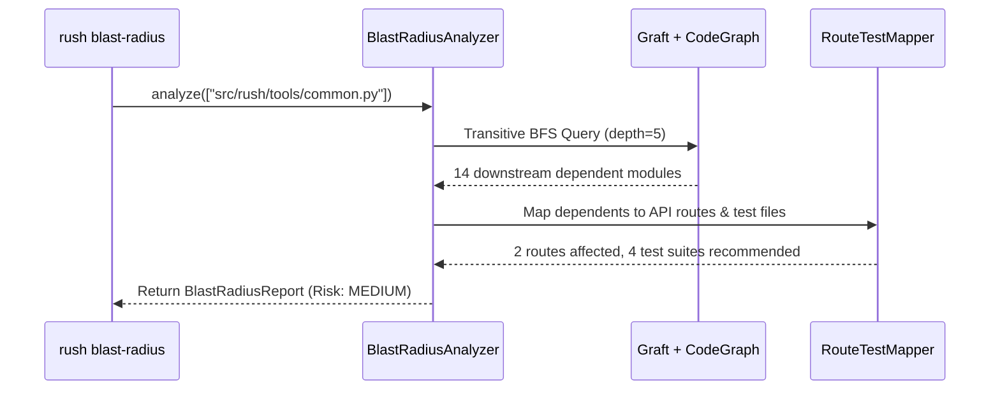

# Phase 46: Transitive Blast Radius & Declarative Architectural Guard

## Metadata
- **Phase ID**: `PHASE-46` (Phase 46 of Innovation Roadmap)
- **Phase Name**: Transitive Downstream Blast Radius & Declarative Architectural Layer Guard
- **Plan Version**: `v1.1.0`
- **Phase Implementation Version**: `v0.3.0-alpha.6`
- **Plan Status**: `READY_FOR_EXECUTION`
- **Source Report Path**: [`docs/rush-token-innovation-enhancement-report-plan.md`](file:///C:/Users/james/developer/rush-cli/docs/rush-token-innovation-enhancement-report-plan.md)
- **Governing ADRs**: [`ADR-0019`](file:///C:/Users/james/developer/rush-cli/docs/adr/0019-native-graft-semantic-slicing-and-tree-sitter.md), [`ADR-0032`](file:///C:/Users/james/developer/rush-cli/docs/adr/0032-code-property-graph-pruned-context-packing-and-token-budgeting.md), [`ADR-0044`](file:///C:/Users/james/developer/rush-cli/docs/adr/0044-clean-room-implementation-of-codebase-indexing-algorithms.md), [`ADR-0048`](file:///C:/Users/james/developer/rush-cli/docs/adr/0048-hybrid-dual-engine-architecture-graft-and-codegraph.md)
- **Repository Path**: `C:\Users\james\developer\rush-cli`
- **Baseline Branch**: `main`
- **Baseline Commit**: `e76c4035a6997b7e27dd603e81a625870bc2af87`
- **Application Version**: `0.3.0-alpha.5` -> `0.3.0-alpha.6`
- **Planned Implementation Branch**: `feat/phase-46-blast-radius-arch-guard`
- **Planned Worktree Path**: `.rush/worktrees/phase-46-blast-radius`
- **Planned Final Commit Message**: `feat(phase-46): implement blast radius reachability analyzer and declarative architecture guard`
- **Phase Owner**: Architectural Analysis & CodeGraph Specialist
- **Prerequisite Phases**: Phase 04 (`PHASE-44`), Phase 05 (`PHASE-45`)
- **Dependent Phases**: Phase 07 (`PHASE-47`), Phase 08 (`PHASE-48`)
- **Estimated Complexity**: Medium (12 Story Points)
- **Risk Level**: Low-Medium
- **Last Reviewed Date**: 2026-08-22

---

## 1. Phase Summary
Phase 06 equips Rush with deep architectural impact analysis and structural boundary governance. It implements the Transitive Blast Radius Analyzer (`rush blast-radius`), traversing the CodeGraph and Graft to calculate downstream reachability across API routes and test suites, and implements the Declarative Architectural Layer Guard (`rush arch-guard` / `[architecture.layers]` in `rush.toml`) enforcing strict clean-architecture import matrices.

---

## 2. Initial Goal
Prevent unintended breaking regressions and stop architectural layer violations (e.g. database logic leaking into presentation layers) before code is committed.

---

## 3. End-State Outcome
1. **Transitive Blast Radius Analyzer**: `rush blast-radius --changed-file <FILE>` calculates exact downstream reachability depth, affected API endpoints, and necessary test suites in $<25\text{ ms}$.
2. **Declarative Architecture Guard**: `rush arch-guard` validates all import statements against declarative layer boundary matrices in `rush.toml` and halts unauthorized cross-layer imports.

---

## 4. User and Agent Value
* **User Value**: Protects clean architecture boundaries and prevents silent breaking changes across large monorepos.
* **Agent Value**: Enables agents to know exactly which test suites to run after modifying a shared utility function.

---

## 5. Scope Included
* `I03`: Transitive Downstream Blast Radius Analyzer (`src/rush/tools/blast_radius.py`).
* `I04`: Declarative Architectural Boundary Guard (`src/rush/tools/arch_guard.py`).

---

## 6. Scope Explicitly Excluded
* Flaky test healing (deferred to Phase 07).
* Database migration drift (deferred to Phase 08).

---

## 7. Current Repository State
* Phases 01–05 active.
* CodeGraph and Graft integration available for reachability queries.

---

## 8. Existing Behavior
Developers modify core symbols without realizing they break downstream API routes 4 hops away; agents frequently introduce illegal circular or reverse layer imports.

---

## 9. Desired Behavior
Modifying a symbol outputs a risk score and affected routes in $<25\text{ ms}$. Illegal cross-layer imports are blocked at pre-commit and FastMCP invocation.

---

## 10. Functional Requirements
* `FR-06-01`: `BlastRadiusAnalyzer` must perform breadth-first traversal up to depth $N$ on CodeGraph / Graft.
* `FR-06-02`: `ArchGuard` must parse `[architecture.layers]` rules (e.g. `domain -> []`, `application -> [domain]`, `infra -> [application, domain]`).
* `FR-06-03`: `rush arch-guard` must exit with non-zero code on layer violations.

---

## 11. Non-Functional Requirements
* Blast radius reachability calculation $<25\text{ ms}$ for 100,000 node graph.
* Architectural rule validation $<15\text{ ms}$ over 500 files.

---

## 12. Invariants That Must Not Change
* **AGENTS.md Stdio Transport Invariant**: Rush is a stdio-only MCP server. Stdout is reserved strictly for JSON-RPC messages during FastMCP serve mode; all diagnostics, telemetry summaries, and logs belong on stderr. All external commands must execute via `run_subprocess()` with `stdin=DEVNULL`, preventing any child process from hijacking or corrupting the MCP stdio transport.
* **Transport Seam Equality**: CLI subcommands and FastMCP tool registrations must call the exact same underlying implementations in `src/rush/tools/`, `src/rush/token_economy/`, or `src/rush/codegraph/`. Never duplicate tool execution logic in the transport adapter layer.
* **Canonical ToolResult Shape**: All tools must emit structured results matching the canonical `ToolResult` shape (`tool`, `engine`, `version`, `status`, `duration_ms`, `summary`, `findings`), with optional `--format toon` wire serialization.
* Zero modifications to underlying source files during analysis.

---

---

## 13. Dependencies and Prerequisites
* Tree-sitter, Graft, SQLite CodeGraph, Phase 05 deliverables.

---

## 14. Exact Files Allowed to Modify

| File Path | Target Symbols / Sections | Permitted Change Type | Rationale |
|---|---|---|---|
| `src/rush/cli.py` | CLI Routing Groups | Modify | Register `rush blast-radius`, `rush arch-guard`. |
| `src/rush/mcp.py` | FastMCP Tool Registrations | Modify | Register `rush_blast_radius`, `rush_arch_guard`. |
| `src/rush/config/model.py` | Configuration Schemas | Modify | Add `[architecture.layers]` configuration schema model. |

---

## 15. Exact Files Allowed to Create

| File Path | Purpose | Owner Subsystem | Tests Covering | Docs Describing |
|---|---|---|---|---|
| `src/rush/tools/blast_radius.py` | Blast radius reachability analyzer | CodeGraph Tools | `test_blast_radius.py` | `docs/tools/blast_radius.md` |
| `src/rush/tools/arch_guard.py` | Layer boundary enforcement guard | Quality Tools | `test_arch_guard.py` | `docs/tools/arch_guard.md` |

---

## 16. Exact Files That Are Read-Only
* `src/rush/integrations/graft.py`
* `src/rush/codegraph/slicer.py`
* `src/rush/token_economy/`

---

## 17. Exact Files and Directories That Must Not Be Touched
* `src/rush/tools/ship/`
* `src/rush/memory/`

---

## 18. Required Symbols, Interfaces, Commands, and Schemas

```python
from pydantic import BaseModel, Field
from pathlib import Path

class BlastRadiusReport(BaseModel):
    target_files: list[str]
    max_depth: int
    affected_files: list[str]
    affected_routes: list[str]
    recommended_tests: list[str]
    risk_score: str

class BlastRadiusAnalyzer:
    def analyze(self, changed_files: list[Path], max_depth: int = 5) -> BlastRadiusReport: ...

class ArchGuard:
    def evaluate_boundaries(self, project_root: Path, layers_config: dict[str, list[str]]) -> list[dict[str, Any]]: ...
```

---

## 19. Agent Interaction Design
* FastMCP Tool `rush_blast_radius(changed_files=["src/rush/tools/common.py"])` returns affected downstream files and recommended tests.

---

## 20. Application Integration Design
* Integrates with pre-commit hook and `rush pr-synthesize`.

---

## 21. Data Flow and Control Flow



---

## 22. Error Handling and Fallback Behavior

| Error Code | Classification | Severity | Condition | Fallback Action |
|---|---|---|---|---|
| `ERR-ARCH-LAYER-VIOLATION`| Compliance | Error | Forbidden cross-layer import detected | Fail check and output offending line |
| `ERR-GRAPH-DISCONNECTED` | Analysis | Info | Changed symbol has no downstream callers | Return isolated score safely |

---

## 23. Logging and Observability
* Log blast radius scores and architectural violations to `.rush/telemetry/arch.log`.

---

## 24. Versioning and Compatibility
* Adds `[architecture.layers]` table to `rush.toml`. Fully backward-compatible.

---

## 25. TDD Strategy (Red-Green-Refactor)
1. Write multi-hop graph reachability tests.
2. Write architecture layer violation tests with forbidden imports.

---

## 26. Ordered Implementation Tasks
- [ ] **TASK-06-01**: Implement `BlastRadiusAnalyzer` in `src/rush/tools/blast_radius.py`.
- [ ] **TASK-06-02**: Implement `ArchGuard` in `src/rush/tools/arch_guard.py`.
- [ ] **TASK-06-03**: Wire CLI commands in `src/rush/cli.py` and FastMCP tools in `src/rush/mcp.py`.
- [ ] **TASK-06-04**: Run regression test suite and doc sync.

---

## 27. Test Plan
* `tests/test_blast_radius.py`: Multi-hop reachability, affected test suite identification, risk tier assignment.
* `tests/test_arch_guard.py`: Clean architecture import matrix enforcement and forbidden import violation alerts.

---

## 28. Documentation Updates
* Create `docs/tools/blast_radius.md`.
* Create `docs/tools/arch_guard.md`.
* Update `docs/CONFIG_SCHEMA.md` with `[architecture.layers]` rules.

---

## 29. Worktree Workflow

> [!IMPORTANT]
> **NO AUTOMATIC MERGE POLICY**: All implementation, tests, and documentation must be completed and committed exclusively on the dedicated feature branch inside the worktree. **DO NOT MERGE TO `main`**. Merging to `main` is strictly prohibited unless explicitly requested and approved by the user.
* **Worktree Path**: `.rush/worktrees/phase-46-blast-radius`
* **Branch**: `feat/phase-46-blast-radius-arch-guard`
* **Creation Command**:
  ```bash
  git worktree add -b feat/phase-46-blast-radius-arch-guard .rush/worktrees/phase-46-blast-radius main
  ```

---

## 30. Commit Requirements

> [!IMPORTANT]
> **COMMIT-ONLY & FULL-CORPUS DOCS MANDATE**:
> 1. **Mandatory Docs Sweep**: Execute the full-corpus documentation sweep updating 20+ files across all 5 tiers before committing.
> 2. **Pre-Commit Staging Audit**: Check `git status --short` to verify that `docs/` changes span all 5 tiers alongside `src/` and `tests/`.
> 3. **Atomic Commit**: Commit code, tests, and all documentation updates together in a single commit on the feature branch.
> 4. **No Merging**: DO NOT merge or fast-forward to `main` without explicit user approval.
* * **Commit Message**: `feat(phase-46): implement blast radius reachability analyzer and declarative architecture guard`

---

## 31. Validation Checklist
- [ ] Blast radius computes transitive callers up to depth 5 in $<25\text{ ms}$.
- [ ] Architecture guard catches 100% of illegal cross-layer imports.
- [ ] `scripts/sync_docs.py --check` passes with 100% parity.

---

## 32. Acceptance Criteria
* All blast radius and architecture guard tests pass with zero regressions.

---

## 33. Exit Criteria
* All tasks complete, tests green, worktree clean.

---

## 34. Risks and Mitigations
* *Risk*: Deep recursive cycles cause infinite loops. *Mitigation*: Maintain visited set during BFS traversal.

---

## 35. Rollback and Recovery
* Set `tools.blast_radius.enabled = false` and `architecture.layers.enabled = false`.

---

## 36. Final Phase Deliverables
* `src/rush/tools/blast_radius.py`
* `src/rush/tools/arch_guard.py`
* Complete unit test suite and reference docs.

---

## 37. Open Questions and Decisions Required
* None.
