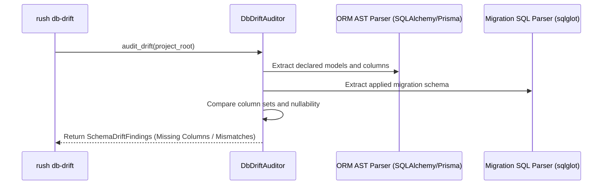

# Phase 48: Database Migration Hazard Auditor & Cognitive Complexity Decomposer

## Metadata
- **Phase ID**: `PHASE-48` (Phase 48 of Innovation Roadmap)
- **Phase Name**: ORM-to-Migration Schema Drift Auditor, Cognitive Complexity Decomposer & Type Guard Synthesizer
- **Plan Version**: `v1.1.0`
- **Phase Implementation Version**: `v0.3.0-alpha.8`
- **Plan Status**: `READY_FOR_EXECUTION`
- **Source Report Path**: [`docs/rush-token-innovation-enhancement-report-plan.md`](file:///C:/Users/james/developer/rush-cli/docs/rush-token-innovation-enhancement-report-plan.md)
- **Governing ADRs**: [`ADR-0046`](file:///C:/Users/james/developer/rush-cli/docs/adr/0046-pre-flight-ship-readiness-cockpit.md)
- **Repository Path**: `C:\Users\james\developer\rush-cli`
- **Baseline Branch**: `main`
- **Baseline Commit**: `e76c4035a6997b7e27dd603e81a625870bc2af87`
- **Application Version**: `0.3.0-alpha.7` -> `0.3.0-alpha.8`
- **Planned Implementation Branch**: `feat/phase-48-db-drift-simplify-strictify`
- **Planned Worktree Path**: `.rush/worktrees/phase-48-db-drift`
- **Planned Final Commit Message**: `feat(phase-48): implement database migration drift auditor, complexity decomposer, and type guard synthesizer`
- **Phase Owner**: Database & Code Quality Specialist
- **Prerequisite Phases**: Phase 07 (`PHASE-47`)
- **Dependent Phases**: Phase 09 (`PHASE-49`), Phase 10 (`PHASE-50`)
- **Estimated Complexity**: Medium-High (14 Story Points)
- **Risk Level**: Low-Medium
- **Last Reviewed Date**: 2026-08-22

---

## 1. Phase Summary
Phase 08 strengthens code maintainability and database reliability. It implements the ORM-to-Migration Schema Drift Auditor (`rush db-drift`) comparing SQLAlchemy/Prisma/Django models against active migration files, the Cognitive Complexity Refactoring Decomposer (`rush simplify`) isolating high-cyclomatic spaghetti functions into single-responsibility helpers, and the Algebraic Type Narrowing Synthesizer (`rush strictify`) adding runtime type guards.

---

## 2. Initial Goal
Catch un-migrated ORM model fields before deployment, automatically refactor monolithic 200-line functions, and eliminate `Any`/untyped dynamic payload hazards.

---

## 3. End-State Outcome
1. **ORM Schema Drift Auditor**: `rush db-drift` flags un-migrated model columns, mismatched nullable constraints, and missing indexes.
2. **Cognitive Complexity Decomposer**: `rush simplify --file <PATH>` decomposes functions with cognitive complexity $>15$ into clean, single-purpose helper functions with verified AST equivalence.
3. **Runtime Type Guard Synthesizer**: `rush strictify --file <PATH>` synthesizes runtime type guards (`TypeGuard`, `isinstance`, `assert`) for unvalidated API input parameters.

---

## 4. User and Agent Value
* **User Value**: Zero production database crashes from unapplied migrations; cleaner and more maintainable codebases.
* **Agent Value**: Simplifies complex code for easier LLM reasoning; ensures strict types for safe tool execution.

---

## 5. Scope Included
* `I07`: ORM-to-Migration Schema Drift Auditor (`src/rush/tools/db_drift.py`).
* `I08`: Cognitive Complexity Refactoring Decomposer (`src/rush/tools/simplify.py`).
* `I09`: Algebraic Type Narrowing & Runtime Type Guard Synthesizer (`src/rush/tools/strictify.py`).

---

## 6. Scope Explicitly Excluded
* Swarm 3-way merge (deferred to Phase 09).
* SLSA attestation (deferred to Phase 10).

---

## 7. Current Repository State
* Phases 01–07 active.
* `sqlglot` and Tree-sitter available for SQL and AST parsing.

---

## 8. Existing Behavior
Developers alter ORM models without generating migrations; monolithic spaghetti functions confuse coding agents; unvalidated JSON payloads cause runtime type errors.

---

## 9. Desired Behavior
`rush db-drift` alerts immediately if an ORM column lacks a corresponding migration; `rush simplify` generates clean refactoring patches; `rush strictify` adds runtime type guards.

---

## 10. Functional Requirements
* `FR-08-01`: `DbDriftAuditor` must parse ORM models (SQLAlchemy, Prisma) and compare against SQL/migration files using `sqlglot`.
* `FR-08-02`: `ComplexityDecomposer` must calculate cognitive complexity and extract helper sub-functions.
* `FR-08-03`: `TypeSynthesizer` must generate type narrowing validation guards.

---

## 11. Non-Functional Requirements
* ORM drift comparison $<50\text{ ms}$ over 50 tables.
* Complexity decomposition AST validation $<20\text{ ms}$ per function.

---

## 12. Invariants That Must Not Change
* **AGENTS.md Stdio Transport Invariant**: Rush is a stdio-only MCP server. Stdout is reserved strictly for JSON-RPC messages during FastMCP serve mode; all diagnostics, telemetry summaries, and logs belong on stderr. All external commands must execute via `run_subprocess()` with `stdin=DEVNULL`, preventing any child process from hijacking or corrupting the MCP stdio transport.
* **Transport Seam Equality**: CLI subcommands and FastMCP tool registrations must call the exact same underlying implementations in `src/rush/tools/`, `src/rush/token_economy/`, or `src/rush/codegraph/`. Never duplicate tool execution logic in the transport adapter layer.
* **Canonical ToolResult Shape**: All tools must emit structured results matching the canonical `ToolResult` shape (`tool`, `engine`, `version`, `status`, `duration_ms`, `summary`, `findings`), with optional `--format toon` wire serialization.
* Refactoring must preserve exact program semantics and test pass status.

---

---

## 13. Dependencies and Prerequisites
* `sqlglot`, Tree-sitter, Phase 07 deliverables.

---

## 14. Exact Files Allowed to Modify

| File Path | Target Symbols / Sections | Permitted Change Type | Rationale |
|---|---|---|---|
| `src/rush/cli.py` | CLI Routing Groups | Modify | Register `rush db-drift`, `rush simplify`, `rush strictify`. |
| `src/rush/mcp.py` | FastMCP Tool Registrations | Modify | Register `rush_db_drift`, `rush_simplify`, `rush_strictify`. |

---

## 15. Exact Files Allowed to Create

| File Path | Purpose | Owner Subsystem | Tests Covering | Docs Describing |
|---|---|---|---|---|
| `src/rush/tools/db_drift.py` | ORM-to-migration schema drift auditor | Quality Tools | `test_db_drift.py` | `docs/tools/db_drift.md` |
| `src/rush/tools/simplify.py` | Complexity refactoring decomposer | Quality Tools | `test_simplify.py` | `docs/tools/simplify.md` |
| `src/rush/tools/strictify.py` | Runtime type guard synthesizer | Quality Tools | `test_strictify.py` | `docs/tools/strictify.md` |

---

## 16. Exact Files That Are Read-Only
* `src/rush/integrations/graft.py`
* `src/rush/token_economy/`
* `src/rush/tools/ship/`

---

## 17. Exact Files and Directories That Must Not Be Touched
* `src/rush/memory/`
* `src/rush/vibecoder/`

---

## 18. Required Symbols, Interfaces, Commands, and Schemas

```python
class DbDriftAuditor:
    def audit_drift(self, project_root: Path) -> list[dict[str, Any]]: ...

class ComplexityDecomposer:
    def decompose_function(self, source_code: str, target_fn: str) -> dict[str, Any]: ...

class TypeSynthesizer:
    def synthesize_guards(self, source_code: str) -> str: ...
```

---

## 19. Agent Interaction Design
* FastMCP Tool `rush_simplify(file="src/engine.py", symbol="process_data")` returns suggested decomposed helper functions.

---

## 20. Application Integration Design
* `rush db-drift` plugs into `rush ship migration` and pre-commit checks.

---

## 21. Data Flow and Control Flow



---

## 22. Error Handling and Fallback Behavior

| Error Code | Classification | Severity | Condition | Fallback Action |
|---|---|---|---|---|
| `ERR-DRIFT-UNSUPPORTED-ORM`| ORM | Info | Custom non-standard ORM detected | Skip drift check gracefully |
| `ERR-SIMPLIFY-AST-MISMATCH`| Refactoring | Error | Synthesized helpers fail AST equivalence | Abort patch and preserve original |

---

## 23. Logging and Observability
* Log schema drift and refactoring proposals to `.rush/telemetry/quality.log`.

---

## 24. Versioning and Compatibility
* Fully backward-compatible.

---

## 25. TDD Strategy (Red-Green-Refactor)
1. Write schema drift detection tests comparing SQLAlchemy model with missing migration column.
2. Write cognitive complexity calculation and helper function extraction tests.
3. Write runtime type guard synthesis tests.

---

## 26. Ordered Implementation Tasks
- [ ] **TASK-08-01**: Implement `DbDriftAuditor` in `src/rush/tools/db_drift.py`.
- [ ] **TASK-08-02**: Implement `ComplexityDecomposer` in `src/rush/tools/simplify.py`.
- [ ] **TASK-08-03**: Implement `TypeSynthesizer` in `src/rush/tools/strictify.py`.
- [ ] **TASK-08-04**: Connect CLI commands and FastMCP tools.
- [ ] **TASK-08-05**: Run regression test suite and doc sync.

---

## 27. Test Plan
* `tests/test_db_drift.py`: Missing migration column, mismatched nullability, untracked index detection.
* `tests/test_simplify.py`: Monolithic function decomposition, cognitive score reduction, semantic equivalence.
* `tests/test_strictify.py`: Synthesizing `TypeGuard` and `isinstance` checks for loose dictionary schemas.

---

## 28. Documentation Updates
* Create `docs/tools/db_drift.md`.
* Create `docs/tools/simplify.md`.
* Create `docs/tools/strictify.md`.
* Update `docs/CLI_REFERENCE.md`.

---

## 29. Worktree Workflow

> [!IMPORTANT]
> **NO AUTOMATIC MERGE POLICY**: All implementation, tests, and documentation must be completed and committed exclusively on the dedicated feature branch inside the worktree. **DO NOT MERGE TO `main`**. Merging to `main` is strictly prohibited unless explicitly requested and approved by the user.
* **Worktree Path**: `.rush/worktrees/phase-48-db-drift`
* **Branch**: `feat/phase-48-db-drift-simplify-strictify`
* **Creation Command**:
  ```bash
  git worktree add -b feat/phase-48-db-drift-simplify-strictify .rush/worktrees/phase-48-db-drift main
  ```

---

## 30. Commit Requirements

> [!IMPORTANT]
> **COMMIT-ONLY & FULL-CORPUS DOCS MANDATE**:
> 1. **Mandatory Docs Sweep**: Execute the full-corpus documentation sweep updating 20+ files across all 5 tiers before committing.
> 2. **Pre-Commit Staging Audit**: Check `git status --short` to verify that `docs/` changes span all 5 tiers alongside `src/` and `tests/`.
> 3. **Atomic Commit**: Commit code, tests, and all documentation updates together in a single commit on the feature branch.
> 4. **No Merging**: DO NOT merge or fast-forward to `main` without explicit user approval.
* * **Commit Message**: `feat(phase-48): implement database migration drift auditor, complexity decomposer, and type guard synthesizer`

---

## 31. Validation Checklist
- [ ] `rush db-drift` detects model fields absent from migrations.
- [ ] `rush simplify` reduces cyclomatic complexity while preserving test pass.
- [ ] `rush strictify` injects valid runtime type guards.
- [ ] `scripts/sync_docs.py --check` passes with 100% parity.

---

## 32. Acceptance Criteria
* All DB drift, simplify, and strictify tests pass cleanly.

---

## 33. Exit Criteria
* All tasks complete, tests green, worktree clean.

---

## 34. Risks and Mitigations
* *Risk*: Refactoring alters execution order. *Mitigation*: Run target test suite inside sandbox worktree to verify AST equivalence.

---

## 35. Rollback and Recovery
* Disable `tools.db_drift` and `tools.simplify` in `rush.toml`.

---

## 36. Final Phase Deliverables
* `src/rush/tools/db_drift.py`
* `src/rush/tools/simplify.py`
* `src/rush/tools/strictify.py`
* Complete unit test suite and reference docs.

---

## 37. Open Questions and Decisions Required
* None.
