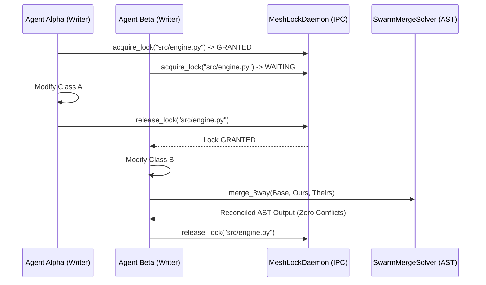

# Phase 49: Spec-to-Code Traceability, Agent Flight Recorder & Swarm 3-Way Merge

## Metadata
- **Phase ID**: `PHASE-49` (Phase 49 of Innovation Roadmap)
- **Phase Name**: Spec-to-Code Traceability, Agent Flight Recorder, Swarm 3-Way AST Merge & FastMCP Mesh Daemon
- **Plan Version**: `v1.1.0`
- **Phase Implementation Version**: `v0.3.0-alpha.9`
- **Plan Status**: `READY_FOR_EXECUTION`
- **Source Report Path**: [`docs/rush-token-innovation-enhancement-report-plan.md`](file:///C:/Users/james/developer/rush-cli/docs/rush-token-innovation-enhancement-report-plan.md)
- **Governing ADRs**: [`ADR-0035`](file:///C:/Users/james/developer/rush-cli/docs/adr/0035-multi-agent-fastmcp-mesh-lock-daemon-and-3-way-ast-reconciliation.md), [`ADR-0047`](file:///C:/Users/james/developer/rush-cli/docs/adr/0047-multi-agent-fastmcp-mesh-and-ast-3way-merge.md), [`ADR-0048`](file:///C:/Users/james/developer/rush-cli/docs/adr/0048-hybrid-dual-engine-architecture-graft-and-codegraph.md)
- **Repository Path**: `C:\Users\james\developer\rush-cli`
- **Baseline Branch**: `main`
- **Baseline Commit**: `e76c4035a6997b7e27dd603e81a625870bc2af87`
- **Application Version**: `0.3.0-alpha.8` -> `0.3.0-alpha.9`
- **Planned Implementation Branch**: `feat/phase-49-traceability-flight-recorder-swarm-merge`
- **Planned Worktree Path**: `.rush/worktrees/phase-49-swarm-merge`
- **Planned Final Commit Message**: `feat(phase-49): implement spec traceability, flight recorder, swarm merge, and FastMCP mesh lock daemon`
- **Phase Owner**: Multi-Agent Orchestration & Traceability Specialist
- **Prerequisite Phases**: Phase 07 (`PHASE-47`), Phase 08 (`PHASE-48`)
- **Dependent Phases**: Phase 10 (`PHASE-50`)
- **Estimated Complexity**: High (18 Story Points)
- **Risk Level**: Medium
- **Last Reviewed Date**: 2026-08-22

---

## 1. Phase Summary
Phase 09 equips Rush with enterprise-grade multi-agent governance and deterministic artifact traceability. It implements the Spec-to-Code Traceability Scanner (`rush trace`), the Agent Flight Recorder & Session Replayer (`rush flight-recorder`), the Swarm 3-Way AST Merge Conflict Solver (`rush swarm-merge`), the Local Multi-Agent FastMCP Mesh Lock Daemon (`src/rush/mcp_mesh/`), and the Zero-Cloud GitHub Actions Workflow Emulator (`rush simulate-ci`).

---

## 2. Initial Goal
Eliminate drift between PRD specifications and implemented code, prevent concurrent multi-agent file overwrite race conditions, and resolve git merge conflicts automatically at the AST level.

---

## 3. End-State Outcome
1. **Spec Traceability**: `rush trace` audits every requirement ID (e.g. `[REQ-042]`) against source AST functions and test assertions, outputting a complete compliance matrix.
2. **Flight Recorder**: `rush flight-recorder --replay <SESSION_ID>` reconstructs the exact timeline of tool calls, token usage, and file edits.
3. **Multi-Agent Mesh Lock Daemon**: `src/rush/mcp_mesh/daemon.py` manages domain-socket mutual exclusion locks across concurrent agent processes.
4. **Swarm 3-Way AST Merge**: `rush swarm-merge --theirs branch-a --ours branch-b` executes 3-way AST merge conflict resolution, successfully merging non-overlapping class/method modifications without textual conflict markers.

---

## 4. User and Agent Value
* **User Value**: Complete verification that implemented code matches specifications; seamless concurrent agent swarms without corrupted files.
* **Agent Value**: Enables multiple specialized subagents to edit different functions in the same file simultaneously without lock collisions.

---

## 5. Scope Included
* `I10`: Spec-to-Code Traceability Scanner (`src/rush/tools/trace.py`).
* `I11`: Agent Flight Recorder & Session Replayer (`src/rush/tools/flight_recorder.py`).
* `I12`: Swarm 3-Way AST Merge Conflict Solver (`src/rush/tools/swarm_merge.py`).
* `I23`: Local Multi-Agent FastMCP Mesh Lock Daemon (`src/rush/mcp_mesh/daemon.py`, `src/rush/mcp_mesh/lock_manager.py`).
* `I25`: Zero-Cloud GitHub Actions Workflow Emulator (`src/rush/tools/simulate_ci.py`).

---

## 6. Scope Explicitly Excluded
* SLSA Level 3 attestation (deferred to Phase 10).
* Air-gapped ONNX local model runtime (deferred to Phase 10).

---

## 7. Current Repository State
* Phases 01–08 active.
* Tree-sitter and SQLite WAL available.

---

## 8. Existing Behavior
PRD specs drift from code with zero automated enforcement; concurrent coding agents overwrite each other's work; git conflicts require tedious manual text editing.

---

## 9. Desired Behavior
Specs are continuously verified against AST nodes; agent sessions are replayable; concurrent agents acquire granular file locks; AST merge solver resolves conflicts automatically.

---

## 10. Functional Requirements
* `FR-09-01`: `TraceScanner` must match spec tag comments against source code AST definitions and test assertions.
* `FR-09-02`: `FlightRecorder` must capture JSON-RPC input/output messages with millisecond timestamps into `.rush/sessions/flights/`.
* `FR-09-03`: `SwarmMergeSolver` must parse Base, Ours, and Theirs ASTs, reconciling distinct method additions automatically.
* `FR-09-04`: `MeshLockDaemon` must provide non-blocking `try_acquire(path, timeout)` and `release(path)` over local IPC sockets.
* `FR-09-05`: `SimulateCi` must parse `.github/workflows/*.yml` and execute steps locally in topological order.

---

## 11. Non-Functional Requirements
* Traceability scan latency $<100\text{ ms}$ over 500 files.
* IPC file lock acquisition $<1\text{ ms}$.
* 3-way AST merge resolution $<50\text{ ms}$ per file.

---

## 12. Invariants That Must Not Change
* **AGENTS.md Stdio Transport Invariant**: Rush is a stdio-only MCP server. Stdout is reserved strictly for JSON-RPC messages during FastMCP serve mode; all diagnostics, telemetry summaries, and logs belong on stderr. All external commands must execute via `run_subprocess()` with `stdin=DEVNULL`, preventing any child process from hijacking or corrupting the MCP stdio transport.
* **Transport Seam Equality**: CLI subcommands and FastMCP tool registrations must call the exact same underlying implementations in `src/rush/tools/`, `src/rush/token_economy/`, or `src/rush/codegraph/`. Never duplicate tool execution logic in the transport adapter layer.
* **Canonical ToolResult Shape**: All tools must emit structured results matching the canonical `ToolResult` shape (`tool`, `engine`, `version`, `status`, `duration_ms`, `summary`, `findings`), with optional `--format toon` wire serialization.
* AST merge must never introduce syntax errors; if semantic conflict exists, fallback to standard git conflict markers safely.

---

---

## 13. Dependencies and Prerequisites
* Tree-sitter, Git CLI, `ruamel.yaml`, Phase 08 deliverables.

---

## 14. Exact Files Allowed to Modify

| File Path | Target Symbols / Sections | Permitted Change Type | Rationale |
|---|---|---|---|
| `src/rush/cli.py` | CLI Routing Groups | Modify | Register `rush trace`, `rush flight-recorder`, `rush swarm-merge`, `rush simulate-ci`. |
| `src/rush/mcp.py` | FastMCP Tool Registrations | Modify | Register `rush_mesh_acquire_lock`, `rush_mesh_release_lock`, `rush_swarm_merge`. |

---

## 15. Exact Files Allowed to Create

| File Path | Purpose | Owner Subsystem | Tests Covering | Docs Describing |
|---|---|---|---|---|
| `src/rush/tools/trace.py` | Spec-to-code traceability scanner | Governance Tools | `test_traceability.py` | `docs/tools/trace.md` |
| `src/rush/tools/flight_recorder.py` | Agent flight recorder & replayer | Governance Tools | `test_flight_recorder.py` | `docs/tools/flight_recorder.md` |
| `src/rush/tools/swarm_merge.py` | 3-way AST merge conflict solver | Multi-Agent Tools | `test_swarm_merge.py` | `docs/tools/swarm_merge.md` |
| `src/rush/mcp_mesh/__init__.py` | Package root | Mesh Subsystem | `test_mcp_mesh.py` | `docs/architecture/multi_agent_mesh.md` |
| `src/rush/mcp_mesh/daemon.py` | Domain socket lock daemon | Mesh Subsystem | `test_mcp_mesh.py` | `docs/architecture/multi_agent_mesh.md` |
| `src/rush/mcp_mesh/lock_manager.py` | Mesh lock client context | Mesh Subsystem | `test_mcp_mesh.py` | `docs/architecture/multi_agent_mesh.md` |
| `src/rush/tools/simulate_ci.py` | Zero-cloud GHA workflow emulator | CI Tools | `test_simulate_ci.py` | `docs/tools/simulate_ci.md` |

---

## 16. Exact Files That Are Read-Only
* `src/rush/integrations/graft.py`
* `src/rush/token_economy/`
* `src/rush/tools/ship/`

---

## 17. Exact Files and Directories That Must Not Be Touched
* `src/rush/memory/`
* `src/rush/vibecoder/`

---

## 18. Required Symbols, Interfaces, Commands, and Schemas

```python
class MeshLockManager:
    def acquire(self, file_path: Path, agent_id: str, timeout_s: float = 5.0) -> bool: ...
    def release(self, file_path: Path, agent_id: str) -> bool: ...

class SwarmMergeSolver:
    def merge_3way(self, base_code: str, ours_code: str, theirs_code: str) -> dict[str, Any]: ...

class TraceScanner:
    def scan_traceability(self, project_root: Path) -> dict[str, Any]: ...
```

---

## 19. Agent Interaction Design
* Multi-agent mesh: Agents call `rush_mesh_acquire_lock(file="src/engine.py")` before editing and `rush_mesh_release_lock()` when done.

---

## 20. Application Integration Design
* `rush swarm-merge` can be configured as a custom Git merge driver (`.gitattributes`).

---

## 21. Data Flow and Control Flow



---

## 22. Error Handling and Fallback Behavior

| Error Code | Classification | Severity | Condition | Fallback Action |
|---|---|---|---|---|
| `ERR-MESH-LOCK-TIMEOUT` | Concurrency | Error | File lock held beyond requested timeout | Abort edit and inform agent |
| `ERR-MERGE-AST-CONFLICT`| AST Merge | Warning | Both agents modified identical AST node | Fallback to standard git conflict markers |

---

## 23. Logging and Observability
* Log all lock acquisitions and merge operations to `.rush/telemetry/mesh.log`.

---

## 24. Versioning and Compatibility
* FastMCP mesh protocol v1.0.0. Fully backward-compatible.

---

## 25. TDD Strategy (Red-Green-Refactor)
1. Write IPC domain socket lock acquisition, concurrency contention, and automatic timeout release tests.
2. Write 3-way AST merge tests with non-conflicting method insertions in Python and TypeScript.
3. Write spec-to-code traceability regex and AST linkage tests.

---

## 26. Ordered Implementation Tasks
- [ ] **TASK-09-01**: Implement `MeshLockDaemon` and `MeshLockManager` in `src/rush/mcp_mesh/`.
- [ ] **TASK-09-02**: Implement `SwarmMergeSolver` in `src/rush/tools/swarm_merge.py`.
- [ ] **TASK-09-03**: Implement `TraceScanner` in `src/rush/tools/trace.py`.
- [ ] **TASK-09-04**: Implement `FlightRecorder` in `src/rush/tools/flight_recorder.py`.
- [ ] **TASK-09-05**: Implement `SimulateCi` in `src/rush/tools/simulate_ci.py`.
- [ ] **TASK-09-06**: Wire CLI commands and FastMCP tools.
- [ ] **TASK-09-07**: Run regression test suite and doc sync.

---

## 27. Test Plan
* `tests/test_mcp_mesh.py`: Domain socket lock concurrency, contention, deadlock avoidance, heartbeat.
* `tests/test_swarm_merge.py`: 3-way AST merge of parallel class method additions and import statement merging.
* `tests/test_traceability.py`: Spec ID parsing, source code AST mapping, missing requirement reporting.
* `tests/test_flight_recorder.py`: Recording session steps and replaying state chronologically.
* `tests/test_simulate_ci.py`: Parsing GitHub Actions matrix and executing local steps.

---

## 28. Documentation Updates
* Create `docs/tools/trace.md`.
* Create `docs/tools/flight_recorder.md`.
* Create `docs/tools/swarm_merge.md`.
* Create `docs/architecture/multi_agent_mesh.md`.
* Update `docs/CLI_REFERENCE.md`.

---

## 29. Worktree Workflow
* **Worktree Path**: `.rush/worktrees/phase-49-swarm-merge`
* **Branch**: `feat/phase-49-traceability-flight-recorder-swarm-merge`
* **Creation Command**:
  ```bash
  git worktree add -b feat/phase-49-traceability-flight-recorder-swarm-merge .rush/worktrees/phase-49-swarm-merge main
  ```

---

## 30. Commit Requirements
* **Commit Message**: `feat(phase-49): implement spec traceability, flight recorder, swarm merge, and FastMCP mesh lock daemon`

---

## 31. Validation Checklist
- [ ] Mesh lock daemon prevents concurrent write collisions.
- [ ] 3-way AST merge resolves non-overlapping edits cleanly.
- [ ] Spec traceability produces 100% accurate compliance matrices.
- [ ] `scripts/sync_docs.py --check` passes with 100% parity.

---

## 32. Acceptance Criteria
* All mesh lock, swarm merge, trace, and flight recorder tests pass.

---

## 33. Exit Criteria
* All tasks complete, tests green, worktree clean.

---

## 34. Risks and Mitigations
* *Risk*: Stale locks held by crashed agent processes. *Mitigation*: Implement 30-second TTL heartbeat on all mesh locks.

---

## 35. Rollback and Recovery
* Stop mesh daemon; release `.rush/locks/`.

---

## 36. Final Phase Deliverables
* `src/rush/mcp_mesh/`
* `src/rush/tools/swarm_merge.py`
* `src/rush/tools/trace.py`
* `src/rush/tools/flight_recorder.py`
* `src/rush/tools/simulate_ci.py`
* Complete unit test suite and architecture specs.

---

## 37. Open Questions and Decisions Required
* None.
