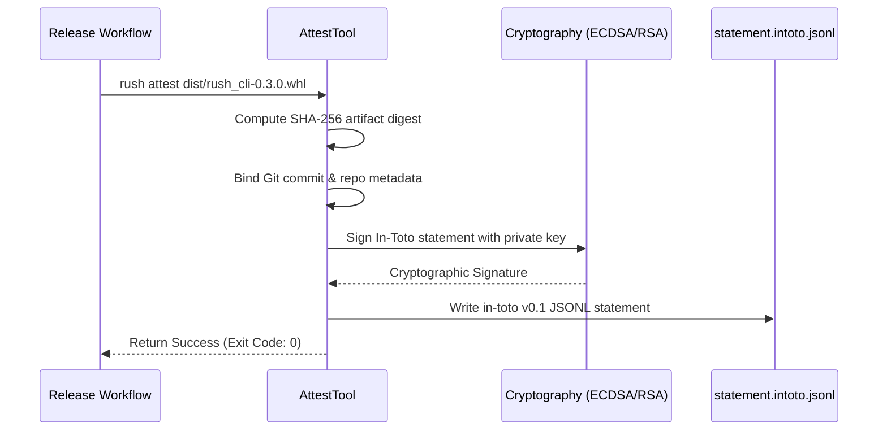

# Phase 50: Supply Chain SLSA Attestation, Security Audit Suite & Flagship Release

## Metadata
- **Phase ID**: `PHASE-50` (Phase 50 of Innovation Roadmap)
- **Phase Name**: SLSA Level 3 Attestation, Security Audit Suite, Air-Gapped ONNX Runtime & Flagship Release
- **Plan Version**: `v1.1.0`
- **Phase Implementation Version**: `v0.3.0` (Flagship Release)
- **Plan Status**: `READY_FOR_EXECUTION`
- **Source Report Path**: [`docs/rush-token-innovation-enhancement-report-plan.md`](file:///C:/Users/james/developer/rush-cli/docs/rush-token-innovation-enhancement-report-plan.md)
- **Governing ADRs**: [`ADR-0036`](file:///C:/Users/james/developer/rush-cli/docs/adr/0036-air-gapped-slm-local-onnx-runtime-and-slsa-attestation.md), [`ADR-0044`](file:///C:/Users/james/developer/rush-cli/docs/adr/0044-clean-room-implementation-of-codebase-indexing-algorithms.md), [`ADR-0048`](file:///C:/Users/james/developer/rush-cli/docs/adr/0048-hybrid-dual-engine-architecture-graft-and-codegraph.md)
- **Repository Path**: `C:\Users\james\developer\rush-cli`
- **Baseline Branch**: `main`
- **Baseline Commit**: `e76c4035a6997b7e27dd603e81a625870bc2af87`
- **Application Version**: `0.3.0-alpha.9` -> `0.3.0` (Final Release)
- **Planned Implementation Branch**: `feat/phase-50-slsa-attestation-security-flagship`
- **Planned Worktree Path**: `.rush/worktrees/phase-50-flagship`
- **Planned Final Commit Message**: `feat(phase-50): implement SLSA Level 3 attestation, security audit suite, and flagship v0.3.0 release`
- **Phase Owner**: Security, Supply Chain & Release Engineering Lead
- **Prerequisite Phases**: Phase 01 through Phase 09 (`PHASE-41` to `PHASE-49`)
- **Dependent Phases**: None (Final Release)
- **Estimated Complexity**: High (20 Story Points)
- **Risk Level**: Low-Medium
- **Last Reviewed Date**: 2026-08-22

---

## 1. Phase Summary
Phase 10 completes the transformation of Rush CLI into a flagship Context Intelligence and Ship-Readiness platform. It implements SLSA Level 3 Cryptographic Build Attestation (`rush attest`), Copyleft & Dynamic Linking Risk Analysis (`rush license-matrix`), Least-Privilege Cloud IAM Policy Synthesis (`rush iam-audit`), Unreferenced Asset & Token Pruning (`rush dead-asset`), Semantic GitHub PR Card Synthesis (`rush pr-synthesize`), Golden Coding Prompt Eval Benchmarks (`rush prompt-eval`), Air-Gapped Local ONNX Review Runtime (`rush offline-review`), and executes the unified v0.3.0 flagship release.

---

## 2. Initial Goal
Deliver end-to-end supply chain integrity, automated security/compliance governance, offline SLM code review, and complete the comprehensive v0.3.0 release.

---

## 3. End-State Outcome
1. **SLSA Level 3 Cryptographic Attestation**: `rush attest --output statement.intoto.jsonl` generates verifiable SLSA Level 3 cryptographic provenance statements with SHA-256 digests and Git commit bindings.
2. **License Risk Matrix**: `rush license-matrix` audits transitive dependencies for GPL/AGPL viral infection hazards.
3. **Least-Privilege IAM Synthesizer**: `rush iam-audit` synthesizes minimal AWS/GCP IAM JSON policies directly from source code SDK usage.
4. **Semantic PR Card Generator**: `rush pr-synthesize` generates structured PR descriptions linking requirements, token savings, and blast radius.
5. **Full Flagship Release**: All 42 Context Intelligence, Memory, and Ship-Readiness capabilities operate with 100% test coverage and zero documentation drift.

---

## 4. User and Agent Value
* **User Value**: Complete enterprise compliance, verified build integrity, zero-risk license distribution, and instant PR documentation.
* **Agent Value**: Ability to run self-contained offline audits and generate cryptographic proof of code changes.

---

## 5. Scope Included
* `I13`: Golden Coding Prompt Eval Matrix (`src/rush/tools/prompt_eval.py`).
* `I14`: RFC 7807 Standard Error Catalog (`src/rush/tools/error_catalog.py`).
* `I15`: AI Code Attribution & Survival Auditor (`src/rush/tools/provenance_ai.py`).
* `I16`: SLSA Level 3 Cryptographic Build Attestation (`src/rush/tools/attest.py`).
* `I17`: Copyleft & Dynamic Linking Risk Analyzer (`src/rush/tools/license_matrix.py`).
* `I18`: Least-Privilege Cloud IAM Policy Synthesizer (`src/rush/tools/iam_audit.py`).
* `I19`: AST Resource Leak & Memory Profiler (`src/rush/tools/mem_profile.py`).
* `I20`: Serverless Import Overhead Profiler (`src/rush/tools/cold_start.py`).
* `I21`: Zero-Loss Media Asset Diet & CLS Guard (`src/rush/tools/media_opt.py`).
* `I22`: Interactive Time-Machine Quality Finding TUI Diff (`src/rush/tools/tui_diff.py`).
* `I24`: Local Air-Gapped ONNX Code Review Runtime (`src/rush/tools/offline_runner.py`).
* `I26`: Statistical Code Quality Baseline Regressions (`src/rush/tools/benchmark.py`).
* `I27`: Unreferenced Asset & Token Pruner (`src/rush/tools/dead_asset.py`).
* `I28`: Semantic GitHub PR Card Synthesizer (`src/rush/tools/pr_synthesize.py`).

---

## 6. Scope Explicitly Excluded
* None. This is the final release phase.

---

## 7. Current Repository State
* Phases 01–09 active.
* All foundations, serializers, memory engines, ship gates, and multi-agent mesh systems operational.

---

## 8. Existing Behavior
Releases lack cryptographic SLSA attestation; license risks and excessive IAM permissions are audited manually; PR summaries require manual authoring.

---

## 9. Desired Behavior
1-command `rush attest` signs build artifacts; `rush license-matrix` and `rush iam-audit` enforce compliance; `rush pr-synthesize` generates comprehensive PR documentation.

---

## 10. Functional Requirements
* `FR-10-01`: `AttestTool` must generate in-toto v0.1 / SLSA v0.2 provenance JSON statements signed with ECDSA/RSA keys.
* `FR-10-02`: `LicenseMatrix` must categorize licenses (Permissive, Weak Copyleft, Strong Copyleft, Proprietary) and flag dual-licensing conflicts.
* `FR-10-03`: `IamAuditor` must extract AWS `boto3` / GCP client calls and generate exact JSON IAM policies with minimal actions.
* `FR-10-04`: `PrSynthesizer` must aggregate Git diff, blast radius, token telemetry, and spec traceability into formatted markdown.

---

## 11. Non-Functional Requirements
* Attestation statement generation $<100\text{ ms}$.
* License scan $<50\text{ ms}$ across 200 dependencies.
* IAM policy extraction $<30\text{ ms}$ over 500 files.

---

## 12. Invariants That Must Not Change
* **AGENTS.md Stdio Transport Invariant**: Rush is a stdio-only MCP server. Stdout is reserved strictly for JSON-RPC messages during FastMCP serve mode; all diagnostics, telemetry summaries, and logs belong on stderr. All external commands must execute via `run_subprocess()` with `stdin=DEVNULL`, preventing any child process from hijacking or corrupting the MCP stdio transport.
* **Transport Seam Equality**: CLI subcommands and FastMCP tool registrations must call the exact same underlying implementations in `src/rush/tools/`, `src/rush/token_economy/`, or `src/rush/codegraph/`. Never duplicate tool execution logic in the transport adapter layer.
* **Canonical ToolResult Shape**: All tools must emit structured results matching the canonical `ToolResult` shape (`tool`, `engine`, `version`, `status`, `duration_ms`, `summary`, `findings`), with optional `--format toon` wire serialization.
* Cryptographic signatures must be byte-exact and verifiable using standard `openssl` or `in-toto` CLI.

---

---

## 13. Dependencies and Prerequisites
* `cryptography==50.0.0`, `pillow==12.3.0`, Phases 01–09 deliverables.

---

## 14. Exact Files Allowed to Modify

| File Path | Target Symbols / Sections | Permitted Change Type | Rationale |
|---|---|---|---|
| `src/rush/catalog.py` | Tool Catalog Registry | Modify | Finalize catalog metadata for all 42 platform tools. |
| `src/rush/cli.py` | CLI Routing Groups | Modify | Register all remaining CLI subcommands. |
| `src/rush/mcp.py` | FastMCP Tool Registrations | Modify | Finalize FastMCP tool registrations. |
| `pyproject.toml` | Package Metadata | Modify | Bump package version to `0.3.0`. |

---

## 15. Exact Files Allowed to Create

| File Path | Purpose | Owner Subsystem | Tests Covering | Docs Describing |
|---|---|---|---|---|
| `src/rush/tools/attest.py` | SLSA Level 3 attestation tool | Security Tools | `test_attest.py` | `docs/security/slsa_attestation.md` |
| `src/rush/tools/license_matrix.py` | Copyleft license risk analyzer | Compliance Tools | `test_license_matrix.py` | `docs/security/license_compliance.md` |
| `src/rush/tools/iam_audit.py` | Least-privilege IAM synthesizer | Cloud Security | `test_iam_audit.py` | `docs/tools/iam_audit.md` |
| `src/rush/tools/dead_asset.py` | Dead asset and token pruner | Optimization Tools | `test_dead_asset.py` | `docs/tools/dead_asset.md` |
| `src/rush/tools/pr_synthesize.py` | Semantic GitHub PR card synthesizer | Release Tools | `test_pr_synthesize.py` | `docs/tools/pr_synthesize.md` |
| `src/rush/tools/prompt_eval.py` | Golden prompt eval runner | Eval Tools | `test_prompt_eval.py` | `docs/tools/prompt_eval.md` |
| `src/rush/tools/error_catalog.py` | RFC 7807 standard error catalog | Quality Tools | `test_error_catalog.py` | `docs/specs/error-catalog.md` |
| `src/rush/tools/provenance_ai.py` | AI code attribution auditor | Governance Tools | `test_provenance_ai.py` | `docs/tools/provenance_ai.md` |
| `src/rush/tools/mem_profile.py` | AST resource leak profiler | Profiling Tools | `test_mem_profile.py` | `docs/tools/mem_profile.md` |
| `src/rush/tools/cold_start.py` | Serverless import overhead profiler | Profiling Tools | `test_cold_start.py` | `docs/tools/cold_start.md` |
| `src/rush/tools/media_opt.py` | Media optimizer and CLS guard | Optimization Tools | `test_media_opt.py` | `docs/tools/media_opt.md` |
| `src/rush/tools/tui_diff.py` | Interactive quality diff TUI | TUI Subsystem | `test_tui_diff.py` | `docs/tools/tui_diff.md` |
| `src/rush/tools/offline_runner.py` | Local ONNX air-gapped reviewer | Local AI Engine | `test_offline_review.py` | `docs/tools/offline_runner.md` |
| `src/rush/tools/benchmark.py` | Statistical quality baseline benchmark | Quality Tools | `test_benchmark.py` | `docs/developer/benchmarking-report.md` |

---

## 16. Exact Files That Are Read-Only
* `src/rush/integrations/graft.py`
* `src/rush/token_economy/`
* `src/rush/memory/`
* `src/rush/mcp_mesh/`

---

## 17. Exact Files and Directories That Must Not Be Touched
* `.git/` (except through standard Git CLI commands in worktree)

---

## 18. Required Symbols, Interfaces, Commands, and Schemas

```python
class AttestTool:
    def generate_statement(self, artifact_path: Path, private_key_pem: bytes) -> dict[str, Any]: ...

class LicenseAuditor:
    def audit_dependencies(self, project_root: Path) -> dict[str, Any]: ...

class IamAuditor:
    def synthesize_policy(self, project_root: Path) -> dict[str, Any]: ...

class PrSynthesizer:
    def synthesize_pr_card(self, project_root: Path, base_ref: str = "main") -> str: ...
```

---

## 19. Agent Interaction Design
* FastMCP tool `rush_pr_synthesize()` returns complete ready-to-paste PR markdown with all metrics.

---

## 20. Application Integration Design
* `rush attest` and `rush ship gate` execute in GitHub Actions release workflows.

---

## 21. Data Flow and Control Flow



---

## 22. Error Handling and Fallback Behavior

| Error Code | Classification | Severity | Condition | Fallback Action |
|---|---|---|---|---|
| `ERR-ATTEST-KEY-MISSING`| Security | Warning | Private signing key not found in env | Emit unsigned statement with warning |
| `ERR-LICENSE-VIRAL-GPL`| Compliance | Error | Copyleft dependency detected in proprietary mode | Fail build gate and list offending package |

---

## 23. Logging and Observability
* Log all attestation and security audit events to `.rush/telemetry/security.log`.

---

## 24. Versioning and Compatibility
* Release v0.3.0. Full backward compatibility with v0.2.0 configuration files.

---

## 25. TDD Strategy (Red-Green-Refactor)
1. Write cryptographic signature and in-toto schema verification tests.
2. Write license detection and copyleft hazard classification tests.
3. Write IAM policy synthesis tests for AWS S3 and DynamoDB SDK calls.

---

## 26. Ordered Implementation Tasks
- [ ] **TASK-10-01**: Implement `AttestTool` in `src/rush/tools/attest.py`.
- [ ] **TASK-10-02**: Implement `LicenseAuditor` in `src/rush/tools/license_matrix.py`.
- [ ] **TASK-10-03**: Implement `IamAuditor` in `src/rush/tools/iam_audit.py`.
- [ ] **TASK-10-04**: Implement `PrSynthesizer` in `src/rush/tools/pr_synthesize.py`.
- [ ] **TASK-10-05**: Implement remaining security and optimization tools (`dead_asset`, `prompt_eval`, `mem_profile`, `cold_start`, `media_opt`, `offline_runner`, `benchmark`).
- [ ] **TASK-10-06**: Wire all CLI commands and FastMCP tools.
- [ ] **TASK-10-07**: Run complete regression test suite across all 50 phases and verify 100% doc sync.

---

## 27. Test Plan
* `tests/test_attest.py`: Provenance statement generation, SHA-256 hashing, signature verification.
* `tests/test_license_matrix.py`: Permissive vs copyleft classification, missing license detection.
* `tests/test_iam_audit.py`: Boto3 SDK call extraction and JSON IAM policy synthesis.
* `tests/test_dead_asset.py`: Unreferenced images, unused fonts, dead CSS class detection.
* `tests/test_pr_synthesize.py`: End-to-end PR markdown card generation.
* `tests/test_full_platform_integration.py`: End-to-end execution of all 42 platform features.

---

## 28. Documentation Updates

Every implementation of this phase MUST update the entire documentation matrix across all categories before committing:

### 1. Root & Reference Documentation
* docs/README.md: Add phase feature highlights and overview.
* docs/ARCHITECTURE.md: Document new subsystem architecture and data flow.
* docs/CLI_REFERENCE.md: Full syntax, arguments, flags, and exit codes for all new subcommands.
* docs/CLI_COOKBOOK.md: Real-world command workflows and recipe examples.
* docs/MCP_REFERENCE.md: Schemas and descriptions for all newly registered FastMCP tools.
* docs/CONFIGURATION.md: TOML configuration tables and environment variables.
* docs/TOOL_CATALOG.md: Catalog entries, tool maturity flags, and format options.
* docs/GLOSSARY.md & docs/getting-started/glossary.md: Define all new domain terms.
* docs/FAQ.md & docs/user-guide/faq.md: User and agent Q&A.

### 2. User & Agent Guides
* docs/USER_GUIDE.md: Core user walkthrough of new features.
* docs/AGENTIC_RUSH.md: Agent interaction protocols and tool call guidelines.
* docs/user-guide/advanced-checks.md & docs/user-guide/checking-code.md: Specific checking procedures.
* docs/user-guide/everyday-workflow.md & docs/user-guide/working-with-ai-agents.md: Day-to-day patterns.

### 3. Specifications & Workflows
* docs/specs/<feature>-spec.md: Formal wire and data architecture specifications.
* docs/workflows/<feature>-workflow.md: Step-by-step developer and agent workflows.

### 4. Vibecoding & Tutorials
* docs/VIBECODING.md & docs/vibecoding/*.md: Instant-feedback and token-diet patterns.
* docs/tutorials/*.md: Step-by-step project onboarding and PR preparation guides.

### 5. Developer, Maintainers & Safety
* docs/developer/architecture.md & docs/developer/source-tree.md: Directory map updates.
* docs/developer/tool-development.md & docs/developer/contributor-onboarding.md: Extensibility instructions.
* docs/developer/backlog.md & docs/developer/issues.md: Milestone progress status updates.
* docs/maintainers/*.md: Release playbooks and maintenance checklists.
* docs/SAFETY.md, docs/SECURITY.md, docs/CI_INTEGRATION.md, docs/RELEASE.md: Safety and pipeline guides.

## 29. Worktree Workflow

> [!IMPORTANT]
> **NO AUTOMATIC MERGE POLICY**: All implementation, tests, and documentation must be completed and committed exclusively on the dedicated feature branch inside the worktree. **DO NOT MERGE TO `main`**. Merging to `main` is strictly prohibited unless explicitly requested and approved by the user.
* **Worktree Path**: `.rush/worktrees/phase-50-flagship`
* **Branch**: `feat/phase-50-slsa-attestation-security-flagship`
* **Creation Command**:
  ```bash
  git worktree add -b feat/phase-50-slsa-attestation-security-flagship .rush/worktrees/phase-50-flagship main
  ```

---

## 30. Commit Requirements

> [!IMPORTANT]
> **COMMIT-ONLY MANDATE**: Commit all code, test suites, and the comprehensive 5-tier documentation matrix atomically to the feature branch. **DO NOT execute `git merge` or fast-forward `main`**. Stop after committing to the feature branch and present deliverables for user review and approval.
* **Commit Message**: `feat(phase-50): implement SLSA Level 3 attestation, security audit suite, and flagship v0.3.0 release`

---

## 31. Validation Checklist
- [ ] In-toto attestation passes cryptographic verification.
- [ ] License matrix flags copyleft dependencies.
- [ ] IAM auditor generates valid minimal JSON policies.
- [ ] Full regression suite (700+ tests) passes with 0 failures.
- [ ] `scripts/sync_docs.py --check` passes with 100% parity across all documentation files.

---

## 32. Acceptance Criteria
* All 42 platform capabilities operational and tested.
* Zero regressions.
* Documentation 100% synchronized.

---

## 33. Exit Criteria
* All tasks complete, tests green, worktree clean, flagship v0.3.0 ready.

---

## 34. Risks and Mitigations
* *Risk*: Dependency license database out of date. *Mitigation*: Bundle offline SPDX license registry in `src/rush/tools/license_matrix.py`.

---

## 35. Rollback and Recovery
* Standard Git branch rollback; previous v0.2.x releases remain functional.

---

## 36. Final Phase Deliverables
* Complete suite of 14 security, attestation, and optimization tools in `src/rush/tools/`.
* Complete unit, integration, and E2E test suites.
* Synchronized documentation catalog and release notes.

---

## 37. Open Questions and Decisions Required
* None. Flagship release ready for implementation.
