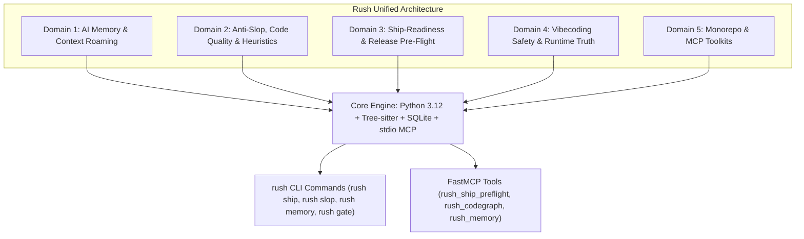

# Rush Integrations & Deep Repository Research Report

**Document Title**: Comprehensive Architectural Review, Scoring & Integration Blueprint for Rush  
**Source Manifest**: `C:\Users\james\developer\rush-cli\rushtoolsurls.txt` (73 Repositories)  
**Date**: August 2026  
**Status**: Completed Deep Research & Phased Integration Blueprint  

---

## Executive Summary

As AI-assisted pair programming and autonomous coding agents (Claude Code, Cursor, Codex, OpenClaw, Windsurf, Hermes) become the standard software development interface, development teams face an urgent challenge: **how to maintain architectural integrity, avoid AI-generated "slop" (hollow boilerplate, type erasure, band-aid fixes), enforce strict ship-readiness gates, and manage agent memory across long-running sessions.**

This report delivers a deep code-level exploration of **all 73 open-source repositories** identified in `rushtoolsurls.txt`. Rather than merely scanning `README` files, we explored the internal mechanics, AST parsers, database schemas, and protocol adapters across each project.



---

## Master Scorecard & Leaderboard (All 73 Repositories)

The repositories are evaluated across three criteria:
- **Score (1.0–10.0)**: Technical depth, architectural elegance, and implementation quality.
- **Tier Classification**:
  - **Tier 1 (Score 8.5–10.0)**: *Must-Integrate / Crown Jewels* — Core capabilities and algorithms directly matching Rush's mission.
  - **Tier 2 (Score 6.0–8.4)**: *High-Value Ideas to Borrow* — Valuable patterns, heuristics, AST rules, or secondary adapters.
  - **Tier 3 (Score 1.0–5.9)**: *Low Value / Skip* — Minimal technical depth, out-of-scope, or deprecated.

| # | Repository | Domain / Focus | Score | Tier | Target Rush Subsystem |
|---|---|---|:---:|:---:|---|
| 1 | **flamehaven01/AI-SLOP-Detector** | Code Substance & LDR Metrics | **9.5** | **Tier 1** | `src/rush/tools/slop.py` (LDR & Inflation) |
| 2 | **rsionnach/sloppylint** | Python AST Slop & Import Linter | **9.5** | **Tier 1** | `src/rush/engines/sloppylint.py` |
| 3 | **ThreeMoonsLab/agents-shipgate** | Static Agent Tool Surface Gate | **9.5** | **Tier 1** | `src/rush/tools/ship.py` (`rush gate --agent`) |
| 4 | **tejgokani/ShipCheck** | Post-Session Agent AST Security | **9.5** | **Tier 1** | `src/rush/security/` (Anti-pattern AST) |
| 5 | **Cranot/roam-code** | Louvain Graph & Minimal Context | **9.5** | **Tier 1** | `src/rush/codegraph/` (Community clustering) |
| 6 | **entireio/cli** | Shadow Git Ref Checkpointing | **9.5** | **Tier 1** | `src/rush/session_memory.py` (Shadow refs) |
| 7 | **repowise-dev/repowise** | Codebase Biomarkers & Churn | **9.5** | **Tier 1** | `src/rush/hotspots/` (Risk matrix math) |
| 8 | **Laith0003/ux-skill** | Deterministic UI/UX Anti-Slop | **9.5** | **Tier 1** | `src/rush/tools/ux.py` (Design tokens) |
| 9 | **dmmulroy/anti-slop** | TS/JS Oxlint Anti-Bypass Rules | **9.0** | **Tier 1** | `src/rush/engines/oxlint.py` |
| 10 | **buildingjoshbetter/TrueMemory** | Encoding Gate & Trait Claims | **9.0** | **Tier 1** | `src/rush/session_memory.py` (Salience gate) |
| 11 | **theanshsonkar/carto** | AST Import Map & Dynamic AGENTS.md| **9.0** | **Tier 1** | `scripts/sync_docs.py` (Topology generator) |
| 12 | **anthony-chaudhary/dos-kernel** | Trust Syscalls & Git Claim Verifier| **9.0** | **Tier 1** | `src/rush/governance/` (Syscall gates) |
| 13 | **codecoradev/cora-code** | Tri-Hybrid Search (FTS5+KNN+Graph) | **9.0** | **Tier 1** | `src/rush/codegraph/store.py` |
| 14 | **TateLyman/shipcheck-cli** | Release Launch Hazard Scanner | **9.0** | **Tier 1** | `src/rush/tools/ship.py` (`rush preflight`) |
| 15 | **Avtr99/antidote** | Anti-Band-Aid Structural Fixes | **9.0** | **Tier 1** | `src/rush/tools/slop.py` (Band-aid check) |
| 16 | **patchrail/patchrail** | 31-Class CI Triage & Redactor | **9.0** | **Tier 1** | `src/rush/tools/ci.py` (Failure classifier) |
| 17 | **modem-dev/hunk** | Review-First TUI & Semantic Hunks | **9.0** | **Tier 1** | `src/rush/tools/review.py` (Hunk viewer) |
| 18 | **nrwl/nx** | Input Hashing & Computation Cache | **9.0** | **Tier 1** | `src/rush/cache.py` (Named inputs) |
| 19 | **CodeBendKit/codeseek** | LanceDB + Tree-sitter + RRF Search | **9.0** | **Tier 1** | `src/rush/codegraph/` (RRF hybrid search) |
| 20 | **ReallyArtificial/mcp-jest** | MCP Server Testing Framework | **9.0** | **Tier 1** | `tests/test_mcp_protocol.py` |
| 21 | **MemTensor/memmy-agent** | 4-Tier Memory Hierarchy | **8.5** | **Tier 1** | `src/rush/session_memory.py` (L1-L4) |
| 22 | **scheidydude/codeindex** | Zero-Dep SQLite Symbol Map | **8.5** | **Tier 1** | `src/rush/codegraph/store.py` |
| 23 | **SprocketLab/slop-code-bench** | Iterative Spec Drift Benchmark | **8.5** | **Tier 1** | `tests/benchmarks/` (Agent drift test) |
| 24 | **angular/web-codegen-scorer** | 5-Pillar Web Quality Pipeline | **8.5** | **Tier 1** | `src/rush/tools/verify.py` |
| 25 | **nikuscs/ts-code-scan** | Fast Rust TS Skeleton Extractor | **8.5** | **Tier 1** | `src/rush/token_economy/` (AST skeletons)|
| 26 | **asamassekou10/ship-safe** | MCP Tool Injection & Perm Auditor | **8.5** | **Tier 1** | `src/rush/security/` (MCP linter) |
| 27 | **floRaths/uv-ship** | Python `uv` Atomic Release Engine | **8.5** | **Tier 1** | `src/rush/tools/release.py` |
| 28 | **jlekerli-source/ShipGuard** | Proof-Gated Release Receipts | **8.5** | **Tier 1** | `src/rush/tools/ship.py` (Receipt ledger)|
| 29 | **edihasaj/shipyard** | Agent Development Pipeline Runner | **8.5** | **Tier 1** | `src/rush/orchestration/` |
| 30 | **slowcoder360/vibesafe** | Anti-Slopsquatting Package Shield | **8.5** | **Tier 1** | `src/rush/security/` (Package blocker) |
| 31 | **mturac/promptguard** | Offline Prompt Contract Auditor | **8.5** | **Tier 1** | `src/rush/governance/` (Prompt contract) |
| 32 | **mikiships/agentkit-cli** | Multi-Agent Rule Projection & Gate | **8.5** | **Tier 1** | `scripts/sync_docs.py` (Rule sync) |
| 33 | **ayobamih/opstruth** | Runtime Truth & Proof-of-Work Gate| **8.5** | **Tier 1** | `src/rush/tools/tdd_guard.py` |
| 34 | **TanStack/intent** | Package-Bundled Skills Packaging | **8.5** | **Tier 1** | `src/rush/skills/` (Skill validation) |
| 35 | **bitloops/bitloops** | Intent & Context Engine (DevQL) | **8.5** | **Tier 1** | `src/rush/workspaces/boundary.py` |
| 36 | **dbachelder/slop-review** | Monaco Diff Review Window & IPC | **8.0** | **Tier 2** | `src/rush/tools/review.py` (Visual diff) |
| 37 | **berelevant-ai/slopless** | 50+ Rule Textlint Prose Linter | **8.0** | **Tier 2** | `scripts/sync_docs.py` (Prose hygiene) |
| 38 | **eric-tramel/slop-guard** | 0–100 Regex Prose Slop Index | **8.0** | **Tier 2** | `src/rush/tools/slop.py` (Prose scoring) |
| 39 | **salsadigitalauorg/shipshape** | Composable 3-Stage Pipeline | **8.0** | **Tier 2** | `src/rush/tools/gate.py` |
| 40 | **AnswerDotAI/fastship** | Local Python Dynamic Versioning | **8.0** | **Tier 2** | `src/rush/tools/release.py` |
| 41 | **getdebug-ai/cli** | AI Runtime Debugger State Bridge | **8.0** | **Tier 2** | `src/rush/tools/fix.py` (State capture) |
| 42 | **nark-sh/nark** | TS Contract Coverage Scanner | **8.0** | **Tier 2** | `src/rush/catalog.py` (`tools.nark`) |
| 43 | **akitaonrails/ai-memory** | Wiki-Card Context Distillation | **8.0** | **Tier 2** | `src/rush/session_memory.py` |
| 44 | **Nimrobo/superdense** | Outcome-Loop & Token Compaction | **8.0** | **Tier 2** | `src/rush/token_economy/compressor.py` |
| 45 | **DSB-117/brainblast** | API Integration Footgun Catalog | **8.0** | **Tier 2** | `src/rush/safety/` (Trap catalog) |
| 46 | **codecoradev/uteke** | Offline Rust Semantic Memory | **8.0** | **Tier 2** | `src/rush/session_memory.py` |
| 47 | **peakoss/anti-slop** | 31-Signal PR Quality Heuristics | **7.5** | **Tier 2** | `src/rush/tools/pr.py` |
| 48 | **seattlerb/flog** | ABC Pain Score ($P=\sqrt{A^2+B^2+C^2}$) | **7.5** | **Tier 2** | `src/rush/tools/complexity.py` |
| 49 | **Grazulex/shipmark** | Multi-File Version Synchronizer | **7.5** | **Tier 2** | `src/rush/tools/release.py` |
| 50 | **noirbizarre/gh-ship** | GitHub CLI Release PR Orchestrator | **7.5** | **Tier 2** | `src/rush/tools/release.py` |
| 51 | **danish296/codevibes** | Risk-Weighted Scan Triage | **7.5** | **Tier 2** | `src/rush/tools/review.py` (Triage sort) |
| 52 | **gy15901580825/Argus** | Black-Box Agent Red-Teaming | **7.5** | **Tier 2** | `src/rush/tools/fuzz.py` |
| 53 | **zubair-trabzada/geo-seo-claude**| AI Citability & Crawler Audit | **7.5** | **Tier 2** | `src/rush/tools/doc.py` |
| 54 | **israel-dryer/bootstack** | Zero-Dep Native GUI & Standalone EXE| **7.5** | **Tier 2** | Standalone `rush.exe` packager |
| 55 | **hebbs-ai/boringos** | Modular Package Runner (.hebbsmod) | **7.5** | **Tier 2** | `src/rush/plugins/` packaging |
| 56 | **projectwallace/css-code-quality**| CSS Penalty Deduction Scoring | **7.0** | **Tier 2** | `src/rush/tools/css.py` |
| 57 | **capysc/capy-cli** | Git-Native In-Memory Secrets | **7.0** | **Tier 2** | `src/rush/safety/` (Secret sandbox) |
| 58 | **ship-studio/ship-studio** | Agent PTY Multiplexing | **7.0** | **Tier 2** | `src/rush/watcher.py` (PTY supervisor) |
| 59 | **Flagsmith/flagsmith-js-client** | Multi-Tier Cache Fallback Engine | **6.5** | **Tier 2** | `src/rush/config.py` (Flag fallback) |
| 60 | **getjack-org/jack** | Zero-Friction Vibe Deployment | **6.5** | **Tier 2** | `src/rush/tools/deploy.py` |
| 61 | **danielgwilson/shiplog** | Append-Only Agent Session Ledger | **6.5** | **Tier 2** | `src/rush/session_memory.py` |
| 62 | **ICXCNIKAanon/shipsafe** | Fast Zero-Cloud EXIF Stripper | **6.5** | **Tier 2** | `src/rush/tools/ship.py` (Asset clean) |
| 63 | **aliafana/llm-scanner** | Pre-Exec Parameter Safety Guards | **6.5** | **Tier 2** | `src/rush/safety/` (Tool bounds) |
| 64 | **alexjiaguo/dify-mcp** | 138-Tool MCP Namespace Wrapper | **6.5** | **Tier 2** | `src/rush/mcp/` (Namespace design) |
| 65 | **mydevtools-tech/mydevtools** | OS Keychain Keyring Vault | **6.5** | **Tier 2** | `src/rush/safety/` (Keyring storage) |
| 66 | **NoahDuongMaster/vibe-code-stack**| Founder Monorepo Template Rules | **6.0** | **Tier 2** | `src/rush/templates/` |
| 67 | **vladholubiev/gh-shipit** | Branch Commit Delta Comparator | **6.0** | **Tier 2** | `src/rush/tools/ship.py` |
| 68 | **trefeon/zero-slop** | Prose Rhythm Variance Metric | **5.5** | **Tier 2** | `scripts/sync_docs.py` |
| 69 | **Sev7nOfNine/shipnote** | Multi-Audience Release Notes | **5.5** | **Tier 2** | `src/rush/tools/release.py` |
| 70 | **aiagenta2z/onekey-gateway** | Commercial API Gateway Manifest | **5.5** | **Tier 3** | Skip / Reference metadata only |
| 71 | **shivamprajapati17/shipressure** | Document Text Stripper | **4.5** | **Tier 3** | Skip / Out of scope for gating |
| 72 | **master5d/viberuler** | Gamified Throughput Score | **3.0** | **Tier 3** | Skip / Humorous gamification |
| 73 | **aspelldenny/ship** | Deleted / Inaccessible Repository | **1.0** | **Tier 3** | Skip / 404 Deleted |

---

## Detailed Code & Mechanics Exploration of All 73 Repositories

# Domain 1: AI Memory, Context & Roaming — Research & Architecture Report

## Executive Summary

Domain 1 encompasses **AI Memory, Context Management, Codebase Graphing, and Cross-Agent Roaming**. These tools address the core challenges of AI coding agents: context-window exhaustion, loss of long-term memory across sessions, blind "grep-and-read" token waste, lack of Git provenance for AI actions, and multi-agent coordination collisions.

Across the 15 repositories evaluated, several dominant technical paradigms emerge:
1. **Local-First SQLite & Graph Knowledge Bases**: Moving away from naive raw dump files toward structured, queryable SQLite stores containing AST nodes, import graphs, and dependency blast-radius models.
2. **Deterministic Code Intelligence vs. Stochastic Search**: Using Tree-sitter parsers and graph traversals (FTS5 + Vector KNN + Graph BFS) to achieve $O(1)$ symbol and context resolution.
3. **Retrieval-Centric & Layered Memory**: Applying encoding gates (novelty/salience filtering) and hierarchical memory layers (Raw Trace $\to$ Policy/Preferences $\to$ World Model $\to$ Skills/SOPs).
4. **Git-Grounded Safety & Provenance**: Storing agent session checkpoints in shadow Git branches/refs and validating agent actions against actual Git diffs before accepting claims.

---

## Comparative Matrix & Tier Classification

| # | Repository | Tech Stack | Score | Tier | Primary Architectural Concept | Rush / Rush Target Subsystem |
|---|------------|------------|:-----:|:----:|-------------------------------|----------------------------------|
| 1 | **buildingjoshbetter/TrueMemory** | Python, SQLite, MCP | **9.0/10** | **Tier 1** | Retrieval-centered memory, Encoding Gate, Trait Claims | `src/rush/session_memory.py` |
| 2 | **MemTensor/memmy-agent** | TypeScript, Fastify, SQLite | **8.5/10** | **Tier 1** | 4-layer memory hierarchy (Trace, Policy, World Model, Skill) | `src/rush/session_memory.py`, multi-agent context |
| 3 | **akitaonrails/ai-memory** | Rust, Docker, Vector DB | **8.0/10** | **Tier 2** | Wiki-card context distillation, token auth, cross-vendor handoff | `src/rush/session_memory.py`, CLI memory hooks |
| 4 | **Cranot/roam-code** | Python, Tree-sitter, SQLite | **9.5/10** | **Tier 1** | Louvain graph clustering, minimal context slicing, blast radius | `src/rush/codegraph/`, multi-agent refactor |
| 5 | **scheidydude/codeindex** | Python stdlib, SQLite | **8.5/10** | **Tier 1** | Zero-dep symbol map, blast-radius scoring, interactive viz | `src/rush/codegraph/`, `src/rush/html_export.py` |
| 6 | **theanshsonkar/carto** | Rust/TS, Multi-lang AST | **9.0/10** | **Tier 1** | Fast import mapping, dynamic `AGENTS.md` synthesis, CI diff grading | `scripts/sync_docs.py`, `src/rush/hygiene/` |
| 7 | **Nimrobo/superdense** | TypeScript, SQLite, CLI | **8.0/10** | **Tier 2** | Outcome-loop verification, session token compaction engine | `src/rush/token_economy/`, `session_memory.py` |
| 8 | **DSB-117/brainblast** | TypeScript, MCP, Node | **8.0/10** | **Tier 2** | Integration trap/footgun catalog, predictive research, guard hooks | `src/rush/safety/`, `src/rush/permissions.py` |
| 9 | **anthony-chaudhary/dos-kernel** | Python, MCP | **9.0/10** | **Tier 1** | Trust syscalls, Git-action verification, collision arbitration | `src/rush/governance/`, `src/rush/safety/` |
| 10 | **entireio/cli** | Go, Git Hooks | **9.5/10** | **Tier 1** | Shadow Git branch checkpoints (`entire/checkpoints/v1`), rewind | `src/rush/session_memory.py`, Git provenance |
| 11 | **codecoradev/uteke** | Rust, SQLite, MCP | **8.0/10** | **Tier 2** | Zero-config offline semantic memory binary, remember/recall CLI | `src/rush/session_memory.py`, local vector search |
| 12 | **codecoradev/cora-code** | Rust, SQLite, usearch | **9.0/10** | **Tier 1** | Tri-hybrid search (FTS5 + Vector KNN + Graph BFS) | `src/rush/codegraph/store.py`, `traverser.py` |
| 13 | **alexjiaguo/dify-mcp** | TypeScript, Dify API | **6.5/10** | **Tier 2** | Comprehensive external API wrapping (138 tools) over stdio MCP | External platform integration pattern |
| 14 | **aiagenta2z/onekey-gateway** | TypeScript, REST/MCP | **5.5/10** | **Tier 3** | Commercial API gateway & skill marketplace (`agtm`) | `src/rush/plugins/` packaging spec |
| 15 | **hebbs-ai/boringos** | TypeScript, `.hebbsmod` | **7.5/10** | **Tier 2** | Subprocess CLI agent driver, modular packaged bundles | `src/rush/tools/`, headless agent orchestration |

---

## Detailed Repository Analysis

### 1. buildingjoshbetter/TrueMemory
* **Repository**: `buildingjoshbetter/TrueMemory`
* **Architecture & Mechanics**: 
  * Implemented in Python with a local-first SQLite persistence layer (`truememory/storage.py`) exposed as an MCP server.
  * Based on the research paper *"Storage Is Not Memory: A Retrieval-Centered Architecture for Agent Recall"*.
  * Features an **Encoding Gate** at ingestion that evaluates incoming information on three axes: **novelty**, **salience**, and **prediction error** (preventing database bloat from repetitive turns).
  * Implements **Trait-Based Memory**: extracts discrete "trait claims" (developer tool preferences, style conventions, linter habits) with confidence scores and evidence chains instead of storing unstructured conversational text.
* **Score**: 9.0/10 | **Tier**: **Tier 1** (High Value / Direct Integration)
* **Integration / Feature to Borrow for Rush**:
  * **Encoding Gate for `src/rush/session_memory.py`**: Filter evaluation turns so only novel findings and remediations that deviated from predictions are committed to `.rush/session_memory.json` or `.rush/memory.db`.
  * **Trait & Preference Store**: Create a structured SQLite table in `.rush/` storing user/project preferences (e.g., preferred test framework `pytest`, typechecker `mypy`/`pyright`, docstring format) with evidence references.
  * Expose `rush_memory_recall` / `rush_memory_remember` MCP tools with XML boundary protection.

---

### 2. MemTensor/memmy-agent (and MemTensor/MemOS)
* **Repository**: `MemTensor/memmy-agent`
* **Architecture & Mechanics**:
  * TypeScript-based local backend (Fastify + SQLite) providing a shared memory hub across disparate AI agents (Claude Code, Cursor, Codex, OpenClaw, Hermes).
  * Built around a **4-layer memory hierarchy**:
    1. **L1 Trace**: Raw conversation/execution turns.
    2. **L2 Policy**: Distilled experiences, preferences, and success patterns.
    3. **L3 World Model**: Declarative knowledge about architecture, constraints, and invariants.
    4. **Skill / SOP**: Reusable operating procedures and remediation playbooks.
  * Hybrid retrieval combining SQLite FTS5 full-text indexing and vector embeddings.
* **Score**: 8.5/10 | **Tier**: **Tier 1** (High Value / Direct Integration)
* **Integration / Feature to Borrow for Rush**:
  * **Hierarchical Memory Structuring**: Upgrade Rush's flat `session_memory.py` to support multi-layer abstraction (L1 raw tool results $\to$ L2 project quality policies $\to$ L3 architectural invariant model $\to$ L4 auto-generated remediation recipes).
  * **Cross-Agent Roaming**: Store the L3 World Model in `.rush/world_model.json` so when different agents invoke Rush via MCP or CLI, they inherit identical project boundaries and quality constraints.

---

### 3. akitaonrails/ai-memory
* **Repository**: `akitaonrails/ai-memory`
* **Architecture & Mechanics**:
  * Rust-based daemon/server with Docker support (`linux/amd64`, `linux/arm64`) designed for local workstation and home-lab deployment.
  * Focuses on cross-vendor agent context handoff using structured, wiki-like markdown pages.
  * Implements token authentication (`AI_MEMORY_AUTH_TOKEN`, `AI_MEMORY_ALLOWED_HOSTS`) to secure memory endpoints against network prompt injection.
  * Provides automated hook installers for CLI agents to hydrate memory at startup.
* **Score**: 8.0/10 | **Tier**: **Tier 2** (Feature/Idea to Borrow)
* **Integration / Feature to Borrow for Rush**:
  * **Wiki-Card Distillation**: Generate compact markdown summary cards for codebase modules during `scripts/sync_docs.py` that local/small LLMs can parse with ultra-low token footprints.
  * **Agent Hook Installer**: Add a CLI utility `rush memory hook --install` that injects session memory hydration into `.bashrc`, `.zshrc`, or agent startup configs.

---

### 4. Cranot/roam-code
* **Repository**: `Cranot/roam-code`
* **Architecture & Mechanics**:
  * Python 3.10+ "Architectural OS" for coding agents, parsing ~28 languages via Tree-sitter into an embedded SQLite code graph.
  * Provides deterministic code navigation tools (`roam symbol`, `roam impact`, `roam context`) eliminating stochastic grep loops.
  * Features **Louvain Community Clustering**: mathematically partitions large codebase graphs into isolated, cohesive clusters for conflict-free parallel multi-agent refactoring.
  * Includes audit evidence generation for compliance standards (SOC 2, EU AI Act).
* **Score**: 9.5/10 | **Tier**: **Tier 1** (High Value / Direct Integration)
* **Integration / Feature to Borrow for Rush**:
  * **Direct Synergy with `src/rush/codegraph/`**: Roam-code's design directly aligns with Rush's Python architecture. Rush should incorporate Louvain graph community partitioning (`rush codegraph partition` / `rush graph cluster`) in `traverser.py` to divide large remediation tasks across parallel subagents.
  * **Minimal Context Slicing**: Implement `rush_get_minimal_context` and `rush_get_impact_radius` MCP tools that return AST-sliced minimal subgraphs rather than dumping entire files.

---

### 5. scheidydude/codeindex
* **Repository**: `scheidydude/codeindex`
* **Architecture & Mechanics**:
  * Pure Python standard library + SQLite implementation with zero external runtime dependencies.
  * Builds a local temporal code knowledge graph (`.codeindex/index.db`) and exports `symbolindex.json` / `codeindex.json`.
  * Computes **Blast-Radius Impact Scoring** ($O(1)$ lookups mapping symbols, types, functions, and classes to callers/dependents, reducing token consumption by 60–90%).
  * Includes a built-in lightweight local web server for interactive 2D/3D codebase visualization (`codeindex serve --viz`).
* **Score**: 8.5/10 | **Tier**: **Tier 1** (High Value / Direct Integration)
* **Integration / Feature to Borrow for Rush**:
  * **Zero-Dependency Symbol Store**: Rush is a Python package with strict environment isolation. Adopting `codeindex`'s zero-dependency SQLite schema into `src/rush/codegraph/store.py` ensures instant symbol lookup without requiring heavyweight database servers.
  * **Blast Radius CLI**: Add `rush impact <path>` to report blast radius and dependency risk scores.
  * **Interactive HTML/TUI Visualization**: Connect codeindex's graph export format with Rush's `html_export.py` and `tui.py`.

---

### 6. theanshsonkar/carto
* **Repository**: `theanshsonkar/carto`
* **Architecture & Mechanics**:
  * High-performance codebase mapping CLI and MCP server supporting 10+ languages (TS, JS, Python, Go, Rust, Java, C++, C#, Ruby, Prisma).
  * Indexes 10k+ file repositories in under a second; monitors file system changes to continuously regenerate dynamic architectural maps.
  * Generates and maintains a high-signal, low-noise `AGENTS.md` containing import graphs, route tables, and domain boundaries while respecting `.cartoignore`.
  * Provides pre-merge diff evaluation and CI integration to grade blast radius on pull requests.
* **Score**: 9.0/10 | **Tier**: **Tier 1** (High Value / Direct Integration)
* **Integration / Feature to Borrow for Rush**:
  * **Dynamic `AGENTS.md` Generation**: Integrate into `scripts/sync_docs.py` a dynamic topology mapper that writes architecture boundaries and key entry points into `AGENTS.md` automatically on commit.
  * **CI Blast Radius Gate**: Add `rush verify --blast-radius` in `src/rush/hygiene/` to fail CI if an unannotated change touches high-blast-radius hub modules.

---

### 7. Nimrobo/superdense
* **Repository**: `Nimrobo/superdense`
* **Architecture & Mechanics**:
  * Node/TypeScript CLI (`@nimrobo/superdense`) and local SQLite store implementing an "outcome-loop and reward layer" for coding agents.
  * Integrates with Claude Code, Codex, and Cursor via transcript adapters.
  * Implements a **Token Compaction Engine** that extracts causal chains (Goal $\to$ Edit $\to$ Test Run $\to$ Error $\to$ Fix $\to$ Green) and discards conversational fluff.
  * Stores verified problem-solution pairs in a durable local record.
* **Score**: 8.0/10 | **Tier**: **Tier 2** (Feature/Idea to Borrow)
* **Integration / Feature to Borrow for Rush**:
  * **Outcome-Aware Remediation History**: Expand `SessionRecord` in `src/rush/session_memory.py` to record whether a tool remediation attempt resulted in test pass (`outcome="success"`) or regression (`outcome="failed"`).
  * **Transcript Compactor**: Integrate compaction heuristics into `src/rush/token_economy/compressor.py` to summarize past agent turns before injecting them into MCP prompt contexts.

---

### 8. DSB-117/brainblast
* **Repository**: `DSB-117/brainblast`
* **Architecture & Mechanics**:
  * TypeScript CLI (`npx brainblast`) and MCP stdio server targeting "silent integration traps" and footguns in external APIs/SDKs.
  * Pre-computes structured research reports (facts, risks, breaking changes) before code is written.
  * Exposes `brainblast_recall` MCP tool allowing agents to query verified trap-to-fix patterns.
  * Includes "Brainblast Guard", an agent execution hook that intercepts destructive shell commands.
* **Score**: 8.0/10 | **Tier**: **Tier 2** (Feature/Idea to Borrow)
* **Integration / Feature to Borrow for Rush**:
  * **Quality Engine Trap Catalog**: In `src/rush/safety/` and `src/rush/tools/`, maintain a curated offline catalog of language/framework migration traps (e.g., Pydantic v1 $\to$ v2 syntax, Python 3.12 GIL/typing changes).
  * **Destructive Execution Interceptor**: Enhance `src/rush/permissions.py` with AST/shell command validation that intercepts risky operations during tool execution.

---

### 9. anthony-chaudhary/dos-kernel
* **Repository**: `anthony-chaudhary/dos-kernel`
* **Architecture & Mechanics**:
  * Python trust kernel and safety substrate for autonomous AI coding agents.
  * Exposes "DOS trust syscalls" over MCP, acting in the direct execution path (analogous to OS kernel permissions).
  * **Git-Grounded Verification**: Validates agent claims against actual Git history and diffs, catching hallucinated or uncommitted fixes.
  * **Collision Arbitration**: Detects and arbitrates simultaneous file-tree edits across multi-agent workflows.
  * Implements structured refusal codes from a formal vocabulary.
* **Score**: 9.0/10 | **Tier**: **Tier 1** (High Value / Direct Integration)
* **Integration / Feature to Borrow for Rush**:
  * **Trust Substrate for Rush Governance**: Since Rush is written in Python 3.12, `dos-kernel`'s syscall architecture fits directly into `src/rush/governance/` and `src/rush/safety/`.
  * **Git Claim Verifier**: When an agent reports a fix via Rush tools, Rush checks `git diff --cached` or working tree state to cryptographically verify the mutation before logging success.
  * **Structured Refusal Vocabulary**: Standardize all Rush error and policy denial responses into structured machine-readable error codes in `ToolResult`.

---

### 10. entireio/cli
* **Repository**: `entireio/cli`
* **Architecture & Mechanics**:
  * Written in Go; hooks into Git lifecycles and agent sessions (Claude Code, Gemini CLI, Cursor).
  * Maintains an immutable record of AI prompts, responses, tool calls, and AST diffs stored on an isolated shadow Git branch (`entire/checkpoints/v1`).
  * Attaches a 12-character Checkpoint ID as a Git commit trailer (`Checkpoint: <id>`), maintaining a clean primary commit history while guaranteeing full auditability.
  * Provides instant rewind capabilities (`entire rewind <id>`) to roll back code and agent context to any previous state.
* **Score**: 9.5/10 | **Tier**: **Tier 1** (High Value / Direct Integration)
* **Integration / Feature to Borrow for Rush**:
  * **Shadow Git Ref Storage (`refs/rush/checkpoints`)**: Instead of storing mutable state in `.rush/` that can get accidentally wiped or dirty the tree, store Rush session memory, quality benchmarks, and AST diffs in a dedicated Git ref or Git notes.
  * **Commit Trailer Tagging**: Add `Rush-Turn: <id>` commit trailers during automated fixes to link Git commits directly to Rush evaluation runs.
  * **Context & Code Rewind CLI**: Implement `rush checkpoint` and `rush rewind` commands.

---

### 11. codecoradev/uteke
* **Repository**: `codecoradev/uteke`
* **Architecture & Mechanics**:
  * Local-first memory engine written as a single, zero-configuration Rust binary.
  * 100% offline; uses embedded semantic vector embeddings to store and recall knowledge.
  * Provides simple CLI primitives (`uteke remember "<fact>"`, `uteke recall "<query>"`) and an MCP server for IDEs.
  * Optional SQLite knowledge graph backend mode.
* **Score**: 8.0/10 | **Tier**: **Tier 2** (Feature/Idea to Borrow)
* **Integration / Feature to Borrow for Rush**:
  * **Embedded CLI Memory Primitives**: Add `rush memory remember` and `rush memory recall` to the Rush CLI catalog and MCP server.
  * **Offline Semantic Search Backend**: Use an embedded ONNX/FastEmbed vector runtime in Python to enable fast local semantic recall in `.rush/memory.db` without requiring an external database.

---

### 12. codecoradev/cora-code
* **Repository**: `codecoradev/cora-code`
* **Architecture & Mechanics**:
  * Rust CLI AI code review tool and MCP server with 15 IDE tools.
  * Features **Brain Mode Tri-Hybrid Search**:
    1. **FTS5 (SQLite)**: Exact keyword and token matches.
    2. **Vector KNN (usearch)**: Semantic embeddings for natural language intent.
    3. **Graph BFS**: Structural relationship and AST traversal.
  * Integrates pre-commit hooks, git diff analysis, and branch security scanning.
* **Score**: 9.0/10 | **Tier**: **Tier 1** (High Value / Direct Integration)
* **Integration / Feature to Borrow for Rush**:
  * **Tri-Hybrid Search for `src/rush/codegraph/`**: Merge lexical (FTS5), semantic (KNN), and structural (Tree-sitter AST Graph BFS) into a single unified search tool (`rush_search` / `rush_find_symbols`).
  * **Automated Pre-Commit Security Hooks**: Implement `rush hook install --pre-commit` to run fast hybrid diff checks prior to commit.

---

### 13. alexjiaguo/dify-mcp
* **Repository**: `alexjiaguo/dify-mcp`
* **Architecture & Mechanics**:
  * TypeScript MCP server and CLI exposing the complete Dify Console API (138 tools) over stdio.
  * Enables AI coding agents to autonomously create, test, deploy, and inspect Dify workflows, knowledge bases, and apps.
* **Score**: 6.5/10 | **Tier**: **Tier 2** (Feature/Idea to Borrow)
* **Integration / Feature to Borrow for Rush**:
  * **Comprehensive Tool Schema Organization**: Reference model for categorizing large numbers of tool endpoints into clean MCP namespaces with strong JSON schema validation.
  * **Enterprise Knowledge Base Connector**: Optional provider in `src/rush/providers/` allowing Rush to pull enterprise documentation from Dify workspaces.

---

### 14. aiagenta2z/onekey-gateway
* **Repository**: `aiagenta2z/onekey-gateway`
* **Architecture & Mechanics**:
  * Multi-format API registry and gateway distributing tools across CLI, REST, MCP, and Agent Skills via the `agtm` package manager.
  * Focuses on commercial API monetization and broad tool categories (image gen, search, finance).
* **Score**: 5.5/10 | **Tier**: **Tier 3** (Low Value / Skip)
* **Integration / Feature to Borrow for Rush**:
  * **Skill Packaging Spec**: Adopt the unified metadata manifest structure for Rush's plugin architecture (`src/rush/plugins/`), enabling modular installation of custom quality rules via `rush plugin add <package>`.

---

### 15. hebbs-ai/boringos
* **Repository**: `hebbs-ai/boringos`
* **Architecture & Mechanics**:
  * Modular "Operating System" framework for AI agents written in TypeScript.
  * Distributes extensions as signed `.hebbsmod` packages (manifest, ESM entry, skills, migrations, UI).
  * Headlessly orchestrates agent CLI subprocesses (Claude Code, Codex, Gemini CLI) to execute tasks autonomously.
* **Score**: 7.5/10 | **Tier**: **Tier 2** (Feature/Idea to Borrow)
* **Integration / Feature to Borrow for Rush**:
  * **Headless Agent Subprocess Driver**: Rush's `run_subprocess()` with `stdin=DEVNULL` can be expanded into an automated remediation driver (`rush remediate --agent claude`) that drives external agents through test-fix loops.
  * **Signed Module Packaging**: Template for packaging custom Rush rule bundles and AST analyzers into distributable zip packages.

---

## Architectural Synthesis & Integration Roadmap for Rush / Rush

To elevate Rush into an industry-leading AI memory, context, and code intelligence platform, the best ideas from Domain 1 can be synthesized into five concrete architectural upgrades:

```
+-----------------------------------------------------------------------------------+
|                            RUSH MEMORY & CONTEXT ENGINE                           |
+-----------------------------------------------------------------------------------+
|  1. HIERARCHICAL & RETRIEVAL-CENTERED MEMORY (TrueMemory + MemTensor + Uteke)     |
|     - Encoding Gate: Filters turns by Novelty, Salience, and Prediction Error     |
|     - 4-Tier Memory: L1 Raw Trace -> L2 Policies -> L3 World Model -> L4 Skills   |
|     - Local FTS5 + Vector KNN + XML Sanitized Framing (<rush_session_memory>)     |
+-----------------------------------------------------------------------------------+
|  2. TRI-HYBRID CODEGRAPH & STRUCTURAL MAPPER (Roam-Code + Cora-Code + Carto)      |
|     - Fast Polyglot Tree-sitter AST Graph (SQLite .rush/codegraph.db)             |
|     - Tri-Hybrid Search: FTS5 Exact + Vector KNN Semantic + Graph BFS Structural  |
|     - Louvain Graph Community Detection for Multi-Agent Task Partitioning         |
|     - Minimal Context Slicing & Blast-Radius Calculation (O(1) lookups)           |
+-----------------------------------------------------------------------------------+
|  3. GIT-NATIVE PROVENANCE & REWIND (Entire CLI + DOS-Kernel)                      |
|     - Shadow Git Ref Storage (`refs/rush/checkpoints` or `entire/checkpoints/v1`) |
|     - Git-Grounded Claim Verification: Validates AST mutations before logging     |
|     - Commit Trailer Linking (`Rush-Turn: <id>`, `Rush-Blast-Radius: <score>`)    |
+-----------------------------------------------------------------------------------+
|  4. CONTEXT SYNTHESIS & TOKEN COMPACTION (Carto + Superdense + Codeindex)         |
|     - Continuous dynamic AGENTS.md / docs synchronization via sync_docs.py        |
|     - Session Transcript Compactor (Causal Chain extraction, discarding noise)    |
+-----------------------------------------------------------------------------------+
```

### Actionable Roadmap Milestones:
1. **Milestone 1 (Memory Refactor)**: Upgrade `src/rush/session_memory.py` from flat JSON to an Encoding-Gated SQLite store supporting L1-L4 hierarchy and trait claims.
2. **Milestone 2 (CodeGraph Enhancement)**: Integrate Louvain community clustering and Tri-Hybrid search into `src/rush/codegraph/` (`python_ast.py`, `tree_sitter_poly.py`, `traverser.py`).
3. **Milestone 3 (Git Provenance & Safety)**: Add Git shadow ref checkpointing and Git-grounded action verification to `src/rush/governance/` and `src/rush/safety/`.
4. **Milestone 4 (Token Economy & Context Synthesis)**: Expand `src/rush/token_economy/compressor.py` with causal transcript compaction and wire dynamic topological map generation into `scripts/sync_docs.py`.

---

# Research Report: Domain 2 — Anti-Slop, Code Quality & Heuristics

**Author:** Research Subagent  
**Scope:** In-depth architectural analysis of 14 repositories in Domain 2 (Anti-Slop, Code Quality, AST Heuristics & Benchmarks) for Rush / Rush integration.

---

## 1. Executive Summary & Scoring Matrix

Domain 2 provides static heuristics, AST algorithms, and evaluation harnesses to combat "AI slop" (functionally hollow boilerplate, docstring inflation, type erasure, cross-language syntax leakage, and code erosion).

| # | Repository | Category | Score (1-10) | Tier | Primary Integration / Idea to Borrow |
|---|------------|----------|:------------:|:----:|---------------------------------------|
| 1 | `dbachelder/slop-review` | Agent Diff UI | **8.0** | **Tier 2** | Monaco-based inline visual diff review window with structured JSON agent IPC |
| 2 | `trefeon/zero-slop` | Prose / Hygiene | **5.5** | **Tier 2** | Prose rhythm variation checks & markdown structural hygiene rules |
| 3 | `dmmulroy/anti-slop` | TS/JS AST Rules | **9.0** | **Tier 1** | Oxlint rules rejecting low-evidence patterns (`as unknown as T`, type widening) |
| 4 | `peakoss/anti-slop` | PR Quality Guard | **7.5** | **Tier 2** | 31+ multi-signal PR heuristics (commit quality, metadata, comment ratios) |
| 5 | `berelevant-ai/slopless` | Markdown Linter | **8.0** | **Tier 2** | 50+ deterministic textlint AST rules flagging AI prose filler & fake contrasts |
| 6 | `eric-tramel/slop-guard` | Prose Scoring | **8.0** | **Tier 1** | 80-100 regex patterns + entropy scoring returning a 0–100 Slop Index |
| 7 | `SprocketLab/slop-code-bench` | Benchmark Suite | **8.5** | **Tier 1** | Multi-stage iterative specification refinement benchmark for code erosion |
| 8 | `rsionnach/sloppylint` | Python AST Linter | **9.5** | **Tier 1** | Python AST checks: cross-language leakage, hallucinated imports, placeholder code |
| 9 | `flamehaven01/AI-SLOP-Detector` | Code Substance | **9.5** | **Tier 1** | Logic Density Ratio (LDR), Inflation Index, DDC & Geometric Quality Gate (GQG) |
| 10 | `seattlerb/flog` | Complexity Metric | **7.5** | **Tier 2** | ABC (Assignments, Branches, Calls) Pain Score algorithm and node weighting |
| 11 | `projectwallace/css-code-quality` | CSS Metrics | **7.0** | **Tier 2** | Three-pillar penalty deduction scoring (Performance, Maintainability, Complexity) |
| 12 | `angular/web-codegen-scorer` | Web AI Evaluation | **8.5** | **Tier 1** | 5-pillar fitness tests (Build, Runtime, Security, A11y, Idiomatic Patterns) |
| 13 | `nikuscs/ts-code-scan` | Fast AST Indexer | **8.5** | **Tier 1** | Ultra-fast Rust (`oxc`/`tree-sitter`) structural TS/JS extraction for agent context |
| 14 | `aliafana/llm-scanner` | Safety / Tool Guard | **6.5** | **Tier 2** | Pre-execution agent tool call parameter validation & safety guard heuristics |

---

## 2. Deep-Dive Repository Analysis

### 1. `dbachelder/slop-review`
* **Overview:** Native interactive diff review window for terminal coding agents (Claude Code, Codex CLI, pi), forked from `badlogic/pi-diff-review`.
* **Architecture & Mechanics:**
  - Built on **Glimpse** and **Monaco Editor** (`src/web/`, `src/ui.js`), inlining the complete diff editor into a single HTML bundle.
  - Supports 3 git diff modes via `src/git.js`: PR-style diverged branch diff, last-commit diff, and uncommitted working-tree diff.
  - Features file tree navigation, fuzzy file search, and line-level commenting on original, modified, or whole-file scopes.
  - **Agent IPC Mechanism:** When the user clicks "Submit Review", feedback is written to a structured temporary JSON file (`src/prompt.js`). The agent reads this file via an MCP/CLI tool call and resolves each comment item-by-item.
* **Score & Tier:** **8.0 / 10** | **Tier 2 (Feature/Idea to Borrow)**
* **Rush / Rush Integration:**
  - Rush can bundle an interactive visual diff review window (`rush review diff` or MCP tool `rush_diff_review`). Human reviewers can inspect agent modifications in Monaco, annotate specific AST violations, and emit structured JSON feedback directly back into the agent context loop.

---

### 2. `trefeon/zero-slop`
* **Overview:** Zero-dependency CLI scanner targeting AI-generated prose rhythm, markdown hygiene, and code scaffolding.
* **Architecture & Mechanics:**
  - Evaluates text using statistical variance in sentence lengths (detecting the "metronomic" uniform cadence characteristic of LLMs).
  - Flags markdown hygiene issues: decorative horizontal rule spam (`---`), repetitive bold-header bullet lists, and excessive conversational preamble.
* **Score & Tier:** **5.5 / 10** | **Tier 2 (Feature/Idea to Borrow)**
* **Rush / Rush Integration:**
  - Borrow the prose cadence and markdown hygiene rules into Rush's documentation verification pipeline (`rush doc check` / `scripts/sync_docs.py`) to prevent coding agents from polluting documentation with AI boilerplate.

---

### 3. `dmmulroy/anti-slop`
* **Overview:** Opinionated **Oxlint** custom rule plugin rejecting "low-evidence" and "low-signal" TypeScript/JavaScript patterns introduced by AI assistants.
* **Architecture & Mechanics:**
  - Designed as vendored Oxlint rules (`tools/oxlint/anti-slop`) rather than an npm package, allowing teams to own and modify the AST checks.
  - **Core AST Rules:**
    - `no-chained-type-assertions`: Disallows double assertions like `value as unknown as TargetType` (a common AI hack to bypass TypeScript compiler errors).
    - `no-known-value-widening`: Prevents explicit casting that erases precise types (e.g. `'active' as string`).
    - `no-conditional-empty-object-spread`: Flags `{ ...(condition ? { prop } : {}) }`.
    - `no-runtime-typeof`: Flags defensive `typeof x === 'string'` checks when the TypeScript type is already statically known and guaranteed.
    - `no-module-mocking`, `no-object-parameters`, `no-reflect-apply`, `no-reflect-get`.
* **Score & Tier:** **9.0 / 10** | **Tier 1 (High Value / Direct Integration)**
* **Rush / Rush Integration:**
  - First-class tool integration under Rush (`[tools.oxlint]` or `rush check ts --anti-slop`).
  - Port these exact AST visitor patterns to Rush's internal AST analysis to flag type-cast bypasses and defensive hallucinations before code is committed.

---

### 4. `peakoss/anti-slop`
* **Overview:** GitHub Action and PR quality guard engine that detects and automatically manages/labels low-quality AI-generated pull requests.
* **Architecture & Mechanics:**
  - Runs 31+ multi-signal heuristic rules evaluated against GitHub PR webhooks:
    - **Metadata Signals:** Branch naming conventions, PR title and description patterns.
    - **Content Signals:** Extreme comment-to-code ratios, emoji-heavy descriptions, trivial variable renaming without functional modification.
    - **Contributor Signals:** Account age (`min-account-age`), historical merge ratio, repository member/collaborator exemptions.
  - Supports configurable failure thresholds (`max-failures`) and soft enforcement (labeling with "AI slop" vs. auto-closing).
* **Score & Tier:** **7.5 / 10** | **Tier 2 (Feature/Idea to Borrow)**
* **Rush / Rush Integration:**
  - Borrow the 31-rule heuristic engine into Rush's CI/CD workflow and PR triage tool (`rush pr triage`). Evaluates pull requests created by coding agents or external contributors to ensure patches meet quality thresholds before merging.

---

### 5. `berelevant-ai/slopless`
* **Overview:** Deterministic `textlint` rule preset and zero-config CLI designed to eliminate LLM prose filler from English Markdown files.
* **Architecture & Mechanics:**
  - Operates directly on Markdown AST (mdast / Remark AST) with 50+ deterministic rules without external LLM API calls.
  - **Specific Detection Rules:**
    - *Hollow framing:* Cliché openings like "In today's fast-paced digital landscape...".
    - *Fake contrasts:* Artificial rhetorical structures ("Not only is X fast, but it is also scalable...").
    - *Excessive hedging:* Defensive qualifiers ("It should be noted that...", "Arguably...").
    - *Vacuous closers:* Formulaic summaries ("In conclusion, by following these best practices...").
    - *Punctuation tics:* Overuse of em-dashes (`—`) and colon-prefixed bullet lists.
* **Score & Tier:** **8.0 / 10** | **Tier 2 (Feature/Idea to Borrow)**
* **Rush / Rush Integration:**
  - Integrate as a documentation quality engine (`rush check doc` or `rush doc-slop`). Ensures all generated `README.md`, `AGENTS.md`, and `/docs` files are clean, concise, and free of AI conversational fluff.

---

### 6. `eric-tramel/slop-guard`
* **Overview:** Fast, rule-based prose linter and scoring engine (Python & Rust `slop-guard-rs`) for quantifying AI writing patterns.
* **Architecture & Mechanics:**
  - Executes 80–100 compiled regex patterns and statistical metrics against source text:
    - Overrepresented LLM vocabulary (e.g., "delve", "tapestry", "seamless", "paramount", "pivotal").
    - Structural repetition (bold header runs, triadic list groupings).
    - Statistical sentence length variance and token entropy.
  - Computes a deterministic **0 to 100 Slop Index** mapped to quality bands (*Clean [90-100], Light, Moderate, Heavy, Saturated [<40]*).
* **Score & Tier:** **8.0 / 10** | **Tier 1 (High Value / Direct Integration)**
* **Rush / Rush Integration:**
  - Register as a lightweight quality tool in `rush.toml` (`[tools.slop_guard]`). Rush can score PR descriptions, git commit messages, and markdown docs, rejecting commits with a Slop Index below a configured threshold (e.g., `< 80`).

---

### 7. `SprocketLab/slop-code-bench`
* **Overview:** Evaluation benchmark designed to measure "code erosion", drift, and structural degradation in coding agents over iterative multi-turn tasks.
* **Architecture & Mechanics:**
  - Unlike static single-shot benchmarks (HumanEval, SWE-bench), it tests agents across sequential, evolving requirement stages:
    1. *Stage 1:* Base implementation.
    2. *Stage 2:* Specification mutation / requirement shift.
    3. *Stage 3:* Scaling, concurrency, or defensive hardening.
  - Runs in isolated Docker containers with Python 3.12 / `uv`.
  - Measures agent non-convergence, path dependence, dead code accumulation, and defensive over-engineering across turns.
* **Score & Tier:** **8.5 / 10** | **Tier 1 (High Value / Direct Integration)**
* **Rush / Rush Integration:**
  - Integrate into Rush's agent evaluation suite (`rush bench agent`). Allows benchmarking Rush-assisted coding agents against raw models on multi-step refactoring workflows to quantify architectural degradation.

---

### 8. `rsionnach/sloppylint`
* **Overview:** AST-based Python linter created specifically to catch AI-introduced hallucinations, cross-language syntax leakage, and dead boilerplate.
* **Architecture & Mechanics:**
  - Built natively with Python's `ast` module.
  - **Key Checks:**
    - *Cross-Language Leakage:* Flags foreign language syntax leaked into Python (e.g., calling `.push()`, `.forEach()`, `arr.length`, `.size()`, `array_push()`).
    - *Hallucinated Imports:* Cross-references imported modules against Python stdlib and the active environment's installed packages.
    - *Placeholder / Hollow Blocks:* Detects unfinished `pass`, `...`, or `raise NotImplementedError` scaffolding in non-abstract methods.
    - *AI Anti-patterns:* Mutable default arguments (`def func(items=[])`), bare `except:`, redundant type conversions (`str(str_val)`).
  - Scores code across 4 dimensions: **Noise, Lies, Soul, Structure**.
* **Score & Tier:** **9.5 / 10** | **Tier 1 (High Value / Direct Integration)**
* **Rush / Rush Integration:**
  - Direct integration candidate for Rush tool catalog (`[tools.sloppylint]`). Because Rush is a Python 3.12 package, `sloppylint`'s AST visitors can also be integrated directly as native in-process heuristics to immediately fail hallucinated agent edits before executing tests.

---

### 9. `flamehaven01/AI-SLOP-Detector`
* **Overview:** Static analysis engine that identifies functionally hollow, docstring-inflated, and structurally fragmented code.
* **Architecture & Mechanics:**
  - **Logic Density Ratio (LDR):** Ratio of executable AST statements to total lines ($LDR = \frac{\text{Executable Statements}}{\text{Total Lines}}$). Low LDR exposes files inflated with boilerplate, empty classes, and spacer comments.
  - **Inflation Index:** Quantifies docstring/comment volume relative to cyclomatic complexity and logic operations.
  - **Dependency Usage Ratio (DDC):** Ratio of actively referenced symbols to imported packages, flagging "phantom" dependency additions.
  - **Function Clone Clustering:** Detects "fragmented god function evasion" where an LLM splits a complex function into multiple near-identical shallow helpers to bypass function length limits.
  - **Placeholder Variable Naming:** Flags semantic vacancy (e.g., `param1`, `param2`, `varA`, `varB`).
  - **Geometric Quality Gate (GQG):** Computes a 0–100 Deficit Score via the geometric mean of sub-metrics.
* **Score & Tier:** **9.5 / 10** | **Tier 1 (High Value / Direct Integration)**
* **Rush / Rush Integration:**
  - **Core Metric Formulation for Rush:** Implement LDR, Inflation Index, and DDC directly in Rush (`rush analyze --metric=ldr` or `rush check slop`). Rejects agent-generated files that have inflated docstrings but near-zero executable density.

---

### 10. `seattlerb/flog`
* **Overview:** Classic Ruby code complexity analyzer from the Seattle Ruby Brigade (`seattlerb`) computing the ABC metric and generating a "Pain Report".
* **Architecture & Mechanics:**
  - Subclasses `SexpProcessor` to analyze AST s-expressions.
  - Calculates complexity using the ABC metric:
    $$\text{Pain} = \sqrt{A^2 + B^2 + C^2}$$
    where $A$ = Assignments, $B$ = Branches/Conditionals, $C$ = Calls/Dispatches.
  - Applies weighted penalties to high-risk AST nodes (e.g., `eval`, dynamic `send`, deep block nesting).
  - Reports overall pain, average pain per method, and lists the "top tortured methods".
* **Score & Tier:** **7.5 / 10** | **Tier 2 (Feature/Idea to Borrow)**
* **Rush / Rush Integration:**
  - Borrow the ABC Pain Metric formula for Rush's universal complexity analyzer across Python, TypeScript, and Go. Coding agents can be directed specifically to refactor methods with the highest pain scores.

---

### 11. `projectwallace/css-code-quality`
* **Overview:** Deterministic CSS quality scoring engine based on `@projectwallace/css-analyzer` output.
* **Architecture & Mechanics:**
  - Scores CSS on a 0–100 scale across 3 pillars using penalty deductions:
    1. *Performance:* Penalties for `@import` (-10 pts each), empty rules (-1 pt each), duplicate selectors (-10 pts if uniqueness < 66%), duplicate declarations (-10 pts), file size > 200KB (-5 pts), comment bloat (-1 pt / 250B), embedded base64 strings (-1 pt / 250B).
    2. *Maintainability:* Source lines of code (SLOC) vs selector specificity distribution.
    3. *Complexity:* Selector nesting depth and specificity outliers.
* **Score & Tier:** **7.0 / 10** | **Tier 2 (Feature/Idea to Borrow)**
* **Rush / Rush Integration:**
  - Incorporate into Rush's frontend toolchain (`[tools.css_quality]`). Borrow the transparent penalty-deduction scoring model for Rush's composite code health reports.

---

### 12. `angular/web-codegen-scorer`
* **Overview:** Google/Angular automated evaluation suite designed to objectively score LLM-generated web code across 5 quality pillars.
* **Architecture & Mechanics:**
  - Evaluates generated code through automated pipeline stages:
    1. *Build Verification:* Compiles with TypeScript / Angular compiler.
    2. *Runtime Stability:* Executes tests in a headless browser to capture uncaught exceptions and console errors.
    3. *Security:* Scans for DOM XSS sinks, unsafe innerHTML, and bypassed sanitizers.
    4. *Accessibility (a11y):* Audits DOM nodes for ARIA compliance and contrast.
    5. *Idiomatic Best Practices:* Verifies framework conventions (e.g., Signals over legacy patterns, standalone components, zoneless compatibility).
* **Score & Tier:** **8.5 / 10** | **Tier 1 (High Value / Direct Integration)**
* **Rush / Rush Integration:**
  - Adopt this 5-stage verification architecture for Rush's agent task completion gate (`rush verify --full`). Before an agent marks a coding task complete, Rush runs: Compile $\rightarrow$ Test $\rightarrow$ Security $\rightarrow$ A11y $\rightarrow$ Idiomatic AST check.

---

### 13. `nikuscs/ts-code-scan` (and `nikuscs/scanr`)
* **Overview:** Ultra-fast single-binary Rust CLI for indexing TypeScript/JavaScript codebases into deterministic structural JSON.
* **Architecture & Mechanics:**
  - Built with `oxc_parser` and `tree-sitter` in Rust for sub-millisecond AST extraction.
  - Extracts symbols, interfaces, type aliases, function signatures, exported declarations, and import dependencies into token-efficient JSON.
  - Avoids sending massive raw file contents to LLMs by providing compact structural skeletons.
* **Score & Tier:** **8.5 / 10** | **Tier 1 (High Value / Direct Integration)**
* **Rush / Rush Integration:**
  - Integrate as an engine for fast structural codebase mapping. When agents need context on large TypeScript/JavaScript files, Rush can provide token-compact AST skeletons extracted via `ts-code-scan`/`oxc` instead of raw source dumps.

---

### 14. `aliafana/llm-scanner`
* **Overview:** Research domain surrounding LLM tool-invocation scanners, agent red-teaming, and execution safety guards.
* **Architecture & Mechanics:**
  - Monitors agent tool calls, prompt payloads, and generated code for safety violations:
    - Destructive shell command generation (`rm -rf`, raw git history rewrites).
    - Secret leakage and credential exposure in parameters.
    - Hallucinated file mutations outside project workspaces.
* **Score & Tier:** **6.5 / 10** | **Tier 2 (Feature/Idea to Borrow)**
* **Rush / Rush Integration:**
  - Reinforces Rush's built-in tool safety contracts:
    - Pre-execution tool call validation (sanitizing subprocess parameters, enforcing read-only modes, DEVNULL stdin protection for stdio-only MCP servers).
    - Automatic secret redaction as `[REDACTED]`.

---

## 3. Synthesis: Key Recommendations for Rush / Rush

1. **Immediate Tier 1 Tool Catalog Additions:**
   - `[tools.sloppylint]`: Native Python AST slop and cross-language leakage detection.
   - `[tools.anti_slop_oxlint]`: Oxlint rules against type-assertion bypasses and type erasure.
   - `[tools.slop_guard]`: Fast regex + entropy prose scoring for documentation and PR messages.

2. **Core Heuristic Engine Implementation (In-Process Metrics):**
   - **Logic Density Ratio (LDR):** Flag files where executable AST statements represent $< 30\%$ of total lines.
   - **Docstring Inflation Index:** Detect docstrings whose token size is disproportionately larger than function complexity.
   - **ABC Pain Score ($P = \sqrt{A^2 + B^2 + C^2}$):** Provide method-level complexity rankings to target agent refactoring.

3. **Multi-Stage Verification Gate (`rush verify`):**
   - Adopt the `angular/web-codegen-scorer` pipeline: `Build -> Unit Tests -> Anti-Slop AST -> Security -> Accessibility`.

4. **Interactive Human-in-the-Loop Review:**
   - Adopt `dbachelder/slop-review`'s Monaco-based visual diff editor and structured JSON IPC for interactive code reviews.

---

# Domain 3 Research Report: Ship Readiness, Pre-Flight, Release & Changelog Gates

**To:** Parent Agent (`0fc849c8-6ace-4da9-b378-3847f2b0b2d3`)  
**From:** Research Subagent (`073530f7-b2af-4b14-ba9c-9186933af868`)  
**Domain:** Domain 3 — Ship Readiness, Pre-Flight, Release & Changelog Gates  
**Subject:** In-depth code-level analysis, scoring, categorization, and integration roadmap for Rush / Rush.

---

## 1. Executive Summary

Domain 3 investigates tools and architectures built for **pre-flight verification, release readiness gating, semver automation, changelog generation, and agentic safety controls**.

In modern agent-driven workflows (Claude Code, Cursor, Codex, Windsurf), automated "shipping" introduces unique failure modes:
1. **AI-Introduced Vulnerabilities & Hallucinations:** Agents slipping in insecure bypasses (`shell=True`, `verify=False`, wildcard CORS, debug flags, hallucinated packages).
2. **Agent Surface & MCP Privilege Escalation:** Overprivileged tool surfaces, untracked MCP capabilities, and prompt/tool injection vectors.
3. **Release Drift & Broken Lockfiles:** Desynchronized lockfiles (`uv.lock`, `package-lock.json`), dirty working trees, missing tests, and unbumped multi-manifest versions.
4. **Vibe-Based Deployments:** Shipping without deterministic, verifiable proof receipts.

The 17 surveyed repositories span from specialized agentic merge gates (`ThreeMoonsLab/agents-shipgate`, `tejgokani/ShipCheck`) to Python/`uv`-native release managers (`floRaths/uv-ship`, `AnswerDotAI/fastship`) and composable pipeline checkers (`salsadigitalauorg/shipshape`, `edihasaj/shipyard`).

---

## 2. Comparative Analysis Matrix

| # | Repository | Language / Stack | Score (1-10) | Tier | Primary Focus |
|---|---|---|---|---|---|
| 1 | `asamassekou10/ship-safe` | TypeScript / Node.js | **8.5** | **Tier 1** | Agentic-era pre-flight security scanner (MCP tool injection, agent permissions, SARIF) |
| 2 | `floRaths/uv-ship` | Python 3.12 (`uv`) | **8.5** | **Tier 1** | Python/`uv`-native atomic release workflow (pre-flight checks, lockfile sync, changelogs) |
| 3 | `Grazulex/shipmark` | TypeScript | **7.5** | **Tier 2** | Zero-dependency multi-manifest semver bumping & Conventional Commits changelog CLI |
| 4 | `salsadigitalauorg/shipshape` | Go | **8.0** | **Tier 2** | Composable 3-stage audit pipeline (`collect` -> `analyse` -> `output`) via YAML policies |
| 5 | `vladholubiev/gh-shipit` | TypeScript | **6.0** | **Tier 2** | Git-flow release branching, draft notes, branch commit comparisons, batch bot PR merging |
| 6 | `noirbizarre/gh-ship` | Rust (`gh` extension) | **7.5** | **Tier 2** | GitHub CLI Release PR orchestration with `git-cliff` changelog synchronization |
| 7 | `ThreeMoonsLab/agents-shipgate` | Python | **9.5** | **Tier 1** | Deterministic static merge gate for AI agent tool surfaces (MCP, OpenAPI, ADK blast radius) |
| 8 | `AnswerDotAI/fastship` | Python | **8.0** | **Tier 2** | Fast local-first Python release tools (`ship-bump`, `ship-pr`, `ship-pypi`, Maturin/PyO3 support) |
| 9 | `shivamprajapati17/shipressure` | Python / JS | **4.5** | **Tier 3** | Token context compressor for agent prompts (out-of-scope for release gating) |
| 10 | `jlekerli-source/ShipGuard` | Python / TypeScript | **8.5** | **Tier 1** | Proof-gated launch deck & Codex plugin enforcing verifiable receipts before release changes |
| 11 | `danielgwilson/shiplog` | Python / TypeScript | **6.5** | **Tier 2** | Session progress ledger and immutable decision audit trail for long-running AI agents |
| 12 | `TateLyman/shipcheck-cli` | TypeScript (MCP + CLI) | **9.0** | **Tier 1** | Release-readiness and launch-risk scanner for JS/TS & MCP ecosystems (webhook/env leaks) |
| 13 | `tejgokani/ShipCheck` | Rust / Go / Shell | **9.5** | **Tier 1** | Post-session AI agent auditor (AST security rules for `shell=True`, `verify=False`, file churn heatmap) |
| 14 | `Sev7nOfNine/shipnote` | TypeScript / Node.js | **5.5** | **Tier 2** | Multi-audience changelog & release pack generator from Git commits |
| 15 | `edihasaj/shipyard` | Go | **8.5** | **Tier 1** | Agent-driven development pipeline runner with mandatory verification gates (lint/test/review/PR) |
| 16 | `ICXCNIKAanon/shipsafe` | Rust / C | **6.5** | **Tier 2** | Zero-cloud fast security scanner with 1,200+ rules & EXIF image metadata sanitization |
| 17 | `aspelldenny/ship` | N/A | **1.0** | **Tier 3** | Inactive / 404 deleted repository |

---

## 3. Deep-Dive Repository Breakdown

### 1. `asamassekou10/ship-safe`
* **Overview:** A local-first CLI security scanner specifically targeted at applications built or modified by AI coding agents.
* **Code & Mechanics:**
  * Uses modular probe agents (`cli/agents/mcp-security-agent.js`, CI/CD auditors, secret sniffers).
  * Audits MCP configuration files (`claude_desktop_config.json`, `.cursor/mcp.json`, project MCP definitions) for untrusted command execution and parameter injection vectors.
  * Checks for agent over-permissioning, hardcoded keys, and suspicious AI package dependencies.
  * Supports `ship-safe ci` (exports SARIF reports for GitHub Code Scanning) and `ship-safe fix` (produces unified diffs for user review before applying).
  * Includes `--no-ai` for 100% offline, deterministic rule-based checks.
* **Score:** 8.5 / 10 | **Tier:** **Tier 1** (High Value / Direct Integration)
* **Borrow for Rush:**
  * **MCP Security Linter:** Direct integration into `rush security` or `rush preflight` to audit MCP server schemas for command injection, broad wildcards, and unvalidated tool arguments.
  * **Unified Fix Diff Verification:** Presenting interactive patch previews before applying automated security remediations.

---

### 2. `floRaths/uv-ship`
* **Overview:** A specialized release-management CLI built specifically for Python projects managed with `uv`.
* **Code & Mechanics:**
  * Implemented in Python (`src/uv_ship/`) with zero heavy dependencies, orchestrating `uv` subcommands and `git`.
  * **Pre-flight Checks:** Enforces that the Git tree is clean, verifies current branch against allowed release branches (e.g. `main`), and checks for existing Git tag collisions.
  * **Lockfile & Sync Validation:** Automatically invokes `uv version <bump>` followed by `uv lock --check` / `uv sync` to ensure `uv.lock` is consistent with `pyproject.toml`.
  * **Changelog Generator:** Scrapes commits since the previous Git tag and formats an unreleased section in `CHANGELOG.md`.
  * **Atomic Execution & Dry Run:** Supports `--dry-run` to preview all mutations; performs atomic commit, tag, and push.
* **Score:** 8.5 / 10 | **Tier:** **Tier 1** (High Value / Direct Integration)
* **Borrow for Rush:**
  * **Rush's Own Release Engine:** Rush is a Python 3.12 + `uv` package. Incorporating `uv-ship`'s lockfile verification, `uv version` synchronization, and dry-run commit/tagging into `rush release` directly aligns with our project contract.

---

### 3. `Grazulex/shipmark`
* **Overview:** Zero-dependency, interactive & CI-ready Git release manager supporting multi-file versioning and Conventional Commits.
* **Code & Mechanics:**
  * TypeScript CLI (`@grazulex/shipmark`, `src/cli.ts`) executed via Node or standalone binary.
  * Reads Git log and parses Conventional Commits (`feat:`, `fix:`, `feat!:`, `chore:`) to auto-compute SemVer bumps (major, minor, patch).
  * **Multi-file Version Synchronizer:** Configured via `shipmark.json` to update version strings across heterogeneous project files (`pyproject.toml`, `package.json`, `Cargo.toml`, `version.txt`, docs headers) simultaneously.
  * Provides dual modes: rich interactive TUI prompts for developers (`shipmark release`) and unattended execution (`shipmark release --ci auto`).
* **Score:** 7.5 / 10 | **Tier:** **Tier 2** (Feature/Idea to Borrow)
* **Borrow for Rush:**
  * **Multi-file Version Matrix:** Rush requires synchronizing `pyproject.toml`, `docs/`, and example configs. A multi-manifest regex/AST synchronizer prevents version drift between documentation and code.
  * **Deterministic Conventional Commit Bump Evaluator:** Rule-based bump determination without heavy external orchestrators.

---

### 4. `salsadigitalauorg/shipshape`
* **Overview:** A Go-based extensible audit and policy-checking CLI for verifying repository health and compliance before shipping.
* **Code & Mechanics:**
  * Built around a modular **3-stage pipeline:**
    1. `collect`: Data gatherers fetch files, git status, environment variables, AST nodes, and configs into a normalized memory store.
    2. `analyse`: Policy rules (defined in YAML) execute assertions against collected facts (e.g. "no secrets in tracking", "all yaml valid", "composer/npm dependencies clean").
    3. `output`: Formatter emits findings as console tables, JSON, JUnit XML, or SARIF.
  * "Compose-don't-port" design: simple generic check plugins (file existence, regex match, JSON/YAML path queries) combined to form complex compliance gates.
* **Score:** 8.0 / 10 | **Tier:** **Tier 2** (Feature/Idea to Borrow)
* **Borrow for Rush:**
  * **Pipeline Architecture for `rush gate`:** Adopting the clean separation of `collect` -> `analyse` -> `output`. Users can define custom release gates in `rush.toml` using declarative checks (e.g. `[gates.ship] require_clean_tree = true`, `require_coverage = 90`, `max_critical_findings = 0`).

---

### 5. `vladholubiev/gh-shipit`
* **Overview:** TypeScript CLI designed for GitHub release branch management, multi-repo commit comparisons, and bot PR handling.
* **Code & Mechanics:**
  * Integrates with GitHub REST/GraphQL APIs via Octokit.
  * Automates Git-flow release branches (`release/vX.Y.Z`), auto-generates release milestone labels, and drafts GitHub release notes.
  * **Ahead/Behind Branch Comparison:** Calculates commit deltas between staging/develop and main across multiple repositories to ensure no unverified commits slip into a release.
  * **Batch Renovate/Dependabot PR Merging:** Concurrently approves and merges dependency bot PRs (up to 10 concurrently) with fuzzy autocomplete.
* **Score:** 6.0 / 10 | **Tier:** **Tier 2** (Feature/Idea to Borrow)
* **Borrow for Rush:**
  * **Ahead/Behind Delta Validator:** In pre-flight release gates, checking if the current branch is behind remote `origin/main` or contains unpushed commits before permitting release operations.

---

### 6. `noirbizarre/gh-ship`
* **Overview:** A GitHub CLI (`gh`) extension written in Rust that manages "Release PRs" and coordinates `git-cliff` changelog generation.
* **Code & Mechanics:**
  * Operates as a plugin under `gh ship`.
  * Implements the Release PR pattern: pushes to `main` maintain an open PR titled `chore(release): vX.Y.Z` containing the bumped version and updated changelog generated by `git-cliff`.
  * Merging the Release PR triggers automated tagging and release publication.
  * Integrates configuration directly with `cliff.toml` for standard Conventional Commits formatting.
* **Score:** 7.5 / 10 | **Tier:** **Tier 2** (Feature/Idea to Borrow)
* **Borrow for Rush:**
  * **`git-cliff` Integration Spec:** Providing out-of-the-box compatibility with `git-cliff` as an engine option for `rush changelog` / `rush release` while maintaining the standard `ToolResult` JSON output.

---

### 7. `ThreeMoonsLab/agents-shipgate`
* **Overview:** A deterministic static merge gate for AI agent tool surfaces and capability definitions.
* **Code & Mechanics:**
  * Implemented in Python and available on PyPI; runs as a CLI and GitHub Action.
  * **Static by Default:** Evaluates tool definitions across MCP (Model Context Protocol), OpenAPI specifications, OpenAI Agents SDK, and Google ADK **without running LLMs, tool calls, or network requests**.
  * **Blast Radius Analysis:** Analyzes tool parameters, dangerous primitives (filesystem write, arbitrary shell exec, network egress, credential access), and evaluates privilege escalation risks.
  * **Trust Root Contract:** Enforces that the agent under evaluation cannot rewrite or weaken the policy rules gating its own merge.
  * Emits deterministic pass/fail exit codes and structured JSON audit reports.
* **Score:** 9.5 / 10 | **Tier:** **Tier 1** (High Value / Direct Integration)
* **Borrow for Rush:**
  * **Agent Surface Gate (`rush gate --agent` / `rush shipgate`):** As an MCP server built for coding agents, Rush should directly implement static MCP tool surface auditing. Validates that tool descriptions, argument types, and tool permissions do not introduce security risks or prompt injection vulnerabilities prior to shipping.

---

### 8. `AnswerDotAI/fastship`
* **Overview:** Local-first release automation tool suite by AnswerDotAI (Jeremy Howard) for modern Python and Rust/PyO3 projects.
* **Code & Mechanics:**
  * Set of modular CLI commands: `ship-bump`, `ship-pr`, `ship-pypi`, `ship-gh`.
  * **Dynamic Versioning:** Hooks into `pyproject.toml` dynamic version definitions and `__version__` in package `__init__.py`.
  * **Streamlined PR Automation:** `ship-pr` handles local branch creation, atomic staging, push, PR creation via `gh`, auto-labeling, squash-merge, and local/remote cleanup in one command.
  * **Maturin/PyO3 Native Support:** Handles versioning and wheel compilation for hybrid Rust/Python packages.
* **Score:** 8.0 / 10 | **Tier:** **Tier 2** (Feature/Idea to Borrow)
* **Borrow for Rush:**
  * Clean, composable CLI subcommands (`rush release bump`, `rush release publish`) with zero friction, local-first execution, and native support for Python dynamic version extraction.

---

### 9. `shivamprajapati17/shipressure`
* **Overview:** A context compression and noise reduction CLI for feeding documentation and repositories to LLMs.
* **Code & Mechanics:**
  * Parses multi-format documents (PDF, DOCX, XLSX, Markdown) and documentation sites (Docusaurus, Mintlify).
  * Strips boilerplate, deduplicates text, and outputs token-condensed plain text for agent prompts.
* **Score:** 4.5 / 10 | **Tier:** **Tier 3** (Low Value / Skip for Domain 3)
* **Borrow for Rush:**
  * Out of scope for release readiness gating and pre-flight checks. The concept of AST noise stripping can be noted for context-aware LLM review prompts (`rush review --llm`).

---

### 10. `jlekerli-source/ShipGuard`
* **Overview:** A local-first CLI and Codex plugin for "proof-gated" application maintenance and safe AI modifications.
* **Code & Mechanics:**
  * Acts as a safety launch deck between AI coding agents and production code.
  * **Risk Surface Classification:** Maps incoming tasks against high-risk application surfaces (e.g. entitlements, background modes, payment APIs, auth configs, release metadata).
  * **Proof Requirement Engine:** Mandates verifiable "receipts" before code changes are permitted to ship (e.g. unit test run outputs, static analysis receipts, simulator execution logs).
  * Distinguishes between automated simulation proof and manual/device verification gates.
* **Score:** 8.5 / 10 | **Tier:** **Tier 1** (High Value / Direct Integration)
* **Borrow for Rush:**
  * **Proof-Gated Release Receipts:** Rush can generate a cryptographic/hash-verified receipt ledger (`.rush/receipts/<sha>.json`) whenever tests, linters, and security checks pass. `rush release` can enforce that a valid receipt exists for the current `HEAD` commit before allowing a release to be cut.

---

### 11. `danielgwilson/shiplog`
* **Overview:** Session progress ledger and decision audit trail designed for long-running autonomous AI agents.
* **Code & Mechanics:**
  * Maintains an append-only JSONL log of agent actions, decisions, test results, and handoffs across sessions.
  * Tracks which agent prompt or session produced which diffs and why specific trade-offs were made.
* **Score:** 6.5 / 10 | **Tier:** **Tier 2** (Feature/Idea to Borrow)
* **Borrow for Rush:**
  * **Agent Release Audit Trail:** Recording session metadata (agent model, session hash, tool invocations) into a release manifest (`.rush/shiplog.jsonl`) so teams can trace exactly which agent generated each shipped feature.

---

### 12. `TateLyman/shipcheck-cli` (and TateLyman/Shipcheck MCP)
* **Overview:** Defensive release-readiness and launch-hazard static scanner for JS/TS and MCP ecosystems.
* **Code & Mechanics:**
  * Dual distribution as CLI (`shipcheck-cli`) and MCP server (`Shipcheck MCP`).
  * Scans for common release hazards:
    * Exposed `.env` variables or private keys bundled in build directories.
    * Missing lockfiles (`package-lock.json`, `pnpm-lock.yaml`, `uv.lock`) or desynchronized dependencies.
    * Unsigned webhook endpoints (e.g. missing Stripe webhook signature verification).
    * Insecure database access rules (Firebase/Supabase permissive read/write policies).
    * Unsafe package scripts (e.g. `preinstall` scripts running arbitrary network downloads).
  * MCP server allows agents (Claude Desktop, Cursor) to run pre-flight audits during conversation before declaring a task complete.
* **Score:** 9.0 / 10 | **Tier:** **Tier 1** (High Value / Direct Integration)
* **Borrow for Rush:**
  * **Pre-Flight Launch Risk Engine:** Incorporating launch-hazard checks into `rush preflight` / `rush check --ship`: scanning for unpinned deps, exposed environment secrets in build artifacts, missing webhook verification, and unsafe lifecycle scripts.

---

### 13. `tejgokani/ShipCheck`
* **Overview:** High-performance, offline post-session audit tool and AST security scanner specifically targeting AI agent code modifications.
* **Code & Mechanics:**
  * Implemented in Rust/Go; runs 100% offline with zero cloud telemetry or API requirements.
  * **AST Security Engine:** Uses syntax tree analysis to catch AI-introduced anti-patterns:
    * Insecure command execution (`shell=True`, `os.system()`, `child_process.exec()`).
    * Disabled TLS/SSL verification (`verify=False`, `NODE_TLS_REJECT_UNAUTHORIZED=0`).
    * Wildcard CORS policies (`Access-Control-Allow-Origin: *`) added to bypass local dev errors.
    * Leftover debug flags (`DEBUG=True`, verbose logging leaking payload bodies).
    * Hallucinated package imports (importing packages not present in `pyproject.toml` or `package.json`).
  * **File Churn Heatmap:** Visualizes edit frequencies across files to detect agent thrashing / hallucination loops.
  * Integrates with Git hooks (`post-commit` / `pre-push`) to compute audit scorecards.
* **Score:** 9.5 / 10 | **Tier:** **Tier 1** (High Value / Direct Integration)
* **Borrow for Rush:**
  * **AI Anti-Pattern Linter:** Direct addition to `rush review` / `rush preflight`. Catching `shell=True`, `verify=False`, wildcard CORS, and hallucinated imports via AST rules before permitting code to pass release gates.
  * **File Churn & Thrash Detection:** Surfacing high-churn files in `rush review` to alert developers to unstable agent edits.

---

### 14. `Sev7nOfNine/shipnote`
* **Overview:** Release note synthesizer and multi-channel publication pack generator.
* **Code & Mechanics:**
  * Parses merged PR bodies and commit messages between Git tags.
  * Segregates release notes into multiple audience channels: technical changelog, customer-facing highlights, GitHub release body, and summary bullets.
* **Score:** 5.5 / 10 | **Tier:** **Tier 2** (Feature/Idea to Borrow)
* **Borrow for Rush:**
  * Multi-format changelog export in `rush changelog` (generating both markdown `CHANGELOG.md` and structured JSON for CI release notes).

---

### 15. `edihasaj/shipyard`
* **Overview:** Go-based orchestrator and launcher that drives AI agents through strict, automated verification gates from task to PR.
* **Code & Mechanics:**
  * Acts as a non-LLM harness that invokes agent CLIs (Claude Code, etc.) with explicit task prompts.
  * **Automated Verification Pipeline:**
    1. Creates isolated feature branch.
    2. Runs agent to implement changes.
    3. Runs mandatory gates: format check, linter (`ruff`/`eslint`), type checker (`mypy`/`tsc`), test suite (`pytest`/`vitest`).
    4. Runs security scanner and code review.
    5. If all gates pass, commits with Conventional Commits and opens PR; if gates fail, re-prompts agent with exact failure diagnostics.
  * Uses declarative YAML configuration per repository.
* **Score:** 8.5 / 10 | **Tier:** **Tier 1** (High Value / Direct Integration)
* **Borrow for Rush:**
  * **Verification Gatekeeper Contract:** Rush can serve as the standardized verification engine inside agent harnesses (`shipyard`, Rush, Claude Code hooks). An agent runs `rush gate` as its acceptance test before submitting work.

---

### 16. `ICXCNIKAanon/shipsafe`
* **Overview:** Fast zero-cloud security scanner with 1,200+ regex/AST rules and integrated image metadata sanitization (`metastrip`).
* **Code & Mechanics:**
  * Fast native scanner checking codebases for hardcoded credentials, known vulnerable code patterns, and leaked internal URLs.
  * Strips EXIF and geolocation metadata from shipped image assets in repository directories.
* **Score:** 6.5 / 10 | **Tier:** **Tier 2** (Feature/Idea to Borrow)
* **Borrow for Rush:**
  * Asset sanitization check in `rush preflight` (ensuring documentation images, sample data, and mock files don't leak developer machine paths or EXIF metadata).

---

### 17. `aspelldenny/ship`
* **Overview:** Inaccessible / deleted / 404 repository.
* **Score:** 1.0 / 10 | **Tier:** **Tier 3** (Low Value / Skip)
* **Borrow for Rush:** None.

---

## 4. Strategic Integration Roadmap for Rush / Rush

Based on Domain 3 research, here is the architectural blueprint for implementing **Ship Readiness, Pre-Flight, and Release Gates** in Rush:

```
                      ┌──────────────────────────────────────────────┐
                      │              `rush preflight`                │
                      │          (Release Readiness Gate)            │
                      └──────────────────────┬───────────────────────┘
                                             │
               ┌─────────────────────────────┼─────────────────────────────┐
               ▼                             ▼                             ▼
   ┌───────────────────────┐   ┌───────────────────────────┐   ┌───────────────────────┐
   │  Git & Repo Hygiene   │   │     AI Hazard Scanner     │   │   MCP & Agent Gate    │
   │  (floRaths/uv-ship)   │   │    (tejgokani/ShipCheck)  │   │  (ThreeMoons/shipgate │
   │                       │   │    (TateLyman/shipcheck)  │   │   asamassekou/ship-   │
   │ - Clean working tree  │   │ - AST `shell=True` check  │   │   safe)               │
   │ - Ahead/behind sync   │   │ - Disabled SSL verify     │   │ - MCP tool injection  │
   │ - `uv.lock` sync check│   │ - Wildcard CORS leaks     │   │ - Permission radius   │
   │ - No uncommitted tags │   │ - Hallucinated imports    │   │ - Parameter schemas   │
   └───────────┬───────────┘   └─────────────┬─────────────┘   └───────────┬───────────┘
               │                             │                             │
               └─────────────────────────────┼─────────────────────────────┘
                                             ▼
                      ┌──────────────────────────────────────────────┐
                      │          Proof-Gated Receipt Ledger          │
                      │         (jlekerli-source/ShipGuard)          │
                      │        `.rush/receipts/<git-sha>.json`       │
                      └──────────────────────┬───────────────────────┘
                                             ▼
                      ┌──────────────────────────────────────────────┐
                      │                `rush release`                │
                      │      (SemVer, Changelog & Publication)       │
                      │        (Grazulex/shipmark, AnswerDotAI)      │
                      │                                              │
                      │ - Multi-manifest bump (`pyproject`, docs)    │
                      │ - Conventional Commits changelog             │
                      │ - Atomic commit, tag & publish preview       │
                      └──────────────────────────────────────────────┘
```

### Proposed Tool Additions for Rush

1. **`rush preflight` (or `rush check --ship`):**
   * Combines repo hygiene (`uv.lock` validation, clean tree), test/lint gate verification, and AI anti-pattern scanning (`shell=True`, `verify=False`, wildcard CORS, hallucinated deps).
   * Generates a signed/hashed `.rush/receipts/<sha>.json` proof receipt upon success.

2. **`rush gate --agent` (Agent Surface Auditor):**
   * Implements static inspection of MCP server configurations, tool blast radiuses, and agent tool definitions (borrowed from `ThreeMoonsLab/agents-shipgate` and `asamassekou10/ship-safe`).

3. **`rush release` (Release & Changelog Automator):**
   * Multi-file version bump (`pyproject.toml`, `docs/`, `rush.toml`), lockfile update via `uv lock`, and Conventional Commits changelog generation with dry-run support (borrowed from `floRaths/uv-ship`, `Grazulex/shipmark`, and `AnswerDotAI/fastship`).

---
*Report complete and ready for review.*

---

# Domain 4 Research Report: Vibecoding, Agent Safety, Prompt Guardrails & Execution

## Executive Summary & Domain Taxonomy

Domain 4 investigates the emerging ecosystem of **Vibecoding Safety, Agent Sandboxing, Prompt Guardrails, and Execution Truth**. As development shifts toward autonomous and semi-autonomous AI coding agents (Claude Code, Cursor, Codex, OpenCode, OpenClaw), teams face unprecedented challenges:
1. **Hallucinated & Malicious Dependencies ("Slopsquatting"):** Agents installing non-existent or typosquatted packages.
2. **Superficial "Band-Aid" Fixes:** Agents masking errors with null-checks, empty try-catches, and defensive bloat rather than structural repairs.
3. **Prompt Ambiguity & Behavioral Drift:** Lack of strict contract pre-validation before agent execution.
4. **"Fake Completions" & Black-Box Execution:** Agents claiming tasks are done without verifiable runtime proof.
5. **Secrets & Context Leakage:** Credentials leaking into agent prompts, logs, or git commits.
6. **Agent Changeset Bloat:** Difficulty for humans and supervisory agents to review high-velocity, multi-file agent diffs.

Below is the deep-dive analysis of all 14 repositories, their internal mechanics, score, tier assignment, and specific architecture recommendations for **Rush** and **Rush**.

---

## Detailed Repository Analysis

```
Tier Definitions:
• Tier 1: High Value / Direct Integration (Core capabilities directly matching Rush's mission)
• Tier 2: Feature/Idea to Borrow (Valuable patterns, heuristics, or subcomponents)
• Tier 3: Low Value / Skip (Novelty, unrelated, or minimal technical depth)
```

---

### 1. `NoahDuongMaster/vibe-code-stack-for-ceos`
* **Overview:** A full-stack monorepo boilerplate tailored for non-technical builders and founders using AI coding assistants (Claude Code, Cursor, Copilot, Gemini CLI, Windsurf).
* **Architecture & Mechanics:**
  - Standardizes a single root `AGENTS.md` "company handbook" that defines architectural rules, vertical-slice patterns, and coding conventions across multiple agent runtimes.
  - Strict TypeScript architecture combining Next.js 16, Astro, Connect-RPC, and TanStack Query with schema-first validation (Zod) at all network and domain boundaries.
  - Turborepo task pipelines configured with strict pre-commit verification to prevent agents from breaking monorepo package boundaries.
* **Score:** 6.0 / 10 | **Tier:** **Tier 2** (Feature/Idea to Borrow)
* **What to Borrow / Integration into Rush:**
  - **Boundary Schema Enforcement:** Borrow the pattern of requiring runtime schema validation (Zod/Pydantic) at all agent-generated API boundaries to prevent hallucinations from propagating into the core domain.
  - **Universal Agent Rule Harmonization:** Integrate vertical-slice structure rules into Rush's project templates (`rush templates`).

---

### 2. `slowcoder360/vibesafe`
* **Overview:** An AI-native DevSecOps CLI and MCP server designed to provide security guardrails and perimeter defense for rapid AI code generation.
* **Architecture & Mechanics:**
  - **Anti-Slopsquatting Installer (`vibesafe install`):** Intercepts package installation requests; queries registry metadata (package age, download counts, typosquatting distance) before allowing an agent to install dependencies.
  - **Deterministic Secret & Config Scanner:** Scans for leaked `.env` keys, AWS/Stripe tokens, missing database Row-Level Security (RLS in Supabase/PostgreSQL), and exposed unauthenticated endpoints.
  - **MCP Server Protocol Integration:** Exposes tools directly to LLMs (`secret-scan`, `secure-install`) and converts detected vulnerabilities into plain-English, actionable remediation prompts tailored for LLM self-healing.
* **Score:** 8.5 / 10 | **Tier:** **Tier 1** (High Value / Direct Integration)
* **What to Borrow / Integration into Rush:**
  - **Package Hallucination / Slopsquatting Guard:** Add a dependency safety engine to Rush (`rush security --check-packages` or pre-install hook) that checks PyPI/npm package age and download thresholds to block hallucinated agent packages.
  - **LLM Remediation Prompt Generator:** Enhance Rush's `rush fix` and `rush review` to emit structured, copy-pasteable repair prompts for findings instead of raw linter output alone.
  - **Missing RLS / Auth Guard:** Add deterministic security heuristics for database migrations and ORM schema changes.

---

### 3. `master5d/viberuler`
* **Overview:** A developer benchmarking CLI (`npx viberuler`) and gamified leaderboard measuring developer and agent activity.
* **Architecture & Mechanics:**
  - Scans local repository git history and commit timestamps to compute lines of code shipped, tokens per dollar, and commit frequency.
  - Generates a humorous "vibe score" and provides device-flow GitHub OAuth integration to issue notarized score certificates.
* **Score:** 3.0 / 10 | **Tier:** **Tier 3** (Low Value / Skip)
* **What to Borrow / Integration into Rush:**
  - Skip direct adoption. The metric of calculating agent throughput (diff churn vs tokens spent) is interesting for meta-benchmarking, but the repo itself is a humorous gamification tool.

---

### 4. `danish296/codevibes`
* **Overview:** An AI-powered code auditing platform combining deterministic rule scanning with LLM analysis to detect vulnerabilities, bugs, and performance bottlenecks.
* **Architecture & Mechanics:**
  - **Risk-Prioritized Scanning Order:** Instead of scanning alphabetically, it parses the codebase and prioritizes security-critical files (auth handlers, environment loaders, API routes, middleware) before auditing core business logic.
  - **Hybrid Scanner Engine:** Employs 35+ deterministic AST/regex rules for instant CVE/CWE pattern detection, reserving LLM calls (DeepSeek/GLM) for context-heavy semantic analysis.
  - **Streaming Health Metric (0–100 Vibe Score):** Calculates a weighted health score based on severity penalties, file coverage ratios, and issue density.
* **Score:** 7.5 / 10 | **Tier:** **Tier 2** (Feature/Idea to Borrow)
* **What to Borrow / Integration into Rush:**
  - **Risk-Weighted Triage Ordering:** Upgrade Rush's `rush review` and `rush security` file collectors to sort targets by security criticality (sensitive files analyzed first), delivering sub-second high-risk alerts before completing full codebase analysis.
  - **Deterministic Rule Pre-Filtering:** Run fast local regex/AST checks before delegating to expensive LLM-based tools.

---

### 5. `mturac/promptguard`
* **Overview:** An offline, zero-dependency "pre-write" prompt contract auditor for AI coding agents (Claude Code, Hermes, Codex, OpenCode).
* **Architecture & Mechanics:**
  - Operates 100% locally without external model APIs.
  - Inspects prompts and agent task definitions as "behavioral contracts." Checks whether the prompt contains explicit verification steps, scope perimeters, file boundaries, rollback requirements, and safety constraints before execution begins.
  - Detects destructive intent (e.g., untracked file deletions, force-pushes, bypassing test suites) and prompts missing clear termination criteria.
* **Score:** 8.5 / 10 | **Tier:** **Tier 1** (High Value / Direct Integration)
* **What to Borrow / Integration into Rush:**
  - **Prompt Contract Verifier (`rush promptguard` / `rush contract --audit-prompt`):** Implement an offline prompt auditor in Rush that verifies agent tasks conform to safety requirements (bounded file scope, test execution mandate, rollback safety) before launching subagents.
  - Prevent prompt injection attacks and out-of-bounds agent behavior at the inception stage.

---

### 6. `gy15901580825/Argus`
* **Overview:** A black-box red-teaming and adversarial security testing framework specifically built for AI agent endpoints (HTTP, gRPC, browser automation).
* **Architecture & Mechanics:**
  - Automates adversarial payload generation against agent runtimes to uncover prompt injection, system prompt exfiltration, state tampering, and tool hijacking.
  - Tests whether an agent executing tools can be coerced into calling unauthorized functions, reading forbidden files, or performing SSRF via external URLs.
* **Score:** 7.5 / 10 | **Tier:** **Tier 2** (Feature/Idea to Borrow)
* **What to Borrow / Integration into Rush:**
  - **Adversarial Agent Red-Teaming Suite:** Integrate an automated fuzzing suite into `rush fuzz` / `rush security` that feeds indirect prompt injection payloads (e.g., hidden instructions inside Markdown, comments, or fetched web snippets) to test whether MCP tools and subagents remain strictly within their permission perimeter.

---

### 7. `Avtr99/antidote`
* **Overview:** A pure-prompt `SKILL.md` framework and methodology for AI coding agents to eradicate "band-aid" patches and enforce root-cause fixes.
* **Architecture & Mechanics:**
  - Targets classic agent failure modes: swallowing exceptions, inserting redundant null-checks, adding defensive `if (x != null)` wrappers around faulty state, and accumulating dead code.
  - Enforces three inviolable rules:
    1. *Boundary Validation:* Validate data once at input boundaries using strict schemas.
    2. *Type Integrity:* Fix root type/schema mismatches instead of accommodating invalid data downstream.
    3. *Clean Deletion:* Completely remove broken code paths rather than wrapping them in glue/fallback logic.
  - Operates with zero runtime dependencies as a behavioral skill.
* **Score:** 9.0 / 10 | **Tier:** **Tier 1** (High Value / Direct Integration)
* **What to Borrow / Integration into Rush:**
  - **Anti-Band-Aid Linter & Rule:** Create a deterministic linter in Rush (`rush slop --check-bandaids` or `rush review --structural`) that flags newly added empty catch blocks, redundant `try-except-pass` blocks, and multi-layered null coalesce guards around broken internals.
  - **Rush Skill Integration:** Bundle the Antidote structural fix contract directly into Rush's default agent instruction catalog and `AGENTS.md` presets.

---

### 8. `capysc/capy-cli`
* **Overview:** A Git-native, client-side zero-trust secrets manager for developer and agent workflows.
* **Architecture & Mechanics:**
  - Secrets are encrypted locally on the developer's machine using E2EE before syncing.
  - Uses a `keep.lock` manifest tracked in Git to record cryptographic versioning and enable PR-reviewable secret diffs without exposing plaintext values.
  - Features `capy run` to inject decrypted secrets strictly in memory into target subprocesses, avoiding `.env` file persistence on disk and preventing accidental commits.
* **Score:** 7.0 / 10 | **Tier:** **Tier 2** (Feature/Idea to Borrow)
* **What to Borrow / Integration into Rush:**
  - **In-Memory Secret Execution Sandbox:** Enhance Rush's `rush secrets` and subprocess executor (`run_subprocess`) to redact and isolate environment secrets entirely in memory, guaranteeing that agent stdout/stderr streams and logs never contain plaintext credentials (`[REDACTED]`).
  - **Encrypted Lockfile Heuristics:** Prevent agents from creating plaintext `.env` files in project trees.

---

### 9. `mikiships/agentkit-cli`
* **Overview:** An Agent Quality Toolkit CLI for scoring repository "agent-readiness", synchronizing canonical rules across multiple agent formats, and enforcing CI quality gates.
* **Architecture & Mechanics:**
  - **Canonical Source Management & Projection:** Maintains a single source of truth for agent rules and projects them into `AGENTS.md`, `CLAUDE.md`, `.cursorrules`, and `llms.txt`.
  - **Agent-Readiness Scorecard:** Analyzes project documentation, test coverage, linter configurations, and file hierarchies to generate a composite score and dark-themed standalone HTML report.
  - **CI Quality Gating (`agentkit gate`):** Integrates into GitHub Actions to fail PRs if agent instructions drift or if the repository's agent-readiness score drops below a designated threshold.
* **Score:** 8.5 / 10 | **Tier:** **Tier 1** (High Value / Direct Integration)
* **What to Borrow / Integration into Rush:**
  - **Universal Instruction Projection (`rush agent sync` / `rush docs`):** Expand Rush's documentation sync engine (`scripts/sync_docs.py`) to project canonical rules into `CLAUDE.md`, `.cursorrules`, `AGENTS.md`, and `llms.txt`.
  - **Agent Quality Gate (`rush gate`):** Provide a single command to evaluate whether a repo meets agent execution standards (clean contracts, no drift, complete test suite, strict permissions).

---

### 10. `getjack-org/jack`
* **Overview:** A zero-friction deployment CLI and MCP server built for rapid agent prototyping and vibecoding (`jack new`, `jack deploy`, `jack ls`).
* **Architecture & Mechanics:**
  - Provides instant serverless deployments with edge workers before the first commit.
  - **Roaming Secrets:** Centralizes global encrypted user secrets so new agent sandboxes inherit required keys without repetitive per-project setup.
  - **Agent MCP Worker:** Exposes a validated deployment MCP tool (`deploy-code`) with strict manifest checks.
* **Score:** 6.5 / 10 | **Tier:** **Tier 2** (Feature/Idea to Borrow)
* **What to Borrow / Integration into Rush:**
  - **Safe Agent Deployment Sandbox:** Ensure Rush's release and CI tools (`rush release`, `rush ci`) maintain explicit permission gates (`ExecutionPermissions(artifact_write=True, slow=True)`) before allowing agents to trigger deployment actions.

---

### 11. `getdebug-ai/cli`
* **Overview:** An AI-native debugging CLI and MCP server that bridges runtime debugger state into LLM context.
* **Architecture & Mechanics:**
  - Wraps runtime execution and debuggers (LLDB, GDB, debugpy) to capture structured call stacks, variable scopes, memory states, and failed assertions.
  - Exposes structured debugging findings over MCP so agents can diagnose bugs using actual runtime memory and state inspection rather than guessing from static text.
* **Score:** 8.0 / 10 | **Tier:** **Tier 1** (High Value / Direct Integration)
* **What to Borrow / Integration into Rush:**
  - **Runtime State Capture for `rush fix` and `rush flaky`:** When a test or verification fails, capture the structured assertion failure, local stack frame variables, and reproduction command into the `ToolResult.findings` payload, providing subagents with exact failure contexts.

---

### 12. `patchrail/patchrail`
* **Overview:** A local-first, privacy-focused maintainer CLI for automated CI failure triage, log redaction, and agent work queuing.
* **Architecture & Mechanics:**
  - **Local-First & Offline:** Runs 100% locally with zero external network calls; logs and secrets never leave the developer machine.
  - **31-Class CI Failure Classifier:** Matches failing CI logs against a deterministic "failure-signature zoo" (identifying exact causes: Python resolver deadlocks, missing native compiler headers, flaky test timeouts, lint mismatches).
  - **Automated Token Redactor:** Scans and strips API tokens, authorization headers, and credentialed URLs from logs before passing data to agents or artifacts.
  - Produces structured diagnostic reports and actionable fix strategies.
* **Score:** 9.0 / 10 | **Tier:** **Tier 1** (High Value / Direct Integration)
* **What to Borrow / Integration into Rush:**
  - **CI Log Failure Classifier:** Incorporate PatchRail's 31-class failure signature matching directly into Rush's `rush ci` and `rush doctor` engines.
  - **Deterministic Secret / URL Redactor:** Formalize a shared sanitization utility across all Rush tool outputs to guarantee that no Bearer tokens or secrets ever reach LLM contexts or log files.

---

### 13. `ayobamih/opstruth` (AyobamiH / `openclaw-operator` Runtime Truth)
* **Overview:** An operator-first AI operations control plane and execution truth framework for multi-agent workflows.
* **Architecture & Mechanics:**
  - **Separation of Promise vs Runtime Truth:** Distinguishes between what an agent *claims* it did and what actually executed. Prevents "fake completions" (where an agent marks a task as resolved despite non-zero exit codes or uncommitted changes).
  - **Cryptographic / Deterministic Proof-of-Work:** Requires verified evidence of success (exit code 0, clean git status diff, passing test suite logs) before completing task state transitions.
  - **Stall & Deadlock Detection:** Monitors active agent processes, detects loops or stalled child processes, and escalates to human operators.
* **Score:** 8.5 / 10 | **Tier:** **Tier 1** (High Value / Direct Integration)
* **What to Borrow / Integration into Rush:**
  - **Runtime Truth & Anti-Fake-Completion Gate:** In Rush's `rush tdd_guard`, `rush review`, and orchestrator, enforce that an agent cannot mark a task "complete" without passing deterministic verification (green test suite run + validated diff).
  - **Process Liveness & Stall Detection:** Provide background task timeouts and stall alerts.

---

### 14. `modem-dev/hunk`
* **Overview:** A review-first interactive terminal diff viewer (TUI) and diff chunk inspection engine designed specifically for agent-authored changesets.
* **Architecture & Mechanics:**
  - Built to handle large, multi-file changesets generated by AI agents with a fast interactive TUI (multi-file review streams, split/stacked layouts, file tree sidebar).
  - Integrates directly with Git, Jujutsu, and Sapling with real-time file-watch mode.
  - Provides syntax-highlighted diff chunking and supports inline AI annotations and reviewer markups.
* **Score:** 9.0 / 10 | **Tier:** **Tier 1** (High Value / Direct Integration)
* **What to Borrow / Integration into Rush:**
  - **Semantic Hunk Inspection in `rush review` & `rush snapshot`:** Provide fine-grained, hunk-by-hunk semantic classification (separating logic changes from formatting noise and auto-generated boilerplate) to make agent reviews fast and legible.
  - **Terminal-Native Review TUI:** Allow developers and meta-review agents to inspect proposed agent patches interactively before merging.

---

## Architectural Comparison Matrix

| Repository | Focus Area | Score | Tier | Key Strength | Rush Integration Synergy |
|---|---|:---:|:---:|---|---|
| **NoahDuongMaster/vibe-code-stack-for-ceos** | Monorepo Vibe Stack | 6.0 | Tier 2 | Centralized `AGENTS.md` + strict Zod boundaries | Project template rules (`rush templates`) |
| **slowcoder360/vibesafe** | DevSecOps & Anti-Slopsquatting | 8.5 | Tier 1 | Anti-slopsquatting package vetting + MCP tools | Hallucinated package blocker & repair prompts |
| **master5d/viberuler** | Activity Benchmarking | 3.0 | Tier 3 | Fun gamified vibe score & notarization | Skip / Meta-metrics only |
| **danish296/codevibes** | Priority Code Auditing | 7.5 | Tier 2 | Risk-weighted scanning triage + hybrid rules | Priority-ordered file review in `rush review` |
| **mturac/promptguard** | Offline Prompt Contract Auditor | 8.5 | Tier 1 | Zero-dependency prompt contract verification | Pre-execution contract verification (`rush contract`) |
| **gy15901580825/Argus** | AI Agent Red-Teaming | 7.5 | Tier 2 | Black-box adversarial payload testing | Adversarial prompt injection fuzzing (`rush fuzz`) |
| **Avtr99/antidote** | Anti-Band-Aid Structural Fixes | 9.0 | Tier 1 | Eradicates defensive null-check / catch slop | Structural fix linter & agent rule preset |
| **capysc/capy-cli** | Git-Native Secrets Manager | 7.0 | Tier 2 | In-memory secret injection + encrypted lockfiles | Memory-safe subprocess execution & redaction |
| **mikiships/agentkit-cli** | Agent Quality & Rule Projections | 8.5 | Tier 1 | Canonical rule projection to multi-agents + CI gate | Universal rule sync (`rush agent sync`) & gating |
| **getjack-org/jack** | Vibe Deployment CLI & MCP | 6.5 | Tier 2 | Instant edge deployments + roaming secrets | Manifest-gated deployment permissions |
| **getdebug-ai/cli** | AI Runtime Debugger Bridge | 8.0 | Tier 1 | Live runtime debugger state to MCP context | Structured stack/state capture in `rush fix` |
| **patchrail/patchrail** | Local-First CI Triage & Redaction | 9.0 | Tier 1 | 31-class CI signature triage + offline redactor | Deterministic CI log classifier in `rush ci` |
| **ayobamih/opstruth** | Runtime Truth & Anti-Fake-Completion | 8.5 | Tier 1 | Verified proof-of-work vs agent promises | "Runtime Truth" verification in `rush tdd_guard` |
| **modem-dev/hunk** | Agent Diff Viewer & Hunk Inspector | 9.0 | Tier 1 | Review-first TUI & semantic hunk stream | Hunk-level diff analysis in `rush review` |

---

## Actionable Integration Roadmap for Rush & Rush

### 1. Pre-Execution Guardrails (Inception Phase)
* **Prompt Contract Verification (`mturac/promptguard`):** Add an offline pre-flight prompt contract checker to verify subagent task prompts have explicit boundaries, test requirements, and rollback criteria before dispatching.
* **Anti-Slopsquatting Dependency Shield (`slowcoder360/vibesafe`):** Intercept package manager commands (`uv pip`, `npm`) to detect and reject newly registered or unverified packages generated by AI hallucinations.

### 2. Execution & Runtime Truth (Execution Phase)
* **"Runtime Truth" Proof-of-Work (`ayobamih/opstruth`):** Enforce strict non-falsifiable verification in `rush tdd_guard` and `rush fix`—tasks cannot transition to "completed" without clean exit codes (0) and verified test suite execution.
* **In-Memory Secret Redaction (`capysc/capy-cli` & `patchrail/patchrail`):** Standardize a universal token/secret scrubber on all subprocess outputs, ensuring Bearer tokens and credentials never reach logs or agent contexts.
* **Runtime Debugger State Capture (`getdebug-ai/cli`):** Enrich `rush fix` with structured stack traces, assertion differences, and local variable states to enable instant root-cause analysis.

### 3. Review & Code Quality (Verification Phase)
* **Anti-Band-Aid Structural Linter (`Avtr99/antidote`):** Enhance `rush slop` to detect empty `try-except` blocks, swallowed errors, and redundant null checks that agents insert to mask bugs.
* **Risk-Prioritized Triage (`danish296/codevibes`):** Sort files by risk profile in `rush review`, surfacing security-critical findings before scanning general logic.
* **Semantic Hunk Inspection (`modem-dev/hunk`):** Categorize diff chunks into logic, configuration, and formatting noise for rapid review by humans and meta-review agents.

### 4. Continuous Governance & Synchronization (Management Phase)
* **Universal Rule Projection (`mikiships/agentkit-cli`):** Expand documentation sync into a full multi-agent projection engine that distributes canonical project standards to `AGENTS.md`, `CLAUDE.md`, `.cursorrules`, and `llms.txt`.
* **31-Class CI Log Classifier (`patchrail/patchrail`):** Integrate offline CI failure signature detection directly into `rush ci` and `rush doctor` for instant local diagnostic triage.


---

# Domain 5 Research Report: Monorepo, MCP Adapters, Testing & Specialized Toolkits

**Target Project:** Rush / Rush (`rush-cli`)  
**Domain Scope:** Monorepo graph orchestration, MCP protocol adapters & testing harnesses, code intelligence & hybrid search, agent skill packaging, and specialized developer toolkits.

---

## Executive Summary & Score Matrix

| # | Repository | Category / Core Focus | Score (1-10) | Tier | Rush / Rush Alignment |
|---|------------|----------------------|--------------|------|---------------------------|
| 1 | **nrwl/nx** | Monorepo Graph, Rust Daemon, Input Hashing, Computation Caching | **9.0 / 10** | **Tier 1** | Computation caching & `namedInputs` hashing for `rush.workspaces` |
| 2 | **Flagsmith/flagsmith-js-client** | Feature Flag SDK, Multi-tier Cache Fallback, SSE Streaming | **6.5 / 10** | **Tier 2** | FlagSource fallback for beta quality engines & remote policy sync |
| 3 | **CodeBendKit/codeseek** | Code Intelligence CLI/MCP, Tree-sitter Callgraph, LanceDB RRF Search | **9.0 / 10** | **Tier 1** | Hybrid dense/sparse BM25 + RRF ranking for `rush.codegraph` |
| 4 | **TanStack/intent** | Agent Skills Packaging Standard, Skill Drift Validator | **8.5 / 10** | **Tier 1** | Package-bundled `SKILL.md` distribution & `rush skills validate` CI checks |
| 5 | **bitloops/bitloops** | Intent & Context Engine, Rust Daemon, DevQL, ADR Modeling | **8.5 / 10** | **Tier 1** | Architectural boundary enforcement & high-signal context MCP tools |
| 6 | **ReallyArtificial/mcp-jest** | MCP Server Testing Framework, stdio/SSE/HTTP Matchers | **9.0 / 10** | **Tier 1** | Automated test harness for Rush's 35 catalog tools & `rush mcp test` CLI |
| 7 | **nark-sh/nark** | Contract Coverage Scanner, TypeScript Error Handling, `nark-corpus` | **8.0 / 10** | **Tier 2** | Catalog integration for TypeScript & YAML contract model for `rush.hygiene` |
| 8 | **Laith0003/ux-skill** | Deterministic Anti-AI-Slop Linter, 7-Axis Synthesizer, 18 MCP Tools | **9.5 / 10** | **Tier 1** | Native UI/UX quality engine in `rush.tools` with zero-LLM determinism |
| 9 | **zubair-trabzada/geo-seo-claude** | Generative Engine Optimization (GEO), Citability Scoring, Schema Audit | **7.5 / 10** | **Tier 2** | LLM documentation citability score & AI crawler audit in `rush.hygiene` |
| 10 | **repowise-dev/repowise** | Codebase Intelligence, Biomarker Health Scores, Git Churn Hotspots | **9.5 / 10** | **Tier 1** | High-synergy algorithms for `rush.hotspots` & token-saving MCP context |
| 11 | **mydevtools-tech/mydevtools** | Offline Dev Tools Hub, Tauri + Next.js, SQLCipher Keychain Vault | **6.5 / 10** | **Tier 2** | OS-native keychain vault for tokens & air-gapped developer utilities |
| 12 | **ship-studio/ship-studio** | Agentic Desktop IDE, PTY Terminal Multiplexer, Live Preview Webview | **7.0 / 10** | **Tier 2** | Process supervision & PTY stream management for `rush.watcher` |
| 13 | **israel-dryer/bootstack** | Python 3.12 GUI Framework, Standalone Executable Bundler | **7.5 / 10** | **Tier 2** | Standalone zero-dependency binary packaging for `rush.exe` & native GUI |

---

## In-Depth Repository Analyses

### 1. `nrwl/nx`
- **Overview:** Enterprise-grade monorepo build system and task orchestration platform written in TypeScript with a high-performance Rust core (`nx_daemon`, `@nx/native`).
- **Code & Architecture Mechanics:**
  - **In-Memory Graph Daemon (`nx_daemon`):** Runs as a persistent background process over local IPC (named pipes on Windows, Unix domain sockets on POSIX). Watches file system changes to incrementally recompute the dependency graph without rescanning the workspace on every command.
  - **Computation Caching & Input Hashing:** Hashes task inputs (`namedInputs` matching file globs, runtime command arguments, environment variables, and transitive package dependency hashes). Replays stdout/stderr and restores output files instantly on cache hits.
  - **Affected Calculation:** Computes graph deltas between git base and head references, traversing the reverse dependency DAG to find direct and transitively affected projects.
- **Score:** **9.0 / 10** | **Tier 1 (High Value / Direct Integration)**
- **Rush Integration & Ideas to Borrow:**
  - **Workspace Caching Engine:** Rush already possesses an `AffectedCalculator` (`src/rush/workspaces/affected.py`). By adopting Nx's `namedInputs` input hashing model into `src/rush/cache.py`, Rush can compute content hashes across workspace packages and quality engine configs to skip unchanged projects during batch tool runs.
  - **Daemon-Assisted Graph:** Use Rush's background watcher (`src/rush/watcher.py`) to maintain an in-memory workspace and Tree-sitter symbol graph, eliminating re-parsing overhead for rapid MCP calls.

---

### 2. `Flagsmith/flagsmith-js-client`
- **Overview:** Isomorphic JavaScript/TypeScript client SDK for Flagsmith feature flagging, targeting, and remote configuration management.
- **Code & Architecture Mechanics:**
  - **Multi-Tier Flag Storage:** Implements a fallback strategy across storage backends (`localStorage` in browser, `AsyncStorage` in React Native, memory store in Node.js).
  - **`FlagSource` State Machine:** Classifies evaluations as `NONE`, `DEFAULT_FLAGS`, `CACHE`, or `SERVER`. If a local cache exists, the client synchronously dispatches an `onChange` event with cached flags so the UI renders immediately without blocking on network requests.
  - **SSE Streaming & Delta Invalidation:** Listens on Server-Sent Events (SSE) for server-side configuration change timestamps, triggering background re-fetches only when local cache is stale.
- **Score:** **6.5 / 10** | **Tier 2 (Feature/Idea to Borrow)**
- **Rush Integration & Ideas to Borrow:**
  - **Tiered Feature Gating for Quality Engines:** Borrow Flagsmith's `FlagSource` tiered fallback pattern (Default -> `rush.toml` config -> local cache -> remote policy) to allow dynamic toggling of experimental quality engines, beta MCP tools, or strict governance rules without breaking local CLI workflows.
  - **Live Configuration Updates:** For Rush team/enterprise dashboards, an SSE streaming channel can notify active Rush MCP servers of updated quality threshold policies or disallowed dependency rules without requiring an agent restart.

---

### 3. `CodeBendKit/codeseek`
- **Overview:** Rust-powered code intelligence CLI and native Model Context Protocol (MCP) server providing Tree-sitter callgraphs and hybrid semantic search for AI coding agents (Claude Code, Codex).
- **Code & Architecture Mechanics:**
  - **Polyglot Tree-sitter Ingestion:** Parses 7 major programming languages into structured ASTs, extracting symbols (functions, structs, classes, methods, traits) and unresolved call sites.
  - **LanceDB Columnar Vector Store:** Embedded vector engine storing dense vector embeddings (generated via ONNX/FastEmbed models) alongside sparse BM25 lexical token indices.
  - **Reciprocal Rank Fusion (RRF) & Cross-Encoder Reranking:** Combines keyword search (BM25) and dense semantic search results using RRF scoring:
    $$RRF\_Score(d) = \sum_{m \in M} \frac{1}{k + r_m(d)}$$
    followed by a lightweight cross-encoder reranker for top candidates.
  - **MCP Bi-directional Graph Tools:** Exposes `codeseek_callers`, `codeseek_callees`, and `codeseek_callgraph` over standard JSON-RPC `stdio`.
- **Score:** **9.0 / 10** | **Tier 1 (High Value / Direct Integration)**
- **Rush Integration & Ideas to Borrow:**
  - **CodeGraph Hybrid Search Upgrade:** Rush has `src/rush/codegraph/tree_sitter_poly.py` and `traverser.py`. Codeseek's LanceDB embedded architecture and RRF fusion search provide the exact recipe to add natural language semantic symbol search to Rush's AST symbol graph.
  - **Impact Radius MCP Tools:** Expose `rush_codegraph_callers` and `rush_codegraph_impact` to help coding agents immediately inspect the downstream blast radius of proposed edits.

---

### 4. `TanStack/intent`
- **Overview:** CLI tooling and specification from the TanStack team designed for library maintainers to generate, validate, and ship versioned "Agent Skills" (`SKILL.md`) directly within published package distributions.
- **Code & Architecture Mechanics:**
  - **Package-Bundled Agent Guidance:** Packages AI instructions inside npm/pip tarballs rather than relying on stale central repositories. Agent runtimes discover skills dynamically from `node_modules` / site-packages.
  - **Drift & Staleness Detection (`intent stale`):** Compares code exports and TypeScript definitions against code blocks in `SKILL.md` to detect deprecated API usage in documentation.
  - **Skill Validation Harness (`intent validate`):** Validates YAML frontmatter metadata, token size limits, prompt structure, and tool call examples.
- **Score:** **8.5 / 10** | **Tier 1 (High Value / Direct Integration)**
- **Rush Integration & Ideas to Borrow:**
  - **Rush Skills Management & Packaging:** Rush has a dedicated `src/rush/skills/` module. Adopting TanStack Intent's packaging format allows Rush plugins to bundle their own self-describing `SKILL.md` files.
  - **Automated Skill Parity Checks:** Integrate a `rush skills validate` / `rush skills check` command into Rush's pre-commit validation hook (similar to `scripts/sync_docs.py --check`) to ensure that installed agent skills stay synchronized with tool catalog specifications.

---

### 5. `bitloops/bitloops`
- **Overview:** Local-first developer context engine and Rust daemon designed to capture the "why" (architectural intent, ADRs, module constraints, domain boundaries) rather than just the "what" (git diffs).
- **Code & Architecture Mechanics:**
  - **Daemon-First Context Modeling:** Continuously monitors AST structures and git commits in the background to build an evolving relational model of architectural intent.
  - **DevQL (Context Query Language):** A specialized GraphQL dialect allowing AI agents to query surgical slices of codebase architecture, domain contracts, and design trade-offs.
  - **Multi-Interface Context Delivery:** Exposes context via a native stdio MCP server, REST API, and a lightweight local Vite/TypeScript dashboard.
- **Score:** **8.5 / 10** | **Tier 1 (High Value / Direct Integration)**
- **Rush Integration & Ideas to Borrow:**
  - **Architectural Boundary Enforcement:** Rush features `src/rush/workspaces/boundary.py` and `src/rush/governance/`. Adopting Bitloops' intent model allows Rush to evaluate whether agent modifications cross architectural boundaries or violate Architectural Decision Records (ADRs).
  - **Context-Density MCP Tools:** Provide a `rush_arch_summary` MCP tool that outputs concise architectural constraints instead of flooding agent context windows with full source files.

---

### 6. `ReallyArtificial/mcp-jest`
- **Overview:** Dedicated automated testing and validation framework for Model Context Protocol (MCP) servers across `stdio`, `sse`, and `http` transports.
- **Code & Architecture Mechanics:**
  - **Process Lifecycle & Handshake Harness:** Spawns target MCP servers as subprocesses, negotiates the JSON-RPC 2.0 initialization protocol, and verifies server capabilities.
  - **Jest MCP Matchers:** Provides declarative assertions for validating tools (`toMatchToolSchema`), resource schemas, prompt registrations, and structured tool execution responses.
  - **Sub-500ms Execution Pipeline:** Designed for high-speed CI/CD verification, catching broken tool signatures, unhandled JSON-RPC error codes, and stdout/stderr stream contamination before release.
- **Score:** **9.0 / 10** | **Tier 1 (High Value / Direct Integration)**
- **Rush Integration & Ideas to Borrow:**
  - **Rush MCP Server Conformance Test Suite:** Rush is a stdio-only MCP server (`src/rush/mcp.py`) exposing 37 tools. We can integrate `mcp-jest` into Rush's CI pipeline (or implement a native Python equivalent in `tests/test_mcp_protocol.py`) to systematically test all registered `rush_*` tools for schema validity, `DEVNULL` stdin isolation, and correct `ToolResult` JSON output shapes.
  - **`rush mcp test` CLI Command:** Provide a built-in MCP server test command for Rush plugin developers to verify their tools against protocol standards.

---

### 7. `nark-sh/nark`
- **Overview:** Static analysis contract coverage scanner for TypeScript codebases that detects missing error handling and unhandled promise rejections against a curated contract corpus (`nark-corpus`).
- **Code & Architecture Mechanics:**
  - **Corpus-Driven Rule Engine:** Compares TypeScript AST invocations against 169 curated YAML contracts specifying the failure and exception modes of popular libraries (`axios`, `prisma`, `stripe`, `fetch`, `fs`).
  - **Control-Flow Error Coverage:** Scans whether throwing/rejecting calls are safely enclosed within `try/catch` blocks, `.catch()` chains, or monadic `Result`/`Either` constructs.
  - **Fast Offline AST Evaluation:** Operates entirely locally with zero runtime execution or LLM dependencies.
- **Score:** **8.0 / 10** | **Tier 2 (Feature/Idea to Borrow / Plugin Candidate)**
- **Rush Integration & Ideas to Borrow:**
  - **Rush Tool Catalog Entry:** Add Nark to `src/rush/catalog.py` under the TypeScript/Hygiene category (`tools.nark`), allowing Rush to invoke `nark` via `run_subprocess()` and normalize findings into canonical `ToolResult` format.
  - **YAML Contract Engine for Python/Go:** Borrow Nark's YAML contract pattern for Rush's internal hygiene engine (`src/rush/hygiene/`), auditing uncaught exceptions for popular Python libraries (`requests`, `httpx`, `sqlalchemy`, `boto3`).

---

### 8. `Laith0003/ux-skill`
- **Overview:** Deterministic UI/UX design intelligence engine and "anti-AI-slop" linter for AI coding tools (Claude Code, Cursor, Windsurf), providing 152 deterministic design rules and an 18-tool MCP server.
- **Code & Architecture Mechanics:**
  - **152 Deterministic Anti-Pattern Rules:** Evaluates React, HTML, CSS, and Tailwind class names to detect AI-generated UI flaws (generic multi-stop gradients, nested glassmorphism, improper contrast ratios, broken whitespace scales, missing accessible focus states) with 100% deterministic, offline execution (zero LLM calls).
  - **7-Axis Synthesizer:** Algorithmically derives comprehensive design tokens (colors, typography scales, border radii, component spacing, elevation) based on structured project briefs (audience, density, archetype, industry, tone).
  - **Extensive MCP & CLI Surface:** Ships as a Python package (`pip install uxskill`) with 18 MCP tools and 25 slash commands.
- **Score:** **9.5 / 10** | **Tier 1 (High Value / Direct Integration)**
- **Rush Integration & Ideas to Borrow:**
  - **Direct Python Quality Engine Integration:** Since `uxskill` is a pure Python library with zero LLM overhead, Rush can register `rush_ux_lint` and `rush_ux_design` directly in `src/rush/tools/` and `src/rush/catalog.py`.
  - **Frontend Design Hygiene in `rush score`:** Incorporate UX anti-slop rules into Rush's overall code health scoring (`src/rush/score/`), providing frontend repositories with automated design quality metrics alongside linter and type-checker results.

---

### 9. `zubair-trabzada/geo-seo-claude`
- **Overview:** Generative Engine Optimization (GEO) and AI search visibility skill set for Claude Code CLI, focusing on content citability scoring for LLMs (Perplexity, ChatGPT Search, Claude, Google AI Overviews).
- **Code & Architecture Mechanics:**
  - **Citability Scoring Algorithm:** Scores Markdown and HTML text on factual density, structured definitions, concise extractable answers, statistical citations, and clear data tables.
  - **AI Crawler & Schema Auditing:** Inspects `robots.txt` for AI user-agents (`GPTBot`, `ClaudeBot`, `PerplexityBot`) and validates Schema.org JSON-LD structured data.
  - **Multi-Agent Audit Pipeline:** Orchestrates parallel sub-agents to analyze technical crawlability, content density, and generate client-ready PDF reports.
- **Score:** **7.5 / 10** | **Tier 2 (Feature/Idea to Borrow)**
- **Rush Integration & Ideas to Borrow:**
  - **Documentation Citability Audit Tool:** Rush maintains extensive documentation (187+ docs in `/docs`). Rush can provide a `rush doc citability` or `rush doc seo` audit tool that scores documentation files for LLM extractability, structural clarity, and JSON-LD schema validity.
  - **AI Crawler Hygiene Checks:** Add an AI crawler and `robots.txt` validator into `src/rush/hygiene/` to ensure modern web applications are properly configured for AI search indexing.

---

### 10. `repowise-dev/repowise`
- **Overview:** Open-source codebase intelligence and health analytics platform combining Tree-sitter AST parsing, Git churn analytics, and an MCP server to reduce AI agent token consumption.
- **Code & Architecture Mechanics:**
  - **Multi-Dimensional Code Analytics:** Correlates AST symbol definitions with git commit history to compute file churn, bus factor, code ownership distribution, and co-change coupling matrices.
  - **Deterministic Code Health Biomarkers:** Computes structural risk scores without relying on LLM evaluation, highlighting fragile components and refactoring candidates.
  - **Token-Optimized MCP Server:** Exposes high-signal context tools (`get_hotspots`, `get_ownership`, `get_coupling`) allowing AI agents to understand complex repositories in 1-2 tool calls instead of reading entire files.
- **Score:** **9.5 / 10** | **Tier 1 (High Value / Direct Integration / High Synergy with Rush)**
- **Rush Integration & Ideas to Borrow:**
  - **Direct Architectural Synergy with `rush.hotspots`:** Rush already has `src/rush/hotspots/` (`churn.py`, `bus_factor.py`, `coupling.py`, `risk_matrix.py`, `time_decay.py`). Repowise provides a proven reference for refining Rush's risk scoring math and exposing these metrics via MCP tools (`rush_hotspots_analyze`, `rush_code_biomarkers`).
  - **Context Compression for Token Economy:** Integrate Repowise's compact context serialization into `src/rush/token_economy/` to maximize agent reasoning efficiency while minimizing token cost.

---

### 11. `mydevtools-tech/mydevtools`
- **Overview:** Air-gapped, local-first developer utility suite built with Tauri (Rust) and Next.js/React, featuring 80+ offline tools and an encrypted SQLCipher vault.
- **Code & Architecture Mechanics:**
  - **Tauri Desktop Architecture:** Utilizes a lightweight Rust backend with Next.js/React frontend, ensuring fast startup, minimal RAM consumption, and offline operation.
  - **SQLCipher Keychain Vault:** Secures API keys, database connection strings, and tokens in a local SQLite database encrypted with SQLCipher, deriving encryption keys directly from OS keychain services (Windows DPAPI, macOS Keychain, Linux Secret Service).
  - **Embedded Database & Format Utilities:** Built-in clients for SQL, Redis, and MongoDB, alongside offline format converters (JSON/YAML/TOML/Protobuf).
- **Score:** **6.5 / 10** | **Tier 2 (Feature/Idea to Borrow)**
- **Rush Integration & Ideas to Borrow:**
  - **OS-Native Keyring Integration:** Rush strictly redacts secrets (`[REDACTED]` in `src/rush/safety/`). We can borrow MyDevTools' approach to store Rush tokens and third-party API credentials in OS credential managers rather than plaintext configuration files.
  - **Zero-Dependency CLI Utilities:** Add common developer utility commands (SARIF converter, JSON-to-TOML converter, schema validator) as offline subcommands under `rush util ...`.

---

### 12. `ship-studio/ship-studio`
- **Overview:** Open-source desktop IDE and agent hub integrating terminal multiplexing for CLI coding agents (Claude Code, Codex), live webview preview, Git operations, and Vercel deployment.
- **Code & Architecture Mechanics:**
  - **Agent PTY Process Management:** Handles pseudo-terminals (`node-pty` / Rust PTY) to manage bidirectional streaming, process diagnostics, and session supervision for multiple concurrent AI agents.
  - **Live Preview & Visual Feedback:** Embeds a live webview synchronized with local dev servers to display real-time UI changes made by agents.
  - **End-to-End Delivery Pipeline:** UI wrappers for git staging, branch management, PR creation, and deployment webhooks.
- **Score:** **7.0 / 10** | **Tier 2 (Feature/Idea to Borrow)**
- **Rush Integration & Ideas to Borrow:**
  - **Agent Process Supervision in `rush.watcher`:** Borrow Ship Studio's PTY diagnostic and process monitoring architecture for `src/rush/watcher.py` and `src/rush/session_memory.py`, monitoring active agent tasks and detecting runaway processes or blocked stdio pipes.
  - **Rush Desktop GUI Architecture:** Serves as a reference design if Rush develops a unified desktop dashboard hosting CLI agents alongside live MCP diagnostics and quality charts.

---

### 13. `israel-dryer/bootstack`
- **Overview:** Modern Python 3.12+ desktop GUI framework built on Tk with 60+ reactive widgets, semantic styling, runtime dark/light theming, and standalone binary executable bundling.
- **Code & Architecture Mechanics:**
  - **Zero-Heavy-Runtime Python GUI:** Built by the creator of `ttkbootstrap`, utilizing Python's built-in Tk engine with modern widgets, eliminating the multi-hundred MB footprint of Chromium/Electron.
  - **Declarative Keyword-First API:** Clean declarative syntax for building reactive stateful interfaces with modern Python 3.12 type annotations.
  - **Standalone Executable Compiler (`bootstack build`):** Integrated packaging pipeline that compiles Python projects into single-file native executables (`.exe` / macOS App) with bundled runtimes.
- **Score:** **7.5 / 10** | **Tier 2 (Feature/Idea to Borrow)**
- **Rush Integration & Ideas to Borrow:**
  - **Standalone Binary Packaging for Rush:** Rush is a Python 3.12 package managed with `uv`. Bootstack's standalone packaging techniques provide a clear template for producing standalone `rush.exe` and native binaries for users who do not have Python or `uv` pre-installed.
  - **Lightweight Native Desktop Monitor:** Rush currently offers a Rich TUI (`src/rush/tui.py`) and HTML export (`src/rush/html_export.py`). A lightweight Bootstack GUI (<15MB RAM) can provide a native desktop dashboard for monitoring MCP servers, hotspot risk matrices, and live lint statuses without web runtime overhead.

---

## Strategic Action Items for Rush / Rush

1. **Immediate Tier 1 Integrations:**
   - **Quality Engine Catalog (`src/rush/catalog.py` & `src/rush/tools/`):** Add `Laith0003/ux-skill` as `rush_ux_lint` and `rush_ux_design` for deterministic UI/UX quality control.
   - **CodeGraph Search Enhancement (`src/rush/codegraph/`):** Integrate `CodeBendKit/codeseek`'s Reciprocal Rank Fusion (RRF) hybrid search algorithm and LanceDB vector backend with Tree-sitter AST graphs.
   - **Hotspot & Health Metrics (`src/rush/hotspots/`):** Refine risk matrix math and biomarker calculations using `repowise-dev/repowise`'s battle-tested git churn/coupling heuristics.
   - **MCP Protocol Testing (`tests/test_mcp_protocol.py`):** Implement `ReallyArtificial/mcp-jest`-style test matchers to validate all 35 FastMCP tools against JSON-RPC 2.0 schemas and stdio isolation standards.
   - **Agent Skills Packaging & Drift Detection (`src/rush/skills/`):** Adopt `TanStack/intent`'s package-bundled `SKILL.md` distribution and build `rush skills validate` for CI pre-commit verification.

2. **Tier 2 Architectural Borrowing:**
   - **Workspace Computation Caching (`src/rush/cache.py`):** Implement `nrwl/nx`'s `namedInputs` hashing model to skip unchanged workspace projects.
   - **Architectural Boundary Enforcement (`src/rush/workspaces/boundary.py`):** Model domain constraints and ADR rules following `bitloops/bitloops`' intent engine.
   - **Standalone Binary Distribution:** Adapt `israel-dryer/bootstack`'s compiler pipeline to publish single-file zero-dependency `rush` binaries.