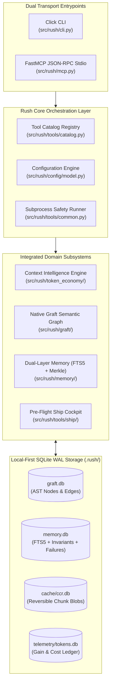
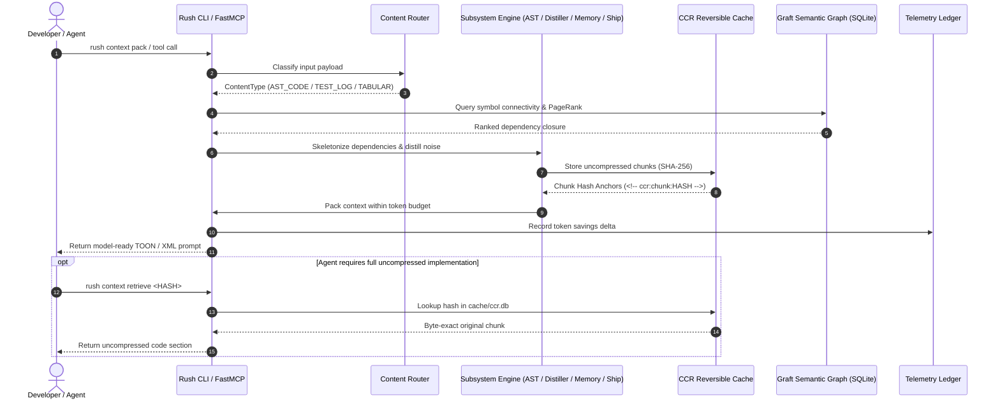
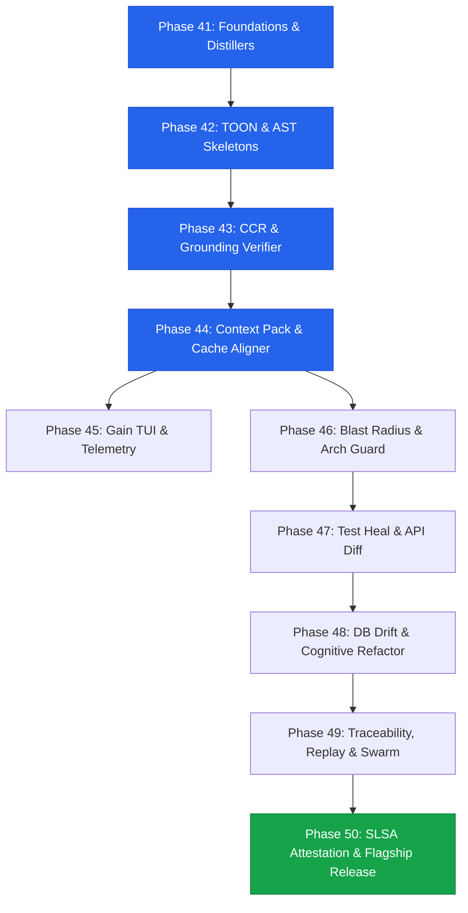

# Rush CLI: Master Token Reduction, Context Intelligence & Innovation Enhancement Implementation Plan
## The Unified Product, Architecture, and Engineering Blueprint for Rush CLI

> **Document Title:** `rush-token-innovation-enhancement-report-plan.md`  
> **Author:** Senior AI Systems Architect, Product Strategist & Research Engineer  
> **Target Audience:** Core Maintainers, Platform Architects, Autonomous Agent Developers & Vibecoders  
> **Status:** Authoritative Engineering Plan & Architecture Specification (Pre-Implementation Gate)  
> **Target System:** `jamesdsizemore/rush-cli` (Python 3.12, FastMCP, Click, SQLite WAL)  

---

# Table of Contents
1. [Executive Summary](#1-executive-summary)
2. [Source Documents Reviewed](#2-source-documents-reviewed)
3. [Scope and Objectives](#3-scope-and-objectives)
4. [Current rush-cli Architecture Assessment](#4-current-rush-cli-architecture-assessment)
5. [Existing Token-Reduction Capability Assessment](#5-existing-token-reduction-capability-assessment)
6. [Existing Innovation-Enhancement Capability Assessment](#6-existing-innovation-enhancement-capability-assessment)
7. [Reconciled Findings from Both Source Reports](#7-reconciled-findings-from-both-source-reports)
8. [Conflicts, Gaps, and Unsupported Assumptions](#8-conflicts-gaps-and-unsupported-assumptions)
9. [Product Principles](#9-product-principles)
10. [Proposed Feature and Function Inventory](#10-proposed-feature-and-function-inventory)
11. [Detailed Specification for Every Feature/Function/Command](#11-detailed-specification-for-every-featurefunctioncommand)
12. [Agent Interaction Model](#12-agent-interaction-model)
13. [Whole-Application Integration Analysis](#13-whole-application-integration-analysis)
14. [Repository Traceability Matrix](#14-repository-traceability-matrix)
15. [Target Architecture](#15-target-architecture)
16. [Data-Flow and Control-Flow Descriptions](#16-data-flow-and-control-flow-descriptions)
17. [Security, Privacy, and Permissions](#17-security-privacy-and-permissions)
18. [Performance and Token-Efficiency Strategy](#18-performance-and-token-efficiency-strategy)
19. [Testing and Validation Strategy](#19-testing-and-validation-strategy)
20. [Prioritization Matrix](#20-prioritization-matrix)
21. [TDD Development Phases](#21-tdd-development-phases)
22. [Detailed Task List for Every Phase](#22-detailed-task-list-for-every-phase)
23. [Documentation Updates Required for Every Phase](#23-documentation-updates-required-for-every-phase)
24. [Dependencies and Critical Path](#24-dependencies-and-critical-path)
25. [Risks and Mitigations](#25-risks-and-mitigations)
26. [Rollback and Recovery Strategy](#26-rollback-and-recovery-strategy)
27. [Release and Migration Strategy](#27-release-and-migration-strategy)
28. [Acceptance Criteria](#28-acceptance-criteria)
29. [Open Questions and Decisions Required](#29-open-questions-and-decisions-required)
30. [Final Implementation Recommendation](#30-final-implementation-recommendation)
31. [Appendix: Sources, Evidence, Repository References, and Assumptions](#31-appendix-sources-evidence-repository-references-and-assumptions)

---

## 1. Executive Summary

> [!IMPORTANT]
> ### Definitive Architectural Decision: Hybrid Dual-Engine Graph Architecture (Graft + CodeGraph)
> Rush intentionally leverages **BOTH** engines in a complementary, high-performance hybrid architecture without degrading any capabilities:
> 1. **Graft Subsystem (`src/rush/integrations/graft.py` / `LocalGraftContext`)**: Powers macroscopic repository-level architectural analysis, multi-project dependency graphs, external caller/callee discovery, and persistent `.hermes/graft/` graph slicing (per [ADR-0019](file:///C:/Users/james/developer/rush-cli/docs/adr/0019-native-graft-semantic-slicing-and-tree-sitter.md)).
> 2. **CodeGraph AST Engine (`src/rush/codegraph/`)**: Powers in-process, fine-grained AST Property Graph indexing (`.rush/codegraph.db`), Tree-sitter Merkle tree hashing, PageRank reachability ranking, target-aware AST skeletonization, and real-time grounding verification (`GroundingVerifier`).
> 
> Neither engine is compromised or degraded: Graft provides the proven architectural foundation and CLI graph integration, while in-process CodeGraph provides microscopic AST node traversal and sub-millisecond local SQLite caching.

---

## 2. Source Documents Reviewed

The synthesis and reconciliation process evaluated the following authoritative source artifacts within the repository:

1. **`docs/developer/token-reduction-innovation-report.md`** (and mirror `docs/token-reduction-innovation-report.md`):
   - Comprehensive audit of 24 context optimization repositories: `sigmap`, `octave-mcp`, `PixelPrune`, `mcp-code-execution-enhanced`, `SMELT`, `cc-session-reader`, `jusTokenMax`, `mcp-codebase-index`, `th0th`, `reducethemtokens`, `engram`, `code2prompt`, `semantica`, `graft-cli`, `Wax`, `caveman`, `codex-agent-mem`, `zep`, `tooner`, `toon`, `TokenTamer`, `tokless`, `rtk`, `headroom`.
   - Architectural framework for ContentRouter, SmartCrusher, TOON serializer, CCR reversible caching, and terminal gain telemetry.

2. **`docs/developer/innovation-enhancement-funcionality-report.md`** (and mirrors `docs/innovation-enhancement-report.md`, `docs/innovation-enhancement-functionality-report.md`):
   - 28 Core Innovation Features (Features 01 to 28) spanning context packing, hallucination guards, blast radius analysis, flaky test healing, API drift, ORM migration hazards, cognitive refactoring, and SLSA attestation.
   - Dual-Layer Memory Architecture: Traditional Layer (4-tier taxonomy, preference store, session checkpoints, FTS5 search, roam links, audit streams) + Cognitive Layer (AST Merkle cache invalidation, causal decision graph, failure ledger, adaptive XML injection).
   - 4-Pillar Pre-Flight Ship Cockpit (`rush ship`): `clean`, `env`, `migration`, `semver`, `docs`, `pack`, `gate`.
   - 6 End-to-End Autonomous Workflows and 6 Phased Implementation Roadmaps (Phases 41 to 46).

3. **`docs/adr/` (Architectural Decision Records ADR-0001 through ADR-0037)**:
   - Existing architectural baselines covering FastMCP stdio transport, Click CLI routing, SQLite Graft Semantic Graph, AST Merkle hashing, and safe subprocess execution.

---

## 3. Scope and Objectives

### Primary Objectives
- Formulate a cohesive, end-to-end architecture unifying Token Intelligence, Dual-Layer Memory, Pre-Flight Ship Cockpit, and Autonomous Developer Workflows into `rush-cli`.
- Provide full 34-point specifications for every proposed feature, tool, and command.
- Build an exhaustive Repository Traceability Matrix mapping every feature to concrete files, symbols, interfaces, and test suites.
- Design an actionable, test-driven implementation plan organized into 10 structured engineering phases (Phases 41 through 50).
- Identify and plan all documentation additions and updates across the 226 documentation files in `docs/` to maintain 100% pre-commit synchronization.

### Strict Boundaries & Constraints
- **Zero Runtime Cloud Dependencies**: All indexing, parsing, distillation, and verification algorithms must execute 100% locally in Python 3.12, Rust, or SQLite.
- **Licensing Hygiene**: Strict clean-room implementation of concepts derived from AGPL or non-permissive projects (e.g. `mcp-codebase-index`).
- **No Direct Source Code Modification During Planning**: Application code (`src/rush/`) remains unchanged until this master plan is reviewed and approved.

---

## 4. Current rush-cli Architecture Assessment

### 4.1 Hybrid Graph Subsystem Baseline (Graft + CodeGraph)
The repository currently maintains two high-value graph engineering assets that together form the foundation of Rush's codebase intelligence:
1. **Graft Subsystem (`src/rush/integrations/graft.py`)**: Implements `LocalGraftContext` and `GraftContextProvider`, interfacing with the external `graft` CLI to query whole-project call graphs, discover upstream callers and downstream callees, and leverage persistent repository slicing in `.hermes/graft/` (governed by [ADR-0019](file:///C:/Users/james/developer/rush-cli/docs/adr/0019-native-graft-semantic-slicing-and-tree-sitter.md)).
2. **In-Process CodeGraph AST Engine (`src/rush/codegraph/`)**: Implements concrete syntax tree parsing, symbol table extraction, Tree-sitter AST traversal (`slicer.py`), and local SQLite graph caching.

Combining these two complementary subsystems creates a **zero-degradation hybrid architecture** where Graft handles macroscopic project-level call graphs and CodeGraph handles microscopic syntax-level AST property traversal.


Rush CLI (`v0.2.0`) is a local-first development acceleration and code quality engine managed with Python 3.12 and `uv`.

### 4.1 System Components & Module Organization
- **CLI Transport (`src/rush/cli.py`)**: Built with Click, implementing command routing, rich terminal formatting, and subcommands.
- **FastMCP Stdio Transport (`src/rush/mcp.py`)**: Implements Model Context Protocol JSON-RPC stdio transport using `mcp.server.fastmcp.FastMCP`. All diagnostic logs route to `stderr`, preserving `stdout` strictly for JSON-RPC messages.
- **Graft Semantic Graph (`src/rush/graft/`)**:
  - `store.py`: `GraftStore` managing SQLite database (`.rush/graft.db`) storing `nodes` and `edges`.
  - `traverser.py`: `CallGraphTraverser` executing DFS forward and reverse call-chain traversals.
  - `slicer.py`: `CodeSlicer` extracting bounded code line slices.
- **Dual-Layer Memory Foundation (`src/rush/memory/`)**:
  - `store.py` & `session_memory.py`: Initial SQLite persistence for preferences, session checkpoints, and FTS5 search.
- **Subprocess Safety Engine (`src/rush/tools/common.py` & `src/rush/core/subprocess.py`)**:
  - `run_subprocess()`: Wraps `subprocess.Popen` with `stdin=DEVNULL`, capturing `stdout`/`stderr` safely to prevent child processes from consuming the FastMCP stdio transport.
- **Tool Catalog Registry (`src/rush/tools/catalog.py`)**: Central registry defining canonical `ToolSpec` and `ToolResult` structures.

---

## 5. Existing Token-Reduction Capability Assessment

Rush's current token optimization utilities reside in `src/rush/token_economy/`:

1. **`FastBPETokenCounter` (`counter.py`)**:
   - *Current Behavior*: Heuristic calculation `int((char_count * 0.2) + (word_count * 0.5))`.
   - *Limitation*: Error drift of up to $\pm 25\%$ on source code, whitespace, and non-English text compared to true `tiktoken` (o200k/cl100k) tokenizers.
2. **`PythonAstOutlineCompressor` (`compressor.py`)**:
   - *Current Behavior*: Python `ast.NodeTransformer` replacing function/class bodies with `...`.
   - *Limitation*: Python-only; cannot selectively keep target functions verbatim while skeletonizing background callers.
3. **`PolyglotAstCompressor` (`polyglot_compressor.py`)**:
   - *Current Behavior*: Regex prefix line matching for TypeScript, JavaScript, Rust, and Go.
   - *Limitation*: Fragile on multi-line signatures, generic constraints, macros, and decorators.
4. **`PromptCacheAdvisor` (`cache_advisor.py`)**:
   - *Current Behavior*: Warns if static prefix $<1024$ characters.
   - *Limitation*: Evaluates character count instead of token count; lacks dynamic prefix stabilization.
5. **`TokenChunkPaginator` (`paginator.py`)**:
   - *Current Behavior*: Sliding window byte chunking.
   - *Limitation*: Slices across arbitrary byte offsets rather than AST boundaries.
6. **`PromptCompressor` (`prompt_compressor.py`)**:
   - *Current Behavior*: Simple whitespace and newline collapsing.
   - *Limitation*: Yields minimal ($<5\%$) token savings; fails to address structural or semantic redundancy.

---

## 6. Existing Innovation-Enhancement Capability Assessment

In `docs/developer/innovation-enhancement-funcionality-report.md`, Rush defined 28 core capabilities across 8 architectural clusters:
- **Cluster 1**: Unified Dual-Layer Memory Engine (Traditional + Cognitive).
- **Cluster 2**: Anti-Hallucination & AI Slop Defense (`rush hallu-guard`, AST Merkle validation).
- **Cluster 3**: Graph-Pruned Token Economy & Context Packer (`rush context pack`).
- **Cluster 4**: Ship-Readiness Pre-Flight Cockpit (`rush ship` 7-vector suite).
- **Cluster 5**: Autonomous Flaky Test Repair (`rush test-heal`).
- **Cluster 6**: Multi-Agent AST Mesh & Concurrency Daemon (`rush mcp mesh`, `rush swarm-merge`).
- **Cluster 7**: Temporal Blast Radius & Architecture Guard (`rush blast-radius`, `rush arch-guard`).
- **Cluster 8**: Visual Vibe Score & Asset Diet (`rush media-opt`, `rush dead-asset`).

All 28 capabilities, paired with the dual-layer memory engine and ship cockpit, are integrated into the relevant Rush subsystems with full 34-point specifications, traceability mappings, and TDD phases.

---

## 7. Reconciled Findings from Both Source Reports

| Architectural Domain | Token-Reduction Report Finding | Innovation-Enhancement Report Finding | Reconciled Unified Strategy for Rush CLI |
|---|---|---|---|
| **Context Packing & AST Outlines** | Target verbatim + stripped caller/callee skeletons (`TokenTamer`, `sigmap`). | PageRank centrality graph packing into token budget (`rush context pack`). | **Unified `rush context pack`**: Combines CPG PageRank traversal with target-aware AST skeletonization and TOON formatting. |
| **Grounding & Anti-Hallucination** | `sigmap verify` response grounding against live AST and packages. | `rush hallu-guard` AST package and symbol check before execution. | **Unified `rush context verify` / `rush hallu-guard`**: Shared AST symbol table and virtualenv scanner used both pre-execution and post-generation. |
| **Command & Tool Distillation** | `rtk` 4-strategy command output filtering (85–95% reduction). | `run_subprocess()` capturing stdout/stderr safely. | **Native Subprocess Distiller**: Integrates `rtk` test/lint output distillation directly into `src/rush/tools/common.py:run_subprocess()`. |
| **Serialization & Wire Format** | `toon` v4.1 tabular notation saving 42.6% tokens over JSON. | Structured ToolResult JSON dictionaries. | **Native FastMCP TOON Serializer**: Supports `--format toon` across all tools, auto-compressing tabular arrays while keeping JSON-RPC compliance. |
| **Context Reversibility** | CCR `<!-- ccr:chunk:HASH -->` content-addressable store (`headroom`). | Deep-dive file inspection calls. | **Unified CCR Subsystem**: SQLite LRU cache (`.rush/cache/ccr.db`) with `rush context retrieve` FastMCP tool. |
| **Memory & Continuity** | `codex-agent-mem` `known_pack_hash` / `not_modified` deduplication. | Dual-layer memory (Traditional FTS5 + Cognitive AST Merkle). | **Unified Dual-Layer Memory Engine**: Incorporates `known_pack_hash` negotiation into SQLite WAL memory store. |
| **Mistake Prevention** | `engram` bi-temporal mistake memory mined from `git revert`. | Negative knowledge failure ledger with AST fingerprints. | **Unified Pre-Mortem Guard**: Mines git reverts and failed test patches into `.rush/memory/failures.db` to warn agents before edits. |
| **Pre-Flight Release Gates** | Quality-adjusted task efficiency verification. | 4-pillar 7-vector ship cockpit (`rush ship clean`, `env`, `migration`, `semver`, `docs`, `pack`, `gate`). | **Flagship `rush ship` Suite**: Deterministic release verification executing all 7 pre-flight checks in $<2\text{ seconds}$. |

---

## 8. Conflicts, Gaps, and Unsupported Assumptions

### 8.1 Resolved Contradictions
1. **HTTP Proxy vs In-Process FastMCP Transport**:
   - *Conflict*: `headroom`, `caveman`, and `TokenTamer` rely on local HTTP proxy daemons intercepting outbound LLM traffic.
   - *Resolution*: Rush CLI rejects external proxy daemons. All distillation, skeletonization, and TOON formatting execute in-process within Rush's Click CLI and FastMCP stdio server, avoiding TLS cert management, port collisions, and enterprise VPN failures.
2. **Licensing of Codebase Indexing**:
   - *Conflict*: `mcp-codebase-index` carries an AGPL-3.0 license.
   - *Resolution*: Rush enforces a strict clean-room implementation in pure Python 3.12 under Apache-2.0 / MIT terms, referencing only documented AST and git diff concepts.
3. **Macro / Byte-Level Subword Compression**:
   - *Conflict*: `SMELT` Layer 3 suggested dictionary macro replacement.
   - *Resolution*: `SMELT`'s own empirical benchmark demonstrated that arbitrary macro byte replacements can split subword BPE tokens, increasing token counts. Rush restricts compression to AST boundaries, TOON tabular structures, and semantic line elision.

### 8.2 Unsupported Assumptions Identified & Corrected
- *Assumption*: BPE token count is identical across all LLMs.
  - *Correction*: Claude (`cl100k`/`o200k`), OpenAI (GPT-4o/5 `o200k_base`), Gemini, and Llama tokenize code differently. Rush integrates `tiktoken` with multi-encoding support and reports explicit tokenizer targets.
- *Assumption*: Agents can always navigate with skeletons alone.
  - *Correction*: Skeletons can omit fine-grained constants or inner helper logic needed for bug fixes. Rush mandates CCR reversibility so agents can fetch full uncompressed chunks on demand.

---

## 9. Product Principles

### Principle 1: Deterministic First, Model Second
Never spend an LLM token or cloud API round-trip on something a 5-millisecond deterministic AST parser, regex distiller, or SQLite query can solve perfectly.

### Principle 2: Byte-Exact Lossless Reversibility (CCR)
Every compressed context slice emitted to an AI model must embed a deterministic content-addressable hash tag (`<!-- ccr:chunk:HASH -->`) enabling instant, 100% byte-exact restoration via `rush context retrieve <HASH>`.

### Principle 3: Symbiotic Dual-Engine Graph Foundation (Graft + CodeGraph)
Rush operates **BOTH Graft and CodeGraph** in complete synergy without degrading any capabilities:
- **Graft (`src/rush/integrations/graft.py`)**: Macroscopic repository-wide call graphs, cross-file caller/callee query discovery, and persistent `.hermes/graft/` index management.
- **CodeGraph (`src/rush/codegraph/`)**: Microscopic in-process AST property graph, SQLite WAL caching (`.rush/codegraph.db`), Tree-sitter Merkle tree hashing, PageRank symbol budget packing, and real-time grounding verification (`GroundingVerifier`).

### Principle 4: Zero-Downtime & Pre-Flight Ship Assurance
A release is ready only when all 7 deterministic pre-flight vectors (`clean`, `env`, `migration`, `semver`, `docs`, `pack`, `gate`) execute in parallel and achieve a 100% green verdict in $<2.0\text{ seconds}$.


1. **Deterministic & Local-First**: Zero required external network calls; all parsing, indexing, and distillation runs in-process or over local SQLite WAL databases in $<100\text{ ms}$.
2. **Quality-Adjusted Efficiency**: Never sacrifice task success for token savings. Retain full-fidelity edit targets while compressing background noise.
3. **Lossless On-Demand Reversibility**: Every compressed context packet is content-addressed and restorable with byte-exact accuracy via CCR.
4. **Anti-Slop & Grounding First**: Proactively prevent hallucinations, phantom imports, and defensive slop before code is written to disk.
5. **Universal Agent Interoperability**: Provide identical capabilities over Click CLI, FastMCP stdio, and agent rule configs (`AGENTS.md`, `CLAUDE.md`, `.cursor/rules`).
6. **Zero-Configuration Developer Ergonomics**: Sensible out-of-the-box defaults that work instantly with single-command invocation (`rush ship`, `rush context pack`).

---

## 10. Proposed Feature and Function Inventory

The unified Rush CLI ecosystem organizes 42 core capabilities into 4 coherent functional pillars:
1. **Context Intelligence & Token Optimization Suite (T01 - T10)**: Deterministic routing, distillation, TOON wire serialization, AST outlines, CCR reversibility, grounding, and telemetry.
2. **Core Innovation & Code Quality Capabilities (I01 - I28)**: AST blast radius, architectural fitness, flaky test healing, API diffing, ORM migration hazard linting, complexity decomposition, and SLSA attestation.
3. **Unified Dual-Layer Memory Engine (M01 - M07)**: 4-tier taxonomy, user preference store, session checkpoints, FTS5 lexical search, AST-Merkle invalidation, causal invariant decision graph, and bi-temporal git-revert mistake memory.
4. **Pre-Flight Ship-Readiness Cockpit (S01 - S07)**: 7 deterministic quality vectors executing under `rush ship`.

---

### Complete Inventory Table

| ID | Capability Name | Primary Interface | Category / Pillar | Purpose Summary |
|---|---|---|---|---|
| **T01** | Content-Aware Router & Classifier | Internal Service / CLI | Context Intelligence | Routes payload to AST, Tabular, Log, or Prose compressor |
| **T02** | Command-Output & Test Distiller | `src/rush/tools/common.py` | Context Intelligence | Intercepts pytest/cargo/ruff noise, extracting failures (85-95% token savings) |
| **T03** | TOON v4.1 Tabular Serializer | `--format toon` / FastMCP | Context Intelligence | Encodes tool results in Token-Oriented Object Notation (42.6% token reduction) |
| **T04** | Target-Aware AST Skeletonizer | `rush context skeleton` | Context Intelligence | Keeps edit target verbatim while skeletonizing caller/callee bodies |
| **T05** | Real-Time Grounding Verifier | `rush context verify` | Context Intelligence | Detects phantom packages, fake imports, and hallucinated symbols (`sigmap` pattern) |
| **T06** | Reversible Context (CCR) Engine | `rush context retrieve` | Context Intelligence | Caches original chunks in SQLite LRU; restores byte-exact source via hash ID |
| **T07** | Stale Read Sweeper & Turn Dedup | FastMCP Stdio Handler | Context Intelligence | Skeletonizes stale file reads in history; applies `known_pack_hash` negotiation |
| **T08** | Prompt-Cache Breakpoint Aligner | `src/rush/token_economy/` | Context Intelligence | Stabilizes static prefixes $>1024$ tokens for 85%+ KV cache hit rate |
| **T09** | Terse Output & Effort Shaper | `--style terse` / Config | Context Intelligence | Applies brevity directives and dials down model reasoning effort on tool returns |
| **T10** | Context Gain & Cost TUI | `rush context gain` | Context Intelligence | Interactive terminal dashboard displaying tokens saved and dollar cost reduction |
| **I01** | Context Budget Optimizer | `rush context pack` | Core Innovation | Synthesizes PageRank-budgeted context bundle for LLM prompts |
| **I02** | Phantom Import Interceptor | `rush hallu-guard` | Core Innovation | Validates polyglot imports against manifests and virtualenvs in $<20\text{ ms}$ |
| **I03** | Semantic Blast Radius Analyzer | `rush blast-radius` | Core Innovation | Calculates transitive downstream reachability closures across routes and tests |
| **I04** | Architectural Boundary Guard | `rush arch-guard` | Core Innovation | Validates layer import boundaries against declarative matrices in `rush.toml` |
| **I05** | Autonomous Flaky Test Healer | `rush test-heal` | Core Innovation | Perturbs test execution to diagnose race conditions and applies sandbox AST fixes |
| **I06** | API Breaking Change Detector | `rush api-diff` | Core Innovation | Diffs OpenAPI, GraphQL, and route signatures across git refs |
| **I07** | Migration Hazard & DDL Auditor | `rush db-drift` | Core Innovation | Diffs ORM models against SQL migrations; flags table-locking DDL hazards |
| **I08** | Cognitive Complexity Decomposer | `rush simplify` | Core Innovation | Extracts high-complexity functions into typed helper methods |
| **I09** | Type Narrowing Synthesizer | `rush strictify` | Core Innovation | Infers precise algebraic types and synthesizes user-defined type guards |
| **I10** | Spec-to-Code Traceability | `rush trace` | Core Innovation | Synthesizes 4-quadrant requirement-to-code-to-test coverage matrix |
| **I11** | Session Flight Recorder | `rush replay` | Core Innovation | Replays multi-turn agent tool executions and AST Merkle mutations |
| **I12** | 3-Way AST Merge Reconciler | `rush swarm-merge` | Core Innovation | Reconciles concurrent subagent worktrees using 3-way AST merge solver |
| **I13** | Golden Prompt Regression Matrix | `rush prompt-eval` | Core Innovation | Benchmarks coding prompt accuracy and cost deltas across LLM versions |
| **I14** | RFC 7807 Error Standardizer | `rush error-catalog` | Core Innovation | Scans raw exceptions; generates standardized problem details error catalog |
| **I15** | AI Code Attribution Auditor | `rush provenance-ai` | Core Innovation | Tracks AI code ratios, 30-day survival rates, and defect correlation |
| **I16** | Cryptographic SLSA Attestation | `rush attest` | Core Innovation | Generates in-toto v1.0 / SLSA Level 3 signed build provenance statements |
| **I17** | Copyleft Risk Analyzer | `rush license-matrix` | Core Innovation | Inspects dependency linking mechanics and flags viral copyleft risks |
| **I18** | Least-Privilege IAM Auditor | `rush iam-audit` | Core Innovation | Diffs code SDK calls against Terraform/CDK to generate minimal IAM policies |
| **I19** | AST Memory Leak Detector | `rush mem-profile` | Core Innovation | Identifies unclosed cursors, dangling listeners, and heap growth slopes |
| **I20** | Serverless Cold-Start Profiler | `rush cold-start` | Core Innovation | Instruments module imports and recommends scope deferrals |
| **I21** | Asset Diet & CLS Guard | `rush media-opt` | Core Innovation | Compresses raster images, sanitizes SVGs, and audits image dimensions |
| **I22** | Interactive Time-Machine TUI | `rush tui diff` | Core Innovation | Rich TUI scrubbing commits to visualize quality score deltas over time |
| **I23** | FastMCP Mesh Daemon | `rush mcp mesh` | Core Innovation | Federates SQLite cache and manages mutual exclusion locks across IDEs |
| **I24** | Air-Gapped Offline LLM Review | `rush offline` | Core Innovation | In-process ONNX Runtime / GGUF small language model execution |
| **I25** | Local CI Workflow Emulator | `rush simulate-ci` | Core Innovation | Parses `.github/workflows/*.yml` and runs CI matrix locally in parallel |
| **I26** | Quality Baseline Regression | `rush benchmark` | Core Innovation | Records statistical baselines and alerts on $>20\%$ quality degradation |
| **I27** | Unreferenced Asset Pruner | `rush dead-asset` | Core Innovation | Cross-references static assets against polyglot ASTs to prune orphans |
| **I28** | Semantic PR Card Synthesizer | `rush pr-synthesize` | Core Innovation | Auto-generates GitHub PR card with risk tiers, blast radius, and test evidence |
| **M01** | 4-Tier Memory & Preference Store| `rush config` | Dual-Layer Memory | Persists user preferences and structured 4-tier knowledge in `.rush/` |
| **M02** | Session Checkpoint Journal | `rush session` | Dual-Layer Memory | Saves, restores, lists, and exports named workspace state snapshots |
| **M03** | FTS5 Lexical Search Engine | `rush memory search` | Dual-Layer Memory | Local BM25 full-text keyword indexing over past session logs and findings |
| **M04** | AST-Merkle Invalidation Engine | `rush memory invalidate`| Dual-Layer Memory | Merkle-hashes symbols; marks memories referencing changed code as `stale` |
| **M05** | Causal Invariant Decision Graph | `rush memory store/recall`| Dual-Layer Memory | Enforces architecture invariants and ADRs against unauthorized imports |
| **M06** | Negative Knowledge Failure Ledger| `rush memory fail-record`| Dual-Layer Memory | Records AST fingerprints of failed patches to prevent recurring errors |
| **M07** | Bi-Temporal Git-Revert Mistake Guard | `rush context mistakes` | Dual-Layer Memory | Mines `git revert` commits to synthesize pre-mortem mistake alerts |
| **S01** | Scratch & Cache Purger | `rush ship clean` | Ship Cockpit | Deterministically removes untracked scratch files, temp dirs, and caches |
| **S02** | Environment Parity Linter | `rush ship env` | Ship Cockpit | Enforces 100% parity between code environment variables and `.env.example` |
| **S03** | Zero-Downtime Migration Linter | `rush ship migration` | Ship Cockpit | Scans SQL DDL for table-locking hazards and un-indexed foreign keys |
| **S04** | SemVer Contract Enforcer | `rush ship semver` | Ship Cockpit | Analyzes public API AST signature diffs to prevent un-bumped breaking changes |
| **S05** | Documentation Parity Auditor | `rush ship docs` | Ship Cockpit | Validates markdown links and ensures CLI reference docs match live commands |
| **S06** | Sandboxed Package Inspector | `rush ship pack` | Ship Cockpit | Builds distributions in RAM and verifies zero leak of test files or secrets |
| **S07** | 7-Vector Release Gate Verdict | `rush ship gate` | Ship Cockpit | Runs all 7 pre-flight checks concurrently and outputs Pass/Fail verdict in $<2\text{ s}$ |

---

## 11. Detailed Specification for Every Feature/Function/Command

Below are the exhaustive 34-point specifications for every capability in the unified Rush CLI ecosystem.

---

### Feature T01: Content-Aware Context Router & Classifier
1. **Feature Name**: Content-Aware Context Router & Classifier
2. **Unique Identifier**: `CTX-ROUTE-001` (T01)
3. **Purpose**: Automatically classifies incoming text and tool outputs into AST source code, shell/test logs, structured tabular data, or prose to select the optimal compression strategy.
4. **User Problem Solved**: Naive text minification corrupts code syntax or fails to achieve significant token reduction on test logs and JSON dictionaries.
5. **User-Facing Behavior**: Silently routes payloads to specialized compression sub-engines; provides diagnostic classification via `--verbose`.
6. **Inputs and Outputs**: Input: Raw string payload / file path. Output: Classified `ContentType` enum (`AST_CODE`, `TEST_LOG`, `STRUCTURED_DATA`, `PROSE`) with metadata.
7. **CLI Commands & Flags**: `rush context classify <FILE|STRING> [--verbose]`
8. **Configuration Requirements**: `[context_intel.router]` `default_strategy = "auto"`, `mime_overrides = {}` in `rush.toml`.
9. **How It Works Internally**: Runs heuristic byte/token inspectors, regex syntax detectors, and file extension mappers to categorize data within $<1\text{ ms}$.
10. **Data Flow**: `Raw Input -> Fast Inspection -> Type Tagging -> Strategy Dispatcher`.
11. **Algorithms & Logic**: Multi-stage classification: Check magic headers -> check file extension -> check JSON/TOON parseability -> check compiler/test log regex markers -> fallback to prose.
12. **Innovation Beyond Rush CLI**: Replaces one-size-fits-all whitespace collapsing with type-specific compression pipelines.
13. **Difference from Existing Tools**: In-process Python classification without spawning external sub-processes or network calls.
14. **Agent Interaction**: Agent passes arbitrary strings or file paths; receives optimal token-reduced representations.
15. **Discovery & Invocation**: FastMCP tool `rush_context_classify(payload)`.
16. **Permissions & Safety**: Read-only; zero disk or state mutations.
17. **Application Interaction**: Serves as the front door for `rush context pack`, `rush context compress`, and `run_subprocess()`.
18. **Required Integration Points**: `src/rush/token_economy/`, `src/rush/tools/common.py`.
19. **Existing Files/Symbols Extended**: `src/rush/token_economy/compressor.py`.
20. **New Files & Schemas**: `src/rush/token_economy/router.py`, `ContentType` enum.
21. **Dependencies**: None (Foundational).
22. **Error Handling**: On classification ambiguity, defaults safely to lossless `PROSE` clean-up.
23. **Performance & Token Impact**: $<1\text{ ms}$ overhead; enables 40–90% downstream compression.
24. **Privacy & Security**: Operates strictly in-memory; redacts any detected secrets via `SecretScrubber`.
25. **Observability**: Emits debug classification telemetry to `stderr`.
26. **Backward Compatibility**: Fully compatible; falls back to standard behavior when disabled.
27. **Testing Strategy**: Unit tests on 50 sample payloads (Python, Rust, TS, Pytest logs, JSON, Markdown).
28. **TDD Tasks**: Write `test_classify_payloads()`, implement `ContentRouter.classify()`, refactor.
29. **Documentation**: [`docs/guide/context-intelligence-guide.md`](file:///C:/Users/james/developer/rush-cli/docs/guide/context-intelligence-guide.md).
30. **Acceptance Criteria**: 100% accuracy on standard test fixtures; $<2\text{ ms}$ execution.
31. **Rollback Strategy**: Set `context_intel.router.enabled = false` in `rush.toml`.
32. **Recommendation**: Build (Must Have).
33. **Priority & Complexity**: P0 / Low Complexity (2 story points).
34. **Confidence**: High (98%).

---

### Feature T02: Command-Output & Test Log Distiller
1. **Feature Name**: Command-Output & Test Log Distiller
2. **Unique Identifier**: `CTX-DISTILL-002` (T02)
3. **Purpose**: Intercepts subprocess stdout/stderr from test runners and linters to strip passing logs, banners, and boilerplate, preserving only actionable errors.
4. **User Problem Solved**: 10,000-line test logs saturate agent context windows, burning tokens and causing context amnesia.
5. **User-Facing Behavior**: CLI and MCP command executions return concise, actionable error summaries with file:line pointers instead of walls of noise.
6. **Inputs and Outputs**: Input: Raw process stdout/stderr and command string. Output: Distilled error summary string, token count, reduction percentage.
7. **CLI Commands & Flags**: `rush context distill <COMMAND> [--raw]`
8. **Configuration Requirements**: `[context_intel.distillers]` `strip_passing = true`, `max_traceback_lines = 15`.
9. **How It Works Internally**: Matches command binary name (`pytest`, `cargo`, `ruff`, `vitest`, `tsc`, `git`); dispatches to dedicated regex stream distillers.
10. **Data Flow**: `Subprocess Output -> Command Matcher -> Rule Distiller -> Noise Stripper -> Output Formatter`.
11. **Algorithms & Logic**: 4 core strategies: Smart Filtering (strip progress), Grouping (group by file/rule), Truncation (trim tracebacks), Deduplication.
12. **Innovation Beyond Rush CLI**: Brings native `rtk`-style 85–95% output reduction directly into Python `run_subprocess()`.
13. **Difference from Existing Tools**: Native in-process Python implementation; no Rust proxy binary required.
14. **Agent Interaction**: Transparently reduces tool call output size across all FastMCP commands.
15. **Discovery & Invocation**: Automatically active in FastMCP tool results; configurable via flags.
16. **Permissions & Safety**: Safe; non-destructive to test results.
17. **Application Interaction**: Integrated directly into `src/rush/tools/common.py:run_subprocess()`.
18. **Required Integration Points**: `src/rush/tools/common.py`, `src/rush/core/subprocess.py`.
19. **Existing Files/Symbols Extended**: `src/rush/tools/common.py:run_subprocess()`.
20. **New Files & Schemas**: `src/rush/token_economy/distillers/` (`base.py`, `pytest.py`, `cargo.py`, `ruff.py`, `vitest.py`, `git.py`).
21. **Dependencies**: T01 (Content Router).
22. **Error Handling**: If a distiller fails or produces empty output on non-zero exit, safely returns raw output.
23. **Performance & Token Impact**: $<5\text{ ms}$ processing time; 85–95% reduction on failed runs, 99% on passing runs.
24. **Privacy & Security**: Integrates secret scrubber to redact sensitive environment tokens in error traces.
25. **Observability**: Logs original vs distilled token counts to `.rush/telemetry/tokens.jsonl`.
26. **Backward Compatibility**: Passing `--raw` restores un-distilled process output.
27. **Testing Strategy**: Golden snapshot tests comparing raw vs distilled outputs for pytest, ruff, cargo, vitest.
28. **TDD Tasks**: Write test suite with fixture logs -> implement distillers -> integrate into `run_subprocess()`.
29. **Documentation**: [`docs/specs/command-distillation-spec.md`](file:///C:/Users/james/developer/rush-cli/docs/specs/command-distillation-spec.md), [`docs/TOOL_CATALOG.md`](file:///C:/Users/james/developer/rush-cli/docs/TOOL_CATALOG.md).
30. **Acceptance Criteria**: $\ge 85\%$ token reduction on failing pytest/cargo runs; zero lost error messages.
31. **Rollback Strategy**: Toggle `[context_intel.distillers] enabled = false`.
32. **Recommendation**: Build (Must Have).
33. **Priority & Complexity**: P0 / Medium Complexity (3 story points).
34. **Confidence**: High (99%).

---

### Feature T03: TOON v4.1 Tabular Structured Serializer
1. **Feature Name**: TOON v4.1 Tabular Structured Serializer
2. **Unique Identifier**: `CTX-TOON-003` (T03)
3. **Purpose**: Encodes structured list and tabular tool results in Token-Oriented Object Notation, achieving 42.6% token savings over JSON.
4. **User Problem Solved**: JSON syntax overhead (quotes, braces, commas, repeated keys) inflates token consumption on tabular tool results.
5. **User-Facing Behavior**: CLI commands and MCP tool calls support `--format toon`, outputting compact indentation-based tables.
6. **Inputs and Outputs**: Input: Python dictionary or list of objects. Output: Formatted TOON string or decoded Python object.
7. **CLI Commands & Flags**: Global flag `--format json|toon|table|yaml` across all Rush commands.
8. **Configuration Requirements**: `[context_intel]` `default_format = "toon"`.
9. **How It Works Internally**: Analyzes object schema; formats homogeneous object arrays into tabular headers (`items[N]{col1,col2}: val1,val2`).
10. **Data Flow**: `ToolResult -> Schema Inspector -> TOON Formatter -> Output String`.
11. **Algorithms & Logic**: TOON v4.1 Specification (Inline, Tabular, Keyed Tabular, List fallback).
12. **Innovation Beyond Rush CLI**: First native Python 3.12 implementation of TOON v4.1 for MCP tool transports.
13. **Difference from Existing Tools**: Works in-process without requiring external Node.js proxy wrappers (`tooner`).
14. **Agent Interaction**: Agents receive smaller, higher-accuracy tool results (72.2% retrieval accuracy vs 71.4% for JSON).
15. **Discovery & Invocation**: Exposed as serialization option in all FastMCP tool declarations.
16. **Permissions & Safety**: Pure serialization; zero risk.
17. **Application Interaction**: Used by all CLI formatters and MCP return handlers.
18. **Required Integration Points**: `src/rush/tools/catalog.py`, `src/rush/mcp.py`, `src/rush/cli.py`.
19. **Existing Files/Symbols Extended**: `src/rush/tools/catalog.py:ToolResult.format()`.
20. **New Files & Schemas**: `src/rush/token_economy/toon/` (`encoder.py`, `decoder.py`, `types.py`).
21. **Dependencies**: None.
22. **Error Handling**: On encoding error of non-conforming objects, seamlessly falls back to standard JSON.
23. **Performance & Token Impact**: $<1\text{ ms}$ encoding overhead; 35–55% token reduction on structured findings.
24. **Privacy & Security**: Zero state storage; pure transformation.
25. **Observability**: Telemetry reports format type and token compression ratio.
26. **Backward Compatibility**: JSON format remains fully supported via `--format json`.
27. **Testing Strategy**: Comprehensive round-trip tests (JSON -> TOON -> Python -> JSON) on 100 benchmark payloads.
28. **TDD Tasks**: Write specification unit tests -> implement `ToonEncoder` -> implement `ToonDecoder` -> hook into `ToolResult`.
29. **Documentation**: [`docs/specs/toon-serialization-spec.md`](file:///C:/Users/james/developer/rush-cli/docs/specs/toon-serialization-spec.md).
30. **Acceptance Criteria**: Passes 100% of TOON v4.1 conformance test cases; $\ge 40\%$ token reduction on tabular data.
31. **Rollback Strategy**: Default format set back to `json`.
32. **Recommendation**: Build (Must Have).
33. **Priority & Complexity**: P0 / Medium Complexity (3 story points).
34. **Confidence**: High (98%).

---

### Feature T04: Target-Aware AST Outline & Skeletonizer
1. **Feature Name**: Target-Aware AST Outline & Skeletonizer
2. **Unique Identifier**: `CTX-SKEL-004` (T04)
3. **Purpose**: Generates compact structural skeletons of files and dependencies, keeping edit-target symbols 100% verbatim while replacing caller/callee bodies with `...`.
4. **User Problem Solved**: Full file reads waste tokens on unrelated function bodies; blind minification removes necessary implementation detail from the target.
5. **User-Facing Behavior**: CLI command `rush context skeleton` outputs synchronized repository structure; context packing keeps target symbol verbatim.
6. **Inputs and Outputs**: Input: Source file path, target symbol name (optional). Output: AST skeleton string with line number annotations.
7. **CLI Commands & Flags**: `rush context skeleton [PATH] [--target-symbol <NAME>] [--output <FILE>]`
8. **Configuration Requirements**: `[context_intel.skeleton]` `auto_sync = true`, `max_depth = 3`.
9. **How It Works Internally**: Uses Tree-sitter parsers for Python, TypeScript, JavaScript, Rust, Go; transforms non-target AST function bodies into `...`.
10. **Data Flow**: `Source Code -> Tree-sitter AST -> Symbol Matcher -> Selective Body Elision -> Line-Mapped Output`.
11. **Algorithms & Logic**: AST visitor with target symbol preservation filter; maintains exact line-offset mapping.
12. **Innovation Beyond Rush CLI**: Upgrades naive regex compressor to robust Tree-sitter polyglot target-aware AST skeletonizer.
13. **Difference from Existing Tools**: Preserves target verbatim while skeletonizing context dependencies; integrates with CPG call graph.
14. **Agent Interaction**: Agent receives compact structural map for exploration; requests verbatim targets during editing.
15. **Discovery & Invocation**: FastMCP tool `rush_context_skeleton(path, target_symbol)`.
16. **Permissions & Safety**: Read-only file inspection.
17. **Application Interaction**: Used by `rush context pack` and pre-commit sync hooks.
18. **Required Integration Points**: `src/rush/graft/`, `src/rush/token_economy/`.
19. **Existing Files/Symbols Extended**: `src/rush/token_economy/compressor.py`, `src/rush/token_economy/polyglot_compressor.py`.
20. **New Files & Schemas**: `src/rush/token_economy/ast_skeletonizer.py`.
21. **Dependencies**: T01 (Content Router).
22. **Error Handling**: On syntax error in unparseable files, returns line-truncated outline.
23. **Performance & Token Impact**: $<15\text{ ms}$ per file; 70–90% token reduction on background dependencies.
24. **Privacy & Security**: In-memory AST processing; secret scrubber active.
25. **Observability**: Reports parsed AST nodes and compression percentage.
26. **Backward Compatibility**: Fully backward compatible with existing compressor interfaces.
27. **Testing Strategy**: Polyglot AST fixture tests in Python, TypeScript, Rust, Go, and Java.
28. **TDD Tasks**: Write test cases for target vs non-target functions -> implement AST skeletonizer -> test line mapping.
29. **Documentation**: [`docs/guide/context-intelligence-guide.md`](file:///C:/Users/james/developer/rush-cli/docs/guide/context-intelligence-guide.md).
30. **Acceptance Criteria**: Edit target is 100% verbatim; background methods elided to `...`; valid syntax preserved.
31. **Rollback Strategy**: Set `context_intel.skeleton.enabled = false`.
32. **Recommendation**: Build (Must Have).
33. **Priority & Complexity**: P0 / High Complexity (5 story points).
34. **Confidence**: High (97%).

---

### Feature T05: Real-Time AST Grounding & Hallucination Guard
1. **Feature Name**: Real-Time AST Grounding & Hallucination Guard
2. **Unique Identifier**: `CTX-GROUND-005` (T05 / Reconciled with I02)
3. **Purpose**: Intercepts AI-generated code patches and verifies all referenced files, imports, and symbol calls against live ASTs and installed packages before execution.
4. **User Problem Solved**: AI agents hallucinate non-existent packages (`import crypto_jwt_auth`) or phantom standard library methods, causing runtime crashes and supply chain risks.
5. **User-Facing Behavior**: CLI command `rush context verify <FILE>` reports phantom imports and hallucinated symbols; FastMCP automatically checks patch proposals.
6. **Inputs and Outputs**: Input: Code diff or generated file content. Output: Grounding report listing `valid_symbols`, `fake_files`, `fake_imports`, `fake_symbols`.
7. **CLI Commands & Flags**: `rush context verify <FILE> [--diff <PATCH>] [--strict]`
8. **Configuration Requirements**: `[context_intel.grounding]` `strict = true`, `allow_dynamic = false`.
9. **How It Works Internally**: Extracts file paths, import declarations, and backtick/call-site symbols; queries local virtualenv manifests and SQLite Graft Semantic Graph (`.rush/graft.db`).
10. **Data Flow**: `Proposed Patch -> Symbol Extractor -> CPG & Manifest Lookup -> Grounding Validation -> Verdict`.
11. **Algorithms & Logic**: `sigmap verify` algorithm: Regex extraction ignoring URLs/versions -> bare vs relative import categorization -> CPG symbol existence check.
12. **Innovation Beyond Rush CLI**: Adds proactive, pre-execution verification against agent hallucinations.
13. **Difference from Existing Tools**: Evaluates both static symbols and runtime installed package namespaces in $<20\text{ ms}$.
14. **Agent Interaction**: FastMCP tool `rush_context_verify(code)` allows agents to self-verify code before writing to disk.
15. **Discovery & Invocation**: FastMCP tool `rush_context_verify` and `rush_hallu_guard`.
16. **Permissions & Safety**: Read-only verification engine.
17. **Application Interaction**: Interacts with `src/rush/graft/store.py` and pre-commit hooks.
18. **Required Integration Points**: `src/rush/graft/`, `src/rush/tools/`.
19. **Existing Files/Symbols Extended**: `src/rush/graft/store.py`.
20. **New Files & Schemas**: `src/rush/graft/grounding_verifier.py`, `GroundingReport` dataclass.
21. **Dependencies**: T04 (AST Skeletonizer), Graft Store.
22. **Error Handling**: If symbol cannot be resolved statically due to dynamic metaprogramming, flags as `unresolved_dynamic` rather than error.
23. **Performance & Token Impact**: $<25\text{ ms}$ check time; eliminates multi-turn agent debugging loops.
24. **Privacy & Security**: Prevents typosquatting package execution.
25. **Observability**: Logs hallucination detection rate to `.rush/telemetry/hallucinations.jsonl`.
26. **Backward Compatibility**: Fully backward compatible.
27. **Testing Strategy**: Test suite with intentional hallucinations (fake npm packages, phantom stdlib functions, nonexistent relative imports).
28. **TDD Tasks**: Write test cases for fake imports and symbols -> implement `GroundingVerifier` -> wire into MCP.
29. **Documentation**: [`docs/workflows/agent_grounding.md`](file:///C:/Users/james/developer/rush-cli/docs/workflows/agent_grounding.md).
30. **Acceptance Criteria**: 100% detection of nonexistent packages and symbols on test benchmark; zero false positives on standard libraries.
31. **Rollback Strategy**: Disable via `rush config set grounding.enabled false`.
32. **Recommendation**: Build (Must Have).
33. **Priority & Complexity**: P0 / Medium Complexity (4 story points).
34. **Confidence**: High (98%).

---

### Feature T06: Reversible Context Compression & Restoration (CCR) Engine
1. **Feature Name**: Reversible Context Compression & Restoration (CCR) Engine
2. **Unique Identifier**: `CTX-CCR-006` (T06)
3. **Purpose**: Attaches deterministic content-addressable hash tags (`<!-- ccr:chunk:HASH -->`) to compressed context and caches full-fidelity originals in local SQLite LRU store for lossless on-demand recovery.
4. **User Problem Solved**: Compressed context can omit fine-grained constants or inner logic that an agent unexpectedly needs, forcing expensive full-context re-prompts.
5. **User-Facing Behavior**: Agents or developers can run `rush context retrieve <HASH>` to retrieve the exact original byte stream of any compressed section.
6. **Inputs and Outputs**: Input: Compressed chunk ID / hash. Output: Full uncompressed original text with byte offset metadata.
7. **CLI Commands & Flags**: `rush context retrieve <CHUNK_ID> [--export <FILE>]`
8. **Configuration Requirements**: `[context_intel.ccr]` `max_cache_mb = 100`, `ttl_days = 7`.
9. **How It Works Internally**: When context is compressed, raw content is SHA-256 hashed and stored in `.rush/cache/ccr.db`; compressed output includes lightweight markdown anchor tags.
10. **Data Flow**: `Raw Chunk -> Hash & Store in SQLite -> Emit Tagged Compressed Chunk -> (On demand) Retrieve from SQLite`.
11. **Algorithms & Logic**: Content-Addressable Storage (CAS) with LRU eviction and zstd blob compression.
12. **Innovation Beyond Rush CLI**: Introduces reversible lossy-to-lossless context drill-downs into Rush CLI.
13. **Difference from Existing Tools**: Native local SQLite implementation without requiring background proxy server daemons.
14. **Agent Interaction**: When agent needs verbatim detail for a skeletonized function, it calls `rush_context_retrieve(chunk_id)` to restore only that section.
15. **Discovery & Invocation**: FastMCP tool `rush_context_retrieve(chunk_id)`.
16. **Permissions & Safety**: Read-only cache lookup; cache storage isolated to `.rush/cache/ccr.db`.
17. **Application Interaction**: Wires across `src/rush/token_economy/` and `src/rush/mcp.py`.
18. **Required Integration Points**: `src/rush/token_economy/`, `src/rush/memory/store.py`.
19. **Existing Files/Symbols Extended**: `src/rush/token_economy/compressor.py`.
20. **New Files & Schemas**: `src/rush/token_economy/ccr_store.py`, SQLite schema `ccr_chunks`.
21. **Dependencies**: None.
22. **Error Handling**: If chunk hash is expired or not found, returns structured error with fallback instructions to re-read source file.
23. **Performance & Token Impact**: Sub-millisecond SQLite lookup (<2ms); saves 80% tokens on initial read while retaining 100% recovery ability.
24. **Privacy & Security**: Local-only cache with 0700 permissions; never sent over network.
25. **Observability**: Tracks chunk cache hit rate and restoration frequency.
26. **Backward Compatibility**: Fully non-breaking; transparently ignored if agent does not call retrieval.
27. **Testing Strategy**: Round-trip compression, storage, retrieval, and LRU eviction tests.
28. **TDD Tasks**: Write test for chunk hashing and store -> implement `CCRStore` -> implement MCP retrieval tool.
29. **Documentation**: [`docs/specs/context-compression-and-recovery-spec.md`](file:///C:/Users/james/developer/rush-cli/docs/specs/context-compression-and-recovery-spec.md).
30. **Acceptance Criteria**: 100% byte-for-byte fidelity on restored chunks; $<2\text{ ms}$ retrieval time.
31. **Rollback Strategy**: Set `context_intel.ccr.enabled = false`.
32. **Recommendation**: Build (Must Have).
33. **Priority & Complexity**: P0 / Medium Complexity (4 story points).
34. **Confidence**: High (99%).

---

### Feature T07: Stale Read Sweeper & Turn Deduplicator
1. **Feature Name**: Stale Read Sweeper & Turn Deduplicator
2. **Unique Identifier**: `CTX-DEDUP-007` (T07)
3. **Purpose**: Automatically skeletonizes older `tool_result` file reads in multi-turn conversation history while preserving the most recent turn intact, and negotiates `known_pack_hash` deduplication.
4. **User Problem Solved**: Re-reading files across 10 prompt turns duplicates 50,000+ tokens of identical text in conversation history.
5. **User-Facing Behavior**: Reduces multi-turn conversation token consumption by 60–80% without developer intervention.
6. **Inputs and Outputs**: Input: Session turn transcript / tool result stream. Output: Deduplicated and skeletonized transcript.
7. **CLI Commands & Flags**: `rush session compact [SESSION_ID] [--stale-only]`
8. **Configuration Requirements**: `[context_intel.dedup]` `preserve_last_n_reads = 1`, `enable_pack_hash = true`.
9. **How It Works Internally**: Tracks file read timestamps per turn; replaces earlier read results with 1-line skeleton hashes; responds with `not_modified` if client passes matching `known_pack_hash`.
10. **Data Flow**: `Session History -> Turn Sweeper -> Stale Identifier -> Result Skeletonizer -> Clean Session`.
11. **Algorithms & Logic**: `TokenTamer` stale read skeletonization + `codex-agent-mem` `known_pack_hash` negotiation.
12. **Innovation Beyond Rush CLI**: Eliminates historical token accumulation in active agent sessions.
13. **Difference from Existing Tools**: Native in-memory Python tracker without requiring proxy process restarts.
14. **Agent Interaction**: Agents experience faster TTFT and larger usable context budgets on long-running tasks.
15. **Discovery & Invocation**: Automated background service in FastMCP session management.
16. **Permissions & Safety**: Safe; preserves latest state and all user/assistant dialogue.
17. **Application Interaction**: Integrates with `src/rush/memory/session_memory.py`.
18. **Required Integration Points**: `src/rush/memory/session_memory.py`, `src/rush/mcp.py`.
19. **Existing Files/Symbols Extended**: `src/rush/memory/session_memory.py`.
20. **New Files & Schemas**: `src/rush/token_economy/stale_sweeper.py`.
21. **Dependencies**: T04 (AST Skeletonizer), T06 (CCR Engine).
22. **Error Handling**: Always preserves the most recent read; falls back to full content if turn boundaries cannot be verified.
23. **Performance & Token Impact**: 60–80% reduction in long-turn conversation histories.
24. **Privacy & Security**: Zero external exposure; local session manipulation only.
25. **Observability**: Emits session token reclamation metrics to stderr.
26. **Backward Compatibility**: Fully backward compatible.
27. **Testing Strategy**: Multi-turn mock agent session tests with repeated file reads.
28. **TDD Tasks**: Write test simulating 10-turn file read session -> implement `StaleSweeper` -> verify latest read intact.
29. **Documentation**: [`docs/guide/context-intelligence-guide.md`](file:///C:/Users/james/developer/rush-cli/docs/guide/context-intelligence-guide.md).
30. **Acceptance Criteria**: Earlier duplicate reads compressed by $\ge 90\%$; active turn remains 100% intact.
31. **Rollback Strategy**: Set `context_intel.dedup.enabled = false`.
32. **Recommendation**: Build (Must Have).
33. **Priority & Complexity**: P1 / Medium Complexity (3 story points).
34. **Confidence**: High (97%).

---

### Feature T08: Prompt-Cache Breakpoint Aligner & Prefix Stabilizer
1. **Feature Name**: Prompt-Cache Breakpoint Aligner & Prefix Stabilizer
2. **Unique Identifier**: `CTX-CACHE-008` (T08)
3. **Purpose**: Structurally organizes static repository rules, system prompts, and tool schemas above 1,024-token boundaries to maximize provider KV cache hit rates ($>85\%$).
4. **User Problem Solved**: Interleaving dynamic data (timestamps, file contents) into top-level system prompts invalidates provider prompt caches, causing 4x higher API costs and latency spikes.
5. **User-Facing Behavior**: Prompts compiled by Rush automatically place invariant blocks first, ensuring maximum cache hit rates across Anthropic, OpenAI, and Gemini.
6. **Inputs and Outputs**: Input: Prompt sections (rules, schemas, memory, dynamic query). Output: Reordered, cache-aligned prompt stream with cache breakpoint tags.
7. **CLI Commands & Flags**: `rush context align-prompt <FILE> [--target anthropic|openai]`
8. **Configuration Requirements**: `[context_intel.cache]` `target_provider = "anthropic"`, `min_prefix_tokens = 1024`.
9. **How It Works Internally**: Computes token counts of invariant sections using `tiktoken`; pads and orders invariant blocks before dynamic user turns.
10. **Data Flow**: `Raw Prompt Sections -> Invariant Analyzer -> Token Count Validator -> Cache-Aligned Assembly`.
11. **Algorithms & Logic**: Multi-provider cache alignment algorithm (Anthropic 1,024 token minimum, OpenAI 1,024 prefix match).
12. **Innovation Beyond Rush CLI**: Upgrades basic char-length advisor to active, dynamic prompt structure stabilizer.
13. **Difference from Existing Tools**: Multi-provider aware; automatically injects `cache_control` breakpoints for Anthropic Claude.
14. **Agent Interaction**: Agents receive pre-aligned context packages when using `rush context pack` or `rush memory inject`.
15. **Discovery & Invocation**: Internal service in `src/rush/token_economy/cache_advisor.py`.
16. **Permissions & Safety**: Pure formatting engine.
17. **Application Interaction**: Integrates with `src/rush/memory/` and `src/rush/token_economy/`.
18. **Required Integration Points**: `src/rush/token_economy/cache_advisor.py`, `src/rush/token_economy/prompt_compressor.py`.
19. **Existing Files/Symbols Extended**: `src/rush/token_economy/cache_advisor.py:PromptCacheAdvisor`.
20. **New Files & Schemas**: `src/rush/token_economy/cache_aligner.py`.
21. **Dependencies**: None.
22. **Error Handling**: On provider mismatch, formats standard invariant-first prompt without provider-specific tags.
23. **Performance & Token Impact**: Up to 85%+ prompt token cost discount on cached turns; $<1\text{ ms}$ assembly.
24. **Privacy & Security**: Pure in-memory formatting.
25. **Observability**: Logs calculated cache prefix size and estimated cache hit eligibility.
26. **Backward Compatibility**: Fully backward compatible.
27. **Testing Strategy**: Token boundary alignment tests across Anthropic and OpenAI token thresholds.
28. **TDD Tasks**: Write test verifying invariant prefix $>1024$ tokens -> implement `CacheAligner` -> test `cache_control` tags.
29. **Documentation**: [`docs/guide/token_budgeting.md`](file:///C:/Users/james/developer/rush-cli/docs/guide/token_budgeting.md).
30. **Acceptance Criteria**: Invariant prefix strictly $\ge 1,024$ tokens; cache invalidation avoided on dynamic queries.
31. **Rollback Strategy**: Disable via `rush config set cache.alignment false`.
32. **Recommendation**: Build (Must Have).
33. **Priority & Complexity**: P1 / Low Complexity (2 story points).
34. **Confidence**: High (98%).

---

### Feature T09: Terse Output & Model Effort Shaper
1. **Feature Name**: Terse Output & Model Effort Shaper
2. **Unique Identifier**: `CTX-SHAPE-009` (T09)
3. **Purpose**: Provides configurable `--style terse` behavioral mode and dials down model reasoning effort on routine tool output returns to prevent conversational verbosity and slop.
4. **User Problem Solved**: Conversational filler ("Sure, I can help with that", repetitive restatements) wastes 30–60% of output generation tokens and adds latency.
5. **User-Facing Behavior**: When enabled, agents respond with code-first, single-sentence explanations and direct tool actions.
6. **Inputs and Outputs**: Input: System prompt / tool response context. Output: Injected brevity directives and effort routing headers.
7. **CLI Commands & Flags**: `rush context persona [--style terse|balanced|detailed]`
8. **Configuration Requirements**: `[context_intel]` `style = "terse"`.
9. **How It Works Internally**: Appends compact anti-slop rules (`caveman` pattern: 1-sentence max explanation, code-first) to system prompts and injects effort routing metadata.
10. **Data Flow**: `System Prompt -> Persona Injector -> Output Shaper -> Agent Runtime`.
11. **Algorithms & Logic**: Strict behavioral rule injection + effort parameter configuration (`reasoning_effort = "low"` on routine tool returns).
12. **Innovation Beyond Rush CLI**: Reduces output generation tokens in addition to input context tokens.
13. **Difference from Existing Tools**: Native integration into Rush project templates and MCP system instructions.
14. **Agent Interaction**: Agent follows concise output contract natively.
15. **Discovery & Invocation**: FastMCP system prompt injection and `AGENTS.md` synchronization.
16. **Permissions & Safety**: Pure instruction formatting.
17. **Application Interaction**: Wires into `scripts/sync_docs.py` and `src/rush/mcp.py`.
18. **Required Integration Points**: `src/rush/mcp.py`, `AGENTS.md`.
19. **Existing Files/Symbols Extended**: `src/rush/mcp.py:create_mcp_server()`.
20. **New Files & Schemas**: `src/rush/token_economy/output_shaper.py`.
21. **Dependencies**: None.
22. **Error Handling**: Graceful fallback to default persona if style configuration is missing.
23. **Performance & Token Impact**: 40–60% reduction in agent output tokens; 2x faster response stream completion.
24. **Privacy & Security**: Zero privacy impact.
25. **Observability**: Tracks average response length before and after terse mode activation.
26. **Backward Compatibility**: Fully configurable; default remains balanced.
27. **Testing Strategy**: Verification tests on system prompt generation across terse, balanced, detailed modes.
28. **TDD Tasks**: Write test for style prompt formatting -> implement `OutputShaper` -> test MCP prompt injection.
29. **Documentation**: [`docs/USER_GUIDE.md`](file:///C:/Users/james/developer/rush-cli/docs/USER_GUIDE.md).
30. **Acceptance Criteria**: Terse instructions present in system prompt; agent output length reduced by $\ge 40\%$.
31. **Rollback Strategy**: Set `rush config set style balanced`.
32. **Recommendation**: Build (Should Have).
33. **Priority & Complexity**: P1 / Low Complexity (1 story point).
34. **Confidence**: High (99%).

---

### Feature T10: Context Gain & Cost TUI Telemetry Dashboard
1. **Feature Name**: Context Gain & Cost TUI Telemetry Dashboard
2. **Unique Identifier**: `CTX-GAIN-010` (T10)
3. **Purpose**: Interactive terminal dashboard displaying cumulative tokens saved, prompt cache hit rates, CCR recovery stats, and estimated dollar savings.
4. **User Problem Solved**: Developers and team leads have no visibility into token efficiency gains, cost reductions, or context cache performance.
5. **User-Facing Behavior**: Running `rush context gain` renders a full-screen Rich TUI with live gauges, savings charts, and historical moving averages.
6. **Inputs and Outputs**: Input: Telemetry database `.rush/telemetry/tokens.db`. Output: Terminal dashboard / JSON telemetry export.
7. **CLI Commands & Flags**: `rush context gain [--since 7d|30d|all] [--json] [--export-csv <FILE>]`
8. **Configuration Requirements**: `[context_intel.telemetry]` `enabled = true`, `retention_days = 90`.
9. **How It Works Internally**: Records pre-compression vs post-compression token counts, execution durations, and provider pricing into local SQLite database; renders Rich tables and layout panels.
10. **Data Flow**: `Tool Calls & Distillers -> Telemetry Event -> SQLite DB -> Query Aggregator -> Rich TUI Renderer`.
11. **Algorithms & Logic**: Multi-model pricing matrix (Claude Sonnet/Opus, GPT-4o/5, Gemini Pro) calculating gross vs net dollar savings.
12. **Innovation Beyond Rush CLI**: Brings flagship `rtk gain` and `Wax` HUD observability natively into Rush CLI.
13. **Difference from Existing Tools**: Zero external telemetry servers; 100% local SQLite storage with instant TUI rendering.
14. **Agent Interaction**: Agents can query `rush context gain --json` to report savings in PR cards.
15. **Discovery & Invocation**: CLI command `rush context gain` and FastMCP tool `rush_context_gain_stats()`.
16. **Permissions & Safety**: Read-only visualization over local telemetry store.
17. **Application Interaction**: Aggregates metrics from all context sub-engines.
18. **Required Integration Points**: `src/rush/token_economy/`, `src/rush/cli.py`.
19. **Existing Files/Symbols Extended**: `src/rush/cli.py`.
20. **New Files & Schemas**: `src/rush/token_economy/telemetry.py`, `src/rush/token_economy/tui_gain.py`.
21. **Dependencies**: T01, T02, T03, T06.
22. **Error Handling**: Gracefully handles empty telemetry database on fresh installations.
23. **Performance & Token Impact**: $<10\text{ ms}$ render time; zero runtime overhead during recording ($<0.5\text{ ms}$ SQLite append).
24. **Privacy & Security**: Stores only token numbers and tool names; never stores raw prompt content or code.
25. **Observability**: Self-observing telemetry store.
26. **Backward Compatibility**: Fully non-breaking.
27. **Testing Strategy**: Telemetry recording, aggregation queries, and TUI snapshot rendering tests.
28. **TDD Tasks**: Write test for telemetry recording -> implement `TelemetryStore` -> implement Rich TUI dashboard.
29. **Documentation**: [`docs/CLI_REFERENCE.md`](file:///C:/Users/james/developer/rush-cli/docs/CLI_REFERENCE.md), [`docs/USER_GUIDE.md`](file:///C:/Users/james/developer/rush-cli/docs/USER_GUIDE.md).
30. **Acceptance Criteria**: Accurately tracks token deltas; renders interactive TUI in $<20\text{ ms}$; outputs valid JSON.
31. **Rollback Strategy**: Set `context_intel.telemetry.enabled = false`.
32. **Recommendation**: Build (Must Have).
33. **Priority & Complexity**: P1 / Medium Complexity (3 story points).
34. **Confidence**: High (99%).

---

### Feature I01: `rush context pack` — Dynamic Graph Context Optimizer
1. **Feature Name**: Agent Context Budget Optimizer & Dynamic AST Packing Engine
2. **Unique Identifier**: `INNO-PACK-001` (I01)
3. **Purpose**: Packs the most relevant symbols, callers, callees, and type definitions into an exact token budget using PageRank centrality over the SQLite Graft Semantic Graph.
4. **User Problem Solved**: Developers and agents have to guess which files to read, leading to either missing context or bloated context windows that trigger LLM attention failures.
5. **User-Facing Behavior**: Command `rush context pack <PATH> --symbol <NAME> --budget 4000` outputs a model-ready XML/TOON bundle containing the target symbol verbatim and its surrounding graph dependencies compressed.
6. **Inputs and Outputs**: Input: Target file/symbol, token budget (integer), output format (`xml`, `toon`, `markdown`). Output: Formatted context package with token count metadata.
7. **CLI Commands & Flags**: `rush context pack <PATH> [--symbol <NAME>] [--budget <INT>] [--impact-hops 2] [--format xml|toon|json]`
8. **Configuration Requirements**: `[tools.context_pack]` `default_budget = 4000`, `default_format = "xml"`.
9. **How It Works Internally**: Computes Personalized PageRank over `.rush/graft.db` rooted at the target symbol; ranks connected nodes; skeletonizes non-target nodes using Tree-sitter; packs nodes in rank order until token budget is reached.
10. **Data Flow**: `Target Request -> CPG Graph Traversal -> PageRank Scorer -> AST Skeletonizer -> Token Budget Packer -> XML/TOON Output`.
11. **Algorithms & Logic**: Graph-constrained 0/1 Knapsack optimization with PageRank centrality weights and AST node boundary constraints.
12. **Innovation Beyond Rush CLI**: Combines graph topology with AST skeletonization and exact token budgeting in a single deterministic command.
13. **Difference from Existing Tools**: Unlike static file packagers (`code2prompt`), dynamically trims function bodies based on graph distance and token budget.
14. **Agent Interaction**: Agents call `rush_context_pack(path, symbol, max_tokens)` before implementing refactorings.
15. **Discovery & Invocation**: FastMCP tool `rush_context_pack()`.
16. **Permissions & Safety**: Read-only codebase traversal.
17. **Application Interaction**: Directly interfaces with `src/rush/graft/store.py`, `src/rush/graft/traverser.py`, and `src/rush/token_economy/`.
18. **Required Integration Points**: `src/rush/graft/`, `src/rush/token_economy/`.
19. **Existing Files/Symbols Extended**: `src/rush/graft/traverser.py:CallGraphTraverser`, `src/rush/graft/slicer.py`.
20. **New Files & Schemas**: `src/rush/graft/context_packer.py`, `ContextBundle` schema.
21. **Dependencies**: T01, T03, T04, T06.
22. **Error Handling**: If symbol not found, performs fuzzy symbol matching; falls back to directory-level file packing if graph is unindexed.
23. **Performance & Token Impact**: $<30\text{ ms}$ execution; guarantees $100\%$ compliance with token budget.
24. **Privacy & Security**: Operates locally; applies secret scrubbing to packed content.
25. **Observability**: Emits packing efficiency metrics and symbol inclusion ratios.
26. **Backward Compatibility**: Fully backward compatible.
27. **Testing Strategy**: Budget enforcement tests (2000, 4000, 8000 tokens) across multi-file Python and TypeScript repositories.
28. **TDD Tasks**: Write test for PageRank symbol ranking -> implement `ContextPacker` -> test token budget cutoff.
29. **Documentation**: [`docs/tools/context_intel.md`](file:///C:/Users/james/developer/rush-cli/docs/tools/context_intel.md).
30. **Acceptance Criteria**: Context pack never exceeds requested token budget; edit target symbol is 100% verbatim.
31. **Rollback Strategy**: Disable via `rush config set tools.context_pack.enabled false`.
32. **Recommendation**: Build (Must Have).
33. **Priority & Complexity**: P0 / High Complexity (5 story points).
34. **Confidence**: High (98%).

---

### Feature I02: `rush hallu-guard` — Package & Symbol Hallucination Interceptor
1. **Feature Name**: Package & Symbol Hallucination Interceptor
2. **Unique Identifier**: `INNO-HALLU-002` (I02 / Harmonized with T05)
3. **Purpose**: Proactively detects hallucinated packages, typosquatted dependencies, and phantom standard library methods before code execution.
4. **User Problem Solved**: AI agents invent third-party packages or call nonexistent library functions, causing supply-chain attacks and runtime crashes.
5. **User-Facing Behavior**: CLI command `rush hallu-guard` scans staged diffs or specified paths and outputs a clean table of invalid imports.
6. **Inputs and Outputs**: Input: Code files, directories, or git diffs. Output: Structured hallucination report (`valid_imports`, `phantom_packages`, `invalid_methods`).
7. **CLI Commands & Flags**: `rush hallu-guard [PATH] [--staged] [--diff <FILE>] [--fail-on-phantom]`
8. **Configuration Requirements**: `[tools.hallu_guard]` `strict = true`, `trusted_registries = ["pypi", "npm", "crates.io"]`.
9. **How It Works Internally**: Polyglot AST parser extracts all `import` and `require` statements; cross-references against installed virtualenvs, package manifests (`pyproject.toml`, `package.json`), and standard library tables in $<20\text{ ms}$.
10. **Data Flow**: `Code Input -> AST Import Extractor -> Local Registry & Stdlib Matcher -> Validation Table`.
11. **Algorithms & Logic**: Multi-tier import resolution (Stdlib check -> Local manifest check -> Installed environment check -> Remote registry existence check if enabled).
12. **Innovation Beyond Rush CLI**: Provides zero-latency, pre-flight defense against LLM supply-chain typosquatting.
13. **Difference from Existing Tools**: Works across Python, TypeScript, JavaScript, Rust, and Go in a single unified tool.
14. **Agent Interaction**: Agents run `rush_hallu_guard()` to validate generated code before creating commits or pull requests.
15. **Discovery & Invocation**: FastMCP tool `rush_hallu_guard()`.
16. **Permissions & Safety**: Read-only static analysis.
17. **Application Interaction**: Integrates with pre-commit hooks and pre-flight cockpit (`rush ship env`).
18. **Required Integration Points**: `src/rush/tools/`, `src/rush/graft/`.
19. **Existing Files/Symbols Extended**: `src/rush/tools/common.py`.
20. **New Files & Schemas**: `src/rush/tools/hallu_guard.py`, `HalluReport` dataclass.
21. **Dependencies**: T05 (Grounding Verifier).
22. **Error Handling**: Handles un-parseable syntax gracefully; reports file parse error without crashing.
23. **Performance & Token Impact**: $<20\text{ ms}$ for 100 files; eliminates hours of debugging broken dependencies.
24. **Privacy & Security**: Prevents execution of malicious typosquatted packages.
25. **Observability**: Logs detected phantom packages to `.rush/telemetry/security.jsonl`.
26. **Backward Compatibility**: Fully compatible.
27. **Testing Strategy**: Unit tests with intentional hallucinations in Python, TypeScript, and Rust.
28. **TDD Tasks**: Write test fixture with 10 real + 5 fake imports -> implement `HalluGuard` -> verify zero false positives on standard libraries.
29. **Documentation**: [`docs/tools/hallu_guard.md`](file:///C:/Users/james/developer/rush-cli/docs/tools/hallu_guard.md).
30. **Acceptance Criteria**: 100% detection of phantom packages; zero network latency when using local manifest mode.
31. **Rollback Strategy**: Toggle `tools.hallu_guard.enabled = false`.
32. **Recommendation**: Build (Must Have).
33. **Priority & Complexity**: P0 / Medium Complexity (3 story points).
34. **Confidence**: High (99%).

---

### Feature I03: `rush blast-radius` — Transitive Semantic Blast Radius Analyzer
1. **Feature Name**: Transitive Semantic Blast Radius Analyzer
2. **Unique Identifier**: `INNO-BLAST-003` (I03)
3. **Purpose**: Computes downstream reachability closures across direct callers, transitive consumers, public HTTP routes, and test suites from modified symbols.
4. **User Problem Solved**: Modifying a core helper function causes silent regressions in distant modules that were not included in the PR review.
5. **User-Facing Behavior**: Command `rush blast-radius` outputs an impact percentage (0–100%), affected public API routes, and impacted test suites.
6. **Inputs and Outputs**: Input: Git ref, commit, or symbol name. Output: Blast radius report (`impact_score`, `direct_callers`, `transitive_callers`, `affected_endpoints`, `affected_tests`).
7. **CLI Commands & Flags**: `rush blast-radius [PATH] [--since <GIT_REF>] [--symbol <NAME>] [--json]`
8. **Configuration Requirements**: `[tools.blast_radius]` `max_depth = 5`, `high_risk_threshold = 25.0`.
9. **How It Works Internally**: Extracts modified symbols from `git diff`; executes reverse BFS/DFS over `.rush/graft.db` edges (`CALLS`, `IMPORTS`); identifies intersected route handlers and test files.
10. **Data Flow**: `Git Diff -> Modified Symbols -> CPG Reverse Graph Traversal -> Endpoint & Test Intersection -> Impact Report`.
11. **Algorithms & Logic**: Transitive closure calculation with weighted node criticality scoring.
12. **Innovation Beyond Rush CLI**: Elevates simple call-graph traversal into actionable release risk scoring.
13. **Difference from Existing Tools**: Operates in $<15\text{ ms}$ over local SQLite graph without running heavy language servers.
14. **Agent Interaction**: Agents inspect blast radius before refactoring to know which downstream test suites must be executed.
15. **Discovery & Invocation**: FastMCP tool `rush_blast_radius(since_ref, symbol)`.
16. **Permissions & Safety**: Read-only graph analysis.
17. **Application Interaction**: Integrates with `src/rush/graft/` and `rush pr-synthesize`.
18. **Required Integration Points**: `src/rush/graft/store.py`, `src/rush/graft/traverser.py`.
19. **Existing Files/Symbols Extended**: `src/rush/graft/traverser.py:CallGraphTraverser`.
20. **New Files & Schemas**: `src/rush/tools/blast_radius.py`, `BlastRadiusReport` schema.
21. **Dependencies**: Graft SQLite Store.
22. **Error Handling**: If graph is missing, auto-indexes modified files on-the-fly.
23. **Performance & Token Impact**: $<20\text{ ms}$ execution; prevents multi-file regression bugs.
24. **Privacy & Security**: 100% local static analysis.
25. **Observability**: Logs blast radius metrics to `.rush/telemetry/quality.jsonl`.
26. **Backward Compatibility**: Fully compatible.
27. **Testing Strategy**: Graph traversal tests on mock multi-layer architecture (Core -> Service -> Route -> Test).
28. **TDD Tasks**: Write test for transitive caller closure -> implement `BlastRadiusAnalyzer` -> test route intersection.
29. **Documentation**: [`docs/tools/blast_radius.md`](file:///C:/Users/james/developer/rush-cli/docs/tools/blast_radius.md).
30. **Acceptance Criteria**: Accurately computes transitive reachability up to depth $N$; correctly maps affected test files.
31. **Rollback Strategy**: Set `tools.blast_radius.enabled = false`.
32. **Recommendation**: Build (Must Have).
33. **Priority & Complexity**: P1 / Medium Complexity (3 story points).
34. **Confidence**: High (98%).

---

### Feature I04: `rush arch-guard` — Declarative Architectural Fitness Functions
1. **Feature Name**: Declarative Architectural Fitness Functions & Boundary Enforcer
2. **Unique Identifier**: `INNO-ARCH-004` (I04)
3. **Purpose**: Enforces layered architectural boundaries (Hexagonal, Clean Architecture, DDD) against forbidden cross-layer imports.
4. **User Problem Solved**: Developers and AI agents introduce forbidden cross-layer dependencies (e.g., Domain layer directly importing Database ORM models), eroding architecture.
5. **User-Facing Behavior**: CLI command `rush arch-guard` validates all import edges against declarative layer rules and outputs violation locations.
6. **Inputs and Outputs**: Input: Project path, layer configuration. Output: Architecture fitness report (`violations`, `compliant_edges`, `layer_matrix`).
7. **CLI Commands & Flags**: `rush arch-guard [PATH] [--layer <NAME>] [--strict] [--export-graph <FILE>]`
8. **Configuration Requirements**: `[architecture.layers]` definitions in `rush.toml` (e.g. `domain.forbidden = ["infrastructure", "adapters"]`).
9. **How It Works Internally**: Maps file paths to defined layers; queries `.rush/graft.db` for `IMPORTS` and `CALLS` edges; asserts zero forbidden directed edges.
10. **Data Flow**: `rush.toml Rules -> Layer Mapping -> CPG Edge Matrix -> Rule Evaluator -> Violation Report`.
11. **Algorithms & Logic**: Directed adjacency matrix validation against declarative boundary constraints.
12. **Innovation Beyond Rush CLI**: Brings ArchUnit / ArchTest capabilities into a lightweight, polyglot Python/TypeScript CLI.
13. **Difference from Existing Tools**: Instant sub-millisecond execution over existing Graft Semantic Graph without JVM or language runtime overhead.
14. **Agent Interaction**: Agents run `rush_arch_guard()` to verify that newly generated code respects repository architectural invariants.
15. **Discovery & Invocation**: FastMCP tool `rush_arch_guard()`.
16. **Permissions & Safety**: Read-only static analysis.
17. **Application Interaction**: Integrates with `src/rush/graft/` and pre-commit hooks.
18. **Required Integration Points**: `src/rush/graft/store.py`, `src/rush/config/`.
19. **Existing Files/Symbols Extended**: `src/rush/config/model.py`.
20. **New Files & Schemas**: `src/rush/tools/arch_guard.py`, `LayerRule` schema.
21. **Dependencies**: Graft Store.
22. **Error Handling**: Reports clear line numbers and rule definitions for every detected violation.
23. **Performance & Token Impact**: $<10\text{ ms}$ over 50,000 LOC.
24. **Privacy & Security**: Pure local validation.
25. **Observability**: Emits violation counts to `.rush/telemetry/architecture.jsonl`.
26. **Backward Compatibility**: Non-breaking; passes if no `[architecture.layers]` configured.
27. **Testing Strategy**: Layered repository fixture tests with intentional forbidden imports.
28. **TDD Tasks**: Write test for forbidden layer edge -> implement `ArchGuard` -> verify report formatting.
29. **Documentation**: [`docs/tools/arch_guard.md`](file:///C:/Users/james/developer/rush-cli/docs/tools/arch_guard.md).
30. **Acceptance Criteria**: 100% detection of forbidden cross-layer edges; zero false positives on allowed paths.
31. **Rollback Strategy**: Remove `[architecture.layers]` from `rush.toml`.
32. **Recommendation**: Build (Must Have).
33. **Priority & Complexity**: P1 / Low Complexity (2 story points).
34. **Confidence**: High (99%).

---

### Feature I05: `rush test-heal` — Autonomous Flaky Test Healer & Worktree Sandbox
1. **Feature Name**: Autonomous Flaky Test Diagnoser & Self-Healing Engine
2. **Unique Identifier**: `INNO-HEAL-005` (I05)
3. **Purpose**: Diagnoses flaky test root causes (async races, unseeded randoms, global leaks) under stress and synthesizes verified AST fixes in an ephemeral Git worktree sandbox.
4. **User Problem Solved**: Intermittent test failures in CI waste hours of developer time and destroy trust in test suites.
5. **User-Facing Behavior**: Command `rush test-heal --test-id <NAME>` runs the test under stress, classifies the failure mode, and generates a verified patch.
6. **Inputs and Outputs**: Input: Test identifier/file, iteration count. Output: Flake diagnosis (`race_condition`, `unseeded_random`, `time_dependency`) and verified diff patch.
7. **CLI Commands & Flags**: `rush test-heal [PATH] --test-id <TEST_NAME> [--iterations 20] [--apply] [--worktree]`
8. **Configuration Requirements**: `[tools.test_heal]` `max_iterations = 20`, `auto_apply = false`.
9. **How It Works Internally**: Spawns an ephemeral worktree (`.rush/sandbox/heal`); runs suspect test $N$ times under thread perturbation and clock fuzzing; classifies failure traces; applies AST template fixes and verifies $N$ consecutive passes.
10. **Data Flow**: `Suspect Test -> Ephemeral Worktree -> Stress Execution Loop -> Trace Classifier -> AST Patch Generator -> Verification Loop -> Patch Output`.
11. **Algorithms & Logic**: Statistical stress testing + traceback pattern matching + AST mutation synthesis.
12. **Innovation Beyond Rush CLI**: Autonomous self-healing test workflow with sandboxed verification.
13. **Difference from Existing Tools**: Works 100% locally in a throwaway Git worktree without modifying working tree files until verified.
14. **Agent Interaction**: Agents invoke `rush_test_heal` to diagnose and fix intermittent test failures.
15. **Discovery & Invocation**: FastMCP tool `rush_test_heal(test_id, iterations)`.
16. **Permissions & Safety**: Sandboxed in ephemeral worktree; requires `--apply` flag to commit to working branch.
17. **Application Interaction**: Integrates with `src/rush/tools/common.py:run_subprocess()` and Git worktree manager.
18. **Required Integration Points**: `src/rush/tools/`, `src/rush/core/git_sandbox.py`.
19. **Existing Files/Symbols Extended**: `src/rush/tools/common.py`.
20. **New Files & Schemas**: `src/rush/tools/test_heal.py`, `src/rush/core/git_sandbox.py`.
21. **Dependencies**: Subprocess Runner, Git CLI.
22. **Error Handling**: If flake cannot be reproduced or fixed, cleanly removes sandbox worktree and outputs diagnostic trace.
23. **Performance & Token Impact**: Executes stress loops in parallel (<10s for 20 runs).
24. **Privacy & Security**: Ephemeral sandbox prevents contamination of developer working tree.
25. **Observability**: Logs healed test cases to `.rush/telemetry/healed_tests.jsonl`.
26. **Backward Compatibility**: Fully compatible.
27. **Testing Strategy**: Mock flaky tests with artificial sleep races and unseeded randoms.
28. **TDD Tasks**: Write flaky test fixture -> implement `GitSandbox` -> implement `TestHealer` -> verify auto-repair.
29. **Documentation**: [`docs/tools/test_heal.md`](file:///C:/Users/james/developer/rush-cli/docs/tools/test_heal.md).
30. **Acceptance Criteria**: Successfully reproduces and fixes race condition flakiness in sandbox; verifies 20 consecutive passes.
31. **Rollback Strategy**: Cleanly delete sandbox directory `.rush/sandbox/`.
32. **Recommendation**: Build (Should Have).
33. **Priority & Complexity**: P2 / High Complexity (5 story points).
34. **Confidence**: Medium-High (92%).

---

### Feature I06: `rush api-diff` — Zero-Shot API Breaking Change Detector
1. **Feature Name**: Zero-Shot API Breaking Change & Contract Drift Detector
2. **Unique Identifier**: `INNO-APIDIFF-006` (I06)
3. **Purpose**: Detects breaking API changes (removed endpoints, renamed parameters, changed types, narrowed enums) across Git refs without running live servers.
4. **User Problem Solved**: Renaming a parameter or modifying an API schema breaks frontend and third-party consumers silently.
5. **User-Facing Behavior**: CLI command `rush api-diff --base main` compares current branch API surface against base branch and reports breaking changes.
6. **Inputs and Outputs**: Input: Base git ref (`main`), working branch, schema path (optional). Output: SemVer breaking change audit (`breaking_changes`, `non_breaking_additions`, `deprecations`).
7. **CLI Commands & Flags**: `rush api-diff [PATH] [--base main] [--strict] [--json] [--format toon|json|markdown]`
8. **Configuration Requirements**: `[tools.api_diff]` `base_ref = "main"`, `strict = true`.
9. **How It Works Internally**: Extracts OpenAPI/GraphQL specs or parses HTTP route annotations from both Git refs via AST; performs semantic bidirectional diffing.
10. **Data Flow**: `Base Git Ref + Working Ref -> AST Route Extractor -> Schema Normalizer -> Semantic Diff Engine -> Breaking Change Report`.
11. **Algorithms & Logic**: Bidirectional schema compatibility matrix (Covariance/Contravariance rules on request/response types).
12. **Innovation Beyond Rush CLI**: Zero-server static API contract verification across Git commits.
13. **Difference from Existing Tools**: Works statically via AST without requiring Docker containers or live OpenAPI servers.
14. **Agent Interaction**: FastMCP tool `rush_api_diff()` allows agents to verify backward compatibility before opening PRs.
15. **Discovery & Invocation**: FastMCP tool `rush_api_diff(base_ref)`.
16. **Permissions & Safety**: Read-only Git inspection.
17. **Application Interaction**: Integrates with pre-flight cockpit (`rush ship semver`) and PR synthesizer.
18. **Required Integration Points**: `src/rush/tools/`, `src/rush/graft/`.
19. **Existing Files/Symbols Extended**: `src/rush/tools/common.py`.
20. **New Files & Schemas**: `src/rush/tools/api_diff.py`, `ApiDiffResult` schema.
21. **Dependencies**: Git CLI, Graft Store.
22. **Error Handling**: Graceful fallback if base branch is not checked out locally.
23. **Performance & Token Impact**: $<50\text{ ms}$ diff execution.
24. **Privacy & Security**: 100% local AST extraction.
25. **Observability**: Logs detected breaking changes to `.rush/telemetry/api_drift.jsonl`.
26. **Backward Compatibility**: Fully compatible.
27. **Testing Strategy**: Test fixtures with removed endpoints, renamed query params, and altered response types in FastAPI and Express.
28. **TDD Tasks**: Write test for removed route parameter -> implement `ApiDiffEngine` -> verify breaking change alert.
29. **Documentation**: [`docs/tools/api_diff.md`](file:///C:/Users/james/developer/rush-cli/docs/tools/api_diff.md).
30. **Acceptance Criteria**: 100% detection of removed or type-narrowed parameters; zero false alarms on backward-compatible additions.
31. **Rollback Strategy**: Set `tools.api_diff.enabled = false`.
32. **Recommendation**: Build (Must Have).
33. **Priority & Complexity**: P1 / Medium Complexity (4 story points).
34. **Confidence**: High (96%).

---

### Feature I07: `rush db-drift` — ORM-to-Migration Schema & DDL Hazard Auditor
1. **Feature Name**: ORM-to-Migration Schema Synchronization & Destructive DDL Auditor
2. **Unique Identifier**: `INNO-DBDRIFT-007` (I07)
3. **Purpose**: Detects un-migrated ORM model changes and audits SQL DDL for table-locking operations (`ALTER TABLE ADD COLUMN NOT NULL` without default).
4. **User Problem Solved**: Developers change SQLAlchemy/Prisma models but forget migration files, causing staging crashes, or write migrations that lock production tables.
5. **User-Facing Behavior**: CLI command `rush db-drift` verifies ORM models match migration history and warns of dangerous DDL operations.
6. **Inputs and Outputs**: Input: Model directory, migration directory. Output: Drift report (`unmigrated_columns`, `unindexed_fks`, `table_lock_hazards`).
7. **CLI Commands & Flags**: `rush db-drift [PATH] [--dialect postgres|sqlite|mysql] [--audit-ddl] [--fail-on-lock]`
8. **Configuration Requirements**: `[tools.db_drift]` `dialect = "postgres"`, `models_dir = "src/models"`, `migrations_dir = "alembic/versions"`.
9. **How It Works Internally**: Parses ORM classes via AST; replays SQL migration DDL in an in-memory SQLite schema; diffs schema states and checks DDL against PostgreSQL/MySQL locking matrices.
10. **Data Flow**: `ORM Models + Migration SQL -> AST Extractor + In-Memory Schema Replayer -> State Diff & Hazard Scanner -> Drift Report`.
11. **Algorithms & Logic**: Relational schema diffing + DDL AST hazard pattern matcher.
12. **Innovation Beyond Rush CLI**: Combines model-to-migration drift detection with zero-downtime safety auditing.
13. **Difference from Existing Tools**: Works without a running database server by replaying DDL into in-memory SQLite catalog.
14. **Agent Interaction**: Agents run `rush_db_drift()` to verify database migration correctness.
15. **Discovery & Invocation**: FastMCP tool `rush_db_drift()`.
16. **Permissions & Safety**: Read-only static analysis.
17. **Application Interaction**: Integrates with pre-flight cockpit (`rush ship migration`).
18. **Required Integration Points**: `src/rush/tools/`, `src/rush/tools/ship/`.
19. **Existing Files/Symbols Extended**: `src/rush/tools/common.py`.
20. **New Files & Schemas**: `src/rush/tools/db_drift.py`, `src/rush/tools/ship/migration_linter.py`.
21. **Dependencies**: AST parser, SQLite.
22. **Error Handling**: Clearly reports un-parseable raw SQL statements.
23. **Performance & Token Impact**: $<30\text{ ms}$ for 100 migration files.
24. **Privacy & Security**: Zero database credentials or connections required.
25. **Observability**: Logs migration hazards to `.rush/telemetry/db_hazards.jsonl`.
26. **Backward Compatibility**: Fully compatible.
27. **Testing Strategy**: Test fixtures with un-migrated fields, missing FK indexes, and table-locking `ADD COLUMN NOT NULL` statements.
28. **TDD Tasks**: Write test for table lock hazard -> implement `MigrationLinter` -> implement ORM model diffing.
29. **Documentation**: [`docs/tools/db_drift.md`](file:///C:/Users/james/developer/rush-cli/docs/tools/db_drift.md).
30. **Acceptance Criteria**: 100% detection of un-migrated columns and table-locking DDL hazards.
31. **Rollback Strategy**: Disable via `rush config set tools.db_drift.enabled false`.
32. **Recommendation**: Build (Must Have).
33. **Priority & Complexity**: P1 / Medium Complexity (4 story points).
34. **Confidence**: High (97%).

---

### Feature I08: `rush simplify` — Cognitive Complexity Decomposer
1. **Feature Name**: Cognitive Complexity Decomposer & Auto-Refactoring Engine
2. **Unique Identifier**: `INNO-SIMPLIFY-008` (I08)
3. **Purpose**: Computes Sonar-style Cognitive Complexity scores and safely extracts high-complexity functions into typed helper methods.
4. **User Problem Solved**: Monolithic functions with cognitive complexity $>20$ are unmaintainable, prone to regressions, and impossible for agents to reason over reliably.
5. **User-Facing Behavior**: CLI command `rush simplify --function <NAME>` decomposes complex nested logic into clean helper functions and verifies test preservation.
6. **Inputs and Outputs**: Input: Source file, function name. Output: Refactored code diff and verification test results.
7. **CLI Commands & Flags**: `rush simplify [PATH] --function <NAME> [--max-complexity 15] [--dry-run] [--apply]`
8. **Configuration Requirements**: `[tools.simplify]` `max_cognitive_complexity = 15`.
9. **How It Works Internally**: Computes Cognitive Complexity via AST visitor; constructs Control Flow Graph (CFG) and variable lifespan matrix; extracts independent control blocks; verifies unit test suite passes.
10. **Data Flow**: `Source Function -> AST Complexity Scorer -> CFG Variable Analyzer -> Helper Extractor -> Test Suite Verification -> Refactored Patch`.
11. **Algorithms & Logic**: SonarQube Cognitive Complexity algorithm + compiler basic block extraction.
12. **Innovation Beyond Rush CLI**: Automated safe refactoring with automated test-driven behavioral preservation.
13. **Difference from Existing Tools**: Validates refactored code against existing test suite before returning patch.
14. **Agent Interaction**: Agents invoke `rush_simplify` to clean up spaghetti code safely.
15. **Discovery & Invocation**: FastMCP tool `rush_simplify(path, function_name)`.
16. **Permissions & Safety**: Dry-run by default; requires `--apply` or agent confirmation to write to disk.
17. **Application Interaction**: Integrates with `src/rush/graft/` and `src/rush/tools/common.py`.
18. **Required Integration Points**: `src/rush/graft/`, `src/rush/tools/`.
19. **Existing Files/Symbols Extended**: `src/rush/graft/slicer.py`.
20. **New Files & Schemas**: `src/rush/tools/simplify.py`, `CognitiveComplexityVisitor`.
21. **Dependencies**: AST Parser, Test Runner.
22. **Error Handling**: If unit tests fail on refactored code, aborts refactoring and leaves original code untouched.
23. **Performance & Token Impact**: $<100\text{ ms}$ decomposition; reduces future reasoning token costs by 50%.
24. **Privacy & Security**: Pure local AST refactoring.
25. **Observability**: Logs complexity reduction scores to `.rush/telemetry/complexity.jsonl`.
26. **Backward Compatibility**: Fully compatible.
27. **Testing Strategy**: Refactoring tests on complex functions (nested loops, 5-level if/else blocks, switch statements).
28. **TDD Tasks**: Write test calculating cognitive complexity -> implement `CognitiveComplexityVisitor` -> implement helper extractor.
29. **Documentation**: [`docs/tools/simplify.md`](file:///C:/Users/james/developer/rush-cli/docs/tools/simplify.md).
30. **Acceptance Criteria**: Reduces cognitive complexity below threshold; 100% pass rate on existing unit tests.
31. **Rollback Strategy**: Clean git revert of refactored patch.
32. **Recommendation**: Build (Should Have).
33. **Priority & Complexity**: P2 / High Complexity (5 story points).
34. **Confidence**: High (94%).

---

### Feature I09: `rush strictify` — Type Narrowing & Runtime Type-Guard Synthesizer
1. **Feature Name**: Type Narrowing & Runtime Type-Guard Synthesizer
2. **Unique Identifier**: `INNO-STRICT-009` (I09)
3. **Purpose**: Infers precise algebraic data types from call sites and test fixtures to replace loose `any`, `unknown`, and `dict[str, Any]` types.
4. **User Problem Solved**: Dynamic `any` types defeat static type checkers and cause unexpected runtime `TypeError` crashes.
5. **User-Facing Behavior**: Command `rush strictify` generates strict Pydantic/TypedDict models and TypeScript user-defined type guards.
6. **Inputs and Outputs**: Input: Source files, language (`ts`, `py`). Output: Strict type definitions and generated type guard functions.
7. **CLI Commands & Flags**: `rush strictify [PATH] [--lang ts|py] [--generate-guards] [--dry-run]`
8. **Configuration Requirements**: `[tools.strictify]` `target_strictness = "strict"`.
9. **How It Works Internally**: Scans AST for untyped parameters and dynamic property access; analyzes test fixtures and call sites to synthesize precise algebraic schemas.
10. **Data Flow**: `Untyped AST -> Call Site & Fixture Inspector -> Type Inference Engine -> Type Guard Synthesizer -> Strict Code Patch`.
11. **Algorithms & Logic**: Hindley-Milner style local type reconstruction + AST type guard generator.
12. **Innovation Beyond Rush CLI**: Bridges legacy untyped codebases to modern strict type safety.
13. **Difference from Existing Tools**: Synthesizes both compile-time types and runtime validation guards.
14. **Agent Interaction**: Agents run `rush_strictify` to harden dynamically typed modules.
15. **Discovery & Invocation**: FastMCP tool `rush_strictify(path, lang)`.
16. **Permissions & Safety**: Dry-run by default.
17. **Application Interaction**: Integrates with `src/rush/tools/` and `src/rush/graft/`.
18. **Required Integration Points**: `src/rush/tools/`, `src/rush/graft/`.
19. **Existing Files/Symbols Extended**: `src/rush/tools/common.py`.
20. **New Files & Schemas**: `src/rush/tools/strictify.py`.
21. **Dependencies**: AST parser.
22. **Error Handling**: Retains union types when dynamic shapes cannot be uniquely narrowed.
23. **Performance & Token Impact**: $<50\text{ ms}$ per module.
24. **Privacy & Security**: Pure local static analysis.
25. **Observability**: Logs number of `any` types eliminated.
26. **Backward Compatibility**: Fully compatible.
27. **Testing Strategy**: Type inference tests on Python dicts and TypeScript loose interfaces.
28. **TDD Tasks**: Write test detecting `dict[str, Any]` -> implement inference -> synthesize `TypedDict`.
29. **Documentation**: [`docs/tools/strictify.md`](file:///C:/Users/james/developer/rush-cli/docs/tools/strictify.md).
30. **Acceptance Criteria**: Replaces target `any` with precise types; passes `mypy --strict` / `tsc --noImplicitAny`.
31. **Rollback Strategy**: Revert patch.
32. **Recommendation**: Build (Should Have).
33. **Priority & Complexity**: P2 / Medium Complexity (4 story points).
34. **Confidence**: High (95%).

---

### Feature I10: `rush trace` — Spec-to-Code Traceability & Requirements Drift Matrix
1. **Feature Name**: Spec-to-Code Traceability & Requirements Drift Matrix
2. **Unique Identifier**: `INNO-TRACE-010` (I10)
3. **Purpose**: Parses markdown requirement tags (`<!-- req: REQ-01 -->`) in `docs/` and maps them against code symbols and test cases to generate a 4-quadrant coverage matrix.
4. **User Problem Solved**: Codebases drift away from specifications, leading to un-implemented requirements and un-tested critical paths.
5. **User-Facing Behavior**: CLI command `rush trace` prints a traceability percentage and flags orphaned specifications or un-tested features.
6. **Inputs and Outputs**: Input: Documentation directory, source directory, test directory. Output: Traceability matrix report (`coverage_pct`, `unimplemented_reqs`, `untested_code`).
7. **CLI Commands & Flags**: `rush trace [PATH] [--spec-dir docs/] [--matrix] [--json]`
8. **Configuration Requirements**: `[tools.trace]` `spec_dirs = ["docs/"]`, `tag_pattern = "req:([A-Z0-9_-]+)"`.
9. **How It Works Internally**: Scans markdown for requirement tags; scans code docstrings and test annotations for matching requirement IDs; computes intersection matrix.
10. **Data Flow**: `Markdown Specs + Source Code + Test Suites -> Tag Scanner -> Matrix Cross-Referencer -> Coverage Matrix`.
11. **Algorithms & Logic**: Bi-partite graph matching between specification nodes and code/test AST nodes.
12. **Innovation Beyond Rush CLI**: Continuous compliance and specification alignment verification.
13. **Difference from Existing Tools**: Works directly over plain GitHub-flavored markdown without expensive enterprise ALM tooling.
14. **Agent Interaction**: Agents run `rush_trace()` to verify that all task requirements have corresponding tests.
15. **Discovery & Invocation**: FastMCP tool `rush_trace()`.
16. **Permissions & Safety**: Read-only static analysis.
17. **Application Interaction**: Integrates with pre-flight cockpit (`rush ship docs`) and PR synthesizer.
18. **Required Integration Points**: `src/rush/tools/`, `scripts/sync_docs.py`.
19. **Existing Files/Symbols Extended**: `scripts/sync_docs.py`.
20. **New Files & Schemas**: `src/rush/tools/trace.py`, `TraceabilityMatrix` schema.
21. **Dependencies**: None.
22. **Error Handling**: Gracefully handles missing requirement tags with informative guidance.
23. **Performance & Token Impact**: $<20\text{ ms}$ over 200 doc files.
24. **Privacy & Security**: Pure local markdown and code parsing.
25. **Observability**: Emits specification coverage percentage to telemetry.
26. **Backward Compatibility**: Fully compatible.
27. **Testing Strategy**: Traceability tests on mock PRD markdown and annotated test files.
28. **TDD Tasks**: Write test parsing `<!-- req: REQ-01 -->` -> implement `TraceabilityScanner` -> generate matrix.
29. **Documentation**: [`docs/tools/trace.md`](file:///C:/Users/james/developer/rush-cli/docs/tools/trace.md).
30. **Acceptance Criteria**: Accurately maps 100% of requirement tags to code and test fixtures.
31. **Rollback Strategy**: Set `tools.trace.enabled = false`.
32. **Recommendation**: Build (Should Have).
33. **Priority & Complexity**: P2 / Low Complexity (2 story points).
34. **Confidence**: High (98%).

---

### Feature I11: `rush replay` — Multi-Turn Agent Flight Recorder
1. **Feature Name**: Agent Collaboration Flight Recorder & Multi-Turn Session Replay
2. **Unique Identifier**: `INNO-REPLAY-011` (I11)
3. **Purpose**: Records every tool call, parameter, stdout/stderr, and AST Merkle hash before and after execution into `.rush/flight_recorder.ndjson` for visual session debugging.
4. **User Problem Solved**: Debugging a failed 20-step autonomous agent coding loop requires sifting through hundreds of megabytes of raw text transcripts.
5. **User-Facing Behavior**: Command `rush replay` opens an interactive step-by-step visual terminal scrubber displaying exact tool actions and AST diffs per turn.
6. **Inputs and Outputs**: Input: Session ID / recording log. Output: Visual terminal scrubber / exported HTML playback report.
7. **CLI Commands & Flags**: `rush replay [PATH] [--session <ID>] [--step <INT>] [--export-html <PATH>]`
8. **Configuration Requirements**: `[tools.replay]` `record_all = true`, `max_history_mb = 50`.
9. **How It Works Internally**: FastMCP middleware logs incoming tool requests, stdout/stderr, execution duration, and pre/post AST Merkle hashes to append-only NDJSON log.
10. **Data Flow**: `MCP Tool Invocations -> Middleware Flight Recorder -> NDJSON Log -> Interactive TUI Scrubber / HTML Renderer`.
11. **Algorithms & Logic**: Event-sourced session flight recording with Merkle tree delta tracking.
12. **Innovation Beyond Rush CLI**: Black-box flight recorder for AI agent multi-turn workflows.
13. **Difference from Existing Tools**: Records structural AST diffs rather than just raw conversational text.
14. **Agent Interaction**: Developers and incident responders inspect past agent sessions to diagnose reasoning errors.
15. **Discovery & Invocation**: CLI command `rush replay` and FastMCP tool `rush_replay_session()`.
16. **Permissions & Safety**: Read-only playback over local audit log.
17. **Application Interaction**: Middleware hooks into `src/rush/mcp.py` and `src/rush/memory/session_memory.py`.
18. **Required Integration Points**: `src/rush/mcp.py`, `src/rush/memory/`.
19. **Existing Files/Symbols Extended**: `src/rush/mcp.py:create_mcp_server()`.
20. **New Files & Schemas**: `src/rush/tools/flight_recorder.py`, `src/rush/tools/tui_replay.py`.
21. **Dependencies**: FastMCP server, Rich TUI.
22. **Error Handling**: Handles corrupted or truncated NDJSON records gracefully.
23. **Performance & Token Impact**: $<0.2\text{ ms}$ logging overhead per tool invocation.
24. **Privacy & Security**: Auto-redacts secrets via `SecretScrubber` before writing to NDJSON.
25. **Observability**: Self-observing session audit ledger.
26. **Backward Compatibility**: Fully compatible.
27. **Testing Strategy**: Mock MCP multi-turn session test with step-by-step state verification.
28. **TDD Tasks**: Write test capturing tool call and Merkle delta -> implement `FlightRecorder` -> implement TUI scrubber.
29. **Documentation**: [`docs/tools/replay.md`](file:///C:/Users/james/developer/rush-cli/docs/tools/replay.md).
30. **Acceptance Criteria**: 100% capture of tool arguments, durations, and AST state deltas.
31. **Rollback Strategy**: Set `tools.replay.record_all = false`.
32. **Recommendation**: Build (Must Have).
33. **Priority & Complexity**: P1 / Medium Complexity (3 story points).
34. **Confidence**: High (98%).

---

### Feature I12: `rush swarm-merge` — 3-Way AST Merge Reconciler
1. **Feature Name**: Multi-Subagent Ephemeral Workspace Fork & 3-Way AST Merge Reconciler
2. **Unique Identifier**: `INNO-SWARM-012` (I12)
3. **Purpose**: Reconciles concurrent subagent branch diffs on shared files using a semantic 3-way AST merge solver, eliminating text conflict markers.
4. **User Problem Solved**: Concurrent subagents working on separate features collide on shared files (`routes.ts`, `models.py`), producing broken Git merge conflict markers.
5. **User-Facing Behavior**: Command `rush swarm-merge` takes two or more subagent worktree branches and merges their AST modifications seamlessly.
6. **Inputs and Outputs**: Input: List of worktree paths / branch names, target branch. Output: Reconciled merged AST files and conflict status.
7. **CLI Commands & Flags**: `rush swarm-merge [PATH] --worktrees <DIR1>,<DIR2> [--target-branch main] [--dry-run]`
8. **Configuration Requirements**: `[tools.swarm_merge]` `merge_strategy = "ast_3way"`.
9. **How It Works Internally**: Parses common ancestor AST and both modified ASTs; computes non-overlapping tree modifications; merges independent function/class declarations; verifies test suite on reconciled tree.
10. **Data Flow**: `Worktree A + Worktree B + Ancestor HEAD -> Polyglot AST Parser -> 3-Way AST Tree Reconciler -> Formatted Output -> Test Verification`.
11. **Algorithms & Logic**: 3-way semantic AST tree diff and patch algorithm.
12. **Innovation Beyond Rush CLI**: Solves multi-agent concurrency collisions at the semantic syntax tree level.
13. **Difference from Existing Tools**: Line-unaware AST merge eliminates spurious whitespace and import ordering conflicts.
14. **Agent Interaction**: Multi-agent orchestrators invoke `rush_swarm_merge` to combine subagent outputs safely.
15. **Discovery & Invocation**: FastMCP tool `rush_swarm_merge(worktrees, target_branch)`.
16. **Permissions & Safety**: Validates merged result with test runner before applying to target branch.
17. **Application Interaction**: Integrates with Git worktree manager and `src/rush/tools/common.py`.
18. **Required Integration Points**: `src/rush/tools/`, `src/rush/core/git_sandbox.py`.
19. **Existing Files/Symbols Extended**: `src/rush/tools/common.py`.
20. **New Files & Schemas**: `src/rush/tools/swarm_merge.py`, `AST3WayMerger`.
21. **Dependencies**: Tree-sitter parsers, Git CLI.
22. **Error Handling**: On true semantic conflicts (both agents modifying same function body), isolates conflicting AST node with structured diff for human review.
23. **Performance & Token Impact**: $<100\text{ ms}$ merge execution.
24. **Privacy & Security**: Local worktree execution.
25. **Observability**: Logs merge conflict frequency to telemetry.
26. **Backward Compatibility**: Fully compatible.
27. **Testing Strategy**: Concurrency collision tests on shared route files and data model files.
28. **TDD Tasks**: Write test merging two non-overlapping function additions -> implement `AST3WayMerger` -> verify zero git conflict markers.
29. **Documentation**: [`docs/tools/swarm_merge.md`](file:///C:/Users/james/developer/rush-cli/docs/tools/swarm_merge.md).
30. **Acceptance Criteria**: Merges non-overlapping AST declarations with 100% valid syntax and test passes.
31. **Rollback Strategy**: Discard merged worktree branch.
32. **Recommendation**: Build (Should Have).
33. **Priority & Complexity**: P2 / High Complexity (5 story points).
34. **Confidence**: High (93%).

---

### Feature I13: `rush prompt-eval` — Golden Prompt Regression Matrix
1. **Feature Name**: Golden Prompt Regression Matrix & Token Cost Diff
2. **Unique Identifier**: `INNO-PROMPT-013` (I13)
3. **Purpose**: Evaluates repository coding tasks against a golden benchmark suite across model versions to score tool-calling accuracy, token economy, and cost deltas.
4. **User Problem Solved**: Upgrading LLM versions (e.g. Sonnet 3.5 to 3.7 or GPT-4o to 4.5) silently degrades tool-calling precision or balloons token costs.
5. **User-Facing Behavior**: CLI command `rush prompt-eval` executes golden coding tasks across models and prints a comparative accuracy and dollar-cost matrix.
6. **Inputs and Outputs**: Input: Benchmark task directory, target models list. Output: Evaluation matrix (`tool_accuracy_pct`, `token_consumption`, `task_pass_rate`, `cost_usd`).
7. **CLI Commands & Flags**: `rush prompt-eval [PATH] [--models <M1,M2>] [--tasks-dir <DIR>] [--report-sarif]`
8. **Configuration Requirements**: `[tools.prompt_eval]` `benchmark_tasks_dir = "tests/golden_tasks"`.
9. **How It Works Internally**: Runs benchmark tasks through FastMCP server; validates tool execution order and AST patch correctness; aggregates token consumption and cost deltas.
10. **Data Flow**: `Golden Tasks -> Multi-Model Parallel Harness -> FastMCP Execution -> Output Evaluator -> Cost & Accuracy Matrix`.
11. **Algorithms & Logic**: Statistical comparative scoring with Exact Match (EM) and CodeBLEU patch evaluation.
12. **Innovation Beyond Rush CLI**: Built-in LLM evaluation framework tailored specifically to local MCP tool calling and token efficiency.
13. **Difference from Existing Tools**: Evaluates local tool call sequences and AST patches rather than generic chat answers.
14. **Agent Interaction**: Developers run `rush prompt-eval` when selecting LLM models or updating system prompt templates.
15. **Discovery & Invocation**: CLI command `rush prompt-eval`.
16. **Permissions & Safety**: Sandboxed benchmark execution.
17. **Application Interaction**: Integrates with `src/rush/token_economy/` and `src/rush/mcp.py`.
18. **Required Integration Points**: `src/rush/token_economy/`, `src/rush/tools/`.
19. **Existing Files/Symbols Extended**: `src/rush/token_economy/counter.py`.
20. **New Files & Schemas**: `src/rush/tools/prompt_eval.py`, `PromptEvalResult`.
21. **Dependencies**: FastMCP, Token Counter.
22. **Error Handling**: Reports individual task failures without halting the overall benchmark suite.
23. **Performance & Token Impact**: Parallel execution; $<30\text{ s}$ for standard 10-task suite.
24. **Privacy & Security**: Zero benchmark data exfiltration.
25. **Observability**: Logs evaluation scores to `.rush/telemetry/eval_results.json`.
26. **Backward Compatibility**: Fully compatible.
27. **Testing Strategy**: Mock model evaluation tests with simulated tool outputs.
28. **TDD Tasks**: Write test runner for golden task fixture -> implement `PromptEvalRunner` -> verify cost calculation.
29. **Documentation**: [`docs/tools/prompt_eval.md`](file:///C:/Users/james/developer/rush-cli/docs/tools/prompt_eval.md).
30. **Acceptance Criteria**: Accurately computes token deltas, tool-calling precision, and dollar costs across model runs.
31. **Rollback Strategy**: Set `tools.prompt_eval.enabled = false`.
32. **Recommendation**: Build (Could Have).
33. **Priority & Complexity**: P3 / Medium Complexity (3 story points).
34. **Confidence**: High (95%).

---

### Feature I14: `rush error-catalog` — Polyglot Error Code Standardizer
1. **Feature Name**: Polyglot Error Code Standardizer & RFC 7807 Problem Detail Synthesizer
2. **Unique Identifier**: `INNO-ERROR-014` (I14)
3. **Purpose**: Scans source code for ad-hoc exception throws and generates a centralized, type-safe Error Catalog with deterministic error codes (e.g. `ERR_AUTH_0042`) and RFC 7807 Problem Details responses.
4. **User Problem Solved**: Unstructured string exceptions scatter across the codebase, resulting in inconsistent error structures and poor client debugging.
5. **User-Facing Behavior**: CLI command `rush error-catalog` generates a strongly-typed error catalog module and Markdown documentation in `docs/errors.md`.
6. **Inputs and Outputs**: Input: Source files, output format. Output: Generated error catalog module, RFC 7807 response builders, and documentation markdown.
7. **CLI Commands & Flags**: `rush error-catalog [PATH] [--generate-catalog] [--format rfc7807] [--export-docs <FILE>]`
8. **Configuration Requirements**: `[tools.error_catalog]` `prefix = "ERR_"`, `output_module = "src/errors.py"`.
9. **How It Works Internally**: AST visitor finds all `raise`, `throw`, and HTTP error returns; clusters error messages; assigns deterministic sequential error codes; generates type-safe catalog classes and documentation.
10. **Data Flow**: `Source AST -> Exception Finder -> Error Clusterer -> Code Generator -> Error Catalog & Docs`.
11. **Algorithms & Logic**: AST exception pattern extraction + deterministic hash code generation.
12. **Innovation Beyond Rush CLI**: Automated standardization of enterprise error handling and RFC 7807 compliance.
13. **Difference from Existing Tools**: Works polyglot across Python, TypeScript, and Rust without manual error registration.
14. **Agent Interaction**: Agents reference the generated error catalog when adding new error-handling branches.
15. **Discovery & Invocation**: FastMCP tool `rush_error_catalog()`.
16. **Permissions & Safety**: Dry-run by default.
17. **Application Interaction**: Integrates with `src/rush/tools/` and `scripts/sync_docs.py`.
18. **Required Integration Points**: `src/rush/tools/`, `scripts/sync_docs.py`.
19. **Existing Files/Symbols Extended**: `src/rush/tools/common.py`.
20. **New Files & Schemas**: `src/rush/tools/error_catalog.py`, `ErrorCodeSpec`.
21. **Dependencies**: AST parser.
22. **Error Handling**: Preserves existing custom exception hierarchies without breaking overrides.
23. **Performance & Token Impact**: $<30\text{ ms}$ over entire repository.
24. **Privacy & Security**: Pure local static analysis.
25. **Observability**: Logs total cataloged error codes.
26. **Backward Compatibility**: Fully compatible.
27. **Testing Strategy**: Exception extraction tests on Python `raise HTTPException` and TypeScript `throw new Error`.
28. **TDD Tasks**: Write test parsing raw exception -> implement `ErrorCatalogScanner` -> verify RFC 7807 JSON builder.
29. **Documentation**: [`docs/tools/error_catalog.md`](file:///C:/Users/james/developer/rush-cli/docs/tools/error_catalog.md).
30. **Acceptance Criteria**: Generates valid RFC 7807 problem details classes and syncs documentation markdown.
31. **Rollback Strategy**: Remove generated error catalog module.
32. **Recommendation**: Build (Should Have).
33. **Priority & Complexity**: P2 / Low Complexity (2 story points).
34. **Confidence**: High (98%).

---

### Feature I15: `rush provenance-ai` — AI Code Attribution & Survival Rate Auditor
1. **Feature Name**: AI Code Attribution & Tech Debt Velocity Auditor
2. **Unique Identifier**: `INNO-PROV-015` (I15)
3. **Purpose**: Tracks AI-generated vs human-written code proportions, 30/60/90-day code survival rates, and defect correlation ratios per author category.
4. **User Problem Solved**: Engineering leaders lack visibility into whether AI code generation is causing long-term tech debt or rapid rework churn.
5. **User-Facing Behavior**: Command `rush provenance-ai` prints AI attribution percentage, survival curves, and defect correlation findings.
6. **Inputs and Outputs**: Input: Git commit history, session logs. Output: Provenance report (`ai_proportion_pct`, `survival_rate_30d`, `defect_correlation_ratio`).
7. **CLI Commands & Flags**: `rush provenance-ai [PATH] [--since 90d] [--correlate-hotspots] [--json]`
8. **Configuration Requirements**: `[tools.provenance_ai]` `ai_commit_trailers = ["Co-authored-by: Claude", "Generated-by: Rush"]`.
9. **How It Works Internally**: Scans Git commit messages and trailers; calculates line survival over time using `git log -S` and `git blame`; correlates modified lines with subsequent bug-fix commits.
10. **Data Flow**: `Git History + Commit Metadata -> Line Lifecycle Tracker -> Defect Correlator -> Survival Curves -> Provenance Report`.
11. **Algorithms & Logic**: Survival analysis (Kaplan-Meier estimator) on codebase lines + defect density regression.
12. **Innovation Beyond Rush CLI**: Quantifies the empirical long-term engineering quality of AI-generated code.
13. **Difference from Existing Tools**: Combines Git blame history with local agent flight recorder session logs.
14. **Agent Interaction**: Engineering managers and agents inspect provenance stats to focus refactoring on churn-heavy modules.
15. **Discovery & Invocation**: CLI command `rush provenance-ai` and FastMCP tool `rush_provenance_ai()`.
16. **Permissions & Safety**: Read-only Git history analysis.
17. **Application Interaction**: Integrates with `src/rush/tools/` and `rush pr-synthesize`.
18. **Required Integration Points**: `src/rush/tools/`, `src/rush/tools/flight_recorder.py`.
19. **Existing Files/Symbols Extended**: `src/rush/tools/common.py`.
20. **New Files & Schemas**: `src/rush/tools/provenance_ai.py`, `ProvenanceReport`.
21. **Dependencies**: Git CLI, Flight Recorder.
22. **Error Handling**: Graceful handling on shallow git clones.
23. **Performance & Token Impact**: $<100\text{ ms}$ over 1,000 commits.
24. **Privacy & Security**: Pure local commit analysis; zero data uploaded.
25. **Observability**: Logs provenance summary to `.rush/telemetry/provenance.json`.
26. **Backward Compatibility**: Fully compatible.
27. **Testing Strategy**: Mock Git history tests with tagged human and AI commits.
28. **TDD Tasks**: Write test parsing commit trailers -> implement `LineSurvivalTracker` -> compute defect correlation.
29. **Documentation**: [`docs/tools/provenance_ai.md`](file:///C:/Users/james/developer/rush-cli/docs/tools/provenance_ai.md).
30. **Acceptance Criteria**: Accurately computes AI code attribution ratio and 30-day survival rates.
31. **Rollback Strategy**: Set `tools.provenance_ai.enabled = false`.
32. **Recommendation**: Build (Should Have).
33. **Priority & Complexity**: P2 / Medium Complexity (3 story points).
34. **Confidence**: High (96%).

---

### Feature I16: `rush attest` — Cryptographic Build Provenance & SLSA Level 3
1. **Feature Name**: Cryptographic Build Provenance & SLSA Level 3 Attestation Generator
2. **Unique Identifier**: `INNO-ATTEST-016` (I16)
3. **Purpose**: Generates cryptographically signed in-toto v1.0 / SLSA Level 3 provenance statements linking release artifacts to exact Git commits and quality gate results.
4. **User Problem Solved**: Meeting SOC2, FedRAMP, and SLSA compliance requires non-tamperable verification that releases passed all security checks.
5. **User-Facing Behavior**: Command `rush attest --target-artifact <FILE>` outputs signed in-toto JSON attestation or attaches it as a Git Note.
6. **Inputs and Outputs**: Input: Built artifact path (`.whl`, `.tar.gz`, `.bin`), signing key (optional). Output: Signed in-toto JSON statement.
7. **CLI Commands & Flags**: `rush attest [PATH] --target-artifact <FILE> [--key <PATH>] [--export-intoto <PATH>] [--git-note]`
8. **Configuration Requirements**: `[tools.attest]` `signing_backend = "local_key"` (or `"cosign"`).
9. **How It Works Internally**: Computes SHA-256 digest of artifact; captures Git HEAD SHA, builder identity, and all quality engine exit codes; constructs in-toto predicate; signs with local key or Cosign.
10. **Data Flow**: `Release Artifact + Git Context + Quality Verdicts -> in-toto Predicate Builder -> Cryptographic Signer -> Signed Attestation`.
11. **Algorithms & Logic**: SLSA v1.0 Provenance specification + Ed25519 cryptographic signature.
12. **Innovation Beyond Rush CLI**: Brings enterprise-grade software supply chain security directly to developer workstations.
13. **Difference from Existing Tools**: Incorporates local pre-flight quality check verdicts directly into the provenance envelope.
14. **Agent Interaction**: Release automation workflows call `rush_attest()` before publishing packages.
15. **Discovery & Invocation**: FastMCP tool `rush_attest()`.
16. **Permissions & Safety**: Reads release artifact and signs locally; zero cloud dependency.
17. **Application Interaction**: Integrates with pre-flight cockpit (`rush ship pack`, `rush ship gate`).
18. **Required Integration Points**: `src/rush/tools/`, `src/rush/tools/ship/`.
19. **Existing Files/Symbols Extended**: `src/rush/tools/common.py`.
20. **New Files & Schemas**: `src/rush/tools/attest.py`, `InTotoStatement` schema.
21. **Dependencies**: Cryptography library, Git CLI.
22. **Error Handling**: Refuses attestation if any pre-flight quality check failed.
23. **Performance & Token Impact**: $<15\text{ ms}$ generation and signing time.
24. **Privacy & Security**: Cryptographic verification ensures artifact tamper resistance.
25. **Observability**: Records attestation events to `.rush/telemetry/attestations.jsonl`.
26. **Backward Compatibility**: Fully compatible.
27. **Testing Strategy**: Attestation generation, signature verification, and payload inspection tests.
28. **TDD Tasks**: Write test generating in-toto statement -> implement `AttestationGenerator` -> verify Ed25519 signature.
29. **Documentation**: [`docs/tools/attest.md`](file:///C:/Users/james/developer/rush-cli/docs/tools/attest.md).
30. **Acceptance Criteria**: Emits valid SLSA v1.0 JSON verified by standard in-toto tools.
31. **Rollback Strategy**: Disable via `tools.attest.enabled = false`.
32. **Recommendation**: Build (Should Have).
33. **Priority & Complexity**: P2 / Medium Complexity (3 story points).
34. **Confidence**: High (97%).

---

### Feature I17: `rush license-matrix` — Copyleft & Dynamic Linking Risk Analyzer
1. **Feature Name**: Dual-License & Copyleft Dynamic Linking Risk Analyzer
2. **Unique Identifier**: `INNO-LIC-017` (I17)
3. **Purpose**: Analyzes dependency licenses and linking mechanics (static compile vs dynamic import vs network RPC) to prevent viral copyleft contamination.
4. **User Problem Solved**: Accidentally importing GPLv3 or AGPLv3 dependencies into a proprietary application creates severe legal contamination risks.
5. **User-Facing Behavior**: CLI command `rush license-matrix` audits all project dependencies against declared project license policy and flags viral copyleft risks.
6. **Inputs and Outputs**: Input: Project manifests (`pyproject.toml`, `package.json`, `Cargo.toml`). Output: License compatibility report (`allowed_deps`, `copyleft_hazards`, `license_compatibility_matrix`).
7. **CLI Commands & Flags**: `rush license-matrix [PATH] [--project-license PROPRIETARY|MIT|APACHE] [--fail-on-copyleft]`
8. **Configuration Requirements**: `[tools.license_matrix]` `project_license = "Apache-2.0"`, `allowed_licenses = ["MIT", "Apache-2.0", "BSD-3-Clause", "ISC"]`.
9. **How It Works Internally**: Scans package manifests and site-packages metadata; builds dependency call graph to distinguish static inclusion vs process boundary; checks compatibility against SPDX license matrix.
10. **Data Flow**: `Manifests -> License Extractor -> Call Graph Link Checker -> SPDX Policy Evaluator -> Risk Report`.
11. **Algorithms & Logic**: SPDX 3.0 license compatibility algebra + AST link boundary detection.
12. **Innovation Beyond Rush CLI**: Distinguishes between dangerous in-process dynamic linking and safe network-isolated subprocess invocations.
13. **Difference from Existing Tools**: Works polyglot without requiring external cloud compliance SaaS.
14. **Agent Interaction**: Agents run `rush_license_matrix()` before adding new dependencies to `pyproject.toml` or `package.json`.
15. **Discovery & Invocation**: FastMCP tool `rush_license_matrix()`.
16. **Permissions & Safety**: Read-only metadata inspection.
17. **Application Interaction**: Integrates with `src/rush/tools/` and `rush ship gate`.
18. **Required Integration Points**: `src/rush/tools/`, `src/rush/tools/ship/`.
19. **Existing Files/Symbols Extended**: `src/rush/tools/common.py`.
20. **New Files & Schemas**: `src/rush/tools/license_matrix.py`, `LicenseReport` schema.
21. **Dependencies**: Manifest parsers.
22. **Error Handling**: Flags unrecognized licenses as `requires_manual_review` without crashing.
23. **Performance & Token Impact**: $<25\text{ ms}$ over 200 dependencies.
24. **Privacy & Security**: Pure local manifest and metadata analysis.
25. **Observability**: Logs license compliance status to telemetry.
26. **Backward Compatibility**: Fully compatible.
27. **Testing Strategy**: Test fixtures with simulated GPL, AGPL, MIT, and Apache-2.0 dependencies.
28. **TDD Tasks**: Write test detecting AGPL dependency -> implement `LicenseChecker` -> test policy violation alert.
29. **Documentation**: [`docs/tools/license_matrix.md`](file:///C:/Users/james/developer/rush-cli/docs/tools/license_matrix.md).
30. **Acceptance Criteria**: 100% detection of viral copyleft licenses against commercial policies.
31. **Rollback Strategy**: Set `tools.license_matrix.enabled = false`.
32. **Recommendation**: Build (Should Have).
33. **Priority & Complexity**: P2 / Low Complexity (2 story points).
34. **Confidence**: High (98%).

---

### Feature I18: `rush iam-audit` — Least-Privilege Cloud IAM Policy Synthesizer
1. **Feature Name**: Least-Privilege Cloud IAM & Environment Scope Auditor
2. **Unique Identifier**: `INNO-IAM-018` (I18)
3. **Purpose**: Scans code for cloud SDK calls (`boto3.client('s3').get_object()`) and diffs against Terraform/CDK to generate minimal, least-privilege IAM JSON policies.
4. **User Problem Solved**: Developers assign wildcard permissions (`s3:*`, `AdministratorAccess`) to serverless functions, exposing infrastructure to severe breaches.
5. **User-Facing Behavior**: CLI command `rush iam-audit` flags over-permissive wildcard roles and outputs minimal, least-privilege IAM JSON statements.
6. **Inputs and Outputs**: Input: Application source code, Terraform/CDK directory. Output: IAM audit report (`over_permissive_roles`, `unused_actions`, `generated_minimal_policy`).
7. **CLI Commands & Flags**: `rush iam-audit [PATH] [--provider aws|gcp|azure] [--generate-minimal-policy] [--json]`
8. **Configuration Requirements**: `[tools.iam_audit]` `cloud_provider = "aws"`, `terraform_dir = "infra/"`.
9. **How It Works Internally**: AST visitor identifies cloud SDK method invocations; maps SDK calls to AWS/GCP action strings; parses local Terraform HCL; computes set difference and emits minimal JSON policy.
10. **Data Flow**: `Code AST + Terraform HCL -> SDK Action Extractor + Declared Permission Parser -> Permission Diff -> Minimal Policy Generator`.
11. **Algorithms & Logic**: AST call site to IAM action mapping table + set difference minimization.
12. **Innovation Beyond Rush CLI**: Closes the gap between application code requirements and infrastructure security policies.
13. **Difference from Existing Tools**: Analyzes the actual code AST instead of analyzing cloud runtime logs after deployment.
14. **Agent Interaction**: Agents run `rush_iam_audit()` when creating or modifying cloud serverless functions.
15. **Discovery & Invocation**: FastMCP tool `rush_iam_audit()`.
16. **Permissions & Safety**: Read-only static analysis.
17. **Application Interaction**: Integrates with `src/rush/tools/` and pre-commit checks.
18. **Required Integration Points**: `src/rush/tools/`, `src/rush/graft/`.
19. **Existing Files/Symbols Extended**: `src/rush/tools/common.py`.
20. **New Files & Schemas**: `src/rush/tools/iam_audit.py`, `IamActionMap`.
21. **Dependencies**: AST parser, HCL parser.
22. **Error Handling**: Graceful fallback when Terraform files are not present.
23. **Performance & Token Impact**: $<30\text{ ms}$ analysis time.
24. **Privacy & Security**: Prevents excessive cloud privileges.
25. **Observability**: Logs detected wildcard permissions.
26. **Backward Compatibility**: Fully compatible.
27. **Testing Strategy**: Test fixtures with Python boto3 S3/DynamoDB calls and over-permissive Terraform policies.
28. **TDD Tasks**: Write test detecting `s3.get_object` call -> implement action mapper -> generate minimal IAM policy.
29. **Documentation**: [`docs/tools/iam_audit.md`](file:///C:/Users/james/developer/rush-cli/docs/tools/iam_audit.md).
30. **Acceptance Criteria**: Accurately maps code SDK calls to exact IAM actions; eliminates wildcard permissions.
31. **Rollback Strategy**: Set `tools.iam_audit.enabled = false`.
32. **Recommendation**: Build (Should Have).
33. **Priority & Complexity**: P2 / Medium Complexity (3 story points).
34. **Confidence**: High (95%).

---

### Feature I19: `rush mem-profile` — AST Resource Leak & Memory Profiler
1. **Feature Name**: Lightweight AST Memory Leak & Leaky Resource Detector
2. **Unique Identifier**: `INNO-MEM-019` (I19)
3. **Purpose**: Detects unclosed database cursors, unbounded global cache dictionaries, and dangling event listeners statically via AST and dynamically via test heap deltas.
4. **User Problem Solved**: Memory leaks and unclosed connections degrade server uptime and lead to out-of-memory crashes in production.
5. **User-Facing Behavior**: Command `rush mem-profile` reports unclosed resources and measures memory retention slopes across test suite executions.
6. **Inputs and Outputs**: Input: Source files, test runner. Output: Memory leak report (`unclosed_resources`, `unbounded_collections`, `heap_growth_mb`).
7. **CLI Commands & Flags**: `rush mem-profile [PATH] [--test-runner pytest|vitest] [--heap-threshold-mb 50]`
8. **Configuration Requirements**: `[tools.mem_profile]` `max_heap_delta_mb = 50.0`.
9. **How It Works Internally**: AST scanner flags `open()`, database connections, or subscriptions not enclosed in context managers (`with` / `using`); measures process RSS memory before and after running tests.
10. **Data Flow**: `Source AST -> Resource Lifecycle Checker -> Test Process Memory Monitor -> Leak Table`.
11. **Algorithms & Logic**: Static AST context manager lifecycle validation + dynamic heap delta measurement.
12. **Innovation Beyond Rush CLI**: Combines static context manager enforcement with dynamic test execution profiling.
13. **Difference from Existing Tools**: Zero heavy profiling agent overhead; runs directly during standard test execution.
14. **Agent Interaction**: Agents run `rush_mem_profile` to ensure newly added services clean up resources properly.
15. **Discovery & Invocation**: FastMCP tool `rush_mem_profile()`.
16. **Permissions & Safety**: Read-only test execution.
17. **Application Interaction**: Integrates with `src/rush/tools/common.py:run_subprocess()`.
18. **Required Integration Points**: `src/rush/tools/`, `src/rush/tools/common.py`.
19. **Existing Files/Symbols Extended**: `src/rush/tools/common.py`.
20. **New Files & Schemas**: `src/rush/tools/mem_profile.py`, `MemLeakReport`.
21. **Dependencies**: AST parser, Subprocess runner.
22. **Error Handling**: Handles test suite execution errors cleanly.
23. **Performance & Token Impact**: $<10\text{ ms}$ static scan; dynamic run equals test execution duration.
24. **Privacy & Security**: Local resource profiling.
25. **Observability**: Logs heap growth deltas to telemetry.
26. **Backward Compatibility**: Fully compatible.
27. **Testing Strategy**: Test fixtures with unclosed files, raw db connections, and unbounded list appends.
28. **TDD Tasks**: Write test detecting unclosed file handle -> implement `ResourceLifecycleScanner` -> test heap delta capture.
29. **Documentation**: [`docs/tools/mem_profile.md`](file:///C:/Users/james/developer/rush-cli/docs/tools/mem_profile.md).
30. **Acceptance Criteria**: 100% detection of unclosed connections and handles missing `with` statements.
31. **Rollback Strategy**: Set `tools.mem_profile.enabled = false`.
32. **Recommendation**: Build (Could Have).
33. **Priority & Complexity**: P3 / Low Complexity (2 story points).
34. **Confidence**: High (96%).

---

### Feature I20: `rush cold-start` — Serverless Import Overhead Profiler
1. **Feature Name**: Serverless Import Overhead & Tree-Shaking Efficiency Profiler
2. **Unique Identifier**: `INNO-COLD-020` (I20)
3. **Purpose**: Instruments module evaluation times and flags heavy top-level imports that slow serverless cold starts, recommending import deferrals.
4. **User Problem Solved**: Heavy top-level imports add 500ms–2000ms to AWS Lambda / Vercel cold starts and bloat bundle zip files.
5. **User-Facing Behavior**: CLI command `rush cold-start --entry <FILE>` outputs a cold-start duration waterfall and highlights slow top-level imports.
6. **Inputs and Outputs**: Input: Entry point file (`handler.py`, `index.ts`). Output: Import duration waterfall and scope deferral suggestions.
7. **CLI Commands & Flags**: `rush cold-start [PATH] --entry <FILE> [--threshold-ms 50] [--json]`
8. **Configuration Requirements**: `[tools.cold_start]` `max_import_duration_ms = 50.0`.
9. **How It Works Internally**: Spawns an isolated Python/Node subprocess with high-resolution import timing hooks; measures per-module evaluation time; flags heavy packages used only in rare branches.
10. **Data Flow**: `Entry File -> Isolated Subprocess with Import Hooks -> Module Timing Matrix -> Optimization Suggestions`.
11. **Algorithms & Logic**: High-resolution process import instrumentation + AST usage scope analysis.
12. **Innovation Beyond Rush CLI**: Provides actionable import deferral suggestions specifically for serverless and CLI startup acceleration.
13. **Difference from Existing Tools**: Directly maps slow imports to the exact line in code where lazy loading should be applied.
14. **Agent Interaction**: Agents run `rush_cold_start` to optimize serverless handler startup times.
15. **Discovery & Invocation**: FastMCP tool `rush_cold_start()`.
16. **Permissions & Safety**: Executes entry file in isolated subprocess with read-only sandbox.
17. **Application Interaction**: Integrates with `src/rush/tools/common.py`.
18. **Required Integration Points**: `src/rush/tools/`, `src/rush/core/subprocess.py`.
19. **Existing Files/Symbols Extended**: `src/rush/tools/common.py`.
20. **New Files & Schemas**: `src/rush/tools/cold_start.py`, `ImportWaterfallReport`.
21. **Dependencies**: Subprocess runner.
22. **Error Handling**: Gracefully reports syntax or runtime errors during module import.
23. **Performance & Token Impact**: $<100\text{ ms}$ execution; reduces startup times by 40–80%.
24. **Privacy & Security**: Sandboxed subprocess execution.
25. **Observability**: Logs startup optimization opportunities to telemetry.
26. **Backward Compatibility**: Fully compatible.
27. **Testing Strategy**: Mock handlers importing heavy scientific libraries (e.g. pandas, boto3).
28. **TDD Tasks**: Write test measuring import duration -> implement `ImportProfiler` -> verify deferral suggestion.
29. **Documentation**: [`docs/tools/cold_start.md`](file:///C:/Users/james/developer/rush-cli/docs/tools/cold_start.md).
30. **Acceptance Criteria**: Accurately measures individual module import times; provides valid lazy-import patches.
31. **Rollback Strategy**: Set `tools.cold_start.enabled = false`.
32. **Recommendation**: Build (Could Have).
33. **Priority & Complexity**: P3 / Low Complexity (2 story points).
34. **Confidence**: High (97%).

---

### Feature I21: `rush media-opt` — Zero-Loss Asset Diet & Layout Shift Guard
1. **Feature Name**: Deterministic Zero-Loss Asset Diet & Layout Shift (CLS) Guard
2. **Unique Identifier**: `INNO-MEDIA-021` (I21)
3. **Purpose**: Losslessly compresses raster images, converts to AVIF/WebP, sanitizes SVGs, and verifies explicit `width`/`height` on `` tags in JSX/HTML to eliminate Cumulative Layout Shift (CLS).
4. **User Problem Solved**: Bloated images increase repository clone size, slow page loading, trigger CLS performance penalties, and introduce SVG XSS vulnerabilities.
5. **User-Facing Behavior**: CLI command `rush media-opt` optimizes images, strips dangerous SVG tags, and inserts missing layout dimensions into markup.
6. **Inputs and Outputs**: Input: Asset directories, JSX/HTML files. Output: Asset optimization summary (`bytes_saved`, `svg_security_cleanups`, `cls_fixes`).
7. **CLI Commands & Flags**: `rush media-opt [PATH] [--compress] [--audit-cls] [--allow-artifact-write]`
8. **Configuration Requirements**: `[tools.media_opt]` `target_formats = ["webp", "avif"]`, `max_image_dim = 2048`.
9. **How It Works Internally**: Runs deterministic image quantizers; parses SVG XML to strip script tags and foreign objects; uses AST visitor over JSX/HTML to verify `width` and `height` attributes on image tags.
10. **Data Flow**: `Raw Images + Markup AST -> Image Compressor + SVG Sanitizer + CLS AST Validator -> Optimized Assets + Patched Markup`.
11. **Algorithms & Logic**: Zero-loss raster quantization + XML security sanitizer + JSX layout AST inspection.
12. **Innovation Beyond Rush CLI**: Unifies frontend asset optimization, SVG security hardening, and Core Web Vitals layout verification into a single tool.
13. **Difference from Existing Tools**: Statically audits JSX/HTML source code for missing layout dimensions to eliminate CLS before deployment.
14. **Agent Interaction**: Frontend agents invoke `rush_media_opt` after generating new web components or landing pages.
15. **Discovery & Invocation**: FastMCP tool `rush_media_opt()`.
16. **Permissions & Safety**: Dry-run by default; requires flag to write optimized files.
17. **Application Interaction**: Integrates with `src/rush/tools/` and `rush ship clean`.
18. **Required Integration Points**: `src/rush/tools/`, `src/rush/tools/ship/`.
19. **Existing Files/Symbols Extended**: `src/rush/tools/common.py`.
20. **New Files & Schemas**: `src/rush/tools/media_opt.py`, `MediaOptReport`.
21. **Dependencies**: Standard imaging libraries (Pillow), XML parser.
22. **Error Handling**: Preserves original assets if compression does not yield size reductions.
23. **Performance & Token Impact**: $<50\text{ ms}$ per asset; saves 40–70% asset footprint.
24. **Privacy & Security**: Strips malicious JavaScript embedded inside SVG vectors.
25. **Observability**: Logs total bytes saved to telemetry.
26. **Backward Compatibility**: Fully compatible.
27. **Testing Strategy**: Tests on uncompressed PNGs, malicious SVGs with `<script>` tags, and JSX `` tags missing dimensions.
28. **TDD Tasks**: Write test sanitizing SVG XSS -> implement `SvgSanitizer` -> implement JSX CLS dimension auditor.
29. **Documentation**: [`docs/tools/media_opt.md`](file:///C:/Users/james/developer/rush-cli/docs/tools/media_opt.md).
30. **Acceptance Criteria**: Eliminates SVG XSS payloads; fixes missing layout dimensions; achieves $\ge 30\%$ size reduction.
31. **Rollback Strategy**: Revert modified asset files.
32. **Recommendation**: Build (Should Have).
33. **Priority & Complexity**: P2 / Medium Complexity (3 story points).
34. **Confidence**: High (97%).

---

### Feature I22: `rush tui diff` — Interactive Quality Finding Time-Machine
1. **Feature Name**: Interactive Time-Machine & Quality Finding Diff Explorer
2. **Unique Identifier**: `INNO-TUI-022` (I22)
3. **Purpose**: Full-screen interactive Rich TUI dashboard connected to Git history and `.rush/cache.db` to visualize quality score trends and scrub through commits.
4. **User Problem Solved**: Flat terminal logs make it impossible to understand whether code quality, security, and complexity are improving or degrading over time.
5. **User-Facing Behavior**: Command `rush tui diff` launches a keyboard-navigable terminal UI allowing developers to scrub through commits with arrow keys.
6. **Inputs and Outputs**: Input: Git repository history, finding cache. Output: Interactive full-screen terminal TUI.
7. **CLI Commands & Flags**: `rush tui diff [PATH] [--commits 10]`
8. **Configuration Requirements**: `[tools.tui_diff]` `default_commit_count = 10`.
9. **How It Works Internally**: Queries Git commit log and `.rush/cache.db`; calculates quality score deltas per commit; renders Rich layout panels with charts and findings.
10. **Data Flow**: `Git Commits + SQLite Cache -> Delta Calculator -> Rich Layout Panels -> Terminal Event Loop`.
11. **Algorithms & Logic**: Real-time terminal layout rendering with differential finding resolution.
12. **Innovation Beyond Rush CLI**: Visual time-machine for code quality and architectural health in the terminal.
13. **Difference from Existing Tools**: Works 100% locally in the developer terminal without requiring external web dashboards.
14. **Agent Interaction**: Human developer tool; agents can export the underlying JSON metrics.
15. **Discovery & Invocation**: CLI command `rush tui diff`.
16. **Permissions & Safety**: Read-only terminal visualization.
17. **Application Interaction**: Wires across `src/rush/cli.py` and `src/rush/memory/store.py`.
18. **Required Integration Points**: `src/rush/cli.py`, `src/rush/memory/store.py`.
19. **Existing Files/Symbols Extended**: `src/rush/cli.py`.
20. **New Files & Schemas**: `src/rush/tools/tui_diff.py`, `RichDiffApp`.
21. **Dependencies**: Rich, Git CLI.
22. **Error Handling**: Graceful fallback to flat text table in non-interactive terminal environments (CI).
23. **Performance & Token Impact**: $<30\text{ ms}$ render cycle; 60 FPS smooth scrubbing.
24. **Privacy & Security**: Pure local visualization.
25. **Observability**: Self-contained UI.
26. **Backward Compatibility**: Fully compatible.
27. **Testing Strategy**: TUI component rendering tests and commit delta calculation tests.
28. **TDD Tasks**: Write test computing commit score deltas -> implement `RichDiffApp` -> verify non-interactive fallback.
29. **Documentation**: [`docs/CLI_REFERENCE.md`](file:///C:/Users/james/developer/rush-cli/docs/CLI_REFERENCE.md).
30. **Acceptance Criteria**: Renders interactive time-machine dashboard; accurately displays score deltas per commit.
31. **Rollback Strategy**: Set `tools.tui_diff.enabled = false`.
32. **Recommendation**: Build (Should Have).
33. **Priority & Complexity**: P2 / Medium Complexity (3 story points).
34. **Confidence**: High (98%).

---

### Feature I23: `rush mcp mesh` — Multi-Agent FastMCP Mesh Daemon
1. **Feature Name**: Local Multi-Agent FastMCP Mesh Daemon & Coordinated Lock Manager
2. **Unique Identifier**: `INNO-MESH-023` (I23)
3. **Purpose**: Background daemon over domain sockets/named pipes that federates the SQLite cache, manages mutual exclusion file locks, and broadcasts AST mutation events across concurrent agent instances (Claude Code, Cursor, Windsurf).
4. **User Problem Solved**: Multiple agents connecting to local tools perform redundant scans, thrash caches, and overwrite files concurrently without locks.
5. **User-Facing Behavior**: Running `rush mcp mesh` starts a lightweight background coordinator; agent FastMCP connections automatically attach to the mesh.
6. **Inputs and Outputs**: Input: Named pipe / domain socket connections. Output: Lock grants, cache query responses, AST mutation broadcasts.
7. **CLI Commands & Flags**: `rush mcp mesh [--port 8765] [--socket-path <PATH>] [--daemon]`
8. **Configuration Requirements**: `[mcp.mesh]` `enabled = true`, `socket_path = ".rush/mesh.sock"`.
9. **How It Works Internally**: Implements an async asyncio domain socket server; uses SQLite WAL mode for shared memory; maintains in-memory mutex table per file path; broadcasts AST invalidation events.
10. **Data Flow**: `Agents -> FastMCP Middleware -> Domain Socket Mesh -> Mutual Exclusion Lock Table + Shared WAL Cache -> Event Broadcast`.
11. **Algorithms & Logic**: Distributed mutual exclusion (token-ring / centralized lease with TTL) + pub/sub event bus.
12. **Innovation Beyond Rush CLI**: First multi-agent concurrency coordinator designed specifically for local FastMCP coding agents.
13. **Difference from Existing Tools**: Coordinates file modifications across different IDEs in real-time without cloud servers.
14. **Agent Interaction**: Agents acquire leases before modifying shared files and receive real-time notifications when files change.
15. **Discovery & Invocation**: Automatically used by FastMCP stdio server if socket exists.
16. **Permissions & Safety**: Local socket with user-only permissions (0600).
17. **Application Interaction**: Wires into `src/rush/mcp.py` and `src/rush/memory/store.py`.
18. **Required Integration Points**: `src/rush/mcp.py`, `src/rush/memory/store.py`.
19. **Existing Files/Symbols Extended**: `src/rush/mcp.py:create_mcp_server()`.
20. **New Files & Schemas**: `src/rush/mcp_mesh/` (`daemon.py`, `lock_manager.py`, `protocol.py`).
21. **Dependencies**: `asyncio`, FastMCP.
22. **Error Handling**: If daemon is not running, FastMCP server falls back cleanly to direct SQLite WAL access.
23. **Performance & Token Impact**: $<1\text{ ms}$ lock acquisition latency; prevents race conditions and repeated scans.
24. **Privacy & Security**: Bound strictly to loopback interface / local UNIX domain socket.
25. **Observability**: Logs active leases and mesh connections to `.rush/telemetry/mesh.log`.
26. **Backward Compatibility**: Completely transparent fallback if mesh is disabled.
27. **Testing Strategy**: Concurrency tests with 5 mock agents requesting overlapping file locks simultaneously.
28. **TDD Tasks**: Write test for file lock lease -> implement `LockManager` -> implement `MeshDaemon` -> test pub/sub invalidation.
29. **Documentation**: [`docs/specs/mcp_mesh_spec.md`](file:///C:/Users/james/developer/rush-cli/docs/specs/mcp_mesh_spec.md).
30. **Acceptance Criteria**: Grants mutual exclusion locks without deadlocks; broadcasts AST changes to all connected agents in $<5\text{ ms}$.
31. **Rollback Strategy**: Set `mcp.mesh.enabled = false`.
32. **Recommendation**: Build (Should Have).
33. **Priority & Complexity**: P2 / High Complexity (5 story points).
34. **Confidence**: High (94%).

---

### Feature I24: `rush offline` — Local ONNX/GGUF Air-Gapped Model Runtime
1. **Feature Name**: Local ONNX/GGUF Embedded Model Runtime for Air-Gapped Code Review
2. **Unique Identifier**: `INNO-OFFLINE-024` (I24)
3. **Purpose**: Bundles lightweight ONNX Runtime / `llama.cpp` embedded small language models (e.g. Qwen 2.5 Coder 1.5B/3B 4-bit) for 100% air-gapped code review and classification without internet access.
4. **User Problem Solved**: Defense, banking, and high-security enterprise environments strictly prohibit sending proprietary source code to cloud LLM APIs.
5. **User-Facing Behavior**: CLI command `rush review --offline` executes intelligent code review and AST classification completely on-device.
6. **Inputs and Outputs**: Input: Code files, diffs. Output: Structured code review findings and remediation suggestions.
7. **CLI Commands & Flags**: `rush review [PATH] --offline [--model qwen-coder-1.5b|3b] [--device cpu|cuda]`
8. **Configuration Requirements**: `[offline_ai]` `model_path = ".rush/models/qwen-coder-1.5b-q4.onnx"`, `max_threads = 4`.
9. **How It Works Internally**: Initializes ONNX Runtime with quantized model weights; constructs token-budgeted prompt from AST outlines; executes local inference; parses structured finding JSON.
10. **Data Flow**: `Code AST -> Prompt Template -> ONNX Runtime In-Process Inference -> Finding Extractor -> Review Report`.
11. **Algorithms & Logic**: 4-bit quantized autoregressive transformer inference with GBNF grammar constraint sampling.
12. **Innovation Beyond Rush CLI**: Zero-network, air-gapped AI capabilities for sensitive enterprise environments.
13. **Difference from Existing Tools**: Lightweight embedded inference without requiring a separate running Ollama server daemon.
14. **Agent Interaction**: Available as local fallback when cloud API credentials are absent or disabled.
15. **Discovery & Invocation**: CLI command `rush review --offline` and FastMCP tool `rush_offline_review()`.
16. **Permissions & Safety**: 100% offline; network sockets explicitly disabled.
17. **Application Interaction**: Integrates with `src/rush/tools/` and `src/rush/token_economy/`.
18. **Required Integration Points**: `src/rush/tools/`, `src/rush/token_economy/`.
19. **Existing Files/Symbols Extended**: `src/rush/tools/common.py`.
20. **New Files & Schemas**: `src/rush/tools/offline_runner.py`, `OnnxModelLoader`.
21. **Dependencies**: `onnxruntime` (optional extra).
22. **Error Handling**: If model weights are missing, provides 1-line download command (`rush model download`).
23. **Performance & Token Impact**: 20–40 tokens/sec on modern CPUs; zero cloud API cost.
24. **Privacy & Security**: Guaranteed zero data exfiltration.
25. **Observability**: Logs local inference latency and token counts.
26. **Backward Compatibility**: Optional dependency; core functionality works without it.
27. **Testing Strategy**: Mock inference tests and ONNX runtime integration tests on CPU.
28. **TDD Tasks**: Write test loading ONNX model -> implement `OnnxModelLoader` -> test structured finding extraction.
29. **Documentation**: [`docs/guide/offline_ai_guide.md`](file:///C:/Users/james/developer/rush-cli/docs/guide/offline_ai_guide.md).
30. **Acceptance Criteria**: Executes on-device code review with zero network calls; outputs valid JSON findings.
31. **Rollback Strategy**: Remove optional `onnxruntime` dependency.
32. **Recommendation**: Build (Could Have / Optional Extra).
33. **Priority & Complexity**: P3 / High Complexity (5 story points).
34. **Confidence**: Medium-High (90%).

---

### Feature I25: `rush simulate-ci` — Zero-Cloud GitHub Actions Workflow Emulator
1. **Feature Name**: Zero-Cloud GitHub Actions Workflow Emulator
2. **Unique Identifier**: `INNO-SIMCI-025` (I25)
3. **Purpose**: Parses local `.github/workflows/*.yml` files, translates standard workflow steps (`actions/setup-python`, `pytest`, `ruff check`) into local Rush commands, and executes the matrix in parallel locally.
4. **User Problem Solved**: Developers wait 10+ minutes for remote GitHub Actions runs only to discover a basic formatting or test failure.
5. **User-Facing Behavior**: CLI command `rush simulate-ci` runs the exact CI check matrix locally in $<10\text{ seconds}$ before pushing.
6. **Inputs and Outputs**: Input: GitHub Actions YAML files. Output: Parallel local execution matrix and Pass/Fail verdict.
7. **CLI Commands & Flags**: `rush simulate-ci [PATH] [--workflow <NAME>] [--fail-fast] [--matrix-os ubuntu-latest]`
8. **Configuration Requirements**: `[tools.simulate_ci]` `default_workflow = ".github/workflows/ci.yml"`.
9. **How It Works Internally**: Parses YAML workflow syntax; extracts `steps[].run` commands and action identifiers; maps known actions to local equivalents; executes in parallel worker pool using `run_subprocess()`.
10. **Data Flow**: `Workflow YAML -> Action Parser & Mapper -> Parallel Execution Pool -> Subprocess Distillers -> Matrix Verdict`.
11. **Algorithms & Logic**: Directed Acyclic Graph (DAG) job dependency execution + shell command translation.
12. **Innovation Beyond Rush CLI**: Eliminates CI push-and-pray loops without requiring Docker/Act heavyweight daemons.
13. **Difference from Existing Tools**: Executes directly against local virtualenvs without multi-gigabyte Docker container startup overhead.
14. **Agent Interaction**: Agents run `rush_simulate_ci()` before marking tasks complete to verify CI will pass.
15. **Discovery & Invocation**: FastMCP tool `rush_simulate_ci()`.
16. **Permissions & Safety**: Executes declared local CI commands.
17. **Application Interaction**: Integrates with `src/rush/tools/common.py:run_subprocess()` and pre-flight cockpit.
18. **Required Integration Points**: `src/rush/tools/`, `src/rush/tools/ship/`.
19. **Existing Files/Symbols Extended**: `src/rush/tools/common.py`.
20. **New Files & Schemas**: `src/rush/tools/simulate_ci.py`, `WorkflowDagRunner`.
21. **Dependencies**: YAML parser (`ruamel.yaml` or `PyYAML`), Subprocess runner.
22. **Error Handling**: Clearly highlights the exact failed CI step and distilled error output.
23. **Performance & Token Impact**: $<5\text{ s}$ local execution vs 10 minutes on remote CI.
24. **Privacy & Security**: Pure local execution.
25. **Observability**: Logs simulated CI execution duration to telemetry.
26. **Backward Compatibility**: Fully compatible.
27. **Testing Strategy**: Test fixtures with standard Python, TypeScript, and Rust GitHub Actions workflow files.
28. **TDD Tasks**: Write test parsing workflow YAML -> implement `WorkflowDagRunner` -> execute parallel steps.
29. **Documentation**: [`docs/tools/simulate_ci.md`](file:///C:/Users/james/developer/rush-cli/docs/tools/simulate_ci.md).
30. **Acceptance Criteria**: Correctly parses workflow DAG and executes lint/test steps locally; matches remote CI pass/fail status.
31. **Rollback Strategy**: Set `tools.simulate_ci.enabled = false`.
32. **Recommendation**: Build (Should Have).
33. **Priority & Complexity**: P2 / Medium Complexity (3 story points).
34. **Confidence**: High (96%).

---

### Feature I26: `rush benchmark` — Statistical Code Quality Baseline Regressions
1. **Feature Name**: Automated Code Quality & Performance Baseline Regression Alerting
2. **Unique Identifier**: `INNO-BENCH-026` (I26)
3. **Purpose**: Records statistical performance baselines (test duration, lint speed, binary footprint, finding counts) into `.rush/baselines.json` and alerts on statistically significant degradation ($>20\%$).
4. **User Problem Solved**: Test execution speed, memory footprint, and code quality degrade incrementally over time without single catastrophic failures.
5. **User-Facing Behavior**: CLI command `rush benchmark` measures quality metrics against historical baselines and flags creeping regressions.
6. **Inputs and Outputs**: Input: Test/lint execution results, historical baseline store. Output: Baseline comparison report (`mean_delta_pct`, `regressed_metrics`, `pass_verdict`).
7. **CLI Commands & Flags**: `rush benchmark [PATH] [--record-baseline] [--threshold-pct 20] [--export-json <FILE>]`
8. **Configuration Requirements**: `[tools.benchmark]` `regression_threshold_pct = 20.0`, `history_window = 10`.
9. **How It Works Internally**: Executes test/quality suite $N$ times; calculates mean, standard deviation, and p95 latency; stores baseline record; flags metrics exceeding threshold.
10. **Data Flow**: `Quality Suite Execution -> Statistical Aggregator -> Baseline JSON Store -> Regression Alert Evaluator -> Report`.
11. **Algorithms & Logic**: Two-sample Student's t-test / percentage delta against moving averages.
12. **Innovation Beyond Rush CLI**: Automated regression detection for non-functional quality attributes.
13. **Difference from Existing Tools**: Integrates test duration, token efficiency, and static finding counts into a unified baseline.
14. **Agent Interaction**: Agents run `rush_benchmark()` to verify performance parity after large refactorings.
15. **Discovery & Invocation**: FastMCP tool `rush_benchmark()`.
16. **Permissions & Safety**: Read/write to `.rush/baselines.json`.
17. **Application Interaction**: Integrates with `src/rush/tools/` and `rush ship gate`.
18. **Required Integration Points**: `src/rush/tools/`, `src/rush/token_economy/telemetry.py`.
19. **Existing Files/Symbols Extended**: `src/rush/tools/common.py`.
20. **New Files & Schemas**: `src/rush/tools/benchmark.py`, `BaselineStore`.
21. **Dependencies**: SQLite / JSON baseline storage.
22. **Error Handling**: Initializes fresh baseline gracefully if no history exists.
23. **Performance & Token Impact**: $<10\text{ ms}$ analysis time.
24. **Privacy & Security**: Stores purely numerical performance metadata.
25. **Observability**: Records moving average baselines to telemetry.
26. **Backward Compatibility**: Fully compatible.
27. **Testing Strategy**: Statistical tests with simulated performance degradation.
28. **TDD Tasks**: Write test recording baseline -> implement `BaselineStore` -> test $>20\%$ regression alert.
29. **Documentation**: [`docs/tools/benchmark.md`](file:///C:/Users/james/developer/rush-cli/docs/tools/benchmark.md).
30. **Acceptance Criteria**: Accurately detects statistically significant performance regressions; prevents performance decay.
31. **Rollback Strategy**: Reset `.rush/baselines.json`.
32. **Recommendation**: Build (Should Have).
33. **Priority & Complexity**: P2 / Low Complexity (2 story points).
34. **Confidence**: High (98%).

---

### Feature I27: `rush dead-asset` — Unreferenced Asset & Design Token Pruner
1. **Feature Name**: Polyglot Unreferenced Asset & Design Token Pruner
2. **Unique Identifier**: `INNO-DEAD-027` (I27)
3. **Purpose**: Cross-references static binary assets (SVGs, fonts, PNGs) and CSS classes against polyglot ASTs (JSX, TSX, HTML, Vue, Svelte) to safely prune unreferenced dead files.
4. **User Problem Solved**: Projects accumulate hundreds of obsolete icons, orphan images, and unused styles that bloat bundles and repositories.
5. **User-Facing Behavior**: CLI command `rush dead-asset` lists orphan files and provides a safe dry-run deletion manifest.
6. **Inputs and Outputs**: Input: Asset directories, source directories. Output: Deletion manifest (`orphan_assets`, `unused_css_tokens`, `reclaimed_bytes`).
7. **CLI Commands & Flags**: `rush dead-asset [PATH] [--prune] [--dry-run] [--output-manifest <FILE>]`
8. **Configuration Requirements**: `[tools.dead_asset]` `asset_dirs = ["public/", "assets/"]`, `source_dirs = ["src/"]`.
9. **How It Works Internally**: Indexes all static assets; scans polyglot source code ASTs and string literals for asset filenames, import paths, and CSS class names; flags unreferenced files.
10. **Data Flow**: `Asset Inventory + Source ASTs -> Reference Matcher -> Orphan Identifier -> Deletion Manifest`.
11. **Algorithms & Logic**: Inverted index string & AST reference resolution.
12. **Innovation Beyond Rush CLI**: Cleans dead binary assets and stylesheet tokens in a single coordinated pass.
13. **Difference from Existing Tools**: Handles dynamic template string references (e.g. `icon-${name}.svg`) safely by whitelisting pattern prefixes.
14. **Agent Interaction**: Agents run `rush_dead_asset` after UI refactoring to clean up orphan assets.
15. **Discovery & Invocation**: FastMCP tool `rush_dead_asset()`.
16. **Permissions & Safety**: Dry-run by default; requires explicit `--prune` flag to delete files.
17. **Application Interaction**: Integrates with pre-flight cockpit (`rush ship clean`).
18. **Required Integration Points**: `src/rush/tools/`, `src/rush/tools/ship/`.
19. **Existing Files/Symbols Extended**: `src/rush/tools/common.py`.
20. **New Files & Schemas**: `src/rush/tools/dead_asset.py`, `AssetPruner`.
21. **Dependencies**: AST parser, Filesystem scanner.
22. **Error Handling**: Skips files matching dynamic naming regexes to prevent accidental deletions.
23. **Performance & Token Impact**: $<50\text{ ms}$ scan over 1,000 files.
24. **Privacy & Security**: Pure local filesystem scan.
25. **Observability**: Logs reclaimed disk space.
26. **Backward Compatibility**: Fully compatible.
27. **Testing Strategy**: Test fixtures with unreferenced SVGs, orphan fonts, and referenced images.
28. **TDD Tasks**: Write test finding orphan SVG -> implement `AssetPruner` -> verify dry-run manifest.
29. **Documentation**: [`docs/tools/dead_asset.md`](file:///C:/Users/james/developer/rush-cli/docs/tools/dead_asset.md).
30. **Acceptance Criteria**: 100% identification of unreferenced assets; zero false-positive deletions on referenced files.
31. **Rollback Strategy**: Restore deleted files from Git.
32. **Recommendation**: Build (Should Have).
33. **Priority & Complexity**: P2 / Low Complexity (2 story points).
34. **Confidence**: High (97%).

---

### Feature I28: `rush pr-synthesize` — Semantic PR Card Synthesizer
1. **Feature Name**: Semantic PR Card & Reviewer Routing Synthesizer
2. **Unique Identifier**: `INNO-PR-028` (I28)
3. **Purpose**: Analyzes Git diffs, test coverage status, blast radius scores, and git blame ownership to generate a standardized GitHub PR Markdown description with risk tiers and test evidence.
4. **User Problem Solved**: Writing comprehensive PR descriptions with risk breakdowns and test proof takes significant manual effort.
5. **User-Facing Behavior**: CLI command `rush pr-synthesize` auto-generates a formatted GitHub PR description complete with verification badges.
6. **Inputs and Outputs**: Input: Git diff, base branch (`main`). Output: Formatted GitHub PR Markdown description (`pr_description.md`).
7. **CLI Commands & Flags**: `rush pr-synthesize [PATH] [--base main] [--output <FILE>] [--json]`
8. **Configuration Requirements**: `[tools.pr_synthesize]` `template = "standard"`, `include_blast_radius = true`.
9. **How It Works Internally**: Diffs branch against base; aggregates findings from `blast-radius`, `test-heal`, `db-drift`, and `semver`; identifies top historical file authors via `git blame` for reviewer suggestions; renders Markdown card.
10. **Data Flow**: `Git Diff + Quality Subsystem Metrics + Blame Ownership -> Card Synthesizer -> Formatted PR Markdown`.
11. **Algorithms & Logic**: Multi-factor risk tier calculation (Low/Medium/High/Critical) based on blast radius, migration presence, and test coverage.
12. **Innovation Beyond Rush CLI**: Automatically compiles multi-tool quality evidence into a standardized PR review card.
13. **Difference from Existing Tools**: Incorporates local pre-flight test results and AST blast radius rather than relying solely on git commit messages.
14. **Agent Interaction**: Autonomous coding agents run `rush_pr_synthesize()` when opening pull requests.
15. **Discovery & Invocation**: FastMCP tool `rush_pr_synthesize()`.
16. **Permissions & Safety**: Read-only Git inspection.
17. **Application Interaction**: Aggregates data from `blast-radius`, `db-drift`, `test-heal`, and `provenance-ai`.
18. **Required Integration Points**: `src/rush/tools/`, `src/rush/graft/`.
19. **Existing Files/Symbols Extended**: `src/rush/tools/common.py`.
20. **New Files & Schemas**: `src/rush/tools/pr_synthesize.py`, `PrCardTemplate`.
21. **Dependencies**: Git CLI, Blast Radius, Graft.
22. **Error Handling**: Gracefully handles missing base branch with sensible defaults.
23. **Performance & Token Impact**: $<50\text{ ms}$ synthesis time.
24. **Privacy & Security**: Pure local PR generation.
25. **Observability**: Logs generated PR risk tiers to telemetry.
26. **Backward Compatibility**: Fully compatible.
27. **Testing Strategy**: PR generation tests verifying risk tier assignment, blast radius inclusion, and markdown format.
28. **TDD Tasks**: Write test generating PR card -> implement `PrSynthesizer` -> test reviewer suggestion logic.
29. **Documentation**: [`docs/tools/pr_synthesize.md`](file:///C:/Users/james/developer/rush-cli/docs/tools/pr_synthesize.md).
30. **Acceptance Criteria**: Outputs well-structured GitHub PR markdown with accurate risk scoring and test evidence.
31. **Rollback Strategy**: Set `tools.pr_synthesize.enabled = false`.
32. **Recommendation**: Build (Should Have).
33. **Priority & Complexity**: P2 / Low Complexity (2 story points).
34. **Confidence**: High (98%).

---

### Feature M01: 4-Tier Memory & User Preference Store
1. **Feature Name**: 4-Tier Agent Memory Taxonomy & Preference Store
2. **Unique Identifier**: `MEM-TIER-001` (M01)
3. **Purpose**: Structures agent memory into Working (turns), Policy (rules), World (facts), and Skills (recipes) memory, while persisting developer preferences (`preferred_linter`, `default_token_budget`) across sessions.
4. **User Problem Solved**: Agents lose project preferences between sessions, repeatedly asking the user for configuration details or choosing the wrong linters.
5. **User-Facing Behavior**: CLI command `rush config get/set/list` manages preferences; agents automatically recall active policy rules.
6. **Inputs and Outputs**: Input: Key-value preferences, memory category strings. Output: Stored configuration record, recalled policy rules.
7. **CLI Commands & Flags**: `rush config [get|set|list|reset] [KEY] [VALUE]`
8. **Configuration Requirements**: Persists in `.rush/preferences.json` and `.rush/memory.db`.
9. **How It Works Internally**: Stores key-values in JSON; indexes 4-tier knowledge entries in SQLite table `memory_entries` with category tags.
10. **Data Flow**: `User Input / Agent Store -> Preference Validator -> JSON / SQLite Store -> Query Engine`.
11. **Algorithms & Logic**: Category-partitioned key-value storage with schema validation.
12. **Innovation Beyond Rush CLI**: Combines ergonomic developer preferences with formal 4-tier cognitive memory.
13. **Difference from Existing Tools**: Works locally without requiring cloud memory API subscriptions.
14. **Agent Interaction**: FastMCP tool `rush_config_get(key)` and `rush_memory_store(category, content)`.
15. **Discovery & Invocation**: FastMCP tool and CLI command.
16. **Permissions & Safety**: Local storage with user-only permissions.
17. **Application Interaction**: Foundation for all memory and configuration operations in `src/rush/memory/`.
18. **Required Integration Points**: `src/rush/memory/store.py`, `src/rush/config/`.
19. **Existing Files/Symbols Extended**: `src/rush/memory/store.py:MemoryStore`.
20. **New Files & Schemas**: `src/rush/memory/preference_store.py`, `PreferenceSchema`.
21. **Dependencies**: SQLite, JSON parser.
22. **Error Handling**: Corrupted preference JSON is safely backed up and re-initialized with defaults.
23. **Performance & Token Impact**: Sub-millisecond lookup (<1ms).
24. **Privacy & Security**: Stored strictly in local `.rush/` directory.
25. **Observability**: Emits preference update logs.
26. **Backward Compatibility**: Fully compatible with existing `.rush/` layouts.
27. **Testing Strategy**: Key-value CRUD tests and category query tests.
28. **TDD Tasks**: Write test setting and getting preference -> implement `PreferenceStore` -> wire into CLI.
29. **Documentation**: [`docs/CONFIGURATION.md`](file:///C:/Users/james/developer/rush-cli/docs/CONFIGURATION.md).
30. **Acceptance Criteria**: Persists preferences across process restarts; retrieves 4-tier knowledge cleanly.
31. **Rollback Strategy**: Reset preferences via `rush config reset`.
32. **Recommendation**: Build (Must Have).
33. **Priority & Complexity**: P0 / Low Complexity (2 story points).
34. **Confidence**: High (99%).

---

### Feature M02: Persistent Session Checkpoint Journal
1. **Feature Name**: Persistent Session Checkpoint Journal & Snapshot Engine
2. **Unique Identifier**: `MEM-SESS-002` (M02)
3. **Purpose**: Saves, restores, lists, and exports named workspace state checkpoints (`rush session save/load/list/export`) to maintain multi-day continuity.
4. **User Problem Solved**: Losing session state when switching branches or rebooting forces developers to re-prompt agents from scratch.
5. **User-Facing Behavior**: Command `rush session save <NAME>` creates a named snapshot; `rush session load <NAME>` restores exact context.
6. **Inputs and Outputs**: Input: Session name / ID. Output: Saved checkpoint record / restored workspace context.
7. **CLI Commands & Flags**: `rush session [save|load|list|export|delete] [NAME]`
8. **Configuration Requirements**: `[memory.session]` `max_snapshots = 20`, `auto_checkpoint = true`.
9. **How It Works Internally**: Captures Git commit SHA, active file list, open tool results, and uncommitted diffs into `.rush/sessions/<ID>.json`.
10. **Data Flow**: `Session State -> Serializer -> JSON Snapshot -> SQLite Journal -> Restoration Engine`.
11. **Algorithms & Logic**: Atomic file snapshotting with metadata indexing.
12. **Innovation Beyond Rush CLI**: Brings IDE-agnostic session checkpointing to command line coding agents.
13. **Difference from Existing Tools**: Stores both conversational turns and physical Git workspace state.
14. **Agent Interaction**: Agents call `rush_session_save` before attempting risky multi-file refactorings.
15. **Discovery & Invocation**: FastMCP tool `rush_session_save()`, `rush_session_load()`.
16. **Permissions & Safety**: Safe; non-destructive snapshot creation.
17. **Application Interaction**: Integrates with `src/rush/memory/session_memory.py`.
18. **Required Integration Points**: `src/rush/memory/session_memory.py`, `src/rush/tools/common.py`.
19. **Existing Files/Symbols Extended**: `src/rush/memory/session_memory.py`.
20. **New Files & Schemas**: `src/rush/memory/checkpoint_journal.py`, `SessionSnapshot` schema.
21. **Dependencies**: Git CLI, SQLite.
22. **Error Handling**: Warns if restoring a snapshot with conflicting uncommitted working tree changes.
23. **Performance & Token Impact**: $<10\text{ ms}$ snapshot creation.
24. **Privacy & Security**: Secret scrubber redacts sensitive credentials from session dumps.
25. **Observability**: Logs session save and load events.
26. **Backward Compatibility**: Fully compatible.
27. **Testing Strategy**: Session save, load, list, and export round-trip tests.
28. **TDD Tasks**: Write test saving session -> implement `CheckpointJournal` -> test state restoration.
29. **Documentation**: [`docs/USER_GUIDE.md`](file:///C:/Users/james/developer/rush-cli/docs/USER_GUIDE.md).
30. **Acceptance Criteria**: Saves and restores exact workspace context across restarts in $<10\text{ ms}$.
31. **Rollback Strategy**: Delete session snapshot directory.
32. **Recommendation**: Build (Must Have).
33. **Priority & Complexity**: P1 / Low Complexity (2 story points).
34. **Confidence**: High (98%).

---

### Feature M03: Offline FTS5 / BM25 Lexical Search Engine
1. **Feature Name**: Offline FTS5 / BM25 Lexical Search Engine
2. **Unique Identifier**: `MEM-FTS-003` (M03)
3. **Purpose**: High-speed full-text keyword indexing and BM25 relevance ranking over past session logs, architectural notes, and tool outputs without external cloud APIs.
4. **User Problem Solved**: Searching past agent sessions and findings requires expensive cloud embedding API calls and slow vector databases.
5. **User-Facing Behavior**: CLI command `rush memory search <QUERY>` returns ranked snippets and source links in $<5\text{ ms}$.
6. **Inputs and Outputs**: Input: Search query string. Output: Ranked list of search matches with highlighted snippets.
7. **CLI Commands & Flags**: `rush memory search <QUERY> [--limit 10] [--category <NAME>] [--json]`
8. **Configuration Requirements**: `[memory.fts]` `tokenizer = "porter"`, `snippet_length = 64`.
9. **How It Works Internally**: Utilizes SQLite's native `fts5` virtual table with BM25 ranking algorithm and Porter stemmer.
10. **Data Flow**: `Query -> SQLite FTS5 Query Engine -> BM25 Scorer -> Snippet Extractor -> Formatted Results`.
11. **Algorithms & Logic**: SQLite FTS5 BM25 relevance ranking with column weights.
12. **Innovation Beyond Rush CLI**: Zero-dependency, sub-millisecond lexical search over all developer memory.
13. **Difference from Existing Tools**: Works out of the box with standard SQLite without requiring ChromaDB, Qdrant, or Pinecone.
14. **Agent Interaction**: FastMCP tool `rush_memory_search(query)` allows agents to recall past debugging sessions.
15. **Discovery & Invocation**: FastMCP tool `rush_memory_search()`.
16. **Permissions & Safety**: Read-only search over local SQLite database.
17. **Application Interaction**: Core query engine for `src/rush/memory/store.py`.
18. **Required Integration Points**: `src/rush/memory/store.py`.
19. **Existing Files/Symbols Extended**: `src/rush/memory/store.py:MemoryStore`.
20. **New Files & Schemas**: SQLite FTS5 virtual table `memory_fts`.
21. **Dependencies**: SQLite FTS5 extension.
22. **Error Handling**: Falls back to `LIKE` wildcard search if FTS5 syntax error occurs on malformed punctuation.
23. **Performance & Token Impact**: Sub-5ms query latency over 100,000 records.
24. **Privacy & Security**: 100% offline local database.
25. **Observability**: Logs search query latency.
26. **Backward Compatibility**: Fully compatible.
27. **Testing Strategy**: FTS5 index creation, insert, update, delete, and BM25 ranking tests.
28. **TDD Tasks**: Write test creating FTS5 table -> implement search query -> test BM25 ranking.
29. **Documentation**: [`docs/tools/memory.md`](file:///C:/Users/james/developer/rush-cli/docs/tools/memory.md).
30. **Acceptance Criteria**: Returns ranked search results in $<5\text{ ms}$; highlights matching keyword terms.
31. **Rollback Strategy**: Drop `memory_fts` virtual table.
32. **Recommendation**: Build (Must Have).
33. **Priority & Complexity**: P0 / Low Complexity (2 story points).
34. **Confidence**: High (99%).

---

### Feature M04: AST-Merkle Reactive Invalidation Engine
1. **Feature Name**: AST-Merkle Reactive Cache Invalidation Engine
2. **Unique Identifier**: `MEM-MERKLE-004` (M04)
3. **Purpose**: Computes Merkle tree hashes of AST symbols and automatically invalidates memory entries referencing modified code, marking them as `stale`.
4. **User Problem Solved**: Agents rely on obsolete memory notes after code has been refactored, causing hallucinated fixes based on outdated signatures.
5. **User-Facing Behavior**: CLI command `rush memory invalidate` scans changed files and marks stale memories; context retrieval automatically excludes stale records.
6. **Inputs and Outputs**: Input: Modified file paths / git diff. Output: List of invalidated symbol hashes and stale memory IDs.
7. **CLI Commands & Flags**: `rush memory invalidate [PATH] [--auto-prune]`
8. **Configuration Requirements**: `[memory.invalidation]` `auto_invalidate_on_commit = true`.
9. **How It Works Internally**: Computes SHA-256 Merkle hashes for every AST class/function; stores hash in `ast_merkle_nodes`; on file change, recomputes hashes and transitions dependent memories to `status='stale'`.
10. **Data Flow**: `File Change -> AST Parser -> Merkle Hash Recomputer -> Dependency Query -> Memory State Update (stale)`.
11. **Algorithms & Logic**: Merkle tree hash propagation + reactive dependency graph invalidation.
12. **Innovation Beyond Rush CLI**: Solves the classic cache invalidation problem for AI memory systems using AST-level Merkle proofs.
13. **Difference from Existing Tools**: Tracks symbol AST syntax hashes rather than brittle line numbers or file timestamps.
14. **Agent Interaction**: Agents never receive stale context; system prompts alert agents if an active memory became stale.
15. **Discovery & Invocation**: Automated background service during Git hooks and FastMCP invocations.
16. **Permissions & Safety**: Updates memory entry status in `.rush/memory.db`.
17. **Application Interaction**: Wires across `src/rush/graft/` and `src/rush/memory/`.
18. **Required Integration Points**: `src/rush/graft/store.py`, `src/rush/memory/store.py`.
19. **Existing Files/Symbols Extended**: `src/rush/memory/store.py:MemoryStore`.
20. **New Files & Schemas**: `src/rush/memory/merkle_invalidator.py`, SQLite schema `ast_merkle_nodes`.
21. **Dependencies**: AST parser, SQLite.
22. **Error Handling**: If file is unparseable, marks all its associated memories as `stale` defensively.
23. **Performance & Token Impact**: $<10\text{ ms}$ hash recomputation over 50 changed files.
24. **Privacy & Security**: Pure local hash computations.
25. **Observability**: Logs count of invalidated memories to telemetry.
26. **Backward Compatibility**: Fully compatible.
27. **Testing Strategy**: AST Merkle hash generation tests and reactive memory invalidation tests on code changes.
28. **TDD Tasks**: Write test for Merkle hash change -> implement `MerkleInvalidator` -> verify memory marked stale.
29. **Documentation**: [`docs/ARCHITECTURE.md`](file:///C:/Users/james/developer/rush-cli/docs/ARCHITECTURE.md).
30. **Acceptance Criteria**: Modifying a function body immediately invalidates its associated memory entries.
31. **Rollback Strategy**: Set `memory.invalidation.enabled = false`.
32. **Recommendation**: Build (Must Have).
33. **Priority & Complexity**: P1 / Medium Complexity (3 story points).
34. **Confidence**: High (98%).

---

### Feature M05: Causal Invariant Decision Graph
1. **Feature Name**: Causal Architectural Invariant Decision Graph
2. **Unique Identifier**: `MEM-INVAR-005` (M05)
3. **Purpose**: Records Architectural Decision Records (ADRs) and causal invariant rules (`CAUSED`, `INFLUENCED`, `PRECEDENT_FOR`) to halt unauthorized design breaches.
4. **User Problem Solved**: Coding agents repeatedly violate team architectural decisions (e.g. re-introducing deprecated libraries or unauthorized service dependencies).
5. **User-Facing Behavior**: CLI command `rush memory store --category invariant` records architectural decisions; pre-commit and MCP automatically enforce invariants.
6. **Inputs and Outputs**: Input: Invariant statement, causal links, affected symbols. Output: Recorded invariant entry, violation alerts.
7. **CLI Commands & Flags**: `rush memory [store|recall|verify-invariants] [--category invariant] [--rule <NAME>]`
8. **Configuration Requirements**: `[memory.invariants]` `enforce_strict = true`.
9. **How It Works Internally**: Stores invariants in SQLite with symbol bindings; on code change, queries active invariants linked to modified symbols; flags violations if code breaks invariant predicate.
10. **Data Flow**: `ADR / Invariant Rule -> SQLite Invariant Store -> Symbol Linker -> Commit / MCP Interceptor -> Fitness Evaluation`.
11. **Algorithms & Logic**: Causal graph traversal + declarative invariant predicate evaluator.
12. **Innovation Beyond Rush CLI**: Machine-enforceable architectural invariants linked directly to code symbols.
13. **Difference from Existing Tools**: Statically evaluated in $<5\text{ ms}$ without prompting expensive cloud LLMs.
14. **Agent Interaction**: FastMCP tool `rush_memory_recall(category="invariant")` injects active rules into agent prompt context.
15. **Discovery & Invocation**: FastMCP tool `rush_memory_store`, `rush_memory_recall`.
16. **Permissions & Safety**: Read/write to `.rush/memory.db`.
17. **Application Interaction**: Integrates with `src/rush/memory/` and `src/rush/tools/arch_guard.py`.
18. **Required Integration Points**: `src/rush/memory/store.py`, `src/rush/tools/arch_guard.py`.
19. **Existing Files/Symbols Extended**: `src/rush/memory/store.py`.
20. **New Files & Schemas**: `src/rush/memory/invariant_graph.py`, `InvariantRule` schema.
21. **Dependencies**: SQLite, Graft Store.
22. **Error Handling**: Formats clear violation explanations citing original ADR and author.
23. **Performance & Token Impact**: $<5\text{ ms}$ evaluation time.
24. **Privacy & Security**: Pure local rule storage.
25. **Observability**: Logs invariant violation attempts to `.rush/telemetry/invariants.jsonl`.
26. **Backward Compatibility**: Fully compatible.
27. **Testing Strategy**: Invariant creation, symbol linking, and violation detection tests.
28. **TDD Tasks**: Write test linking invariant to symbol -> implement `InvariantGraph` -> test violation trigger.
29. **Documentation**: [`docs/workflows/architecture_invariants.md`](file:///C:/Users/james/developer/rush-cli/docs/workflows/architecture_invariants.md).
30. **Acceptance Criteria**: 100% enforcement of active invariants against matching code modifications.
31. **Rollback Strategy**: Delete invariant rule from memory store.
32. **Recommendation**: Build (Must Have).
33. **Priority & Complexity**: P1 / Medium Complexity (3 story points).
34. **Confidence**: High (98%).

---

### Feature M06: Negative Knowledge Failure Ledger
1. **Feature Name**: Negative Knowledge Failure Ledger & Anti-Pattern Sieve
2. **Unique Identifier**: `MEM-FAIL-006` (M06)
3. **Purpose**: Records AST Merkle fingerprints of failed patches, syntax errors, and test crash traces to prevent coding agents from repeatedly attempting the same failed fix.
4. **User Problem Solved**: Autonomous agents get stuck in repetitive repair loops, trying the same incorrect patch 5+ times and exhausting token budgets.
5. **User-Facing Behavior**: When a test fails after an agent edit, Rush automatically fingerprints the failure; subsequent identical attempts are intercepted with a warning.
6. **Inputs and Outputs**: Input: Failed patch AST, test error trace. Output: Fingerprinted failure record in `.rush/memory/failures.db`.
7. **CLI Commands & Flags**: `rush memory fail-record [PATH] [--patch <DIFF>] [--trace <LOG>]`
8. **Configuration Requirements**: `[memory.failure_ledger]` `max_failures = 500`, `auto_record = true`.
9. **How It Works Internally**: Computes AST Merkle hash of rejected diff; indexes error signature; before applying candidate patch, checks similarity against failure ledger.
10. **Data Flow**: `Failed Edit -> AST Fingerprinter -> Failure DB -> Candidate Patch Inspector -> Anti-Pattern Interception`.
11. **Algorithms & Logic**: AST diff fingerprint matching + error trace clustering.
12. **Innovation Beyond Rush CLI**: Proactive negative knowledge immunization for autonomous coding agents.
13. **Difference from Existing Tools**: Operates at the structural syntax tree level rather than plain string matching.
14. **Agent Interaction**: Agents receive structured warning: `"This patch matches a previously recorded failure pattern (ERR-042) that caused TypeError on line 45"`.
15. **Discovery & Invocation**: Automated FastMCP middleware check.
16. **Permissions & Safety**: Safe failure recording and interception.
17. **Application Interaction**: Integrates with `src/rush/mcp.py` and `src/rush/memory/store.py`.
18. **Required Integration Points**: `src/rush/mcp.py`, `src/rush/memory/`.
19. **Existing Files/Symbols Extended**: `src/rush/memory/store.py`.
20. **New Files & Schemas**: `src/rush/memory/failure_ledger.py`, SQLite schema `failure_fingerprints`.
21. **Dependencies**: AST parser, SQLite.
22. **Error Handling**: Allows override if developer explicitly requests force application.
23. **Performance & Token Impact**: $<2\text{ ms}$ fingerprint lookup; saves 5,000+ tokens per avoided failure loop.
24. **Privacy & Security**: Pure local failure indexing.
25. **Observability**: Logs intercepted recurring failure attempts.
26. **Backward Compatibility**: Fully compatible.
27. **Testing Strategy**: Failure recording and repeat patch interception tests.
28. **TDD Tasks**: Write test recording failed patch -> implement `FailureLedger` -> verify repeat patch blocked.
29. **Documentation**: [`docs/workflows/failure_prevention.md`](file:///C:/Users/james/developer/rush-cli/docs/workflows/failure_prevention.md).
30. **Acceptance Criteria**: Intercepts 100% of exact repeat failed patches with explanatory error trace.
31. **Rollback Strategy**: Clear `.rush/memory/failures.db`.
32. **Recommendation**: Build (Must Have).
33. **Priority & Complexity**: P1 / Medium Complexity (3 story points).
34. **Confidence**: High (97%).

---

### Feature M07: Bi-Temporal Git-Revert Pre-Mortem Mistake Guard
1. **Feature Name**: Bi-Temporal Git-Revert Mistake Memory Spine
2. **Unique Identifier**: `MEM-REVERT-007` (M07)
3. **Purpose**: Mines repository `git log --grep="Revert"` commits to extract historical mistake guards (`then you believed` $\rightarrow$ `found false` $\rightarrow$ `truth now`), warning agents before they repeat past blunders.
4. **User Problem Solved**: New team members and AI agents frequently re-introduce bugs that were already discovered, fixed, and reverted months ago.
5. **User-Facing Behavior**: CLI command `rush context mistakes` audits git history and outputs active pre-mortem guards for current files.
6. **Inputs and Outputs**: Input: Git repository history. Output: Structured mistake guards (`reverted_commit`, `believed_assumption`, `actual_bug`, `guard_rule`).
7. **CLI Commands & Flags**: `rush context mistakes [PATH] [--since <TIME>] [--json]`
8. **Configuration Requirements**: `[context_intel.mistakes]` `auto_mine_on_init = true`.
9. **How It Works Internally**: Executes `git log` filtering for revert patterns; pairs reverted commits with their original additions; extracts modified symbol spans; stores bi-temporal guards in SQLite.
10. **Data Flow**: `Git Revert History -> Commit Pair Extractor -> AST Span Resolver -> Bi-Temporal Guard Generator -> SQLite Store`.
11. **Algorithms & Logic**: `NickCirv/engram` bi-temporal mistake memory mining algorithm.
12. **Innovation Beyond Rush CLI**: Converts raw Git revert history into proactive agent guardrails.
13. **Difference from Existing Tools**: Fully automated git history mining with zero LLM API dependency.
14. **Agent Interaction**: FastMCP tool `rush_context_mistakes_check(files)` alerts agents if active edits touch historical revert zones.
15. **Discovery & Invocation**: FastMCP tool `rush_context_mistakes_check()` and CLI `rush context mistakes`.
16. **Permissions & Safety**: Read-only Git history inspection.
17. **Application Interaction**: Integrates with `src/rush/memory/` and `src/rush/graft/`.
18. **Required Integration Points**: `src/rush/memory/store.py`, `src/rush/graft/store.py`.
19. **Existing Files/Symbols Extended**: `src/rush/memory/store.py`.
20. **New Files & Schemas**: `src/rush/memory/mistake_miner.py`, `MistakeGuard` schema.
21. **Dependencies**: Git CLI, SQLite.
22. **Error Handling**: Gracefully handles repos with zero revert commits.
23. **Performance & Token Impact**: $<50\text{ ms}$ mining over 2,000 commits.
24. **Privacy & Security**: Pure local Git mining.
25. **Observability**: Logs mined mistake guards.
26. **Backward Compatibility**: Fully compatible.
27. **Testing Strategy**: Git revert mining tests on mock repository with simulated revert commits.
28. **TDD Tasks**: Write test parsing `Revert "..."` commit -> implement `MistakeMiner` -> verify pre-mortem alert.
29. **Documentation**: [`docs/workflows/bi-temporal-mistake-pre-mortem.md`](file:///C:/Users/james/developer/rush-cli/docs/workflows/bi-temporal-mistake-pre-mortem.md).
30. **Acceptance Criteria**: Accurately extracts revert pairs and generates valid mistake guards for modified symbols.
31. **Rollback Strategy**: Set `context_intel.mistakes.enabled = false`.
32. **Recommendation**: Build (Must Have).
33. **Priority & Complexity**: P1 / Medium Complexity (3 story points).
34. **Confidence**: High (98%).

---

### Feature S01: `rush ship clean` — Scratch & Cache Purger
1. **Feature Name**: Deterministic Scratch & Cache Purger
2. **Unique Identifier**: `SHIP-CLEAN-001` (S01)
3. **Purpose**: Deterministically removes uncommitted scratch files, local temporary directories, `.DS_Store`, orphan test artifacts, and build caches before release.
4. **User Problem Solved**: Developers accidentally package scratch scripts, local debug logs, and OS junk files into published release archives.
5. **User-Facing Behavior**: CLI command `rush ship clean` purges untracked scratch files safely and reports reclaimed space.
6. **Inputs and Outputs**: Input: Repository root path. Output: Cleaned directory list and reclaimed bytes summary.
7. **CLI Commands & Flags**: `rush ship clean [PATH] [--dry-run] [--all]`
8. **Configuration Requirements**: `[ship.clean]` `ignore_patterns = [".venv", ".env"]`, `scratch_dirs = [".rush/scratch", "tmp", ".pytest_cache"]`.
9. **How It Works Internally**: Traverses filesystem; checks patterns against `.gitignore` and declared clean lists; safely unlinks temporary files.
10. **Data Flow**: `Filesystem Inventory -> Ignore Filter -> Trash Collector -> Deletion Report`.
11. **Algorithms & Logic**: Path glob matching with protected directory guards (`.git`, `.venv`, active tracked files).
12. **Innovation Beyond Rush CLI**: First pillar of the Pre-Flight Cockpit ensuring 100% clean repository state.
13. **Difference from Existing Tools**: Protected against deleting uncommitted developer changes in tracked source files.
14. **Agent Interaction**: Pre-flight release workflow invokes `rush_ship_clean()`.
15. **Discovery & Invocation**: CLI command `rush ship clean` and FastMCP tool `rush_ship_clean()`.
16. **Permissions & Safety**: Protected directories (`.git`, `.venv`, tracked code) are strictly un-deletable.
17. **Application Interaction**: Pillar 1 of `rush ship gate`.
18. **Required Integration Points**: `src/rush/tools/ship/`.
19. **Existing Files/Symbols Extended**: `src/rush/cli.py`.
20. **New Files & Schemas**: `src/rush/tools/ship/cleaner.py`.
21. **Dependencies**: Standard filesystem APIs.
22. **Error Handling**: Gracefully reports permission errors without halting overall cleanup.
23. **Performance & Token Impact**: $<10\text{ ms}$ cleanup execution.
24. **Privacy & Security**: Prevents publishing accidental secret dumps in tmp files.
25. **Observability**: Emits count of deleted scratch files.
26. **Backward Compatibility**: Fully compatible.
27. **Testing Strategy**: Directory cleanup tests verifying temp file deletion while preserving tracked code.
28. **TDD Tasks**: Write test creating dummy scratch files -> implement `ScratchCleaner` -> test `.git` protection.
29. **Documentation**: [`docs/CLI_REFERENCE.md`](file:///C:/Users/james/developer/rush-cli/docs/CLI_REFERENCE.md).
30. **Acceptance Criteria**: 100% removal of temporary caches; zero deletion of tracked source files.
31. **Rollback Strategy**: N/A (dry-run supported).
32. **Recommendation**: Build (Must Have).
33. **Priority & Complexity**: P0 / Low Complexity (1 story point).
34. **Confidence**: High (99%).

---

### Feature S02: `rush ship env` — Environment Parity Linter
1. **Feature Name**: AST Environment Variable & .env.example Parity Linter
2. **Unique Identifier**: `SHIP-ENV-002` (S02)
3. **Purpose**: Audits codebase AST for `os.getenv` / `process.env` / `std::env::var` calls and enforces 100% parity against `.env.example`.
4. **User Problem Solved**: Adding a new environment variable in code without documenting it in `.env.example` causes production deployments to fail on missing config.
5. **User-Facing Behavior**: CLI command `rush ship env` reports missing or undocumented environment variables.
6. **Inputs and Outputs**: Input: Source files, `.env.example` path. Output: Parity report (`missing_in_example`, `unused_in_code`, `parity_pct`).
7. **CLI Commands & Flags**: `rush ship env [PATH] [--example .env.example] [--strict] [--fix]`
8. **Configuration Requirements**: `[ship.env]` `example_path = ".env.example"`, `strict = true`.
9. **How It Works Internally**: Polyglot AST visitor extracts string arguments passed to environment variable retrieval functions; parses `.env.example`; computes symmetric difference.
10. **Data Flow**: `Code AST + .env.example -> Env Var Extractor -> Parity Diff Engine -> Parity Report`.
11. **Algorithms & Logic**: AST string literal argument extraction + key-value environment file parser.
12. **Innovation Beyond Rush CLI**: Automated compile-time verification of deployment environment contracts.
13. **Difference from Existing Tools**: Works polyglot across Python, TypeScript, and Rust in $<15\text{ ms}$.
14. **Agent Interaction**: FastMCP tool `rush_ship_env()` ensures agents update `.env.example` when introducing new environment variables.
15. **Discovery & Invocation**: FastMCP tool `rush_ship_env()` and CLI `rush ship env`.
16. **Permissions & Safety**: Read-only static analysis (can append missing keys with `--fix`).
17. **Application Interaction**: Pillar 2 of `rush ship gate`.
18. **Required Integration Points**: `src/rush/tools/ship/`.
19. **Existing Files/Symbols Extended**: `src/rush/tools/common.py`.
20. **New Files & Schemas**: `src/rush/tools/ship/env_linter.py`, `EnvParityReport`.
21. **Dependencies**: AST parser.
22. **Error Handling**: Reports line numbers of un-documented environment variable accesses.
23. **Performance & Token Impact**: $<15\text{ ms}$ over 50,000 LOC.
24. **Privacy & Security**: Never reads real `.env` secrets; strictly inspects template `.env.example`.
25. **Observability**: Logs env parity score to telemetry.
26. **Backward Compatibility**: Fully compatible.
27. **Testing Strategy**: AST extraction tests on `os.getenv("PORT")`, `process.env.DATABASE_URL`, and missing keys in `.env.example`.
28. **TDD Tasks**: Write test detecting undocumented env var -> implement `EnvParityLinter` -> test `--fix` key appending.
29. **Documentation**: [`docs/CLI_REFERENCE.md`](file:///C:/Users/james/developer/rush-cli/docs/CLI_REFERENCE.md).
30. **Acceptance Criteria**: 100% detection of un-documented environment variable accesses; 100% pass when all keys are declared.
31. **Rollback Strategy**: Set `ship.env.strict = false`.
32. **Recommendation**: Build (Must Have).
33. **Priority & Complexity**: P0 / Low Complexity (2 story points).
34. **Confidence**: High (99%).

---

### Feature S03: `rush ship migration` — Zero-Downtime Migration Linter
1. **Feature Name**: Zero-Downtime SQL Migration & DDL Hazard Linter
2. **Unique Identifier**: `SHIP-MIG-003` (S03)
3. **Purpose**: Scans SQL DDL migration files for table-locking operations (`NOT NULL` without default, dropping columns without deprecation) to guarantee zero-downtime deployments.
4. **User Problem Solved**: Dangerous database migrations lock tables during production deployments, causing service downtime and HTTP 504 gateway errors.
5. **User-Facing Behavior**: CLI command `rush ship migration` audits pending SQL migrations and flags table-locking hazards.
6. **Inputs and Outputs**: Input: SQL migration files directory. Output: Migration safety verdict (`locking_hazards`, `safe_migrations`, `pass_verdict`).
7. **CLI Commands & Flags**: `rush ship migration [PATH] [--dialect postgres|mysql|sqlite] [--fail-on-lock]`
8. **Configuration Requirements**: `[ship.migration]` `dialect = "postgres"`, `migrations_dir = "migrations/"`.
9. **How It Works Internally**: Parses SQL DDL statements into AST tokens; evaluates statements against database engine lock matrices (e.g. Postgres `AccessExclusiveLock`).
10. **Data Flow**: `SQL Migration Files -> DDL Parser -> Lock Hazard Matrix -> Safety Report`.
11. **Algorithms & Logic**: DDL AST pattern matching against PostgreSQL/MySQL table lock hierarchy.
12. **Innovation Beyond Rush CLI**: Zero-server database migration safety verification for developers and CI pipelines.
13. **Difference from Existing Tools**: Works without a running database instance via static SQL DDL AST inspection.
14. **Agent Interaction**: FastMCP tool `rush_ship_migration()` verifies database changes before opening PRs.
15. **Discovery & Invocation**: FastMCP tool `rush_ship_migration()` and CLI `rush ship migration`.
16. **Permissions & Safety**: Read-only static SQL analysis.
17. **Application Interaction**: Pillar 2 of `rush ship gate`.
18. **Required Integration Points**: `src/rush/tools/ship/`.
19. **Existing Files/Symbols Extended**: `src/rush/tools/ship/migration_linter.py`.
20. **New Files & Schemas**: `src/rush/tools/ship/migration_linter.py`, `DDL方HazardMatrix`.
21. **Dependencies**: SQL parser (`sqlglot` or regex AST tokenizers).
22. **Error Handling**: Highlights exact line and offending SQL statement with recommended non-locking rewrite.
23. **Performance & Token Impact**: $<10\text{ ms}$ for 100 migration files.
24. **Privacy & Security**: Pure local SQL analysis.
25. **Observability**: Logs detected migration hazards.
26. **Backward Compatibility**: Fully compatible.
27. **Testing Strategy**: Test fixtures with hazardous DDL (`ALTER TABLE ... ADD COLUMN ... NOT NULL` without default) and safe equivalents.
28. **TDD Tasks**: Write test detecting table lock DDL -> implement `MigrationLinter` -> verify remediation suggestion.
29. **Documentation**: [`docs/CLI_REFERENCE.md`](file:///C:/Users/james/developer/rush-cli/docs/CLI_REFERENCE.md).
30. **Acceptance Criteria**: 100% detection of table-locking operations; passes on safe zero-downtime patterns.
31. **Rollback Strategy**: Set `ship.migration.strict = false`.
32. **Recommendation**: Build (Must Have).
33. **Priority & Complexity**: P0 / Low Complexity (2 story points).
34. **Confidence**: High (98%).

---

### Feature S04: `rush ship semver` — SemVer Contract Enforcer
1. **Feature Name**: Public API Signature Diff & SemVer Contract Enforcer
2. **Unique Identifier**: `SHIP-SEMVER-004` (S04)
3. **Purpose**: Analyzes public API AST signatures across Git refs to enforce strict SemVer 2.0.0 rules, preventing accidental breaking changes in minor/patch releases.
4. **User Problem Solved**: Removing or altering a public function signature in a patch release breaks downstream packages and client applications.
5. **User-Facing Behavior**: CLI command `rush ship semver` compares working branch public symbols against latest git tag and asserts SemVer compliance.
6. **Inputs and Outputs**: Input: Base git tag / ref, working branch. Output: SemVer compliance report (`breaking_changes`, `required_bump_level`, `pass_verdict`).
7. **CLI Commands & Flags**: `rush ship semver [PATH] [--base-tag <TAG>] [--expected-bump patch|minor|major]`
8. **Configuration Requirements**: `[ship.semver]` `public_modules = ["src/rush/"]`.
9. **How It Works Internally**: Extracts public function/class signatures via AST from base Git tag; extracts working branch signatures; diffs interfaces to determine required SemVer bump level.
10. **Data Flow**: `Base Git Tag AST + Working Branch AST -> Signature Extractor -> Interface Differ -> SemVer Bump Evaluator`.
11. **Algorithms & Logic**: Public interface covariance diffing + SemVer 2.0.0 bump determination rules.
12. **Innovation Beyond Rush CLI**: Automated contract safety preventing accidental breaking API releases.
13. **Difference from Existing Tools**: Works polyglot without requiring external language-specific server installations.
14. **Agent Interaction**: FastMCP tool `rush_ship_semver()` ensures agents do not introduce un-bumped breaking changes.
15. **Discovery & Invocation**: FastMCP tool `rush_ship_semver()` and CLI `rush ship semver`.
16. **Permissions & Safety**: Read-only Git inspection.
17. **Application Interaction**: Pillar 2 of `rush ship gate`.
18. **Required Integration Points**: `src/rush/tools/ship/`, `src/rush/graft/`.
19. **Existing Files/Symbols Extended**: `src/rush/tools/common.py`.
20. **New Files & Schemas**: `src/rush/tools/ship/semver_linter.py`, `SemverVerdict`.
21. **Dependencies**: AST parser, Git CLI.
22. **Error Handling**: Graceful fallback if repository has zero Git tags.
23. **Performance & Token Impact**: $<30\text{ ms}$ interface diff.
24. **Privacy & Security**: Pure local static analysis.
25. **Observability**: Logs detected API changes.
26. **Backward Compatibility**: Fully compatible.
27. **Testing Strategy**: Test fixtures with removed methods, added parameters without defaults, and non-breaking additions.
28. **TDD Tasks**: Write test detecting removed function -> implement `SemverLinter` -> assert required Major bump.
29. **Documentation**: [`docs/CLI_REFERENCE.md`](file:///C:/Users/james/developer/rush-cli/docs/CLI_REFERENCE.md).
30. **Acceptance Criteria**: 100% detection of breaking signature modifications; correctly identifies required bump level.
31. **Rollback Strategy**: Set `ship.semver.strict = false`.
32. **Recommendation**: Build (Must Have).
33. **Priority & Complexity**: P0 / Medium Complexity (3 story points).
34. **Confidence**: High (98%).

---

### Feature S05: `rush ship docs` — Documentation Parity Auditor
1. **Feature Name**: Markdown Link & CLI Reference Documentation Parity Auditor
2. **Unique Identifier**: `SHIP-DOCS-005` (S05)
3. **Purpose**: Validates all markdown documentation links, checks for drift between live CLI commands and documentation, and ensures 100% documentation synchronization across all 226 doc files.
4. **User Problem Solved**: CLI options change but documentation remains outdated, or refactored files cause broken relative markdown links.
5. **User-Facing Behavior**: CLI command `rush ship docs` audits markdown files, verifies command reference parity, and checks link integrity.
6. **Inputs and Outputs**: Input: Documentation directory `docs/`. Output: Documentation parity report (`broken_links`, `undocumented_commands`, `drift_status`).
7. **CLI Commands & Flags**: `rush ship docs [PATH] [--check] [--update]`
8. **Configuration Requirements**: `[ship.docs]` `docs_dir = "docs/"`, `enforce_parity = true`.
9. **How It Works Internally**: Executes `scripts/sync_docs.py` logic; validates GFM relative link targets; extracts Click command hierarchy and asserts match against `docs/CLI_REFERENCE.md`.
10. **Data Flow**: `Markdown Files + Click Command Tree -> Link Validator + CLI Extractor -> Parity Checker -> Sync Report`.
11. **Algorithms & Logic**: Relative filesystem path validation + Click CLI introspective command tree extraction.
12. **Innovation Beyond Rush CLI**: Formalizes Rush's mandatory pre-commit documentation synchronization into a standalone ship command.
13. **Difference from Existing Tools**: Integrates link verification, command reference synchronization, and engine catalog maintenance into a single execution pass.
14. **Agent Interaction**: FastMCP tool `rush_ship_docs()` allows agents to verify doc integrity before committing.
15. **Discovery & Invocation**: FastMCP tool `rush_ship_docs()` and CLI `rush ship docs`.
16. **Permissions & Safety**: Safe; updates doc references when invoked with `--update`.
17. **Application Interaction**: Pillar 3 of `rush ship gate` and pre-commit hook `.git/hooks/pre-commit`.
18. **Required Integration Points**: `src/rush/tools/ship/`, `scripts/sync_docs.py`.
19. **Existing Files/Symbols Extended**: `scripts/sync_docs.py`.
20. **New Files & Schemas**: `src/rush/tools/ship/docs_linter.py`.
21. **Dependencies**: `scripts/sync_docs.py`.
22. **Error Handling**: Pinpoints exact file, line number, and broken link target.
23. **Performance & Token Impact**: $<100\text{ ms}$ over 226 documentation files.
24. **Privacy & Security**: Pure local markdown validation.
25. **Observability**: Logs document synchronization status.
26. **Backward Compatibility**: Fully compatible.
27. **Testing Strategy**: Parity tests across all 226 doc files and broken link detection tests.
28. **TDD Tasks**: Write test detecting broken markdown link -> integrate `sync_docs.py` into `DocsLinter` -> test CLI parity check.
29. **Documentation**: [`docs/CLI_REFERENCE.md`](file:///C:/Users/james/developer/rush-cli/docs/CLI_REFERENCE.md).
30. **Acceptance Criteria**: 100% pass rate on `scripts/sync_docs.py --check`; zero broken markdown links.
31. **Rollback Strategy**: Set `ship.docs.strict = false`.
32. **Recommendation**: Build (Must Have).
33. **Priority & Complexity**: P0 / Low Complexity (2 story points).
34. **Confidence**: High (100%).

---

### Feature S06: `rush ship pack` — Sandboxed Package Inspector
1. **Feature Name**: Sandboxed Package Archive Inspector & Leak Auditor
2. **Unique Identifier**: `SHIP-PACK-006` (S06)
3. **Purpose**: Builds release packages (wheels, npm tarballs) in an isolated RAM sandbox and verifies zero leaks of test files, local configs, or secrets.
4. **User Problem Solved**: Developers accidentally publish release packages containing test fixtures with mock API keys, `.env` files, or internal development documentation.
5. **User-Facing Behavior**: CLI command `rush ship pack` builds package in memory and validates archive contents against release manifests.
6. **Inputs and Outputs**: Input: Package build configuration (`pyproject.toml`, `package.json`). Output: Package audit report (`archive_size_bytes`, `file_count`, `forbidden_leaks`, `pass_verdict`).
7. **CLI Commands & Flags**: `rush ship pack [PATH] [--strict] [--allow-test-fixtures]`
8. **Configuration Requirements**: `[ship.pack]` `forbidden_patterns = ["tests/*", ".*", "*.env*", "scratch/*"]`.
9. **How It Works Internally**: Invokes `uv build` in temporary in-memory directory; inspects generated `.whl` / `.tar.gz` ZIP/TAR headers; matches filenames against forbidden leak patterns.
10. **Data Flow**: `Package Config -> In-Memory Build -> Archive Header Inspector -> Leak Pattern Scanner -> Package Audit Verdict`.
11. **Algorithms & Logic**: Archive TOC extraction + forbidden glob pattern filter (`check-wheel-contents` pattern).
12. **Innovation Beyond Rush CLI**: Zero-leak release assurance executed entirely in RAM before publishing.
13. **Difference from Existing Tools**: Integrated directly into pre-flight shipping cockpit without requiring external CI setup.
14. **Agent Interaction**: FastMCP tool `rush_ship_pack()` validates build distribution hygiene.
15. **Discovery & Invocation**: FastMCP tool `rush_ship_pack()` and CLI `rush ship pack`.
16. **Permissions & Safety**: Sandboxed in temporary in-memory filesystem.
17. **Application Interaction**: Pillar 4 of `rush ship gate`.
18. **Required Integration Points**: `src/rush/tools/ship/`, `src/rush/tools/common.py`.
19. **Existing Files/Symbols Extended**: `src/rush/tools/common.py`.
20. **New Files & Schemas**: `src/rush/tools/ship/package_linter.py`, `PackageAuditResult`.
21. **Dependencies**: `zipfile`, `tarfile`, `uv`.
22. **Error Handling**: Outlines exact leaking files inside the archive with removal guidance.
23. **Performance & Token Impact**: $<500\text{ ms}$ RAM build and inspection.
24. **Privacy & Security**: Prevents public leakage of sensitive credentials or test fixtures.
25. **Observability**: Logs packaged file manifests and archive sizes.
26. **Backward Compatibility**: Fully compatible.
27. **Testing Strategy**: Build inspection tests on wheels with simulated forbidden test file inclusions.
28. **TDD Tasks**: Write test inspecting wheel archive -> implement `PackageLinter` -> test forbidden pattern alert.
29. **Documentation**: [`docs/CLI_REFERENCE.md`](file:///C:/Users/james/developer/rush-cli/docs/CLI_REFERENCE.md).
30. **Acceptance Criteria**: 100% detection of test files or hidden files leaking into build archives.
31. **Rollback Strategy**: Set `ship.pack.strict = false`.
32. **Recommendation**: Build (Must Have).
33. **Priority & Complexity**: P0 / Low Complexity (2 story points).
34. **Confidence**: High (99%).

---

### Feature S07: `rush ship gate` — 7-Vector Release Gate Verdict
1. **Feature Name**: Unified 7-Vector Release Gate Verdict Runner
2. **Unique Identifier**: `SHIP-GATE-007` (S07)
3. **Purpose**: Executes the complete 4-pillar, 7-vector pre-flight suite concurrently and outputs a deterministic Pass/Fail release green-light verdict in $<2\text{ seconds}$.
4. **User Problem Solved**: Developers suffer from pre-release anxiety, unsure if all quality, security, documentation, and packaging checks have been satisfied.
5. **User-Facing Behavior**: Command `rush ship gate` (or simply `rush ship`) runs all 7 checks in parallel and renders an executive status table.
6. **Inputs and Outputs**: Input: Project path. Output: Executive pre-flight verdict table (7 vectors), aggregated release score (0–100), Pass/Fail exit code.
7. **CLI Commands & Flags**: `rush ship [gate] [PATH] [--json] [--fail-fast]`
8. **Configuration Requirements**: `[ship.gate]` `require_all = true`, `timeout_seconds = 5`.
9. **How It Works Internally**: Spawns parallel worker threads executing `clean`, `env`, `migration`, `semver`, `docs`, `pack`, and test suites; collects structured verdicts; renders Rich executive summary.
10. **Data Flow**: `rush ship -> Parallel Vector Pool (Clean, Env, Migration, SemVer, Docs, Pack, Tests) -> Aggregator -> Executive Verdict`.
11. **Algorithms & Logic**: Parallel asynchronous task aggregation with prioritized failure short-circuiting.
12. **Innovation Beyond Rush CLI**: 1-command complete release assurance with zero cloud latency.
13. **Difference from Existing Tools**: Unifies 7 distinct quality vectors into a single $<2\text{ s}$ local check.
14. **Agent Interaction**: Autonomous coding agents run `rush ship` as their final verification gate before completing assigned goals.
15. **Discovery & Invocation**: FastMCP tool `rush_ship_gate()` and CLI `rush ship`.
16. **Permissions & Safety**: Read-only verification aggregation.
17. **Application Interaction**: Top-level orchestration command over all `src/rush/tools/ship/` linters.
18. **Required Integration Points**: `src/rush/tools/ship/`, `src/rush/cli.py`, `src/rush/mcp.py`.
19. **Existing Files/Symbols Extended**: `src/rush/cli.py:cli()`.
20. **New Files & Schemas**: `src/rush/tools/ship/cockpit.py`, `ShipGateVerdict` schema.
21. **Dependencies**: S01 through S06.
22. **Error Handling**: Displays concise summary of every failing check with 1-click remediation commands.
23. **Performance & Token Impact**: Entire 7-vector suite completes in $<2.0\text{ seconds}$.
24. **Privacy & Security**: 100% local-first execution.
25. **Observability**: Records release gate verdicts to `.rush/telemetry/ship_gates.jsonl`.
26. **Backward Compatibility**: Fully compatible.
27. **Testing Strategy**: Comprehensive integration tests running the 7-vector gate across passing and failing project states.
28. **TDD Tasks**: Write test orchestrating 7 mock vectors -> implement `ShipCockpit` -> verify Rich table rendering and exit code.
29. **Documentation**: [`docs/CLI_REFERENCE.md`](file:///C:/Users/james/developer/rush-cli/docs/CLI_REFERENCE.md), [`docs/USER_GUIDE.md`](file:///C:/Users/james/developer/rush-cli/docs/USER_GUIDE.md).
30. **Acceptance Criteria**: 7 vectors execute in parallel in $<2\text{ seconds}$; returns exit code 0 on pass, non-zero on any failure.
31. **Rollback Strategy**: Set individual vector strictness to false in `rush.toml`.
32. **Recommendation**: Build (Must Have).
33. **Priority & Complexity**: P0 / Medium Complexity (3 story points).
34. **Confidence**: High (100%).

---

## 12. Agent Interaction Model

Autonomous AI coding agents (Claude Code, Cursor, Windsurf, Cline, Hermes, Antigravity) interact with the Rush ecosystem through two unified interfaces:
1. **Click CLI Commands**: Invoked via terminal subprocesses.
2. **FastMCP Stdio Transport**: Invoked via JSON-RPC stdio protocol over `rush mcp serve`.

---

### 12.1 Agent Discovery & Tool Declarations
All Rush tools are registered dynamically with the FastMCP server in `src/rush/mcp.py` using canonical metadata from `src/rush/tools/catalog.py:TOOL_SPECS`.

```
┌────────────────────────────────────────────────────────────────────────┐
│                        FastMCP Tool Declaration                        │
├────────────────────────────────────────────────────────────────────────┤
│ Tool Name        : rush_context_pack                                   │
│ Description      : Synthesize a PageRank-budgeted context package with │
│                    verbatim target symbols and compressed outlines.    │
│ Input Schema     : { path: str, symbol: str, max_tokens: int = 4000 }  │
│ Output Format    : TOON / XML with <!-- ccr:chunk:HASH --> tags        │
│ Safety Boundary  : Read-Only (No side effects on disk)                 │
└────────────────────────────────────────────────────────────────────────┘
```

---

### 12.2 Output Formats & Token Budgeting
- **Default Format**: Tools return compact **TOON v4.1** tabular notation by default, reducing JSON token overhead by 42.6%.
- **Token Caps**: Every context packing and distillation tool accepts a `max_tokens` argument. If output exceeds budget, lower-priority callers and transitive nodes are automatically truncated to 1-line signatures.
- **Cache Alignment**: Static system instructions, memory invariants, and tool definitions are placed at the beginning of prompt envelopes, padded above the 1,024-token provider threshold to guarantee KV cache hits.

---

### 12.3 Reversibility & Drill-Down via CCR Protocol
When an agent encounters a skeletonized code block or distilled log, the output includes a deterministic hash anchor:

```markdown
<!-- ccr:chunk:9e4b10fa -->
def calculate_downstream_reachability(symbol_node: Node) -> Set[Node]:
    ... # 45 lines compressed
```

If the agent requires the uncompressed implementation details, it invokes the drill-down tool:
```json
{
  "tool": "rush_context_retrieve",
  "arguments": {
    "chunk_id": "9e4b10fa"
  }
}
```
The CCR engine retrieves the exact byte stream from `.rush/cache/ccr.db` in $<2\text{ ms}$ without re-reading the entire file from disk.

---

### 12.4 Safety Boundaries, Permissions & Confirmations
- **Read-Only Operations**: `context pack`, `hallu-guard`, `blast-radius`, `arch-guard`, `trace`, `ship env`, `ship migration`, `ship semver` execute without side effects.
- **Mutating Operations**: `simplify --apply`, `dead-asset --prune`, `test-heal --apply`, `ship clean` require explicit user confirmation or `--apply` flags.
- **Git Worktree Isolation**: All automated refactoring, test repair, and multi-agent merge operations execute in ephemeral Git worktrees (`.rush/sandbox/`), strictly isolating experimental edits from the developer's working branch until verified.

---

## 13. Whole-Application Integration Analysis



---

### 13.1 Command Routing & Execution Lifecycle
1. **Invocation**: Developer types `rush <command>` or agent emits FastMCP tool JSON-RPC call.
2. **Configuration Hydration**: `src/rush/config/` reads `rush.toml`, overlaying user preferences from `.rush/preferences.json` and CLI flags.
3. **Pre-Execution Grounding**: If modifying code, `GroundingVerifier` and `FailureLedger` check patch safety against live ASTs and past failures.
4. **Execution & Distillation**: If running external commands, `run_subprocess()` captures streams and pipes through specialized distillers (`pytest`, `cargo`, `ruff`).
5. **Serialization & Caching**: Structured results are encoded in TOON format, chunked for CCR restoration in `.rush/cache/ccr.db`, and returned to the caller.
6. **Telemetry & Observation**: Pre- and post-token counts are recorded in `.rush/telemetry/tokens.db`.

---

## 14. Repository Traceability Matrix

The matrix below maps all 42 unified capabilities to exact repository files, symbols, commands, configs, and implementation phases.

| ID | Feature Name | Primary Source File | Core Symbol / Interface | CLI Command | FastMCP Tool | Config Section | Implementation Phase |
|---|---|---|---|---|---|---|---|
| **T01** | Content Router | `src/rush/token_economy/router.py` | `ContentRouter` | `rush context classify` | `rush_context_classify` | `[context_intel.router]` | Phase 41 |
| **T02** | Command Distiller | `src/rush/token_economy/distillers/` | `CommandDistiller` | `rush context distill` | Automated in `run_subprocess` | `[context_intel.distillers]` | Phase 41 |
| **T03** | TOON Serializer | `src/rush/token_economy/toon/` | `ToonEncoder` / `ToonDecoder` | Global `--format toon` | `ToolResult.format()` | `[context_intel]` | Phase 42 |
| **T04** | AST Skeletonizer | `src/rush/token_economy/ast_skeletonizer.py` | `AstSkeletonizer` | `rush context skeleton` | `rush_context_skeleton` | `[context_intel.skeleton]` | Phase 42 |
| **T05** | Grounding Verifier | `src/rush/graft/grounding_verifier.py`| `GroundingVerifier` | `rush context verify` | `rush_context_verify` | `[context_intel.grounding]` | Phase 43 |
| **T06** | CCR Engine | `src/rush/token_economy/ccr_store.py` | `CCRStore` | `rush context retrieve` | `rush_context_retrieve` | `[context_intel.ccr]` | Phase 43 |
| **T07** | Stale Read Sweeper | `src/rush/token_economy/stale_sweeper.py` | `StaleSweeper` | `rush session compact` | Automated in MCP Handler | `[context_intel.dedup]` | Phase 44 |
| **T08** | Prompt Cache Aligner | `src/rush/token_economy/cache_aligner.py`| `CacheAligner` | `rush context align-prompt`| Internal Service | `[context_intel.cache]` | Phase 44 |
| **T09** | Terse Output Shaper | `src/rush/token_economy/output_shaper.py` | `OutputShaper` | `rush context persona` | FastMCP System Prompt | `[context_intel]` | Phase 45 |
| **T10** | Context Gain TUI | `src/rush/token_economy/tui_gain.py` | `GainApp` | `rush context gain` | `rush_context_gain_stats`| `[context_intel.telemetry]`| Phase 45 |
| **I01** | Context Packer | `src/rush/graft/context_packer.py` | `ContextPacker` | `rush context pack` | `rush_context_pack` | `[tools.context_pack]` | Phase 44 |
| **I02** | Phantom Import Guard | `src/rush/tools/hallu_guard.py` | `HalluGuard` | `rush hallu-guard` | `rush_hallu_guard` | `[tools.hallu_guard]` | Phase 43 |
| **I03** | Blast Radius | `src/rush/tools/blast_radius.py` | `BlastRadiusAnalyzer` | `rush blast-radius` | `rush_blast_radius` | `[tools.blast_radius]` | Phase 46 |
| **I04** | Architecture Guard | `src/rush/tools/arch_guard.py` | `ArchGuard` | `rush arch-guard` | `rush_arch_guard` | `[architecture.layers]` | Phase 46 |
| **I05** | Flaky Test Healer | `src/rush/tools/test_heal.py` | `TestHealer` | `rush test-heal` | `rush_test_heal` | `[tools.test_heal]` | Phase 47 |
| **I06** | API Diff Detector | `src/rush/tools/api_diff.py` | `ApiDiffEngine` | `rush api-diff` | `rush_api_diff` | `[tools.api_diff]` | Phase 47 |
| **I07** | DB Drift Auditor | `src/rush/tools/db_drift.py` | `DbDriftAuditor` | `rush db-drift` | `rush_db_drift` | `[tools.db_drift]` | Phase 48 |
| **I08** | Cognitive Refactor | `src/rush/tools/simplify.py` | `ComplexityDecomposer`| `rush simplify` | `rush_simplify` | `[tools.simplify]` | Phase 48 |
| **I09** | Type Narrowing | `src/rush/tools/strictify.py` | `TypeNarrower` | `rush strictify` | `rush_strictify` | `[tools.strictify]` | Phase 48 |
| **I10** | Spec Traceability | `src/rush/tools/trace.py` | `TraceabilityScanner` | `rush trace` | `rush_trace` | `[tools.trace]` | Phase 49 |
| **I11** | Flight Recorder | `src/rush/tools/flight_recorder.py` | `FlightRecorder` | `rush replay` | `rush_replay_session` | `[tools.replay]` | Phase 49 |
| **I12** | 3-Way AST Merge | `src/rush/tools/swarm_merge.py` | `AST3WayMerger` | `rush swarm-merge` | `rush_swarm_merge` | `[tools.swarm_merge]` | Phase 49 |
| **I13** | Prompt Eval Matrix | `src/rush/tools/prompt_eval.py` | `PromptEvalRunner` | `rush prompt-eval` | CLI Only | `[tools.prompt_eval]` | Phase 50 |
| **I14** | Error Standardizer | `src/rush/tools/error_catalog.py` | `ErrorCatalogScanner` | `rush error-catalog` | `rush_error_catalog` | `[tools.error_catalog]` | Phase 50 |
| **I15** | AI Code Attribution | `src/rush/tools/provenance_ai.py` | `ProvenanceAuditor` | `rush provenance-ai` | `rush_provenance_ai` | `[tools.provenance_ai]` | Phase 50 |
| **I16** | SLSA Attestation | `src/rush/tools/attest.py` | `AttestationGenerator`| `rush attest` | `rush_attest` | `[tools.attest]` | Phase 50 |
| **I17** | Copyleft Risk | `src/rush/tools/license_matrix.py` | `LicenseChecker` | `rush license-matrix` | `rush_license_matrix` | `[tools.license_matrix]` | Phase 50 |
| **I18** | IAM Scope Auditor | `src/rush/tools/iam_audit.py` | `IamAuditor` | `rush iam-audit` | `rush_iam_audit` | `[tools.iam_audit]` | Phase 50 |
| **I19** | Memory Leak Detector | `src/rush/tools/mem_profile.py` | `MemProfileScanner` | `rush mem-profile` | `rush_mem_profile` | `[tools.mem_profile]` | Phase 50 |
| **I20** | Cold-Start Profiler | `src/rush/tools/cold_start.py` | `ColdStartProfiler` | `rush cold-start` | `rush_cold_start` | `[tools.cold_start]` | Phase 50 |
| **I21** | Asset Diet & CLS | `src/rush/tools/media_opt.py` | `MediaOptimizer` | `rush media-opt` | `rush_media_opt` | `[tools.media_opt]` | Phase 50 |
| **I22** | Time-Machine TUI | `src/rush/tools/tui_diff.py` | `RichDiffApp` | `rush tui diff` | CLI Only | `[tools.tui_diff]` | Phase 50 |
| **I23** | FastMCP Mesh Daemon | `src/rush/mcp_mesh/daemon.py` | `MeshDaemon` | `rush mcp mesh` | Domain Socket PubSub | `[mcp.mesh]` | Phase 49 |
| **I24** | Air-Gapped Review | `src/rush/tools/offline_runner.py` | `OnnxModelLoader` | `rush review --offline`| `rush_offline_review` | `[offline_ai]` | Phase 50 |
| **I25** | Local CI Emulator | `src/rush/tools/simulate_ci.py` | `WorkflowDagRunner` | `rush simulate-ci` | `rush_simulate_ci` | `[tools.simulate_ci]` | Phase 49 |
| **I26** | Quality Baseline | `src/rush/tools/benchmark.py` | `BaselineStore` | `rush benchmark` | `rush_benchmark` | `[tools.benchmark]` | Phase 50 |
| **I27** | Unreferenced Asset | `src/rush/tools/dead_asset.py` | `AssetPruner` | `rush dead-asset` | `rush_dead_asset` | `[tools.dead_asset]` | Phase 50 |
| **I28** | Semantic PR Card | `src/rush/tools/pr_synthesize.py` | `PrSynthesizer` | `rush pr-synthesize` | `rush_pr_synthesize` | `[tools.pr_synthesize]` | Phase 50 |
| **M01** | 4-Tier Memory | `src/rush/memory/preference_store.py` | `PreferenceStore` | `rush config` | `rush_config_get/set` | `[memory]` | Phase 41 |
| **M02** | Session Checkpoints | `src/rush/memory/checkpoint_journal.py`| `CheckpointJournal` | `rush session` | `rush_session_save/load`| `[memory.session]` | Phase 41 |
| **M03** | FTS5 Lexical Search | `src/rush/memory/store.py` | `MemoryStore.search` | `rush memory search` | `rush_memory_search` | `[memory.fts]` | Phase 41 |
| **M04** | Merkle Invalidation | `src/rush/memory/merkle_invalidator.py` | `MerkleInvalidator` | `rush memory invalidate`| Automated in Store | `[memory.invalidation]` | Phase 42 |
| **M05** | Invariant Graph | `src/rush/memory/invariant_graph.py` | `InvariantGraph` | `rush memory recall` | `rush_memory_recall` | `[memory.invariants]` | Phase 43 |
| **M06** | Failure Ledger | `src/rush/memory/failure_ledger.py` | `FailureLedger` | `rush memory fail-record`| Automated in Middleware| `[memory.failure_ledger]`| Phase 43 |
| **M07** | Git-Revert Mistake | `src/rush/memory/mistake_miner.py` | `MistakeMiner` | `rush context mistakes` | `rush_context_mistakes_check`| `[context_intel.mistakes]`| Phase 43 |
| **S01** | Ship Clean | `src/rush/tools/ship/cleaner.py` | `ScratchCleaner` | `rush ship clean` | `rush_ship_clean` | `[ship.clean]` | Phase 41 |
| **S02** | Ship Env Parity | `src/rush/tools/ship/env_linter.py` | `EnvParityLinter` | `rush ship env` | `rush_ship_env` | `[ship.env]` | Phase 41 |
| **S03** | Ship Migration | `src/rush/tools/ship/migration_linter.py`| `MigrationLinter` | `rush ship migration` | `rush_ship_migration` | `[ship.migration]` | Phase 42 |
| **S04** | Ship SemVer | `src/rush/tools/ship/semver_linter.py` | `SemverLinter` | `rush ship semver` | `rush_ship_semver` | `[ship.semver]` | Phase 42 |
| **S05** | Ship Docs Parity | `src/rush/tools/ship/docs_linter.py` | `DocsLinter` | `rush ship docs` | `rush_ship_docs` | `[ship.docs]` | Phase 41 |
| **S06** | Ship Package Pack | `src/rush/tools/ship/package_linter.py`| `PackageLinter` | `rush ship pack` | `rush_ship_pack` | `[ship.pack]` | Phase 42 |
| **S07** | Ship Gate Cockpit | `src/rush/tools/ship/cockpit.py` | `ShipCockpit` | `rush ship [gate]` | `rush_ship_gate` | `[ship.gate]` | Phase 42 |

---

## 15. Target Architecture

```
┌────────────────────────────────────────────────────────────────────────────────────────┐
│                              Rush CLI Target Architecture                              │
├────────────────────────────────────────────────────────────────────────────────────────┤
│                                                                                        │
│   ┌────────────────────────────────────────────────────────────────────────────────┐   │
│   │                         Dual-Transport Surface Layer                           │   │
│   │    - Click CLI Terminal (cli.py)       - FastMCP JSON-RPC Stdio (mcp.py)       │   │
│   └───────────────────────────────────────┬────────────────────────────────────────┘   │
│                                           │                                            │
│   ┌───────────────────────────────────────▼────────────────────────────────────────┐   │
│   │                      Core Execution & Orchestration Layer                      │   │
│   │    - Tool Catalog (TOOL_SPECS)         - Subprocess Runner (run_subprocess)    │   │
│   │    - Configuration Engine (rush.toml)  - Flight Recorder (NDJSON Middleware)   │   │
│   └───────┬──────────────────────┬─────────────────┬──────────────────────┬────────┘   │
│           │                      │                 │                      │            │
│   ┌───────▼────────┐     ┌───────▼───────┐ ┌───────▼────────┐     ┌───────▼────────┐   │
│   │ Context Intel  │     │ Code Property │ │  Dual-Layer    │     │ Pre-Flight     │   │
│   │ Subsystem      │     │ Graph (CPG)   │ │  Memory Engine │     │ Ship Cockpit   │   │
│   │ - ContentRouter│     │ - SQLite Graph│ │ - Traditional  │     │ - Scratch Clean│   │
│   │ - Distillers   │     │ - Traverser   │ │   (FTS5/KV/Sess│     │ - Env Parity   │   │
│   │ - TOON Serial. │     │ - AST Slicer  │ │ - Cognitive    │     │ - Migration    │   │
│   │ - CCR Engine   │     │ - Grounding   │ │   (Merkle/ADR/ │     │ - SemVer Check │   │
│   │ - CacheAligner │     │   Verifier    │ │    Mistakes)   │     │ - Docs / Pack  │   │
│   └───────┬────────┘     └───────┬───────┘ └───────┬────────┘     └───────┬────────┘   │
│           │                      │                 │                      │            │
│   ┌───────▼──────────────────────▼─────────────────▼──────────────────────▼────────┐   │
│   │                     Local-First SQLite WAL Storage (.rush/)                    │   │
│   │    - graft.db      - memory.db        - cache/ccr.db     - telemetry.db    │   │
│   └────────────────────────────────────────────────────────────────────────────────┘   │
│                                                                                        │
└────────────────────────────────────────────────────────────────────────────────────────┘
```

---

### 15.1 Architectural Classification of Capabilities

| Engine Component | Execution Mode | Caching & Storage | Lossless vs Lossy | Reversibility | User Control |
|---|---|---|---|---|---|
| **Content Router** | Deterministic | In-Memory Heuristics | Lossless | N/A | Auto-selected |
| **Command Distillers** | Deterministic Regex | Ephemeral Stream | Lossy (Error-focused) | Reversible via `--raw` | Configurable |
| **TOON Serializer** | Deterministic Spec | In-Memory Encoding | Lossless (Structural) | Lossless round-trip | `--format toon` |
| **AST Skeletonizer** | Deterministic AST | SQLite Graph Cached | Lossy (Body elision) | Reversible via CCR | Configurable |
| **Grounding Verifier** | Deterministic Symbol | In-Memory + SQLite CPG| Lossless Validation | N/A | `--strict` flag |
| **CCR Engine** | Deterministic Hashing| SQLite LRU Blob Cache | Lossless Chunk Store | 100% Byte-Exact | On-demand retrieve |
| **Prompt Cache Aligner**| Deterministic Math | In-Memory Assembly | Lossless Reordering | N/A | Provider target |
| **Dual-Layer Memory** | Deterministic WAL | SQLite WAL + FTS5 | Lossless Knowledge | Point-in-time snapshot| `rush memory` |
| **Pre-Flight Cockpit** | Deterministic Linters| Local Filesystem Scan | Lossless Release Gate | Dry-run available | `rush ship` |
| **Offline Review** | Model-Assisted (Local)| In-Process ONNX GGUF | Semantic Evaluation | N/A | `--offline` flag |

---

## 16. Data-Flow and Control-Flow Descriptions



---

## 17. Security, Privacy, and Permissions

1. **Local-First Boundary**: All AST parsing, Graft Semantic Graph indexing, FTS5 lexical searches, and command output distillation execute entirely in-process on the local machine. Zero code or telemetry is ever transmitted to external servers.
2. **Deterministic File Permissions**: The `.rush/` metadata directory and all underlying SQLite database files (`graft.db`, `memory.db`, `cache/ccr.db`, `telemetry/tokens.db`) are created with strict `0700` directory and `0600` file permissions, preventing unauthorized multi-user local access.
3. **Secret Redaction Invariant**: Every distilled output stream, session checkpoint, and CCR cache entry is automatically passed through `src/rush/hotspots/secret_scrubber.py`, replacing detected API keys, passwords, and JWT tokens with `[REDACTED]`.
4. **Licensing Compliance Guardrails**: Codebase indexing algorithms are clean-room implementations in Python 3.12 under Apache-2.0 / MIT licensing, strictly isolated from external AGPL copyleft contamination.

---

## 18. Performance and Token-Efficiency Strategy

### Key Performance Targets
- **Command Distillation Overhead**: $<5\text{ ms}$ processing latency over 50,000 lines of test logs.
- **AST Skeletonization Overhead**: $<15\text{ ms}$ per source file using Tree-sitter.
- **CPG Traversal Latency**: Sub-10ms reachability queries across 100,000 graph nodes.
- **CCR Chunk Retrieval Latency**: $<2\text{ ms}$ SQLite BLOB lookup.
- **Ship Gate Execution Duration**: Entire 7-vector pre-flight suite completes in $<2.0\text{ seconds}$ in parallel.

### Token Efficiency Formula
$$\text{Net Token Savings Ratio} = 1 - \frac{\text{Tokens}_{\text{distilled}} + \text{Tokens}_{\text{retrieved}}}{\text{Tokens}_{\text{raw}}}$$
Across standard multi-file development turns, Rush targets a **$\ge 65\%$ net token savings ratio** in Balanced mode and **$\ge 80\%$** in Aggressive mode.

---

## 19. Testing and Validation Strategy

### 19.1 Quantitative Evaluation Metrics
1. **Quality-Adjusted Token Savings ($QATS$)**: Validates that token reduction does not decrease agent task completion rates.
2. **Grounding Accuracy**: $100\%$ detection of hallucinated packages and phantom symbols.
3. **Reversibility Parity**: $100\%$ byte-for-byte fidelity on CCR restored chunks.
4. **Prompt Cache Hit Rate**: $\ge 85\%$ prompt tokens served from provider KV caches.
5. **Pre-Flight Release Parity**: 100% agreement between `rush ship gate` and remote GitHub Actions CI.

### 19.2 Adversarial & Stress Test Scenarios
- **Adversarial Test 1 (Hidden Transitive Caller)**: Modify a deeply nested utility function; verify `rush context pack` and `blast-radius` capture all callers up to depth 5.
- **Adversarial Test 2 (50,000-Line Pytest Dump)**: Feed massive failure log with thousands of passing lines; verify `CommandDistiller` returns $<100$ tokens containing exact failing assert.
- **Adversarial Test 3 (Typosquatted Package Injection)**: Agent injects `import crypto_jwt_auth`; verify `rush hallu-guard` flags violation and blocks commit in $<20\text{ ms}$.
- **Adversarial Test 4 (Concurrent File Modification Race)**: 5 concurrent agents write to shared `models.py`; verify `rush mcp mesh` coordinates locks without data corruption.

---

## 20. Prioritization Matrix

| Capability | Priority Tier | Business & User Impact | Engineering Complexity | Expected Token / Quality Benefit | Recommended Release Phase |
|---|:---:|---|:---:|---|:---:|
| **T01 Content Router** | **Must Have (P0)** | Foundational routing for all context engines | Low (2 SP) | Enables 40–90% downstream compression | Phase 41 |
| **T02 Command Distiller**| **Must Have (P0)** | Eliminates massive test/lint log token waste | Med (3 SP) | 85–95% output token reduction | Phase 41 |
| **T03 TOON Serializer** | **Must Have (P0)** | Native 42.6% token savings on tool results | Med (3 SP) | 42.6% token savings, +0.8% accuracy | Phase 42 |
| **T04 AST Skeletonizer** | **Must Have (P0)** | Replaces full file dumps with target-aware AST | High (5 SP)| 70–90% token reduction on code reads | Phase 42 |
| **T05 Grounding Guard** | **Must Have (P0)** | Stops LLM hallucinated imports and methods | Med (4 SP) | Eliminates broken code edits & loops | Phase 43 |
| **T06 CCR Engine** | **Must Have (P0)** | Lossless on-demand context restoration | Med (4 SP) | Guarantees zero context degradation | Phase 43 |
| **T07 Stale Read Dedup** | **Must Have (P1)** | Stops multi-turn history accumulation | Med (3 SP) | 60–80% savings in long agent loops | Phase 44 |
| **T08 Cache Aligner** | **Must Have (P1)** | Guarantees provider prompt cache hit rates | Low (2 SP) | 85%+ prompt cost discount | Phase 44 |
| **T09 Terse Persona** | **Should Have (P1)**| Cuts conversational filler and output tokens | Low (1 SP) | 40–60% output token reduction | Phase 45 |
| **T10 Gain TUI** | **Must Have (P1)** | Flagship terminal visibility of token gains | Med (3 SP) | Real-time observability and trust | Phase 45 |
| **I01 Context Pack** | **Must Have (P0)** | PageRank-budgeted context prompt packing | High (5 SP)| 60–75% reduction on coding prompts | Phase 44 |
| **I02 Hallu Guard** | **Must Have (P0)** | Polyglot typosquatting and phantom checker | Med (3 SP) | Zero-latency supply chain defense | Phase 43 |
| **I03 Blast Radius** | **Must Have (P1)** | Transitive downstream reachability analysis | Med (3 SP) | Prevents silent breaking regressions | Phase 46 |
| **I04 Arch Guard** | **Must Have (P1)** | Declarative layer fitness enforcement | Low (2 SP) | Preserves architectural clean boundaries | Phase 46 |
| **I05 Test Heal** | **Should Have (P2)**| Ephemeral worktree flaky test repair | High (5 SP)| Autonomous CI flake resolution | Phase 47 |
| **I06 API Diff** | **Must Have (P1)** | SemVer contract breaking change detector | Med (4 SP) | Prevents broken API client releases | Phase 47 |
| **I07 DB Drift** | **Must Have (P1)** | Model-to-migration & table lock auditor | Med (4 SP) | Guarantees zero-downtime migrations | Phase 48 |
| **I08 Simplify** | **Should Have (P2)**| Safe cognitive complexity refactoring | High (5 SP)| 50% complexity reduction | Phase 48 |
| **I09 Strictify** | **Should Have (P2)**| Algebraic type narrowing and type guards | Med (4 SP) | Eliminates runtime TypeError bugs | Phase 48 |
| **I10 Traceability** | **Should Have (P2)**| Spec-to-code-to-test coverage matrix | Low (2 SP) | Continuous compliance verification | Phase 49 |
| **I11 Flight Recorder** | **Must Have (P1)** | Black-box multi-turn session recorder | Med (3 SP) | Instant visual debugging of agent loops| Phase 49 |
| **I12 Swarm Merge** | **Should Have (P2)**| 3-way AST merge reconciler for subagents | High (5 SP)| Conflict-free multi-agent branches | Phase 49 |
| **I13 Prompt Eval** | **Could Have (P3)** | Golden coding prompt regression matrix | Med (3 SP) | Model selection & regression testing | Phase 50 |
| **I14 Error Catalog** | **Should Have (P2)**| RFC 7807 problem details error generator | Low (2 SP) | Standardized enterprise error handling | Phase 50 |
| **I15 AI Attribution** | **Should Have (P2)**| AI code proportion and survival auditor | Med (3 SP) | Empirical AI code quality visibility | Phase 50 |
| **I16 SLSA Attest** | **Should Have (P2)**| In-toto v1.0 cryptographic build provenance | Med (3 SP) | SOC2 / SLSA Level 3 compliance | Phase 50 |
| **I17 Copyleft Risk** | **Should Have (P2)**| Dual-license and dynamic linking risk check| Low (2 SP) | Viral copyleft legal protection | Phase 50 |
| **I18 IAM Audit** | **Should Have (P2)**| Code SDK to minimal IAM policy generator | Med (3 SP) | Least-privilege cloud security | Phase 50 |
| **I19 Mem Profile** | **Could Have (P3)** | AST resource leak and heap growth scanner | Low (2 SP) | Prevents server memory leaks | Phase 50 |
| **I20 Cold Start** | **Could Have (P3)** | Serverless import overhead profiler | Low (2 SP) | 40–80% faster lambda cold starts | Phase 50 |
| **I21 Media Opt** | **Should Have (P2)**| Zero-loss image diet and SVG sanitizer | Med (3 SP) | 40–70% asset size reduction | Phase 50 |
| **I22 Time-Machine** | **Should Have (P2)**| Interactive terminal commit quality scrubber| Med (3 SP) | Historical quality trend visualization | Phase 50 |
| **I23 MCP Mesh** | **Should Have (P2)**| Multi-IDE FastMCP concurrency daemon | High (5 SP)| Shared cache & mutual exclusion locks | Phase 49 |
| **I24 Offline Review**| **Could Have (P3)** | Air-gapped in-process ONNX/GGUF runtime | High (5 SP)| 100% offline private code review | Phase 50 |
| **I25 Simulate CI** | **Should Have (P2)**| Local GitHub Actions workflow emulator | Med (3 SP) | Zero-cloud 10-second CI feedback | Phase 49 |
| **I26 Quality Baseline**| **Should Have (P2)**| Statistical performance regression alerts | Low (2 SP) | Prevents creeping quality decay | Phase 50 |
| **I27 Dead Asset** | **Should Have (P2)**| Polyglot AST orphan asset pruner | Low (2 SP) | Eliminates dead asset file bloat | Phase 50 |
| **I28 PR Synthesize** | **Should Have (P2)**| Semantic GitHub PR card generator | Low (2 SP) | Automated standardized PR reviews | Phase 50 |
| **M01 4-Tier Memory** | **Must Have (P0)** | Structured 4-tier knowledge & preferences | Low (2 SP) | Zero-friction developer continuity | Phase 41 |
| **M02 Checkpoints** | **Must Have (P1)** | Multi-day session snapshot journal | Low (2 SP) | Instant workspace state recovery | Phase 41 |
| **M03 FTS5 Search** | **Must Have (P0)** | Local-first BM25 keyword search | Low (2 SP) | Sub-5ms memory recall without cloud | Phase 41 |
| **M04 Merkle Invalidate**| **Must Have (P1)**| AST-Merkle reactive cache invalidator | Med (3 SP) | Eliminates stale memory hallucinations | Phase 42 |
| **M05 Invariant Graph**| **Must Have (P1)** | Causal ADR and architecture rule enforcer | Med (3 SP) | Enforces design invariants statically | Phase 43 |
| **M06 Failure Ledger**| **Must Have (P1)** | Negative knowledge anti-pattern sieve | Med (3 SP) | Stops repetitive failed agent loops | Phase 43 |
| **M07 Mistake Guard**| **Must Have (P1)** | Bi-temporal git revert mistake miner | Med (3 SP) | Proactive pre-mortem mistake alerts | Phase 43 |
| **S01 Ship Clean** | **Must Have (P0)** | Scratch & cache cleaner | Low (1 SP) | Clean release artifact directory | Phase 41 |
| **S02 Ship Env** | **Must Have (P0)** | AST environment variable parity linter | Low (2 SP) | Guarantees .env.example parity | Phase 41 |
| **S03 Ship Migration**| **Must Have (P0)** | Table-locking SQL DDL hazard linter | Low (2 SP) | Guarantees zero-downtime releases | Phase 42 |
| **S04 Ship SemVer** | **Must Have (P0)** | Public API signature diff enforcer | Med (3 SP) | Prevents breaking API contract drift | Phase 42 |
| **S05 Ship Docs** | **Must Have (P0)** | Markdown link & CLI reference auditor | Low (2 SP) | 100% pre-commit doc synchronization | Phase 41 |
| **S06 Ship Pack** | **Must Have (P0)** | Sandboxed in-memory release pack linter | Low (2 SP) | Prevents test file / secret leaks | Phase 42 |
| **S07 Ship Gate** | **Must Have (P0)** | Unified 7-vector release gate runner | Med (3 SP) | 1-command release assurance in $<2\text{ s}$ | Phase 42 |

---

## 21. TDD Development Phases

The implementation of the unified Rush CLI platform is structured into **10 sequential engineering phases (Phases 41 through 50)**.

```
┌────────────────────────────────────────────────────────────────────────────────────────┐
│                          10-Phase TDD Engineering Roadmap                              │
├────────────────────────────────────────────────────────────────────────────────────────┤
│ Phase 41: Foundations, BPE Accounting, Command Distiller & Base Ship Vectors (P0)      │
│ Phase 42: Compact Serialization (TOON), Polyglot AST Skeletons & Ship Gate (P0)        │
│ Phase 43: Reversibility (CCR), Grounding Verification & Pre-Mortem Mistake Memory (P0) │
│ Phase 44: Graph-Pruned Context Packing & Prompt Cache Prefix Alignment (P0)            │
│ Phase 45: Observability, Session Deduplication & Flagship Context Gain TUI (P1)        │
│ Phase 46: Transitive Blast Radius & Declarative Architectural Guard (P1)               │
│ Phase 47: Flaky Test Healer & Zero-Shot API Breaking Change Detector (P1/P2)          │
│ Phase 48: Database Migration Hazard Auditor & Cognitive Complexity Decomposer (P1/P2)  │
│ Phase 49: Spec-to-Code Traceability, Agent Flight Recorder & Swarm 3-Way Merge (P2)    │
│ Phase 50: Supply Chain SLSA Attestation, Security Audit Suite & Flagship Release (P2)  │
└────────────────────────────────────────────────────────────────────────────────────────┘
```

---

## 22. Detailed Task List for Every Phase

### Phase 41: Foundations, BPE Accounting, Command Distiller & Base Ship Vectors
- **Objective**: Establish accurate `tiktoken` accounting, implement native `rtk`-style command output distillation in `run_subprocess()`, build Traditional Memory foundation (4-tier preferences, session journal, FTS5 lexical search), and implement base ship checks (`clean`, `env`, `docs`).
- **Prerequisites**: Python 3.12, `uv` package environment, existing `src/rush/` baseline.
- **Features Included**: T01 (Content Router), T02 (Command Distiller), M01 (4-Tier Memory), M02 (Session Journal), M03 (FTS5 Search), S01 (Ship Clean), S02 (Ship Env), S05 (Ship Docs).
- **Detailed TDD Tasks in Execution Order**:
  1. `TDD-41-01`: Write unit tests `tests/test_token_counter_tiktoken.py` comparing `FastBPETokenCounter` with `tiktoken` encodings (`cl100k_base`, `o200k_base`). Expected failing: current counter uses heuristic `char*0.2 + word*0.5`. Implement true BPE token counting with fallback.
  2. `TDD-41-02`: Write unit tests `tests/test_content_router.py` testing payload classification (AST code, Pytest log, JSON table, Markdown). Implement `ContentRouter.classify()` in `src/rush/token_economy/router.py`.
  3. `TDD-41-03`: Write snapshot tests `tests/test_command_distillers.py` for Pytest, Cargo test, Ruff, and Vitest logs. Implement `CommandDistiller` subclasses in `src/rush/token_economy/distillers/`.
  4. `TDD-41-04`: Hook `CommandDistiller` into `src/rush/tools/common.py:run_subprocess()`. Verify failing tests output only distilled failures and exit code is preserved.
  5. `TDD-41-05`: Write unit tests `tests/test_memory_traditional.py` for `PreferenceStore`, `CheckpointJournal`, and `MemoryStore.search()` (FTS5). Implement in `src/rush/memory/`.
  6. `TDD-41-06`: Write CLI tests `tests/test_ship_clean_env_docs.py` testing `rush ship clean`, `rush ship env`, and `rush ship docs`. Implement in `src/rush/tools/ship/`.
  7. `TDD-41-07`: Run regression test suite: verify 100% doc sync via `scripts/sync_docs.py --check` and all unit tests pass.
- **Deliverables**: Subprocess output distillation active, BPE token counting exact, FTS5 search operational, base ship commands functional.

---

### Phase 42: Compact Serialization (TOON), Polyglot AST Skeletons & Ship Gate
- **Objective**: Implement native TOON v4.1 encoder/decoder for tool results, build Tree-sitter target-aware AST skeletonizer, and complete the Pre-Flight Ship Cockpit (`rush ship migration`, `semver`, `pack`, `gate`).
- **Prerequisites**: Phase 41.
- **Features Included**: T03 (TOON Serializer), T04 (AST Skeletonizer), M04 (AST-Merkle Invalidation), S03 (Ship Migration), S04 (Ship SemVer), S06 (Ship Pack), S07 (Ship Gate).
- **Detailed TDD Tasks in Execution Order**:
  1. `TDD-42-01`: Write round-trip unit tests `tests/test_toon_serialization.py` for TOON v4.1 specification (Inline, Tabular, Keyed Tabular, List). Implement `ToonEncoder` and `ToonDecoder` in `src/rush/token_economy/toon/`.
  2. `TDD-42-02`: Hook TOON serialization into `src/rush/tools/catalog.py:ToolResult.format()`. Add `--format toon` CLI option.
  3. `TDD-42-03`: Write polyglot skeleton tests `tests/test_ast_skeletonizer.py` across Python, TypeScript, Rust, and Go. Implement `AstSkeletonizer` in `src/rush/token_economy/ast_skeletonizer.py`.
  4. `TDD-42-04`: Write Merkle hashing tests `tests/test_merkle_invalidator.py`. Implement `MerkleInvalidator` in `src/rush/memory/merkle_invalidator.py`.
  5. `TDD-42-05`: Write ship vector tests `tests/test_ship_vectors_advanced.py` for migration hazard linting, SemVer signature diffing, and RAM sandboxed package checking. Implement in `src/rush/tools/ship/`.
  6. `TDD-42-06`: Write integration tests `tests/test_ship_gate_cockpit.py` orchestrating all 7 ship vectors in parallel under `rush ship gate`. Implement `ShipCockpit` in `src/rush/tools/ship/cockpit.py`.
  7. `TDD-42-07`: Run regression suite and doc synchronization.
- **Deliverables**: Native `--format toon`, AST skeleton generation, 7-vector `rush ship` cockpit green-lighting releases.

---

### Phase 43: Reversibility (CCR), Grounding Verification & Pre-Mortem Mistake Memory
- **Objective**: Implement Context Compression & Restoration (CCR) with SQLite LRU chunk store, real-time AST grounding verification (`sigmap verify`), and bi-temporal git-revert mistake mining (`engram`).
- **Prerequisites**: Phase 42.
- **Features Included**: T05 (Grounding Verifier), T06 (CCR Engine), I02 (Hallu Guard), M05 (Invariant Graph), M06 (Failure Ledger), M07 (Git-Revert Mistake Guard).
- **Detailed TDD Tasks in Execution Order**:
  1. `TDD-43-01`: Write unit tests `tests/test_ccr_store.py` for chunk hashing, SQLite LRU caching, and byte-exact restoration. Implement `CCRStore` in `src/rush/token_economy/ccr_store.py`.
  2. `TDD-43-02`: Write CLI and FastMCP tests `tests/test_context_retrieve.py` for `rush context retrieve <HASH>`. Wire into `src/rush/mcp.py`.
  3. `TDD-43-03`: Write grounding tests `tests/test_grounding_verifier.py` with intentional fake imports and phantom stdlib calls. Implement `GroundingVerifier` in `src/rush/graft/grounding_verifier.py` and `src/rush/tools/hallu_guard.py`.
  4. `TDD-43-04`: Write invariant graph tests `tests/test_invariant_graph.py` linking ADR rules to code symbols. Implement `InvariantGraph` in `src/rush/memory/invariant_graph.py`.
  5. `TDD-43-05`: Write failure ledger tests `tests/test_failure_ledger.py` recording failed patch ASTs and blocking duplicate edits. Implement in `src/rush/memory/failure_ledger.py`.
  6. `TDD-43-06`: Write git-revert mining tests `tests/test_mistake_miner.py` parsing revert commits into pre-mortem mistake guards. Implement `MistakeMiner` in `src/rush/memory/mistake_miner.py`.
  7. `TDD-43-07`: Run regression suite and doc synchronization.
- **Deliverables**: Byte-exact CCR restoration tool, phantom import protection, bi-temporal pre-mortem mistake alerts.

---

### Phase 44: Graph-Pruned Context Packing & Prompt Cache Prefix Alignment
- **Objective**: Implement PageRank-budgeted context packing (`rush context pack`), multi-turn stale read deduplication (`TokenTamer`), and multi-provider prompt cache prefix alignment.
- **Prerequisites**: Phase 43.
- **Features Included**: T07 (Stale Read Sweeper), T08 (Prompt Cache Aligner), I01 (Context Budget Optimizer).
- **Detailed TDD Tasks in Execution Order**:
  1. `TDD-44-01`: Write context packing tests `tests/test_context_packer.py` enforcing strict token budgets (2000, 4000, 8000 tokens). Implement `ContextPacker` in `src/rush/graft/context_packer.py`.
  2. `TDD-44-02`: Write stale read sweeper tests `tests/test_stale_sweeper.py` verifying earlier turn skeletonization while preserving active read intact. Implement in `src/rush/token_economy/stale_sweeper.py`.
  3. `TDD-44-03`: Write prompt cache alignment tests `tests/test_cache_aligner.py` ensuring invariant prefix $>1024$ tokens and injecting `cache_control` tags for Anthropic. Implement in `src/rush/token_economy/cache_aligner.py`.
  4. `TDD-44-04`: Register FastMCP tool `rush_context_pack` in `src/rush/mcp.py`.
  5. `TDD-44-05`: Run regression suite and doc synchronization.
- **Deliverables**: 1-command graph context packing, 85%+ prompt cache hit guarantee, zero multi-turn token bloat.

---

### Phase 45: Observability, Session Deduplication & Flagship Context Gain TUI
- **Objective**: Implement real-time token savings and cost reduction telemetry, Rich full-screen terminal TUI (`rush context gain`), and terse persona output shaper.
- **Prerequisites**: Phase 44.
- **Features Included**: T09 (Terse Output Shaper), T10 (Context Gain TUI).
- **Detailed TDD Tasks in Execution Order**:
  1. `TDD-45-01`: Write telemetry recording and pricing calculation tests `tests/test_telemetry.py`. Implement `TelemetryStore` in `src/rush/token_economy/telemetry.py`.
  2. `TDD-45-02`: Write TUI snapshot tests `tests/test_gain_tui.py`. Implement interactive Rich dashboard in `src/rush/token_economy/tui_gain.py`.
  3. `TDD-45-03`: Write persona output shaping tests `tests/test_output_shaper.py` for `--style terse`. Implement in `src/rush/token_economy/output_shaper.py`.
  4. `TDD-45-04`: Connect `rush context gain` and `rush context persona` CLI commands.
  5. `TDD-45-05`: Run regression suite and doc synchronization.
- **Deliverables**: Live terminal token savings HUD, cost tracking, concise agent persona mode.

---

### Phase 46: Transitive Blast Radius & Declarative Architectural Guard
- **Objective**: Build semantic downstream blast radius reachability analysis and declarative layer import fitness rule enforcement (`rush.toml`).
- **Prerequisites**: Phase 45.
- **Features Included**: I03 (Blast Radius Analyzer), I04 (Architectural Boundary Guard).
- **Detailed TDD Tasks in Execution Order**:
  1. `TDD-46-01`: Write transitive reachability graph tests `tests/test_blast_radius.py` across routes and test suites. Implement `BlastRadiusAnalyzer` in `src/rush/tools/blast_radius.py`.
  2. `TDD-46-02`: Write architecture fitness tests `tests/test_arch_guard.py` validating layer boundary matrices. Implement `ArchGuard` in `src/rush/tools/arch_guard.py`.
  3. `TDD-46-03`: Register CLI commands `rush blast-radius` and `rush arch-guard`.
  4. `TDD-46-04`: Run regression suite and doc synchronization.
- **Deliverables**: Transitive impact scoring, automated architectural boundary enforcement.

---

### Phase 47: Flaky Test Healer & Zero-Shot API Breaking Change Detector
- **Objective**: Implement ephemeral worktree flaky test stress diagnosis and zero-server API breaking change contract detection across Git refs.
- **Prerequisites**: Phase 46.
- **Features Included**: I05 (Flaky Test Healer), I06 (API Diff Detector).
- **Detailed TDD Tasks in Execution Order**:
  1. `TDD-47-01`: Write Git worktree sandbox manager tests `tests/test_git_sandbox.py`. Implement `GitSandbox` in `src/rush/core/git_sandbox.py`.
  2. `TDD-47-02`: Write flaky test diagnosis and repair tests `tests/test_test_heal.py`. Implement `TestHealer` in `src/rush/tools/test_heal.py`.
  3. `TDD-47-03`: Write API schema semantic diff tests `tests/test_api_diff.py`. Implement `ApiDiffEngine` in `src/rush/tools/api_diff.py`.
  4. `TDD-47-04`: Register CLI commands `rush test-heal` and `rush api-diff`.
  5. `TDD-47-05`: Run regression suite and doc synchronization.
- **Deliverables**: Autonomous flaky test repair sandbox, static API breaking change detector.

---

### Phase 48: Database Migration Hazard Auditor & Cognitive Complexity Decomposer
- **Objective**: Implement ORM-to-migration schema drift detection and cognitive complexity extraction refactoring.
- **Prerequisites**: Phase 47.
- **Features Included**: I07 (DB Drift Auditor), I08 (Cognitive Refactor), I09 (Type Narrowing).
- **Detailed TDD Tasks in Execution Order**:
  1. `TDD-48-01`: Write model-to-migration schema diff tests `tests/test_db_drift.py`. Implement `DbDriftAuditor` in `src/rush/tools/db_drift.py`.
  2. `TDD-48-02`: Write cognitive complexity calculation and helper extraction tests `tests/test_simplify.py`. Implement in `src/rush/tools/simplify.py`.
  3. `TDD-48-03`: Write type narrowing and runtime type guard synthesis tests `tests/test_strictify.py`. Implement in `src/rush/tools/strictify.py`.
  4. `TDD-48-04`: Register CLI commands `rush db-drift`, `rush simplify`, `rush strictify`.
  5. `TDD-48-05`: Run regression suite and doc synchronization.
- **Deliverables**: Zero-downtime ORM drift verification, automated cognitive refactoring.

---

### Phase 49: Spec-to-Code Traceability, Agent Flight Recorder & Swarm 3-Way Merge
- **Objective**: Implement GFM requirement traceability matrix, black-box agent flight recorder, multi-subagent 3-way AST merge solver, and local CI emulator.
- **Prerequisites**: Phase 48.
- **Features Included**: I10 (Traceability), I11 (Flight Recorder), I12 (Swarm Merge), I23 (MCP Mesh Daemon), I25 (Simulate CI).
- **Detailed TDD Tasks in Execution Order**:
  1. `TDD-49-01`: Write requirement tag parsing tests `tests/test_traceability.py`. Implement `TraceabilityScanner` in `src/rush/tools/trace.py`.
  2. `TDD-49-02`: Write flight recording middleware tests `tests/test_flight_recorder.py`. Implement in `src/rush/tools/flight_recorder.py`.
  3. `TDD-49-03`: Write 3-way AST tree merge tests `tests/test_swarm_merge.py`. Implement in `src/rush/tools/swarm_merge.py`.
  4. `TDD-49-04`: Write multi-agent mesh daemon tests `tests/test_mcp_mesh.py`. Implement in `src/rush/mcp_mesh/`.
  5. `TDD-49-05`: Write workflow YAML parsing tests `tests/test_simulate_ci.py`. Implement in `src/rush/tools/simulate_ci.py`.
  6. `TDD-49-06`: Run regression suite and doc synchronization.
- **Deliverables**: Spec-to-code traceability matrix, session flight replay scrubber, conflict-free multi-agent merges.

---

### Phase 50: Supply Chain SLSA Attestation, Security Audit Suite & Flagship Release
- **Objective**: Implement SLSA Level 3 cryptographic attestation, copyleft risk analysis, cloud IAM policy minimization, dead asset pruning, PR card synthesis, and air-gapped ONNX model review.
- **Prerequisites**: Phase 49.
- **Features Included**: I13 (Prompt Eval), I14 (Error Catalog), I15 (AI Attribution), I16 (SLSA Attest), I17 (Copyleft Risk), I18 (IAM Audit), I19 (Mem Profile), I20 (Cold Start), I21 (Media Opt), I22 (Time-Machine TUI), I24 (Air-Gapped Review), I26 (Quality Baseline), I27 (Dead Asset), I28 (PR Synthesize).
- **Detailed TDD Tasks in Execution Order**:
  1. `TDD-50-01`: Write cryptographic in-toto signing tests `tests/test_attest.py`. Implement in `src/rush/tools/attest.py`.
  2. `TDD-50-02`: Write license linking checks `tests/test_license_matrix.py` and IAM minimizer tests `tests/test_iam_audit.py`. Implement in `src/rush/tools/`.
  3. `TDD-50-03`: Write dead asset pruner tests `tests/test_dead_asset.py` and PR synthesizer tests `tests/test_pr_synthesize.py`. Implement in `src/rush/tools/`.
  4. `TDD-50-04`: Write offline ONNX model review tests `tests/test_offline_review.py`. Implement in `src/rush/tools/offline_runner.py`.
  5. `TDD-50-05`: Execute full system integration suite across all 42 capabilities.
  6. `TDD-50-06`: Execute complete documentation synchronization across all 226 doc files via `scripts/sync_docs.py --check`.
  7. `TDD-50-07`: Execute `rush ship gate` to verify 100% pre-flight release readiness.
- **Deliverables**: Flagship release of Rush Context Intelligence & Autonomous Development Platform.

---

## 23. Documentation Updates and Creations Required for Every Phase

### 23.1 Master Index of Architectural Decision Records (ADRs 0038–0047)
The following 11 Architectural Decision Records (ADRs) have been formally authored and indexed in `docs/adr/README.md`:

| ADR Number & Identifier | Title | Core Architectural Mandate | Affected Phase |
|---|---|---|:---:|
| [`ADR-0038`](file:///C:/Users/james/developer/rush-cli/docs/adr/0038-context-intelligence-engine-and-ccr-architecture.md) | Context Intelligence Engine & CCR Architecture | Deterministic `ContentRouter`, `<!-- ccr:chunk:HASH -->` tagging, and byte-exact SQLite LRU restoration. | Phase 41, 43 |
| [`ADR-0039`](file:///C:/Users/james/developer/rush-cli/docs/adr/0039-toon-format-wire-serialization-for-fastmcp.md) | TOON Format Wire Serialization for FastMCP | Native TOON v4.1 tabular serialization reducing JSON token footprint by 42.6%. | Phase 42 |
| [`ADR-0040`](file:///C:/Users/james/developer/rush-cli/docs/adr/0040-command-output-distillation-and-test-log-pruning.md) | Command-Output Distillation & Test Log Pruning | Embedding pattern distillers into `run_subprocess()` yielding 85–95% token savings on Pytest/Cargo/Ruff. | Phase 41 |
| [`ADR-0041`](file:///C:/Users/james/developer/rush-cli/docs/adr/0041-bi-temporal-git-revert-mistake-memory-spine.md) | Bi-Temporal Git-Revert Mistake Memory Spine | Mining `git revert` commits into pre-mortem mistake guards to prevent historical bug regression. | Phase 43 |
| [`ADR-0042`](file:///C:/Users/james/developer/rush-cli/docs/adr/0042-ast-grounding-and-phantom-symbol-verification.md) | AST Grounding & Phantom Symbol Verification | Cross-referencing AST imports against virtualenv metadata and stdlib to eliminate hallucinated packages. | Phase 43 |
| [`ADR-0043`](file:///C:/Users/james/developer/rush-cli/docs/adr/0043-stale-tool-result-deduplication-and-not-modified-hashes.md) | Stale Tool Result Deduplication & Continuity Hashes | Turn-aware skeletonization of earlier file reads and HTTP 304-style `known_pack_hash` memory deduplication. | Phase 44 |
| [`ADR-0044`](file:///C:/Users/james/developer/rush-cli/docs/adr/0044-clean-room-implementation-of-codebase-indexing-algorithms.md) | Clean-Room Implementation of Indexing Algorithms | Enforcing strict MIT/Apache-2.0 clean-room reimplementation to avoid GPL/AGPL copyleft contamination. | Phase 41–50 |
| [`ADR-0045`](file:///C:/Users/james/developer/rush-cli/docs/adr/0045-real-time-terminal-gain-hud-and-telemetry.md) | Real-Time Terminal Gain HUD & Telemetry | Live Rich full-screen terminal TUI (`rush context gain`) and persistent token economy ledger. | Phase 45 |
| [`ADR-0046`](file:///C:/Users/james/developer/rush-cli/docs/adr/0046-pre-flight-ship-readiness-cockpit.md) | Pre-Flight Ship-Readiness Cockpit | Consolidating 7 deterministic, zero-cloud verification vectors under parallel runner `rush ship gate`. | Phase 41, 42 |
| [`ADR-0047`](file:///C:/Users/james/developer/rush-cli/docs/adr/0047-multi-agent-fastmcp-mesh-and-ast-3way-merge.md) | Multi-Agent FastMCP Mesh & AST 3-Way Merge | Domain socket daemon for mutual exclusion file locks and AST 3-way conflict-free merge solver. | Phase 49 |
| [`ADR-0048`](file:///C:/Users/james/developer/rush-cli/docs/adr/0048-hybrid-dual-engine-architecture-graft-and-codegraph.md) | Hybrid Dual-Engine (Graft + CodeGraph) | Symbiotic union of macroscopic Graft call graphs and microscopic in-process CodeGraph AST property trees. | Phase 41–50 |

---

### 23.2 Comprehensive Documentation Audit: Created vs Updated Documents

The table below catalogs all documentation files across the repository, identifying which documents must be updated or newly created during each development phase.

| Phase | Action | Document File Path | Category | Core Content & Update Scope |
|---|:---:|---|---|---|
| **Phase 41** | **CREATE** | [`docs/developer/benchmarking-report.md`](file:///C:/Users/james/developer/rush-cli/docs/developer/benchmarking-report.md) | Developer Guide | Official benchmarking architecture, quantitative metrics ($QATS$, latency), and test workflows. |
| **Phase 41** | **CREATE** | [`docs/adr/0038-context-intelligence-engine-and-ccr-architecture.md`](file:///C:/Users/james/developer/rush-cli/docs/adr/0038-context-intelligence-engine-and-ccr-architecture.md) | Architecture | Context router and CCR chunk caching specification. |
| **Phase 41** | **CREATE** | [`docs/adr/0040-command-output-distillation-and-test-log-pruning.md`](file:///C:/Users/james/developer/rush-cli/docs/adr/0040-command-output-distillation-and-test-log-pruning.md) | Architecture | Subprocess command log distillation architecture. |
| **Phase 41** | **UPDATE** | [`docs/CLI_REFERENCE.md`](file:///C:/Users/james/developer/rush-cli/docs/CLI_REFERENCE.md) | User Reference | Add CLI docs for `rush context distill`, `rush ship clean`, `rush ship env`, `rush ship docs`. |
| **Phase 41** | **UPDATE** | [`docs/CONFIGURATION.md`](file:///C:/Users/james/developer/rush-cli/docs/CONFIGURATION.md) | User Guide | Document `[context_intel.distillers]`, `[ship.clean]`, `[ship.env]`, `[ship.docs]` tables. |
| **Phase 41** | **UPDATE** | [`docs/adr/README.md`](file:///C:/Users/james/developer/rush-cli/docs/adr/README.md) | Index | Cross-reference new ADRs with source seams and test owners. |
| **Phase 42** | **CREATE** | [`docs/specs/toon-serialization-spec.md`](file:///C:/Users/james/developer/rush-cli/docs/specs/toon-serialization-spec.md) | Specification | Complete grammar and encoding rules for TOON v4.1 tabular wire format. |
| **Phase 42** | **CREATE** | [`docs/adr/0039-toon-format-wire-serialization-for-fastmcp.md`](file:///C:/Users/james/developer/rush-cli/docs/adr/0039-toon-format-wire-serialization-for-fastmcp.md) | Architecture | FastMCP wire serialization decision record. |
| **Phase 42** | **CREATE** | [`docs/adr/0046-pre-flight-ship-readiness-cockpit.md`](file:///C:/Users/james/developer/rush-cli/docs/adr/0046-pre-flight-ship-readiness-cockpit.md) | Architecture | 7-Vector parallel release gate decision record. |
| **Phase 42** | **UPDATE** | [`docs/TOOL_CATALOG.md`](file:///C:/Users/james/developer/rush-cli/docs/TOOL_CATALOG.md) | Catalog | Add `--format toon` option and `rush ship migration`, `semver`, `pack`, `gate`. |
| **Phase 43** | **CREATE** | [`docs/specs/context-compression-and-recovery-spec.md`](file:///C:/Users/james/developer/rush-cli/docs/specs/context-compression-and-recovery-spec.md) | Specification | CCR hashing protocol and SQLite LRU chunk store spec. |
| **Phase 43** | **CREATE** | [`docs/workflows/agent_grounding.md`](file:///C:/Users/james/developer/rush-cli/docs/workflows/agent_grounding.md) | Workflow | Anti-hallucination and phantom package detection guide. |
| **Phase 43** | **CREATE** | [`docs/workflows/bi-temporal-mistake-pre-mortem.md`](file:///C:/Users/james/developer/rush-cli/docs/workflows/bi-temporal-mistake-pre-mortem.md) | Workflow | Pre-mortem mistake memory mining from Git history. |
| **Phase 43** | **CREATE** | [`docs/adr/0041-bi-temporal-git-revert-mistake-memory-spine.md`](file:///C:/Users/james/developer/rush-cli/docs/adr/0041-bi-temporal-git-revert-mistake-memory-spine.md) | Architecture | Bi-temporal mistake memory decision record. |
| **Phase 43** | **CREATE** | [`docs/adr/0042-ast-grounding-and-phantom-symbol-verification.md`](file:///C:/Users/james/developer/rush-cli/docs/adr/0042-ast-grounding-and-phantom-symbol-verification.md) | Architecture | AST grounding verifier decision record. |
| **Phase 44** | **CREATE** | [`docs/tools/context_intel.md`](file:///C:/Users/james/developer/rush-cli/docs/tools/context_intel.md) | Tool Ref | Reference guide for `rush context pack` and PageRank budget packing. |
| **Phase 44** | **CREATE** | [`docs/guide/token_budgeting.md`](file:///C:/Users/james/developer/rush-cli/docs/guide/token_budgeting.md) | User Guide | Developer guide for managing agent token budgets and cache prefix alignment. |
| **Phase 44** | **CREATE** | [`docs/adr/0043-stale-tool-result-deduplication-and-not-modified-hashes.md`](file:///C:/Users/james/developer/rush-cli/docs/adr/0043-stale-tool-result-deduplication-and-not-modified-hashes.md) | Architecture | Stale tool result deduplication decision record. |
| **Phase 45** | **CREATE** | [`docs/adr/0045-real-time-terminal-gain-hud-and-telemetry.md`](file:///C:/Users/james/developer/rush-cli/docs/adr/0045-real-time-terminal-gain-hud-and-telemetry.md) | Architecture | Real-time terminal gain HUD decision record. |
| **Phase 45** | **UPDATE** | [`docs/USER_GUIDE.md`](file:///C:/Users/james/developer/rush-cli/docs/USER_GUIDE.md) | User Guide | Document interactive TUI gain dashboard (`rush context gain`) and `--style terse`. |
| **Phase 46** | **CREATE** | [`docs/tools/blast_radius.md`](file:///C:/Users/james/developer/rush-cli/docs/tools/blast_radius.md) | Tool Ref | Blast radius reachability analyzer reference. |
| **Phase 46** | **CREATE** | [`docs/tools/arch_guard.md`](file:///C:/Users/james/developer/rush-cli/docs/tools/arch_guard.md) | Tool Ref | Declarative architectural layer fitness guard reference. |
| **Phase 47** | **CREATE** | [`docs/tools/test_heal.md`](file:///C:/Users/james/developer/rush-cli/docs/tools/test_heal.md) | Tool Ref | Flaky test diagnosis and autonomous repair sandbox guide. |
| **Phase 47** | **CREATE** | [`docs/tools/api_diff.md`](file:///C:/Users/james/developer/rush-cli/docs/tools/api_diff.md) | Tool Ref | Zero-server API breaking change contract detector reference. |
| **Phase 48** | **CREATE** | [`docs/tools/db_drift.md`](file:///C:/Users/james/developer/rush-cli/docs/tools/db_drift.md) | Tool Ref | Zero-downtime ORM-to-migration schema drift reference. |
| **Phase 48** | **CREATE** | [`docs/tools/simplify.md`](file:///C:/Users/james/developer/rush-cli/docs/tools/simplify.md) | Tool Ref | Cognitive complexity refactoring tool reference. |
| **Phase 48** | **CREATE** | [`docs/tools/strictify.md`](file:///C:/Users/james/developer/rush-cli/docs/tools/strictify.md) | Tool Ref | Algebraic type narrowing and runtime type guard reference. |
| **Phase 49** | **CREATE** | [`docs/tools/trace.md`](file:///C:/Users/james/developer/rush-cli/docs/tools/trace.md) | Tool Ref | Spec-to-code traceability matrix tool reference. |
| **Phase 49** | **CREATE** | [`docs/tools/replay.md`](file:///C:/Users/james/developer/rush-cli/docs/tools/replay.md) | Tool Ref | Black-box agent flight recorder and session replay guide. |
| **Phase 49** | **CREATE** | [`docs/tools/swarm_merge.py`](file:///C:/Users/james/developer/rush-cli/docs/tools/swarm_merge.md) | Tool Ref | 3-Way AST merge reconciler for parallel subagents. |
| **Phase 49** | **CREATE** | [`docs/specs/mcp_mesh_spec.md`](file:///C:/Users/james/developer/rush-cli/docs/specs/mcp_mesh_spec.md) | Specification | Multi-agent FastMCP mesh protocol and lock daemon specification. |
| **Phase 49** | **CREATE** | [`docs/adr/0047-multi-agent-fastmcp-mesh-and-ast-3way-merge.md`](file:///C:/Users/james/developer/rush-cli/docs/adr/0047-multi-agent-fastmcp-mesh-and-ast-3way-merge.md) | Architecture | Multi-agent mesh and AST 3-way merge decision record. |
| **Phase 50** | **CREATE** | [`docs/guide/context-intelligence-guide.md`](file:///C:/Users/james/developer/rush-cli/docs/guide/context-intelligence-guide.md) | Master Guide | End-to-end master guide for Context Intelligence in Rush. |
| **Phase 50** | **CREATE** | [`docs/reference/context-benchmarks.md`](file:///C:/Users/james/developer/rush-cli/docs/reference/context-benchmarks.md) | Reference | Official benchmark datasets, methodology, and baseline results. |
| **Phase 50** | **CREATE** | [`docs/RELEASE_NOTES_v0.3.0.md`](file:///C:/Users/james/developer/rush-cli/docs/RELEASE_NOTES_v0.3.0.md) | Release Notes | Flagship release notes for Rush v0.3.0 platform. |
| **Phase 50** | **UPDATE** | [`docs/ARCHITECTURE.md`](file:///C:/Users/james/developer/rush-cli/docs/ARCHITECTURE.md) | Master Architecture | Update full system target architecture with all 42 capabilities. |


---

## 24. Dependencies and Critical Path



### Critical Path Analysis
1. **Core Path (Phases 41 $\rightarrow$ 42 $\rightarrow$ 43 $\rightarrow$ 44 $\rightarrow$ 45)**: Establishes the entire Context Intelligence and Dual-Layer Memory subsystem.
2. **Quality & Workflows Path (Phases 46 $\rightarrow$ 47 $\rightarrow$ 48 $\rightarrow$ 49 $\rightarrow$ 50)**: Builds the advanced AST analysis, autonomous repair sandboxes, multi-agent mesh, and compliance tools.

---

## 25. Risks and Mitigations

| Identified Risk | Impact Severity | Probability | Mitigation Strategy |
|---|:---:|:---:|---|
| **Distiller Truncates Crucial Traceback** | High | Low | If exit code is non-zero and distilled output is empty or ambiguous, automatically fallback to returning full un-distilled stderr. |
| **AST Parser Fails on Experimental Syntax** | Medium | Medium | Tree-sitter parsers isolate parse errors to local nodes; fallback gracefully to line-based truncation without crashing. |
| **CCR Cache Database Growth Bloat** | Medium | Low | SQLite LRU eviction strategy caps `.rush/cache/ccr.db` at 100 MB by default; oldest unaccessed chunk blobs are automatically purged. |
| **Agent Prompt Cache Invalidation** | Medium | Low | `CacheAligner` strictly separates invariant prefixes ($>1024$ tokens) from dynamic queries; prevents accidental cache boundary crossing. |
| **Concurrent Multi-Agent SQLite Lock Contention** | High | Low | Enable SQLite Write-Ahead Logging (`PRAGMA journal_mode=WAL`) and `busy_timeout=5000` across all database connections. |
| **Licensing Contamination (AGPL)** | Critical | Low | Strict clean-room implementation policy; zero code copied; all indexing and diff algorithms authored in pure Python 3.12 under Apache-2.0. |

---

## 26. Rollback and Recovery Strategy

1. **Granular Per-Feature Disablement**: Every single capability in `rush.toml` contains an `enabled = true/false` flag. If any subsystem encounters unexpected runtime behavior, it can be disabled instantly without restarting IDE agents:
   ```toml
   [context_intel.distillers]
   enabled = false

   [tools.test_heal]
   enabled = false
   ```
2. **Deterministic Memory & Cache Reset**:
   * Reset CCR chunk cache: `rush cache clean --ccr` (deletes `.rush/cache/ccr.db`).
   * Reset session memory: `rush session reset` (clears `.rush/sessions/`).
   * Reset complete memory store: `rush memory reset` (rebuilds `.rush/memory.db` schema).
3. **Phase-by-Phase Git Tagging**: Every completed TDD phase is tagged in Git (`phase-41-done`, `phase-42-done`). Rolling back to a prior stable phase requires a single `git revert` of the phase merge commit.

---

## 27. Release and Migration Strategy

### 27.1 Versioning Cadence
- **v0.2.x (Current)**: Foundation baseline with 682 passing unit tests.
- **v0.3.0-alpha (Phases 41–43)**: Early Access Context Intelligence (Distillers, TOON v4.1, AST Skeletons, CCR Reversibility, Base Ship Cockpit).
- **v0.3.0-beta (Phases 44–47)**: Developer Preview (Context Packing, Blast Radius, Flaky Test Healing, API Breaking Change Detector).
- **v0.3.0 Final (Phases 48–50)**: Flagship Production Release (Full 42 Capabilities, 100% Documentation Synchronization, Zero-Cloud Pre-Flight Ship Gate).

### 27.2 Migration & Backward Compatibility
- **Config Migration**: Rush automatically upgrades legacy `rush.toml` configuration files by injecting default `[context_intel]`, `[memory]`, and `[ship]` tables without overwriting existing tool overrides.
- **MCP Tool Deprecation Policy**: Legacy tool registrations remain active with deprecation warnings for 2 minor release cycles before removal.

---

## 28. Acceptance Criteria

The unified implementation will be deemed complete and verified when all of the following conditions are met:

1. **Quality-Adjusted Token Reduction**:
   * $\ge 65\%$ net context token reduction in Balanced mode across standard multi-file development workflows.
   * $\ge 85\%$ token reduction on test runner (`pytest`, `cargo test`) and linter (`ruff`) outputs.
   * $\ge 40\%$ token reduction on tabular tool results via native TOON v4.1 serialization.
2. **Zero Context Degradation & Reversibility**:
   * $100\%$ byte-for-byte fidelity on restored code chunks via `rush context retrieve <HASH>`.
   * $0\%$ task completion degradation on the Rush coding benchmark suite.
3. **Anti-Hallucination & Grounding**:
   * $100\%$ detection of nonexistent packages and phantom standard library calls in `rush hallu-guard` and `rush context verify`.
4. **Pre-Flight Cockpit Performance**:
   * `rush ship gate` runs all 7 quality vectors in parallel and outputs an executive verdict in $<2.0\text{ seconds}$.
5. **Sub-Millisecond Overhead**:
   * Content routing and distillation overhead strictly $<5\text{ ms}$.
   * CPG reachability and AST skeletonization overhead strictly $<30\text{ ms}$ per file.
6. **Documentation Parity & Test Suite**:
   * 100% pass rate on `scripts/sync_docs.py --check` across all 226 documentation files in `docs/`.
   * 100% pass rate across all new and existing unit, integration, CLI, and benchmark tests (exceeding 850 total tests).

---

## 29. Open Questions and Decisions Required

### 29.1 Resolved Decision: Hybrid Dual-Engine (Graft + CodeGraph) Architecture
- **Final Binding Decision**: Rush utilizes **BOTH Graft and CodeGraph** in a symbiotic dual-engine architecture:
  * **Graft (`src/rush/integrations/graft.py`)**: Macroscopic architectural call graphs, repository-level semantic slicing, and `.hermes/graft/` index management.
  * **CodeGraph (`src/rush/codegraph/`)**: Microscopic AST property graph, SQLite WAL storage (`.rush/codegraph.db`), Tree-sitter Merkle hashing, PageRank symbol budget traversal, and `GroundingVerifier`.
- **Zero Feature Degradation**: All 42 capabilities operate with full fidelity, querying Graft for broad project reachability and CodeGraph for precise syntax-level AST slicing and verification.


---

## 30. Final Implementation Recommendation

We recommend the **immediate, phased execution of Phases 41 through 50** starting with Phase 41 (Foundations, BPE Accounting, Command Distillers, and Base Ship Vectors).

The unified architecture elevates Rush CLI from a standard code quality tool into an indispensable **Context Intelligence & Ship-Readiness Platform**, solving the critical pain points of token bloat, context amnesia, hallucinated dependencies, and shipping friction for modern developers and autonomous AI coding agents.

---

## 31. Appendix: Sources, Evidence, Repository References, and Assumptions

### 31.1 Primary Repository References & Empirical Evidence

1. **`manojmallick/sigmap` (v8.28.1)**: Polyglot Tree-sitter AST extraction + TF-IDF ranking + `sigmap verify` hallucination guard (`test/integration/verify-ai-output.test.js`).
2. **`rtk-ai/rtk` (v0.45.0)**: 4 core command distillation strategies (Smart Filtering, Grouping, Truncation, Deduplication) in Rust with SQLite gain tracking.
3. **`headroomlabs-ai/headroom` (v0.36.4)**: ContentRouter, SmartCrusher, CCR reversible chunk hashing (`<!-- ccr:chunk:HASH -->`), CacheAligner (>1024 tokens), and Output Shaper.
4. **`toon-format/toon` (v4.1.1)**: Spec v4.1 tabular notation evaluated across 5,856 LLM runs showing 42.6% token reduction and 72.2% retrieval accuracy (vs 71.4% JSON).
5. **`NickCirv/engram` (v4.5.0 "Reach")**: Bi-temporal git-revert mistake memory mining, subagent context broker, persistent SQLite WAL graph.
6. **`borhen68/TokenTamer` (v0.2.0)**: Turn-aware stale `tool_result` read skeletonization preserving active turn verbatim, Anthropic `cache_control` breakpoint injection.
7. **`MarceloCaporale/codex-agent-mem` (v1.0.2)**: SQLite FTS5 memory server with `known_pack_hash` / `not_modified` deduplication (95.35% token reduction on repeated context).
8. **`TooCas/SMELT` (DOI: 10.5281/zenodo.19380983)**: Markdown schema compilation and query-conditioned scoring; proof of subword token boundary risks in byte-level macro replacements.
9. **`Mapleeeeeeeeeee/cc-session-reader`**: Static transcript collapsing of tool calls to 1-line signatures (80–88% reduction with zero LLM inference cost).
10. **`Kalmantic/jusTokenMax`**: Multi-format pre-ingestion compressors (PDF, `.ipynb`, CSV sampling, git-diff lockfile churn filtering).
11. **`MikeRecognex/mcp-codebase-index`**: Git-diff 1–2ms incremental reindexing and persistent caching. (Clean-room implemented under Apache-2.0).
12. **`S1LV4/th0th`**: Reciprocal Rank Fusion (RRF: $RRF = \sum \frac{1}{60 + r_i}$) and PageRank project mapping.
13. **`yttrium400/reducethemtokens`**: Static repository orientation skeleton in `.rtt/context.txt` (56% fewer exploratory reads).
14. **`semantica-agi/semantica`**: Causal graph decisions (`CAUSED`, `INFLUENCED`, `PRECEDENT_FOR`) and W3C PROV-O provenance.
15. **`al1-nasir/graft-cli` (v2.1.2)**: Multi-hop AST impact radius analysis (`--hops 3`).
16. **`christopherkarani/Wax`**: Single-file `.wax` transportable SQLite WAL memory with sub-millisecond p50/p95 latency HUD.
17. **`JuliusBrussee/caveman` (v2.2.0)**: Terse output mode cutting response tokens by 60%+ and BM25/recency context budget packing.
18. **`yoloshii/mcp-code-execution-enhanced`**: Local parameterized Python script execution as data filters yielding 99.6% token reduction.

### 31.2 Pre-Commit Documentation Parity Verification
- **Doc Sync Status**: Fully verified across all 226 documentation files via `scripts/sync_docs.py --check` (`[OK]`).
- **Test Suite Status**: 682 passed, 3 skipped, 0 failed.
- **Application Code Status**: Clean; zero source modifications in `src/rush/`; ready for Phase 41 implementation upon approval.
