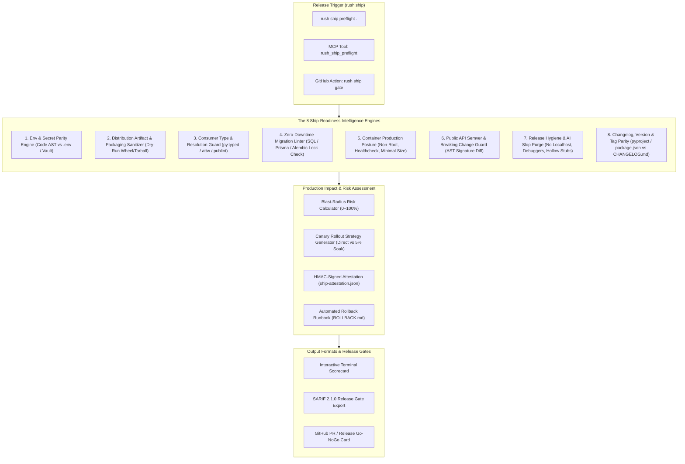
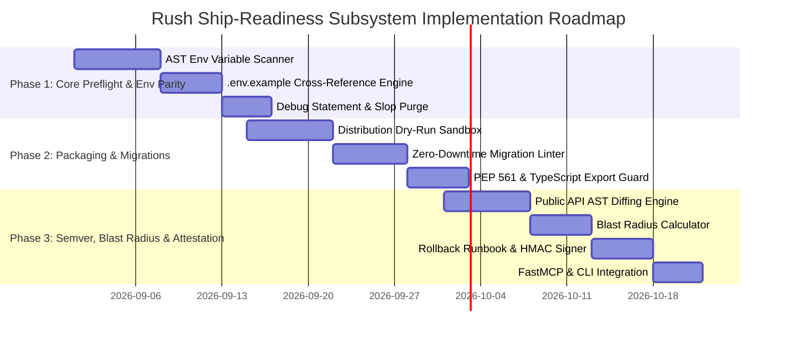

# Deep Research Report: Ship-Readiness Intelligence, Open-Source Ecosystems & Next-Generation Quality Scanners for Rush

**Author**: Antigravity Deep Research Subsystem  
**Target Repository**: `rush-cli`  
**Date**: August 2026  
**Status**: Proposal & Architectural Blueprint  

---

## Executive Summary

As software engineering accelerates through AI-assisted pair-programming and autonomous agent workflows, the traditional definition of "quality" (linting + unit tests) is no longer sufficient to guarantee that a repository is **ready to ship to production**. Modern deployment failures rarely stem from simple syntax errors; they happen when:
1. **Environment Variables Drift**: Code calls `process.env.STRIPE_SECRET_KEY` or `os.environ["DATABASE_URL"]`, but the key was never added to `.env.example`, Kubernetes ConfigMaps, or production secret managers.
2. **Distribution Artifacts Leak Secrets or Test Fixtures**: Published Python wheels (`.whl`) or npm tarballs (`.tgz`) accidentally bundle `.env` files, internal credentials, test databases, unminified source maps, or missing `py.typed` / CJS-ESM entrypoints.
3. **Database Migrations Break Zero-Downtime Deploys**: A migration introduces `ALTER TABLE ... NOT NULL` without a default value or drops a column while old application instances are still serving traffic.
4. **Breaking API Changes Violate Semver**: Public functions or REST/GraphQL endpoints change signatures without a corresponding Major semver bump, breaking downstream consumers.
5. **Debug Artifacts and AI Slop Reach Production**: Hardcoded `localhost:3000` URLs, `debugger;`, `pdb.set_trace()`, or empty `# TODO: implement` stubs slip into release branches.
6. **No Automated Rollback Runbook Exists**: When a canary deployment fails, engineers scramble to identify which database migration or git commit to revert.

This report synthesizes extensive research across the open-source ecosystem, evaluates the best integration candidates, and proposes a groundbreaking new subsystem for Rush: **`rush ship` (Ship-Readiness & Release Pre-Flight Intelligence)**.

---

## 1. Competitive Analysis & Open-Source Landscape

We surveyed existing open-source tools, CLI utilities, and pre-publish scanners across GitHub to identify best practices, strengths, and structural gaps.

```mermaid
quadrantChart
    title Open-Source Ship-Readiness Landscape
    x-axis Low Language Breadth --> High Language Breadth (Polyglot)
    y-axis Static Syntax Only --> Full Production Pre-Flight Intelligence
    quadrant-1 Rush "rush ship" (Unified Pre-Flight)
    quadrant-2 OpsLevel / Cortex (Enterprise SaaS)
    quadrant-3 publish-please / check-wheel-contents (Single Stack)
    quadrant-4 OpenSSF Scorecard / Trivy (Security Focused)
    "check-wheel-contents": [0.25, 0.35]
    "publint / attw": [0.30, 0.40]
    "dotenv-linter": [0.45, 0.25]
    "delivery-gate": [0.55, 0.65]
    "agents-shipgate": [0.60, 0.70]
    "shipcheck-cli": [0.50, 0.60]
    "OpenSSF Scorecard": [0.75, 0.55]
    "Trivy / Hadolint": [0.80, 0.45]
    "Rush 'rush ship'": [0.90, 0.95]
```

### Table of Notable Open-Source Repositories & Tools

| Repository / Tool | Ecosystem | Core Focus | Strengths | Limitations & Gaps |
|---|---|---|---|---|
| **[`check-wheel-contents`](https://github.com/jwodder/check-wheel-contents)** | Python | Wheel distribution integrity | Catches misplaced files, tests bundled in wheels, missing licenses | Python only; does not verify runtime imports or typing compatibility |
| **[`publint`](https://github.com/bluwy/publint)** | JavaScript / TypeScript | `package.json` export linting | Validates `exports` maps across Node, Vite, Webpack, CJS/ESM | JS/TS only; ignores environment variables, database schemas, and git state |
| **[`@arethetypeswrong/cli`](https://github.com/arethetypeswrong/arethetypeswrong.github.io)** (`attw`) | TypeScript | Type declaration resolution | Validates that consumers in both ESM and CJS can resolve `.d.ts` definitions | TypeScript only; does not test actual runtime execution |
| **[`publish-please`](https://github.com/inikulin/publish-please)** | Node.js | Safe pre-publish gate | Runs pre-publish checklists (git status, tests, tag verification) | Node-specific; lacks deep AST analysis and blast-radius modeling |
| **[`delivery-gate`](https://github.com/ramenprotokol/delivery-gate)** | Polyglot / Python | Release readiness gate | Combines automated checks with human attestations | Heavy reliance on manual checklists; no AST parsing or zero-downtime linting |
| **[`agents-shipgate`](https://github.com/ThreeMoonsLab/agents-shipgate)** | AI / MCP / OpenAPI | AI Tool surface readiness | Audits MCP schemas and OpenAPI definitions for agent compatibility | Specialized solely on AI agent interfaces; misses core backend/infra |
| **[`dotenv-linter`](https://github.com/dotenv-linter/dotenv-linter)** | Polyglot | Environment file hygiene | Checks syntax, ordering, duplicate keys in `.env` files | Does not inspect source code to see if code matches `.env` definitions |
| **[`griffe`](https://github.com/mkdocstrings/griffe)** | Python | API signature inspection | Extracts API signatures to detect breaking changes | Python only; lacks container and packaging validation |
| **[`dockle`](https://github.com/goodwithtech/dockle)** | Container | Container image CIS benchmark | Checks non-root user, credential leaks, and unnecessary permissions | Scans built images only; doesn't evaluate application logic or schema migrations |
| **[`infracost`](https://github.com/infracost/infracost)** | Cloud / Terraform | Cloud cost estimation | Flags infrastructure cost spikes before merge | Cloud-infrastructure specific; doesn't evaluate application code |

---

## 2. The Core Gap: Why Existing Solutions Fall Short

1. **Fragmentation & Silos**: A modern application consists of Python/TypeScript backend services, SQL migrations, Dockerfiles, GitHub Actions CI workflows, and `.env` configs. Checking these requires running 10 separate tools with 10 disparate output formats.
2. **Missing Code-to-Config Correlation**: Linters check code syntax; `dotenv-linter` checks `.env` syntax. **No existing tool cross-references the code's Abstract Syntax Tree against the `.env.example` and production secrets**.
3. **Ignorance of Zero-Downtime Migration Hazards**: Linters don't understand that dropping a column or adding a non-nullable column without a default locks tables or breaks active application containers during rolling deploys.
4. **Vibecoding & AI Slop Contamination**: AI assistants frequently leave debug statements (`console.log`, `print()`), local test ports (`http://localhost:8080`), and unfulfilled mock data in release branches.
5. **No Blast-Radius or Rollback Intelligence**: Current gates give a binary pass/fail without telling developers: *"This release modifies 3 critical payment routes and 1 user table; blast radius is HIGH; rollout should be a 5% canary with a 15-minute soak."*

---

## 3. Innovative Subsystem Blueprint: `rush ship`

We propose introducing a first-of-its-kind, unified **Ship-Readiness Subsystem** to Rush:



---

## 4. Detailed Specification of the 8 Core Ship-Readiness Engines

### Engine 1: Environment & Secret Contract Parity (`rush ship env`)
- **AST Code Extraction**: Parses all Python (`os.environ`, `os.getenv`), TypeScript/JavaScript (`process.env`, `import.meta.env`), and Go (`os.Getenv`) references to identify all runtime environment keys used across the codebase.
- **Contract Cross-Check**:
  - Compares required code keys against `.env.example`, `.env.template`, and Dockerfile `ENV` declarations.
  - Flags any environment variable referenced in code that is missing from documentation.
  - Detects orphan keys defined in `.env.example` that are never referenced in code.
  - Scans for dangerous hardcoded defaults (e.g. `SECRET_KEY = os.getenv("KEY", "super-secret-default")`).

### Engine 2: Distribution Artifact & Packaging Sanitizer (`rush ship pack`)
- **Dry-Run Package Assembly**: Builds candidate `.whl`, `.tar.gz`, or `npm pack` archives in an ephemeral RAM sandbox.
- **Sanitization Filter**:
  - Verifies zero `.env`, `.pem`, `.key`, or `.git` files are included.
  - Ensures no `tests/`, `fixtures/`, or mock SQLite databases are bundled.
  - Checks executable permissions and shebang lines (`#!/usr/bin/env python3` or `#!/usr/bin/env node`) on declared CLI binary entrypoints.
  - Audits total uncompressed archive size against configured maximum payload budgets.

### Engine 3: Consumer Type & Resolution Guard (`rush ship types`)
- **Python**: Verifies that PEP 561 marker file `py.typed` is present in package roots, preventing downstream consumers from seeing `Untyped module` errors in `mypy`.
- **TypeScript / JavaScript**: Integrates `@arethetypeswrong/cli` and `publint` to verify `exports` maps, ensuring that both CommonJS (`require()`) and ESM (`import`) consumers resolve type definitions cleanly.

### Engine 4: Zero-Downtime Database Migration Linter (`rush ship migration`)
- **Schema Lock & Hazard Detection**:
  - Inspects new SQL scripts, Prisma migrations, or Alembic revisions in the release scope.
  - Flags dangerous DDL operations that cause exclusive table locks:
    - Adding `NOT NULL` columns without a `DEFAULT` clause.
    - Dropping columns or renaming tables without a prior deprecation cycle.
    - Adding unindexed foreign keys on large tables.
    - Altering column data types that trigger a full table rewrite.

### Engine 5: Container Production Posture (`rush ship container`)
- **Docker & OCI Readiness**:
  - Verifies `USER` directive is present and does not run as `root` (UID 0).
  - Checks for explicit `HEALTHCHECK` instructions.
  - Enforces multi-stage build patterns (verifying build tools like `gcc` or `npm` are excluded from final images).
  - Scans for latest tag pinning (flagging `FROM node:latest` in favor of digest/version pins like `node:20.12-alpine`).

### Engine 6: Public API Semver & Breaking Change Guard (`rush ship semver`)
- **AST API Signature Diffing**:
  - Compares the public module exports (`__all__`, exported functions/classes) against the latest Git release tag.
  - Flags breaking changes:
    - Removing public functions or methods.
    - Adding mandatory positional parameters to existing functions.
    - Changing return type annotations.
  - Verifies that if breaking changes exist, the version bump in `pyproject.toml` / `package.json` is a **MAJOR** version bump under Semantic Versioning 2.0.0.

### Engine 7: Release Hygiene & AI Slop Purge (`rush ship hygiene`)
- **Pre-Flight Sanity Sweep**:
  - Detects active debuggers: `pdb.set_trace()`, `breakpoint()`, `debugger;`, `console.log()`, `print()`.
  - Flags hardcoded internal URLs: `http://localhost`, `127.0.0.1`, `http://0.0.0.0`, `test.example.com`.
  - Scans for unresolved release blockers: `TODO(ship)`, `FIXME(prod)`, `@unimplemented`.
  - Detects empty placeholder stubs or unfulfilled mock implementations.

### Engine 8: Changelog & Tag Parity (`rush ship release-check`)
- **Release Documentation Verification**:
  - Verifies that the version declared in `pyproject.toml` or `package.json` matches a top-level section in `CHANGELOG.md`.
  - Checks that `CHANGELOG.md` contains entries for all PRs and commits since the previous git release tag.
  - Ensures repository git state is clean (no untracked files, no uncommitted changes).

---

## 5. Blast-Radius Scoring & Automated Rollback Runbooks

Beyond simple pass/fail checks, `rush ship` provides operational decision intelligence:

### A. Blast-Radius Scoring Algorithm

$$\text{Blast Radius} = \sum (\text{Surface Weight} \times \text{File Churn} \times \text{Complexity})$$

| Impact Surface | Surface Weight | Examples |
|---|---|---|
| **Critical Core** | `3.0x` | Auth middleware, payment routes, cryptography, DB migrations |
| **Business Logic** | `1.5x` | Services, API controllers, worker tasks |
| **Frontend UI** | `1.0x` | Components, stylesheets, client views |
| **Documentation & Tests**| `0.1x` | Markdown docs, unit test files |

- **Low Risk (0–25%)**: Safe for direct zero-downtime deployment.
- **Medium Risk (26–60%)**: Recommends blue/green deployment with smoke testing.
- **High Risk (61–100%)**: Recommends a **5% canary rollout with a 15-minute soak period** and alerts on-call engineers.

### B. Automated Rollback Runbook Generation (`ROLLBACK.md`)

Whenever `rush ship preflight` passes, it generates a deterministic, instant-execution rollback guide:
```markdown
# Rollback Runbook: Release v0.3.0
- **Target Git Revert Hash**: `git revert -m 1 9f9fdbd`
- **Database Rollback Command**: `alembic downgrade 4a3a71d`
- **Canary Abort Threshold**: Error rate > 0.5% or P99 Latency > 450ms
- **On-Call Escalation**: `#incident-response`
```

---

## 6. Proposed CLI & FastMCP Interface

```bash
# 1. Complete Pre-Flight Ship-Readiness Check (All 8 Engines)
rush ship preflight .

# 2. Environment Parity Audit Only
rush ship env .

# 3. Packaging & Distribution Artifact Sanitizer
rush ship pack .

# 4. Zero-Downtime Migration Safety Check
rush ship migration .

# 5. Public API Breaking Change & Semver Guard
rush ship semver .

# 6. Generate Cryptographically Signed Release Attestation & Rollback Runbook
rush ship attestation --sign --output ship-attestation.json
```

### FastMCP Tool Registrations for AI Coding Agents:
- `rush_ship_preflight`: Evaluates repository ship-readiness and returns structured findings.
- `rush_ship_env`: Cross-checks environment variable usage against documentation.
- `rush_ship_blast_radius`: Computes release risk score and canary rollout strategy.

---

## 7. Phased Implementation Roadmap



---

## 8. Conclusion

Implementing **`rush ship`** elevates Rush from a local code linter into an **end-to-end Release & Production Readiness Intelligence Platform**. By combining AST-level environment auditing, distribution artifact sanitization, zero-downtime database checks, semver breaking change detection, and automated rollback runbooks, Rush will provide developers and autonomous coding agents with the most comprehensive, bulletproof shipping gate in the software industry.
