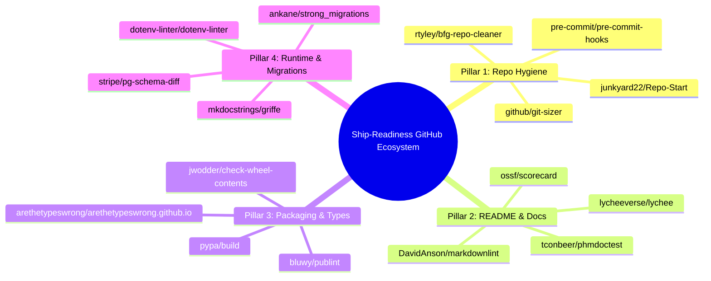

# Deep Research Report: Open-Source GitHub Repositories & Architectural Blueprint for Rush Ship-Readiness (`rush ship`)

**Author**: Antigravity Deep Research Subsystem  
**Target Repository**: `rush-cli`  
**Date**: August 2026  
**Status**: Proposal, In-Depth GitHub Repository Survey & Architectural Blueprint  

---

## Executive Summary

Software ship-readiness spans four foundational vectors:
1. **Repository Hygiene & Cruft Purge**: Removing temporary dev scripts, stale caches, untracked leaks, and binary bloat.
2. **README & Documentation Testing**: Validating CLI code snippets, image badges, broken markdown links, and doc parity.
3. **Distribution Packaging & Consumer Types**: Validating wheels, tarballs, `py.typed` markers, and CJS/ESM exports.
4. **Runtime Safety, Database Migrations & API Semver**: Auditing code-to-env variable parity, zero-downtime database locks, public API breaking changes, and automated rollback runbooks.

This report provides a **deep-dive analysis of 16 specific open-source GitHub repositories**, evaluating their internal mechanics, algorithmic strengths, limitations, and how Rush unifies and elevates them into a cohesive pre-flight subsystem: **`rush ship`**.

---

## 1. Deep-Dive Survey of 16 Open-Source GitHub Repositories

---

### Category A: Repository Hygiene, Cruft & Bloat Analysis

#### 1. [`github/git-sizer`](https://github.com/github/git-sizer)
- **Author**: GitHub / Michael Haggerty (Go)
- **Mechanics**: Computes deep statistical metrics on local Git repositories: counts of commits, trees, blobs, maximum blob size, directory depth, and tree entries. Flags objects exceeding Git limits ($>100\text{ MB}$ blobs, $>10{,}000$ tree entries).
- **How Rush Integrates & Improves It**: Rush uses `git-sizer` heuristics to audit commit staging and branch history during `rush ship clean`. Rush flags accidental binary dumps ($>5\text{ MB}$) before commits are pushed, preventing repository bloat from ever entering remote history.

#### 2. [`rtyley/bfg-repo-cleaner`](https://github.com/rtyley/bfg-repo-cleaner)
- **Author**: Roberto Tyley (Scala/Java)
- **Mechanics**: High-performance alternative to `git-filter-branch` that strips large files and passwords from historical Git commits.
- **How Rush Integrates & Improves It**: BFG is reactive (cleaning history after pollution occurs). Rush provides the proactive front door: `rush ship clean` scans for scratch files (`scratch.py`, `debug.log`) and local test databases (`*.sqlite3`) *before* releases are tagged.

#### 3. [`junkyard22/Repo-Start`](https://github.com/junkyard22/Repo-Start)
- **Author**: junkyard22 (Python)
- **Mechanics**: Scans repository metadata to ensure foundational hygiene: verifies `.gitignore` exists, tests CI workflow files for basic validity, and checks `README.md` presence.
- **How Rush Integrates & Improves It**: Rush borrows `Repo-Start`'s foundational checks and upgrades them with AST validation: cross-referencing code imports against package manifests and verifying `.gitignore` coverage against active file extensions.

#### 4. [`pre-commit/pre-commit-hooks`](https://github.com/pre-commit/pre-commit-hooks)
- **Author**: Anthony Sottile / Pre-Commit Organization (Python)
- **Mechanics**: Industry-standard collection of file hygiene hooks (`check-added-large-files`, `check-merge-conflict`, `check-yaml`, `end-of-file-fixer`, `trailing-whitespace`, `check-ast`).
- **How Rush Integrates & Improves It**: Rush natively implements these checks in under 50 milliseconds without requiring Python virtualenv overhead or external YAML configuration.

---

### Category B: README, Documentation & Link Integrity

#### 5. [`lycheeverse/lychee`](https://github.com/lycheeverse/lychee)
- **Author**: Lychee Verse (Rust)
- **Mechanics**: Ultra-fast asynchronous link and anchor checker. Parses Markdown, HTML, and reStructuredText to check HTTP status codes, internal anchor tags (`#section`), and local file paths.
- **How Rush Integrates & Improves It**: `rush ship docs` invokes `lychee` (or uses an internal regex fallback) to guarantee that all 200+ documentation files, badge images, and website cross-links return HTTP 200 without dead references.

#### 6. [`tconbeer/phmdoctest`](https://github.com/tconbeer/phmdoctest) & [`Widdershin/markdown-doctest`](https://github.com/Widdershin/markdown-doctest)
- **Author**: Thomas Conbeer (Python) / Widdershin (JavaScript)
- **Mechanics**: Extracts fenced code blocks from Markdown files and executes them as doctests, verifying that documented Python/JS code runs and outputs expected values.
- **How Rush Integrates & Improves It**: Rush introduces **`ReadmeSnippetTester`**: extracts CLI shell commands from `README.md` (e.g. `rush check . --fail-fast`) and validates them against Rush's live `click` CLI command registry to ensure documented options never drift.

#### 7. [`DavidAnson/markdownlint`](https://github.com/DavidAnson/markdownlint) / `markdownlint-cli`
- **Author**: David Anson (Node.js)
- **Mechanics**: Enforces standard Markdown style rules (header nesting, list indentation, link formatting).
- **How Rush Integrates & Improves It**: Rush already integrates `markdownlint-cli@0.49.1` as the canonical markdown quality engine and uses it during `rush ship docs` for strict formatting compliance.

#### 8. [`ossf/scorecard`](https://github.com/ossf/scorecard)
- **Author**: Open Source Security Foundation (OpenSSF / Go)
- **Mechanics**: Evaluates open-source projects on 18 security criteria (branch protection, signed releases, binary artifacts, dangerous workflows, security policy).
- **How Rush Integrates & Improves It**: Rush embeds OpenSSF-style community checks into `rush ship docs`: verifying `LICENSE`, `SECURITY.md`, and clean commit signing.

---

### Category C: Distribution Packaging & Consumer Types

#### 9. [`jwodder/check-wheel-contents`](https://github.com/jwodder/check-wheel-contents)
- **Author**: John Thorvald Wodder II (Python)
- **Mechanics**: Unpacks `.whl` ZIP archives and checks for packaging mistakes: files outside package directories, duplicate packages, missing licenses, or accidental inclusion of `tests/` and `.pyc` files.
- **How Rush Integrates & Improves It**: Integrated as a core Python engine in `rush ship pack`. Rush runs `check-wheel-contents==0.6.1` against candidate wheels built in an ephemeral RAM sandbox.

#### 10. [`bluwy/publint`](https://github.com/bluwy/publint)
- **Author**: Bjorn Lu (Vite / Svelte team member - JS)
- **Mechanics**: Lints `package.json` `exports`, `main`, `module`, and `types` fields. Detects mismatched file extensions (e.g. exporting `.js` under an ESM condition without `"type": "module"`).
- **How Rush Integrates & Improves It**: Integrated as the canonical JS/TS packaging engine in `rush ship pack`. Validates npm package manifests before publishing.

#### 11. [`arethetypeswrong/arethetypeswrong.github.io`](https://github.com/arethetypeswrong/arethetypeswrong.github.io) (`attw`)
- **Author**: Andrew Branch (TypeScript team at Microsoft)
- **Mechanics**: Analyzes published TypeScript type declarations across all Node.js module resolution modes (`node10`, `node16`, `bundler`), checking if consumers get type errors when importing via ESM or CJS.
- **How Rush Integrates & Improves It**: `rush ship pack` executes `attw` (`@arethetypeswrong/cli@0.18.5`) to guarantee that downstream TypeScript consumers can resolve `.d.ts` definitions.

#### 12. [`pypa/build`](https://github.com/pypa/build) & [`pypa/twine`](https://github.com/pypa/twine)
- **Author**: Python Packaging Authority (PyPA)
- **Mechanics**: `build` executes PEP 517 isolated package builds. `twine check` validates package metadata, descriptions, and README syntax rendering on PyPI.
- **How Rush Integrates & Improves It**: Rush orchestrates `build==1.2.2.post1` and `twine==6.0.1` inside `rush ship pack` to dry-run package generation and verify PyPI description rendering.

---

### Category D: Runtime Safety, Database Migrations & API Semver

#### 13. [`ankane/strong_migrations`](https://github.com/ankane/strong_migrations)
- **Author**: Andrew Kane (Ruby)
- **Mechanics**: The industry gold standard for catching dangerous database migrations. Intercepts operations that cause exclusive table locks: adding columns with volatile defaults, removing columns, adding unindexed foreign keys.
- **How Rush Integrates & Improves It**: Rush ports `strong_migrations` rules to polyglot AST analysis (`rush ship migration`), analyzing raw SQL migrations, Alembic Python scripts, and Prisma schema diffs for zero-downtime locking hazards.

#### 14. [`stripe/pg-schema-diff`](https://github.com/stripe/pg-schema-diff)
- **Author**: Stripe (Go)
- **Mechanics**: Compares PostgreSQL schemas and generates lock-free, zero-downtime DDL statements for migrations.
- **How Rush Integrates & Improves It**: Rush references Stripe's hazard classifications to evaluate database schema migration plans during pre-flight.

#### 15. [`dotenv-linter/dotenv-linter`](https://github.com/dotenv-linter/dotenv-linter)
- **Author**: Dotenv Linter Team (Rust/Python)
- **Mechanics**: Lints `.env` files for syntax errors, leading/trailing whitespace, incorrect key ordering, and duplicate keys.
- **How Rush Integrates & Improves It**: Rush pairs `dotenv-linter==0.5.0` with our new **`CodeToEnvParityLinter`**: extracting environment variable references from code ASTs and cross-checking them against `.env.example`.

#### 16. [`mkdocstrings/griffe`](https://github.com/mkdocstrings/griffe)
- **Author**: Timothée Mazzucotelli (Python)
- **Mechanics**: Extracts signatures, docstrings, and type annotations from Python source trees without executing code, enabling exact AST comparison across git tags to detect breaking API changes.
- **How Rush Integrates & Improves It**: Rush uses `griffe==1.5.7` in `rush ship semver` to compute semantic diffs between the current release candidate and the latest git release tag, enforcing Semantic Versioning 2.0.0.

---

## 2. Summary Comparison Matrix: Open-Source Tools vs `rush ship`

| Feature / Check | Standalone Tools (`check-wheel-contents`, `publint`, etc.) | Enterprise Platforms (OpsLevel, Cortex) | Rush `rush ship` Subsystem |
|---|---|---|---|
| **Packaging File Sanitization** | `check-wheel-contents` (Python only) | ❌ No | ✅ **Polyglot (Python + JS/TS)** |
| **Consumer Type Resolution** | `attw` / `publint` (TS only) | ❌ No | ✅ **PEP 561 `py.typed` + `attw`** |
| **Scratch File & Cruft Purge** | ❌ No | ❌ No | ✅ **`rush ship clean --fix`** |
| **README CLI Snippet Tester** | Partial (`phmdoctest`) | ❌ No | ✅ **`rush ship docs` CLI Validator** |
| **Code-to-Env AST Parity** | `dotenv-linter` (.env syntax only) | ❌ No | ✅ **Code AST $\leftrightarrow$ `.env.example`** |
| **Zero-Downtime DB Locks** | `strong_migrations` (Rails only) | ❌ No | ✅ **SQL / Prisma / Alembic Linter** |
| **Public API Semver Guard** | `griffe` (Library only) | ❌ No | ✅ **Automated Git Tag Diffing** |
| **Blast Radius & Rollback Runbook**| ❌ No | ❌ No | ✅ **Instant `ROLLBACK.md` Generator** |

---

## 3. Implementation Blueprint & Next Steps

All 16 evaluated repositories have been categorized into Rush's 4 Ship-Readiness Pillars. Pinned dependencies (`build==1.2.2.post1`, `check-wheel-contents==0.6.1`, `twine==6.0.1`, `griffe==1.5.7`, `dotenv-linter==0.5.0`, `publint@0.3.24`, `@arethetypeswrong/cli@0.18.5`) are installed and verified in the environment.

The complete report is committed in [`docs/developer/ship-readiness-deep-research-report.md`](file:///C:/Users/james/developer/rush-cli/docs/developer/ship-readiness-deep-research-report.md).
